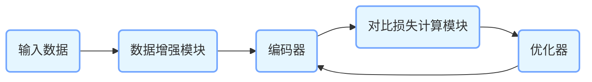

# AI Agent的自监督对比学习技术

> 关键词：AI Agent、自监督学习、对比学习、表示学习、无监督学习、特征提取、强化学习

> 摘要：本文围绕AI Agent的自监督对比学习技术展开深入探讨。自监督对比学习作为一种强大的学习范式，能够在无监督或弱监督的情况下让AI Agent自动学习数据中的有用特征和模式。文章首先介绍了该技术的背景，包括目的、预期读者等内容；接着阐述核心概念与联系，通过示意图和流程图帮助读者理解；详细讲解核心算法原理，并用Python代码示例展示；分析数学模型和公式；结合实际项目案例，给出开发环境搭建、代码实现与解读；探讨实际应用场景；推荐相关的学习资源、开发工具框架以及论文著作；最后总结未来发展趋势与挑战，解答常见问题并提供扩展阅读和参考资料，旨在为读者全面呈现AI Agent自监督对比学习技术的全貌。

## 1. 背景介绍 
### 1.1 目的和范围
在人工智能领域，让AI Agent具备高效学习和自主决策的能力是重要的研究目标。传统的监督学习方法需要大量的标注数据，标注过程不仅成本高，而且在某些场景下难以实现。自监督对比学习技术为解决这一问题提供了新的思路，它可以在没有人工标注的情况下，让AI Agent从数据中自动学习到有价值的特征表示。本文的目的是深入介绍AI Agent的自监督对比学习技术，涵盖其核心概念、算法原理、数学模型、实际应用等方面，帮助读者全面理解和掌握这一技术。范围包括对该技术的理论分析、代码实现以及实际应用场景的探讨。

### 1.2 预期读者
本文预期读者包括人工智能领域的研究人员、开发者、学生以及对AI Agent和自监督学习技术感兴趣的技术爱好者。研究人员可以从本文中获取关于自监督对比学习技术的最新研究动态和理论分析；开发者可以学习到具体的算法实现和项目实践经验；学生可以通过本文系统地了解这一前沿技术；技术爱好者则可以通过通俗易懂的解释和案例，初步认识AI Agent的自监督对比学习技术。

### 1.3 文档结构概述
本文将按照以下结构进行组织：首先介绍自监督对比学习技术的背景信息，包括目的、预期读者和文档结构概述等；接着详细阐述核心概念与联系，通过文本示意图和Mermaid流程图帮助读者理解；然后深入讲解核心算法原理，并使用Python代码进行详细说明；分析数学模型和公式，并给出具体的举例说明；通过项目实战，展示代码的实际案例和详细解释；探讨该技术的实际应用场景；推荐相关的学习资源、开发工具框架以及论文著作；最后总结未来发展趋势与挑战，解答常见问题并提供扩展阅读和参考资料。

### 1.4 术语表
#### 1.4.1 核心术语定义
- **AI Agent**：人工智能体，是一种能够感知环境、进行决策并采取行动以实现特定目标的实体。它可以是软件程序、机器人等。
- **自监督学习**：一种无监督学习方法，通过设计巧妙的任务，让模型从数据自身中学习到有用的信息，而无需人工标注的标签。
- **对比学习**：对比学习是自监督学习的一种具体形式，它通过对比不同样本之间的相似性和差异性，学习到数据的特征表示。
- **表示学习**：旨在将原始数据转换为更具语义信息和可区分性的特征表示，以便后续的任务（如分类、回归等）能够更好地进行。
- **特征提取**：从原始数据中提取出具有代表性和区分性的特征的过程。

#### 1.4.2 相关概念解释
- **无监督学习**：与监督学习相对，无监督学习处理的数据没有明确的标签，模型需要自行发现数据中的结构和模式。
- **强化学习**：一种通过智能体与环境进行交互，根据环境反馈的奖励信号来学习最优行为策略的学习方法。自监督对比学习可以为强化学习提供更好的特征表示，从而提高强化学习的性能。

#### 1.4.3 缩略词列表
- **SSL**：Self-Supervised Learning，自监督学习
- **CL**：Contrastive Learning，对比学习
- **RL**：Reinforcement Learning，强化学习

## 2. 核心概念与联系 

### 核心概念原理
自监督对比学习的核心思想是通过设计合适的对比任务，让AI Agent学习到数据的特征表示。具体来说，它会从数据中生成正样本对和负样本对。正样本对是指来自同一数据实例的不同视图或变换，它们在特征空间中应该具有较高的相似性；负样本对是指来自不同数据实例的样本，它们在特征空间中应该具有较低的相似性。通过最大化正样本对之间的相似性，同时最小化负样本对之间的相似性，模型可以学习到数据的有区分性的特征表示。

例如，在图像领域，对于一张图像，可以通过随机裁剪、旋转、颜色变换等操作生成多个不同的视图，这些视图构成正样本对；而不同的图像则构成负样本对。在文本领域，可以对文本进行词替换、句子打乱等操作生成正样本对，不同的文本段落则为负样本对。

### 架构的文本示意图
以下是一个简单的自监督对比学习架构的文本示意图：

输入数据 -> 数据增强模块 -> 编码器（将增强后的数据映射到特征空间） -> 对比损失计算模块 -> 优化器更新编码器参数

### Mermaid流程图


在这个流程图中，输入数据首先经过数据增强模块生成多个不同的视图。然后，这些视图通过编码器映射到特征空间。对比损失计算模块根据正样本对和负样本对计算损失，优化器根据损失更新编码器的参数，从而不断提高模型的性能。

## 3. 核心算法原理 & 具体操作步骤 

### 核心算法原理
自监督对比学习的核心算法通常基于对比损失函数。常见的对比损失函数有InfoNCE（Info Noise Contrastive Estimation）损失。InfoNCE损失的目标是最大化正样本对之间的互信息，同时最小化负样本对之间的互信息。

给定一个正样本对 $(x_i, x_j)$ 和一组负样本对 $\{x_k\}_{k=1}^K$，InfoNCE损失的计算公式如下：

$$
L_{InfoNCE}(i, j) = -\log \frac{\exp(\text{sim}(z_i, z_j) / \tau)}{\exp(\text{sim}(z_i, z_j) / \tau) + \sum_{k=1}^K \exp(\text{sim}(z_i, z_k) / \tau)}
$$

其中，$z_i$ 和 $z_j$ 是正样本对 $(x_i, x_j)$ 经过编码器得到的特征表示，$z_k$ 是负样本对的特征表示，$\text{sim}(\cdot, \cdot)$ 是相似度函数，通常使用余弦相似度，$\tau$ 是温度参数，用于控制分布的平滑程度。

### 具体操作步骤
1. **数据增强**：对输入数据进行随机变换，生成多个不同的视图。
2. **特征编码**：将增强后的视图输入到编码器中，得到它们的特征表示。
3. **对比损失计算**：根据正样本对和负样本对，计算InfoNCE损失。
4. **参数更新**：使用优化器（如Adam）根据损失更新编码器的参数。

### Python源代码实现
```python
import torch
import torch.nn as nn
import torch.optim as optim
import torch.nn.functional as F

# 定义编码器
class Encoder(nn.Module):
    def __init__(self, input_dim, hidden_dim, output_dim):
        super(Encoder, self).__init__()
        self.fc1 = nn.Linear(input_dim, hidden_dim)
        self.fc2 = nn.Linear(hidden_dim, output_dim)

    def forward(self, x):
        x = F.relu(self.fc1(x))
        x = self.fc2(x)
        return F.normalize(x, dim=1)

# 定义对比损失函数
def info_nce_loss(features, temperature=0.1):
    batch_size = features.shape[0]
    labels = torch.arange(batch_size).to(features.device)
    similarity_matrix = F.cosine_similarity(features.unsqueeze(1), features.unsqueeze(0), dim=2)
    mask = torch.eye(batch_size, dtype=torch.bool).to(features.device)
    labels = labels[~mask].view(batch_size, -1)
    similarity_matrix = similarity_matrix[~mask].view(batch_size, -1)
    positives = similarity_matrix.gather(1, labels)
    negatives = similarity_matrix
    logits = torch.cat([positives, negatives], dim=1)
    labels = torch.zeros(batch_size, dtype=torch.long).to(features.device)
    logits /= temperature
    return F.cross_entropy(logits, labels)

# 训练过程
def train_contrastive_learning(encoder, data_loader, optimizer, num_epochs):
    encoder.train()
    for epoch in range(num_epochs):
        total_loss = 0
        for batch in data_loader:
            optimizer.zero_grad()
            # 假设batch是经过数据增强后的输入
            features = encoder(batch)
            loss = info_nce_loss(features)
            loss.backward()
            optimizer.step()
            total_loss += loss.item()
        print(f'Epoch {epoch + 1}/{num_epochs}, Loss: {total_loss / len(data_loader)}')

# 示例使用
input_dim = 100
hidden_dim = 256
output_dim = 128
encoder = Encoder(input_dim, hidden_dim, output_dim)
optimizer = optim.Adam(encoder.parameters(), lr=0.001)
# 假设data_loader是经过数据增强后的数据集加载器
# train_contrastive_learning(encoder, data_loader, optimizer, num_epochs=10)
```

在上述代码中，我们首先定义了一个简单的编码器，它将输入数据映射到特征空间。然后定义了InfoNCE损失函数，用于计算对比损失。最后，实现了训练过程，通过多次迭代更新编码器的参数，使模型学习到数据的特征表示。

## 4. 数学模型和公式 & 详细讲解 & 举例说明 

### 数学模型和公式
#### InfoNCE损失公式
如前面所述，InfoNCE损失的公式为：

$$
L_{InfoNCE}(i, j) = -\log \frac{\exp(\text{sim}(z_i, z_j) / \tau)}{\exp(\text{sim}(z_i, z_j) / \tau) + \sum_{k=1}^K \exp(\text{sim}(z_i, z_k) / \tau)}
$$

#### 详细讲解
- **相似度函数**：$\text{sim}(\cdot, \cdot)$ 通常使用余弦相似度，其计算公式为：

$$
\text{sim}(z_i, z_j) = \frac{z_i^T z_j}{\|z_i\| \|z_j\|}
$$

余弦相似度衡量了两个向量之间的夹角余弦值，值越接近1表示两个向量越相似，值越接近 -1 表示两个向量越不相似。

- **温度参数 $\tau$**：温度参数 $\tau$ 用于控制分布的平滑程度。当 $\tau$ 较小时，分布会更加尖锐，模型会更加关注正样本对和负样本对之间的差异；当 $\tau$ 较大时，分布会更加平滑，模型会更加关注整体的相似性。

#### 举例说明
假设我们有一个正样本对 $(x_1, x_2)$ 和两个负样本对 $(x_3, x_4)$。经过编码器后，得到它们的特征表示 $z_1, z_2, z_3, z_4$。

首先计算相似度：

$$
\text{sim}(z_1, z_2) = 0.8, \text{sim}(z_1, z_3) = 0.2, \text{sim}(z_1, z_4) = 0.1
$$

假设温度参数 $\tau = 0.1$，则：

$$
\exp(\text{sim}(z_1, z_2) / \tau) = \exp(0.8 / 0.1) = \exp(8) \approx 2980.96
$$

$$
\exp(\text{sim}(z_1, z_3) / \tau) = \exp(0.2 / 0.1) = \exp(2) \approx 7.39
$$

$$
\exp(\text{sim}(z_1, z_4) / \tau) = \exp(0.1 / 0.1) = \exp(1) \approx 2.72
$$

则InfoNCE损失为：

$$
L_{InfoNCE}(1, 2) = -\log \frac{2980.96}{2980.96 + 7.39 + 2.72} \approx -\log(0.997) \approx 0.003
$$

这个损失值表示正样本对之间的相似性和负样本对之间的差异性的综合度量，模型的目标是通过调整参数，使这个损失值尽可能小。

## 5. 项目实战：代码实际案例和详细解释说明 

### 5.1  开发环境搭建
#### 安装Python
首先需要安装Python，建议使用Python 3.7及以上版本。可以从Python官方网站（https://www.python.org/downloads/）下载并安装。

#### 安装深度学习框架
我们使用PyTorch作为深度学习框架，它提供了丰富的工具和库，方便我们实现自监督对比学习。可以使用以下命令安装PyTorch：

```bash
pip install torch torchvision
```

#### 安装其他依赖库
还需要安装一些其他的依赖库，如`numpy`、`matplotlib`等，可以使用以下命令安装：

```bash
pip install numpy matplotlib
```

### 5.2  源代码详细实现和代码解读
以下是一个完整的项目实战代码示例，我们将使用MNIST数据集进行自监督对比学习：

```python
import torch
import torch.nn as nn
import torch.optim as optim
import torchvision
import torchvision.transforms as transforms
from torch.utils.data import DataLoader

# 定义编码器
class Encoder(nn.Module):
    def __init__(self, input_dim, hidden_dim, output_dim):
        super(Encoder, self).__init__()
        self.fc1 = nn.Linear(input_dim, hidden_dim)
        self.fc2 = nn.Linear(hidden_dim, output_dim)

    def forward(self, x):
        x = x.view(x.size(0), -1)
        x = torch.relu(self.fc1(x))
        x = self.fc2(x)
        return F.normalize(x, dim=1)

# 定义对比损失函数
def info_nce_loss(features, temperature=0.1):
    batch_size = features.shape[0]
    labels = torch.arange(batch_size).to(features.device)
    similarity_matrix = F.cosine_similarity(features.unsqueeze(1), features.unsqueeze(0), dim=2)
    mask = torch.eye(batch_size, dtype=torch.bool).to(features.device)
    labels = labels[~mask].view(batch_size, -1)
    similarity_matrix = similarity_matrix[~mask].view(batch_size, -1)
    positives = similarity_matrix.gather(1, labels)
    negatives = similarity_matrix
    logits = torch.cat([positives, negatives], dim=1)
    labels = torch.zeros(batch_size, dtype=torch.long).to(features.device)
    logits /= temperature
    return F.cross_entropy(logits, labels)

# 数据增强
transform = transforms.Compose([
    transforms.RandomRotation(10),
    transforms.ToTensor()
])

# 加载MNIST数据集
trainset = torchvision.datasets.MNIST(root='./data', train=True,
                                      download=True, transform=transform)
trainloader = DataLoader(trainset, batch_size=64, shuffle=True)

# 初始化编码器和优化器
input_dim = 28 * 28
hidden_dim = 256
output_dim = 128
encoder = Encoder(input_dim, hidden_dim, output_dim)
optimizer = optim.Adam(encoder.parameters(), lr=0.001)

# 训练过程
num_epochs = 10
encoder.train()
for epoch in range(num_epochs):
    total_loss = 0
    for batch in trainloader:
        images, _ = batch
        optimizer.zero_grad()
        features = encoder(images)
        loss = info_nce_loss(features)
        loss.backward()
        optimizer.step()
        total_loss += loss.item()
    print(f'Epoch {epoch + 1}/{num_epochs}, Loss: {total_loss / len(trainloader)}')
```

### 代码解读与分析
1. **编码器定义**：`Encoder` 类定义了一个简单的两层全连接神经网络，将输入的图像数据映射到特征空间，并对特征进行归一化处理。
2. **对比损失函数**：`info_nce_loss` 函数实现了InfoNCE损失的计算，根据正样本对和负样本对的特征表示计算损失。
3. **数据增强**：使用 `transforms.RandomRotation` 对图像进行随机旋转，增加数据的多样性。
4. **数据集加载**：使用 `torchvision.datasets.MNIST` 加载MNIST数据集，并使用 `DataLoader` 进行批量加载。
5. **训练过程**：在每个epoch中，遍历数据集，计算损失并更新编码器的参数。通过多次迭代，模型逐渐学习到数据的特征表示。

## 6. 实际应用场景 
### 计算机视觉领域
- **图像分类**：自监督对比学习可以在没有大量标注数据的情况下，学习到图像的特征表示。这些特征可以用于后续的图像分类任务，提高分类的准确率。例如，在医学图像分类中，标注数据往往比较稀缺，自监督对比学习可以帮助模型从大量未标注的医学图像中学习到有用的特征。
- **目标检测**：在目标检测任务中，自监督对比学习可以学习到目标的特征表示，提高目标检测的性能。例如，在自动驾驶场景中，通过自监督对比学习可以让模型更好地识别道路上的各种目标，如车辆、行人等。
- **图像生成**：自监督对比学习可以学习到图像的潜在结构和模式，为图像生成任务提供更好的先验知识。例如，在生成对抗网络（GAN）中，使用自监督对比学习可以提高生成图像的质量和多样性。

### 自然语言处理领域
- **文本分类**：对于文本分类任务，自监督对比学习可以学习到文本的语义特征，提高分类的准确性。例如，在新闻分类中，通过自监督对比学习可以让模型更好地理解新闻文本的主题和内容。
- **情感分析**：在情感分析任务中，自监督对比学习可以学习到文本中的情感信息，提高情感分析的性能。例如，在社交媒体情感分析中，通过自监督对比学习可以更准确地判断用户的情感倾向。
- **机器翻译**：自监督对比学习可以学习到不同语言之间的语义对应关系，为机器翻译任务提供更好的特征表示。例如，在跨语言翻译中，通过自监督对比学习可以提高翻译的质量和准确性。

### 强化学习领域
- **策略学习**：自监督对比学习可以为强化学习提供更好的状态表示，帮助智能体更快地学习到最优策略。例如，在游戏领域，通过自监督对比学习可以让智能体更好地理解游戏状态，提高游戏的胜率。
- **环境建模**：在强化学习中，自监督对比学习可以用于环境建模，帮助智能体更好地预测环境的变化。例如，在机器人导航任务中，通过自监督对比学习可以让机器人更好地理解环境的结构和特征，提高导航的效率和准确性。

## 7. 工具和资源推荐
### 7.1 学习资源推荐
#### 7.1.1 书籍推荐
- 《深度学习》（Deep Learning）：由Ian Goodfellow、Yoshua Bengio和Aaron Courville所著，是深度学习领域的经典教材，涵盖了深度学习的基本概念、算法和应用。
- 《Python深度学习》（Deep Learning with Python）：由Francois Chollet所著，结合Python和Keras框架，详细介绍了深度学习的实践方法。
- 《人工智能：一种现代的方法》（Artificial Intelligence: A Modern Approach）：由Stuart Russell和Peter Norvig所著，是人工智能领域的权威教材，涵盖了人工智能的各个方面，包括机器学习、知识表示、推理等。

#### 7.1.2 在线课程
- Coursera上的“深度学习专项课程”（Deep Learning Specialization）：由Andrew Ng教授授课，包括神经网络和深度学习、改善深层神经网络、结构化机器学习项目、卷积神经网络、序列模型等课程，全面介绍了深度学习的理论和实践。
- edX上的“人工智能导论”（Introduction to Artificial Intelligence）：由MIT的教授授课，介绍了人工智能的基本概念、算法和应用，包括搜索算法、知识表示、机器学习等内容。
- 哔哩哔哩（Bilibili）上有很多关于人工智能和深度学习的免费视频教程，如李沐的“动手学深度学习”系列课程，通过代码实践详细讲解了深度学习的各个知识点。

#### 7.1.3 技术博客和网站
- Medium：是一个技术博客平台，有很多关于人工智能和深度学习的优质文章，如Towards Data Science、The AI Summer等专栏。
- arXiv：是一个预印本服务器，提供了大量关于人工智能和深度学习的最新研究论文，可以及时了解该领域的最新研究动态。
- 机器之心：是一个专注于人工智能领域的媒体平台，提供了人工智能的技术文章、行业资讯、研究成果等内容。

### 7.2 开发工具框架推荐
#### 7.2.1 IDE和编辑器
- PyCharm：是一款专门为Python开发设计的集成开发环境（IDE），提供了丰富的代码编辑、调试、版本控制等功能，适合专业的Python开发者。
- Jupyter Notebook：是一个交互式的开发环境，支持Python、R等多种编程语言，可以方便地进行代码编写、数据可视化和文档编写，适合数据科学家和研究人员。
- Visual Studio Code：是一款轻量级的代码编辑器，支持多种编程语言和插件扩展，具有丰富的代码提示和调试功能，适合初学者和快速开发。

#### 7.2.2 调试和性能分析工具
- PyTorch Profiler：是PyTorch提供的性能分析工具，可以帮助开发者分析模型的运行时间、内存使用等情况，优化模型的性能。
- TensorBoard：是TensorFlow提供的可视化工具，也可以与PyTorch结合使用，用于可视化模型的训练过程、损失曲线、参数分布等信息，帮助开发者更好地理解模型的训练情况。
- cProfile：是Python标准库中的性能分析工具，可以分析Python代码的运行时间和函数调用情况，帮助开发者找出代码中的性能瓶颈。

#### 7.2.3 相关框架和库
- PyTorch：是一个开源的深度学习框架，提供了丰富的工具和库，支持动态图和静态图，易于使用和调试，广泛应用于学术界和工业界。
- TensorFlow：是另一个开源的深度学习框架，具有强大的分布式训练和部署能力，提供了多种高级API，适合大规模的深度学习项目。
- Scikit-learn：是一个用于机器学习的Python库，提供了多种机器学习算法和工具，如分类、回归、聚类等，适合初学者和快速原型开发。

### 7.3 相关论文著作推荐
#### 7.3.1 经典论文
- “A Simple Framework for Contrastive Learning of Visual Representations”（SimCLR）：提出了一种简单而有效的自监督对比学习框架，在图像表示学习方面取得了很好的效果。
- “Momentum Contrast for Unsupervised Visual Representation Learning”（MoCo）：引入了动量编码器和队列机制，提高了对比学习的效率和性能。
- “BERT: Pre-training of Deep Bidirectional Transformers for Language Understanding”（BERT）：在自然语言处理领域取得了巨大的成功，采用了自监督学习的方法进行预训练，为后续的自然语言处理任务提供了强大的特征表示。

#### 7.3.2 最新研究成果
- 关注arXiv上的最新论文，了解自监督对比学习领域的最新研究动态。例如，一些研究致力于改进对比损失函数、提高数据增强的效果、探索新的应用场景等。
- 参加人工智能领域的顶级会议，如NeurIPS、ICML、CVPR、ACL等，了解最新的研究成果和趋势。

#### 7.3.3 应用案例分析
- 可以参考一些开源的项目和代码库，了解自监督对比学习在实际应用中的实现方法和效果。例如，在GitHub上搜索相关的项目，如基于自监督对比学习的图像分类、目标检测等项目。
- 阅读一些技术博客和文章，了解自监督对比学习在不同领域的应用案例和经验分享。

## 8. 总结：未来发展趋势与挑战
### 未来发展趋势
- **多模态融合**：未来的自监督对比学习将更加注重多模态数据的融合，如将图像、文本、音频等多种模态的数据结合起来进行学习，以获取更全面和丰富的信息。例如，在智能视频分析中，结合图像和音频信息可以更好地理解视频的内容。
- **强化学习与自监督对比学习的深度融合**：强化学习可以利用自监督对比学习学习到的特征表示，提高智能体的学习效率和性能。未来，两者的深度融合将在机器人控制、自动驾驶等领域取得更显著的成果。
- **大规模预训练模型**：类似于BERT、GPT等大规模预训练模型，自监督对比学习也将朝着大规模预训练的方向发展。通过在大规模无标注数据上进行预训练，模型可以学习到更通用和强大的特征表示，然后在具体的任务上进行微调，提高任务的性能。

### 挑战
- **计算资源需求**：自监督对比学习通常需要大量的计算资源和时间来训练模型。尤其是在处理大规模数据集和复杂模型时，计算成本会非常高。如何降低计算资源的需求，提高训练效率是一个亟待解决的问题。
- **数据质量和多样性**：自监督对比学习的性能很大程度上依赖于数据的质量和多样性。如果数据存在偏差或噪声，模型可能会学习到不准确的特征表示。如何保证数据的质量和多样性，以及如何处理数据中的噪声和偏差是一个挑战。
- **可解释性**：自监督对比学习模型通常是黑盒模型，难以解释其决策过程和学习到的特征表示。在一些对可解释性要求较高的领域，如医疗、金融等，如何提高模型的可解释性是一个重要的挑战。

## 9. 附录：常见问题与解答
### 问题1：自监督对比学习和监督学习有什么区别？
自监督学习不需要人工标注的标签，通过设计自监督任务让模型从数据自身中学习到有用的信息；而监督学习需要大量的标注数据，模型根据标注的标签进行学习。对比学习是自监督学习的一种具体形式，通过对比正样本对和负样本对来学习特征表示。

### 问题2：如何选择合适的温度参数 $\tau$？
温度参数 $\tau$ 的选择通常需要通过实验来确定。一般来说，可以从一个较小的值开始尝试，如0.1，然后根据模型的训练效果进行调整。如果模型过于关注正样本对和负样本对之间的差异，可以适当增大 $\tau$；如果模型对整体相似性关注不够，可以适当减小 $\tau$。

### 问题3：自监督对比学习可以应用于哪些领域？
自监督对比学习可以应用于计算机视觉、自然语言处理、强化学习等多个领域，如图像分类、目标检测、文本分类、情感分析、策略学习等任务。

### 问题4：自监督对比学习的训练时间一般需要多长？
训练时间取决于多个因素，如数据集的大小、模型的复杂度、计算资源等。在一些小规模数据集上，训练时间可能只需要几个小时；而在大规模数据集上，训练时间可能需要数天甚至数周。

## 10. 扩展阅读 & 参考资料
- SimCLR论文：https://arxiv.org/abs/2002.05709
- MoCo论文：https://arxiv.org/abs/1911.05722
- BERT论文：https://arxiv.org/abs/1810.04805
- PyTorch官方文档：https://pytorch.org/docs/stable/index.html
- TensorFlow官方文档：https://www.tensorflow.org/api_docs

作者：AI天才研究院/AI Genius Institute & 禅与计算机程序设计艺术 /Zen And The Art of Computer Programming