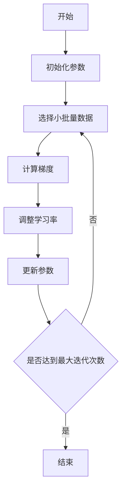

# AI Agent的自适应学习率调整策略

> 关键词：AI Agent、自适应学习率、调整策略、机器学习、深度学习

> 摘要：本文围绕AI Agent的自适应学习率调整策略展开深入探讨。首先介绍了相关背景知识，包括目的、预期读者等内容。接着详细阐述了核心概念与联系，通过文本示意图和Mermaid流程图直观呈现。核心算法原理部分使用Python代码进行详细说明，同时给出了相关的数学模型和公式并举例解释。项目实战部分提供了开发环境搭建、源代码实现与解读。还分析了实际应用场景，推荐了学习工具和资源，最后总结了未来发展趋势与挑战，并对常见问题进行解答，为读者全面了解和应用AI Agent的自适应学习率调整策略提供了系统的知识体系。

## 1. 背景介绍 
### 1.1 目的和范围
在AI Agent的训练过程中，学习率是一个至关重要的超参数。它控制着模型在每次迭代中更新参数的步长大小。合适的学习率能够使模型快速收敛到最优解，而不合适的学习率可能导致模型收敛缓慢甚至无法收敛。本文章的目的在于深入研究和介绍AI Agent的自适应学习率调整策略，探讨不同策略的原理、优缺点以及实际应用场景。范围涵盖了常见的自适应学习率算法，如Adagrad、Adadelta、RMSProp和Adam等，同时会通过实际代码案例展示如何在项目中应用这些策略。

### 1.2 预期读者
本文预期读者包括对机器学习和深度学习有一定基础的程序员、数据科学家、AI研究者以及相关领域的学生。读者需要具备基本的Python编程知识和机器学习概念，如梯度下降、损失函数等。

### 1.3 文档结构概述
本文将按照以下结构进行组织：首先介绍核心概念与联系，帮助读者理解自适应学习率调整的基本原理和架构；接着详细阐述核心算法原理，并使用Python源代码进行具体操作步骤的演示；然后给出相关的数学模型和公式，并通过举例说明加深理解；在项目实战部分，会介绍开发环境搭建、源代码的详细实现和代码解读；之后分析实际应用场景；推荐相关的工具和资源；最后总结未来发展趋势与挑战，解答常见问题并提供扩展阅读和参考资料。

### 1.4 术语表
#### 1.4.1 核心术语定义
- **AI Agent**：人工智能代理，是一种能够感知环境、做出决策并采取行动以实现特定目标的智能实体。
- **学习率**：在机器学习和深度学习中，学习率是控制模型参数更新步长的超参数。
- **自适应学习率**：根据模型训练过程中的情况自动调整学习率的策略，使得学习率能够在不同的训练阶段动态变化。
- **梯度下降**：一种优化算法，通过沿着损失函数的负梯度方向更新模型参数，以最小化损失函数。

#### 1.4.2 相关概念解释
- **损失函数**：用于衡量模型预测结果与真实标签之间的差异，是模型训练过程中需要最小化的目标。
- **参数更新**：在每次训练迭代中，根据梯度信息对模型的参数进行更新，以逐步优化模型的性能。
- **收敛**：模型在训练过程中，损失函数的值逐渐减小并趋近于一个稳定的值，表明模型的性能逐渐达到最优。

#### 1.4.3 缩略词列表
- **SGD**：随机梯度下降（Stochastic Gradient Descent）
- **Adagrad**：自适应梯度算法（Adaptive Gradient Algorithm）
- **Adadelta**：自适应学习率调整算法（Adaptive Delta Algorithm）
- **RMSProp**：均方根传播（Root Mean Square Propagation）
- **Adam**：自适应矩估计（Adaptive Moment Estimation）

## 2. 核心概念与联系 

### 核心概念原理
在传统的梯度下降算法中，学习率是一个固定的值。然而，在实际的训练过程中，不同的参数可能需要不同的学习率。例如，一些参数可能已经接近最优值，此时需要较小的学习率来避免跳过最优解；而另一些参数可能还需要较大的学习率来快速收敛。自适应学习率调整策略的核心思想就是根据每个参数的梯度情况，动态地调整每个参数的学习率。

### 架构的文本示意图
以下是自适应学习率调整策略的基本架构示意图：

输入：初始模型参数 $\theta_0$，损失函数 $L(\theta)$，训练数据 $D$
过程：
1. 初始化学习率 $\alpha$ 和其他必要的参数（如动量、二阶矩估计等）
2. 对于每个训练迭代 $t$：
    - 从训练数据 $D$ 中随机选取一个小批量数据 $B_t$
    - 计算损失函数 $L(\theta_t)$ 关于参数 $\theta_t$ 在小批量数据 $B_t$ 上的梯度 $\nabla L(\theta_t)$
    - 根据自适应学习率调整策略计算每个参数的学习率 $\alpha_{t,i}$
    - 更新模型参数 $\theta_{t+1,i} = \theta_{t,i} - \alpha_{t,i} \nabla L(\theta_t)_i$
输出：最终的模型参数 $\theta_{final}$

### Mermaid 流程图


## 3. 核心算法原理 & 具体操作步骤 

### Adagrad算法
Adagrad算法根据每个参数的历史梯度平方和来调整学习率。具体来说，对于第 $i$ 个参数，其学习率 $\alpha_{t,i}$ 的计算公式为：

$$\alpha_{t,i} = \frac{\alpha}{\sqrt{G_{t,ii} + \epsilon}}$$

其中，$\alpha$ 是初始学习率，$G_{t,ii}$ 是第 $i$ 个参数的历史梯度平方和，$\epsilon$ 是一个很小的常数，用于避免分母为零。

以下是使用Python实现Adagrad算法的代码：
```python
import numpy as np

def adagrad(X, y, alpha=0.01, num_iters=1000, epsilon=1e-8):
    # 初始化参数
    m, n = X.shape
    theta = np.zeros((n, 1))
    G = np.zeros((n, 1))
    
    for t in range(num_iters):
        # 计算梯度
        h = np.dot(X, theta)
        error = h - y
        grad = np.dot(X.T, error) / m
        
        # 更新历史梯度平方和
        G += grad**2
        
        # 调整学习率并更新参数
        adjusted_alpha = alpha / (np.sqrt(G) + epsilon)
        theta = theta - adjusted_alpha * grad
    
    return theta
```

### Adadelta算法
Adadelta算法是对Adagrad算法的改进，它通过使用指数移动平均来解决Adagrad算法中学习率单调递减的问题。具体来说，Adadelta算法引入了两个指数移动平均：一个用于梯度平方的指数移动平均 $E[g^2]_t$，另一个用于参数更新平方的指数移动平均 $E[\Delta\theta^2]_t$。参数更新公式为：

$$\Delta\theta_t = - \frac{\sqrt{E[\Delta\theta^2]_{t-1} + \epsilon}}{\sqrt{E[g^2]_t + \epsilon}} g_t$$

$$E[g^2]_t = \rho E[g^2]_{t-1} + (1 - \rho) g_t^2$$

$$E[\Delta\theta^2]_t = \rho E[\Delta\theta^2]_{t-1} + (1 - \rho) \Delta\theta_t^2$$

以下是使用Python实现Adadelta算法的代码：
```python
import numpy as np

def adadelta(X, y, rho=0.95, num_iters=1000, epsilon=1e-8):
    # 初始化参数
    m, n = X.shape
    theta = np.zeros((n, 1))
    E_g2 = np.zeros((n, 1))
    E_delta_theta2 = np.zeros((n, 1))
    
    for t in range(num_iters):
        # 计算梯度
        h = np.dot(X, theta)
        error = h - y
        grad = np.dot(X.T, error) / m
        
        # 更新梯度平方的指数移动平均
        E_g2 = rho * E_g2 + (1 - rho) * grad**2
        
        # 计算参数更新
        delta_theta = - np.sqrt(E_delta_theta2 + epsilon) / np.sqrt(E_g2 + epsilon) * grad
        
        # 更新参数更新平方的指数移动平均
        E_delta_theta2 = rho * E_delta_theta2 + (1 - rho) * delta_theta**2
        
        # 更新参数
        theta = theta + delta_theta
    
    return theta
```

### RMSProp算法
RMSProp算法也是对Adagrad算法的改进，它通过使用指数移动平均来平滑历史梯度平方和。具体来说，对于第 $i$ 个参数，其学习率 $\alpha_{t,i}$ 的计算公式为：

$$\alpha_{t,i} = \frac{\alpha}{\sqrt{E[g^2]_t + \epsilon}}$$

其中，$E[g^2]_t$ 是梯度平方的指数移动平均：

$$E[g^2]_t = \rho E[g^2]_{t-1} + (1 - \rho) g_t^2$$

以下是使用Python实现RMSProp算法的代码：
```python
import numpy as np

def rmsprop(X, y, alpha=0.001, rho=0.9, num_iters=1000, epsilon=1e-8):
    # 初始化参数
    m, n = X.shape
    theta = np.zeros((n, 1))
    E_g2 = np.zeros((n, 1))
    
    for t in range(num_iters):
        # 计算梯度
        h = np.dot(X, theta)
        error = h - y
        grad = np.dot(X.T, error) / m
        
        # 更新梯度平方的指数移动平均
        E_g2 = rho * E_g2 + (1 - rho) * grad**2
        
        # 调整学习率并更新参数
        adjusted_alpha = alpha / (np.sqrt(E_g2) + epsilon)
        theta = theta - adjusted_alpha * grad
    
    return theta
```

### Adam算法
Adam算法结合了动量和自适应学习率的思想，它同时计算梯度的一阶矩估计（均值）和二阶矩估计（未中心化的方差），并使用这些估计来调整学习率。具体来说，Adam算法的参数更新公式为：

$$m_t = \beta_1 m_{t-1} + (1 - \beta_1) g_t$$

$$v_t = \beta_2 v_{t-1} + (1 - \beta_2) g_t^2$$

$$\hat{m}_t = \frac{m_t}{1 - \beta_1^t}$$

$$\hat{v}_t = \frac{v_t}{1 - \beta_2^t}$$

$$\theta_{t+1} = \theta_t - \frac{\alpha}{\sqrt{\hat{v}_t} + \epsilon} \hat{m}_t$$

其中，$m_t$ 是梯度的一阶矩估计，$v_t$ 是梯度的二阶矩估计，$\beta_1$ 和 $\beta_2$ 是衰减率，$\hat{m}_t$ 和 $\hat{v}_t$ 是偏差修正后的一阶矩估计和二阶矩估计。

以下是使用Python实现Adam算法的代码：
```python
import numpy as np

def adam(X, y, alpha=0.001, beta1=0.9, beta2=0.999, num_iters=1000, epsilon=1e-8):
    # 初始化参数
    m, n = X.shape
    theta = np.zeros((n, 1))
    m_t = np.zeros((n, 1))
    v_t = np.zeros((n, 1))
    
    for t in range(1, num_iters + 1):
        # 计算梯度
        h = np.dot(X, theta)
        error = h - y
        grad = np.dot(X.T, error) / m
        
        # 更新一阶矩估计
        m_t = beta1 * m_t + (1 - beta1) * grad
        
        # 更新二阶矩估计
        v_t = beta2 * v_t + (1 - beta2) * grad**2
        
        # 偏差修正
        m_hat = m_t / (1 - beta1**t)
        v_hat = v_t / (1 - beta2**t)
        
        # 调整学习率并更新参数
        adjusted_alpha = alpha / (np.sqrt(v_hat) + epsilon)
        theta = theta - adjusted_alpha * m_hat
    
    return theta
```

## 4. 数学模型和公式 & 详细讲解 & 举例说明 

### 梯度下降的基本原理
在机器学习中，我们通常需要最小化一个损失函数 $L(\theta)$，其中 $\theta$ 是模型的参数。梯度下降算法通过不断地更新参数 $\theta$ 来逐步减小损失函数的值。具体来说，参数更新公式为：

$$\theta_{t+1} = \theta_t - \alpha \nabla L(\theta_t)$$

其中，$\alpha$ 是学习率，$\nabla L(\theta_t)$ 是损失函数 $L(\theta)$ 在参数 $\theta_t$ 处的梯度。

### Adagrad算法的数学模型和公式
Adagrad算法的核心思想是根据每个参数的历史梯度平方和来调整学习率。对于第 $i$ 个参数，其学习率 $\alpha_{t,i}$ 的计算公式为：

$$\alpha_{t,i} = \frac{\alpha}{\sqrt{G_{t,ii} + \epsilon}}$$

其中，$\alpha$ 是初始学习率，$G_{t,ii}$ 是第 $i$ 个参数的历史梯度平方和，$\epsilon$ 是一个很小的常数，用于避免分母为零。历史梯度平方和的更新公式为：

$$G_{t,ii} = G_{t-1,ii} + (\nabla L(\theta_t)_i)^2$$

举例说明：假设我们有一个简单的线性回归模型 $y = \theta_0 + \theta_1 x$，损失函数为均方误差 $L(\theta) = \frac{1}{2m} \sum_{i=1}^{m} (y^{(i)} - (\theta_0 + \theta_1 x^{(i)}))^2$。初始学习率 $\alpha = 0.01$，$\epsilon = 1e-8$。在第 $t$ 次迭代中，$\theta_0$ 的梯度为 $g_{0,t}$，$\theta_1$ 的梯度为 $g_{1,t}$。则 $\theta_0$ 的学习率为 $\alpha_{t,0} = \frac{0.01}{\sqrt{G_{t,00} + 1e-8}}$，$\theta_1$ 的学习率为 $\alpha_{t,1} = \frac{0.01}{\sqrt{G_{t,11} + 1e-8}}$，其中 $G_{t,00}$ 和 $G_{t,11}$ 分别是 $\theta_0$ 和 $\theta_1$ 的历史梯度平方和。

### Adadelta算法的数学模型和公式
Adadelta算法引入了两个指数移动平均：一个用于梯度平方的指数移动平均 $E[g^2]_t$，另一个用于参数更新平方的指数移动平均 $E[\Delta\theta^2]_t$。参数更新公式为：

$$\Delta\theta_t = - \frac{\sqrt{E[\Delta\theta^2]_{t-1} + \epsilon}}{\sqrt{E[g^2]_t + \epsilon}} g_t$$

$$E[g^2]_t = \rho E[g^2]_{t-1} + (1 - \rho) g_t^2$$

$$E[\Delta\theta^2]_t = \rho E[\Delta\theta^2]_{t-1} + (1 - \rho) \Delta\theta_t^2$$

其中，$\rho$ 是衰减率，$g_t$ 是第 $t$ 次迭代的梯度。

举例说明：假设 $\rho = 0.95$，$\epsilon = 1e-8$。在第 $t$ 次迭代中，梯度为 $g_t$，$E[g^2]_{t-1}$ 和 $E[\Delta\theta^2]_{t-1}$ 分别是上一次迭代的梯度平方和参数更新平方的指数移动平均。则首先计算 $E[g^2]_t = 0.95 E[g^2]_{t-1} + 0.05 g_t^2$，然后计算参数更新 $\Delta\theta_t = - \frac{\sqrt{E[\Delta\theta^2]_{t-1} + 1e-8}}{\sqrt{E[g^2]_t + 1e-8}} g_t$，最后更新 $E[\Delta\theta^2]_t = 0.95 E[\Delta\theta^2]_{t-1} + 0.05 \Delta\theta_t^2$。

### RMSProp算法的数学模型和公式
RMSProp算法通过使用指数移动平均来平滑历史梯度平方和。对于第 $i$ 个参数，其学习率 $\alpha_{t,i}$ 的计算公式为：

$$\alpha_{t,i} = \frac{\alpha}{\sqrt{E[g^2]_t + \epsilon}}$$

其中，$E[g^2]_t$ 是梯度平方的指数移动平均：

$$E[g^2]_t = \rho E[g^2]_{t-1} + (1 - \rho) g_t^2$$

举例说明：假设 $\alpha = 0.001$，$\rho = 0.9$，$\epsilon = 1e-8$。在第 $t$ 次迭代中，梯度为 $g_t$，$E[g^2]_{t-1}$ 是上一次迭代的梯度平方的指数移动平均。则首先计算 $E[g^2]_t = 0.9 E[g^2]_{t-1} + 0.1 g_t^2$，然后计算第 $i$ 个参数的学习率 $\alpha_{t,i} = \frac{0.001}{\sqrt{E[g^2]_t + 1e-8}}$。

### Adam算法的数学模型和公式
Adam算法结合了动量和自适应学习率的思想，它同时计算梯度的一阶矩估计（均值）和二阶矩估计（未中心化的方差），并使用这些估计来调整学习率。具体来说，Adam算法的参数更新公式为：

$$m_t = \beta_1 m_{t-1} + (1 - \beta_1) g_t$$

$$v_t = \beta_2 v_{t-1} + (1 - \beta_2) g_t^2$$

$$\hat{m}_t = \frac{m_t}{1 - \beta_1^t}$$

$$\hat{v}_t = \frac{v_t}{1 - \beta_2^t}$$

$$\theta_{t+1} = \theta_t - \frac{\alpha}{\sqrt{\hat{v}_t} + \epsilon} \hat{m}_t$$

其中，$m_t$ 是梯度的一阶矩估计，$v_t$ 是梯度的二阶矩估计，$\beta_1$ 和 $\beta_2$ 是衰减率，$\hat{m}_t$ 和 $\hat{v}_t$ 是偏差修正后的一阶矩估计和二阶矩估计。

举例说明：假设 $\alpha = 0.001$，$\beta_1 = 0.9$，$\beta_2 = 0.999$，$\epsilon = 1e-8$。在第 $t$ 次迭代中，梯度为 $g_t$，$m_{t-1}$ 和 $v_{t-1}$ 分别是上一次迭代的一阶矩估计和二阶矩估计。则首先计算 $m_t = 0.9 m_{t-1} + 0.1 g_t$，$v_t = 0.999 v_{t-1} + 0.001 g_t^2$，然后进行偏差修正 $\hat{m}_t = \frac{m_t}{1 - 0.9^t}$，$\hat{v}_t = \frac{v_t}{1 - 0.999^t}$，最后更新参数 $\theta_{t+1} = \theta_t - \frac{0.001}{\sqrt{\hat{v}_t} + 1e-8} \hat{m}_t$。

## 5. 项目实战：代码实际案例和详细解释说明 

### 5.1  开发环境搭建
为了实现AI Agent的自适应学习率调整策略，我们可以使用Python编程语言和一些常用的机器学习库，如NumPy和Scikit-learn。以下是搭建开发环境的步骤：

1. 安装Python：可以从Python官方网站（https://www.python.org/downloads/）下载并安装Python 3.x版本。
2. 安装NumPy和Scikit-learn：可以使用pip命令进行安装：
```sh
pip install numpy scikit-learn
```

### 5.2  源代码详细实现和代码解读
以下是一个使用自适应学习率调整策略进行线性回归的完整代码示例：
```python
import numpy as np
from sklearn.datasets import make_regression
from sklearn.model_selection import train_test_split
from sklearn.metrics import mean_squared_error

# 生成数据集
X, y = make_regression(n_samples=1000, n_features=10, noise=0.1, random_state=42)
y = y.reshape(-1, 1)

# 划分训练集和测试集
X_train, X_test, y_train, y_test = train_test_split(X, y, test_size=0.2, random_state=42)

# 定义Adagrad算法
def adagrad(X, y, alpha=0.01, num_iters=1000, epsilon=1e-8):
    m, n = X.shape
    theta = np.zeros((n, 1))
    G = np.zeros((n, 1))
    
    for t in range(num_iters):
        h = np.dot(X, theta)
        error = h - y
        grad = np.dot(X.T, error) / m
        
        G += grad**2
        adjusted_alpha = alpha / (np.sqrt(G) + epsilon)
        theta = theta - adjusted_alpha * grad
    
    return theta

# 定义Adadelta算法
def adadelta(X, y, rho=0.95, num_iters=1000, epsilon=1e-8):
    m, n = X.shape
    theta = np.zeros((n, 1))
    E_g2 = np.zeros((n, 1))
    E_delta_theta2 = np.zeros((n, 1))
    
    for t in range(num_iters):
        h = np.dot(X, theta)
        error = h - y
        grad = np.dot(X.T, error) / m
        
        E_g2 = rho * E_g2 + (1 - rho) * grad**2
        delta_theta = - np.sqrt(E_delta_theta2 + epsilon) / np.sqrt(E_g2 + epsilon) * grad
        E_delta_theta2 = rho * E_delta_theta2 + (1 - rho) * delta_theta**2
        theta = theta + delta_theta
    
    return theta

# 定义RMSProp算法
def rmsprop(X, y, alpha=0.001, rho=0.9, num_iters=1000, epsilon=1e-8):
    m, n = X.shape
    theta = np.zeros((n, 1))
    E_g2 = np.zeros((n, 1))
    
    for t in range(num_iters):
        h = np.dot(X, theta)
        error = h - y
        grad = np.dot(X.T, error) / m
        
        E_g2 = rho * E_g2 + (1 - rho) * grad**2
        adjusted_alpha = alpha / (np.sqrt(E_g2) + epsilon)
        theta = theta - adjusted_alpha * grad
    
    return theta

# 定义Adam算法
def adam(X, y, alpha=0.001, beta1=0.9, beta2=0.999, num_iters=1000, epsilon=1e-8):
    m, n = X.shape
    theta = np.zeros((n, 1))
    m_t = np.zeros((n, 1))
    v_t = np.zeros((n, 1))
    
    for t in range(1, num_iters + 1):
        h = np.dot(X, theta)
        error = h - y
        grad = np.dot(X.T, error) / m
        
        m_t = beta1 * m_t + (1 - beta1) * grad
        v_t = beta2 * v_t + (1 - beta2) * grad**2
        m_hat = m_t / (1 - beta1**t)
        v_hat = v_t / (1 - beta2**t)
        adjusted_alpha = alpha / (np.sqrt(v_hat) + epsilon)
        theta = theta - adjusted_alpha * m_hat
    
    return theta

# 使用不同的自适应学习率算法进行训练
theta_adagrad = adagrad(X_train, y_train)
theta_adadelta = adadelta(X_train, y_train)
theta_rmsprop = rmsprop(X_train, y_train)
theta_adam = adam(X_train, y_train)

# 预测并计算均方误差
y_pred_adagrad = np.dot(X_test, theta_adagrad)
mse_adagrad = mean_squared_error(y_test, y_pred_adagrad)

y_pred_adadelta = np.dot(X_test, theta_adadelta)
mse_adadelta = mean_squared_error(y_test, y_pred_adadelta)

y_pred_rmsprop = np.dot(X_test, theta_rmsprop)
mse_rmsprop = mean_squared_error(y_test, y_pred_rmsprop)

y_pred_adam = np.dot(X_test, theta_adam)
mse_adam = mean_squared_error(y_test, y_pred_adam)

# 输出结果
print("Adagrad MSE:", mse_adagrad)
print("Adadelta MSE:", mse_adadelta)
print("RMSProp MSE:", mse_rmsprop)
print("Adam MSE:", mse_adam)
```

### 5.3  代码解读与分析
1. **数据集生成**：使用`make_regression`函数生成一个包含1000个样本和10个特征的线性回归数据集，并将其划分为训练集和测试集。
2. **自适应学习率算法实现**：分别实现了Adagrad、Adadelta、RMSProp和Adam算法。每个算法都接受训练数据、初始学习率、迭代次数等参数，并返回训练好的模型参数。
3. **模型训练**：使用不同的自适应学习率算法对训练数据进行训练，得到不同算法的模型参数。
4. **预测和评估**：使用训练好的模型对测试数据进行预测，并计算均方误差（MSE）来评估模型的性能。
5. **结果输出**：输出不同算法的均方误差，以便比较不同算法的性能。

通过比较不同算法的均方误差，我们可以发现哪种自适应学习率调整策略在该数据集上表现更好。

## 6. 实际应用场景 
### 图像识别
在图像识别任务中，如图像分类、目标检测等，模型通常非常复杂，需要大量的训练数据和计算资源。自适应学习率调整策略可以帮助模型更快地收敛，提高训练效率。例如，在训练卷积神经网络（CNN）时，使用Adam算法可以自动调整每个参数的学习率，避免学习率过大导致模型发散或学习率过小导致收敛缓慢的问题。

### 自然语言处理
在自然语言处理任务中，如文本分类、机器翻译等，模型需要处理大量的文本数据，并且数据的分布可能非常复杂。自适应学习率调整策略可以根据不同参数的梯度情况动态调整学习率，使模型能够更好地适应数据的变化。例如，在训练循环神经网络（RNN）或Transformer模型时，使用Adagrad或RMSProp算法可以有效地处理梯度消失或梯度爆炸的问题。

### 强化学习
在强化学习中，AI Agent需要通过与环境进行交互来学习最优策略。自适应学习率调整策略可以帮助Agent更快地学习到最优策略，提高学习效率。例如，在训练深度Q网络（DQN）或策略梯度算法时，使用自适应学习率算法可以根据Agent的奖励信号动态调整学习率，使Agent能够更快地收敛到最优策略。

## 7. 工具和资源推荐
### 7.1 学习资源推荐
#### 7.1.1 书籍推荐
- 《深度学习》（Deep Learning）：由Ian Goodfellow、Yoshua Bengio和Aaron Courville所著，是深度学习领域的经典教材，涵盖了深度学习的基本概念、算法和应用。
- 《Python机器学习》（Python Machine Learning）：由Sebastian Raschka所著，介绍了使用Python进行机器学习的方法和技巧，包括各种机器学习算法的实现和应用。
- 《动手学深度学习》（Dive into Deep Learning）：由李沐、Aston Zhang等所著，提供了丰富的深度学习代码示例和详细的讲解，适合初学者入门。

#### 7.1.2 在线课程
- Coursera上的“深度学习专项课程”（Deep Learning Specialization）：由Andrew Ng教授授课，包括深度学习的基础知识、卷积神经网络、循环神经网络等内容。
- edX上的“强化学习基础”（Fundamentals of Reinforcement Learning）：介绍了强化学习的基本概念、算法和应用。
- 吴恩达老师在B站上的“机器学习”课程：是一门非常经典的机器学习入门课程，适合初学者学习。

#### 7.1.3 技术博客和网站
- Medium：是一个技术博客平台，上面有很多关于机器学习和深度学习的优秀文章。
- arXiv：是一个预印本数据库，提供了最新的机器学习和深度学习研究成果。
- Kaggle：是一个数据科学竞赛平台，上面有很多关于机器学习和深度学习的开源代码和数据集。

### 7.2 开发工具框架推荐
#### 7.2.1 IDE和编辑器
- PyCharm：是一款专业的Python集成开发环境（IDE），提供了丰富的代码编辑、调试和项目管理功能。
- Jupyter Notebook：是一个交互式的编程环境，适合进行数据分析和模型开发。
- Visual Studio Code：是一款轻量级的代码编辑器，支持多种编程语言和插件扩展。

#### 7.2.2 调试和性能分析工具
- TensorBoard：是TensorFlow提供的一个可视化工具，可以用于监控模型的训练过程、可视化模型结构和分析模型性能。
- PyTorch Profiler：是PyTorch提供的一个性能分析工具，可以用于分析模型的运行时间、内存使用等情况。
- cProfile：是Python标准库中的一个性能分析工具，可以用于分析Python代码的运行时间和函数调用情况。

#### 7.2.3 相关框架和库
- TensorFlow：是一个开源的深度学习框架，提供了丰富的深度学习模型和工具，支持分布式训练和移动端部署。
- PyTorch：是一个开源的深度学习框架，具有动态图的特点，易于使用和调试，在学术界和工业界都有广泛的应用。
- Scikit-learn：是一个开源的机器学习库，提供了各种机器学习算法的实现和工具，适合进行机器学习模型的开发和评估。

### 7.3 相关论文著作推荐
#### 7.3.1 经典论文
- “Adaptive Subgradient Methods for Online Learning and Stochastic Optimization”：介绍了Adagrad算法的原理和应用。
- “ADADELTA: An Adaptive Learning Rate Method”：提出了Adadelta算法，解决了Adagrad算法中学习率单调递减的问题。
- “Lecture 6.5 - RMSProp: Divide the gradient by a running average of its recent magnitude”：介绍了RMSProp算法的原理和应用。
- “Adam: A Method for Stochastic Optimization”：提出了Adam算法，结合了动量和自适应学习率的思想。

#### 7.3.2 最新研究成果
- 可以关注顶级机器学习会议（如NeurIPS、ICML、CVPR等）和期刊（如Journal of Machine Learning Research、Artificial Intelligence等）上的最新研究成果，了解自适应学习率调整策略的最新发展趋势。

#### 7.3.3 应用案例分析
- 可以参考一些实际应用案例，如谷歌、Facebook等公司在图像识别、自然语言处理等领域的应用案例，了解自适应学习率调整策略在实际项目中的应用效果和经验。

## 8. 总结：未来发展趋势与挑战
### 未来发展趋势
- **更加智能化的自适应策略**：未来的自适应学习率调整策略可能会结合更多的智能算法，如元学习、强化学习等，根据模型的训练状态和数据的特点自动调整学习率，进一步提高模型的训练效率和性能。
- **多模态自适应学习率**：随着多模态数据（如图像、文本、音频等）的广泛应用，未来的自适应学习率调整策略可能会考虑不同模态数据的特点，为不同模态的数据采用不同的学习率调整策略，以更好地处理多模态数据。
- **与硬件的深度融合**：随着硬件技术的不断发展，如GPU、TPU等的广泛应用，未来的自适应学习率调整策略可能会与硬件进行深度融合，充分利用硬件的计算资源，提高模型的训练速度和效率。

### 挑战
- **计算资源的需求**：一些复杂的自适应学习率调整策略可能需要更多的计算资源和内存，这对于大规模的深度学习模型和数据集来说是一个挑战。
- **超参数的选择**：虽然自适应学习率调整策略可以自动调整学习率，但仍然需要选择一些超参数，如衰减率、初始学习率等。这些超参数的选择对模型的性能有很大的影响，如何选择合适的超参数是一个挑战。
- **理论基础的完善**：目前，自适应学习率调整策略的理论基础还不够完善，对于一些算法的收敛性和稳定性还缺乏深入的研究。未来需要进一步完善自适应学习率调整策略的理论基础，为其应用提供更坚实的理论支持。

## 9. 附录：常见问题与解答
### 1. 自适应学习率调整策略一定比固定学习率好吗？
不一定。自适应学习率调整策略在大多数情况下可以提高模型的训练效率和性能，但在某些特定的数据集和模型结构下，固定学习率可能会表现更好。因此，在实际应用中，需要根据具体情况选择合适的学习率调整策略。

### 2. 如何选择合适的自适应学习率算法？
可以通过实验比较不同自适应学习率算法在自己的数据集上的性能，选择性能最好的算法。一般来说，Adam算法在大多数情况下表现较好，是一个比较常用的选择。

### 3. 自适应学习率算法的超参数如何调整？
可以使用网格搜索、随机搜索等方法来调整自适应学习率算法的超参数。也可以参考相关的论文和经验，选择一些常用的超参数值进行尝试。

### 4. 自适应学习率算法会增加模型的训练时间吗？
在某些情况下，自适应学习率算法可能会增加模型的训练时间，因为它们需要额外的计算来调整学习率。但在大多数情况下，自适应学习率算法可以使模型更快地收敛，从而减少总的训练时间。

## 10. 扩展阅读 & 参考资料
- Goodfellow, I., Bengio, Y., & Courville, A. (2016). Deep Learning. MIT Press.
- Raschka, S. (2015). Python Machine Learning. Packt Publishing.
- Zhang, A., Lipton, Z. C., Li, M., & Smola, A. J. (2020). Dive into Deep Learning.
- Duchi, J., Hazan, E., & Singer, Y. (2011). Adaptive Subgradient Methods for Online Learning and Stochastic Optimization. Journal of Machine Learning Research, 12, 2121-2159.
- Zeiler, M. D. (2012). ADADELTA: An Adaptive Learning Rate Method. arXiv preprint arXiv:1212.5701.
- Tieleman, T., & Hinton, G. (2012). Lecture 6.5 - RMSProp: Divide the gradient by a running average of its recent magnitude. COURSERA: Neural Networks for Machine Learning.
- Kingma, D. P., & Ba, J. (2014). Adam: A Method for Stochastic Optimization. arXiv preprint arXiv:1412.6980.

作者：AI天才研究院/AI Genius Institute & 禅与计算机程序设计艺术 /Zen And The Art of Computer Programming