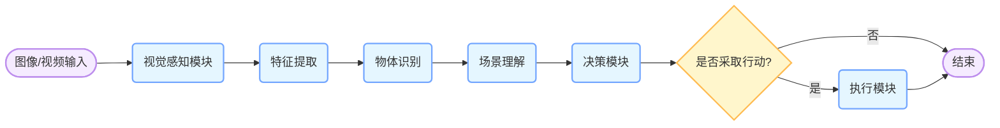

# AI Agent的视觉理解能力增强

> 关键词：AI Agent、视觉理解能力、深度学习、计算机视觉、多模态融合、模型架构、应用场景

> 摘要：本文围绕AI Agent的视觉理解能力增强展开深入探讨。首先介绍了提升AI Agent视觉理解能力的背景、目的和适用读者群体等内容。详细阐述了核心概念，包括AI Agent和视觉理解能力的原理及联系，并通过示意图和流程图直观展示。接着讲解了核心算法原理，用Python代码进行具体说明，同时给出相关数学模型和公式。通过项目实战案例，展示了开发环境搭建、代码实现和解读。还分析了实际应用场景，推荐了学习资源、开发工具框架以及相关论文著作。最后总结了未来发展趋势与挑战，并对常见问题进行解答，提供扩展阅读和参考资料，旨在为相关领域的研究和实践提供全面的指导。

## 1. 背景介绍 
### 1.1 目的和范围
在当今人工智能快速发展的时代，AI Agent在各个领域的应用日益广泛。然而，许多AI Agent在处理视觉信息方面的能力仍有待提高。提升AI Agent的视觉理解能力具有重要的现实意义，其目的在于使AI Agent能够更准确、深入地理解图像和视频中的内容，从而在智能安防、自动驾驶、医疗影像分析等领域发挥更大的作用。

本文章的范围涵盖了AI Agent视觉理解能力增强的核心概念、算法原理、数学模型、实际应用案例以及相关的工具和资源推荐等方面。旨在为读者提供一个全面、系统的关于AI Agent视觉理解能力增强的知识体系。

### 1.2 预期读者
本文预期读者包括计算机科学、人工智能、计算机视觉等相关专业的学生，他们可以通过阅读本文深入了解AI Agent视觉理解能力增强的理论和实践知识，为未来的学习和研究打下基础。同时，也适合从事相关领域研发的工程师和科研人员，他们可以从中获取新的思路和方法，提升自己的项目开发和研究水平。此外，对人工智能技术感兴趣的爱好者也可以通过本文初步了解AI Agent视觉理解能力增强的相关内容。

### 1.3 文档结构概述
本文将按照以下结构进行组织：首先介绍背景信息，包括目的、预期读者和文档结构概述等内容。接着详细阐述核心概念，说明AI Agent和视觉理解能力的原理以及它们之间的联系，并通过示意图和流程图进行直观展示。然后讲解核心算法原理，使用Python代码进行具体的操作步骤说明，同时给出相关的数学模型和公式，并举例进行详细讲解。之后通过项目实战案例，介绍开发环境搭建、源代码实现和代码解读。分析实际应用场景，展示AI Agent视觉理解能力增强在不同领域的应用。推荐学习资源、开发工具框架和相关论文著作。最后总结未来发展趋势与挑战，解答常见问题，并提供扩展阅读和参考资料。

### 1.4 术语表
#### 1.4.1 核心术语定义
- **AI Agent**：是指能够感知环境、进行决策并采取行动以实现特定目标的人工智能实体。它可以是软件程序、机器人等不同形式。
- **视觉理解能力**：指AI Agent对图像或视频中的内容进行分析、识别、推理和解释的能力，包括物体识别、场景理解、动作分析等多个方面。
- **深度学习**：是一种基于人工神经网络的机器学习方法，通过构建多层神经网络来自动学习数据中的特征和模式，在计算机视觉等领域取得了显著的成果。
- **计算机视觉**：是一门研究如何使计算机“看”的科学，即通过图像处理、模式识别等技术，让计算机能够理解和解释图像和视频中的内容。
- **多模态融合**：将不同模态的数据（如图像、文本、音频等）进行整合和处理，以提高AI Agent对信息的理解和处理能力。

#### 1.4.2 相关概念解释
- **卷积神经网络（CNN）**：是深度学习中用于处理图像数据的一种常用神经网络架构。它通过卷积层、池化层和全连接层等组件，自动提取图像中的特征，具有很强的特征学习能力。
- **循环神经网络（RNN）**：主要用于处理序列数据，如文本、语音等。它可以对序列中的每个元素进行处理，并保留之前元素的信息，适合处理具有时间顺序的信息。
- **注意力机制**：是一种模仿人类注意力的机制，它可以让模型在处理数据时自动关注重要的部分，提高模型的性能和效率。

#### 1.4.3 缩略词列表
- **CNN**：Convolutional Neural Network（卷积神经网络）
- **RNN**：Recurrent Neural Network（循环神经网络）
- **LSTM**：Long Short-Term Memory（长短期记忆网络，是一种特殊的RNN）
- **Transformer**：一种基于注意力机制的神经网络架构
- **YOLO**：You Only Look Once（一种实时目标检测算法）

## 2. 核心概念与联系 
### 核心概念原理
#### AI Agent
AI Agent是一个能够自主感知环境、做出决策并执行相应行动的智能体。它通常由感知模块、决策模块和执行模块组成。感知模块负责收集环境中的信息，对于视觉方面的AI Agent，感知模块主要通过摄像头等设备获取图像或视频数据。决策模块根据感知到的信息进行分析和推理，制定出合适的行动策略。执行模块则根据决策模块的结果，执行相应的动作，如移动、操作设备等。

#### 视觉理解能力
视觉理解能力是AI Agent处理视觉信息的关键能力。它涉及到多个层次的处理，从底层的图像特征提取，到中层的物体识别和场景分类，再到高层的语义理解和推理。例如，在底层，AI Agent需要提取图像中的边缘、纹理等特征；在中层，它要识别出图像中的具体物体，如汽车、行人等；在高层，它需要理解场景的含义，判断是否存在危险等情况。

### 架构的文本示意图
```plaintext
AI Agent
├── 感知模块
│   └── 视觉感知（图像/视频输入）
├── 决策模块
│   └── 基于视觉信息的决策
└── 执行模块
    └── 根据决策执行动作
```

### Mermaid流程图


## 3. 核心算法原理 & 具体操作步骤 
### 核心算法原理
在增强AI Agent的视觉理解能力方面，卷积神经网络（CNN）是一种常用的算法。CNN的核心思想是通过卷积层、池化层和全连接层等组件，自动提取图像中的特征。

#### 卷积层
卷积层是CNN的核心组件之一，它通过卷积核在图像上滑动，进行卷积操作，提取图像的局部特征。卷积操作可以表示为：
```python
import numpy as np

def convolution(image, kernel):
    image_height, image_width = image.shape
    kernel_height, kernel_width = kernel.shape
    output_height = image_height - kernel_height + 1
    output_width = image_width - kernel_width + 1
    output = np.zeros((output_height, output_width))
    for i in range(output_height):
        for j in range(output_width):
            output[i, j] = np.sum(image[i:i+kernel_height, j:j+kernel_width] * kernel)
    return output
```

#### 池化层
池化层主要用于降低特征图的维度，减少计算量，同时增强特征的鲁棒性。常见的池化操作有最大池化和平均池化。以下是最大池化的Python实现：
```python
def max_pooling(image, pool_size):
    image_height, image_width = image.shape
    output_height = image_height // pool_size
    output_width = image_width // pool_size
    output = np.zeros((output_height, output_width))
    for i in range(output_height):
        for j in range(output_width):
            output[i, j] = np.max(image[i*pool_size:(i+1)*pool_size, j*pool_size:(j+1)*pool_size])
    return output
```

#### 全连接层
全连接层将卷积层和池化层提取的特征进行整合，用于分类或回归任务。以下是一个简单的全连接层的Python实现：
```python
def fully_connected_layer(inputs, weights, biases):
    return np.dot(inputs.flatten(), weights) + biases
```

### 具体操作步骤
1. **数据预处理**：对输入的图像或视频数据进行预处理，如归一化、裁剪、缩放等操作，以提高模型的训练效果。
```python
import cv2

def preprocess_image(image):
    image = cv2.resize(image, (224, 224))
    image = image / 255.0
    return image
```
2. **构建CNN模型**：使用卷积层、池化层和全连接层构建CNN模型。
```python
import tensorflow as tf
from tensorflow.keras import layers, models

model = models.Sequential([
    layers.Conv2D(32, (3, 3), activation='relu', input_shape=(224, 224, 3)),
    layers.MaxPooling2D((2, 2)),
    layers.Conv2D(64, (3, 3), activation='relu'),
    layers.MaxPooling2D((2, 2)),
    layers.Conv2D(128, (3, 3), activation='relu'),
    layers.MaxPooling2D((2, 2)),
    layers.Flatten(),
    layers.Dense(128, activation='relu'),
    layers.Dense(10, activation='softmax')
])
```
3. **模型训练**：使用标注好的数据集对模型进行训练，调整模型的参数。
```python
model.compile(optimizer='adam',
              loss='sparse_categorical_crossentropy',
              metrics=['accuracy'])

model.fit(train_images, train_labels, epochs=10)
```
4. **模型评估和推理**：使用测试数据集对模型进行评估，然后使用训练好的模型对新的图像或视频数据进行推理。
```python
test_loss, test_acc = model.evaluate(test_images, test_labels)
print(f"Test accuracy: {test_acc}")

predictions = model.predict(new_images)
```

## 4. 数学模型和公式 & 详细讲解 & 举例说明 
### 卷积操作的数学模型
卷积操作可以用数学公式表示为：
$$
y[i, j] = \sum_{m=0}^{M-1} \sum_{n=0}^{N-1} x[i + m, j + n] \cdot k[m, n]
$$
其中，$x$ 是输入图像，$k$ 是卷积核，$y$ 是卷积后的输出特征图，$M$ 和 $N$ 分别是卷积核的高度和宽度。

#### 详细讲解
卷积操作的本质是将卷积核在输入图像上滑动，对每个位置的局部区域进行加权求和。通过不同的卷积核，可以提取图像中的不同特征，如边缘、纹理等。

#### 举例说明
假设输入图像 $x$ 是一个 $3\times3$ 的矩阵：
$$
x = \begin{bmatrix}
1 & 2 & 3 \\
4 & 5 & 6 \\
7 & 8 & 9
\end{bmatrix}
$$
卷积核 $k$ 是一个 $2\times2$ 的矩阵：
$$
k = \begin{bmatrix}
1 & 0 \\
0 & 1
\end{bmatrix}
$$
根据卷积公式，计算输出特征图的第一个元素：
$$
y[0, 0] = \sum_{m=0}^{1} \sum_{n=0}^{1} x[0 + m, 0 + n] \cdot k[m, n] = x[0, 0] \cdot k[0, 0] + x[0, 1] \cdot k[0, 1] + x[1, 0] \cdot k[1, 0] + x[1, 1] \cdot k[1, 1] = 1 \cdot 1 + 2 \cdot 0 + 4 \cdot 0 + 5 \cdot 1 = 6
$$
依次计算其他元素，得到输出特征图 $y$：
$$
y = \begin{bmatrix}
6 & 8 \\
12 & 14
\end{bmatrix}
$$

### 池化操作的数学模型
以最大池化为例，池化操作可以表示为：
$$
y[i, j] = \max_{m=0}^{P-1} \max_{n=0}^{P-1} x[i \cdot P + m, j \cdot P + n]
$$
其中，$x$ 是输入特征图，$P$ 是池化窗口的大小，$y$ 是池化后的输出特征图。

#### 详细讲解
最大池化操作是在每个池化窗口内取最大值作为输出。这样可以降低特征图的维度，减少计算量，同时保留重要的特征信息。

#### 举例说明
假设输入特征图 $x$ 是一个 $4\times4$ 的矩阵：
$$
x = \begin{bmatrix}
1 & 2 & 3 & 4 \\
5 & 6 & 7 & 8 \\
9 & 10 & 11 & 12 \\
13 & 14 & 15 & 16
\end{bmatrix}
$$
池化窗口大小 $P = 2$，根据最大池化公式，计算输出特征图的第一个元素：
$$
y[0, 0] = \max_{m=0}^{1} \max_{n=0}^{1} x[0 \cdot 2 + m, 0 \cdot 2 + n] = \max(x[0, 0], x[0, 1], x[1, 0], x[1, 1]) = \max(1, 2, 5, 6) = 6
$$
依次计算其他元素，得到输出特征图 $y$：
$$
y = \begin{bmatrix}
6 & 8 \\
14 & 16
\end{bmatrix}
$$

### 全连接层的数学模型
全连接层的输出可以表示为：
$$
y = Wx + b
$$
其中，$x$ 是输入向量，$W$ 是权重矩阵，$b$ 是偏置向量，$y$ 是输出向量。

#### 详细讲解
全连接层将输入的特征向量与权重矩阵相乘，再加上偏置向量，得到输出向量。通过调整权重矩阵和偏置向量的参数，可以实现不同的分类或回归任务。

#### 举例说明
假设输入向量 $x$ 是一个长度为 3 的向量：
$$
x = \begin{bmatrix}
1 \\
2 \\
3
\end{bmatrix}
$$
权重矩阵 $W$ 是一个 $2\times3$ 的矩阵：
$$
W = \begin{bmatrix}
1 & 2 & 3 \\
4 & 5 & 6
\end{bmatrix}
$$
偏置向量 $b$ 是一个长度为 2 的向量：
$$
b = \begin{bmatrix}
1 \\
2
\end{bmatrix}
$$
根据全连接层公式，计算输出向量 $y$：
$$
y = Wx + b = \begin{bmatrix}
1 & 2 & 3 \\
4 & 5 & 6
\end{bmatrix} \begin{bmatrix}
1 \\
2 \\
3
\end{bmatrix} + \begin{bmatrix}
1 \\
2
\end{bmatrix} = \begin{bmatrix}
1 \cdot 1 + 2 \cdot 2 + 3 \cdot 3 \\
4 \cdot 1 + 5 \cdot 2 + 6 \cdot 3
\end{bmatrix} + \begin{bmatrix}
1 \\
2
\end{bmatrix} = \begin{bmatrix}
14 \\
32
\end{bmatrix} + \begin{bmatrix}
1 \\
2
\end{bmatrix} = \begin{bmatrix}
15 \\
34
\end{bmatrix}
$$

## 5. 项目实战：代码实际案例和详细解释说明 
### 5.1  开发环境搭建
#### 操作系统
推荐使用Linux系统，如Ubuntu 18.04或更高版本，也可以使用Windows 10或macOS。

#### 编程语言和库
- **Python**：建议使用Python 3.7或更高版本。
- **TensorFlow**：用于构建和训练深度学习模型。可以使用以下命令安装：
```bash
pip install tensorflow
```
- **OpenCV**：用于图像处理和视频处理。可以使用以下命令安装：
```bash
pip install opencv-python
```
- **NumPy**：用于数值计算。可以使用以下命令安装：
```bash
pip install numpy
```

#### 开发工具
推荐使用Jupyter Notebook或PyCharm作为开发工具。Jupyter Notebook可以方便地进行代码编写、调试和可视化，PyCharm是一个功能强大的Python集成开发环境。

### 5.2  源代码详细实现和代码解读
#### 数据加载和预处理
```python
import tensorflow as tf
from tensorflow.keras.datasets import cifar10
import numpy as np
import cv2

# 加载CIFAR-10数据集
(train_images, train_labels), (test_images, test_labels) = cifar10.load_data()

# 数据预处理
def preprocess_images(images):
    images = images.astype('float32') / 255.0
    return images

train_images = preprocess_images(train_images)
test_images = preprocess_images(test_images)
```
**代码解读**：首先使用 `cifar10.load_data()` 函数加载CIFAR-10数据集，该数据集包含10个不同类别的60000张彩色图像。然后定义 `preprocess_images` 函数对图像数据进行预处理，将像素值归一化到0到1之间。

#### 构建CNN模型
```python
from tensorflow.keras import layers, models

model = models.Sequential([
    layers.Conv2D(32, (3, 3), activation='relu', input_shape=(32, 32, 3)),
    layers.MaxPooling2D((2, 2)),
    layers.Conv2D(64, (3, 3), activation='relu'),
    layers.MaxPooling2D((2, 2)),
    layers.Conv2D(64, (3, 3), activation='relu'),
    layers.Flatten(),
    layers.Dense(64, activation='relu'),
    layers.Dense(10, activation='softmax')
])
```
**代码解读**：使用 `models.Sequential()` 构建一个顺序模型。依次添加卷积层、池化层、全连接层。卷积层使用 `Conv2D` 类，池化层使用 `MaxPooling2D` 类，全连接层使用 `Dense` 类。最后一层使用 `softmax` 激活函数，用于多分类任务。

#### 模型编译和训练
```python
model.compile(optimizer='adam',
              loss='sparse_categorical_crossentropy',
              metrics=['accuracy'])

model.fit(train_images, train_labels, epochs=10, validation_data=(test_images, test_labels))
```
**代码解读**：使用 `compile` 方法编译模型，指定优化器为 `adam`，损失函数为 `sparse_categorical_crossentropy`，评估指标为 `accuracy`。然后使用 `fit` 方法对模型进行训练，指定训练数据、训练轮数和验证数据。

#### 模型评估和推理
```python
test_loss, test_acc = model.evaluate(test_images, test_labels)
print(f"Test accuracy: {test_acc}")

# 随机选择一张测试图像进行推理
index = np.random.randint(0, len(test_images))
image = test_images[index]
image = np.expand_dims(image, axis=0)
predictions = model.predict(image)
predicted_class = np.argmax(predictions)
print(f"Predicted class: {predicted_class}")
```
**代码解读**：使用 `evaluate` 方法对模型进行评估，计算测试集的损失和准确率。然后随机选择一张测试图像，使用 `predict` 方法进行推理，得到预测结果。最后使用 `argmax` 函数找到预测概率最大的类别。

### 5.3  代码解读与分析
#### 模型架构分析
该CNN模型包含三个卷积层和两个池化层，用于提取图像的特征。卷积层使用 `relu` 激活函数，增加模型的非线性能力。池化层用于降低特征图的维度，减少计算量。最后通过两个全连接层将特征进行整合，输出10个类别的预测概率。

#### 训练过程分析
在训练过程中，使用 `adam` 优化器自动调整模型的参数，使损失函数最小化。训练轮数设置为10，可以根据实际情况进行调整。通过验证数据可以监控模型的泛化能力，避免过拟合。

#### 推理过程分析
在推理过程中，首先将输入图像进行预处理，然后使用训练好的模型进行预测。最后通过 `argmax` 函数找到预测概率最大的类别，得到最终的预测结果。

## 6. 实际应用场景 
### 智能安防
在智能安防领域，AI Agent的视觉理解能力增强可以用于监控视频的分析。通过对监控画面中的人物、物体和行为进行识别和分析，及时发现异常情况，如入侵、盗窃等。例如，利用目标检测算法可以实时检测出画面中的人物和车辆，再结合行为分析算法可以判断人物的行为是否异常，如奔跑、徘徊等。同时，还可以通过人脸识别技术对特定人员进行识别和跟踪，提高安防监控的效率和准确性。

### 自动驾驶
在自动驾驶中，AI Agent的视觉理解能力是关键。车辆需要通过摄像头等视觉传感器获取周围环境的信息，包括道路、交通标志、其他车辆和行人等。通过强大的视觉理解能力，AI Agent可以准确识别这些元素，并进行实时的决策和控制。例如，识别交通信号灯的颜色，判断前方道路是否畅通，预测其他车辆和行人的运动轨迹等。这有助于车辆做出安全、合理的驾驶决策，避免交通事故的发生。

### 医疗影像分析
在医疗领域，AI Agent的视觉理解能力可以用于医疗影像的分析，如X光、CT、MRI等。通过对这些影像的分析，AI Agent可以帮助医生更准确地诊断疾病。例如，在肺癌的早期诊断中，AI Agent可以识别肺部影像中的结节，并判断其性质是良性还是恶性。这可以提高诊断的准确性和效率，为患者提供更及时的治疗。

### 工业检测
在工业生产中，AI Agent的视觉理解能力可以用于产品质量检测。通过对产品的外观、尺寸等进行视觉检测，及时发现产品中的缺陷和问题。例如，在电子制造行业，AI Agent可以检测电路板上的元件是否安装正确，是否存在短路等问题。在机械制造行业，AI Agent可以检测零件的表面缺陷、尺寸偏差等。这有助于提高产品质量，降低生产成本。

### 智能零售
在智能零售领域，AI Agent的视觉理解能力可以用于顾客行为分析和商品管理。通过对店内监控视频的分析，AI Agent可以了解顾客的购物行为，如浏览商品的时间、购买的商品种类等。这有助于商家优化商品陈列和营销策略，提高销售额。同时，AI Agent还可以实时监控商品的库存情况，自动补货，提高运营效率。

## 7. 工具和资源推荐
### 7.1 学习资源推荐
#### 7.1.1 书籍推荐
- 《深度学习》（Deep Learning）：由Ian Goodfellow、Yoshua Bengio和Aaron Courville所著，是深度学习领域的经典教材，全面介绍了深度学习的理论和实践知识。
- 《计算机视觉：算法与应用》（Computer Vision: Algorithms and Applications）：由Richard Szeliski所著，详细介绍了计算机视觉的各种算法和应用，包括图像特征提取、目标检测、图像分割等。
- 《Python深度学习》（Deep Learning with Python）：由Francois Chollet所著，结合Keras深度学习库，介绍了如何使用Python进行深度学习的开发和实践。

#### 7.1.2 在线课程
- Coursera上的“深度学习专项课程”（Deep Learning Specialization）：由Andrew Ng教授主讲，包括神经网络和深度学习、改善深层神经网络、结构化机器学习项目等多个课程，系统地介绍了深度学习的理论和实践。
- edX上的“计算机视觉基础”（Introduction to Computer Vision）：由华盛顿大学开设，介绍了计算机视觉的基本概念、算法和应用。
- 哔哩哔哩上有许多关于深度学习和计算机视觉的免费教程，如“李宏毅机器学习”等，讲解生动易懂，适合初学者学习。

#### 7.1.3 技术博客和网站
- Medium：上面有许多关于人工智能、深度学习和计算机视觉的技术文章，作者来自世界各地的技术专家和研究者。
- arXiv：是一个预印本服务器，提供了大量关于人工智能和计算机视觉的最新研究论文。
- 机器之心：是一个专注于人工智能技术的媒体平台，提供了丰富的技术资讯、研究成果和案例分析。

### 7.2 开发工具框架推荐
#### 7.2.1 IDE和编辑器
- PyCharm：是一个功能强大的Python集成开发环境，提供了代码编辑、调试、版本控制等功能，适合专业的Python开发者使用。
- Jupyter Notebook：是一个基于Web的交互式开发环境，支持Python、R等多种编程语言，适合进行数据分析、模型训练和可视化等工作。
- Visual Studio Code：是一个轻量级的代码编辑器，支持多种编程语言和插件扩展，具有丰富的功能和良好的用户体验。

#### 7.2.2 调试和性能分析工具
- TensorBoard：是TensorFlow提供的一个可视化工具，可以用于监控模型的训练过程、可视化模型的结构和性能指标等。
- PyTorch Profiler：是PyTorch提供的一个性能分析工具，可以帮助开发者找出代码中的性能瓶颈，优化模型的训练和推理速度。
- NVIDIA Nsight Systems：是NVIDIA提供的一个性能分析工具，主要用于GPU加速的深度学习应用的性能分析。

#### 7.2.3 相关框架和库
- TensorFlow：是一个开源的深度学习框架，由Google开发，提供了丰富的深度学习模型和工具，支持多种编程语言和平台。
- PyTorch：是一个开源的深度学习框架，由Facebook开发，具有动态图的优势，易于使用和调试，在学术界和工业界都得到了广泛的应用。
- OpenCV：是一个开源的计算机视觉库，提供了丰富的图像处理和计算机视觉算法，支持多种编程语言和平台。

### 7.3 相关论文著作推荐
#### 7.3.1 经典论文
- “ImageNet Classification with Deep Convolutional Neural Networks”：Alex Krizhevsky等人发表的论文，提出了AlexNet模型，开启了深度学习在计算机视觉领域的革命。
- “Very Deep Convolutional Networks for Large-Scale Image Recognition”：Karen Simonyan和Andrew Zisserman发表的论文，提出了VGGNet模型，证明了增加网络深度可以提高模型的性能。
- “Going Deeper with Convolutions”：Christian Szegedy等人发表的论文，提出了GoogLeNet模型，引入了Inception模块，提高了模型的效率和性能。

#### 7.3.2 最新研究成果
- 在CVPR（Computer Vision and Pattern Recognition）、ICCV（International Conference on Computer Vision）、ECCV（European Conference on Computer Vision）等顶级计算机视觉会议上，每年都会有大量关于AI Agent视觉理解能力增强的最新研究成果发表。
- 在arXiv上也可以及时获取到相关领域的最新预印本论文。

#### 7.3.3 应用案例分析
- 《人工智能在安防领域的应用案例分析》：详细介绍了人工智能技术在安防监控、智能门禁等方面的应用案例，包括系统架构、算法实现和实际效果等。
- 《自动驾驶技术的应用与挑战》：分析了自动驾驶技术在不同场景下的应用案例，探讨了其面临的技术挑战和解决方案。

## 8. 总结：未来发展趋势与挑战
### 未来发展趋势
#### 多模态融合
未来，AI Agent的视觉理解能力将与其他模态的信息（如文本、音频、传感器数据等）进行更深入的融合。通过多模态融合，AI Agent可以获取更全面、准确的信息，提高对环境的理解和决策能力。例如，在自动驾驶中，结合视觉信息和雷达数据可以更准确地感知周围环境，提高行车安全性。

#### 可解释性增强
随着AI Agent在关键领域的应用越来越广泛，其决策的可解释性变得越来越重要。未来的研究将致力于提高AI Agent视觉理解模型的可解释性，使人们能够理解模型的决策过程和依据。这有助于增强人们对AI Agent的信任，推动其在更多领域的应用。

#### 自适应学习
AI Agent将具备更强的自适应学习能力，能够在不同的环境和任务中自动调整和优化自己的视觉理解模型。例如，在智能安防中，AI Agent可以根据不同的监控场景和时间自动调整检测策略，提高检测的准确性和效率。

#### 与机器人技术的结合
AI Agent的视觉理解能力将与机器人技术更紧密地结合，使机器人能够更好地感知和理解周围环境，完成更复杂的任务。例如，在工业生产中，机器人可以利用视觉理解能力进行零件的识别和抓取，提高生产自动化水平。

### 挑战
#### 数据质量和标注
高质量的数据是提高AI Agent视觉理解能力的关键。然而，获取大规模、高质量的标注数据是一项具有挑战性的任务。标注数据需要耗费大量的人力和时间，而且标注的准确性也会影响模型的性能。因此，如何提高数据标注的效率和准确性，以及如何利用无监督学习和半监督学习等方法减少对标注数据的依赖，是未来需要解决的问题。

#### 计算资源需求
深度学习模型通常需要大量的计算资源来进行训练和推理。随着模型复杂度的不断增加，对计算资源的需求也越来越高。如何在有限的计算资源下提高模型的性能，以及如何利用云计算、边缘计算等技术解决计算资源不足的问题，是需要面对的挑战。

#### 模型鲁棒性
在实际应用中，AI Agent的视觉理解模型可能会受到各种干扰和噪声的影响，导致模型的性能下降。如何提高模型的鲁棒性，使其在不同的环境和条件下都能稳定地工作，是一个重要的挑战。例如，在自动驾驶中，模型需要在不同的光照、天气条件下准确地识别道路和交通标志。

#### 伦理和法律问题
随着AI Agent的广泛应用，伦理和法律问题也日益凸显。例如，AI Agent的决策可能会对人类的生命和财产安全产生影响，如何确保AI Agent的决策符合伦理和法律规范，以及如何对AI Agent的行为进行监管和责任认定，是需要解决的问题。

## 9. 附录：常见问题与解答
### 问题1：如何选择合适的CNN模型架构？
解答：选择合适的CNN模型架构需要考虑多个因素，如数据集的大小、任务的复杂度、计算资源的限制等。如果数据集较小，可以选择一些轻量级的模型，如MobileNet、ShuffleNet等。如果数据集较大且任务复杂，可以选择一些深层的模型，如ResNet、Inception等。同时，还可以根据实际情况对模型进行微调，以提高模型的性能。

### 问题2：如何解决模型过拟合的问题？
解答：解决模型过拟合的方法有很多种，常见的方法包括：
- **增加数据集**：通过收集更多的数据来训练模型，提高模型的泛化能力。
- **数据增强**：对训练数据进行随机变换，如旋转、翻转、缩放等，增加数据的多样性。
- **正则化**：在模型的损失函数中添加正则化项，如L1、L2正则化，限制模型的复杂度。
- **早停策略**：在模型训练过程中，监控验证集的性能，当验证集的性能不再提高时，提前停止训练。
- **Dropout**：在模型的训练过程中，随机丢弃一些神经元，减少神经元之间的依赖关系，提高模型的泛化能力。

### 问题3：如何评估AI Agent的视觉理解能力？
解答：评估AI Agent的视觉理解能力可以从多个方面进行，常见的评估指标包括：
- **准确率**：模型正确分类的样本数占总样本数的比例，用于衡量模型的分类性能。
- **召回率**：模型正确识别的正样本数占实际正样本数的比例，用于衡量模型对正样本的识别能力。
- **F1值**：是准确率和召回率的调和平均数，综合考虑了模型的准确率和召回率。
- **平均精度均值（mAP）**：用于评估目标检测模型的性能，考虑了不同类别的检测精度。
- **语义分割指标**：如交并比（IoU），用于评估语义分割模型的性能。

### 问题4：如何提高模型的推理速度？
解答：提高模型的推理速度可以从以下几个方面入手：
- **模型压缩**：通过剪枝、量化等方法减少模型的参数数量，降低模型的计算复杂度。
- **硬件加速**：使用GPU、TPU等硬件设备加速模型的推理过程。
- **优化算法**：选择高效的推理算法，如TensorRT等，对模型进行优化。
- **模型并行和数据并行**：将模型和数据进行并行处理，提高推理效率。

## 10. 扩展阅读 & 参考资料
### 扩展阅读
- 《人工智能：现代方法》（Artificial Intelligence: A Modern Approach）：全面介绍了人工智能的各个领域，包括知识表示、推理、机器学习、自然语言处理等，是人工智能领域的经典教材。
- 《动手学深度学习》（Dive into Deep Learning）：提供了丰富的深度学习代码示例和详细的讲解，适合初学者通过实践来学习深度学习。
- 《计算机视觉中的多视图几何》（Multiple View Geometry in Computer Vision）：深入介绍了计算机视觉中的多视图几何理论和算法，对于理解和实现三维重建、相机标定等任务有很大帮助。

### 参考资料
- 相关学术论文：在IEEE Xplore、ACM Digital Library等学术数据库中可以找到大量关于AI Agent视觉理解能力增强的学术论文。
- 开源项目：在GitHub上可以找到许多与计算机视觉和深度学习相关的开源项目，如TensorFlow、PyTorch等的官方代码库，以及一些优秀的开源模型实现。
- 官方文档：TensorFlow、PyTorch、OpenCV等框架和库的官方文档是学习和使用这些工具的重要参考资料。

作者：AI天才研究院/AI Genius Institute & 禅与计算机程序设计艺术 /Zen And The Art of Computer Programming