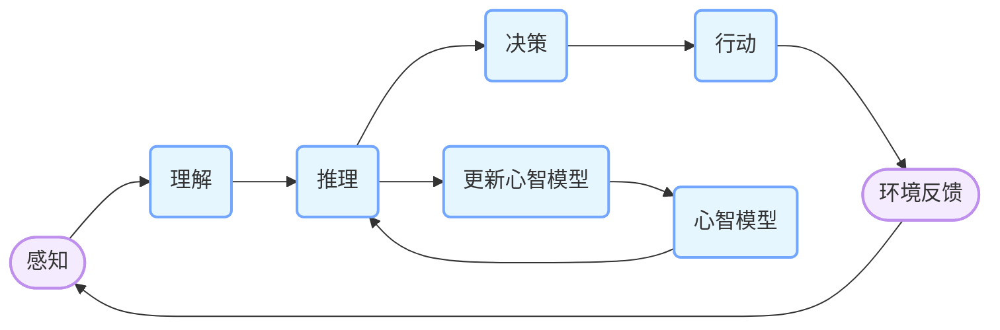

# AI Agent的认知计算与心智模型构建

> 关键词：AI Agent、认知计算、心智模型构建、人工智能、智能决策

> 摘要：本文聚焦于AI Agent的认知计算与心智模型构建这一前沿领域。详细阐述了AI Agent在认知计算方面的原理、核心算法，以及心智模型构建的数学基础和具体实现步骤。通过项目实战案例展示了如何在实际中运用相关技术，探讨了其广泛的应用场景。同时，推荐了一系列学习资源、开发工具和相关论文著作。最后对该领域的未来发展趋势与挑战进行了总结，并给出常见问题解答和扩展阅读参考资料，旨在为相关领域的研究者和开发者提供全面且深入的技术指导。

## 1. 背景介绍 
### 1.1 目的和范围
本文章的目的在于全面且深入地探讨AI Agent的认知计算与心智模型构建的相关技术。从理论基础出发，详细讲解核心概念、算法原理、数学模型等内容，再通过项目实战案例展示实际应用，最后对该领域的发展趋势和挑战进行分析。范围涵盖了AI Agent认知计算和心智模型构建的整个流程，包括相关的技术原理、实现方法、应用场景以及未来展望等方面。

### 1.2 预期读者
预期读者主要包括人工智能领域的研究者、开发者，对AI Agent技术感兴趣的计算机科学专业学生，以及希望了解认知计算和心智模型构建在实际应用中如何发挥作用的技术爱好者。

### 1.3 文档结构概述
本文首先介绍背景信息，让读者了解文章的目的、预期读者和整体结构。接着阐述核心概念与联系，包括认知计算和心智模型构建的原理和架构，并通过Mermaid流程图进行直观展示。然后详细讲解核心算法原理和具体操作步骤，结合Python源代码进行说明。之后介绍数学模型和公式，并举例说明其应用。通过项目实战部分展示代码实际案例并进行详细解释。探讨实际应用场景，推荐相关的工具和资源，包括学习资源、开发工具框架和相关论文著作。最后总结未来发展趋势与挑战，给出常见问题与解答以及扩展阅读和参考资料。

### 1.4 术语表
#### 1.4.1 核心术语定义
- **AI Agent**：是一种能够感知环境、进行决策并采取行动以实现特定目标的智能实体。它可以是软件程序、机器人或其他具有智能行为的系统。
- **认知计算**：模拟人类的认知过程，包括感知、理解、推理、学习和决策等，使计算机系统能够处理复杂的信息和问题。
- **心智模型构建**：为AI Agent创建一种内部的表示，用于理解和预测环境、规划行动以及与其他智能体进行交互。心智模型可以包括对环境的认知、自身的状态和目标等信息。

#### 1.4.2 相关概念解释
- **感知**：AI Agent通过传感器或其他输入设备获取环境信息的过程。
- **决策**：根据感知到的信息和心智模型，AI Agent选择合适的行动以实现目标的过程。
- **学习**：AI Agent通过经验和反馈不断改进自身性能和心智模型的过程。

#### 1.4.3 缩略词列表
- **AI**：Artificial Intelligence，人工智能
- **ML**：Machine Learning，机器学习
- **RL**：Reinforcement Learning，强化学习

## 2. 核心概念与联系 
### 2.1 认知计算原理
认知计算的核心在于模拟人类的认知过程，使计算机系统能够像人类一样理解和处理信息。它涉及多个方面，包括感知、理解、推理和学习等。

感知是认知计算的第一步，AI Agent通过各种传感器（如摄像头、麦克风、传感器网络等）获取环境信息。这些信息可以是图像、声音、文本、传感器数据等。

理解阶段是对感知到的信息进行分析和解释，将其转化为计算机能够处理的表示形式。例如，对于图像数据，理解过程可能包括目标检测、图像分类等任务；对于文本数据，可能包括语义分析、情感分析等。

推理是基于理解的信息进行逻辑推导和决策的过程。AI Agent可以根据已有的知识和规则，对当前的情况进行分析，预测未来的发展趋势，并做出相应的决策。

学习是认知计算的重要组成部分，它使AI Agent能够通过经验和反馈不断改进自身的性能。机器学习算法（如监督学习、无监督学习、强化学习等）可以用于从数据中学习模式和规律，从而提高AI Agent的智能水平。

### 2.2 心智模型构建原理
心智模型构建是为AI Agent创建一种内部的表示，用于理解和预测环境、规划行动以及与其他智能体进行交互。心智模型可以包括对环境的认知、自身的状态和目标等信息。

环境认知是心智模型的重要组成部分，它描述了AI Agent对周围环境的理解。这可以包括环境的物理特征（如地形、障碍物等）、其他智能体的状态和行为等。

自身状态表示AI Agent对自己当前状态的认知，包括位置、能量、健康状况等。目标则是AI Agent希望实现的结果，如完成任务、达到某个位置等。

通过心智模型，AI Agent可以进行预测和规划。它可以根据当前的环境和自身状态，预测未来的发展趋势，并制定相应的行动计划。同时，心智模型也可以用于与其他智能体进行交互，例如通过共享心智模型来实现协作和沟通。

### 2.3 核心概念架构
以下是认知计算与心智模型构建的核心概念架构示意图：



该架构展示了认知计算和心智模型构建的循环过程。AI Agent首先通过感知获取环境信息，然后进行理解、推理和决策，采取相应的行动。行动会对环境产生影响，环境反馈又会作为新的信息进入感知阶段。同时，心智模型为推理过程提供支持，推理结果又会更新心智模型，使其不断完善。

## 3. 核心算法原理 & 具体操作步骤 
### 3.1 认知计算算法原理
在认知计算中，机器学习算法起着重要的作用。以下以监督学习中的线性回归算法为例，详细讲解其原理和具体操作步骤。

线性回归是一种用于预测连续数值的机器学习算法。它的基本思想是通过找到一条直线（或超平面），使得该直线与训练数据的误差最小。

假设我们有一组训练数据 $(x_1, y_1), (x_2, y_2), \cdots, (x_n, y_n)$，其中 $x_i$ 是输入特征，$y_i$ 是对应的目标值。线性回归模型的假设函数可以表示为：

$$
h_{\theta}(x) = \theta_0 + \theta_1 x_1 + \theta_2 x_2 + \cdots + \theta_n x_n
$$

其中，$\theta_0, \theta_1, \cdots, \theta_n$ 是模型的参数。

为了找到最优的参数 $\theta$，我们需要定义一个损失函数，用于衡量模型预测值与真实值之间的误差。常用的损失函数是均方误差（Mean Squared Error，MSE）：

$$
J(\theta) = \frac{1}{2n} \sum_{i=1}^{n} (h_{\theta}(x^{(i)}) - y^{(i)})^2
$$

我们的目标是最小化损失函数 $J(\theta)$，可以使用梯度下降算法来实现。梯度下降算法的基本思想是沿着损失函数的负梯度方向更新参数，直到损失函数达到最小值。

梯度下降算法的更新公式为：

$$
\theta_j := \theta_j - \alpha \frac{\partial J(\theta)}{\partial \theta_j}
$$

其中，$\alpha$ 是学习率，控制每次更新的步长。

### 3.2 具体操作步骤
以下是使用Python实现线性回归算法的具体代码：

```python
import numpy as np

# 定义训练数据
X = np.array([[1], [2], [3], [4], [5]])
y = np.array([2, 4, 6, 8, 10])

# 添加偏置项
X_b = np.c_[np.ones((X.shape[0], 1)), X]

# 初始化参数
theta = np.random.randn(2, 1)

# 定义学习率和迭代次数
learning_rate = 0.01
n_iterations = 1000

# 梯度下降算法
for iteration in range(n_iterations):
    gradients = 2/X_b.shape[0] * X_b.T.dot(X_b.dot(theta) - y.reshape(-1, 1))
    theta = theta - learning_rate * gradients

# 输出最终参数
print("最终参数 theta:", theta)

# 预测新数据
new_X = np.array([[6]])
new_X_b = np.c_[np.ones((new_X.shape[0], 1)), new_X]
prediction = new_X_b.dot(theta)
print("预测值:", prediction)
```

### 3.3 代码解释
1. **数据准备**：首先，我们定义了训练数据 $X$ 和 $y$，并添加了偏置项 $X_b$。
2. **参数初始化**：随机初始化参数 $\theta$。
3. **梯度下降算法**：在每次迭代中，计算损失函数的梯度，并根据梯度更新参数 $\theta$。
4. **输出结果**：输出最终的参数 $\theta$，并使用该模型对新数据进行预测。

## 4. 数学模型和公式 & 详细讲解 & 举例说明 
### 4.1 线性回归数学模型
线性回归的数学模型可以表示为：

$$
y = \theta_0 + \theta_1 x_1 + \theta_2 x_2 + \cdots + \theta_n x_n + \epsilon
$$

其中，$y$ 是目标值，$x_1, x_2, \cdots, x_n$ 是输入特征，$\theta_0, \theta_1, \cdots, \theta_n$ 是模型的参数，$\epsilon$ 是误差项，服从均值为 0、方差为 $\sigma^2$ 的正态分布。

### 4.2 损失函数
如前所述，线性回归常用的损失函数是均方误差（MSE）：

$$
J(\theta) = \frac{1}{2n} \sum_{i=1}^{n} (h_{\theta}(x^{(i)}) - y^{(i)})^2
$$

其中，$h_{\theta}(x^{(i)})$ 是模型对第 $i$ 个样本的预测值，$y^{(i)}$ 是第 $i$ 个样本的真实值。

### 4.3 梯度计算
为了使用梯度下降算法更新参数，我们需要计算损失函数 $J(\theta)$ 对每个参数 $\theta_j$ 的偏导数：

$$
\frac{\partial J(\theta)}{\partial \theta_j} = \frac{1}{n} \sum_{i=1}^{n} (h_{\theta}(x^{(i)}) - y^{(i)}) x_j^{(i)}
$$

### 4.4 举例说明
假设我们有一组简单的训练数据：$(1, 2), (2, 4), (3, 6), (4, 8), (5, 10)$。我们可以使用线性回归模型来拟合这些数据。

根据上述公式，我们可以计算出损失函数 $J(\theta)$ 和梯度 $\frac{\partial J(\theta)}{\partial \theta_j}$。然后使用梯度下降算法不断更新参数 $\theta$，直到损失函数达到最小值。

在前面的Python代码中，我们已经实现了这个过程。最终得到的参数 $\theta$ 可以使模型对新数据进行准确的预测。

## 5. 项目实战：代码实际案例和详细解释说明 
### 5.1  开发环境搭建
在进行项目实战之前，我们需要搭建开发环境。以下是具体的步骤：

1. **安装Python**：可以从Python官方网站（https://www.python.org/downloads/）下载并安装Python 3.x版本。
2. **安装必要的库**：使用pip命令安装必要的库，如NumPy、Pandas、Scikit-learn等。

```bash
pip install numpy pandas scikit-learn
```

### 5.2  源代码详细实现和代码解读
我们将实现一个简单的AI Agent，用于解决一个简单的决策问题：在一个二维网格世界中，AI Agent需要找到从起点到终点的最短路径。

```python
import numpy as np
import heapq

# 定义网格世界
grid = np.array([
    [0, 0, 0, 0],
    [0, 1, 1, 0],
    [0, 1, 0, 0],
    [0, 0, 0, 0]
])

# 定义起点和终点
start = (0, 0)
end = (3, 3)

# 定义启发式函数（曼哈顿距离）
def heuristic(a, b):
    return abs(a[0] - b[0]) + abs(a[1] - b[1])

# A*算法实现
def a_star(grid, start, end):
    open_list = []
    heapq.heappush(open_list, (0, start))
    came_from = {}
    g_score = {start: 0}
    f_score = {start: heuristic(start, end)}

    while open_list:
        _, current = heapq.heappop(open_list)

        if current == end:
            path = []
            while current in came_from:
                path.append(current)
                current = came_from[current]
            path.append(start)
            path.reverse()
            return path

        for neighbor in [(0, 1), (0, -1), (1, 0), (-1, 0)]:
            neighbor_pos = (current[0] + neighbor[0], current[1] + neighbor[1])

            if neighbor_pos[0] < 0 or neighbor_pos[0] >= grid.shape[0] or neighbor_pos[1] < 0 or neighbor_pos[1] >= grid.shape[1]:
                continue

            if grid[neighbor_pos[0]][neighbor_pos[1]] == 1:
                continue

            tentative_g_score = g_score[current] + 1

            if neighbor_pos not in g_score or tentative_g_score < g_score[neighbor_pos]:
                came_from[neighbor_pos] = current
                g_score[neighbor_pos] = tentative_g_score
                f_score[neighbor_pos] = tentative_g_score + heuristic(neighbor_pos, end)
                heapq.heappush(open_list, (f_score[neighbor_pos], neighbor_pos))

    return None

# 运行A*算法
path = a_star(grid, start, end)
print("最短路径:", path)
```

### 5.3  代码解读与分析
1. **网格世界定义**：使用NumPy数组定义一个二维网格世界，其中 0 表示可通行区域，1 表示障碍物。
2. **起点和终点定义**：定义AI Agent的起点和终点。
3. **启发式函数**：使用曼哈顿距离作为启发式函数，用于估计从当前位置到终点的距离。
4. **A*算法实现**：使用A*算法来寻找从起点到终点的最短路径。A*算法是一种启发式搜索算法，结合了Dijkstra算法的最优性和贪心最佳优先搜索的高效性。
5. **结果输出**：输出找到的最短路径。

## 6. 实际应用场景 
### 6.1 智能机器人导航
在智能机器人领域，AI Agent的认知计算和心智模型构建可以用于机器人的导航和路径规划。机器人通过感知周围环境（如使用激光雷达、摄像头等传感器），构建对环境的心智模型。然后使用认知计算算法（如A*算法、Dijkstra算法等）进行路径规划，找到从当前位置到目标位置的最短路径。

### 6.2 自动驾驶汽车
自动驾驶汽车也是AI Agent认知计算和心智模型构建的重要应用场景。汽车通过各种传感器（如摄像头、毫米波雷达、超声波传感器等）感知周围环境，包括道路、交通标志、其他车辆和行人等。然后构建心智模型，对环境进行理解和预测。在决策阶段，使用认知计算算法（如强化学习、深度学习等）选择合适的驾驶策略，如加速、减速、转弯等。

### 6.3 智能客服系统
智能客服系统可以利用AI Agent的认知计算和心智模型构建技术，实现更加智能的客户服务。客服系统通过自然语言处理技术（如语音识别、语义分析等）理解客户的问题，构建对客户问题的心智模型。然后使用认知计算算法（如知识图谱、机器学习等）进行推理和决策，提供准确的答案和解决方案。

### 6.4 游戏开发
在游戏开发中，AI Agent的认知计算和心智模型构建可以用于实现智能的游戏角色。游戏角色通过感知游戏环境（如玩家的行动、游戏地图等），构建对环境的心智模型。然后使用认知计算算法（如行为树、有限状态机等）进行决策和行动，与玩家进行交互。

## 7. 工具和资源推荐
### 7.1 学习资源推荐
#### 7.1.1 书籍推荐
- 《人工智能：一种现代的方法》（Artificial Intelligence: A Modern Approach）：这是一本经典的人工智能教材，全面介绍了人工智能的各个领域，包括认知计算、机器学习、搜索算法等。
- 《深度学习》（Deep Learning）：由Ian Goodfellow、Yoshua Bengio和Aaron Courville撰写，详细介绍了深度学习的原理、算法和应用。
- 《强化学习：原理与Python实现》：介绍了强化学习的基本原理和算法，并通过Python代码进行实现。

#### 7.1.2 在线课程
- Coursera上的“人工智能基础”（Fundamentals of Artificial Intelligence）课程：由斯坦福大学教授授课，系统介绍了人工智能的基础知识和算法。
- edX上的“深度学习”（Deep Learning Specialization）课程：由Andrew Ng教授授课，深入讲解了深度学习的各个方面。
- Udemy上的“强化学习实战”（Reinforcement Learning in Action）课程：通过实际项目，帮助学习者掌握强化学习的应用。

#### 7.1.3 技术博客和网站
- Medium上的人工智能相关博客：有许多人工智能领域的专家和开发者分享他们的经验和见解。
- arXiv.org：一个预印本平台，提供了大量的人工智能研究论文。
- Towards Data Science：一个专注于数据科学和人工智能的技术博客，有许多高质量的文章。

### 7.2 开发工具框架推荐
#### 7.2.1 IDE和编辑器
- PyCharm：一款专业的Python集成开发环境，提供了丰富的功能和插件，方便开发者进行Python代码的编写和调试。
- Jupyter Notebook：一个交互式的开发环境，适合进行数据探索、模型训练和可视化等工作。
- Visual Studio Code：一款轻量级的代码编辑器，支持多种编程语言和插件，具有良好的扩展性。

#### 7.2.2 调试和性能分析工具
- TensorBoard：一个用于可视化深度学习模型训练过程的工具，可以帮助开发者监控模型的性能和参数变化。
- Py-Spy：一个用于分析Python代码性能的工具，可以帮助开发者找出代码中的性能瓶颈。
- pdb：Python自带的调试器，用于调试Python代码。

#### 7.2.3 相关框架和库
- TensorFlow：一个开源的深度学习框架，提供了丰富的工具和接口，方便开发者构建和训练深度学习模型。
- PyTorch：另一个流行的深度学习框架，具有动态图和易于使用的特点。
- Scikit-learn：一个用于机器学习的Python库，提供了各种机器学习算法和工具，如分类、回归、聚类等。

### 7.3 相关论文著作推荐
#### 7.3.1 经典论文
- “A* Search Algorithm”：介绍了A*搜索算法的原理和应用。
- “Reinforcement Learning: An Introduction”：强化学习领域的经典论文，系统介绍了强化学习的基本概念和算法。
- “Neural Networks and Deep Learning”：对神经网络和深度学习进行了深入的探讨。

#### 7.3.2 最新研究成果
- 关注顶级人工智能会议（如NeurIPS、ICML、CVPR等）上的最新研究论文，了解该领域的最新发展趋势。
- 阅读知名学术期刊（如Journal of Artificial Intelligence Research、Artificial Intelligence等）上的文章。

#### 7.3.3 应用案例分析
- 研究一些实际应用案例的论文，了解AI Agent的认知计算和心智模型构建技术在不同领域的应用和效果。

## 8. 总结：未来发展趋势与挑战
### 8.1 未来发展趋势
- **多模态融合**：未来的AI Agent将更加注重多模态信息的融合，如视觉、听觉、触觉等。通过融合多种信息，AI Agent可以更全面地感知环境，提高认知能力。
- **自主学习和进化**：AI Agent将具备更强的自主学习和进化能力，能够在没有人类干预的情况下不断学习和改进自己的性能。
- **与人类的协作和交互**：AI Agent将与人类进行更加紧密的协作和交互，成为人类的智能助手。例如，在医疗、教育、金融等领域，AI Agent可以为人类提供更加个性化的服务和支持。
- **跨领域应用**：AI Agent的认知计算和心智模型构建技术将在更多的领域得到应用，如农业、能源、交通等。

### 8.2 挑战
- **数据隐私和安全**：随着AI Agent的广泛应用，数据隐私和安全问题将变得更加突出。如何保护用户的隐私和数据安全，是一个亟待解决的问题。
- **可解释性和透明度**：目前的AI Agent大多是基于深度学习等黑盒模型，其决策过程难以解释和理解。如何提高AI Agent的可解释性和透明度，是一个重要的挑战。
- **伦理和道德问题**：AI Agent的应用可能会带来一些伦理和道德问题，如人工智能的决策是否符合人类的价值观和道德标准等。需要建立相应的伦理和道德准则，规范AI Agent的行为。
- **计算资源和能耗**：认知计算和心智模型构建需要大量的计算资源和能耗，如何降低计算成本和能耗，提高AI Agent的效率，是一个需要解决的问题。

## 9. 附录：常见问题与解答
### 9.1 什么是AI Agent？
AI Agent是一种能够感知环境、进行决策并采取行动以实现特定目标的智能实体。它可以是软件程序、机器人或其他具有智能行为的系统。

### 9.2 认知计算和传统计算有什么区别？
传统计算主要关注数据的处理和存储，而认知计算则模拟人类的认知过程，包括感知、理解、推理、学习和决策等。认知计算能够处理复杂的信息和问题，具有更强的智能和适应性。

### 9.3 心智模型构建的作用是什么？
心智模型构建为AI Agent创建一种内部的表示，用于理解和预测环境、规划行动以及与其他智能体进行交互。通过心智模型，AI Agent可以更好地适应环境变化，做出更明智的决策。

### 9.4 如何选择合适的算法进行认知计算？
选择合适的算法进行认知计算需要考虑多个因素，如问题的类型、数据的特点、计算资源等。例如，对于分类问题，可以选择决策树、支持向量机等算法；对于回归问题，可以选择线性回归、神经网络等算法。

### 9.5 AI Agent的认知计算和心智模型构建技术的应用前景如何？
AI Agent的认知计算和心智模型构建技术具有广阔的应用前景，在智能机器人、自动驾驶汽车、智能客服系统、游戏开发等领域都有重要的应用。随着技术的不断发展，其应用范围将不断扩大。

## 10. 扩展阅读 & 参考资料
### 10.1 扩展阅读
- 《智能时代》：介绍了人工智能在各个领域的应用和影响，以及对未来社会的展望。
- 《人类简史：从动物到上帝》：从人类进化的角度探讨了人类的认知和智能发展，对理解AI Agent的认知计算有一定的启发。
- 《失控：全人类的最终命运和结局》：探讨了复杂系统的自组织、自适应和进化等问题，对AI Agent的自主学习和进化有一定的参考价值。

### 10.2 参考资料
- 相关的学术论文和研究报告。
- 人工智能领域的开源项目和代码库。
- 各大科技公司的技术博客和官方文档。

作者：AI天才研究院/AI Genius Institute & 禅与计算机程序设计艺术 /Zen And The Art of Computer Programming