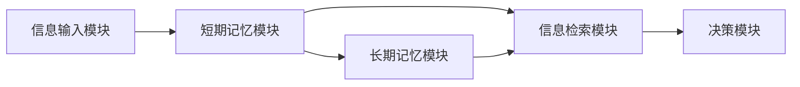

# AI Agent的记忆机制：设计与实现

> 关键词：AI Agent、记忆机制、设计、实现、长期记忆、短期记忆、知识表示

> 摘要：本文深入探讨了AI Agent的记忆机制，旨在为读者全面解析其设计与实现的核心要点。从背景介绍出发，阐述了研究AI Agent记忆机制的目的、范围及相关术语。详细讲解了核心概念，包括记忆机制的原理和架构，并通过Mermaid流程图进行直观展示。深入剖析了核心算法原理，结合Python源代码进行具体操作步骤的阐述。给出了相关数学模型和公式，并通过举例说明其应用。通过项目实战，展示了记忆机制在实际代码中的实现和解读。探讨了其实际应用场景，推荐了相关的学习资源、开发工具框架以及论文著作。最后对未来发展趋势与挑战进行总结，并提供了常见问题与解答以及扩展阅读参考资料，帮助读者全面深入地理解AI Agent的记忆机制。

## 1. 背景介绍 
### 1.1 目的和范围
AI Agent作为人工智能领域的重要概念，其记忆机制对于实现智能行为、学习和决策具有关键作用。本文章的目的在于系统地研究和阐述AI Agent记忆机制的设计与实现方法，为开发者和研究者提供全面的技术指导。范围涵盖了从基础概念到具体算法实现，再到实际应用场景和未来发展趋势的各个方面。

### 1.2 预期读者
本文预期读者包括人工智能领域的研究者、开发者、学生以及对AI Agent记忆机制感兴趣的技术爱好者。对于希望深入了解AI Agent记忆机制的原理和实现细节，以及希望将其应用到实际项目中的读者具有较高的参考价值。

### 1.3 文档结构概述
本文首先介绍背景信息，包括目的、范围、预期读者和术语表。接着详细讲解核心概念与联系，包括记忆机制的原理和架构，并通过Mermaid流程图进行直观展示。然后深入剖析核心算法原理，结合Python源代码进行具体操作步骤的阐述。给出相关数学模型和公式，并通过举例说明其应用。通过项目实战，展示记忆机制在实际代码中的实现和解读。探讨实际应用场景，推荐相关的学习资源、开发工具框架以及论文著作。最后对未来发展趋势与挑战进行总结，并提供常见问题与解答以及扩展阅读参考资料。

### 1.4 术语表
#### 1.4.1 核心术语定义
- **AI Agent**：人工智能代理，是能够感知环境、进行决策并采取行动以实现特定目标的智能实体。
- **记忆机制**：指AI Agent用于存储、管理和检索信息的机制，包括短期记忆和长期记忆。
- **短期记忆**：用于临时存储最近感知到的信息，具有容量有限和快速更新的特点。
- **长期记忆**：用于长期存储重要信息，如知识、经验和规则等。
- **知识表示**：将知识以计算机可处理的形式进行表示的方法。

#### 1.4.2 相关概念解释
- **感知**：AI Agent通过传感器获取环境信息的过程。
- **决策**：AI Agent根据感知到的信息和记忆中的知识，选择合适的行动方案的过程。
- **行动**：AI Agent根据决策结果，对环境进行操作的过程。

#### 1.4.3 缩略词列表
- **AI**：Artificial Intelligence，人工智能
- **RL**：Reinforcement Learning，强化学习
- **ML**：Machine Learning，机器学习

## 2. 核心概念与联系 
AI Agent的记忆机制主要包括短期记忆和长期记忆，它们在AI Agent的智能行为中发挥着不同的作用。短期记忆用于临时存储最近感知到的信息，以便AI Agent能够快速响应环境变化。长期记忆则用于长期存储重要信息，如知识、经验和规则等，为AI Agent的决策提供支持。

### 记忆机制的原理
记忆机制的原理基于信息的存储、管理和检索。AI Agent通过感知环境获取信息，并将其存储在短期记忆中。短期记忆中的信息会根据其重要性和时效性进行筛选和处理，一部分信息会被转移到长期记忆中进行长期存储。当AI Agent需要做出决策时，会从长期记忆和短期记忆中检索相关信息，以支持决策过程。

### 记忆机制的架构
记忆机制的架构主要包括信息输入模块、短期记忆模块、长期记忆模块和信息检索模块。信息输入模块负责将感知到的信息输入到记忆机制中。短期记忆模块用于临时存储最近感知到的信息。长期记忆模块用于长期存储重要信息。信息检索模块负责从短期记忆和长期记忆中检索相关信息，以支持决策过程。

### 文本示意图
```plaintext
+----------------+     +----------------+     +----------------+
| 信息输入模块   | --> | 短期记忆模块   | --> | 长期记忆模块   |
+----------------+     +----------------+     +----------------+
                            ^                      |
                            |                      v
                     +----------------+     +----------------+
                     | 信息检索模块   | <-- | 决策模块       |
                     +----------------+     +----------------+
```

### Mermaid流程图


## 3. 核心算法原理 & 具体操作步骤 
### 短期记忆算法原理
短期记忆的算法原理主要基于队列和遗忘机制。短期记忆可以看作是一个队列，新的信息不断加入队列的尾部，而旧的信息会从队列的头部移除。遗忘机制用于控制短期记忆的容量，当短期记忆的容量超过阈值时，会移除最早进入的信息。

### Python代码实现
```python
class ShortTermMemory:
    def __init__(self, capacity):
        self.capacity = capacity
        self.memory = []

    def add_memory(self, information):
        if len(self.memory) >= self.capacity:
            self.memory.pop(0)  # 移除最早进入的信息
        self.memory.append(information)

    def get_memory(self):
        return self.memory
```

### 具体操作步骤
1. 初始化短期记忆对象，设置容量。
2. 当有新的信息到来时，调用`add_memory`方法将信息添加到短期记忆中。
3. 当需要获取短期记忆中的信息时，调用`get_memory`方法。

### 长期记忆算法原理
长期记忆的算法原理主要基于知识表示和索引机制。知识表示用于将信息以计算机可处理的形式进行表示，如语义网络、本体等。索引机制用于快速检索长期记忆中的信息，如哈希表、B树等。

### Python代码实现
```python
class LongTermMemory:
    def __init__(self):
        self.memory = {}

    def add_memory(self, key, information):
        self.memory[key] = information

    def get_memory(self, key):
        if key in self.memory:
            return self.memory[key]
        else:
            return None
```

### 具体操作步骤
1. 初始化长期记忆对象。
2. 当有新的信息到来时，调用`add_memory`方法将信息添加到长期记忆中，同时指定一个唯一的键。
3. 当需要获取长期记忆中的信息时，调用`get_memory`方法，传入相应的键。

## 4. 数学模型和公式 & 详细讲解 & 举例说明 
### 短期记忆容量模型
短期记忆的容量可以用一个固定的整数 $C$ 来表示。设短期记忆中的信息数量为 $n$，当 $n > C$ 时，需要移除最早进入的信息，以保持短期记忆的容量不超过 $C$。

### 长期记忆索引模型
长期记忆的索引可以用一个哈希函数 $h(k)$ 来表示，其中 $k$ 是信息的键，$h(k)$ 是哈希函数的输出，用于确定信息在长期记忆中的存储位置。

### 举例说明
假设短期记忆的容量 $C = 3$，初始时短期记忆为空。依次添加信息 $A$、$B$、$C$，此时短期记忆中的信息为 $[A, B, C]$。再添加信息 $D$，由于短期记忆的容量已达到上限，最早进入的信息 $A$ 会被移除，此时短期记忆中的信息为 $[B, C, D]$。

假设长期记忆中有一个信息的键为 $k = "example_key"$，信息内容为 $v = "example_information"$。通过哈希函数 $h(k)$ 可以确定该信息在长期记忆中的存储位置。当需要获取该信息时，传入键 $k$，就可以从长期记忆中检索到对应的信息 $v$。

## 5. 项目实战：代码实际案例和详细解释说明 
### 5.1  开发环境搭建
- **操作系统**：Windows、Linux或macOS
- **编程语言**：Python 3.x
- **开发工具**：PyCharm、VS Code等

### 5.2  源代码详细实现和代码解读
```python
# 短期记忆类
class ShortTermMemory:
    def __init__(self, capacity):
        self.capacity = capacity
        self.memory = []

    def add_memory(self, information):
        if len(self.memory) >= self.capacity:
            self.memory.pop(0)  # 移除最早进入的信息
        self.memory.append(information)

    def get_memory(self):
        return self.memory

# 长期记忆类
class LongTermMemory:
    def __init__(self):
        self.memory = {}

    def add_memory(self, key, information):
        self.memory[key] = information

    def get_memory(self, key):
        if key in self.memory:
            return self.memory[key]
        else:
            return None

# AI Agent类
class AIAgent:
    def __init__(self, short_term_capacity):
        self.short_term_memory = ShortTermMemory(short_term_capacity)
        self.long_term_memory = LongTermMemory()

    def perceive(self, information):
        self.short_term_memory.add_memory(information)

    def learn(self, key, information):
        self.long_term_memory.add_memory(key, information)

    def recall_short_term(self):
        return self.short_term_memory.get_memory()

    def recall_long_term(self, key):
        return self.long_term_memory.get_memory(key)

# 主程序
if __name__ == "__main__":
    agent = AIAgent(3)

    # 感知信息
    agent.perceive("Info1")
    agent.perceive("Info2")
    agent.perceive("Info3")
    agent.perceive("Info4")

    # 输出短期记忆
    print("Short Term Memory:", agent.recall_short_term())

    # 学习信息
    agent.learn("key1", "Knowledge1")
    agent.learn("key2", "Knowledge2")

    # 输出长期记忆
    print("Long Term Memory (key1):", agent.recall_long_term("key1"))
    print("Long Term Memory (key2):", agent.recall_long_term("key2"))
```

### 5.3  代码解读与分析
- **ShortTermMemory类**：实现了短期记忆的功能，包括信息的添加和获取。使用列表来存储信息，当列表的长度超过容量时，移除最早进入的信息。
- **LongTermMemory类**：实现了长期记忆的功能，包括信息的添加和获取。使用字典来存储信息，通过键来索引信息。
- **AIAgent类**：集成了短期记忆和长期记忆的功能，提供了感知、学习、回忆短期记忆和回忆长期记忆的方法。
- **主程序**：创建了一个AI Agent对象，进行了信息的感知、学习和回忆操作，并输出了短期记忆和长期记忆的内容。

## 6. 实际应用场景 
### 智能客服
AI Agent的记忆机制可以用于智能客服系统中。短期记忆可以存储用户最近的提问和交互信息，以便快速响应用户的问题。长期记忆可以存储常见问题的答案、业务知识等，为客服人员提供参考。

### 自主机器人
在自主机器人中，记忆机制可以帮助机器人存储环境信息、任务信息和自身状态信息。短期记忆可以存储机器人最近感知到的环境信息，以便及时做出决策。长期记忆可以存储机器人的运动规则、地图信息等，为机器人的导航和操作提供支持。

### 游戏AI
在游戏AI中，记忆机制可以帮助AI Agent记住玩家的行为模式、游戏状态和策略。短期记忆可以存储玩家最近的操作信息，以便AI Agent快速响应。长期记忆可以存储游戏的历史数据和经验，为AI Agent的决策提供参考。

## 7. 工具和资源推荐
### 7.1 学习资源推荐
#### 7.1.1 书籍推荐
- 《人工智能：一种现代的方法》：全面介绍了人工智能的基本概念、算法和应用。
- 《机器学习》：详细讲解了机器学习的基本算法和模型。
- 《深度学习》：深入探讨了深度学习的原理和应用。

#### 7.1.2 在线课程
- Coursera上的“人工智能基础”课程：由知名教授授课，内容丰富，讲解详细。
- edX上的“机器学习导论”课程：提供了丰富的实践项目，帮助学生掌握机器学习的基本技能。
- Udemy上的“深度学习实战”课程：通过实际案例，帮助学生深入理解深度学习的应用。

#### 7.1.3 技术博客和网站
- Medium上的人工智能专栏：提供了大量的人工智能技术文章和案例分析。
- Towards Data Science：专注于数据科学和人工智能领域，分享最新的技术和研究成果。
- arXiv：提供了大量的学术论文，涵盖了人工智能的各个领域。

### 7.2 开发工具框架推荐
#### 7.2.1 IDE和编辑器
- PyCharm：功能强大的Python集成开发环境，提供了代码编辑、调试、版本控制等功能。
- VS Code：轻量级的代码编辑器，支持多种编程语言，具有丰富的插件扩展功能。
- Jupyter Notebook：交互式的编程环境，适合进行数据分析和机器学习实验。

#### 7.2.2 调试和性能分析工具
- pdb：Python内置的调试器，可用于调试Python代码。
- cProfile：Python的性能分析工具，可用于分析代码的性能瓶颈。
- TensorBoard：TensorFlow的可视化工具，可用于可视化训练过程和模型性能。

#### 7.2.3 相关框架和库
- TensorFlow：开源的深度学习框架，提供了丰富的深度学习模型和工具。
- PyTorch：另一个流行的深度学习框架，具有动态计算图和简洁的API。
- Scikit-learn：机器学习库，提供了各种机器学习算法和工具。

### 7.3 相关论文著作推荐
#### 7.3.1 经典论文
- “A Logical Calculus of the Ideas Immanent in Nervous Activity”：提出了神经元的数学模型，为人工智能的发展奠定了基础。
- “Learning Representations by Back-propagating Errors”：介绍了反向传播算法，是深度学习的核心算法之一。
- “Playing Atari with Deep Reinforcement Learning”：展示了深度强化学习在游戏中的应用。

#### 7.3.2 最新研究成果
- “Attention Is All You Need”：提出了Transformer模型，在自然语言处理领域取得了巨大成功。
- “Generative Adversarial Networks”：介绍了生成对抗网络，为生成式模型的发展带来了新的思路。
- “BERT: Pre-training of Deep Bidirectional Transformers for Language Understanding”：提出了BERT模型，在自然语言处理任务中取得了优异的成绩。

#### 7.3.3 应用案例分析
- “DeepMind's AlphaGo: Mastering the Game of Go”：分析了DeepMind的AlphaGo在围棋领域的应用和技术原理。
- “OpenAI's GPT-3: Transforming Natural Language Processing”：探讨了OpenAI的GPT-3在自然语言处理领域的应用和影响。
- “Tesla's Autopilot: Advancements in Autonomous Driving”：研究了特斯拉的Autopilot在自动驾驶领域的应用和技术挑战。

## 8. 总结：未来发展趋势与挑战
### 未来发展趋势
- **多模态记忆**：未来的AI Agent记忆机制将支持多模态信息的存储和处理，如文本、图像、音频等。
- **自适应记忆**：AI Agent将能够根据环境和任务的变化，自适应地调整记忆机制，提高记忆效率和准确性。
- **与生物记忆的融合**：借鉴生物记忆的原理和机制，开发更加智能和高效的AI Agent记忆机制。

### 挑战
- **数据隐私和安全**：随着AI Agent记忆机制的发展，数据隐私和安全问题将变得更加突出，需要采取有效的措施来保护用户的隐私和数据安全。
- **计算资源和效率**：处理大量的记忆信息需要消耗大量的计算资源，如何提高计算效率和降低能耗是一个亟待解决的问题。
- **知识表示和推理**：如何有效地表示和推理复杂的知识，是AI Agent记忆机制面临的一个重要挑战。

## 9. 附录：常见问题与解答
### 问题1：短期记忆和长期记忆的区别是什么？
短期记忆用于临时存储最近感知到的信息，具有容量有限和快速更新的特点。长期记忆用于长期存储重要信息，如知识、经验和规则等，容量较大且信息更新较慢。

### 问题2：如何选择合适的知识表示方法？
选择合适的知识表示方法需要考虑知识的类型、复杂度和应用场景等因素。常见的知识表示方法包括语义网络、本体、产生式规则等。

### 问题3：如何提高AI Agent记忆机制的性能？
可以通过优化算法、提高硬件性能、采用分布式计算等方法来提高AI Agent记忆机制的性能。同时，合理设计记忆机制的架构和参数也可以提高性能。

## 10. 扩展阅读 & 参考资料
- 《人工智能：复杂问题求解的