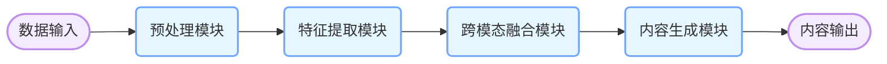

# AI Agent的跨模态内容理解与生成系统

> 关键词：AI Agent、跨模态、内容理解、内容生成、多模态融合

> 摘要：本文围绕AI Agent的跨模态内容理解与生成系统展开深入探讨。首先介绍了该系统提出的背景、目的、预期读者以及文档结构和相关术语。接着阐述了核心概念及其联系，包括跨模态内容理解与生成的原理和架构，并通过Mermaid流程图直观展示。详细讲解了核心算法原理，结合Python源代码进行说明，同时给出数学模型和公式并举例。在项目实战部分，介绍了开发环境搭建、源代码实现与解读。分析了系统的实际应用场景，推荐了学习资源、开发工具框架以及相关论文著作。最后总结了系统的未来发展趋势与挑战，解答常见问题并提供扩展阅读和参考资料。

## 1. 背景介绍 
### 1.1 目的和范围
在当今数字化信息爆炸的时代，数据呈现出多样化和多模态的特点，包括文本、图像、音频、视频等。传统的单模态处理技术已经难以满足对复杂信息全面理解和有效利用的需求。AI Agent的跨模态内容理解与生成系统旨在打破不同模态数据之间的壁垒，实现对多模态信息的深度融合、理解和创造性生成。其范围涵盖了从多模态数据的预处理、特征提取，到跨模态信息的关联分析和内容生成的全过程。

### 1.2 预期读者
本文预期读者包括人工智能领域的研究人员、开发者、学生，以及对跨模态技术感兴趣的从业者。对于研究人员，本文可以提供最新的技术思路和研究方向；开发者可以从中获取系统实现的具体方法和代码示例；学生能够借此深入了解跨模态技术的原理和应用；而对该领域感兴趣的从业者则可以通过本文了解跨模态技术在实际业务中的潜在价值。

### 1.3 文档结构概述
本文首先介绍相关背景知识，包括目的、读者群体和文档结构。接着阐述核心概念与联系，明确跨模态内容理解与生成的原理和架构。然后详细讲解核心算法原理和具体操作步骤，结合Python代码进行说明。之后给出数学模型和公式，并举例解释。在项目实战部分，介绍开发环境搭建、源代码实现和代码解读。分析实际应用场景，推荐学习资源、开发工具框架和相关论文著作。最后总结未来发展趋势与挑战，解答常见问题并提供扩展阅读和参考资料。

### 1.4 术语表
#### 1.4.1 核心术语定义
- **AI Agent**：一种能够感知环境、自主决策并采取行动以实现特定目标的智能实体。在本文中，AI Agent负责处理跨模态数据，完成理解和生成任务。
- **跨模态**：涉及两种或多种不同模态的数据，如文本与图像、音频与视频等，强调不同模态之间的交互和融合。
- **内容理解**：指对输入的多模态数据进行分析、解析，提取其中有意义的信息和语义，以便AI Agent能够理解数据所表达的含义。
- **内容生成**：基于对跨模态数据的理解，AI Agent根据特定的需求和规则，生成新的多模态内容，如文本描述、图像合成等。

#### 1.4.2 相关概念解释
- **多模态融合**：将不同模态的数据进行整合，提取互补信息，以获得更全面、准确的理解。融合的方式可以是早期融合、晚期融合或混合融合。
- **特征提取**：从原始的多模态数据中提取具有代表性和区分性的特征，以便后续的分析和处理。不同模态的数据通常需要采用不同的特征提取方法。
- **语义关联**：建立不同模态数据之间的语义联系，使得AI Agent能够理解不同模态数据所表达的相同或相关的语义信息。

#### 1.4.3 缩略词列表
- **CNN**：Convolutional Neural Network，卷积神经网络，常用于图像和视频数据的特征提取。
- **RNN**：Recurrent Neural Network，循环神经网络，适用于处理序列数据，如文本和音频。
- **Transformer**：一种基于注意力机制的神经网络架构，在自然语言处理和跨模态任务中取得了显著成果。
- **GAN**：Generative Adversarial Network，生成对抗网络，用于生成新的内容，如图像和文本。

## 2. 核心概念与联系 
### 核心概念原理
AI Agent的跨模态内容理解与生成系统的核心原理在于对不同模态数据的协同处理和融合。不同模态的数据具有各自独特的特征和语义信息，系统需要通过特定的方法将这些信息进行整合和关联。

在内容理解阶段，系统首先对不同模态的数据进行预处理，包括数据清洗、归一化等操作。然后，针对每种模态的数据，采用合适的特征提取方法提取其特征表示。例如，对于图像数据，可以使用CNN提取视觉特征；对于文本数据，可以使用Transformer提取语义特征。接着，系统通过跨模态对齐和融合技术，将不同模态的特征进行关联和整合，以获得更全面的语义表示。

在内容生成阶段，系统基于理解阶段得到的跨模态语义表示，根据特定的生成任务和规则，生成新的多模态内容。生成过程可以采用多种方法，如基于模板的生成、基于生成模型（如GAN）的生成等。

### 架构的文本示意图
该系统主要由以下几个模块组成：
1. **数据输入模块**：负责接收不同模态的数据，如文本、图像、音频等。
2. **预处理模块**：对输入的数据进行清洗、归一化等预处理操作，以提高数据的质量。
3. **特征提取模块**：针对不同模态的数据，采用相应的特征提取方法提取特征表示。
4. **跨模态融合模块**：将不同模态的特征进行关联和融合，得到跨模态语义表示。
5. **内容生成模块**：基于跨模态语义表示，根据特定的任务和规则生成新的多模态内容。
6. **输出模块**：将生成的内容输出，如文本描述、图像合成等。

### Mermaid流程图


## 3. 核心算法原理 & 具体操作步骤 
### 特征提取算法
#### 图像特征提取（以CNN为例）
CNN是一种专门用于处理图像数据的神经网络架构，其核心思想是通过卷积层提取图像的局部特征。以下是一个简单的Python代码示例，使用PyTorch实现一个简单的CNN模型进行图像特征提取：
```python
import torch
import torch.nn as nn

class SimpleCNN(nn.Module):
    def __init__(self):
        super(SimpleCNN, self).__init__()
        self.conv1 = nn.Conv2d(3, 16, kernel_size=3, padding=1)
        self.relu1 = nn.ReLU()
        self.pool1 = nn.MaxPool2d(2)
        self.conv2 = nn.Conv2d(16, 32, kernel_size=3, padding=1)
        self.relu2 = nn.ReLU()
        self.pool2 = nn.MaxPool2d(2)

    def forward(self, x):
        x = self.pool1(self.relu1(self.conv1(x)))
        x = self.pool2(self.relu2(self.conv2(x)))
        return x

# 示例使用
model = SimpleCNN()
input_image = torch.randn(1, 3, 224, 224)  # 假设输入图像为224x224的RGB图像
features = model(input_image)
print(features.shape)
```
#### 文本特征提取（以Transformer为例）
Transformer是一种基于注意力机制的神经网络架构，在自然语言处理中取得了巨大成功。以下是一个使用Hugging Face的`transformers`库进行文本特征提取的示例：
```python
from transformers import AutoTokenizer, AutoModel
import torch

tokenizer = AutoTokenizer.from_pretrained('bert-base-uncased')
model = AutoModel.from_pretrained('bert-base-uncased')

text = "This is an example sentence."
inputs = tokenizer(text, return_tensors='pt')
outputs = model(**inputs)
last_hidden_states = outputs.last_hidden_state
print(last_hidden_states.shape)
```

### 跨模态融合算法
跨模态融合的一种常见方法是早期融合，即将不同模态的特征在输入层进行拼接，然后输入到一个联合模型中进行处理。以下是一个简单的早期融合示例：
```python
import torch
import torch.nn as nn

class EarlyFusionModel(nn.Module):
    def __init__(self, image_feature_dim, text_feature_dim, hidden_dim):
        super(EarlyFusionModel, self).__init__()
        self.fc1 = nn.Linear(image_feature_dim + text_feature_dim, hidden_dim)
        self.relu = nn.ReLU()
        self.fc2 = nn.Linear(hidden_dim, 1)

    def forward(self, image_features, text_features):
        combined_features = torch.cat((image_features, text_features), dim=1)
        x = self.relu(self.fc1(combined_features))
        x = self.fc2(x)
        return x

# 示例使用
image_feature_dim = 128
text_feature_dim = 768
hidden_dim = 256
model = EarlyFusionModel(image_feature_dim, text_feature_dim, hidden_dim)
image_features = torch.randn(1, image_feature_dim)
text_features = torch.randn(1, text_feature_dim)
output = model(image_features, text_features)
print(output.shape)
```

### 内容生成算法
以基于模板的文本生成为例，以下是一个简单的Python代码示例：
```python
templates = [
    "The image shows a {object} in a {scene}.",
    "There is a {object} in the {scene} of the image."
]

def generate_text(object_name, scene_name):
    import random
    template = random.choice(templates)
    text = template.format(object=object_name, scene=scene_name)
    return text

# 示例使用
object_name = "cat"
scene_name = "garden"
generated_text = generate_text(object_name, scene_name)
print(generated_text)
```

## 4. 数学模型和公式 & 详细讲解 & 举例说明 
### 特征提取的数学模型
#### CNN的卷积操作
CNN的卷积操作可以用以下公式表示：
$$y_{i,j}^l = \sum_{m=0}^{M-1} \sum_{n=0}^{N-1} x_{i+m,j+n}^{l-1} \cdot w_{m,n}^l + b^l$$
其中，$y_{i,j}^l$ 是第 $l$ 层卷积层输出特征图中位置 $(i,j)$ 的值，$x_{i+m,j+n}^{l-1}$ 是第 $l-1$ 层输入特征图中位置 $(i+m,j+n)$ 的值，$w_{m,n}^l$ 是第 $l$ 层卷积核中位置 $(m,n)$ 的权重，$b^l$ 是第 $l$ 层的偏置，$M$ 和 $N$ 分别是卷积核的高度和宽度。

例如，假设输入特征图是一个 $3\times3$ 的矩阵，卷积核是一个 $2\times2$ 的矩阵，偏置为 $0$。输入特征图 $x$ 为：
$$
x = 
\begin{bmatrix}
1 & 2 & 3 \\
4 & 5 & 6 \\
7 & 8 & 9
\end{bmatrix}
$$
卷积核 $w$ 为：
$$
w = 
\begin{bmatrix}
1 & 2 \\
3 & 4
\end{bmatrix}
$$
则卷积操作的结果 $y$ 为：
$$
y_{0,0} = 1\times1 + 2\times2 + 4\times3 + 5\times4 = 37
$$
$$
y_{0,1} = 2\times1 + 3\times2 + 5\times3 + 6\times4 = 47
$$
$$
y_{1,0} = 4\times1 + 5\times2 + 7\times3 + 8\times4 = 67
$$
$$
y_{1,1} = 5\times1 + 6\times2 + 8\times3 + 9\times4 = 77
$$
所以，输出特征图 $y$ 为：
$$
y = 
\begin{bmatrix}
37 & 47 \\
67 & 77
\end{bmatrix}
$$

#### Transformer的注意力机制
Transformer的注意力机制可以用以下公式表示：
$$Attention(Q, K, V) = softmax(\frac{QK^T}{\sqrt{d_k}})V$$
其中，$Q$ 是查询矩阵，$K$ 是键矩阵，$V$ 是值矩阵，$d_k$ 是键向量的维度。

例如，假设 $Q$、$K$ 和 $V$ 都是 $3\times3$ 的矩阵：
$$
Q = 
\begin{bmatrix}
1 & 2 & 3 \\
4 & 5 & 6 \\
7 & 8 & 9
\end{bmatrix}
$$
$$
K = 
\begin{bmatrix}
2 & 3 & 4 \\
5 & 6 & 7 \\
8 & 9 & 10
\end{bmatrix}
$$
$$
V = 
\begin{bmatrix}
3 & 4 & 5 \\
6 & 7 & 8 \\
9 & 10 & 11
\end{bmatrix}
$$
首先计算 $QK^T$：
$$
QK^T = 
\begin{bmatrix}
1\times2 + 2\times5 + 3\times8 & 1\times3 + 2\times6 + 3\times9 & 1\times4 + 2\times7 + 3\times10 \\
4\times2 + 5\times5 + 6\times8 & 4\times3 + 5\times6 + 6\times9 & 4\times4 + 5\times7 + 6\times10 \\
7\times2 + 8\times5 + 9\times8 & 7\times3 + 8\times6 + 9\times9 & 7\times4 + 8\times7 + 9\times10
\end{bmatrix}
= 
\begin{bmatrix}
36 & 42 & 48 \\
81 & 96 & 111 \\
126 & 150 & 174
\end{bmatrix}
$$
假设 $d_k = 3$，则 $\frac{QK^T}{\sqrt{d_k}}$ 为：
$$
\frac{QK^T}{\sqrt{d_k}} = 
\begin{bmatrix}
\frac{36}{\sqrt{3}} & \frac{42}{\sqrt{3}} & \frac{48}{\sqrt{3}} \\
\frac{81}{\sqrt{3}} & \frac{96}{\sqrt{3}} & \frac{111}{\sqrt{3}} \\
\frac{126}{\sqrt{3}} & \frac{150}{\sqrt{3}} & \frac{174}{\sqrt{3}}
\end{bmatrix}
$$
然后对 $\frac{QK^T}{\sqrt{d_k}}$ 进行 softmax 操作：
$$softmax(\frac{QK^T}{\sqrt{d_k}})$$
最后将结果与 $V$ 相乘得到注意力输出：
$$Attention(Q, K, V) = softmax(\frac{QK^T}{\sqrt{d_k}})V$$

### 跨模态融合的数学模型
早期融合的数学模型可以表示为：
$$h = f([x_{image}; x_{text}])$$
其中，$x_{image}$ 是图像特征向量，$x_{text}$ 是文本特征向量，$[x_{image}; x_{text}]$ 表示将两个向量拼接在一起，$f$ 是一个非线性函数，如神经网络中的全连接层和激活函数。

例如，假设 $x_{image} = [1, 2, 3]$，$x_{text} = [4, 5, 6]$，则拼接后的向量为 $[1, 2, 3, 4, 5, 6]$。如果 $f$ 是一个简单的全连接层，其权重矩阵 $W$ 为 $2\times6$ 的矩阵，偏置向量 $b$ 为 $2$ 维向量，则：
$$h = W[x_{image}; x_{text}] + b$$

### 内容生成的数学模型
基于模板的内容生成可以看作是一个替换操作。假设模板 $T$ 是一个字符串，包含一些占位符，如 $\{object\}$ 和 $\{scene\}$，替换规则为将占位符替换为具体的实体名称。数学上可以表示为：
$$G(T, o, s) = T.replace(\{object\}, o).replace(\{scene\}, s)$$
其中，$G$ 是生成函数，$T$ 是模板，$o$ 是对象名称，$s$ 是场景名称。

例如，模板 $T =$ "The image shows a {object} in a {scene}."，对象名称 $o =$ "dog"，场景名称 $s =$ "park"，则生成的文本为：
$$G(T, o, s) = \text{"The image shows a dog in a park."}$$

## 5. 项目实战：代码实际案例和详细解释说明 
### 5.1  开发环境搭建
#### 操作系统
推荐使用Ubuntu 18.04及以上版本或Windows 10及以上版本。

#### 编程语言和库
- **Python**：推荐使用Python 3.7及以上版本。
- **深度学习框架**：推荐使用PyTorch，可通过以下命令安装：
```sh
pip install torch torchvision
```
- **自然语言处理库**：推荐使用Hugging Face的`transformers`库，可通过以下命令安装：
```sh
pip install transformers
```
- **图像处理库**：推荐使用`Pillow`库，可通过以下命令安装：
```sh
pip install pillow
```

#### 数据集
可以使用公开的跨模态数据集，如MS COCO（包含图像和对应的文本描述）。下载地址为：https://cocodataset.org/

### 5.2  源代码详细实现和代码解读
以下是一个完整的AI Agent跨模态内容理解与生成系统的代码示例，包括图像特征提取、文本特征提取、跨模态融合和内容生成：
```python
import torch
import torch.nn as nn
from transformers import AutoTokenizer, AutoModel
from PIL import Image
import torchvision.transforms as transforms

# 图像特征提取模型
class SimpleCNN(nn.Module):
    def __init__(self):
        super(SimpleCNN, self).__init__()
        self.conv1 = nn.Conv2d(3, 16, kernel_size=3, padding=1)
        self.relu1 = nn.ReLU()
        self.pool1 = nn.MaxPool2d(2)
        self.conv2 = nn.Conv2d(16, 32, kernel_size=3, padding=1)
        self.relu2 = nn.ReLU()
        self.pool2 = nn.MaxPool2d(2)

    def forward(self, x):
        x = self.pool1(self.relu1(self.conv1(x)))
        x = self.pool2(self.relu2(self.conv2(x)))
        x = torch.flatten(x, start_dim=1)
        return x

# 文本特征提取模型
tokenizer = AutoTokenizer.from_pretrained('bert-base-uncased')
text_model = AutoModel.from_pretrained('bert-base-uncased')

# 跨模态融合模型
class EarlyFusionModel(nn.Module):
    def __init__(self, image_feature_dim, text_feature_dim, hidden_dim):
        super(EarlyFusionModel, self).__init__()
        self.fc1 = nn.Linear(image_feature_dim + text_feature_dim, hidden_dim)
        self.relu = nn.ReLU()
        self.fc2 = nn.Linear(hidden_dim, 1)

    def forward(self, image_features, text_features):
        combined_features = torch.cat((image_features, text_features), dim=1)
        x = self.relu(self.fc1(combined_features))
        x = self.fc2(x)
        return x

# 内容生成模板
templates = [
    "The image shows a {object} in a {scene}.",
    "There is a {object} in the {scene} of the image."
]

def generate_text(object_name, scene_name):
    import random
    template = random.choice(templates)
    text = template.format(object=object_name, scene=scene_name)
    return text

# 主函数
def main():
    # 加载图像
    image_path = 'example.jpg'
    image = Image.open(image_path).convert('RGB')
    transform = transforms.Compose([
        transforms.Resize((224, 224)),
        transforms.ToTensor(),
        transforms.Normalize(mean=[0.485, 0.456, 0.406], std=[0.229, 0.224, 0.225])
    ])
    image = transform(image).unsqueeze(0)

    # 提取图像特征
    image_model = SimpleCNN()
    image_features = image_model(image)

    # 提取文本特征
    text = "A cat in a garden"
    inputs = tokenizer(text, return_tensors='pt')
    outputs = text_model(**inputs)
    text_features = outputs.last_hidden_state.mean(dim=1)

    # 跨模态融合
    image_feature_dim = image_features.shape[1]
    text_feature_dim = text_features.shape[1]
    hidden_dim = 256
    fusion_model = EarlyFusionModel(image_feature_dim, text_feature_dim, hidden_dim)
    output = fusion_model(image_features, text_features)

    # 内容生成
    object_name = "cat"
    scene_name = "garden"
    generated_text = generate_text(object_name, scene_name)
    print("Generated text:", generated_text)

if __name__ == "__main__":
    main()
```

### 5.3  代码解读与分析
- **图像特征提取**：定义了一个简单的CNN模型`SimpleCNN`，用于提取图像的特征。通过`torchvision.transforms`对图像进行预处理，然后将图像输入到CNN模型中得到图像特征。
- **文本特征提取**：使用Hugging Face的`transformers`库加载预训练的BERT模型，对输入的文本进行编码，取最后一层隐藏状态的平均值作为文本特征。
- **跨模态融合**：定义了一个早期融合模型`EarlyFusionModel`，将图像特征和文本特征拼接在一起，通过全连接层和激活函数进行处理。
- **内容生成**：定义了一个基于模板的文本生成函数`generate_text`，根据输入的对象名称和场景名称生成文本描述。

## 6. 实际应用场景 
### 智能多媒体搜索
通过跨模态内容理解，用户可以使用文本描述搜索相关的图像、视频等多媒体内容，也可以上传图像搜索相关的文本信息。例如，用户输入“一只在海边奔跑的狗”，系统可以搜索出符合该描述的图像或视频。

### 图像和视频自动标注
利用跨模态技术，系统可以自动为图像和视频生成准确的文本标注。这对于图像和视频的管理、检索和分享非常有帮助。例如，在社交媒体平台上，系统可以自动为用户上传的照片添加合适的标签。

### 多模态对话系统
在对话系统中引入跨模态信息，如语音、图像等，可以提高对话的自然度和交互性。例如，用户可以在对话中发送图像，系统可以根据图像内容进行回复。

### 辅助创作
跨模态内容生成系统可以为创作者提供灵感和辅助。例如，设计师可以输入一段文字描述，系统可以生成相关的图像素材；作家可以输入一张图片，系统可以生成相关的故事梗概。

### 智能安防
结合图像和视频监控数据与文本信息（如报警信息、人员描述等），可以实现更高效的安防监控和预警。例如，当监控摄像头捕捉到可疑人员的图像时，系统可以根据预设的文本描述进行比对和报警。

## 7. 工具和资源推荐
### 7.1 学习资源推荐
#### 7.1.1 书籍推荐
- 《深度学习》（Deep Learning）：由Ian Goodfellow、Yoshua Bengio和Aaron Courville撰写，是深度学习领域的经典教材，涵盖了神经网络、卷积神经网络、循环神经网络等基础知识。
- 《自然语言处理入门》（Natural Language Processing with Python）：介绍了使用Python进行自然语言处理的基本方法和技术，包括文本预处理、词性标注、命名实体识别等。
- 《计算机视觉：算法与应用》（Computer Vision: Algorithms and Applications）：详细介绍了计算机视觉的基本算法和应用，如图像处理、特征提取、目标检测等。

#### 7.1.2 在线课程
- Coursera上的“深度学习专项课程”（Deep Learning Specialization）：由Andrew Ng教授主讲，涵盖了深度学习的各个方面，包括神经网络、卷积神经网络、循环神经网络等。
- edX上的“自然语言处理基础”（Foundations of Natural Language Processing）：介绍了自然语言处理的基本概念和技术，包括词法分析、句法分析、语义分析等。
- Udemy上的“计算机视觉实战课程”（Computer Vision A-Z: Hands-On Artificial Intelligence with OpenCV）：通过实际项目介绍了计算机视觉的应用，如图像处理、目标检测、人脸识别等。

#### 7.1.3 技术博客和网站
- Medium：有许多关于人工智能、深度学习、跨模态技术的优质博客文章。
- arXiv：提供了大量的学术论文，包括跨模态领域的最新研究成果。
- Hugging Face博客：分享了关于自然语言处理和跨模态技术的最新进展和应用案例。

### 7.2 开发工具框架推荐
#### 7.2.1 IDE和编辑器
- PyCharm：一款专业的Python集成开发环境，提供了丰富的代码编辑、调试和项目管理功能。
- Jupyter Notebook：一种交互式的开发环境，适合进行数据分析、模型训练和实验验证。
- Visual Studio Code：一款轻量级的代码编辑器，支持多种编程语言和插件扩展。

#### 7.2.2 调试和性能分析工具
- PyTorch Profiler：用于分析PyTorch模型的性能瓶颈，帮助优化模型的训练和推理速度。
- TensorBoard：一个可视化工具，可用于监控模型的训练过程、查看模型的结构和性能指标。
- NVIDIA Nsight Systems：用于分析GPU应用程序的性能，帮助优化GPU代码。

#### 7.2.3 相关框架和库
- PyTorch：一个开源的深度学习框架，提供了丰富的神经网络层和优化算法，支持GPU加速。
- TensorFlow：另一个流行的深度学习框架，具有强大的分布式训练和部署能力。
- OpenCV：一个开源的计算机视觉库，提供了各种图像处理和计算机视觉算法。

### 7.3 相关论文著作推荐
#### 7.3.1 经典论文
- "Attention Is All You Need"：提出了Transformer架构，为自然语言处理和跨模态任务带来了革命性的变化。
- "Show, Attend and Tell: Neural Image Caption Generation with Visual Attention"：介绍了一种基于注意力机制的图像描述生成方法。
- "Fusion of Visual and Linguistic Features for Image Classification"：探讨了如何融合视觉和语言特征进行图像分类。

#### 7.3.2 最新研究成果
- "Multimodal Transformer for Unaligned Multimodal Language Sequences"：提出了一种用于处理未对齐多模态语言序列的多模态Transformer模型。
- "CLIP: Connecting Text and Images"：介绍了CLIP模型，它能够学习文本和图像之间的关联，实现跨模态检索和生成。
- "Unifying Vision-and-Language Tasks via Text Generation"：提出了一种通过文本生成统一视觉和语言任务的方法。

#### 7.3.3 应用案例分析
- "Multimodal AI in Healthcare: A Survey"：分析了跨模态技术在医疗领域的应用案例和挑战。
- "Multimodal Sentiment Analysis: A Survey"：综述了跨模态情感分析的研究现状和应用案例。
- "Multimodal Learning for Autonomous Vehicles: A Review"：介绍了跨模态学习在自动驾驶领域的应用和发展趋势。

## 8. 总结：未来发展趋势与挑战
### 未来发展趋势
#### 更强大的跨模态模型
未来的跨模态模型将更加复杂和强大，能够处理更多种类的模态数据，如触觉、嗅觉等，实现更加全面和深入的跨模态理解和生成。

#### 多模态预训练模型的广泛应用
多模态预训练模型将成为跨模态任务的主流方法，通过在大规模多模态数据上进行预训练，模型可以学习到更通用的跨模态表示，从而在各种下游任务中取得更好的性能。

#### 跨模态技术与其他领域的融合
跨模态技术将与物联网、区块链、量子计算等其他领域进行深度融合，创造出更多的应用场景和商业价值。

#### 跨模态人机交互的发展
随着跨模态技术的不断进步，人机交互将变得更加自然和智能。用户可以通过多种模态与计算机进行交互，如语音、手势、表情等，计算机也可以通过多种模态向用户反馈信息。

### 挑战
#### 数据标注和质量问题
跨模态数据的标注成本高、难度大，而且数据质量参差不齐。如何获取高质量的跨模态标注数据是一个亟待解决的问题。

#### 计算资源和效率问题
跨模态模型通常比较复杂，需要大量的计算资源和时间进行训练和推理。如何提高模型的计算效率，降低计算成本，是跨模态技术发展的关键挑战之一。

#### 语义对齐和融合问题
不同模态的数据具有不同的语义表示和特征空间，如何实现不同模态之间的语义对齐和有效融合，是跨模态技术的核心难题。

#### 伦理和安全问题
跨模态技术的应用可能会带来一些伦理和安全问题，如隐私泄露、虚假信息传播等。如何确保跨模态技术的安全和可靠应用，是需要关注的重要问题。

## 9. 附录：常见问题与解答
### 问题1：跨模态内容理解和生成系统的训练数据从哪里获取？
可以使用公开的跨模态数据集，如MS COCO、Flickr30K等。此外，也可以自己收集和标注数据，但需要注意数据的质量和标注的准确性。

### 问题2：如何选择合适的跨模态融合方法？
选择合适的跨模态融合方法需要考虑数据的特点、任务的需求和模型的复杂度等因素。早期融合方法简单直接，但可能会丢失一些模态特有的信息；晚期融合方法可以保留更多的模态信息，但计算复杂度较高。可以根据具体情况选择合适的融合方法，也可以尝试多种融合方法进行比较。

### 问题3：跨模态内容生成的质量如何评估？
可以使用一些客观指标，如BLEU、ROUGE等，来评估生成文本的质量。对于图像和视频生成的质量评估，可以使用人类评价和一些视觉质量指标，如PSNR、SSIM等。

### 问题4：跨模态技术在实际应用中面临哪些挑战？
跨模态技术在实际应用中面临数据标注和质量问题、计算资源和效率问题、语义对齐和融合问题以及伦理和安全问题等挑战。需要在数据处理、模型设计和应用管理等方面进行优化和改进。

## 10. 扩展阅读 & 参考资料
### 扩展阅读
- 《人工智能：现代方法》（Artificial Intelligence: A Modern Approach）：全面介绍了人工智能的基本概念、方法和应用。
- 《机器学习》（Machine Learning）：详细介绍了机器学习的各种算法和模型，包括监督学习、无监督学习和强化学习等。
- 《深度学习实战》（Deep Learning in Practice）：通过实际项目介绍了深度学习的应用和实践技巧。

### 参考资料
- Hugging Face官方文档：https://huggingface.co/docs
- PyTorch官方文档：https://pytorch.org/docs/stable/index.html
- TensorFlow官方文档：https://www.tensorflow.org/api_docs

作者：AI天才研究院/AI Genius Institute & 禅与计算机程序设计艺术 /Zen And The Art of Computer Programming