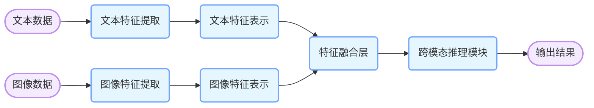

# AI Agent的跨模态学习与推理实现

> 关键词：AI Agent、跨模态学习、跨模态推理、多模态数据、深度学习

> 摘要：本文围绕AI Agent的跨模态学习与推理实现展开深入探讨。首先介绍了相关背景，包括目的、预期读者、文档结构和术语表等内容。接着详细阐述了核心概念与联系，通过文本示意图和Mermaid流程图展示其原理和架构。在核心算法原理与具体操作步骤部分，使用Python代码进行了详细说明。同时给出了数学模型和公式，并举例进行讲解。项目实战部分提供了开发环境搭建、源代码实现及解读。还探讨了实际应用场景，推荐了相关工具和资源，最后总结了未来发展趋势与挑战，提供了常见问题解答和扩展阅读参考资料，旨在为读者全面呈现AI Agent跨模态学习与推理的技术全貌。

## 1. 背景介绍 
### 1.1 目的和范围
随着人工智能技术的不断发展，单一模态的数据处理已经难以满足复杂场景下的需求。AI Agent的跨模态学习与推理旨在让智能体能够同时处理和理解多种不同类型的数据，如文本、图像、音频等，从而实现更强大的智能决策和交互能力。本文章的范围涵盖了AI Agent跨模态学习与推理的基本概念、核心算法、数学模型、实际应用以及相关工具和资源等方面，旨在为读者提供一个全面且深入的技术指南。

### 1.2 预期读者
本文预期读者包括人工智能领域的研究人员、开发人员、工程师以及对跨模态学习和推理感兴趣的技术爱好者。对于有一定机器学习和深度学习基础的读者，本文可以帮助他们进一步深入了解跨模态学习与推理的原理和实现方法；对于初学者，本文也提供了必要的基础知识和详细的讲解，有助于他们逐步建立起对该领域的认识。

### 1.3 文档结构概述
本文共分为十个部分。第一部分为背景介绍，包括目的、预期读者、文档结构概述和术语表；第二部分阐述核心概念与联系，通过文本示意图和Mermaid流程图展示其原理和架构；第三部分介绍核心算法原理和具体操作步骤，使用Python代码进行详细阐述；第四部分给出数学模型和公式，并举例说明；第五部分是项目实战，包括开发环境搭建、源代码详细实现和代码解读；第六部分探讨实际应用场景；第七部分推荐相关工具和资源；第八部分总结未来发展趋势与挑战；第九部分为附录，提供常见问题与解答；第十部分给出扩展阅读和参考资料。

### 1.4 术语表
#### 1.4.1 核心术语定义
- **AI Agent**：智能体，是一种能够感知环境、做出决策并执行动作的智能实体。
- **跨模态学习**：指让模型能够同时学习和处理多种不同模态的数据，以获取更全面和丰富的信息。
- **跨模态推理**：基于跨模态学习的结果，在不同模态之间进行逻辑推理和信息交互的过程。
- **多模态数据**：包含多种不同类型的数据，如文本、图像、音频、视频等。

#### 1.4.2 相关概念解释
- **模态**：表示数据的类型或形式，不同的模态具有不同的特征和表达方式。例如，文本模态以文字形式呈现信息，图像模态以像素矩阵形式表示视觉内容。
- **特征表示**：将不同模态的数据转换为计算机能够处理的数值向量，以便进行后续的学习和推理。
- **对齐**：在跨模态学习中，将不同模态的数据在特征空间中进行匹配和对应，使得它们能够相互关联和理解。

#### 1.4.3 缩略词列表
- **CNN**：Convolutional Neural Network，卷积神经网络
- **RNN**：Recurrent Neural Network，循环神经网络
- **Transformer**：一种基于注意力机制的深度学习模型架构
- **BERT**：Bidirectional Encoder Representations from Transformers，一种预训练的语言模型

## 2. 核心概念与联系 
### 核心概念原理
AI Agent的跨模态学习与推理的核心在于让智能体能够理解和处理多种不同模态的数据，并在这些模态之间建立有效的联系。其基本原理是通过对多模态数据进行特征提取和表示，将不同模态的数据映射到同一个特征空间中，然后利用这些特征进行学习和推理。

例如，在一个同时包含文本和图像的任务中，首先需要分别对文本和图像进行特征提取。对于文本，可以使用自然语言处理技术，如词嵌入、预训练语言模型等将文本转换为向量表示；对于图像，可以使用卷积神经网络（CNN）提取图像的视觉特征。然后，将这些不同模态的特征进行融合，使得模型能够同时考虑文本和图像的信息。最后，基于融合后的特征进行推理，如进行图像描述生成、文本与图像的匹配等任务。

### 架构的文本示意图
```plaintext
+----------------+     +----------------+
|   文本数据     |     |   图像数据     |
+----------------+     +----------------+
       |                      |
       v                      v
+----------------+     +----------------+
|  文本特征提取  |     |  图像特征提取  |
+----------------+     +----------------+
       |                      |
       v                      v
+----------------+     +----------------+
|  文本特征表示  |     |  图像特征表示  |
+----------------+     +----------------+
       \                    /
        \                  /
         v                v
+------------------------------+
|       特征融合层             |
+------------------------------+
                 |
                 v
+------------------------------+
|       跨模态推理模块         |
+------------------------------+
                 |
                 v
+------------------------------+
|       输出结果               |
+------------------------------+
```

### Mermaid流程图


## 3. 核心算法原理 & 具体操作步骤 
### 核心算法原理
在AI Agent的跨模态学习与推理中，常用的算法包括卷积神经网络（CNN）用于图像特征提取，循环神经网络（RNN）或Transformer用于文本特征提取，以及注意力机制用于特征融合和推理。

#### 卷积神经网络（CNN）
CNN是一种专门用于处理具有网格结构数据（如图像）的深度学习模型。它通过卷积层、池化层和全连接层等组件，自动提取图像的特征。卷积层使用卷积核在图像上进行滑动卷积操作，提取局部特征；池化层用于降低特征图的维度，减少计算量；全连接层将提取的特征进行分类或回归等任务。

以下是一个简单的CNN模型的Python代码示例：
```python
import torch
import torch.nn as nn

class SimpleCNN(nn.Module):
    def __init__(self):
        super(SimpleCNN, self).__init__()
        self.conv1 = nn.Conv2d(3, 16, kernel_size=3, padding=1)
        self.relu1 = nn.ReLU()
        self.pool1 = nn.MaxPool2d(2)
        self.conv2 = nn.Conv2d(16, 32, kernel_size=3, padding=1)
        self.relu2 = nn.ReLU()
        self.pool2 = nn.MaxPool2d(2)
        self.fc1 = nn.Linear(32 * 8 * 8, 128)
        self.relu3 = nn.ReLU()
        self.fc2 = nn.Linear(128, 10)

    def forward(self, x):
        x = self.pool1(self.relu1(self.conv1(x)))
        x = self.pool2(self.relu2(self.conv2(x)))
        x = x.view(-1, 32 * 8 * 8)
        x = self.relu3(self.fc1(x))
        x = self.fc2(x)
        return x

# 创建模型实例
model = SimpleCNN()
```

#### 循环神经网络（RNN）
RNN是一种能够处理序列数据的神经网络，它通过在时间步上共享参数，能够捕捉序列中的时间依赖关系。然而，传统的RNN存在梯度消失和梯度爆炸的问题，因此在实际应用中，常使用长短期记忆网络（LSTM）或门控循环单元（GRU）等改进的RNN变体。

以下是一个简单的LSTM模型的Python代码示例：
```python
import torch
import torch.nn as nn

class SimpleLSTM(nn.Module):
    def __init__(self, input_size, hidden_size, num_layers, output_size):
        super(SimpleLSTM, self).__init__()
        self.hidden_size = hidden_size
        self.num_layers = num_layers
        self.lstm = nn.LSTM(input_size, hidden_size, num_layers, batch_first=True)
        self.fc = nn.Linear(hidden_size, output_size)

    def forward(self, x):
        h0 = torch.zeros(self.num_layers, x.size(0), self.hidden_size).to(x.device)
        c0 = torch.zeros(self.num_layers, x.size(0), self.hidden_size).to(x.device)
        out, _ = self.lstm(x, (h0, c0))
        out = self.fc(out[:, -1, :])
        return out

# 创建模型实例
input_size = 10
hidden_size = 20
num_layers = 2
output_size = 1
model = SimpleLSTM(input_size, hidden_size, num_layers, output_size)
```

#### 注意力机制
注意力机制能够让模型自动地关注输入数据中的重要部分。在跨模态学习中，注意力机制可以用于特征融合和推理，使得模型能够更好地捕捉不同模态之间的关联。

以下是一个简单的注意力机制的Python代码示例：
```python
import torch
import torch.nn as nn

class Attention(nn.Module):
    def __init__(self, input_size):
        super(Attention, self).__init__()
        self.attn = nn.Linear(input_size, 1)
        self.softmax = nn.Softmax(dim=1)

    def forward(self, x):
        attn_scores = self.attn(x)
        attn_weights = self.softmax(attn_scores)
        weighted_sum = torch.sum(attn_weights * x, dim=1)
        return weighted_sum

# 创建模型实例
input_size = 20
model = Attention(input_size)
```

### 具体操作步骤
#### 数据预处理
- 对于文本数据，需要进行分词、去除停用词、词嵌入等操作，将文本转换为向量表示。
- 对于图像数据，需要进行归一化、缩放、裁剪等操作，将图像调整为适合模型输入的大小和格式。

#### 特征提取
使用CNN对图像数据进行特征提取，使用RNN或Transformer对文本数据进行特征提取。

#### 特征融合
将提取的不同模态的特征进行融合，可以使用拼接、加权求和等方法。

#### 跨模态推理
基于融合后的特征，使用全连接层或其他神经网络结构进行推理，得到最终的输出结果。

## 4. 数学模型和公式 & 详细讲解 & 举例说明 
### 卷积神经网络（CNN）的数学模型和公式
#### 卷积操作
卷积操作是CNN的核心操作，其数学公式为：
$$y_{i,j}^l = \sum_{m=0}^{M - 1} \sum_{n=0}^{N - 1} x_{i + m, j + n}^{l - 1} \cdot w_{m,n}^l + b^l$$
其中，$y_{i,j}^l$ 是第 $l$ 层卷积层输出特征图中位置 $(i, j)$ 处的值，$x_{i + m, j + n}^{l - 1}$ 是第 $l - 1$ 层输入特征图中位置 $(i + m, j + n)$ 处的值，$w_{m,n}^l$ 是第 $l$ 层卷积核中位置 $(m, n)$ 处的权重，$b^l$ 是第 $l$ 层的偏置，$M$ 和 $N$ 分别是卷积核的高度和宽度。

#### 池化操作
池化操作用于降低特征图的维度，常用的池化操作有最大池化和平均池化。以最大池化为例，其数学公式为：
$$y_{i,j}^l = \max_{m=0}^{M - 1} \max_{n=0}^{N - 1} x_{i \cdot s + m, j \cdot s + n}^{l - 1}$$
其中，$y_{i,j}^l$ 是第 $l$ 层池化层输出特征图中位置 $(i, j)$ 处的值，$x_{i \cdot s + m, j \cdot s + n}^{l - 1}$ 是第 $l - 1$ 层输入特征图中位置 $(i \cdot s + m, j \cdot s + n)$ 处的值，$s$ 是池化操作的步长，$M$ 和 $N$ 分别是池化窗口的高度和宽度。

### 循环神经网络（RNN）的数学模型和公式
#### 传统RNN的更新公式
传统RNN的更新公式为：
$$h_t = \tanh(W_{xh} x_t + W_{hh} h_{t - 1} + b_h)$$
$$y_t = W_{hy} h_t + b_y$$
其中，$h_t$ 是时间步 $t$ 时的隐藏状态，$x_t$ 是时间步 $t$ 时的输入，$W_{xh}$ 是输入到隐藏状态的权重矩阵，$W_{hh}$ 是隐藏状态到隐藏状态的权重矩阵，$b_h$ 是隐藏状态的偏置，$W_{hy}$ 是隐藏状态到输出的权重矩阵，$b_y$ 是输出的偏置。

#### LSTM的更新公式
LSTM通过引入门控机制解决了传统RNN的梯度消失和梯度爆炸问题，其更新公式如下：
$$i_t = \sigma(W_{xi} x_t + W_{hi} h_{t - 1} + b_i)$$
$$f_t = \sigma(W_{xf} x_t + W_{hf} h_{t - 1} + b_f)$$
$$o_t = \sigma(W_{xo} x_t + W_{ho} h_{t - 1} + b_o)$$
$$\tilde{C}_t = \tanh(W_{xc} x_t + W_{hc} h_{t - 1} + b_c)$$
$$C_t = f_t \odot C_{t - 1} + i_t \odot \tilde{C}_t$$
$$h_t = o_t \odot \tanh(C_t)$$
其中，$i_t$ 是输入门，$f_t$ 是遗忘门，$o_t$ 是输出门，$\tilde{C}_t$ 是候选细胞状态，$C_t$ 是细胞状态，$\odot$ 表示逐元素相乘，$\sigma$ 是sigmoid函数。

### 注意力机制的数学模型和公式
#### 点积注意力机制
点积注意力机制的数学公式为：
$$Attention(Q, K, V) = \text{softmax}(\frac{QK^T}{\sqrt{d_k}})V$$
其中，$Q$ 是查询矩阵，$K$ 是键矩阵，$V$ 是值矩阵，$d_k$ 是键向量的维度。

### 举例说明
假设我们有一个简单的图像分类任务，输入图像的大小为 $32 \times 32$，通道数为 3。我们使用一个简单的CNN模型进行特征提取，其中第一个卷积层的卷积核大小为 $3 \times 3$，卷积核数量为 16，步长为 1，填充为 1。

输入图像 $x$ 的形状为 $(3, 32, 32)$，卷积核 $w$ 的形状为 $(16, 3, 3, 3)$，偏置 $b$ 的形状为 $(16,)$。根据卷积操作的公式，第一个卷积层的输出特征图 $y$ 的形状为 $(16, 32, 32)$。

在池化操作中，假设我们使用 $2 \times 2$ 的最大池化，步长为 2。则池化层的输出特征图的形状为 $(16, 16, 16)$。

## 5. 项目实战：代码实际案例和详细解释说明 
### 5.1  开发环境搭建
#### 安装Python
首先需要安装Python，建议使用Python 3.7及以上版本。可以从Python官方网站（https://www.python.org/downloads/）下载并安装。

#### 安装深度学习框架
本文使用PyTorch作为深度学习框架，可以根据自己的CUDA版本和操作系统类型，从PyTorch官方网站（https://pytorch.org/get-started/locally/）选择合适的安装命令进行安装。例如，对于使用CPU的情况，可以使用以下命令安装：
```bash
pip install torch torchvision
```

#### 安装其他依赖库
还需要安装一些其他的依赖库，如NumPy、Matplotlib等，可以使用以下命令进行安装：
```bash
pip install numpy matplotlib
```

### 5.2  源代码详细实现和代码解读
以下是一个简单的跨模态学习与推理的项目实战代码示例，该示例使用文本和图像数据进行图像描述生成任务。

```python
import torch
import torch.nn as nn
import torch.optim as optim
from torchvision import transforms, datasets
from torchtext.legacy.data import Field, TabularDataset, BucketIterator
import numpy as np
import matplotlib.pyplot as plt

# 图像数据预处理
transform = transforms.Compose([
    transforms.Resize((224, 224)),
    transforms.ToTensor(),
    transforms.Normalize(mean=[0.485, 0.456, 0.406], std=[0.229, 0.224, 0.225])
])

# 加载图像数据集
image_dataset = datasets.ImageFolder(root='path/to/image/dataset', transform=transform)
image_loader = torch.utils.data.DataLoader(image_dataset, batch_size=32, shuffle=True)

# 文本数据预处理
TEXT = Field(tokenize='spacy', lower=True, init_token='<sos>', eos_token='<eos>')
fields = [('text', TEXT)]
data = TabularDataset(path='path/to/text/dataset.csv', format='csv', fields=fields)
TEXT.build_vocab(data, max_size=10000, min_freq=2)
text_iterator = BucketIterator(data, batch_size=32, sort_key=lambda x: len(x.text), shuffle=True)

# 图像特征提取模型
class ImageEncoder(nn.Module):
    def __init__(self):
        super(ImageEncoder, self).__init__()
        self.cnn = torch.hub.load('pytorch/vision:v0.10.0', 'resnet18', pretrained=True)
        self.cnn.fc = nn.Identity()

    def forward(self, images):
        features = self.cnn(images)
        return features

# 文本生成模型
class TextDecoder(nn.Module):
    def __init__(self, vocab_size, embedding_dim, hidden_dim):
        super(TextDecoder, self).__init__()
        self.embedding = nn.Embedding(vocab_size, embedding_dim)
        self.lstm = nn.LSTM(embedding_dim, hidden_dim, batch_first=True)
        self.fc = nn.Linear(hidden_dim, vocab_size)

    def forward(self, features, captions):
        embeddings = self.embedding(captions)
        embeddings = torch.cat((features.unsqueeze(1), embeddings), dim=1)
        lstm_out, _ = self.lstm(embeddings)
        outputs = self.fc(lstm_out)
        return outputs

# 初始化模型
image_encoder = ImageEncoder()
text_decoder = TextDecoder(len(TEXT.vocab), 256, 512)

# 定义损失函数和优化器
criterion = nn.CrossEntropyLoss()
params = list(text_decoder.parameters()) + list(image_encoder.cnn.fc.parameters())
optimizer = optim.Adam(params, lr=0.001)

# 训练模型
num_epochs = 10
for epoch in range(num_epochs):
    for images, _ in image_loader:
        captions = next(iter(text_iterator)).text.t().to(images.device)
        features = image_encoder(images)
        outputs = text_decoder(features, captions[:, :-1])
        loss = criterion(outputs.reshape(-1, outputs.shape[2]), captions[:, 1:].reshape(-1))
        optimizer.zero_grad()
        loss.backward()
        optimizer.step()
    print(f'Epoch {epoch + 1}/{num_epochs}, Loss: {loss.item()}')
```

### 5.3  代码解读与分析
#### 数据预处理
- 对于图像数据，使用`transforms`模块进行预处理，包括调整图像大小、转换为张量和归一化等操作。
- 对于文本数据，使用`torchtext`库进行预处理，包括分词、构建词汇表等操作。

#### 模型定义
- `ImageEncoder`类使用预训练的ResNet18模型进行图像特征提取，将最后一层全连接层替换为恒等映射。
- `TextDecoder`类使用LSTM模型进行文本生成，包括嵌入层、LSTM层和全连接层。

#### 训练过程
- 在每个训练周期中，从图像数据加载器和文本数据迭代器中获取图像和文本数据。
- 使用`ImageEncoder`提取图像特征，使用`TextDecoder`根据图像特征和文本数据生成文本。
- 计算损失函数并进行反向传播和参数更新。

## 6. 实际应用场景 
### 图像描述生成
图像描述生成是AI Agent跨模态学习与推理的一个重要应用场景。通过同时处理图像和文本数据，模型可以自动为图像生成自然语言描述。例如，在智能相册应用中，系统可以为每张照片生成详细的描述，方便用户进行搜索和管理。

### 视频内容理解
在视频内容理解中，需要同时处理视频中的图像、音频和文本信息。跨模态学习与推理技术可以帮助模型理解视频的内容，进行视频分类、事件检测和视频摘要生成等任务。例如，在视频监控系统中，通过分析视频中的图像和音频信息，及时发现异常事件并进行预警。

### 智能对话系统
智能对话系统需要理解用户的语音输入和上下文信息，同时可能还需要参考图像、文档等多模态数据。跨模态学习与推理可以让对话系统更加智能和全面地理解用户的需求，提供更加准确和有用的回答。例如，在智能客服系统中，客服机器人可以根据用户提供的文本描述和上传的图片，更好地解决用户的问题。

### 自动驾驶
在自动驾驶领域，车辆需要同时处理来自摄像头、雷达、激光雷达等多种传感器的数据。跨模态学习与推理技术可以帮助车辆更好地理解周围环境，进行目标检测、路径规划和决策等任务。例如，通过融合图像和雷达数据，车辆可以更准确地检测到前方的障碍物，并做出相应的驾驶决策。

## 7. 工具和资源推荐
### 7.1 学习资源推荐
#### 7.1.1 书籍推荐
- 《深度学习》（Deep Learning）：由Ian Goodfellow、Yoshua Bengio和Aaron Courville所著，是深度学习领域的经典教材，涵盖了深度学习的基本概念、算法和应用。
- 《Python深度学习》（Deep Learning with Python）：由Francois Chollet所著，以Keras框架为例，介绍了深度学习的实践方法，适合初学者入门。
- 《自然语言处理入门》（Natural Language Processing in Action）：由Hobson Lane、Cole Howard和 Hannes Hapke所著，介绍了自然语言处理的基本概念和常用技术。

#### 7.1.2 在线课程
- Coursera上的“深度学习专项课程”（Deep Learning Specialization）：由Andrew Ng教授主讲，包括深度学习的基础知识、卷积神经网络、循环神经网络等内容。
- edX上的“人工智能基础”（Introduction to Artificial Intelligence）：介绍了人工智能的基本概念、算法和应用，适合初学者。
- Udemy上的“计算机视觉大师课程”（Computer Vision Masterclass）：详细介绍了计算机视觉的基本技术和应用，包括图像分类、目标检测等。

#### 7.1.3 技术博客和网站
- Medium：一个技术博客平台，上面有很多关于人工智能、深度学习和跨模态学习的优秀文章。
- arXiv：一个预印本平台，提供了大量的最新研究论文，包括跨模态学习与推理领域的研究成果。
- Towards Data Science：一个专注于数据科学和机器学习的技术博客，有很多实用的教程和案例。

### 7.2 开发工具框架推荐
#### 7.2.1 IDE和编辑器
- PyCharm：一款专业的Python集成开发环境，提供了代码编辑、调试、版本控制等功能，适合开发Python项目。
- Jupyter Notebook：一个交互式的开发环境，支持Python、R等多种编程语言，方便进行数据分析和模型实验。
- Visual Studio Code：一款轻量级的代码编辑器，支持多种编程语言和插件扩展，适合快速开发和调试代码。

#### 7.2.2 调试和性能分析工具
- PyTorch Profiler：PyTorch自带的性能分析工具，可以帮助用户分析模型的性能瓶颈，优化代码。
- TensorBoard：一个可视化工具，可以用于可视化模型的训练过程、损失函数曲线、模型结构等信息。
- NVIDIA Nsight Systems：一款用于GPU性能分析的工具，可以帮助用户优化GPU代码，提高模型的训练速度。

#### 7.2.3 相关框架和库
- PyTorch：一个开源的深度学习框架，提供了丰富的神经网络模块和工具，支持GPU加速，广泛应用于学术界和工业界。
- TensorFlow：另一个开源的深度学习框架，具有强大的分布式训练和部署能力，被很多大型科技公司使用。
- Hugging Face Transformers：一个用于自然语言处理的开源库，提供了多种预训练的语言模型，如BERT、GPT等，方便用户进行文本处理任务。

### 7.3 相关论文著作推荐
#### 7.3.1 经典论文
- “Attention Is All You Need”：提出了Transformer模型，是自然语言处理领域的重要突破，为跨模态学习与推理提供了强大的模型架构。
- “Show and Tell: A Neural Image Caption Generator”：提出了一种基于深度学习的图像描述生成方法，开创了图像描述生成领域的研究。
- “Multimodal Deep Learning”：首次提出了多模态深度学习的概念，探讨了如何将不同模态的数据进行融合和学习。

#### 7.3.2 最新研究成果
- 在arXiv等预印本平台上，有很多关于跨模态学习与推理的最新研究论文。例如，一些研究致力于提高跨模态模型的泛化能力和鲁棒性，另一些研究则探索了新的跨模态融合方法和推理机制。

#### 7.3.3 应用案例分析
- 一些学术会议和期刊上会发表关于跨模态学习与推理在实际应用中的案例分析。例如，在计算机视觉和模式识别会议（CVPR）、自然语言处理经验方法会议（EMNLP）等会议上，有很多关于图像描述生成、视频内容理解等应用场景的研究成果。

## 8. 总结：未来发展趋势与挑战
### 未来发展趋势
#### 更强大的模型架构
随着深度学习技术的不断发展，未来可能会出现更加复杂和强大的模型架构，能够更好地处理和理解多模态数据。例如，结合Transformer和图神经网络的模型可能会在跨模态学习与推理中取得更好的效果。

#### 多模态预训练模型
类似于自然语言处理中的预训练模型，未来可能会出现更多的多模态预训练模型。这些模型可以在大规模的多模态数据上进行预训练，然后在具体的任务上进行微调，从而提高模型的性能和泛化能力。

#### 跨模态知识图谱
跨模态知识图谱可以将不同模态的数据进行整合和关联，形成一个更加全面和丰富的知识体系。未来，跨模态知识图谱可能会在智能搜索、智能推荐等领域得到广泛应用。

#### 人机协作
AI Agent的跨模态学习与推理技术将与人类进行更加紧密的协作。例如，在医疗领域，智能诊断系统可以结合医生的经验和多模态医疗数据，提供更加准确的诊断结果；在教育领域，智能教学系统可以根据学生的学习情况和多模态反馈，提供个性化的学习方案。

### 挑战
#### 数据获取和标注
多模态数据的获取和标注是一个具有挑战性的任务。不同模态的数据来源不同，格式和质量也存在差异，需要花费大量的时间和精力进行收集和整理。同时，为多模态数据进行准确的标注也需要专业的知识和技能。

#### 模态间对齐和融合
不同模态的数据具有不同的特征和表达方式，如何将它们在特征空间中进行有效的对齐和融合是一个关键问题。目前的方法仍然存在一些局限性，需要进一步研究和改进。

#### 计算资源和效率
跨模态学习与推理通常需要处理大量的数据和复杂的模型，对计算资源的需求较高。如何提高模型的训练和推理效率，降低计算成本，是一个亟待解决的问题。

#### 可解释性和可靠性
由于跨模态学习与推理模型通常比较复杂，其决策过程和结果的可解释性较差。在一些关键领域，如医疗、金融等，需要模型具有较高的可解释性和可靠性，这对模型的设计和评估提出了更高的要求。

## 9. 附录：常见问题与解答
### 问题1：跨模态学习与单模态学习有什么区别？
答：单模态学习只处理一种类型的数据，如文本、图像或音频等；而跨模态学习则同时处理多种不同模态的数据，能够获取更全面和丰富的信息。跨模态学习需要解决模态间的对齐和融合问题，以实现不同模态之间的信息交互和推理。

### 问题2：如何选择合适的特征提取方法？
答：选择合适的特征提取方法需要考虑数据的模态和特点。对于图像数据，常用的特征提取方法包括卷积神经网络（CNN）；对于文本数据，可以使用循环神经网络（RNN）、Transformer或预训练语言模型等。此外，还可以根据具体的任务需求和数据规模进行选择和调整。

### 问题3：跨模态学习的训练数据应该如何准备？
答：跨模态学习的训练数据需要包含多种不同模态的数据，并且需要保证不同模态的数据之间具有对应关系。例如，在图像描述生成任务中，需要准备图像数据和对应的文本描述。数据准备过程包括数据收集、清洗、标注和预处理等步骤。

### 问题4：如何评估跨模态学习模型的性能？
答：评估跨模态学习模型的性能可以使用多种指标，具体取决于具体的任务。例如，在图像描述生成任务中，可以使用BLEU、ROUGE等指标评估生成文本的质量；在跨模态匹配任务中，可以使用准确率、召回率等指标评估匹配的效果。

## 10. 扩展阅读 & 参考资料
### 扩展阅读
- 《人工智能：现代方法》（Artificial Intelligence: A Modern Approach）：全面介绍了人工智能的基本概念、算法和应用，是人工智能领域的经典著作。
- 《计算机视觉：算法与应用》（Computer Vision: Algorithms and Applications）：详细介绍了计算机视觉的基本技术和算法，包括图像特征提取、目标检测、图像分割等。
- 《自然语言处理综论》（Speech and Language Processing）：系统介绍了自然语言处理的基本概念、算法和应用，适合深入学习自然语言处理技术。

### 参考资料
- Goodfellow, I., Bengio, Y., & Courville, A. (2016). Deep Learning. MIT Press.
- Chollet, F. (2017). Deep Learning with Python. Manning Publications.
- Vaswani, A., Shazeer, N., Parmar, N., Uszkoreit, J., Jones, L., Gomez, A. N.,... & Polosukhin, I. (2017). Attention is all you need. Advances in neural information processing systems, 5998-6008.
- Vinyals, O., Toshev, A., Bengio, S., & Erhan, D. (2015). Show and tell: A neural image caption generator. Proceedings of the IEEE conference on computer vision and pattern recognition, 3156-3164.

作者：AI天才研究院/AI Genius Institute & 禅与计算机程序设计艺术 /Zen And The Art of Computer Programming