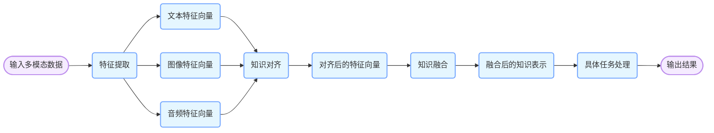

# AI Agent的跨模态知识对齐与融合

> 关键词：AI Agent、跨模态、知识对齐、知识融合、多模态数据

> 摘要：本文围绕AI Agent的跨模态知识对齐与融合展开深入探讨。首先介绍了相关背景，包括目的、预期读者、文档结构和术语等。接着阐述了核心概念及其联系，通过文本示意图和Mermaid流程图展示架构。详细讲解了核心算法原理，并给出Python源代码示例。分析了数学模型和公式，结合具体例子说明。通过项目实战，展示代码实现与解读。探讨了实际应用场景，推荐了学习资源、开发工具框架和相关论文著作。最后总结了未来发展趋势与挑战，提供常见问题解答和扩展阅读参考资料，旨在为读者全面深入地了解AI Agent的跨模态知识对齐与融合提供专业指导。

## 1. 背景介绍 
### 1.1 目的和范围
随着人工智能技术的不断发展，AI Agent需要处理和理解来自多种模态的数据，如文本、图像、音频等。跨模态知识对齐与融合的目的在于让AI Agent能够在不同模态的数据之间建立有效的联系，整合各种模态的信息，从而提升其对复杂信息的理解和处理能力。本文章的范围涵盖了跨模态知识对齐与融合的基本概念、核心算法、数学模型、实际应用案例以及相关的工具和资源等方面。

### 1.2 预期读者
本文预期读者包括人工智能领域的研究人员、开发者、对跨模态技术感兴趣的学生以及相关行业的从业者。无论是想要深入研究跨模态知识对齐与融合技术的专业人士，还是希望了解该领域基础知识的初学者，都能从本文中获得有价值的信息。

### 1.3 文档结构概述
本文首先介绍背景知识，为读者搭建理解的基础。接着阐述核心概念与联系，让读者清晰了解跨模态知识对齐与融合的基本原理和架构。然后详细讲解核心算法原理和具体操作步骤，通过Python代码进行说明。随后分析数学模型和公式，并举例说明。通过项目实战展示代码实现和解读。探讨实际应用场景，为读者提供应用思路。推荐相关的工具和资源，方便读者进一步学习和研究。最后总结未来发展趋势与挑战，解答常见问题，并提供扩展阅读和参考资料。

### 1.4 术语表
#### 1.4.1 核心术语定义
- **AI Agent**：能够感知环境、进行决策并采取行动以实现特定目标的人工智能实体。
- **跨模态**：涉及多种不同数据模态，如文本、图像、音频等。
- **知识对齐**：将不同模态数据中的知识进行匹配和对应，建立起它们之间的关联。
- **知识融合**：将来自不同模态的知识进行整合，形成统一的、更丰富的知识表示。

#### 1.4.2 相关概念解释
- **多模态数据**：包含多种不同类型信息的数据，如一张图片可能同时包含视觉信息和相关的文字描述。
- **特征表示**：将原始数据转换为一种能够被计算机处理和分析的数值表示形式。

#### 1.4.3 缩略词列表
- **CNN**：Convolutional Neural Network，卷积神经网络
- **RNN**：Recurrent Neural Network，循环神经网络
- **Transformer**：一种基于注意力机制的深度学习模型

## 2. 核心概念与联系 

### 核心概念原理
跨模态知识对齐与融合的核心在于解决不同模态数据之间的语义鸿沟。不同模态的数据具有不同的特征和表示方式，例如文本数据是由字符和词汇组成，而图像数据是由像素点构成。知识对齐的目标是找到不同模态数据中具有相同或相似语义的部分，并建立起它们之间的映射关系。知识融合则是在对齐的基础上，将不同模态的知识进行整合，形成一个更全面、更准确的知识表示。

### 架构的文本示意图
以下是一个简单的跨模态知识对齐与融合架构的文本描述：

输入层：接收来自不同模态的数据，如文本、图像、音频等。

特征提取层：对不同模态的数据进行特征提取，将原始数据转换为特征向量。对于文本数据，可以使用词嵌入、Transformer等方法进行特征提取；对于图像数据，可以使用卷积神经网络（CNN）进行特征提取。

知识对齐层：将不同模态的特征向量进行对齐，通过计算相似度等方法找到它们之间的对应关系。

知识融合层：将对齐后的不同模态的特征向量进行融合，生成统一的知识表示。

输出层：根据具体任务的需求，对融合后的知识表示进行处理，如分类、生成等。

### Mermaid 流程图


## 3. 核心算法原理 & 具体操作步骤 

### 核心算法原理
在跨模态知识对齐与融合中，常用的算法包括基于深度学习的方法。其中，注意力机制在跨模态任务中表现出色。注意力机制可以帮助模型聚焦于不同模态数据中的重要部分，从而更好地进行知识对齐和融合。

以文本 - 图像跨模态任务为例，核心算法的主要步骤如下：

1. **特征提取**：使用预训练的模型对文本和图像进行特征提取。对于文本，可以使用BERT等预训练语言模型；对于图像，可以使用ResNet等预训练的卷积神经网络。
2. **注意力计算**：计算文本特征和图像特征之间的注意力分数，以确定它们之间的相关性。
3. **知识对齐**：根据注意力分数，将文本特征和图像特征进行对齐。
4. **知识融合**：将对齐后的文本特征和图像特征进行融合，生成统一的跨模态特征表示。

### 具体操作步骤及Python源代码
以下是一个简单的Python代码示例，演示了如何使用PyTorch实现文本 - 图像跨模态知识对齐与融合：

```python
import torch
import torch.nn as nn
import torchvision.models as models
from transformers import BertModel, BertTokenizer

# 定义图像特征提取器
class ImageFeatureExtractor(nn.Module):
    def __init__(self):
        super(ImageFeatureExtractor, self).__init__()
        self.resnet = models.resnet18(pretrained=True)
        self.resnet.fc = nn.Identity()  # 移除最后一层全连接层

    def forward(self, images):
        features = self.resnet(images)
        return features

# 定义文本特征提取器
class TextFeatureExtractor(nn.Module):
    def __init__(self):
        super(TextFeatureExtractor, self).__init__()
        self.bert = BertModel.from_pretrained('bert-base-uncased')

    def forward(self, input_ids, attention_mask):
        outputs = self.bert(input_ids=input_ids, attention_mask=attention_mask)
        pooled_output = outputs.pooler_output
        return pooled_output

# 定义注意力机制
class Attention(nn.Module):
    def __init__(self, input_dim):
        super(Attention, self).__init__()
        self.fc = nn.Linear(input_dim, 1)

    def forward(self, text_features, image_features):
        # 计算注意力分数
        text_scores = self.fc(text_features)
        image_scores = self.fc(image_features)
        attention_scores = torch.cat([text_scores, image_scores], dim=1)
        attention_weights = torch.softmax(attention_scores, dim=1)
        # 加权求和
        aligned_features = attention_weights[:, 0].unsqueeze(1) * text_features + attention_weights[:, 1].unsqueeze(1) * image_features
        return aligned_features

# 定义跨模态模型
class CrossModalModel(nn.Module):
    def __init__(self):
        super(CrossModalModel, self).__init__()
        self.image_extractor = ImageFeatureExtractor()
        self.text_extractor = TextFeatureExtractor()
        self.attention = Attention(input_dim=512)  # 假设特征维度为512
        self.fc = nn.Linear(512, 1)  # 用于最终分类

    def forward(self, images, input_ids, attention_mask):
        image_features = self.image_extractor(images)
        text_features = self.text_extractor(input_ids, attention_mask)
        aligned_features = self.attention(text_features, image_features)
        output = self.fc(aligned_features)
        return output

# 示例使用
model = CrossModalModel()
tokenizer = BertTokenizer.from_pretrained('bert-base-uncased')
text = "A beautiful flower"
inputs = tokenizer(text, return_tensors='pt')
input_ids = inputs['input_ids']
attention_mask = inputs['attention_mask']
images = torch.randn(1, 3, 224, 224)  # 假设输入图像
output = model(images, input_ids, attention_mask)
print(output)
```

## 4. 数学模型和公式 & 详细讲解 & 举例说明 

### 特征提取阶段
在特征提取阶段，对于图像数据，通常使用卷积神经网络（CNN）进行特征提取。假设输入图像为 $X_{image} \in \mathbb{R}^{H \times W \times C}$，其中 $H$ 是图像的高度，$W$ 是图像的宽度，$C$ 是图像的通道数。经过一系列卷积、池化等操作后，得到图像特征向量 $F_{image} \in \mathbb{R}^{d_{image}}$，其中 $d_{image}$ 是图像特征的维度。

对于文本数据，使用预训练语言模型（如BERT）进行特征提取。假设输入文本为 $X_{text} = [w_1, w_2, \cdots, w_n]$，其中 $w_i$ 是文本中的第 $i$ 个词。经过BERT模型处理后，得到文本特征向量 $F_{text} \in \mathbb{R}^{d_{text}}$，其中 $d_{text}$ 是文本特征的维度。

### 注意力计算阶段
注意力机制的核心是计算注意力分数。假设文本特征向量为 $F_{text}$，图像特征向量为 $F_{image}$，注意力分数可以通过以下公式计算：

$$
S_{text} = W_{text}F_{text} + b_{text}
$$

$$
S_{image} = W_{image}F_{image} + b_{image}
$$

其中 $W_{text} \in \mathbb{R}^{1 \times d_{text}}$，$W_{image} \in \mathbb{R}^{1 \times d_{image}}$ 是权重矩阵，$b_{text}$ 和 $b_{image}$ 是偏置项。

然后，将 $S_{text}$ 和 $S_{image}$ 拼接起来，得到注意力分数向量 $S = [S_{text}, S_{image}]$，并通过softmax函数计算注意力权重：

$$
A = \text{softmax}(S) = \frac{\exp(S)}{\sum_{i} \exp(S_i)}
$$

### 知识对齐阶段
根据注意力权重 $A$，将文本特征和图像特征进行对齐，得到对齐后的特征向量 $F_{aligned}$：

$$
F_{aligned} = A_{text}F_{text} + A_{image}F_{image}
$$

其中 $A_{text}$ 和 $A_{image}$ 分别是注意力权重向量 $A$ 中对应文本和图像的部分。

### 知识融合阶段
知识融合可以采用简单的拼接或加权求和等方式。在上述代码示例中，我们采用了加权求和的方式进行知识融合。

### 举例说明
假设文本特征向量 $F_{text} = [0.2, 0.3, 0.5]$，图像特征向量 $F_{image} = [0.4, 0.6, 0.2]$，经过注意力计算得到注意力权重 $A = [0.3, 0.7]$。则对齐后的特征向量 $F_{aligned}$ 为：

$$
F_{aligned} = 0.3 \times [0.2, 0.3, 0.5] + 0.7 \times [0.4, 0.6, 0.2]
$$

$$
= [0.3 \times 0.2 + 0.7 \times 0.4, 0.3 \times 0.3 + 0.7 \times 0.6, 0.3 \times 0.5 + 0.7 \times 0.2]
$$

$$
= [0.34, 0.51, 0.29]
$$

## 5. 项目实战：代码实际案例和详细解释说明 

### 5.1  开发环境搭建
在进行跨模态知识对齐与融合的项目实战之前，需要搭建相应的开发环境。以下是具体步骤：

1. **安装Python**：建议使用Python 3.7及以上版本。可以从Python官方网站（https://www.python.org/downloads/）下载并安装。
2. **安装深度学习框架**：使用PyTorch作为深度学习框架。可以根据自己的CUDA版本和操作系统，从PyTorch官方网站（https://pytorch.org/get-started/locally/）选择合适的安装命令进行安装。
3. **安装其他依赖库**：安装`torchvision`、`transformers`等库，可以使用以下命令：

```bash
pip install torchvision transformers
```

### 5.2  源代码详细实现和代码解读
以下是一个完整的项目实战代码示例，包括数据加载、模型训练和评估：

```python
import torch
import torch.nn as nn
import torch.optim as optim
from torch.utils.data import Dataset, DataLoader
import torchvision.models as models
from transformers import BertModel, BertTokenizer
import numpy as np

# 定义数据集类
class CrossModalDataset(Dataset):
    def __init__(self, texts, images, labels):
        self.texts = texts
        self.images = images
        self.labels = labels
        self.tokenizer = BertTokenizer.from_pretrained('bert-base-uncased')

    def __len__(self):
        return len(self.labels)

    def __getitem__(self, idx):
        text = self.texts[idx]
        image = self.images[idx]
        label = self.labels[idx]
        inputs = self.tokenizer(text, return_tensors='pt', padding='max_length', truncation=True, max_length=128)
        input_ids = inputs['input_ids'].squeeze()
        attention_mask = inputs['attention_mask'].squeeze()
        return input_ids, attention_mask, image, torch.tensor(label, dtype=torch.float32)

# 定义图像特征提取器
class ImageFeatureExtractor(nn.Module):
    def __init__(self):
        super(ImageFeatureExtractor, self).__init__()
        self.resnet = models.resnet18(pretrained=True)
        self.resnet.fc = nn.Identity()  # 移除最后一层全连接层

    def forward(self, images):
        features = self.resnet(images)
        return features

# 定义文本特征提取器
class TextFeatureExtractor(nn.Module):
    def __init__(self):
        super(TextFeatureExtractor, self).__init__()
        self.bert = BertModel.from_pretrained('bert-base-uncased')

    def forward(self, input_ids, attention_mask):
        outputs = self.bert(input_ids=input_ids, attention_mask=attention_mask)
        pooled_output = outputs.pooler_output
        return pooled_output

# 定义注意力机制
class Attention(nn.Module):
    def __init__(self, input_dim):
        super(Attention, self).__init__()
        self.fc = nn.Linear(input_dim, 1)

    def forward(self, text_features, image_features):
        # 计算注意力分数
        text_scores = self.fc(text_features)
        image_scores = self.fc(image_features)
        attention_scores = torch.cat([text_scores, image_scores], dim=1)
        attention_weights = torch.softmax(attention_scores, dim=1)
        # 加权求和
        aligned_features = attention_weights[:, 0].unsqueeze(1) * text_features + attention_weights[:, 1].unsqueeze(1) * image_features
        return aligned_features

# 定义跨模态模型
class CrossModalModel(nn.Module):
    def __init__(self):
        super(CrossModalModel, self).__init__()
        self.image_extractor = ImageFeatureExtractor()
        self.text_extractor = TextFeatureExtractor()
        self.attention = Attention(input_dim=512)  # 假设特征维度为512
        self.fc = nn.Linear(512, 1)  # 用于最终分类

    def forward(self, input_ids, attention_mask, images):
        image_features = self.image_extractor(images)
        text_features = self.text_extractor(input_ids, attention_mask)
        aligned_features = self.attention(text_features, image_features)
        output = self.fc(aligned_features)
        return output

# 训练模型
def train_model(model, dataloader, criterion, optimizer, device, epochs):
    model.train()
    for epoch in range(epochs):
        running_loss = 0.0
        for input_ids, attention_mask, images, labels in dataloader:
            input_ids = input_ids.to(device)
            attention_mask = attention_mask.to(device)
            images = images.to(device)
            labels = labels.to(device)

            optimizer.zero_grad()
            outputs = model(input_ids, attention_mask, images).squeeze()
            loss = criterion(outputs, labels)
            loss.backward()
            optimizer.step()

            running_loss += loss.item()
        print(f'Epoch {epoch + 1}/{epochs}, Loss: {running_loss / len(dataloader)}')

# 评估模型
def evaluate_model(model, dataloader, device):
    model.eval()
    correct = 0
    total = 0
    with torch.no_grad():
        for input_ids, attention_mask, images, labels in dataloader:
            input_ids = input_ids.to(device)
            attention_mask = attention_mask.to(device)
            images = images.to(device)
            labels = labels.to(device)

            outputs = model(input_ids, attention_mask, images).squeeze()
            predictions = (outputs > 0).float()
            total += labels.size(0)
            correct += (predictions == labels).sum().item()
    accuracy = correct / total
    print(f'Accuracy: {accuracy}')

# 主函数
def main():
    # 示例数据
    texts = ["A beautiful flower", "A cute dog"]
    images = [torch.randn(3, 224, 224) for _ in range(2)]
    labels = [1, 0]

    # 创建数据集和数据加载器
    dataset = CrossModalDataset(texts, images, labels)
    dataloader = DataLoader(dataset, batch_size=2, shuffle=True)

    # 初始化模型、损失函数和优化器
    device = torch.device("cuda" if torch.cuda.is_available() else "cpu")
    model = CrossModalModel().to(device)
    criterion = nn.BCEWithLogitsLoss()
    optimizer = optim.Adam(model.parameters(), lr=1e-4)

    # 训练模型
    train_model(model, dataloader, criterion, optimizer, device, epochs=5)

    # 评估模型
    evaluate_model(model, dataloader, device)

if __name__ == "__main__":
    main()
```

### 5.3  代码解读与分析
- **数据集类 `CrossModalDataset`**：用于加载和处理跨模态数据。在 `__getitem__` 方法中，将文本数据进行分词处理，并返回输入ID、注意力掩码、图像和标签。
- **图像特征提取器 `ImageFeatureExtractor`**：使用预训练的ResNet18模型提取图像特征，移除最后一层全连接层以获取中间特征。
- **文本特征提取器 `TextFeatureExtractor`**：使用预训练的BERT模型提取文本特征，获取池化后的输出。
- **注意力机制 `Attention`**：计算文本特征和图像特征之间的注意力分数，并根据注意力权重进行加权求和，得到对齐后的特征向量。
- **跨模态模型 `CrossModalModel`**：整合图像特征提取器、文本特征提取器和注意力机制，最终通过全连接层进行分类。
- **训练函数 `train_model`**：在每个epoch中，遍历数据加载器，计算损失并进行反向传播和参数更新。
- **评估函数 `evaluate_model`**：在评估阶段，计算模型的准确率。

## 6. 实际应用场景 
### 智能客服
在智能客服系统中，用户可能会同时使用文本和图片来描述问题。通过跨模态知识对齐与融合技术，AI Agent可以更好地理解用户的意图。例如，用户在咨询某款产品时，可能会发送产品的图片和相关的文字描述，AI Agent可以将图片中的信息和文本信息进行融合，提供更准确的解答。

### 多媒体搜索
在多媒体搜索场景中，用户可以使用文本或图像进行搜索。跨模态知识对齐与融合技术可以将文本和图像的特征进行对齐和融合，使得搜索结果更加准确和全面。例如，用户输入一段文本描述，系统可以返回与该描述相关的图像；或者用户上传一张图片，系统可以返回相关的文本信息和其他相似的图片。

### 自动驾驶
在自动驾驶领域，车辆需要同时处理来自摄像头、雷达等多种传感器的数据。跨模态知识对齐与融合技术可以将不同传感器的数据进行融合，提高车辆对周围环境的感知能力。例如，将摄像头拍摄的图像信息和雷达检测到的距离信息进行融合，更准确地判断前方障碍物的位置和类型。

### 医疗诊断
在医疗诊断中，医生通常会结合患者的病历文本和医学影像（如X光、CT等）进行诊断。跨模态知识对齐与融合技术可以帮助AI Agent更好地理解病历文本和医学影像中的信息，辅助医生进行更准确的诊断。例如，将病历中的症状描述和医学影像中的病变特征进行融合，提高疾病诊断的准确率。

## 7. 工具和资源推荐
### 7.1 学习资源推荐
#### 7.1.1 书籍推荐
- 《深度学习》（Deep Learning）：由Ian Goodfellow、Yoshua Bengio和Aaron Courville所著，是深度学习领域的经典教材，涵盖了神经网络、卷积神经网络、循环神经网络等基础内容，对于理解跨模态知识对齐与融合的技术基础非常有帮助。
- 《自然语言处理入门》：帮助读者了解自然语言处理的基本概念和方法，对于处理文本模态的数据至关重要。
- 《计算机视觉：算法与应用》：介绍了计算机视觉的各种算法和应用，对于处理图像和视频模态的数据有很大的指导作用。

#### 7.1.2 在线课程
- Coursera上的“深度学习专项课程”（Deep Learning Specialization）：由Andrew Ng教授授课，全面介绍了深度学习的各个方面，包括卷积神经网络、循环神经网络等，是学习深度学习的优质课程。
- edX上的“自然语言处理基础”（Foundations of Natural Language Processing）：深入讲解了自然语言处理的基本原理和技术，对于跨模态任务中的文本处理有很大的帮助。
- Udemy上的“计算机视觉实战课程”（Computer Vision A-Z™: Hands-On Computer Vision with OpenCV & Deep Learning）：通过实际项目让学员掌握计算机视觉的应用，对于处理图像和视频数据非常实用。

#### 7.1.3 技术博客和网站
- arXiv：是一个收集物理学、数学、计算机科学等领域预印本论文的网站，上面有很多关于跨模态知识对齐与融合的最新研究成果。
- Medium：有很多技术博主会分享关于人工智能、深度学习等领域的最新技术和实践经验。
- AI研习社：专注于人工智能领域的技术分享和交流，提供了很多关于跨模态技术的文章和案例。

### 7.2 开发工具框架推荐
#### 7.2.1 IDE和编辑器
- PyCharm：是一款专门为Python开发设计的集成开发环境，具有强大的代码编辑、调试和项目管理功能，非常适合进行深度学习项目的开发。
- Jupyter Notebook：可以将代码、文本、图像等内容整合在一个文档中，方便进行代码的编写、调试和结果展示，常用于深度学习的实验和研究。
- Visual Studio Code：是一款轻量级的代码编辑器，支持多种编程语言和插件扩展，对于Python开发也有很好的支持。

#### 7.2.2 调试和性能分析工具
- TensorBoard：是TensorFlow的可视化工具，也可以用于PyTorch项目。它可以帮助开发者可视化模型的训练过程、损失曲线、梯度分布等信息，方便进行调试和性能分析。
- PyTorch Profiler：是PyTorch自带的性能分析工具，可以帮助开发者找出代码中的性能瓶颈，优化代码性能。
- NVIDIA Nsight Systems：是一款针对NVIDIA GPU的性能分析工具，可以深入分析GPU的使用情况，帮助开发者优化GPU代码。

#### 7.2.3 相关框架和库
- PyTorch：是一个开源的深度学习框架，具有动态图和易于使用的特点，广泛应用于跨模态任务的开发。
- TensorFlow：是另一个流行的深度学习框架，具有强大的分布式训练和部署能力，也有很多用于跨模态任务的工具和模型。
- Transformers：是Hugging Face开发的一个自然语言处理库，提供了多种预训练的语言模型，如BERT、GPT等，方便进行文本特征提取。
- Torchvision：是PyTorch的计算机视觉库，提供了多种预训练的图像模型，如ResNet、VGG等，方便进行图像特征提取。

### 7.3 相关论文著作推荐
#### 7.3.1 经典论文
- "Attention Is All You Need"：提出了Transformer模型，引入了注意力机制，为跨模态任务中的知识对齐和融合提供了重要的技术基础。
- "BERT: Pre-training of Deep Bidirectional Transformers for Language Understanding"：介绍了BERT模型，是自然语言处理领域的重要突破，在跨模态任务中的文本处理方面有广泛的应用。
- "Show, Attend and Tell: Neural Image Caption Generation with Visual Attention"：将注意力机制应用于图像描述生成任务，展示了跨模态任务中注意力机制的有效性。

#### 7.3.2 最新研究成果
可以通过arXiv等网站搜索最新的关于跨模态知识对齐与融合的研究论文，了解该领域的最新技术和方法。

#### 7.3.3 应用案例分析
- 一些知名的学术会议，如CVPR（计算机视觉与模式识别会议）、ICML（国际机器学习会议）、ACL（计算语言学协会年会）等，会有很多关于跨模态技术应用案例的论文和报告，可以从中学习到实际应用中的经验和方法。

## 8. 总结：未来发展趋势与挑战
### 未来发展趋势
- **多模态预训练模型的发展**：随着技术的不断进步，将会有更多强大的多模态预训练模型出现。这些模型可以在大规模的多模态数据上进行预训练，学习到更通用的跨模态特征表示，从而在各种跨模态任务中取得更好的性能。
- **跨模态知识图谱的构建**：跨模态知识图谱可以将不同模态的数据和知识进行整合，形成一个更加全面和准确的知识体系。未来，跨模态知识图谱的构建和应用将会得到更多的关注和发展。
- **与其他技术的融合**：跨模态知识对齐与融合技术将与其他技术，如区块链、物联网等进行融合，创造出更多新的应用场景和商业模式。

### 挑战
- **数据的标注和获取**：跨模态数据的标注和获取是一个具有挑战性的问题。不同模态的数据需要进行准确的标注，才能用于模型的训练和评估。但是，标注跨模态数据需要耗费大量的人力和时间。
- **语义鸿沟的解决**：虽然已经有很多方法用于解决不同模态数据之间的语义鸿沟，但是仍然存在一定的挑战。如何更准确地理解不同模态数据的语义，并建立起它们之间的有效联系，是未来需要进一步研究的问题。
- **计算资源的需求**：跨模态知识对齐与融合通常需要处理大量的数据和复杂的模型，对计算资源的需求较高。如何在有限的计算资源下提高模型的性能和效率，是一个亟待解决的问题。

## 9. 附录：常见问题与解答
### 问题1：跨模态知识对齐与融合的应用场景有哪些限制？
解答：跨模态知识对齐与融合的应用场景受到数据质量、计算资源和模型性能等因素的限制。例如，在一些对实时性要求较高的场景中，复杂的跨模态模型可能无法满足实时处理的需求；在数据质量较差的情况下，模型的性能可能会受到影响。

### 问题2：如何选择合适的特征提取方法？
解答：选择合适的特征提取方法需要考虑数据的模态、任务的需求和模型的复杂度等因素。对于文本数据，可以使用预训练的语言模型进行特征提取；对于图像数据，可以使用卷积神经网络进行特征提取。同时，也可以根据具体任务的需求，对特征提取方法进行调整和优化。

### 问题3：跨模态模型的训练需要注意哪些问题？
解答：跨模态模型的训练需要注意以下几个问题：一是数据的预处理，包括数据的清洗、归一化等；二是模型的选择和调优，选择合适的模型结构和超参数；三是训练过程中的优化策略，如学习率的调整、正则化等。

## 10. 扩展阅读 & 参考资料
### 扩展阅读
- 《人工智能：现代方法》：全面介绍了人工智能的各个方面，包括搜索算法、机器学习、自然语言处理等，对于深入理解人工智能的基本原理和方法有很大的帮助。
- 《神经网络与深度学习》：详细介绍了神经网络和深度学习的理论和应用，对于理解跨模态知识对齐与融合的技术基础非常有价值。

### 参考资料
- Goodfellow, I., Bengio, Y., & Courville, A. (2016). Deep Learning. MIT Press.
- Devlin, J., Chang, M. W., Lee, K., & Toutanova, K. (2018). BERT: Pre-training of Deep Bidirectional Transformers for Language Understanding. arXiv preprint arXiv:1810.04805.
- Vaswani, A., Shazeer, N., Parmar, N., Uszkoreit, J., Jones, L., Gomez, A. N.,... & Polosukhin, I. (2017). Attention Is All You Need. In Advances in neural information processing systems (pp. 5998-6008).

作者：AI天才研究院/AI Genius Institute & 禅与计算机程序设计艺术 /Zen And The Art of Computer Programming