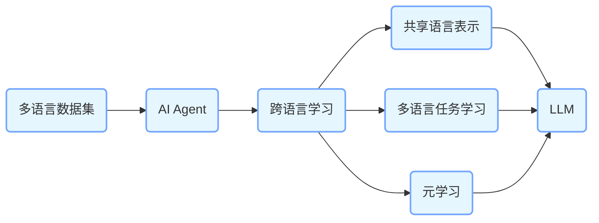

# AI Agent的跨语言学习：增强LLM的多语言能力

> 关键词：AI Agent、跨语言学习、大语言模型（LLM）、多语言能力、自然语言处理

> 摘要：本文聚焦于AI Agent的跨语言学习在增强大语言模型（LLM）多语言能力方面的应用。详细介绍了相关的背景知识，包括目的范围、预期读者等。深入探讨了核心概念与联系，阐述了核心算法原理并给出Python代码示例，讲解了数学模型和公式。通过项目实战展示了具体的代码实现和解读，分析了实际应用场景。同时推荐了相关的学习资源、开发工具框架以及论文著作。最后总结了未来发展趋势与挑战，并提供了常见问题解答和扩展阅读参考资料，旨在为读者全面深入地介绍AI Agent跨语言学习增强LLM多语言能力的相关技术。

## 1. 背景介绍 
### 1.1 目的和范围
随着全球化的发展，人们对于语言交流的需求日益增长。大语言模型（LLM）在自然语言处理领域取得了显著的成果，但在多语言处理方面仍存在一定的局限性。本研究的目的是探讨如何利用AI Agent的跨语言学习能力来增强LLM的多语言处理能力。范围涵盖了从核心概念的理解到实际项目的应用，包括相关算法原理、数学模型、代码实现以及实际应用场景的分析。

### 1.2 预期读者
本文预期读者包括自然语言处理领域的研究人员、开发者、对AI技术感兴趣的学生以及希望了解AI Agent跨语言学习如何增强LLM多语言能力的技术爱好者。

### 1.3 文档结构概述
本文首先介绍背景知识，包括目的、预期读者和文档结构。接着阐述核心概念与联系，包括相关的原理和架构。然后详细讲解核心算法原理和具体操作步骤，并给出Python代码示例。之后介绍数学模型和公式，并进行详细讲解和举例说明。通过项目实战展示代码的实际应用和详细解释。分析实际应用场景，推荐相关的学习资源、开发工具框架和论文著作。最后总结未来发展趋势与挑战，提供常见问题解答和扩展阅读参考资料。

### 1.4 术语表
#### 1.4.1 核心术语定义
- **AI Agent**：一种能够感知环境、进行决策并采取行动以实现特定目标的智能实体。在自然语言处理中，AI Agent可以理解和生成自然语言。
- **跨语言学习**：指模型在不同语言之间进行知识迁移和学习，以提高在多种语言上的性能。
- **大语言模型（LLM）**：一种基于深度学习的自然语言处理模型，通常具有大量的参数和强大的语言理解与生成能力。
- **多语言能力**：模型能够处理和理解多种不同语言的能力。

#### 1.4.2 相关概念解释
- **语言表示**：将自然语言转换为计算机能够处理的数值表示的过程。常见的语言表示方法包括词向量、句向量等。
- **知识迁移**：将在一种语言或任务上学习到的知识应用到其他语言或任务中的过程。
- **注意力机制**：一种在深度学习中广泛应用的机制，用于在处理序列数据时动态地关注不同位置的信息。

#### 1.4.3 缩略词列表
- **LLM**：Large Language Model（大语言模型）
- **NLP**：Natural Language Processing（自然语言处理）
- **BERT**：Bidirectional Encoder Representations from Transformers（双向编码器表示来自Transformer）
- **GPT**：Generative Pretrained Transformer（生成式预训练Transformer）

## 2. 核心概念与联系 
### 核心概念原理
AI Agent的跨语言学习增强LLM多语言能力的核心原理在于利用AI Agent的灵活性和适应性，在不同语言之间进行知识的迁移和整合。具体来说，AI Agent可以通过以下方式实现跨语言学习：
- **共享语言表示**：通过设计合适的语言表示方法，使得不同语言的文本可以在同一向量空间中进行表示。这样，模型可以在不同语言之间进行知识的共享和迁移。
- **多语言任务学习**：让AI Agent同时学习多个不同语言的任务，例如机器翻译、文本分类等。通过这种方式，模型可以学习到不同语言之间的共性和差异，从而提高多语言处理能力。
- **元学习**：利用元学习算法，让AI Agent在不同语言的数据集上进行快速适应和学习。元学习可以帮助模型在新的语言任务上更快地收敛和取得更好的性能。

### 架构的文本示意图
```plaintext
+-------------------+
|      LLM          |
+-------------------+
       |
       |  跨语言学习
       |
+-------------------+
|    AI Agent       |
+-------------------+
       |
       |  知识迁移
       |
+-------------------+
|  多语言数据集   |
+-------------------+
```
### Mermaid 流程图


## 3. 核心算法原理 & 具体操作步骤 
### 核心算法原理
一种常见的实现AI Agent跨语言学习的算法是基于Transformer架构的多语言模型。Transformer架构具有强大的并行计算能力和长序列处理能力，非常适合处理自然语言。

具体来说，我们可以使用一个共享的Transformer编码器来对不同语言的文本进行编码，得到统一的语言表示。然后，在解码器部分，可以根据不同的任务和语言进行定制化的设计。

### Python源代码详细阐述
以下是一个简单的示例代码，展示了如何使用Hugging Face的Transformers库来实现一个多语言的文本分类任务：

```python
from transformers import AutoTokenizer, AutoModelForSequenceClassification
import torch

# 加载预训练的多语言模型和分词器
model_name = "bert-base-multilingual-cased"
tokenizer = AutoTokenizer.from_pretrained(model_name)
model = AutoModelForSequenceClassification.from_pretrained(model_name, num_labels=2)

# 定义输入文本
text_en = "This is a positive sentence."
text_zh = "这是一个积极的句子。"

# 对文本进行分词和编码
inputs_en = tokenizer(text_en, return_tensors="pt")
inputs_zh = tokenizer(text_zh, return_tensors="pt")

# 进行模型推理
with torch.no_grad():
    outputs_en = model(**inputs_en)
    outputs_zh = model(**inputs_zh)

# 获取分类结果
logits_en = outputs_en.logits
predicted_class_id_en = logits_en.argmax().item()

logits_zh = outputs_zh.logits
predicted_class_id_zh = logits_zh.argmax().item()

print(f"English prediction: {predicted_class_id_en}")
print(f"Chinese prediction: {predicted_class_id_zh}")
```

### 具体操作步骤
1. **安装必要的库**：使用`pip install transformers`安装Hugging Face的Transformers库。
2. **加载预训练模型和分词器**：选择一个合适的多语言预训练模型，如`bert-base-multilingual-cased`，并使用`AutoTokenizer`和`AutoModelForSequenceClassification`加载模型和分词器。
3. **准备输入文本**：定义不同语言的输入文本。
4. **对文本进行分词和编码**：使用分词器对输入文本进行分词和编码，得到模型可以接受的输入格式。
5. **进行模型推理**：将编码后的输入文本输入到模型中，进行推理。
6. **获取分类结果**：从模型的输出中获取分类结果。

## 4. 数学模型和公式 & 详细讲解 & 举例说明 
### 语言表示模型
在跨语言学习中，我们通常使用词向量来表示语言。一种常见的词向量模型是Word2Vec，它基于神经网络的方法来学习词的分布式表示。

Word2Vec有两种主要的模型架构：Skip-gram和CBOW（Continuous Bag-of-Words）。

#### Skip-gram模型
Skip-gram模型的目标是根据中心词预测其上下文词。数学公式如下：

给定一个中心词 $w_t$ 和它的上下文词 $w_{t-c}, \cdots, w_{t-1}, w_{t+1}, \cdots, w_{t+c}$（其中 $c$ 是上下文窗口的大小），Skip-gram模型的目标是最大化以下概率：

$$
\prod_{j=1, j \neq t}^{t + c} P(w_j | w_t)
$$

其中，$P(w_j | w_t)$ 可以通过softmax函数计算：

$$
P(w_j | w_t) = \frac{\exp(\mathbf{v}_{w_j}^T \mathbf{u}_{w_t})}{\sum_{w=1}^{V} \exp(\mathbf{v}_{w}^T \mathbf{u}_{w_t})}
$$

这里，$\mathbf{v}_{w}$ 是词 $w$ 的输出向量，$\mathbf{u}_{w}$ 是词 $w$ 的输入向量，$V$ 是词汇表的大小。

#### CBOW模型
CBOW模型的目标是根据上下文词预测中心词。数学公式如下：

给定上下文词 $w_{t-c}, \cdots, w_{t-1}, w_{t+1}, \cdots, w_{t+c}$，CBOW模型的目标是最大化以下概率：

$$
P(w_t | w_{t-c}, \cdots, w_{t-1}, w_{t+1}, \cdots, w_{t+c})
$$

可以通过以下方式计算：

$$
P(w_t | w_{t-c}, \cdots, w_{t-1}, w_{t+1}, \cdots, w_{t+c}) = \frac{\exp(\mathbf{v}_{w_t}^T \overline{\mathbf{u}})}{\sum_{w=1}^{V} \exp(\mathbf{v}_{w}^T \overline{\mathbf{u}})}
$$

其中，$\overline{\mathbf{u}}$ 是上下文词输入向量的平均值：

$$
\overline{\mathbf{u}} = \frac{1}{2c} \sum_{j=1, j \neq t}^{t + c} \mathbf{u}_{w_j}
$$

### 举例说明
假设我们有一个简单的句子 "The cat sat on the mat"，词汇表为 $\{the, cat, sat, on, mat\}$。

使用Skip-gram模型，以 "cat" 为中心词，上下文窗口大小 $c = 1$，则上下文词为 "The" 和 "sat"。模型的目标是最大化 $P(\text{The} | \text{cat})$ 和 $P(\text{sat} | \text{cat})$ 的乘积。

使用CBOW模型，以 "cat" 为中心词，上下文窗口大小 $c = 1$，则上下文词为 "The" 和 "sat"。模型的目标是最大化 $P(\text{cat} | \text{The}, \text{sat})$。

### Transformer模型中的注意力机制
Transformer模型中的注意力机制是其核心组件之一。注意力机制可以帮助模型在处理序列数据时动态地关注不同位置的信息。

多头注意力机制的数学公式如下：

$$
\text{MultiHead}(Q, K, V) = \text{Concat}(\text{head}_1, \cdots, \text{head}_h) W^O
$$

其中，

$$
\text{head}_i = \text{Attention}(QW_i^Q, KW_i^K, VW_i^V)
$$

$$
\text{Attention}(Q, K, V) = \text{softmax}(\frac{QK^T}{\sqrt{d_k}})V
$$

这里，$Q$ 是查询矩阵，$K$ 是键矩阵，$V$ 是值矩阵，$W_i^Q$、$W_i^K$、$W_i^V$ 和 $W^O$ 是可学习的参数矩阵，$d_k$ 是键向量的维度。

举例说明，假设我们有一个输入序列 $x = [x_1, x_2, x_3]$，我们可以通过线性变换得到查询矩阵 $Q$、键矩阵 $K$ 和值矩阵 $V$。然后，通过注意力机制计算每个位置的输出，即根据当前位置的查询向量与所有位置的键向量的相似度来加权求和得到值向量。

## 5. 项目实战：代码实际案例和详细解释说明 
### 5.1  开发环境搭建
#### 安装Python
首先，确保你已经安装了Python 3.6或更高版本。你可以从Python官方网站（https://www.python.org/downloads/）下载并安装Python。

#### 创建虚拟环境
为了避免不同项目之间的依赖冲突，建议使用虚拟环境。可以使用`venv`模块来创建虚拟环境：

```bash
python -m venv myenv
```

激活虚拟环境：

- 在Windows上：
```bash
myenv\Scripts\activate
```
- 在Linux或Mac上：
```bash
source myenv/bin/activate
```

#### 安装必要的库
在虚拟环境中安装所需的库，包括`transformers`、`torch`等：

```bash
pip install transformers torch
```

### 5.2  源代码详细实现和代码解读
以下是一个更完整的多语言文本分类项目的代码示例：

```python
import torch
from torch.utils.data import Dataset, DataLoader
from transformers import AutoTokenizer, AutoModelForSequenceClassification, AdamW
from sklearn.model_selection import train_test_split

# 定义数据集类
class MultiLanguageDataset(Dataset):
    def __init__(self, texts, labels, tokenizer, max_length):
        self.texts = texts
        self.labels = labels
        self.tokenizer = tokenizer
        self.max_length = max_length

    def __len__(self):
        return len(self.texts)

    def __getitem__(self, idx):
        text = self.texts[idx]
        label = self.labels[idx]
        encoding = self.tokenizer.encode_plus(
            text,
            add_special_tokens=True,
            max_length=self.max_length,
            padding='max_length',
            truncation=True,
            return_tensors='pt'
        )
        return {
            'input_ids': encoding['input_ids'].flatten(),
            'attention_mask': encoding['attention_mask'].flatten(),
            'labels': torch.tensor(label, dtype=torch.long)
        }

# 定义训练函数
def train_model(model, train_dataloader, optimizer, device, epochs):
    model.train()
    for epoch in range(epochs):
        total_loss = 0
        for batch in train_dataloader:
            input_ids = batch['input_ids'].to(device)
            attention_mask = batch['attention_mask'].to(device)
            labels = batch['labels'].to(device)

            optimizer.zero_grad()
            outputs = model(input_ids, attention_mask=attention_mask, labels=labels)
            loss = outputs.loss
            total_loss += loss.item()

            loss.backward()
            optimizer.step()

        print(f'Epoch {epoch + 1}/{epochs}, Loss: {total_loss / len(train_dataloader)}')

# 定义评估函数
def evaluate_model(model, test_dataloader, device):
    model.eval()
    correct_predictions = 0
    total_predictions = 0
    with torch.no_grad():
        for batch in test_dataloader:
            input_ids = batch['input_ids'].to(device)
            attention_mask = batch['attention_mask'].to(device)
            labels = batch['labels'].to(device)

            outputs = model(input_ids, attention_mask=attention_mask)
            logits = outputs.logits
            predictions = torch.argmax(logits, dim=1)

            correct_predictions += (predictions == labels).sum().item()
            total_predictions += labels.size(0)

    accuracy = correct_predictions / total_predictions
    print(f'Accuracy: {accuracy}')

# 示例数据
texts = [
    "This is a positive sentence.",
    "This is a negative sentence.",
    "这是一个积极的句子。",
    "这是一个消极的句子。"
]
labels = [1, 0, 1, 0]

# 划分训练集和测试集
train_texts, test_texts, train_labels, test_labels = train_test_split(texts, labels, test_size=0.2, random_state=42)

# 加载预训练模型和分词器
model_name = "bert-base-multilingual-cased"
tokenizer = AutoTokenizer.from_pretrained(model_name)
model = AutoModelForSequenceClassification.from_pretrained(model_name, num_labels=2)

# 创建数据集和数据加载器
max_length = 128
train_dataset = MultiLanguageDataset(train_texts, train_labels, tokenizer, max_length)
test_dataset = MultiLanguageDataset(test_texts, test_labels, tokenizer, max_length)

train_dataloader = DataLoader(train_dataset, batch_size=2, shuffle=True)
test_dataloader = DataLoader(test_dataset, batch_size=2, shuffle=False)

# 设备设置
device = torch.device('cuda' if torch.cuda.is_available() else 'cpu')
model.to(device)

# 定义优化器
optimizer = AdamW(model.parameters(), lr=2e-5)

# 训练模型
epochs = 3
train_model(model, train_dataloader, optimizer, device, epochs)

# 评估模型
evaluate_model(model, test_dataloader, device)
```

### 代码解读与分析
#### 数据集类 `MultiLanguageDataset`
这个类继承自`torch.utils.data.Dataset`，用于处理多语言文本数据。在`__init__`方法中，我们初始化了文本数据、标签、分词器和最大长度。在`__getitem__`方法中，我们对每个文本进行分词和编码，并返回输入ID、注意力掩码和标签。

#### 训练函数 `train_model`
该函数用于训练模型。在每个epoch中，我们遍历训练数据加载器，对每个批次的数据进行前向传播、计算损失、反向传播和参数更新。

#### 评估函数 `evaluate_model`
该函数用于评估模型的性能。在评估过程中，我们禁用梯度计算，遍历测试数据加载器，对每个批次的数据进行前向传播，计算预测结果，并统计正确预测的数量，最后计算准确率。

#### 主程序
在主程序中，我们首先定义了示例数据，然后将其划分为训练集和测试集。接着，我们加载预训练模型和分词器，创建数据集和数据加载器。我们还设置了设备（GPU或CPU），定义了优化器，并调用训练函数和评估函数进行模型的训练和评估。

## 6. 实际应用场景 
### 机器翻译
AI Agent的跨语言学习可以显著提高机器翻译的质量。通过在多种语言的语料上进行训练，模型可以学习到不同语言之间的语义和语法关系，从而生成更准确、更自然的翻译结果。例如，在翻译一篇包含多种语言的文档时，模型可以更好地理解上下文，避免出现翻译错误。

### 多语言信息检索
在信息检索领域，用户可能使用不同的语言进行查询。AI Agent的跨语言学习可以让搜索引擎更好地理解不同语言的查询意图，从多语言的文档中检索出相关的信息。例如，一个国际新闻网站可以使用跨语言学习的模型来实现多语言的搜索功能，方便不同语言背景的用户查找新闻。

### 跨语言文本分类
在一些需要对多语言文本进行分类的场景中，如情感分析、主题分类等，AI Agent的跨语言学习可以提高分类的准确性。模型可以在不同语言的文本数据上进行训练，学习到不同语言表达相同情感或主题的方式，从而在处理新的多语言文本时能够做出更准确的分类。

### 国际客服系统
在国际客服系统中，客服人员需要处理来自不同语言背景的客户咨询。使用增强了多语言能力的LLM，可以实现自动的多语言客服回复。AI Agent可以理解不同语言的客户问题，并提供准确的回答，提高客服效率和客户满意度。

## 7. 工具和资源推荐
### 7.1 学习资源推荐
#### 7.1.1 书籍推荐
- 《自然语言处理入门》：这本书适合初学者，介绍了自然语言处理的基本概念、算法和技术。
- 《深度学习》：详细介绍了深度学习的理论和实践，包括神经网络、卷积神经网络、循环神经网络等，对于理解大语言模型的原理非常有帮助。
- 《Python自然语言处理》：以Python为工具，介绍了自然语言处理的各种任务和实现方法。

#### 7.1.2 在线课程
- Coursera上的“Natural Language Processing Specialization”：由顶尖大学的教授授课，涵盖了自然语言处理的多个方面，包括词法分析、句法分析、语义分析等。
- edX上的“Deep Learning for Natural Language Processing”：深入介绍了深度学习在自然语言处理中的应用，包括Transformer架构、预训练模型等。
- 吴恩达的“Machine Learning”课程：虽然不是专门针对自然语言处理，但对于理解机器学习的基本概念和算法非常有帮助，是学习自然语言处理的基础。

#### 7.1.3 技术博客和网站
- Hugging Face Blog：提供了关于自然语言处理模型、技术和应用的最新资讯和教程。
- Towards Data Science：有很多关于自然语言处理、机器学习和深度学习的高质量文章。
- arXiv.org：可以查找最新的自然语言处理研究论文。

### 7.2 开发工具框架推荐
#### 7.2.1 IDE和编辑器
- PyCharm：功能强大的Python集成开发环境，提供了代码编辑、调试、版本控制等功能，非常适合Python开发。
- Jupyter Notebook：交互式的开发环境，适合进行数据探索、模型训练和结果展示。
- Visual Studio Code：轻量级的代码编辑器，支持多种编程语言和插件，可用于自然语言处理项目的开发。

#### 7.2.2 调试和性能分析工具
- TensorBoard：用于可视化深度学习模型的训练过程和性能指标，帮助开发者监控模型的训练情况。
- PyTorch Profiler：可以分析PyTorch模型的性能瓶颈，帮助开发者优化代码。
- cProfile：Python自带的性能分析工具，可以分析Python代码的运行时间和函数调用情况。

#### 7.2.3 相关框架和库
- Transformers：Hugging Face开发的库，提供了丰富的预训练模型和工具，方便进行自然语言处理任务的开发。
- PyTorch：深度学习框架，具有强大的计算能力和灵活的编程接口，广泛应用于自然语言处理领域。
- TensorFlow：另一个流行的深度学习框架，提供了丰富的工具和资源，适合大规模的自然语言处理项目。

### 7.3 相关论文著作推荐
#### 7.3.1 经典论文
- “Attention Is All You Need”：介绍了Transformer架构，是自然语言处理领域的经典论文，为后续的大语言模型发展奠定了基础。
- “BERT: Pre-training of Deep Bidirectional Transformers for Language Understanding”：提出了BERT模型，开创了预训练语言模型的先河。
- “Generative Pretrained Transformer 3 (GPT-3): Language Models are Few-Shot Learners”：介绍了GPT-3模型，展示了大语言模型在少样本学习方面的强大能力。

#### 7.3.2 最新研究成果
- 可以关注ACL（Association for Computational Linguistics）、EMNLP（Conference on Empirical Methods in Natural Language Processing）等自然语言处理领域的顶级会议，了解最新的研究成果。
- 在arXiv.org上搜索相关的研究论文，如“Cross-lingual learning for large language models”等关键词。

#### 7.3.3 应用案例分析
- 一些知名科技公司的博客和研究报告中会分享自然语言处理技术的应用案例，如Google AI Blog、Microsoft Research等。
- 可以在GitHub上搜索相关的开源项目，了解实际的代码实现和应用场景。

## 8. 总结：未来发展趋势与挑战
### 未来发展趋势
- **更强大的多语言能力**：未来的AI Agent将能够处理更多的语言，包括一些小语种和方言，并且在多语言处理的准确性和自然度上会有进一步的提升。
- **跨模态的跨语言学习**：结合图像、音频等多种模态的信息，实现更全面的跨语言学习。例如，在处理多语言的视频内容时，能够同时理解视频中的语音和文字信息。
- **个性化的多语言服务**：根据用户的语言习惯、兴趣爱好等提供个性化的多语言服务。例如，为不同用户提供不同风格和语言表达的翻译结果。
- **与其他技术的融合**：AI Agent的跨语言学习将与区块链、物联网等技术相结合，创造出更多的应用场景。例如，在跨境物联网设备中实现多语言的交互和管理。

### 挑战
- **数据稀缺问题**：对于一些小语种和特定领域的语言数据，可能存在数据稀缺的问题，这会影响模型的训练效果。需要探索有效的数据增强和迁移学习方法来解决这个问题。
- **语言文化差异**：不同语言背后有着不同的文化背景和语义理解，如何处理这些语言文化差异是一个挑战。需要引入更多的文化知识和语义信息到模型中。
- **计算资源需求**：训练和部署大规模的多语言模型需要大量的计算资源，这对于一些小型企业和研究机构来说是一个挑战。需要研究更高效的模型架构和训练算法来降低计算成本。
- **伦理和安全问题**：随着多语言模型的广泛应用，可能会出现一些伦理和安全问题，如语言歧视、信息泄露等。需要建立相应的伦理准则和安全机制来保障用户的权益。

## 9. 附录：常见问题与解答
### 问题1：AI Agent的跨语言学习和传统的机器翻译有什么区别？
解答：传统的机器翻译主要关注将一种语言翻译成另一种语言的准确性，而AI Agent的跨语言学习更注重在不同语言之间进行知识的迁移和整合。它不仅可以实现翻译功能，还可以在多语言的任务学习、知识共享等方面发挥作用，从而提高模型在多种语言上的综合处理能力。

### 问题2：如何选择合适的多语言预训练模型？
解答：选择合适的多语言预训练模型需要考虑以下因素：
- **语言覆盖范围**：确保模型支持你需要处理的语言。
- **任务类型**：不同的模型在不同的任务上表现可能不同，例如文本分类、机器翻译等。可以根据具体的任务选择合适的模型。
- **模型大小和计算资源**：较大的模型通常性能更好，但需要更多的计算资源。需要根据自己的计算能力选择合适大小的模型。

### 问题3：在跨语言学习中，如何处理不同语言的语法和语义差异？
解答：可以采用以下方法处理不同语言的语法和语义差异：
- **共享语言表示**：通过设计合适的语言表示方法，将不同语言的文本映射到同一向量空间中，从而减少语法和语义差异的影响。
- **多语言任务学习**：让模型同时学习多个不同语言的任务，通过任务之间的相互促进来学习不同语言的共性和差异。
- **引入语言知识**：在模型中引入一些语言知识，如语法规则、语义知识库等，帮助模型更好地理解不同语言的特点。

### 问题4：AI Agent的跨语言学习需要多少数据？
解答：所需的数据量取决于多个因素，如模型的复杂度、任务的难度、语言的种类等。一般来说，越多的数据可以帮助模型学习到更丰富的语言知识和模式，从而提高性能。但在实际应用中，也可以通过数据增强、迁移学习等方法来减少对大量数据的依赖。

## 10. 扩展阅读 & 参考资料
- Devlin, J., Chang, M. W., Lee, K., & Toutanova, K. (2018). BERT: Pre-training of Deep Bidirectional Transformers for Language Understanding. arXiv preprint arXiv:1810.04805.
- Vaswani, A., Shazeer, N., Parmar, N., Uszkoreit, J., Jones, L., Gomez, A. N.,... & Polosukhin, I. (2017). Attention is all you need. In Advances in neural information processing systems (pp. 5998-6008).
- Brown, T. B., Mann, B., Ryder, N., Subbiah, M., Kaplan, J., Dhariwal, P.,... & Amodei, D. (2020). Language models are few-shot learners. arXiv preprint arXiv:2005.14165.
- Hugging Face官方文档：https://huggingface.co/docs
- PyTorch官方文档：https://pytorch.org/docs/stable/index.html

作者：AI天才研究院/AI Genius Institute & 禅与计算机程序设计艺术 /Zen And The Art of Computer Programming