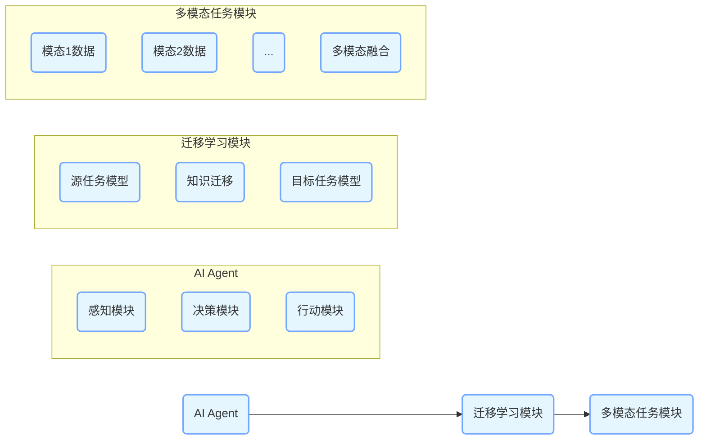

# AI Agent的迁移学习在多模态任务中的应用

> 关键词：AI Agent、迁移学习、多模态任务、多模态融合、知识迁移

> 摘要：本文聚焦于AI Agent的迁移学习在多模态任务中的应用。首先介绍了研究的背景、目的、预期读者和文档结构等信息。接着阐述了AI Agent、迁移学习和多模态任务的核心概念及其联系，给出了原理和架构的文本示意图与Mermaid流程图。详细讲解了迁移学习的核心算法原理，并结合Python源代码说明具体操作步骤。引入了相关数学模型和公式，并举例说明。通过项目实战，展示了开发环境搭建、源代码实现及代码解读。探讨了其实际应用场景，推荐了学习资源、开发工具框架和相关论文著作。最后总结了未来发展趋势与挑战，提供了常见问题解答和扩展阅读参考资料，旨在全面深入地剖析AI Agent的迁移学习在多模态任务中的应用。

## 1. 背景介绍 
### 1.1 目的和范围
随着人工智能技术的不断发展，多模态任务，如同时处理图像、文本、语音等多种信息源的任务，变得越来越重要。然而，训练一个能够在多模态任务中表现出色的AI Agent通常需要大量的数据和计算资源。迁移学习作为一种有效的方法，可以将在一个任务或领域中学习到的知识迁移到另一个相关的任务或领域中，从而减少数据需求和训练时间。本文的目的是探讨AI Agent的迁移学习在多模态任务中的应用，包括核心概念、算法原理、实际案例等，范围涵盖从理论基础到实际应用的各个方面。

### 1.2 预期读者
本文预期读者包括人工智能领域的研究人员、开发者、学生等。对于对多模态学习、迁移学习感兴趣，希望深入了解AI Agent在多模态任务中应用的人群具有较高的参考价值。同时，对于从事相关项目开发的工程师，本文提供的项目实战案例和代码实现也能为其提供一定的借鉴。

### 1.3 文档结构概述
本文将按照以下结构进行组织：首先介绍核心概念与联系，明确AI Agent、迁移学习和多模态任务的定义和相互关系；接着讲解核心算法原理和具体操作步骤，通过Python代码详细阐述；然后引入数学模型和公式进行理论分析，并举例说明；通过项目实战展示代码实际案例和详细解释；探讨实际应用场景；推荐相关的工具和资源；最后总结未来发展趋势与挑战，提供常见问题解答和扩展阅读参考资料。

### 1.4 术语表
#### 1.4.1 核心术语定义
- **AI Agent**：一种能够感知环境、做出决策并采取行动以实现特定目标的人工智能实体。它可以是虚拟的软件程序，也可以是物理机器人。
- **迁移学习**：是一种机器学习技术，旨在将在一个或多个源任务上学习到的知识迁移到一个目标任务上，以提高目标任务的学习效率和性能。
- **多模态任务**：涉及处理多种不同类型数据（如文本、图像、音频、视频等）的任务，要求模型能够理解和整合这些不同模态的数据信息。

#### 1.4.2 相关概念解释
- **多模态融合**：将来自不同模态的数据进行整合和处理的过程，以获得更全面、准确的信息。常见的融合方法包括早期融合、晚期融合等。
- **知识迁移**：迁移学习的核心概念，指将源任务中的知识（如模型参数、特征表示等）应用到目标任务中，帮助目标任务更快地学习和达到更好的性能。

#### 1.4.3 缩略词列表
- **CNN**：Convolutional Neural Network，卷积神经网络
- **RNN**：Recurrent Neural Network，循环神经网络
- **LSTM**：Long Short-Term Memory，长短期记忆网络
- **BERT**：Bidirectional Encoder Representations from Transformers，基于变换器的双向编码器表示

## 2. 核心概念与联系 
### 核心概念原理

#### AI Agent
AI Agent的基本原理是基于感知 - 决策 - 行动的循环。它通过传感器感知环境信息，然后使用内部的决策机制（如机器学习模型、规则引擎等）对感知到的信息进行分析和处理，做出决策，最后通过执行器采取相应的行动。例如，在自动驾驶汽车中，传感器（如摄像头、雷达等）收集道路和周围环境的信息，决策系统根据这些信息决定车辆的行驶速度、方向等，执行器则控制车辆的加速、刹车、转向等操作。

#### 迁移学习
迁移学习的原理是利用源任务和目标任务之间的相似性，将源任务中学习到的知识迁移到目标任务中。这种相似性可以体现在数据的分布、特征的表示、任务的结构等方面。例如，在图像分类任务中，如果源任务是对不同种类的动物进行分类，目标任务是对不同种类的植物进行分类，那么它们在图像的视觉特征（如颜色、形状等）上可能存在一定的相似性，可以利用源任务中学习到的图像特征提取器来帮助目标任务的学习。

#### 多模态任务
多模态任务的核心原理是处理和整合来自不同模态的数据。不同模态的数据具有不同的特点和信息，通过融合这些数据可以获得更丰富、全面的信息。例如，在视频问答任务中，视频包含了视觉信息，而问题是文本信息，模型需要同时理解视频中的内容和问题的含义，然后生成准确的答案。

### 架构的文本示意图
```plaintext
+-----------------+
|  AI Agent       |
|                 |
| +-------------+ |
| | 感知模块    | |
| +-------------+ |
| | 决策模块    | |
| +-------------+ |
| | 行动模块    | |
| +-------------+ |
+-----------------+
        |
        v
+-----------------+
| 迁移学习模块    |
|                 |
| +-------------+ |
| | 源任务模型  | |
| +-------------+ |
| | 知识迁移    | |
| +-------------+ |
| | 目标任务模型| |
| +-------------+ |
+-----------------+
        |
        v
+-----------------+
| 多模态任务模块  |
|                 |
| +-------------+ |
| | 模态1数据   | |
| +-------------+ |
| | 模态2数据   | |
| +-------------+ |
| |...         | |
| +-------------+ |
| | 多模态融合  | |
| +-------------+ |
+-----------------+
```

### Mermaid流程图


## 3. 核心算法原理 & 具体操作步骤 
### 迁移学习的核心算法原理
迁移学习有多种算法，这里以基于模型参数迁移的方法为例进行讲解。假设我们有一个源任务的预训练模型 $M_s$ 和一个目标任务的模型 $M_t$。预训练模型 $M_s$ 已经在大量的源任务数据上进行了训练，学习到了一些通用的特征表示。我们希望将 $M_s$ 的部分或全部参数迁移到 $M_t$ 中，以帮助 $M_t$ 在目标任务上更快地收敛和获得更好的性能。

### 具体操作步骤及Python代码实现
以下是一个简单的基于PyTorch的图像分类任务的迁移学习示例，假设源任务是在ImageNet数据集上预训练的ResNet模型，目标任务是对自己的小型图像数据集进行分类。

```python
import torch
import torch.nn as nn
import torch.optim as optim
from torchvision import models, datasets, transforms

# 数据预处理
transform = transforms.Compose([
    transforms.Resize(256),
    transforms.CenterCrop(224),
    transforms.ToTensor(),
    transforms.Normalize(mean=[0.485, 0.456, 0.406], std=[0.229, 0.224, 0.225])
])

# 加载目标任务数据集
train_dataset = datasets.ImageFolder(root='path/to/train_data', transform=transform)
train_loader = torch.utils.data.DataLoader(train_dataset, batch_size=32, shuffle=True)

# 加载预训练的ResNet模型
model = models.resnet18(pretrained=True)

# 冻结预训练模型的所有参数
for param in model.parameters():
    param.requires_grad = False

# 修改最后一层全连接层以适应目标任务的类别数
num_ftrs = model.fc.in_features
model.fc = nn.Linear(num_ftrs, len(train_dataset.classes))

# 定义损失函数和优化器
criterion = nn.CrossEntropyLoss()
optimizer = optim.SGD(model.fc.parameters(), lr=0.001, momentum=0.9)

# 训练模型
device = torch.device("cuda:0" if torch.cuda.is_available() else "cpu")
model.to(device)

num_epochs = 10
for epoch in range(num_epochs):
    running_loss = 0.0
    for i, (images, labels) in enumerate(train_loader):
        images, labels = images.to(device), labels.to(device)

        optimizer.zero_grad()
        outputs = model(images)
        loss = criterion(outputs, labels)
        loss.backward()
        optimizer.step()

        running_loss += loss.item()
    print(f'Epoch {epoch + 1}, Loss: {running_loss / len(train_loader)}')

print('Training finished.')
```

### 代码解释
1. **数据预处理**：使用`transforms`对图像进行缩放、裁剪、归一化等操作，使其符合预训练模型的输入要求。
2. **加载预训练模型**：使用`torchvision.models`加载在ImageNet上预训练的ResNet18模型。
3. **冻结参数**：通过设置`param.requires_grad = False`冻结预训练模型的所有参数，只训练最后一层全连接层。
4. **修改模型结构**：将最后一层全连接层的输出维度修改为目标任务的类别数。
5. **定义损失函数和优化器**：使用交叉熵损失函数和随机梯度下降优化器。
6. **训练模型**：将模型移动到GPU（如果可用）上，进行多个epoch的训练。

## 4. 数学模型和公式 & 详细讲解 & 举例说明 
### 迁移学习的数学模型
假设我们有一个源任务的数据集 $D_s = \{(x_{s1}, y_{s1}), (x_{s2}, y_{s2}), \cdots, (x_{sn}, y_{sn})\}$ 和一个目标任务的数据集 $D_t = \{(x_{t1}, y_{t1}), (x_{t2}, y_{t2}), \cdots, (x_{tm}, y_{tm})\}$，其中 $x$ 表示输入数据，$y$ 表示对应的标签。

我们的目标是学习一个目标任务的模型 $f_t(x)$，使得在目标任务数据集 $D_t$ 上的损失函数 $L_t(f_t(x), y)$ 最小化。迁移学习的思想是利用源任务的模型 $f_s(x)$ 来辅助目标任务的学习。

一种常见的方法是通过最小化以下目标函数：

$$
\min_{f_t} L_t(f_t(x), y) + \lambda \cdot R(f_s, f_t)
$$

其中，$L_t(f_t(x), y)$ 是目标任务的损失函数，$R(f_s, f_t)$ 是衡量源任务模型 $f_s$ 和目标任务模型 $f_t$ 之间差异的正则化项，$\lambda$ 是一个超参数，用于控制正则化项的权重。

### 详细讲解
- **目标任务损失函数 $L_t(f_t(x), y)$**：这是衡量目标任务模型在目标任务数据集上预测结果与真实标签之间差异的函数。常见的损失函数包括交叉熵损失（用于分类任务）、均方误差损失（用于回归任务）等。
- **正则化项 $R(f_s, f_t)$**：其作用是促使目标任务模型 $f_t$ 与源任务模型 $f_s$ 尽可能相似。例如，可以使用模型参数的欧几里得距离作为正则化项：

$$
R(f_s, f_t) = \| \theta_s - \theta_t \|^2
$$

其中，$\theta_s$ 和 $\theta_t$ 分别是源任务模型和目标任务模型的参数。

### 举例说明
假设我们有一个源任务是手写数字识别，目标任务是字母识别。源任务的模型 $f_s$ 已经在大量的手写数字图像数据集上进行了训练，学习到了一些通用的图像特征。目标任务的模型 $f_t$ 初始时参数随机初始化。

在训练目标任务模型时，我们不仅要最小化目标任务的损失函数 $L_t(f_t(x), y)$，还要考虑正则化项 $R(f_s, f_t)$。通过调整 $\lambda$ 的值，我们可以控制源任务模型对目标任务模型的影响程度。如果 $\lambda$ 较大，目标任务模型会更倾向于与源任务模型相似；如果 $\lambda$ 较小，则更注重目标任务自身的学习。

## 5. 项目实战：代码实际案例和详细解释说明 
### 5.1  开发环境搭建
#### 安装Python和相关库
首先，确保你已经安装了Python 3.x版本。然后，使用以下命令安装所需的库：

```bash
pip install torch torchvision numpy matplotlib
```

#### 数据集准备
本项目使用CIFAR-10数据集作为源任务数据集，自己创建一个小型的图像分类数据集作为目标任务数据集。CIFAR-10数据集可以使用`torchvision`库自动下载，自己的数据集需要按照以下目录结构组织：

```plaintext
path/to/train_data
├── class1
│   ├── image1.jpg
│   ├── image2.jpg
│   └──...
├── class2
│   ├── image3.jpg
│   ├── image4.jpg
│   └──...
└──...
```

### 5.2  源代码详细实现和代码解读
```python
import torch
import torch.nn as nn
import torch.optim as optim
from torchvision import models, datasets, transforms
import matplotlib.pyplot as plt

# 数据预处理
transform = transforms.Compose([
    transforms.Resize(256),
    transforms.CenterCrop(224),
    transforms.ToTensor(),
    transforms.Normalize(mean=[0.485, 0.456, 0.406], std=[0.229, 0.224, 0.225])
])

# 加载源任务数据集（CIFAR-10）
cifar_train_dataset = datasets.CIFAR10(root='./data', train=True,
                                       download=True, transform=transform)
cifar_train_loader = torch.utils.data.DataLoader(cifar_train_dataset, batch_size=32, shuffle=True)

# 加载目标任务数据集
target_train_dataset = datasets.ImageFolder(root='path/to/train_data', transform=transform)
target_train_loader = torch.utils.data.DataLoader(target_train_dataset, batch_size=32, shuffle=True)

# 加载预训练的ResNet模型
model = models.resnet18(pretrained=True)

# 冻结预训练模型的所有参数
for param in model.parameters():
    param.requires_grad = False

# 修改最后一层全连接层以适应目标任务的类别数
num_ftrs = model.fc.in_features
model.fc = nn.Linear(num_ftrs, len(target_train_dataset.classes))

# 定义损失函数和优化器
criterion = nn.CrossEntropyLoss()
optimizer = optim.SGD(model.fc.parameters(), lr=0.001, momentum=0.9)

# 训练模型
device = torch.device("cuda:0" if torch.cuda.is_available() else "cpu")
model.to(device)

num_epochs = 10
train_losses = []
for epoch in range(num_epochs):
    running_loss = 0.0
    for i, (images, labels) in enumerate(target_train_loader):
        images, labels = images.to(device), labels.to(device)

        optimizer.zero_grad()
        outputs = model(images)
        loss = criterion(outputs, labels)
        loss.backward()
        optimizer.step()

        running_loss += loss.item()
    epoch_loss = running_loss / len(target_train_loader)
    train_losses.append(epoch_loss)
    print(f'Epoch {epoch + 1}, Loss: {epoch_loss}')

# 绘制训练损失曲线
plt.plot(train_losses)
plt.xlabel('Epoch')
plt.ylabel('Loss')
plt.title('Training Loss')
plt.show()

print('Training finished.')
```

### 5.3  代码解读与分析
1. **数据预处理**：使用`transforms`对图像进行预处理，使其符合预训练模型的输入要求。
2. **数据集加载**：使用`torchvision.datasets`加载CIFAR-10数据集和自己的目标任务数据集，并使用`DataLoader`进行批量处理。
3. **模型加载和修改**：加载预训练的ResNet18模型，冻结其所有参数，然后修改最后一层全连接层以适应目标任务的类别数。
4. **损失函数和优化器**：使用交叉熵损失函数和随机梯度下降优化器。
5. **训练过程**：将模型移动到GPU（如果可用）上，进行多个epoch的训练，并记录每个epoch的训练损失。
6. **绘制训练损失曲线**：使用`matplotlib`绘制训练损失曲线，方便观察模型的训练过程。

## 6. 实际应用场景 
### 智能客服系统
在智能客服系统中，通常需要处理用户的文本咨询和语音咨询。通过迁移学习，可以将在大规模文本语料库上训练的语言模型的知识迁移到处理特定领域（如电商、金融等）的客服任务中。同时，结合语音识别技术，将语音信息转换为文本后进行处理，实现多模态的智能客服服务。例如，用户可以通过语音或文本方式咨询商品信息、订单状态等问题，智能客服系统能够准确理解并提供相应的回答。

### 自动驾驶
自动驾驶系统需要处理多种模态的数据，如摄像头拍摄的图像、雷达检测的距离信息、激光雷达生成的点云数据等。迁移学习可以帮助在不同场景下快速适应和优化模型。例如，将在模拟环境中训练的模型的知识迁移到实际道路环境中，或者将在城市道路场景中训练的模型迁移到高速公路场景中。通过融合多模态数据，自动驾驶系统可以更准确地感知周围环境，做出更安全、合理的决策。

### 医疗诊断
在医疗领域，医生通常需要综合考虑患者的病历文本、医学影像（如X光、CT、MRI等）和生命体征数据（如心率、血压等）进行诊断。AI Agent的迁移学习可以将在大量医学数据上训练的模型应用到特定疾病的诊断任务中。例如，将在通用医学影像数据集上训练的图像识别模型迁移到乳腺癌、肺癌等特定疾病的诊断中，结合病历文本和生命体征数据进行多模态分析，提高诊断的准确性和效率。

### 智能教育
智能教育系统可以根据学生的学习行为数据（如学习时间、做题正确率等）、学习过程中的语音交流和面部表情等多模态信息，为学生提供个性化的学习建议和辅导。迁移学习可以将在大规模教育数据上学习到的知识迁移到不同学科、不同年龄段的学生群体中。例如，将在数学学科上训练的学习行为分析模型迁移到语文、英语等其他学科的学习中，更好地理解学生的学习需求和困难，提高教育质量。

## 7. 工具和资源推荐
### 7.1 学习资源推荐
#### 7.1.1 书籍推荐
- 《深度学习》（Deep Learning）：由Ian Goodfellow、Yoshua Bengio和Aaron Courville所著，是深度学习领域的经典教材，涵盖了深度学习的基本原理、算法和应用，对迁移学习和多模态学习也有一定的介绍。
- 《人工智能：一种现代的方法》（Artificial Intelligence: A Modern Approach）：这本书全面介绍了人工智能的各个领域，包括搜索算法、知识表示、机器学习等，对理解AI Agent的基本概念和原理有很大帮助。
- 《多模态机器学习：基础与应用》（Multimodal Machine Learning: Foundations and Applications）：专门介绍多模态机器学习的书籍，详细讲解了多模态数据的处理、融合方法和应用场景。

#### 7.1.2 在线课程
- Coursera上的“深度学习专项课程”（Deep Learning Specialization）：由Andrew Ng教授授课，包括深度学习基础、卷积神经网络、循环神经网络等内容，对理解深度学习和迁移学习的原理和实践有很大帮助。
- edX上的“人工智能导论”（Introduction to Artificial Intelligence）：该课程涵盖了人工智能的基本概念、搜索算法、机器学习等内容，对AI Agent的相关知识有系统的介绍。
- Udemy上的“多模态深度学习实战”（Multimodal Deep Learning in Practice）：专门针对多模态深度学习的课程，通过实际案例讲解多模态数据的处理和模型训练。

#### 7.1.3 技术博客和网站
- Medium：有很多人工智能领域的技术博客，如Towards Data Science，上面有很多关于迁移学习、多模态学习的文章和案例分享。
- arXiv：是一个预印本平台，上面可以找到很多最新的人工智能研究论文，包括关于AI Agent的迁移学习在多模态任务中的应用的研究成果。
- OpenAI官方博客：OpenAI在人工智能领域有很多前沿的研究和应用，其官方博客会发布相关的技术文章和研究成果。

### 7.2 开发工具框架推荐
#### 7.2.1 IDE和编辑器
- PyCharm：是一款专门为Python开发设计的集成开发环境，具有代码自动补全、调试、版本控制等功能，非常适合进行深度学习项目的开发。
- Jupyter Notebook：是一个交互式的开发环境，可以将代码、文本、图像等内容整合在一起，方便进行数据探索、模型实验和结果展示。
- Visual Studio Code：是一款轻量级的代码编辑器，支持多种编程语言和插件扩展，对Python和深度学习开发也有很好的支持。

#### 7.2.2 调试和性能分析工具
- TensorBoard：是TensorFlow的可视化工具，可以用于可视化模型的训练过程、损失曲线、模型结构等，帮助开发者更好地理解和调试模型。
- PyTorch Profiler：是PyTorch的性能分析工具，可以分析模型的计算时间、内存使用等情况，帮助开发者优化模型性能。
- NVIDIA Nsight Systems：是NVIDIA提供的性能分析工具，主要用于分析GPU的性能，对于使用GPU进行深度学习训练的项目非常有用。

#### 7.2.3 相关框架和库
- PyTorch：是一个开源的深度学习框架，具有动态图机制，方便进行模型的构建和调试，同时也提供了很多预训练模型和工具，支持迁移学习和多模态学习。
- TensorFlow：是另一个广泛使用的深度学习框架，具有强大的分布式训练和部署能力，提供了丰富的工具和库，如TensorFlow Hub可以方便地使用预训练模型进行迁移学习。
- Hugging Face Transformers：是一个专门用于自然语言处理的库，提供了很多预训练的语言模型（如BERT、GPT等），可以方便地进行文本处理和迁移学习。

### 7.3 相关论文著作推荐
#### 7.3.1 经典论文
- “How transferable are features in deep neural networks?”：该论文探讨了深度神经网络中特征的可迁移性问题，对迁移学习的理论基础有重要贡献。
- “Multimodal Deep Learning”：首次提出了多模态深度学习的概念，并介绍了一些基本的多模态融合方法和模型。
- “Learning to Learn by Gradient Descent by Gradient Descent”：提出了元学习的概念，与迁移学习有一定的关联，为在不同任务之间快速学习提供了新的思路。

#### 7.3.2 最新研究成果
- 关注arXiv上关于“AI Agent迁移学习在多模态任务中的应用”的最新论文，了解该领域的最新研究进展和技术方法。
- 参加国际人工智能会议（如NeurIPS、ICML、CVPR等）的相关研讨会和论文报告，获取最新的研究成果和趋势。

#### 7.3.3 应用案例分析
- 可以在ACM Digital Library、IEEE Xplore等数据库中搜索关于AI Agent迁移学习在智能客服、自动驾驶、医疗诊断等实际应用场景的案例分析论文，学习如何将理论知识应用到实际项目中。

## 8. 总结：未来发展趋势与挑战
### 未来发展趋势
#### 更复杂的多模态融合方法
未来，随着多模态数据的复杂性不断增加，需要开发更先进的多模态融合方法。例如，不仅要考虑不同模态数据的特征层面的融合，还要考虑语义层面的融合，以更好地理解和处理多模态信息。

#### 跨领域和跨模态的迁移学习
目前的迁移学习主要集中在同一领域或相似模态之间的知识迁移。未来，将探索跨领域（如从医学领域迁移到金融领域）和跨模态（如从图像模态迁移到语音模态）的迁移学习方法，进一步拓展迁移学习的应用范围。

#### 自适应的AI Agent
AI Agent将具备更强的自适应能力，能够根据不同的任务和环境自动调整迁移学习的策略和方法。例如，在面对新的多模态任务时，能够快速判断是否需要迁移知识以及如何迁移知识。

#### 与其他技术的融合
AI Agent的迁移学习将与其他技术（如强化学习、元学习、知识图谱等）进行更深入的融合。例如，结合强化学习可以让AI Agent在多模态任务中更好地进行决策和行动，结合知识图谱可以提供更丰富的背景知识，辅助迁移学习。

### 挑战
#### 多模态数据的异质性
不同模态的数据具有不同的特征和分布，如何有效地处理和融合这些异质性的数据是一个挑战。例如，图像数据是二维的像素矩阵，文本数据是一维的字符序列，需要开发专门的方法来统一处理这些不同类型的数据。

#### 知识迁移的有效性评估
目前，缺乏有效的方法来评估知识迁移的有效性。在迁移学习过程中，可能会出现负迁移的情况，即迁移的知识反而降低了目标任务的性能。如何准确地评估知识迁移的效果，并避免负迁移是需要解决的问题。

#### 隐私和安全问题
在迁移学习过程中，可能会涉及到敏感数据的迁移和共享。如何保护数据的隐私和安全，防止数据泄露和滥用是一个重要的挑战。例如，在医疗领域的迁移学习中，患者的病历和影像数据是高度敏感的信息，需要采取严格的安全措施。

#### 计算资源和时间成本
多模态任务通常需要处理大量的数据，迁移学习也需要进行复杂的模型训练和调整。这会导致计算资源和时间成本的增加。如何在有限的计算资源和时间内实现高效的迁移学习是一个亟待解决的问题。

## 9. 附录：常见问题与解答
### 1. 迁移学习一定能提高目标任务的性能吗？
不一定。虽然迁移学习的目的是利用源任务的知识来提高目标任务的性能，但在某些情况下可能会出现负迁移的现象。例如，当源任务和目标任务的相关性较低，或者源任务的知识与目标任务的需求不匹配时，迁移的知识可能会干扰目标任务的学习，导致性能下降。因此，在进行迁移学习之前，需要仔细评估源任务和目标任务的相关性，并选择合适的迁移方法和参数。

### 2. 如何选择合适的预训练模型进行迁移学习？
选择合适的预训练模型需要考虑以下几个因素：
- **任务相关性**：选择与目标任务相关性较高的预训练模型。例如，如果目标任务是图像分类，那么可以选择在大规模图像数据集（如ImageNet）上预训练的卷积神经网络模型。
- **模型大小和复杂度**：根据可用的计算资源和目标任务的规模选择合适大小和复杂度的模型。如果计算资源有限，可以选择较小的模型；如果目标任务比较复杂，可能需要选择较大的模型。
- **预训练数据的质量和规模**：预训练数据的质量和规模会影响模型的泛化能力。一般来说，使用大规模、高质量的预训练数据训练的模型具有更好的性能。

### 3. 多模态融合有哪些常见的方法？
常见的多模态融合方法包括：
- **早期融合**：在数据层面进行融合，将不同模态的数据在输入阶段进行拼接或组合，然后输入到同一个模型中进行处理。这种方法简单直接，但可能会丢失一些模态特有的信息。
- **晚期融合**：在特征层面或决策层面进行融合。先分别对不同模态的数据进行处理，提取各自的特征，然后在特征层面或决策层面进行融合。例如，可以将不同模态的特征进行拼接或加权求和，再输入到后续的分类器中进行决策。
- **混合融合**：结合早期融合和晚期融合的方法，在不同的阶段进行融合，以充分利用不同模态的数据信息。

### 4. 如何解决多模态数据的异质性问题？
解决多模态数据的异质性问题可以从以下几个方面入手：
- **特征提取**：使用合适的特征提取方法将不同模态的数据转换为统一的特征表示。例如，对于图像数据可以使用卷积神经网络提取特征，对于文本数据可以使用词嵌入和深度学习模型提取特征。
- **模态对齐**：找到不同模态数据之间的对应关系，进行模态对齐。例如，在视频和文本的多模态任务中，可以通过时间戳或语义信息将视频帧和文本片段进行对齐。
- **多模态模型设计**：设计专门的多模态模型，能够同时处理和融合不同模态的数据。例如，使用多模态注意力机制来动态地关注不同模态的数据信息。

## 10. 扩展阅读 & 参考资料
### 扩展阅读
- 《深度学习实战》（Deep Learning in Practice）：这本书通过实际案例深入介绍了深度学习的应用和实践技巧，对理解AI Agent的迁移学习在多模态任务中的应用有一定的帮助。
- 《人工智能前沿技术》（Frontier Technologies in Artificial Intelligence）：涵盖了人工智能领域的最新前沿技术，包括迁移学习、多模态学习等，适合进一步拓展知识面。
- 相关的技术博客和论坛，如Reddit的r/MachineLearning板块，有很多关于AI Agent、迁移学习和多模态任务的讨论和分享。

### 参考资料
- Goodfellow, I., Bengio, Y., & Courville, A. (2016). Deep Learning. MIT Press.
- Russell, S. J., & Norvig, P. (2020). Artificial Intelligence: A Modern Approach. Pearson.
- Baltrušaitis, T., Ahuja, C., & Morency, L.-P. (2018). Multimodal Machine Learning: A Survey and Taxonomy. IEEE Transactions on Pattern Analysis and Machine Intelligence, 41(2), 423-443.

作者：AI天才研究院/AI Genius Institute & 禅与计算机程序设计艺术 /Zen And The Art of Computer Programming