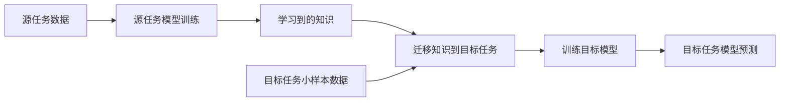

# AI Agent的迁移学习在小样本学习中的应用

> 关键词：AI Agent、迁移学习、小样本学习、模型应用、知识迁移

> 摘要：本文深入探讨了AI Agent的迁移学习在小样本学习中的应用。首先介绍了相关背景知识，包括目的范围、预期读者等内容。接着阐述了核心概念及联系，详细分析了迁移学习和小样本学习的原理与架构，并给出示意图和流程图。在核心算法原理部分，使用Python代码详细讲解。同时，介绍了相关数学模型和公式并举例说明。通过项目实战，展示了代码实际案例及详细解释。还探讨了实际应用场景，推荐了学习工具和资源。最后总结了未来发展趋势与挑战，提供常见问题解答和扩展阅读参考资料，旨在为相关领域研究者和开发者提供全面深入的技术指导。

## 1. 背景介绍 
### 1.1 目的和范围
在当今人工智能领域，数据获取成本高、标注困难是普遍面临的问题。小样本学习旨在解决在仅有少量标注样本的情况下，模型仍能具备良好的泛化能力和学习效果。而AI Agent的迁移学习则是通过将在一个或多个源任务上学习到的知识迁移到目标任务中，以提高目标任务的学习效率和性能。本文的目的在于深入研究AI Agent的迁移学习如何在小样本学习场景中发挥作用，探讨其原理、算法、应用案例等内容，范围涵盖理论分析、算法实现、实际应用等多个方面。

### 1.2 预期读者
本文预期读者包括人工智能领域的研究者、开发者、学生等。对于正在从事小样本学习、迁移学习相关研究的科研人员，本文可以提供新的思路和研究方向；对于开发者而言，有助于其在实际项目中应用相关技术，解决数据不足的问题；对于学生来说，能够帮助他们系统地了解AI Agent迁移学习在小样本学习中的应用知识，为进一步学习和研究打下基础。

### 1.3 文档结构概述
本文首先介绍背景知识，让读者了解研究的目的和范围等信息。接着阐述核心概念与联系，包括迁移学习和小样本学习的原理、架构及它们之间的关联。然后详细讲解核心算法原理和具体操作步骤，使用Python代码进行说明。之后介绍相关数学模型和公式，并举例进行详细讲解。通过项目实战部分，展示代码实际案例和详细解释。再探讨实际应用场景，为读者提供实际参考。推荐学习所需的工具和资源，帮助读者进一步深入学习。最后总结未来发展趋势与挑战，解答常见问题，并提供扩展阅读和参考资料。

### 1.4 术语表
#### 1.4.1 核心术语定义
- **AI Agent**：是一种能够感知环境、做出决策并采取行动以实现特定目标的智能实体。它可以通过学习和交互不断优化自身的行为。
- **迁移学习**：是指将在一个或多个源任务上学习到的知识、技能或特征表示迁移到目标任务中，从而加快目标任务的学习速度、提高学习效果。
- **小样本学习**：是指在仅有少量标注样本的情况下，让模型学习到有效的特征表示和分类决策规则，以实现对新样本的准确分类和预测。

#### 1.4.2 相关概念解释
- **元学习**：元学习是一种学习如何学习的方法，它的目标是在多个任务上学习到通用的学习策略和参数初始化，以便在新的小样本任务上能够快速适应和学习。在小样本学习中，元学习与迁移学习密切相关，元学习可以为迁移学习提供更有效的知识表示和学习机制。
- **领域适应**：领域适应是迁移学习的一种特殊情况，它主要关注源领域和目标领域之间存在分布差异的情况。通过领域适应技术，可以减少这种分布差异对模型性能的影响，从而实现知识在不同领域之间的有效迁移。

#### 1.4.3 缩略词列表
- **CNN**：Convolutional Neural Network，卷积神经网络
- **RNN**：Recurrent Neural Network，循环神经网络
- **MLP**：Multi - Layer Perceptron，多层感知机

## 2. 核心概念与联系 

### 核心概念原理
#### 迁移学习原理
迁移学习的核心思想是利用源任务和目标任务之间的相似性，将源任务中学习到的知识迁移到目标任务中。知识的迁移可以发生在不同的层次，如特征表示层、模型参数层等。根据源任务和目标任务的不同，迁移学习可以分为以下几种类型：
- **归纳式迁移学习**：源任务和目标任务有不同的输入空间，但共享相同的输出空间。例如，在图像分类任务中，源任务是对自然图像进行分类，目标任务是对医学图像进行分类，虽然图像类型不同，但分类的类别标签是相同的。
- **直推式迁移学习**：源任务和目标任务有相同的输入空间，但目标任务的训练样本没有标签。例如，在情感分析任务中，源任务是对电影评论进行情感分类，目标任务是对产品评论进行情感分类，且产品评论没有标注情感标签。
- **无监督迁移学习**：源任务和目标任务都没有标签，主要是通过挖掘数据的内在结构和特征表示来实现知识迁移。

#### 小样本学习原理
小样本学习的主要挑战是在少量标注样本的情况下，模型难以学习到足够的特征信息来进行准确的分类和预测。为了解决这个问题，小样本学习通常采用以下几种方法：
- **元学习**：通过在多个任务上进行训练，学习到通用的学习策略和参数初始化，使得模型能够在新的小样本任务上快速适应和学习。
- **数据增强**：通过对少量标注样本进行变换和扩充，如旋转、翻转、缩放等，增加样本的多样性，从而提高模型的泛化能力。
- **特征提取和表示学习**：学习到更具代表性和区分性的特征表示，使得模型能够在少量样本的情况下也能准确地进行分类和预测。

### 架构的文本示意图
```plaintext
            源任务数据
                |
                v
         源任务模型训练
                |
                v
        学习到的知识（特征、参数等）
                |
                |（迁移）
                v
         目标任务（小样本数据）
                |
                v
  结合迁移知识和小样本数据训练目标模型
                |
                v
         目标任务模型预测
```

### Mermaid 流程图


## 3. 核心算法原理 & 具体操作步骤 

### 基于模型参数迁移的算法原理
在基于模型参数迁移的方法中，我们首先在源任务上训练一个预训练模型，然后将该模型的部分或全部参数迁移到目标任务的模型中。在小样本学习场景下，由于目标任务的标注样本较少，我们可以利用预训练模型的参数来初始化目标任务模型，从而加快目标任务模型的收敛速度和提高性能。

### Python 代码详细阐述
```python
import torch
import torch.nn as nn
import torch.optim as optim
from torchvision import datasets, transforms
from torch.utils.data import DataLoader

# 定义源任务模型（简单的CNN模型）
class SourceCNN(nn.Module):
    def __init__(self):
        super(SourceCNN, self).__init__()
        self.conv1 = nn.Conv2d(3, 16, kernel_size=3, padding=1)
        self.relu1 = nn.ReLU()
        self.pool1 = nn.MaxPool2d(2)
        self.fc1 = nn.Linear(16 * 16 * 16, 10)

    def forward(self, x):
        x = self.pool1(self.relu1(self.conv1(x)))
        x = x.view(-1, 16 * 16 * 16)
        x = self.fc1(x)
        return x

# 定义目标任务模型（与源任务模型结构相似）
class TargetCNN(nn.Module):
    def __init__(self):
        super(TargetCNN, self).__init__()
        self.conv1 = nn.Conv2d(3, 16, kernel_size=3, padding=1)
        self.relu1 = nn.ReLU()
        self.pool1 = nn.MaxPool2d(2)
        self.fc1 = nn.Linear(16 * 16 * 16, 5)  # 假设目标任务有5个类别

    def forward(self, x):
        x = self.pool1(self.relu1(self.conv1(x)))
        x = x.view(-1, 16 * 16 * 16)
        x = self.fc1(x)
        return x

# 源任务数据加载
source_transform = transforms.Compose([
    transforms.ToTensor(),
    transforms.Normalize((0.5, 0.5, 0.5), (0.5, 0.5, 0.5))
])
source_train_dataset = datasets.CIFAR10(root='./data', train=True,
                                        download=True, transform=source_transform)
source_train_loader = DataLoader(source_train_dataset, batch_size=32, shuffle=True)

# 训练源任务模型
source_model = SourceCNN()
criterion = nn.CrossEntropyLoss()
optimizer = optim.Adam(source_model.parameters(), lr=0.001)

for epoch in range(10):
    running_loss = 0.0
    for i, data in enumerate(source_train_loader, 0):
        inputs, labels = data
        optimizer.zero_grad()
        outputs = source_model(inputs)
        loss = criterion(outputs, labels)
        loss.backward()
        optimizer.step()
        running_loss += loss.item()
    print(f'Epoch {epoch + 1}, Loss: {running_loss / len(source_train_loader)}')

# 迁移模型参数到目标任务模型
target_model = TargetCNN()
target_model.conv1.weight.data = source_model.conv1.weight.data
target_model.conv1.bias.data = source_model.conv1.bias.data

# 目标任务小样本数据加载（假设只有少量样本）
target_transform = transforms.Compose([
    transforms.ToTensor(),
    transforms.Normalize((0.5, 0.5, 0.5), (0.5, 0.5, 0.5))
])
target_train_dataset = datasets.CIFAR10(root='./data', train=True,
                                        download=True, transform=target_transform)
# 模拟小样本数据，只取前100个样本
target_train_dataset = torch.utils.data.Subset(target_train_dataset, range(100))
target_train_loader = DataLoader(target_train_dataset, batch_size=10, shuffle=True)

# 训练目标任务模型
target_optimizer = optim.Adam(target_model.parameters(), lr=0.001)
for epoch in range(10):
    running_loss = 0.0
    for i, data in enumerate(target_train_loader, 0):
        inputs, labels = data
        target_optimizer.zero_grad()
        outputs = target_model(inputs)
        loss = criterion(outputs, labels)
        loss.backward()
        target_optimizer.step()
        running_loss += loss.item()
    print(f'Target Epoch {epoch + 1}, Loss: {running_loss / len(target_train_loader)}')

```

### 具体操作步骤
1. **定义源任务模型和目标任务模型**：根据任务需求定义合适的模型结构，源任务模型和目标任务模型可以有相似的结构，但输出层可能不同。
2. **训练源任务模型**：使用源任务的数据集对源任务模型进行训练，优化模型参数。
3. **迁移模型参数**：将源任务模型的部分或全部参数迁移到目标任务模型中，例如卷积层的参数。
4. **加载目标任务小样本数据**：准备目标任务的小样本数据集。
5. **训练目标任务模型**：使用迁移后的模型参数和目标任务的小样本数据对目标任务模型进行训练，进一步优化模型参数。

## 4. 数学模型和公式 & 详细讲解 & 举例说明 

### 损失函数
在小样本学习中，常用的损失函数是交叉熵损失函数。对于分类任务，假设模型的输出为 $\mathbf{y}=(y_1,y_2,\cdots,y_C)$，其中 $C$ 是类别数，真实标签为 $\mathbf{t}=(t_1,t_2,\cdots,t_C)$，交叉熵损失函数的定义为：
$$
L = -\sum_{i = 1}^{C}t_i\log(y_i)
$$
其中，$t_i$ 是一个二值向量，表示第 $i$ 个类别的真实标签，$y_i$ 是模型预测第 $i$ 个类别的概率。

### 详细讲解
交叉熵损失函数衡量了模型预测的概率分布与真实标签的概率分布之间的差异。当模型预测的概率分布与真实标签的概率分布越接近时，交叉熵损失函数的值越小。在训练过程中，我们的目标是最小化交叉熵损失函数，从而使模型的预测结果更加准确。

### 举例说明
假设我们有一个三分类任务，模型的输出为 $\mathbf{y}=(0.2, 0.3, 0.5)$，真实标签为 $\mathbf{t}=(0, 0, 1)$。根据交叉熵损失函数的公式，我们可以计算损失值为：
$$
L = -(0\times\log(0.2)+0\times\log(0.3)+1\times\log(0.5))=-\log(0.5)\approx0.693
$$

### 梯度下降优化算法
在训练模型时，我们通常使用梯度下降优化算法来最小化损失函数。梯度下降算法的基本思想是沿着损失函数的负梯度方向更新模型的参数。假设模型的参数为 $\mathbf{\theta}$，损失函数为 $L(\mathbf{\theta})$，梯度下降算法的更新公式为：
$$
\mathbf{\theta}_{new}=\mathbf{\theta}_{old}-\alpha\nabla L(\mathbf{\theta}_{old})
$$
其中，$\alpha$ 是学习率，$\nabla L(\mathbf{\theta}_{old})$ 是损失函数在 $\mathbf{\theta}_{old}$ 处的梯度。

### 详细讲解
学习率 $\alpha$ 控制了每次参数更新的步长。如果学习率过大，模型可能会跳过最优解，导致无法收敛；如果学习率过小，模型的收敛速度会很慢。梯度 $\nabla L(\mathbf{\theta}_{old})$ 表示损失函数在 $\mathbf{\theta}_{old}$ 处的变化率，沿着负梯度方向更新参数可以使损失函数的值逐渐减小。

### 举例说明
假设我们有一个简单的线性回归模型 $y = wx + b$，损失函数为均方误差损失函数 $L(w,b)=\frac{1}{N}\sum_{i = 1}^{N}(y_i-(wx_i + b))^2$，其中 $N$ 是样本数。我们可以计算出损失函数关于 $w$ 和 $b$ 的梯度：
$$
\frac{\partial L}{\partial w}=-\frac{2}{N}\sum_{i = 1}^{N}x_i(y_i-(wx_i + b))
$$
$$
\frac{\partial L}{\partial b}=-\frac{2}{N}\sum_{i = 1}^{N}(y_i-(wx_i + b))
$$
假设当前 $w = 0.5$，$b = 0.2$，学习率 $\alpha = 0.01$，根据梯度下降算法的更新公式，我们可以更新 $w$ 和 $b$ 的值：
$$
w_{new}=w_{old}-\alpha\frac{\partial L}{\partial w}
$$
$$
b_{new}=b_{old}-\alpha\frac{\partial L}{\partial b}
$$

## 5. 项目实战：代码实际案例和详细解释说明 

### 5.1  开发环境搭建
#### 安装Python
首先，确保你已经安装了Python环境，建议使用Python 3.7及以上版本。可以从Python官方网站（https://www.python.org/downloads/）下载并安装。

#### 安装深度学习框架
我们使用PyTorch作为深度学习框架，可以根据自己的CUDA版本（如果有GPU）选择合适的安装方式。在命令行中运行以下命令安装PyTorch：
```sh
pip install torch torchvision
```

#### 安装其他依赖库
还需要安装一些其他的依赖库，如`numpy`、`matplotlib`等，可以使用以下命令安装：
```sh
pip install numpy matplotlib
```

### 5.2  源代码详细实现和代码解读
```python
import torch
import torch.nn as nn
import torch.optim as optim
from torchvision import datasets, transforms
from torch.utils.data import DataLoader
import matplotlib.pyplot as plt

# 定义源任务模型（简单的CNN模型）
class SourceCNN(nn.Module):
    def __init__(self):
        super(SourceCNN, self).__init__()
        self.conv1 = nn.Conv2d(3, 16, kernel_size=3, padding=1)
        self.relu1 = nn.ReLU()
        self.pool1 = nn.MaxPool2d(2)
        self.fc1 = nn.Linear(16 * 16 * 16, 10)

    def forward(self, x):
        x = self.pool1(self.relu1(self.conv1(x)))
        x = x.view(-1, 16 * 16 * 16)
        x = self.fc1(x)
        return x

# 定义目标任务模型（与源任务模型结构相似）
class TargetCNN(nn.Module):
    def __init__(self):
        super(TargetCNN, self).__init__()
        self.conv1 = nn.Conv2d(3, 16, kernel_size=3, padding=1)
        self.relu1 = nn.ReLU()
        self.pool1 = nn.MaxPool2d(2)
        self.fc1 = nn.Linear(16 * 16 * 16, 5)  # 假设目标任务有5个类别

    def forward(self, x):
        x = self.pool1(self.relu1(self.conv1(x)))
        x = x.view(-1, 16 * 16 * 16)
        x = self.fc1(x)
        return x

# 源任务数据加载
source_transform = transforms.Compose([
    transforms.ToTensor(),
    transforms.Normalize((0.5, 0.5, 0.5), (0.5, 0.5, 0.5))
])
source_train_dataset = datasets.CIFAR10(root='./data', train=True,
                                        download=True, transform=source_transform)
source_train_loader = DataLoader(source_train_dataset, batch_size=32, shuffle=True)

# 训练源任务模型
source_model = SourceCNN()
criterion = nn.CrossEntropyLoss()
optimizer = optim.Adam(source_model.parameters(), lr=0.001)

source_losses = []
for epoch in range(10):
    running_loss = 0.0
    for i, data in enumerate(source_train_loader, 0):
        inputs, labels = data
        optimizer.zero_grad()
        outputs = source_model(inputs)
        loss = criterion(outputs, labels)
        loss.backward()
        optimizer.step()
        running_loss += loss.item()
    epoch_loss = running_loss / len(source_train_loader)
    source_losses.append(epoch_loss)
    print(f'Source Epoch {epoch + 1}, Loss: {epoch_loss}')

# 绘制源任务训练损失曲线
plt.plot(source_losses)
plt.xlabel('Epoch')
plt.ylabel('Loss')
plt.title('Source Task Training Loss')
plt.show()

# 迁移模型参数到目标任务模型
target_model = TargetCNN()
target_model.conv1.weight.data = source_model.conv1.weight.data
target_model.conv1.bias.data = source_model.conv1.bias.data

# 目标任务小样本数据加载（假设只有少量样本）
target_transform = transforms.Compose([
    transforms.ToTensor(),
    transforms.Normalize((0.5, 0.5, 0.5), (0.5, 0.5, 0.5))
])
target_train_dataset = datasets.CIFAR10(root='./data', train=True,
                                        download=True, transform=target_transform)
# 模拟小样本数据，只取前100个样本
target_train_dataset = torch.utils.data.Subset(target_train_dataset, range(100))
target_train_loader = DataLoader(target_train_dataset, batch_size=10, shuffle=True)

# 训练目标任务模型
target_optimizer = optim.Adam(target_model.parameters(), lr=0.001)
target_losses = []
for epoch in range(10):
    running_loss = 0.0
    for i, data in enumerate(target_train_loader, 0):
        inputs, labels = data
        target_optimizer.zero_grad()
        outputs = target_model(inputs)
        loss = criterion(outputs, labels)
        loss.backward()
        target_optimizer.step()
        running_loss += loss.item()
    epoch_loss = running_loss / len(target_train_loader)
    target_losses.append(epoch_loss)
    print(f'Target Epoch {epoch + 1}, Loss: {epoch_loss}')

# 绘制目标任务训练损失曲线
plt.plot(target_losses)
plt.xlabel('Epoch')
plt.ylabel('Loss')
plt.title('Target Task Training Loss')
plt.show()

```

### 代码解读与分析
#### 模型定义
- `SourceCNN` 和 `TargetCNN` 分别定义了源任务模型和目标任务模型。两个模型的结构相似，但输出层的神经元数量不同，因为目标任务的类别数可能与源任务不同。
#### 数据加载
- 使用`torchvision.datasets.CIFAR10`加载CIFAR - 10数据集作为源任务数据。
- 对于目标任务数据，通过`torch.utils.data.Subset`模拟小样本数据，只取前100个样本。
#### 源任务模型训练
- 使用交叉熵损失函数`nn.CrossEntropyLoss`和Adam优化器`optim.Adam`对源任务模型进行训练。记录每个epoch的损失值，并绘制训练损失曲线。
#### 模型参数迁移
- 将源任务模型的卷积层参数迁移到目标任务模型的卷积层中，通过直接赋值的方式实现。
#### 目标任务模型训练
- 使用迁移后的目标任务模型和小样本数据进行训练，同样使用交叉熵损失函数和Adam优化器。记录每个epoch的损失值，并绘制训练损失曲线。

通过比较源任务和目标任务的训练损失曲线，可以观察到迁移学习在小样本学习中的效果。通常情况下，由于迁移了源任务的知识，目标任务模型的收敛速度会更快，损失值会更低。

## 6. 实际应用场景 
### 医疗影像诊断
在医疗影像诊断领域，获取大量标注的医学影像数据是非常困难和昂贵的。例如，对于某些罕见疾病的影像诊断，可能只有少量的标注样本。通过AI Agent的迁移学习，可以利用在常见疾病影像数据上训练的模型知识，迁移到罕见疾病的诊断任务中。在小样本的情况下，模型可以更快地学习到有效的特征表示，提高诊断的准确性。

### 智能安防
在智能安防领域，需要对不同场景下的目标进行识别和监测。例如，在一些特定场所，可能只有少量的标注样本用于训练目标识别模型。通过迁移学习，可以将在通用图像数据集上训练的模型知识迁移到特定场所的目标识别任务中。即使只有少量的标注样本，模型也能够利用迁移的知识进行准确的目标识别。

### 自然语言处理
在自然语言处理任务中，如文本分类、情感分析等，对于一些特定领域的数据集，可能标注样本较少。通过迁移学习，可以将在大规模通用文本数据集上训练的语言模型知识迁移到特定领域的任务中。例如，将在新闻文本数据集上训练的模型迁移到社交媒体文本的情感分析任务中，在小样本的情况下提高情感分析的性能。

## 7. 工具和资源推荐
### 7.1 学习资源推荐
#### 7.1.1 书籍推荐
- 《深度学习》（Deep Learning）：由Ian Goodfellow、Yoshua Bengio和Aaron Courville所著，是深度学习领域的经典教材，涵盖了深度学习的基本概念、算法和应用。
- 《Python深度学习》（Deep Learning with Python）：由Francois Chollet所著，介绍了如何使用Python和Keras框架进行深度学习模型的开发，适合初学者。
- 《迁移学习》（Transfer Learning）：全面介绍了迁移学习的理论、方法和应用，对于深入研究迁移学习有很大的帮助。

#### 7.1.2 在线课程
- Coursera上的“深度学习专项课程”（Deep Learning Specialization）：由Andrew Ng教授授课，包括神经网络基础、卷积神经网络、循环神经网络等内容，是学习深度学习的优质课程。
- edX上的“强化学习基础”（Foundations of Reinforcement Learning）：介绍了强化学习的基本概念和算法，对于理解AI Agent的决策机制有很大的帮助。
- 哔哩哔哩（Bilibili）上有很多关于深度学习和迁移学习的视频教程，如李沐的《动手学深度学习》课程，通过代码实践的方式讲解深度学习知识。

#### 7.1.3 技术博客和网站
- Medium：上面有很多深度学习和人工智能领域的技术博客文章，涵盖了最新的研究成果和实践经验。
- arXiv：是一个预印本论文库，提供了大量的人工智能领域的研究论文，包括迁移学习、小样本学习等方面的最新研究成果。
- 机器之心：是一个专注于人工智能领域的科技媒体，提供了丰富的技术文章、行业动态和研究报告。

### 7.2 开发工具框架推荐
#### 7.2.1 IDE和编辑器
- PyCharm：是一款专门为Python开发设计的集成开发环境（IDE），提供了丰富的代码编辑、调试、自动补全、版本控制等功能，适合开发深度学习项目。
- Jupyter Notebook：是一个交互式的开发环境，可以将代码、文本、图像等内容整合在一起，方便进行代码演示、实验和数据分析。
- Visual Studio Code：是一款轻量级的代码编辑器，支持多种编程语言，并且有丰富的扩展插件，可以用于深度学习项目的开发。

#### 7.2.2 调试和性能分析工具
- TensorBoard：是TensorFlow框架提供的可视化工具，可以用于可视化模型的训练过程、损失曲线、准确率等指标，帮助开发者调试和优化模型。
- PyTorch Profiler：是PyTorch框架提供的性能分析工具，可以分析模型的运行时间、内存使用情况等，帮助开发者找出性能瓶颈。
- NVIDIA Nsight：是NVIDIA提供的性能分析工具，专门用于分析GPU加速的深度学习模型的性能。

#### 7.2.3 相关框架和库
- PyTorch：是一个开源的深度学习框架，具有动态图机制，易于使用和调试，广泛应用于学术界和工业界。
- TensorFlow：是另一个开源的深度学习框架，具有强大的分布式训练能力和丰富的工具库，适合大规模的深度学习项目开发。
- Scikit - learn：是一个开源的机器学习库，提供了丰富的机器学习算法和工具，如分类、回归、聚类等，可用于小样本学习中的特征提取和模型评估。

### 7.3 相关论文著作推荐
#### 7.3.1 经典论文
- “Learning to Learn by Gradient Descent by Gradient Descent”：提出了通过梯度下降来学习学习策略的方法，为元学习领域奠定了基础。
- “Domain Adaptation via Transfer Component Analysis”：介绍了一种基于迁移成分分析的领域适应方法，用于解决源领域和目标领域分布差异的问题。
- “Matching Networks for One Shot Learning”：提出了匹配网络，用于解决一次性学习问题，在小样本学习领域有重要的影响。

#### 7.3.2 最新研究成果
- 关注顶级人工智能会议如NeurIPS、ICML、CVPR等的最新论文，这些会议上发表的论文代表了该领域的最新研究成果。例如，近年来关于基于元学习的小样本学习方法、基于生成对抗网络的迁移学习方法等方面的研究取得了很多进展。
#### 7.3.3 应用案例分析
- 可以在ACM Digital Library、IEEE Xplore等数据库中查找关于AI Agent迁移学习在小样本学习中的应用案例分析论文。这些论文通常会详细介绍实际应用场景、模型设计、实验结果等内容，对于实际项目开发有很大的参考价值。

## 8. 总结：未来发展趋势与挑战
### 未来发展趋势
#### 多模态迁移学习
随着人工智能技术的发展，多模态数据（如图像、文本、音频等）的处理需求越来越大。未来，AI Agent的迁移学习将朝着多模态迁移学习的方向发展，通过整合不同模态的数据信息，提高小样本学习的性能。例如，在医疗领域，可以结合医学影像和病历文本信息进行迁移学习，提高疾病诊断的准确性。

#### 自适应迁移学习
自适应迁移学习可以根据目标任务的特点和数据分布，自动调整迁移的知识和学习策略。未来，这种自适应能力将得到进一步的提升，使得AI Agent能够更加智能地进行迁移学习，在不同的小样本学习场景中都能取得良好的效果。

#### 强化学习与迁移学习的结合
强化学习在智能决策和控制领域有广泛的应用。将强化学习与迁移学习相结合，可以在小样本的情况下，让AI Agent更快地学习到有效的决策策略。例如，在机器人控制任务中，通过迁移学习将在仿真环境中学习到的知识迁移到实际环境中，提高机器人的学习效率和性能。

### 挑战
#### 知识表示和迁移的有效性
如何有效地表示和迁移知识是迁移学习面临的一个重要挑战。在小样本学习场景中，由于样本数量有限，知识的表示和迁移可能会受到更大的影响。需要研究更加有效的知识表示方法和迁移策略，以提高迁移学习的效果。

#### 领域差异和数据分布不匹配
源领域和目标领域之间可能存在较大的差异，数据分布也可能不匹配。这种差异会影响迁移学习的性能，需要开发更加鲁棒的领域适应方法，减少领域差异和数据分布不匹配对模型性能的影响。

#### 可解释性和安全性
随着AI Agent在各个领域的广泛应用，模型的可解释性和安全性变得越来越重要。在迁移学习和小样本学习中，如何保证模型的决策过程是可解释的，以及如何防止模型受到恶意攻击，是需要解决的重要问题。

## 9. 附录：常见问题与解答
### 问题1：迁移学习在小样本学习中一定能提高模型性能吗？
答：不一定。迁移学习的效果取决于源任务和目标任务之间的相似性、迁移的知识表示和方法等因素。如果源任务和目标任务差异较大，或者迁移的知识不适合目标任务，可能会导致模型性能下降。在实际应用中，需要根据具体情况选择合适的迁移学习方法和源任务。

### 问题2：如何选择合适的源任务进行迁移学习？
答：选择合适的源任务需要考虑以下几个因素：
- 任务相似性：源任务和目标任务在数据类型、任务类型等方面应该具有一定的相似性，这样迁移的知识才更有可能对目标任务有帮助。
- 数据规模：源任务的数据集应该足够大，以便模型能够学习到有效的知识。
- 任务难度：源任务的难度应该适中，如果源任务过于简单，可能学习到的知识不够丰富；如果源任务过于困难，模型可能无法学习到有效的知识。

### 问题3：在小样本学习中，除了迁移学习还有其他方法吗？
答：除了迁移学习，小样本学习还可以采用以下方法：
- 元学习：通过在多个任务上进行训练，学习到通用的学习策略和参数初始化，使得模型能够在新的小样本任务上快速适应和学习。
- 数据增强：通过对少量标注样本进行变换和扩充，如旋转、翻转、缩放等，增加样本的多样性，从而提高模型的泛化能力。
- 生成模型：使用生成对抗网络（GAN）或变分自编码器（VAE）等生成模型生成更多的样本，以缓解小样本问题。

## 10. 扩展阅读 & 参考资料
### 扩展阅读
- 阅读更多关于深度学习、迁移学习和小样本学习的相关书籍和论文，深入了解其理论和方法。
- 参与相关的学术会议和技术论坛，与同行交流最新的研究成果和实践经验。
- 尝试使用不同的数据集和模型进行实验，探索AI Agent迁移学习在小样本学习中的更多应用场景。

### 参考资料
- Goodfellow, I., Bengio, Y., & Courville, A. (2016). Deep Learning. MIT Press.
- Chollet, F. (2017). Deep Learning with Python. Manning Publications.
- Pan, S. J., & Yang, Q. (2010). A survey on transfer learning. IEEE Transactions on Knowledge and Data Engineering, 22(10), 1345 - 1359.
- Finn, C., Abbeel, P., & Levine, S. (2017). Model - agnostic meta - learning for fast adaptation of deep networks. In Proceedings of the 34th International Conference on Machine Learning - Volume 70 (pp. 1126 - 1135). JMLR. org.

作者：AI天才研究院/AI Genius Institute & 禅与计算机程序设计艺术 /Zen And The Art of Computer Programming