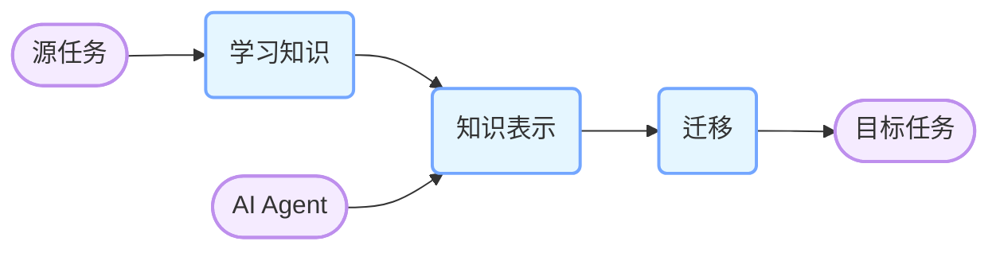

# AI Agent的迁移学习能力开发

> 关键词：AI Agent、迁移学习、能力开发、机器学习、模型训练、知识迁移、泛化能力

> 摘要：本文聚焦于AI Agent的迁移学习能力开发，旨在深入探讨迁移学习在AI Agent领域的重要性、原理、算法及实际应用。通过详细阐述核心概念、算法原理、数学模型等内容，结合项目实战案例，展示如何开发AI Agent的迁移学习能力。同时，介绍了相关的工具和资源，分析了未来发展趋势与挑战，为研究者和开发者提供全面且深入的技术参考，助力推动AI Agent在不同领域的高效应用和发展。

## 1. 背景介绍 
### 1.1 目的和范围
随着人工智能技术的飞速发展，AI Agent在众多领域得到了广泛应用。然而，传统的机器学习模型往往需要大量的标注数据进行训练，这不仅耗时费力，还限制了模型在新领域和新任务中的应用。迁移学习作为一种有效的解决方法，能够将在一个任务或领域中学习到的知识迁移到其他相关任务或领域中，从而减少数据需求，提高模型的训练效率和泛化能力。

本文的范围涵盖了AI Agent迁移学习能力开发的各个方面，包括核心概念、算法原理、数学模型、项目实战、实际应用场景以及相关工具和资源推荐等。旨在为读者提供一个全面且深入的技术指南，帮助他们理解和掌握AI Agent迁移学习能力开发的关键技术和方法。

### 1.2 预期读者
本文预期读者包括人工智能领域的研究者、开发者、数据科学家、机器学习工程师以及对AI Agent和迁移学习感兴趣的技术爱好者。无论您是初学者还是有一定经验的专业人士，都能从本文中获取有价值的信息和技术指导。

### 1.3 文档结构概述
本文将按照以下结构进行组织：
1. **背景介绍**：介绍本文的目的、范围、预期读者和文档结构概述，以及相关术语的定义和解释。
2. **核心概念与联系**：阐述AI Agent和迁移学习的核心概念，以及它们之间的联系，并通过文本示意图和Mermaid流程图进行直观展示。
3. **核心算法原理 & 具体操作步骤**：详细讲解迁移学习的核心算法原理，并使用Python源代码进行具体操作步骤的阐述。
4. **数学模型和公式 & 详细讲解 & 举例说明**：介绍迁移学习的数学模型和公式，并通过具体例子进行详细讲解。
5. **项目实战：代码实际案例和详细解释说明**：通过一个实际项目案例，展示AI Agent迁移学习能力开发的具体过程，包括开发环境搭建、源代码实现和代码解读。
6. **实际应用场景**：介绍AI Agent迁移学习能力在不同领域的实际应用场景。
7. **工具和资源推荐**：推荐相关的学习资源、开发工具框架和论文著作。
8. **总结：未来发展趋势与挑战**：总结AI Agent迁移学习能力开发的发展趋势和面临的挑战。
9. **附录：常见问题与解答**：解答读者在学习和实践过程中常见的问题。
10. **扩展阅读 & 参考资料**：提供相关的扩展阅读材料和参考资料。

### 1.4 术语表
#### 1.4.1 核心术语定义
- **AI Agent（人工智能代理）**：是一种能够感知环境、做出决策并采取行动以实现特定目标的智能实体。它可以是软件程序、机器人或其他智能设备。
- **迁移学习（Transfer Learning）**：是一种机器学习技术，旨在将在一个或多个源任务中学习到的知识迁移到目标任务中，从而提高目标任务的学习效率和性能。
- **源任务（Source Task）**：是指已经有大量标注数据并且模型已经在其上进行训练的任务。
- **目标任务（Target Task）**：是指需要应用迁移学习来提高性能的任务，通常目标任务的数据量较少。
- **特征迁移（Feature Transfer）**：是迁移学习的一种方法，通过提取源任务和目标任务的共同特征，将源任务的特征表示迁移到目标任务中。
- **模型迁移（Model Transfer）**：是指直接使用源任务中训练好的模型，在目标任务上进行微调或重新训练。

#### 1.4.2 相关概念解释
- **领域（Domain）**：是指数据的分布和特征空间。不同的领域可能具有不同的数据分布和特征表示。
- **泛化能力（Generalization Ability）**：是指模型在未见过的数据上的表现能力。迁移学习的一个重要目标是提高模型的泛化能力。
- **知识表示（Knowledge Representation）**：是指将知识以某种形式表示出来，以便计算机能够处理和理解。在迁移学习中，知识表示是实现知识迁移的关键。

#### 1.4.3 缩略词列表
- **ML（Machine Learning）**：机器学习
- **DL（Deep Learning）**：深度学习
- **CNN（Convolutional Neural Network）**：卷积神经网络
- **RNN（Recurrent Neural Network）**：循环神经网络
- **DNN（Deep Neural Network）**：深度神经网络

## 2. 核心概念与联系 

### 2.1 AI Agent的概念
AI Agent是一种能够感知环境、做出决策并采取行动以实现特定目标的智能实体。它通常由感知模块、决策模块和执行模块组成。感知模块负责收集环境信息，决策模块根据感知到的信息做出决策，执行模块则根据决策采取相应的行动。

### 2.2 迁移学习的概念
迁移学习是一种机器学习技术，旨在将在一个或多个源任务中学习到的知识迁移到目标任务中，从而提高目标任务的学习效率和性能。迁移学习的核心思想是利用源任务中已经学习到的知识，减少目标任务的训练数据需求和训练时间，同时提高目标任务的泛化能力。

### 2.3 AI Agent与迁移学习的联系
AI Agent在不同的环境和任务中可能需要不同的知识和技能。迁移学习可以帮助AI Agent快速适应新的环境和任务，通过将在一个任务中学习到的知识迁移到其他相关任务中，减少AI Agent在新任务中的学习成本和时间。例如，一个在图像分类任务中训练好的AI Agent可以通过迁移学习将其图像特征提取能力应用到图像检索、目标检测等相关任务中。

### 2.4 文本示意图
AI Agent的迁移学习过程可以用以下文本示意图表示：

```plaintext
源任务（大量标注数据） -- 学习知识 --> 知识表示 -- 迁移 --> 目标任务（少量标注数据）
                            |
                            v
                        AI Agent
```

### 2.5 Mermaid流程图


## 3. 核心算法原理 & 具体操作步骤 

### 3.1 特征迁移算法原理
特征迁移是迁移学习的一种重要方法，其核心思想是提取源任务和目标任务的共同特征，将源任务的特征表示迁移到目标任务中。常见的特征迁移算法包括主成分分析（PCA）、线性判别分析（LDA）等。

#### 3.1.1 主成分分析（PCA）原理
主成分分析是一种无监督学习算法，旨在找到数据的主成分，即数据中方差最大的方向。通过将数据投影到主成分上，可以实现数据的降维和特征提取。

PCA的具体步骤如下：
1. 对数据进行标准化处理，使数据的均值为0，方差为1。
2. 计算数据的协方差矩阵。
3. 求解协方差矩阵的特征值和特征向量。
4. 选择前k个最大特征值对应的特征向量，作为主成分。
5. 将数据投影到主成分上，得到降维后的数据。

#### 3.1.2 Python代码实现
```python
import numpy as np

def pca(X, k):
    # 数据标准化
    X_mean = np.mean(X, axis=0)
    X_std = np.std(X, axis=0)
    X = (X - X_mean) / X_std

    # 计算协方差矩阵
    cov_matrix = np.cov(X.T)

    # 求解协方差矩阵的特征值和特征向量
    eigenvalues, eigenvectors = np.linalg.eig(cov_matrix)

    # 选择前k个最大特征值对应的特征向量
    indices = np.argsort(eigenvalues)[::-1]
    top_k_eigenvectors = eigenvectors[:, indices[:k]]

    # 将数据投影到主成分上
    X_pca = np.dot(X, top_k_eigenvectors)

    return X_pca
```

### 3.2 模型迁移算法原理
模型迁移是指直接使用源任务中训练好的模型，在目标任务上进行微调或重新训练。常见的模型迁移方法包括微调预训练模型、冻结部分层等。

#### 3.2.1 微调预训练模型原理
微调预训练模型是一种常见的模型迁移方法，其核心思想是在源任务上训练好一个模型，然后在目标任务上对模型的部分或全部参数进行微调。通常，预训练模型的前几层学习到的是通用的特征，如边缘、纹理等，这些特征在不同的任务中具有一定的通用性。因此，可以冻结预训练模型的前几层，只对后面的几层进行微调。

#### 3.2.2 Python代码实现（以Keras为例）
```python
from tensorflow.keras.applications import VGG16
from tensorflow.keras.layers import Dense, Flatten
from tensorflow.keras.models import Model
from tensorflow.keras.optimizers import Adam

# 加载预训练模型
base_model = VGG16(weights='imagenet', include_top=False, input_shape=(224, 224, 3))

# 冻结预训练模型的前几层
for layer in base_model.layers[:10]:
    layer.trainable = False

# 添加自定义层
x = Flatten()(base_model.output)
x = Dense(256, activation='relu')(x)
predictions = Dense(10, activation='softmax')(x)

# 构建新模型
model = Model(inputs=base_model.input, outputs=predictions)

# 编译模型
model.compile(optimizer=Adam(lr=0.0001), loss='categorical_crossentropy', metrics=['accuracy'])
```

### 3.3 具体操作步骤
1. **数据准备**：收集源任务和目标任务的数据，并进行预处理，如数据清洗、标准化等。
2. **选择迁移学习方法**：根据任务的特点和数据的情况，选择合适的迁移学习方法，如特征迁移或模型迁移。
3. **提取特征或加载预训练模型**：如果选择特征迁移方法，需要提取源任务和目标任务的共同特征；如果选择模型迁移方法，需要加载源任务中训练好的预训练模型。
4. **调整模型结构**：根据目标任务的需求，调整模型的结构，如添加或删除某些层。
5. **训练模型**：在目标任务的数据上对模型进行训练，可以选择微调或重新训练。
6. **评估模型**：使用测试数据对训练好的模型进行评估，计算模型的性能指标，如准确率、召回率等。
7. **优化模型**：根据评估结果，对模型进行优化，如调整超参数、增加训练数据等。

## 4. 数学模型和公式 & 详细讲解 & 举例说明 

### 4.1 特征迁移的数学模型和公式
#### 4.1.1 协方差矩阵
假设有一个数据集 $X = [x_1, x_2, \cdots, x_n]^T$，其中 $x_i \in \mathbb{R}^d$ 表示第 $i$ 个样本，$n$ 表示样本数量，$d$ 表示特征维度。协方差矩阵 $S$ 定义为：
$$S = \frac{1}{n - 1} \sum_{i = 1}^{n} (x_i - \bar{x})(x_i - \bar{x})^T$$
其中 $\bar{x} = \frac{1}{n} \sum_{i = 1}^{n} x_i$ 表示样本的均值。

#### 4.1.2 特征值和特征向量
对于协方差矩阵 $S$，特征值 $\lambda$ 和特征向量 $v$ 满足以下方程：
$$Sv = \lambda v$$
其中 $\lambda$ 是特征值，$v$ 是对应的特征向量。

#### 4.1.3 主成分投影
假设选择前 $k$ 个最大特征值对应的特征向量 $V = [v_1, v_2, \cdots, v_k]$，其中 $v_i \in \mathbb{R}^d$ 表示第 $i$ 个特征向量。将数据 $X$ 投影到主成分上，得到降维后的数据 $Y$：
$$Y = XV$$

### 4.2 模型迁移的数学模型和公式
#### 4.2.1 损失函数
在模型迁移中，通常使用交叉熵损失函数来衡量模型的预测结果与真实标签之间的差异。对于多分类问题，交叉熵损失函数定义为：
$$L(y, \hat{y}) = - \sum_{i = 1}^{C} y_i \log(\hat{y}_i)$$
其中 $y = [y_1, y_2, \cdots, y_C]$ 是真实标签的 one-hot 编码，$\hat{y} = [\hat{y}_1, \hat{y}_2, \cdots, \hat{y}_C]$ 是模型的预测结果，$C$ 表示类别数量。

#### 4.2.2 梯度下降
在训练模型时，通常使用梯度下降算法来更新模型的参数。梯度下降算法的更新公式为：
$$\theta_{t + 1} = \theta_t - \alpha \nabla L(\theta_t)$$
其中 $\theta_t$ 表示第 $t$ 次迭代时的模型参数，$\alpha$ 表示学习率，$\nabla L(\theta_t)$ 表示损失函数 $L$ 关于参数 $\theta_t$ 的梯度。

### 4.3 举例说明
#### 4.3.1 特征迁移举例
假设我们有一个二维数据集 $X = \begin{bmatrix} 1 & 2 \\ 2 & 3 \\ 3 & 4 \\ 4 & 5 \end{bmatrix}$，我们希望使用 PCA 算法将其降维到一维。

1. **数据标准化**：
$$X_{mean} = \begin{bmatrix} 2.5 \\ 3.5 \end{bmatrix}$$
$$X_{std} = \begin{bmatrix} 1.291 \\ 1.291 \end{bmatrix}$$
$$X_{normalized} = \frac{X - X_{mean}}{X_{std}} = \begin{bmatrix} -1.162 & -1.162 \\ -0.388 & -0.388 \\ 0.388 & 0.388 \\ 1.162 & 1.162 \end{bmatrix}$$

2. **计算协方差矩阵**：
$$S = \frac{1}{3} \begin{bmatrix} -1.162 & -1.162 \\ -0.388 & -0.388 \\ 0.388 & 0.388 \\ 1.162 & 1.162 \end{bmatrix}^T \begin{bmatrix} -1.162 & -1.162 \\ -0.388 & -0.388 \\ 0.388 & 0.388 \\ 1.162 & 1.162 \end{bmatrix} = \begin{bmatrix} 0.667 & 0.667 \\ 0.667 & 0.667 \end{bmatrix}$$

3. **求解特征值和特征向量**：
特征值 $\lambda_1 = 1.333$，$\lambda_2 = 0$；对应的特征向量 $v_1 = \begin{bmatrix} 0.707 \\ 0.707 \end{bmatrix}$，$v_2 = \begin{bmatrix} -0.707 \\ 0.707 \end{bmatrix}$。

4. **选择主成分并投影**：
选择最大特征值对应的特征向量 $v_1$ 作为主成分，将数据投影到主成分上：
$$Y = X_{normalized} v_1 = \begin{bmatrix} -1.643 \\ -0.549 \\ 0.549 \\ 1.643 \end{bmatrix}$$

#### 4.3.2 模型迁移举例
假设我们有一个预训练的 VGG16 模型，我们希望将其迁移到一个新的图像分类任务中。我们可以冻结 VGG16 模型的前几层，只对后面的几层进行微调。

```python
from tensorflow.keras.applications import VGG16
from tensorflow.keras.layers import Dense, Flatten
from tensorflow.keras.models import Model
from tensorflow.keras.optimizers import Adam
from tensorflow.keras.datasets import cifar10
from tensorflow.keras.utils import to_categorical

# 加载预训练模型
base_model = VGG16(weights='imagenet', include_top=False,