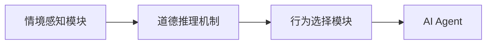

# AI Agent的道德决策框架：伦理AI实践

> 关键词：AI Agent、道德决策框架、伦理AI、实践、道德推理

> 摘要：本文聚焦于AI Agent的道德决策框架，深入探讨伦理AI的实践。首先介绍了研究的背景、目的、预期读者等信息，接着阐述了AI Agent、道德决策框架等核心概念及其联系，通过Python代码详细讲解了核心算法原理和具体操作步骤，给出了相关的数学模型和公式并举例说明。在项目实战部分，提供了开发环境搭建、源代码实现及解读。还探讨了AI Agent道德决策框架的实际应用场景，推荐了学习资源、开发工具框架和相关论文著作。最后总结了未来发展趋势与挑战，给出常见问题解答和扩展阅读参考资料，旨在为伦理AI的发展提供全面且深入的技术指导。

## 1. 背景介绍 
### 1.1 目的和范围
随着人工智能技术的飞速发展，AI Agent在各个领域的应用越来越广泛。然而，AI Agent的决策行为可能会对人类社会产生重大影响，因此确保其决策符合道德和伦理标准至关重要。本文的目的是构建一个AI Agent的道德决策框架，探讨伦理AI的实践方法。范围涵盖了核心概念的阐述、算法原理的分析、数学模型的建立、项目实战的展示以及实际应用场景的讨论等方面。

### 1.2 预期读者
本文预期读者包括人工智能领域的研究人员、开发者、伦理学家、政策制定者以及对伦理AI感兴趣的爱好者。研究人员可以从本文中获取新的研究思路和方法；开发者能够学习到如何在实际项目中实现AI Agent的道德决策；伦理学家可以从技术角度深入理解AI Agent的道德问题；政策制定者可以参考本文制定相关的政策和法规；爱好者则可以通过本文了解伦理AI的基本概念和实践方法。

### 1.3 文档结构概述
本文将按照以下结构展开：首先介绍背景信息，包括目的、预期读者和文档结构概述；接着阐述核心概念与联系，包括AI Agent、道德决策框架等；然后详细讲解核心算法原理和具体操作步骤，并给出Python代码示例；随后介绍数学模型和公式，并举例说明；在项目实战部分，将展示开发环境搭建、源代码实现和代码解读；之后探讨实际应用场景；再推荐相关的学习资源、开发工具框架和论文著作；最后总结未来发展趋势与挑战，给出常见问题解答和扩展阅读参考资料。

### 1.4 术语表
#### 1.4.1 核心术语定义
- **AI Agent**：能够感知环境、进行决策并采取行动的人工智能实体。它可以是软件程序、机器人等。
- **道德决策框架**：用于指导AI Agent在面对不同情境时做出符合道德和伦理标准的决策的体系。
- **伦理AI**：研究如何使人工智能系统的行为和决策符合道德和伦理原则的领域。

#### 1.4.2 相关概念解释
- **道德推理**：AI Agent根据道德原则和规则，对不同的行为选项进行评估和选择的过程。
- **道德准则**：一系列明确的道德规范和要求，用于约束AI Agent的行为。
- **情境感知**：AI Agent对所处环境的各种信息进行感知和理解的能力。

#### 1.4.3 缩略词列表
- **AI**：Artificial Intelligence，人工智能
- **ML**：Machine Learning，机器学习
- **DL**：Deep Learning，深度学习

## 2. 核心概念与联系 
### 核心概念原理
#### AI Agent
AI Agent是人工智能系统的基本组成部分，它具有感知、决策和行动的能力。AI Agent通过传感器感知环境信息，然后根据内部的决策机制进行决策，最后通过执行器采取行动。例如，一个自动驾驶汽车可以看作是一个AI Agent，它通过摄像头、雷达等传感器感知道路环境，根据预设的算法进行决策，如是否加速、减速、转弯等，最后通过控制汽车的动力系统和转向系统来执行决策。

#### 道德决策框架
道德决策框架是为了确保AI Agent的决策符合道德和伦理标准而设计的体系。它通常包括道德准则、道德推理机制和情境感知模块。道德准则是一系列明确的道德规范，如不伤害人类、公平公正等。道德推理机制根据道德准则和当前情境，对不同的行为选项进行评估和选择。情境感知模块负责收集和分析环境信息，为道德推理提供依据。

#### 伦理AI
伦理AI是研究如何使人工智能系统的行为和决策符合道德和伦理原则的领域。它关注的问题包括AI Agent的责任归属、隐私保护、公平性等。伦理AI的目标是在人工智能技术发展的同时，确保其不会对人类社会造成负面影响。

### 架构的文本示意图
```plaintext
            +----------------+
            |  情境感知模块  |
            +----------------+
                   |
                   v
            +----------------+
            |  道德推理机制  |
            +----------------+
                   |
                   v
            +----------------+
            |  行为选择模块  |
            +----------------+
                   |
                   v
            +----------------+
            |    AI Agent    |
            +----------------+
```

### Mermaid流程图


## 3. 核心算法原理 & 具体操作步骤 
### 核心算法原理
在AI Agent的道德决策框架中，核心算法原理主要涉及道德推理机制。这里我们采用基于规则的道德推理方法，即根据预设的道德准则对不同的行为选项进行评估。具体来说，我们为每个道德准则分配一个权重，然后计算每个行为选项在各个道德准则下的得分，最后根据得分选择最优的行为选项。

### 具体操作步骤
1. **定义道德准则和权重**：首先，我们需要定义一系列的道德准则，如不伤害人类、公平公正等，并为每个道德准则分配一个权重。权重表示该道德准则在决策中的重要程度。
2. **收集情境信息**：通过情境感知模块收集AI Agent所处环境的信息，如周围的人和物体的状态、行为选项等。
3. **计算行为选项的得分**：对于每个行为选项，根据道德准则和情境信息计算其在各个道德准则下的得分。得分可以通过预设的规则或机器学习模型来计算。
4. **综合得分计算**：将每个行为选项在各个道德准则下的得分乘以相应的权重，然后求和得到综合得分。
5. **选择最优行为选项**：选择综合得分最高的行为选项作为AI Agent的最终决策。

### Python源代码详细阐述
```python
# 定义道德准则和权重
moral_guidelines = {
    "do_no_harm": 0.5,
    "fairness": 0.3,
    "respect_privacy": 0.2
}

# 定义行为选项
action_options = [
    {"name": "action1", "do_no_harm_score": 0.8, "fairness_score": 0.6, "respect_privacy_score": 0.7},
    {"name": "action2", "do_no_harm_score": 0.6, "fairness_score": 0.8, "respect_privacy_score": 0.5},
    {"name": "action3", "do_no_harm_score": 0.7, "fairness_score": 0.7, "respect_privacy_score": 0.8}
]

# 计算每个行为选项的综合得分
for action in action_options:
    total_score = 0
    total_score += action["do_no_harm_score"] * moral_guidelines["do_no_harm"]
    total_score += action["fairness_score"] * moral_guidelines["fairness"]
    total_score += action["respect_privacy_score"] * moral_guidelines["respect_privacy"]
    action["total_score"] = total_score

# 选择综合得分最高的行为选项
best_action = max(action_options, key=lambda x: x["total_score"])

print("最优行为选项:", best_action["name"])
```

## 4. 数学模型和公式 & 详细讲解 & 举例说明 
### 数学模型和公式
设道德准则集合为 $G = \{g_1, g_2, \cdots, g_n\}$，对应的权重集合为 $W = \{w_1, w_2, \cdots, w_n\}$，其中 $\sum_{i=1}^{n} w_i = 1$。行为选项集合为 $A = \{a_1, a_2, \cdots, a_m\}$。对于行为选项 $a_j$，其在道德准则 $g_i$ 下的得分记为 $s_{ij}$。则行为选项 $a_j$ 的综合得分 $S_j$ 可以表示为：

$$S_j = \sum_{i=1}^{n} w_i \cdot s_{ij}$$

### 详细讲解
上述公式的含义是，行为选项的综合得分是其在各个道德准则下的得分乘以相应权重后的总和。权重表示该道德准则在决策中的重要程度，得分表示行为选项在该道德准则下的符合程度。通过综合得分的比较，我们可以选择最优的行为选项。

### 举例说明
假设我们有两个道德准则：不伤害人类（$g_1$），权重 $w_1 = 0.6$；公平公正（$g_2$），权重 $w_2 = 0.4$。有两个行为选项：$a_1$ 和 $a_2$。行为选项 $a_1$ 在不伤害人类准则下的得分 $s_{11} = 0.8$，在公平公正准则下的得分 $s_{21} = 0.6$；行为选项 $a_2$ 在不伤害人类准则下的得分 $s_{12} = 0.7$，在公平公正准则下的得分 $s_{22} = 0.8$。

则行为选项 $a_1$ 的综合得分 $S_1$ 为：

$$S_1 = w_1 \cdot s_{11} + w_2 \cdot s_{21} = 0.6 \times 0.8 + 0.4 \times 0.6 = 0.72$$

行为选项 $a_2$ 的综合得分 $S_2$ 为：

$$S_2 = w_1 \cdot s_{12} + w_2 \cdot s_{22} = 0.6 \times 0.7 + 0.4 \times 0.8 = 0.74$$

由于 $S_2 > S_1$，所以行为选项 $a_2$ 是最优的选择。

## 5. 项目实战：代码实际案例和详细解释说明 
### 5.1  开发环境搭建
#### 安装Python
首先，确保你已经安装了Python。可以从Python官方网站（https://www.python.org/downloads/）下载并安装适合你操作系统的Python版本。建议使用Python 3.6及以上版本。

#### 安装必要的库
在本项目中，我们只使用Python的内置库，因此不需要额外安装其他库。

### 5.2  源代码详细实现和代码解读
```python
# 定义道德准则和权重
moral_guidelines = {
    "do_no_harm": 0.5,
    "fairness": 0.3,
    "respect_privacy": 0.2
}

# 代码解读：定义了一个字典 moral_guidelines，其中键为道德准则的名称，值为该道德准则的权重。

# 定义行为选项
action_options = [
    {"name": "action1", "do_no_harm_score": 0.8, "fairness_score": 0.6, "respect_privacy_score": 0.7},
    {"name": "action2", "do_no_harm_score": 0.6, "fairness_score": 0.8, "respect_privacy_score": 0.5},
    {"name": "action3", "do_no_harm_score": 0.7, "fairness_score": 0.7, "respect_privacy_score": 0.8}
]

# 代码解读：定义了一个列表 action_options，其中每个元素是一个字典，表示一个行为选项。字典中包含行为选项的名称和在各个道德准则下的得分。

# 计算每个行为选项的综合得分
for action in action_options:
    total_score = 0
    total_score += action["do_no_harm_score"] * moral_guidelines["do_no_harm"]
    total_score += action["fairness_score"] * moral_guidelines["fairness"]
    total_score += action["respect_privacy_score"] * moral_guidelines["respect_privacy"]
    action["total_score"] = total_score

# 代码解读：遍历每个行为选项，根据道德准则的权重和该行为选项在各个道德准则下的得分，计算其综合得分，并将综合得分添加到行为选项的字典中。

# 选择综合得分最高的行为选项
best_action = max(action_options, key=lambda x: x["total_score"])

# 代码解读：使用 max 函数和 lambda 表达式选择综合得分最高的行为选项。

print("最优行为选项:", best_action["name"])
```

### 5.3  代码解读与分析
- **数据结构的选择**：使用字典和列表来存储道德准则、权重和行为选项，这种数据结构简单直观，易于操作。
- **算法复杂度**：计算综合得分的时间复杂度为 $O(m \cdot n)$，其中 $m$ 是行为选项的数量，$n$ 是道德准则的数量。选择最优行为选项的时间复杂度为 $O(m)$。
- **扩展性**：可以很容易地扩展道德准则和行为选项，只需要修改相应的字典和列表即可。同时，可以通过修改道德准则的权重来调整决策的侧重点。

## 6. 实际应用场景 
### 自动驾驶汽车
在自动驾驶汽车中，AI Agent需要在各种复杂的交通场景中做出决策，如是否刹车、是否变道等。道德决策框架可以帮助自动驾驶汽车在面对紧急情况时做出符合道德和伦理标准的决策。例如，当自动驾驶汽车面临不可避免的碰撞时，它可以根据道德准则选择对人类伤害最小的碰撞方式。

### 医疗诊断系统
医疗诊断系统中的AI Agent可以根据患者的症状和检查结果进行诊断和治疗建议。道德决策框架可以确保AI Agent的决策符合医疗伦理原则，如保护患者的隐私、避免过度治疗等。例如，在选择治疗方案时，AI Agent可以考虑患者的意愿和利益，同时遵循医疗行业的道德准则。

### 金融投资系统
金融投资系统中的AI Agent可以根据市场数据和投资者的风险偏好进行投资决策。道德决策框架可以帮助AI Agent避免不道德的投资行为，如内幕交易、操纵市场等。例如，AI Agent可以根据道德准则评估投资项目的合法性和可持续性，选择符合道德和伦理标准的投资项目。

## 7. 工具和资源推荐
### 7.1 学习资源推荐
#### 7.1.1 书籍推荐
- 《人工智能：一种现代的方法》：全面介绍了人工智能的基本概念、算法和应用，是人工智能领域的经典教材。
- 《伦理与信息技术》：探讨了信息技术中的伦理问题，包括AI Agent的道德决策等方面的内容。
- 《道德算法：如何让AI有正确的价值观》：介绍了如何为AI设计道德算法，使AI的决策符合道德和伦理标准。

#### 7.1.2 在线课程
- Coursera上的“人工智能基础”课程：由知名高校的教授授课，系统地介绍了人工智能的基础知识和技术。
- edX上的“伦理与技术”课程：探讨了技术发展中的伦理问题，包括AI的道德决策等内容。
- Udemy上的“Python人工智能实战”课程：通过实际项目讲解如何使用Python实现人工智能算法，包括道德决策框架的实现。

#### 7.1.3 技术博客和网站
- Medium上的AI相关博客：有很多AI领域的专家和开发者分享他们的研究成果和实践经验，包括伦理AI方面的内容。
- arXiv.org：一个预印本平台，提供了大量的AI研究论文，包括伦理AI的最新研究成果。
- AI Ethics Journal：专门关注人工智能伦理问题的学术期刊，发表了很多高质量的研究论文。

### 7.2 开发工具框架推荐
#### 7.2.1 IDE和编辑器
- PyCharm：一款专业的Python集成开发环境，提供了丰富的代码编辑、调试和测试功能，适合开发AI项目。
- Visual Studio Code：一款轻量级的代码编辑器，支持多种编程语言和插件，具有强大的扩展功能，可用于AI开发。
- Jupyter Notebook：一种交互式的开发环境，适合进行数据分析和模型开发，可方便地展示代码和结果。

#### 7.2.2 调试和性能分析工具
- pdb：Python的内置调试器，可以帮助开发者定位和解决代码中的问题。
- cProfile：Python的性能分析工具，可以分析代码的运行时间和资源消耗，帮助开发者优化代码性能。
- TensorBoard：TensorFlow的可视化工具，可以帮助开发者可视化模型的训练过程和性能指标。

#### 7.2.3 相关框架和库
- TensorFlow：一个开源的机器学习框架，提供了丰富的工具和库，可用于构建和训练各种AI模型。
- PyTorch：另一个流行的深度学习框架，具有动态图和易于使用的特点，适合进行研究和开发。
- scikit-learn：一个简单而高效的机器学习库，提供了各种机器学习算法和工具，可用于数据预处理、模型选择和评估等。

### 7.3 相关论文著作推荐
#### 7.3.1 经典论文
- “The Moral Machine Experiment”：该论文通过大规模的在线实验，研究了不同文化背景下人们对自动驾驶汽车道德决策的偏好。
- “Algorithmic Bias Detection and Mitigation: Best Practices and Policies to Reduce Consumer Harms”：探讨了算法偏见的检测和缓解方法，对于确保AI Agent的公平性具有重要意义。
- “Ethical Issues in Artificial Intelligence”：综述了人工智能中的伦理问题，包括道德决策、责任归属等方面的内容。

#### 7.3.2 最新研究成果
- 在arXiv.org上搜索“Ethical AI”可以找到很多关于伦理AI的最新研究论文，如关于道德推理算法的改进、AI Agent的责任模型等方面的研究。
- 顶级学术会议如NeurIPS、ICML等也会发表很多关于伦理AI的研究成果。

#### 7.3.3 应用案例分析
- 一些大型科技公司如Google、Microsoft等会发布关于AI伦理应用的案例分析报告，介绍他们在实际项目中如何应用伦理原则和道德决策框架。
- 行业报告和白皮书也会提供一些关于AI Agent道德决策在不同领域应用的案例分析。

## 8. 总结：未来发展趋势与挑战
### 未来发展趋势
- **多准则融合**：未来的道德决策框架将不仅仅考虑单一的道德准则，而是会融合多种道德准则和价值观，以应对更加复杂的现实场景。
- **机器学习与道德推理的结合**：利用机器学习技术来学习道德准则和人类的道德行为模式，提高AI Agent的道德推理能力。
- **跨领域合作**：伦理AI将与哲学、社会学、法学等多个领域进行更深入的合作，共同探讨和解决AI发展中的伦理问题。

### 挑战
- **道德准则的多样性**：不同的文化、宗教和个人对道德准则的理解和定义可能存在差异，如何在AI Agent的道德决策框架中兼顾这些多样性是一个挑战。
- **责任归属问题**：当AI Agent做出不道德的决策时，责任应该由谁来承担，是开发者、使用者还是AI Agent本身，这是一个复杂的法律和伦理问题。
- **数据隐私和安全**：在收集和使用数据来训练AI Agent的道德决策能力时，如何保护数据的隐私和安全是一个重要的挑战。

## 9. 附录：常见问题与解答
### 问题1：如何确定道德准则的权重？
答：道德准则的权重可以根据具体的应用场景和需求来确定。可以通过专家评估、用户调查等方式来获取不同道德准则的重要程度，然后根据这些信息来分配权重。

### 问题2：如果行为选项在某些道德准则下的得分难以确定怎么办？
答：可以采用模糊逻辑或机器学习的方法来处理这种情况。例如，可以使用模糊逻辑来表示得分的不确定性，或者使用机器学习模型来预测行为选项在道德准则下的得分。

### 问题3：道德决策框架是否会限制AI Agent的创新能力？
答：道德决策框架的目的是确保AI Agent的决策符合道德和伦理标准，而不是限制其创新能力。在符合道德准则的前提下，AI Agent仍然可以进行创新和探索。

## 10. 扩展阅读 & 参考资料
### 扩展阅读
- 《人工智能时代的伦理挑战与应对》：深入探讨了人工智能时代面临的伦理挑战和应对策略。
- 《科技伦理与人类未来》：从更宏观的角度讨论了科技发展与人类未来的关系，包括AI的伦理问题。

### 参考资料
- 相关学术论文和研究报告，如上述推荐的经典论文和最新研究成果。
- 行业标准和规范，如IEEE的AI伦理标准。

作者：AI天才研究院/AI Genius Institute & 禅与计算机程序设计艺术 /Zen And The Art of Computer Programming