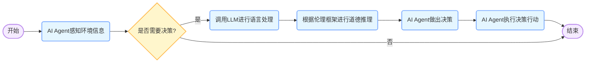

# AI Agent的道德决策：在LLM中植入伦理框架

> 关键词：AI Agent、道德决策、大语言模型（LLM）、伦理框架、人工智能伦理

> 摘要：本文围绕AI Agent的道德决策展开，深入探讨了在大语言模型（LLM）中植入伦理框架的相关问题。首先介绍了研究的背景、目的和范围，明确了预期读者和文档结构。接着阐述了AI Agent、道德决策、LLM以及伦理框架等核心概念及其联系，并通过文本示意图和Mermaid流程图进行了直观展示。详细讲解了实现道德决策的核心算法原理，结合Python源代码给出具体操作步骤。同时，给出了相关的数学模型和公式，并举例说明。通过项目实战，展示了在LLM中植入伦理框架的代码实际案例及详细解释。分析了其实际应用场景，推荐了学习、开发所需的工具和资源，包括书籍、在线课程、开发工具框架、相关论文著作等。最后总结了未来发展趋势与挑战，解答了常见问题，并提供了扩展阅读和参考资料，旨在为研究和实践AI Agent的道德决策提供全面且深入的指导。

## 1. 背景介绍 

### 1.1 目的和范围
随着人工智能技术的飞速发展，AI Agent在各个领域的应用越来越广泛。然而，AI Agent的决策过程往往缺乏道德考量，可能会导致一些不良后果，如侵犯用户隐私、加剧社会不平等、传播虚假信息等。因此，如何让AI Agent做出符合道德规范的决策成为了当前人工智能领域的一个重要研究课题。

本文的目的是探讨在大语言模型（LLM）中植入伦理框架的方法和技术，以实现AI Agent的道德决策。具体范围包括核心概念的介绍、算法原理的讲解、数学模型的构建、项目实战案例的分析以及实际应用场景的探讨等。

### 1.2 预期读者
本文预期读者包括人工智能领域的研究人员、开发者、伦理学家、政策制定者以及对AI Agent道德决策感兴趣的广大读者。对于研究人员，本文可以为他们的研究提供理论和技术参考；对于开发者，本文可以帮助他们在实际项目中实现AI Agent的道德决策；对于伦理学家和政策制定者，本文可以为他们制定相关伦理准则和政策提供依据；对于普通读者，本文可以帮助他们了解AI Agent道德决策的重要性和相关技术。

### 1.3 文档结构概述
本文将按照以下结构进行组织：
1. **背景介绍**：介绍研究的目的、范围、预期读者和文档结构。
2. **核心概念与联系**：阐述AI Agent、道德决策、LLM以及伦理框架等核心概念，并展示它们之间的联系。
3. **核心算法原理 & 具体操作步骤**：详细讲解实现道德决策的核心算法原理，并结合Python源代码给出具体操作步骤。
4. **数学模型和公式 & 详细讲解 & 举例说明**：给出相关的数学模型和公式，并通过具体例子进行说明。
5. **项目实战：代码实际案例和详细解释说明**：通过一个实际项目案例，展示在LLM中植入伦理框架的代码实现和详细解释。
6. **实际应用场景**：分析AI Agent道德决策在不同领域的实际应用场景。
7. **工具和资源推荐**：推荐学习和开发所需的工具和资源，包括书籍、在线课程、开发工具框架、相关论文著作等。
8. **总结：未来发展趋势与挑战**：总结AI Agent道德决策的未来发展趋势和面临的挑战。
9. **附录：常见问题与解答**：解答读者在阅读过程中可能遇到的常见问题。
10. **扩展阅读 & 参考资料**：提供相关的扩展阅读和参考资料。

### 1.4 术语表
#### 1.4.1 核心术语定义
- **AI Agent**：人工智能代理，是一种能够感知环境、做出决策并采取行动的智能实体。
- **道德决策**：在面临多种选择时，根据道德原则和价值观做出的决策。
- **大语言模型（LLM）**：一种基于深度学习的自然语言处理模型，能够处理和生成自然语言文本。
- **伦理框架**：一套用于指导行为的道德原则和规范。

#### 1.4.2 相关概念解释
- **人工智能伦理**：研究人工智能技术在开发、应用过程中涉及的伦理问题和道德准则的学科。
- **道德推理**：运用道德原则和价值观进行思考和判断的过程。
- **强化学习**：一种机器学习方法，通过智能体与环境的交互，根据环境反馈的奖励信号来学习最优策略。

#### 1.4.3 缩略词列表
- **LLM**：大语言模型（Large Language Model）
- **AI**：人工智能（Artificial Intelligence）

## 2. 核心概念与联系 

### 核心概念原理
#### AI Agent
AI Agent是人工智能系统中的一个重要概念，它可以看作是一个具有自主性、反应性、社会性和主动性的智能实体。AI Agent能够感知周围环境的信息，根据这些信息进行推理和决策，并采取相应的行动来实现特定的目标。例如，在智能客服系统中，AI Agent可以通过与用户的对话，理解用户的需求，并提供相应的解决方案。

#### 道德决策
道德决策是指在面临多种选择时，根据道德原则和价值观做出的决策。道德决策的过程通常涉及到对不同行为的后果进行评估，权衡各种利益和风险，并选择符合道德标准的行为。在AI Agent的应用中，道德决策意味着AI Agent在做出决策时要考虑到道德因素，避免做出不道德的行为。

#### 大语言模型（LLM）
大语言模型是基于深度学习技术的自然语言处理模型，它通过在大规模的文本数据上进行训练，学习语言的模式和规律，从而能够处理和生成自然语言文本。LLM具有强大的语言理解和生成能力，可以用于问答系统、文本生成、机器翻译等多个领域。

#### 伦理框架
伦理框架是一套用于指导行为的道德原则和规范。在AI Agent的道德决策中，伦理框架可以为AI Agent提供决策的依据和准则，确保AI Agent的行为符合道德要求。常见的伦理框架包括功利主义、义务论、美德伦理学等。

### 架构的文本示意图
```plaintext
AI Agent
|
|-- 感知模块（获取环境信息）
|
|-- 决策模块（基于伦理框架和LLM进行道德决策）
|
|-- 行动模块（执行决策结果）

伦理框架
|
|-- 道德原则和规范
|
|-- 与LLM交互，为决策提供指导

LLM
|
|-- 语言理解和生成能力
|
|-- 为决策模块提供语言处理支持
```

### Mermaid流程图


从流程图可以看出，AI Agent首先感知环境信息，然后判断是否需要做出决策。如果需要决策，AI Agent会调用LLM进行语言处理，结合伦理框架进行道德推理，最终做出决策并执行行动。

## 3. 核心算法原理 & 具体操作步骤 

### 核心算法原理
在LLM中植入伦理框架以实现AI Agent的道德决策，主要涉及到以下几个核心算法：

#### 文本分类算法
文本分类算法用于将输入的文本分类到不同的类别中。在道德决策中，可以使用文本分类算法将用户的输入文本分类到不同的道德场景中，例如隐私保护、公平性、诚实性等。常见的文本分类算法包括朴素贝叶斯分类器、支持向量机、深度学习模型等。

#### 道德推理算法
道德推理算法用于根据伦理框架和文本分类结果进行道德推理。它可以评估不同行为的道德合理性，并选择最优的道德决策。道德推理算法可以基于规则、基于案例或基于机器学习的方法实现。

#### 强化学习算法
强化学习算法用于训练AI Agent在不同的环境中学习最优的道德决策策略。通过与环境的交互，AI Agent根据环境反馈的奖励信号来调整自己的行为，以最大化长期奖励。

### 具体操作步骤

#### 步骤1：数据收集与预处理
首先，需要收集大量的文本数据，包括不同道德场景下的问题和对应的道德决策。对这些数据进行预处理，包括清洗、分词、标注等操作，以便后续的模型训练。

```python
import pandas as pd
import re
import nltk
from nltk.corpus import stopwords
from nltk.tokenize import word_tokenize

# 下载停用词
nltk.download('stopwords')
nltk.download('punkt')

# 读取数据
data = pd.read_csv('moral_data.csv')

# 清洗文本
def clean_text(text):
    text = re.sub(r'[^a-zA-Z]', ' ', text)
    text = text.lower()
    tokens = word_tokenize(text)
    stop_words = set(stopwords.words('english'))
    filtered_tokens = [token for token in tokens if token not in stop_words]
    cleaned_text = ' '.join(filtered_tokens)
    return cleaned_text

data['cleaned_text'] = data['text'].apply(clean_text)
```

#### 步骤2：文本分类模型训练
使用预处理后的数据训练文本分类模型，将输入的文本分类到不同的道德场景中。

```python
from sklearn.feature_extraction.text import TfidfVectorizer
from sklearn.naive_bayes import MultinomialNB
from sklearn.model_selection import train_test_split
from sklearn.metrics import accuracy_score

# 提取特征
vectorizer = TfidfVectorizer()
X = vectorizer.fit_transform(data['cleaned_text'])
y = data['label']

# 划分训练集和测试集
X_train, X_test, y_train, y_test = train_test_split(X, y, test_size=0.2, random_state=42)

# 训练文本分类模型
model = MultinomialNB()
model.fit(X_train, y_train)

# 评估模型
y_pred = model.predict(X_test)
accuracy = accuracy_score(y_test, y_pred)
print(f"文本分类模型准确率: {accuracy}")
```

#### 步骤3：道德推理实现
根据文本分类结果和伦理框架进行道德推理，选择最优的道德决策。

```python
# 定义伦理框架规则
ethical_framework = {
    'privacy': '保护用户隐私',
    'fairness': '确保公平性',
    'honesty': '保持诚实'
}

# 道德推理函数
def moral_reasoning(category):
    if category in ethical_framework:
        return ethical_framework[category]
    else:
        return '无明确道德决策'

# 示例输入
input_text = "用户询问个人信息是否会被泄露"
cleaned_input = clean_text(input_text)
input_vector = vectorizer.transform([cleaned_input])
category = model.predict(input_vector)[0]
decision = moral_reasoning(category)
print(f"输入文本分类结果: {category}")
print(f"道德决策结果: {decision}")
```

#### 步骤4：强化学习训练（可选）
如果需要进一步优化AI Agent的道德决策策略，可以使用强化学习算法进行训练。

```python
import gym
import numpy as np
from stable_baselines3 import PPO

# 定义一个简单的道德决策环境
class MoralDecisionEnv(gym.Env):
    def __init__(self):
        super(MoralDecisionEnv, self).__init__()
        self.action_space = gym.spaces.Discrete(2)  # 两个动作：道德行为和不道德行为
        self.observation_space = gym.spaces.Box(low=0, high=1, shape=(1,))

    def step(self, action):
        if action == 0:  # 道德行为
            reward = 1
        else:  # 不道德行为
            reward = -1
        done = True
        info = {}
        return np.array([0]), reward, done, info

    def reset(self):
        return np.array([0])

# 创建环境
env = MoralDecisionEnv()

# 训练强化学习模型
model = PPO('MlpPolicy', env, verbose=1)
model.learn(total_timesteps=10000)
```

## 4. 数学模型和公式 & 详细讲解 & 举例说明 

### 文本分类的数学模型
在文本分类中，常用的数学模型是朴素贝叶斯分类器。朴素贝叶斯分类器基于贝叶斯定理，通过计算文本属于不同类别的概率来进行分类。

#### 贝叶斯定理
贝叶斯定理的公式为：
$$P(C|X)=\frac{P(X|C)P(C)}{P(X)}$$
其中，$P(C|X)$ 表示在给定文本 $X$ 的情况下，文本属于类别 $C$ 的概率；$P(X|C)$ 表示在类别 $C$ 下出现文本 $X$ 的概率；$P(C)$ 表示类别 $C$ 出现的先验概率；$P(X)$ 表示文本 $X$ 出现的概率。

#### 朴素贝叶斯假设
朴素贝叶斯分类器假设文本中的每个特征（词）是相互独立的，即：
$$P(X|C)=\prod_{i=1}^{n}P(x_i|C)$$
其中，$x_i$ 表示文本 $X$ 中的第 $i$ 个特征。

#### 分类决策规则
朴素贝叶斯分类器的分类决策规则是选择概率最大的类别作为文本的分类结果，即：
$$\hat{C}=\arg\max_{C}P(C|X)=\arg\max_{C}\frac{P(X|C)P(C)}{P(X)}=\arg\max_{C}P(X|C)P(C)$$

### 举例说明
假设有两个类别：$C_1$（隐私保护）和 $C_2$（公平性），文本 $X$ 包含三个词：$x_1$、$x_2$、$x_3$。

已知：
- $P(C_1)=0.6$，$P(C_2)=0.4$
- $P(x_1|C_1)=0.2$，$P(x_2|C_1)=0.3$，$P(x_3|C_1)=0.1$
- $P(x_1|C_2)=0.1$，$P(x_2|C_2)=0.2$，$P(x_3|C_2)=0.3$

首先计算 $P(X|C_1)$ 和 $P(X|C_2)$：
$$P(X|C_1)=P(x_1|C_1)P(x_2|C_1)P(x_3|C_1)=0.2\times0.3\times0.1 = 0.006$$
$$P(X|C_2)=P(x_1|C_2)P(x_2|C_2)P(x_3|C_2)=0.1\times0.2\times0.3 = 0.006$$

然后计算 $P(X|C_1)P(C_1)$ 和 $P(X|C_2)P(C_2)$：
$$P(X|C_1)P(C_1)=0.006\times0.6 = 0.0036$$
$$P(X|C_2)P(C_2)=0.006\times0.4 = 0.0024$$

由于 $P(X|C_1)P(C_1)>P(X|C_2)P(C_2)$，所以文本 $X$ 被分类到类别 $C_1$（隐私保护）。

### 强化学习的数学模型
在强化学习中，常用的数学模型是马尔可夫决策过程（MDP）。

#### 马尔可夫决策过程定义
马尔可夫决策过程可以用一个五元组 $(S, A, P, R, \gamma)$ 表示，其中：
- $S$ 是状态空间，表示环境的所有可能状态。
- $A$ 是动作空间，表示智能体可以采取的所有动作。
- $P$ 是状态转移概率函数，表示在状态 $s$ 下采取动作 $a$ 后转移到状态 $s'$ 的概率，即 $P(s'|s, a)$。
- $R$ 是奖励函数，表示在状态 $s$ 下采取动作 $a$ 后获得的奖励，即 $R(s, a)$。
- $\gamma$ 是折扣因子，用于权衡当前奖励和未来奖励，取值范围为 $[0, 1]$。

#### 价值函数
在强化学习中，常用的价值函数有状态价值函数 $V(s)$ 和动作价值函数 $Q(s, a)$。

状态价值函数 $V(s)$ 表示从状态 $s$ 开始，遵循策略 $\pi$ 所能获得的期望累积折扣奖励，即：
$$V^{\pi}(s)=\mathbb{E}_{\pi}\left[\sum_{t=0}^{\infty}\gamma^{t}R(s_t, a_t)|s_0 = s\right]$$

动作价值函数 $Q(s, a)$ 表示在状态 $s$ 下采取动作 $a$，然后遵循策略 $\pi$ 所能获得的期望累积折扣奖励，即：
$$Q^{\pi}(s, a)=\mathbb{E}_{\pi}\left[\sum_{t=0}^{\infty}\gamma^{t}R(s_t, a_t)|s_0 = s, a_0 = a\right]$$

#### 策略优化
强化学习的目标是找到一个最优策略 $\pi^*$，使得价值函数最大。常用的策略优化算法有深度Q网络（DQN）、近端策略优化（PPO）等。

### 举例说明
假设有一个简单的道德决策环境，状态空间 $S = \{s_0\}$，动作空间 $A = \{a_0, a_1\}$（$a_0$ 表示道德行为，$a_1$ 表示不道德行为）。

奖励函数 $R$ 定义为：
- $R(s_0, a_0) = 1$
- $R(s_0, a_1) = -1$

折扣因子 $\gamma = 0.9$。

使用近端策略优化（PPO）算法训练智能体，智能体的目标是学习到在状态 $s_0$ 下选择动作 $a_0$ 以获得最大的累积折扣奖励。

## 5. 项目实战：代码实际案例和详细解释说明 

### 5.1  开发环境搭建
#### 安装Python
首先，需要安装Python 3.x版本。可以从Python官方网站（https://www.python.org/downloads/）下载并安装适合自己操作系统的Python版本。

#### 创建虚拟环境
为了避免不同项目之间的依赖冲突，建议使用虚拟环境。可以使用 `venv` 模块创建虚拟环境：
```bash
python -m venv ai_agent_moral_env
```
激活虚拟环境：
- 在Windows上：
```bash
ai_agent_moral_env\Scripts\activate
```
- 在Linux/Mac上：
```bash
source ai_agent_moral_env/bin/activate
```

#### 安装依赖库
在虚拟环境中安装项目所需的依赖库：
```bash
pip install pandas scikit-learn nltk gym stable_baselines3
```

### 5.2  源代码详细实现和代码解读
以下是一个完整的项目实战代码示例，包括数据预处理、文本分类模型训练、道德推理和强化学习训练。

```python
import pandas as pd
import re
import nltk
from nltk.corpus import stopwords
from nltk.tokenize import word_tokenize
from sklearn.feature_extraction.text import TfidfVectorizer
from sklearn.naive_bayes import MultinomialNB
from sklearn.model_selection import train_test_split
from sklearn.metrics import accuracy_score
import gym
import numpy as np
from stable_baselines3 import PPO

# 下载停用词
nltk.download('stopwords')
nltk.download('punkt')

# 读取数据
data = pd.read_csv('moral_data.csv')

# 清洗文本
def clean_text(text):
    text = re.sub(r'[^a-zA-Z]', ' ', text)
    text = text.lower()
    tokens = word_tokenize(text)
    stop_words = set(stopwords.words('english'))
    filtered_tokens = [token for token in tokens if token not in stop_words]
    cleaned_text = ' '.join(filtered_tokens)
    return cleaned_text

data['cleaned_text'] = data['text'].apply(clean_text)

# 提取特征
vectorizer = TfidfVectorizer()
X = vectorizer.fit_transform(data['cleaned_text'])
y = data['label']

# 划分训练集和测试集
X_train, X_test, y_train, y_test = train_test_split(X, y, test_size=0.2, random_state=42)

# 训练文本分类模型
model = MultinomialNB()
model.fit(X_train, y_train)

# 评估模型
y_pred = model.predict(X_test)
accuracy = accuracy_score(y_test, y_pred)
print(f"文本分类模型准确率: {accuracy}")

# 定义伦理框架规则
ethical_framework = {
    'privacy': '保护用户隐私',
    'fairness': '确保公平性',
    'honesty': '保持诚实'
}

# 道德推理函数
def moral_reasoning(category):
    if category in ethical_framework:
        return ethical_framework[category]
    else:
        return '无明确道德决策'

# 示例输入
input_text = "用户询问个人信息是否会被泄露"
cleaned_input = clean_text(input_text)
input_vector = vectorizer.transform([cleaned_input])
category = model.predict(input_vector)[0]
decision = moral_reasoning(category)
print(f"输入文本分类结果: {category}")
print(f"道德决策结果: {decision}")

# 定义一个简单的道德决策环境
class MoralDecisionEnv(gym.Env):
    def __init__(self):
        super(MoralDecisionEnv, self).__init__()
        self.action_space = gym.spaces.Discrete(2)  # 两个动作：道德行为和不道德行为
        self.observation_space = gym.spaces.Box(low=0, high=1, shape=(1,))

    def step(self, action):
        if action == 0:  # 道德行为
            reward = 1
        else:  # 不道德行为
            reward = -1
        done = True
        info = {}
        return np.array([0]), reward, done, info

    def reset(self):
        return np.array([0])

# 创建环境
env = MoralDecisionEnv()

# 训练强化学习模型
model = PPO('MlpPolicy', env, verbose=1)
model.learn(total_timesteps=10000)
```

### 5.3  代码解读与分析
#### 数据预处理部分
- `clean_text` 函数用于清洗文本，去除非字母字符，将文本转换为小写，并去除停用词。
- 使用 `TfidfVectorizer` 提取文本特征，将文本转换为向量表示。

#### 文本分类模型训练部分
- 使用 `MultinomialNB` 训练朴素贝叶斯分类器，将输入的文本分类到不同的道德场景中。
- 使用 `train_test_split` 划分训练集和测试集，并使用 `accuracy_score` 评估模型的准确率。

#### 道德推理部分
- 定义了一个简单的伦理框架 `ethical_framework`，包含不同道德场景对应的道德决策。
- `moral_reasoning` 函数根据文本分类结果选择相应的道德决策。

#### 强化学习训练部分
- 定义了一个简单的道德决策环境 `MoralDecisionEnv`，包含状态空间、动作空间、状态转移和奖励函数。
- 使用 `PPO` 算法训练强化学习模型，智能体在环境中学习最优的道德决策策略。

## 6. 实际应用场景 
### 智能客服系统
在智能客服系统中，AI Agent需要与用户进行交互，回答用户的问题并提供解决方案。在这个过程中，AI Agent可能会遇到一些涉及道德问题的情况，例如用户询问个人信息的使用情况、对服务的公平性提出质疑等。通过在LLM中植入伦理框架，AI Agent可以做出符合道德规范的决策，保护用户的隐私，确保服务的公平性。

### 自动驾驶汽车
自动驾驶汽车在行驶过程中需要做出各种决策，例如是否避让行人、是否遵守交通规则等。这些决策不仅涉及到技术问题，还涉及到道德问题。例如，当自动驾驶汽车面临不可避免的碰撞时，应该优先保护车内乘客还是行人？通过在LLM中植入伦理框架，自动驾驶汽车可以在决策过程中考虑到道德因素，做出更加合理和负责任的决策。

### 金融服务领域
在金融服务领域，AI Agent可以用于风险评估、投资建议等方面。在这个过程中，AI Agent需要确保决策的公平性和透明度，避免对某些群体造成歧视。例如，在贷款审批过程中，AI Agent不能因为申请人的性别、种族等因素而做出不公平的决策。通过在LLM中植入伦理框架，AI Agent可以更好地遵守金融行业的道德规范，保护消费者的权益。

### 医疗保健领域
在医疗保健领域，AI Agent可以用于疾病诊断、治疗方案推荐等方面。在这个过程中，AI Agent需要考虑到患者的隐私和权益，确保决策的安全性和有效性。例如，在处理患者的医疗数据时，AI Agent需要严格遵守相关的隐私法规，保护患者的个人信息。通过在LLM中植入伦理框架，AI Agent可以更好地服务于患者，提高医疗保健的质量和效率。

## 7. 工具和资源推荐

### 7.1 学习资源推荐
#### 7.1.1 书籍推荐
- 《人工智能伦理》：这本书全面介绍了人工智能领域的伦理问题和道德准则，包括隐私保护、公平性、责任性等方面。
- 《Python自然语言处理》：该书详细介绍了Python在自然语言处理领域的应用，包括文本分类、情感分析、机器翻译等技术。
- 《强化学习：原理与Python实现》：这本书系统地介绍了强化学习的基本原理和算法，并通过Python代码进行了实现和演示。

#### 7.1.2 在线课程
- Coursera上的“人工智能伦理学”课程：该课程由知名学者授课，深入探讨了人工智能伦理的各个方面。
- edX上的“自然语言处理基础”课程：提供了自然语言处理的基础知识和实践技能。
- Udemy上的“强化学习实战”课程：通过实际项目案例，帮助学习者掌握强化学习的应用。

#### 7.1.3 技术博客和网站
- Towards Data Science：一个专注于数据科学和人工智能的技术博客，提供了大量的优质文章和教程。
- OpenAI官方博客：OpenAI发布最新研究成果和技术动态的平台。
- arXiv：一个预印本数据库，包含了大量的人工智能领域的研究论文。

### 7.2 开发工具框架推荐
#### 7.2.1 IDE和编辑器
- PyCharm：一款功能强大的Python集成开发环境，提供了代码编辑、调试、版本控制等功能。
- Jupyter Notebook：一个交互式的开发环境，适合进行数据探索和模型实验。
- Visual Studio Code：一款轻量级的代码编辑器，支持多种编程语言和插件扩展。

#### 7.2.2 调试和性能分析工具
- Py-Spy：一个Python性能分析工具，可以帮助开发者找出代码中的性能瓶颈。
- PDB：Python自带的调试器，用于调试Python代码。
- TensorBoard：一个用于可视化深度学习模型训练过程的工具。

#### 7.2.3 相关框架和库
- Scikit-learn：一个常用的机器学习库，提供了各种机器学习算法和工具。
- PyTorch：一个开源的深度学习框架，具有高效的计算性能和灵活的编程接口。
- Hugging Face Transformers：一个用于自然语言处理的开源库，提供了预训练的大语言模型和相关工具。

### 7.3 相关论文著作推荐
#### 7.3.1 经典论文
- “The Ethical Algorithm: The Science of Socially Aware Algorithm Design”：该论文探讨了如何设计具有社会意识的算法，以解决人工智能领域的伦理问题。
- “Machine Learning and the Cost of Fairness”：研究了机器学习算法中公平性和准确性之间的权衡问题。
- “Deep Reinforcement Learning: An Overview”：对深度强化学习的基本原理和算法进行了全面的综述。

#### 7.3.2 最新研究成果
- 在arXiv上搜索“AI ethics”和“Moral decision-making in AI”等关键词，可以找到最新的研究成果。
- 参加人工智能领域的学术会议，如NeurIPS、ICML等，了解最新的研究动态。

#### 7.3.3 应用案例分析
- “Ethical Considerations in the Use of Artificial Intelligence in Healthcare”：分析了人工智能在医疗保健领域的应用中涉及的伦理问题和案例。
- “The Ethical Challenges of Autonomous Vehicles”：探讨了自动驾驶汽车面临的伦理挑战和解决方案。

## 8. 总结：未来发展趋势与挑战

### 未来发展趋势
#### 更加复杂的伦理框架
随着人工智能技术的不断发展，AI Agent面临的道德场景将越来越复杂。未来的伦理框架需要考虑更多的因素，如文化差异、社会价值观的变化等，以适应不同的应用场景。

#### 多模态融合的道德决策
目前的研究主要集中在文本数据上，未来的AI Agent将需要处理更多类型的数据，如图像、音频、视频等。因此，需要研究多模态融合的道德决策方法，以提高AI Agent的道德决策能力。

#### 人类与AI Agent的协作决策
未来，人类将与AI Agent更加紧密地协作。在决策过程中，人类和AI Agent可以相互补充，共同做出更加合理和道德的决策。因此，需要研究人类与AI Agent的协作决策机制，提高决策的质量和效率。

### 面临的挑战
#### 伦理标准的多样性
不同的文化、宗教和社会群体可能有不同的伦理标准和价值观。在设计伦理框架时，如何平衡这些多样性是一个巨大的挑战。

#### 道德推理的复杂性
道德推理是一个复杂的过程，涉及到对不同行为的后果进行评估、权衡各种利益和风险等。如何在AI Agent中实现高效、准确的道德推理是一个亟待解决的问题。

#### 数据隐私和安全问题
在训练AI Agent的道德决策能力时，需要大量的数据。这些数据可能包含用户的敏感信息，如何保护数据的隐私和安全是一个重要的挑战。

## 9. 附录：常见问题与解答

### 问题1：在LLM中植入伦理框架会影响模型的性能吗？
解答：在一定程度上，植入伦理框架可能会对模型的性能产生影响。因为伦理框架会对模型的决策进行约束，限制模型的选择范围。但是，如果设计合理，伦理框架可以帮助模型做出更加合理和负责任的决策，提高模型的可靠性和可解释性。

### 问题2：如何评估AI Agent的道德决策能力？
解答：评估AI Agent的道德决策能力是一个复杂的问题。可以从以下几个方面进行评估：
- 准确性：评估AI Agent的决策是否符合道德原则和规范。
- 一致性：评估AI Agent在不同场景下的决策是否一致。
- 可解释性：评估AI Agent的决策过程是否可以被解释和理解。

### 问题3：伦理框架可以完全解决AI Agent的道德问题吗？
解答：伦理框架可以为AI Agent的决策提供指导和约束，但不能完全解决AI Agent的道德问题。因为道德问题往往是复杂和多变的，伦理框架可能无法涵盖所有的情况。此外，伦理框架的实施还需要考虑到人类的因素，如开发者的价值观、用户的需求等。

## 10. 扩展阅读 & 参考资料
### 扩展阅读
- 《人工智能时代的人类责任》
- 《智能机器时代的伦理困境与对策》

### 参考资料
- Floridi, L., & Cowls, J. (2019). AI 4 people—an ethical framework for a good AI society: Opportunities, risks, principles, and recommendations. Minds and Machines, 29(4), 689-707.
- Bostrom, N., & Yudkowsky, E. (2014). The ethics of artificial intelligence. In The Cambridge Handbook of Artificial Intelligence (pp. 316-334). Cambridge University Press.
- Goodfellow, I. J., Bengio, Y., & Courville, A. (2016). Deep learning. MIT press.

作者：AI天才研究院/AI Genius Institute & 禅与计算机程序设计艺术 /Zen And The Art of Computer Programming