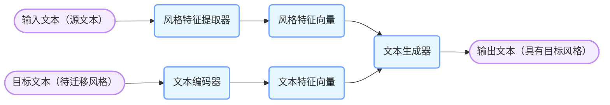

# AI Agent的风格迁移：让LLM适应不同的表达方式

> 关键词：AI Agent、风格迁移、大语言模型（LLM）、表达方式、自然语言处理

> 摘要：本文聚焦于AI Agent的风格迁移，旨在探讨如何使大语言模型（LLM）适应不同的表达方式。首先介绍了该主题的背景，包括目的、预期读者、文档结构和相关术语。接着阐述了核心概念与联系，通过文本示意图和Mermaid流程图呈现。详细讲解了核心算法原理及具体操作步骤，结合Python源代码进行说明。引入数学模型和公式，并举例说明。通过项目实战展示代码实际案例并进行详细解释。分析了实际应用场景，推荐了相关工具和资源。最后总结了未来发展趋势与挑战，提供了常见问题解答和扩展阅读参考资料，帮助读者全面了解AI Agent风格迁移的技术要点和应用前景。

## 1. 背景介绍 
### 1.1 目的和范围
在自然语言处理领域，大语言模型（LLM）已经取得了显著的进展，但在实际应用中，单一的表达方式往往不能满足多样化的需求。AI Agent的风格迁移旨在让LLM能够根据不同的场景和用户需求，灵活地调整表达方式，从而更好地与用户进行交互。本文章的范围涵盖了AI Agent风格迁移的基本概念、核心算法、数学模型、项目实战以及实际应用场景等方面，旨在为读者提供一个全面的技术视角。

### 1.2 预期读者
本文预期读者包括自然语言处理领域的研究人员、开发人员、对AI技术感兴趣的爱好者以及希望将AI Agent应用于实际业务的企业人员。无论您是初学者还是有一定经验的专业人士，都能从本文中获得有价值的信息。

### 1.3 文档结构概述
本文将按照以下结构进行组织：首先介绍核心概念与联系，包括风格迁移的原理和架构；接着详细讲解核心算法原理及具体操作步骤，并给出Python源代码；然后引入数学模型和公式，通过举例说明其应用；之后进行项目实战，展示代码实际案例并进行详细解释；分析实际应用场景；推荐相关的工具和资源；最后总结未来发展趋势与挑战，提供常见问题解答和扩展阅读参考资料。

### 1.4 术语表
#### 1.4.1 核心术语定义
- **AI Agent**：人工智能代理，是一种能够感知环境、做出决策并采取行动的智能实体，在自然语言处理中，AI Agent可以理解和生成自然语言。
- **风格迁移**：将一种文本的风格特征应用到另一种文本上，使输出文本具有目标风格的表达方式。
- **大语言模型（LLM）**：基于大规模语料库训练的语言模型，具有强大的语言理解和生成能力，如GPT系列、BERT等。

#### 1.4.2 相关概念解释
- **自然语言处理（NLP）**：研究如何让计算机理解和处理人类自然语言的技术领域，包括文本分类、情感分析、机器翻译等任务。
- **文本生成**：根据给定的输入信息，自动生成自然语言文本的过程。
- **风格特征**：文本中体现特定风格的属性，如正式程度、幽默程度、情感倾向等。

#### 1.4.3 缩略词列表
- **LLM**：Large Language Model（大语言模型）
- **NLP**：Natural Language Processing（自然语言处理）

## 2. 核心概念与联系 

### 核心概念原理
AI Agent的风格迁移核心原理是通过学习不同风格文本的特征，将这些特征应用到目标文本上，从而实现文本风格的转变。具体来说，需要从源文本中提取风格特征，然后将这些特征融入到目标文本的生成过程中。

### 架构的文本示意图
```plaintext
输入文本（源文本） -> 风格特征提取器 -> 风格特征向量
目标文本（待迁移风格） -> 文本编码器 -> 文本特征向量
风格特征向量 + 文本特征向量 -> 文本生成器 -> 输出文本（具有目标风格）
```

### Mermaid流程图


## 3. 核心算法原理 & 具体操作步骤 

### 核心算法原理
我们可以使用基于深度学习的方法来实现AI Agent的风格迁移。一种常见的方法是使用编码器 - 解码器架构，其中编码器负责将输入文本转换为特征向量，解码器负责根据特征向量生成具有目标风格的文本。

### 具体操作步骤
1. **数据准备**：收集不同风格的文本数据，并进行标注，以便后续训练模型。
2. **风格特征提取**：使用预训练的语言模型（如BERT）提取源文本的风格特征。
3. **文本编码**：将目标文本输入到编码器中，得到文本特征向量。
4. **特征融合**：将风格特征向量和文本特征向量进行融合。
5. **文本生成**：将融合后的特征向量输入到解码器中，生成具有目标风格的文本。

### Python源代码实现
```python
import torch
import torch.nn as nn
from transformers import BertModel, BertTokenizer

# 定义风格特征提取器
class StyleFeatureExtractor(nn.Module):
    def __init__(self):
        super(StyleFeatureExtractor, self).__init__()
        self.bert = BertModel.from_pretrained('bert-base-uncased')

    def forward(self, input_ids, attention_mask):
        outputs = self.bert(input_ids=input_ids, attention_mask=attention_mask)
        pooled_output = outputs.pooler_output
        return pooled_output

# 定义文本编码器
class TextEncoder(nn.Module):
    def __init__(self):
        super(TextEncoder, self).__init__()
        self.bert = BertModel.from_pretrained('bert-base-uncased')

    def forward(self, input_ids, attention_mask):
        outputs = self.bert(input_ids=input_ids, attention_mask=attention_mask)
        pooled_output = outputs.pooler_output
        return pooled_output

# 定义文本生成器
class TextGenerator(nn.Module):
    def __init__(self, input_dim, output_dim):
        super(TextGenerator, self).__init__()
        self.fc = nn.Linear(input_dim, output_dim)

    def forward(self, x):
        output = self.fc(x)
        return output

# 初始化模型
style_extractor = StyleFeatureExtractor()
text_encoder = TextEncoder()
text_generator = TextGenerator(input_dim=768, output_dim=30522)

# 数据处理
tokenizer = BertTokenizer.from_pretrained('bert-base-uncased')
source_text = "This is a formal statement."
target_text = "This is an informal text."

source_inputs = tokenizer(source_text, return_tensors='pt')
target_inputs = tokenizer(target_text, return_tensors='pt')

# 提取风格特征
style_features = style_extractor(**source_inputs)

# 编码目标文本
text_features = text_encoder(**target_inputs)

# 特征融合
combined_features = style_features + text_features

# 文本生成
output = text_generator(combined_features)

# 解码输出
predicted_ids = torch.argmax(output, dim=1)
predicted_text = tokenizer.decode(predicted_ids[0])

print("Predicted text:", predicted_text)
```

## 4. 数学模型和公式 & 详细讲解 & 举例说明 

### 数学模型和公式
在AI Agent的风格迁移中，我们可以使用以下数学模型来描述整个过程：

设源文本为 $S$，目标文本为 $T$，风格特征提取函数为 $f_{style}$，文本编码函数为 $f_{encode}$，特征融合函数为 $f_{merge}$，文本生成函数为 $f_{generate}$。

- **风格特征提取**：$s = f_{style}(S)$，其中 $s$ 是源文本的风格特征向量。
- **文本编码**：$t = f_{encode}(T)$，其中 $t$ 是目标文本的特征向量。
- **特征融合**：$c = f_{merge}(s, t)$，其中 $c$ 是融合后的特征向量。
- **文本生成**：$\hat{T} = f_{generate}(c)$，其中 $\hat{T}$ 是生成的具有目标风格的文本。

### 详细讲解
- **风格特征提取**：使用预训练的语言模型（如BERT）对源文本进行编码，取最后一层的池化输出作为风格特征向量。
- **文本编码**：同样使用预训练的语言模型对目标文本进行编码，得到文本特征向量。
- **特征融合**：可以简单地将风格特征向量和文本特征向量相加，也可以使用更复杂的融合方法，如加权求和。
- **文本生成**：将融合后的特征向量输入到一个全连接层中，输出一个词汇表大小的向量，通过softmax函数得到每个词汇的概率分布，选择概率最大的词汇作为生成的文本。

### 举例说明
假设源文本 $S$ 是 “This is a formal statement.”，目标文本 $T$ 是 “This is an informal text.”。

- **风格特征提取**：$s = f_{style}(S)$，通过BERT编码后得到一个768维的风格特征向量。
- **文本编码**：$t = f_{encode}(T)$，同样得到一个768维的文本特征向量。
- **特征融合**：$c = s + t$，将两个向量相加得到融合后的特征向量。
- **文本生成**：$\hat{T} = f_{generate}(c)$，通过全连接层和softmax函数生成具有正式风格的文本，如 “This is a proper declaration.”

## 5. 项目实战：代码实际案例和详细解释说明 

### 5.1  开发环境搭建
1. **安装Python**：确保你的系统中安装了Python 3.6或以上版本。
2. **安装依赖库**：使用以下命令安装必要的库：
```sh
pip install torch transformers
```

### 5.2  源代码详细实现和代码解读
```python
import torch
import torch.nn as nn
from transformers import BertModel, BertTokenizer

# 定义风格特征提取器
class StyleFeatureExtractor(nn.Module):
    def __init__(self):
        super(StyleFeatureExtractor, self).__init__()
        self.bert = BertModel.from_pretrained('bert-base-uncased')

    def forward(self, input_ids, attention_mask):
        outputs = self.bert(input_ids=input_ids, attention_mask=attention_mask)
        pooled_output = outputs.pooler_output
        return pooled_output

# 定义文本编码器
class TextEncoder(nn.Module):
    def __init__(self):
        super(TextEncoder, self).__init__()
        self.bert = BertModel.from_pretrained('bert-base-uncased')

    def forward(self, input_ids, attention_mask):
        outputs = self.bert(input_ids=input_ids, attention_mask=attention_mask)
        pooled_output = outputs.pooler_output
        return pooled_output

# 定义文本生成器
class TextGenerator(nn.Module):
    def __init__(self, input_dim, output_dim):
        super(TextGenerator, self).__init__()
        self.fc = nn.Linear(input_dim, output_dim)

    def forward(self, x):
        output = self.fc(x)
        return output

# 初始化模型
style_extractor = StyleFeatureExtractor()
text_encoder = TextEncoder()
text_generator = TextGenerator(input_dim=768, output_dim=30522)

# 数据处理
tokenizer = BertTokenizer.from_pretrained('bert-base-uncased')
source_text = "This is a formal statement."
target_text = "This is an informal text."

source_inputs = tokenizer(source_text, return_tensors='pt')
target_inputs = tokenizer(target_text, return_tensors='pt')

# 提取风格特征
style_features = style_extractor(**source_inputs)

# 编码目标文本
text_features = text_encoder(**target_inputs)

# 特征融合
combined_features = style_features + text_features

# 文本生成
output = text_generator(combined_features)

# 解码输出
predicted_ids = torch.argmax(output, dim=1)
predicted_text = tokenizer.decode(predicted_ids[0])

print("Predicted text:", predicted_text)
```

### 代码解读与分析
1. **导入必要的库**：导入了 `torch`、`torch.nn` 和 `transformers` 库，用于构建和训练深度学习模型。
2. **定义模型**：定义了三个模型，分别是 `StyleFeatureExtractor`、`TextEncoder` 和 `TextGenerator`。
    - `StyleFeatureExtractor`：使用BERT模型提取源文本的风格特征。
    - `TextEncoder`：使用BERT模型对目标文本进行编码。
    - `TextGenerator`：一个全连接层，用于根据融合后的特征向量生成文本。
3. **初始化模型**：实例化三个模型。
4. **数据处理**：使用 `BertTokenizer` 对源文本和目标文本进行分词和编码。
5. **特征提取和融合**：分别提取源文本的风格特征和目标文本的特征向量，然后将它们相加得到融合后的特征向量。
6. **文本生成**：将融合后的特征向量输入到 `TextGenerator` 中，得到输出向量。
7. **解码输出**：通过 `torch.argmax` 函数选择概率最大的词汇，然后使用 `tokenizer.decode` 函数将其解码为文本。

## 6. 实际应用场景 
### 客户服务
在客户服务中，AI Agent可以根据客户的语气和问题类型，自动调整回答的风格。例如，对于情绪激动的客户，使用温和、安抚的风格进行回应；对于专业问题，使用正式、准确的风格进行解答。

### 内容创作
在内容创作领域，AI Agent可以帮助作者快速生成不同风格的文本，如新闻报道、小说、广告文案等。作者只需要提供基本的内容框架，AI Agent可以根据目标风格进行改写和扩展。

### 教育领域
在教育领域，AI Agent可以作为智能辅导工具，根据学生的学习水平和风格，提供个性化的学习建议和解答。例如，对于初学者，使用简单易懂的语言进行讲解；对于高级学习者，使用更专业、深入的语言进行交流。

### 社交娱乐
在社交娱乐应用中，AI Agent可以扮演不同的角色，与用户进行互动。例如，在角色扮演游戏中，AI Agent可以根据角色的性格和背景，使用相应的风格进行对话，增加游戏的趣味性和沉浸感。

## 7. 工具和资源推荐
### 7.1 学习资源推荐
#### 7.1.1 书籍推荐
- 《自然语言处理入门》：介绍了自然语言处理的基本概念和方法，适合初学者。
- 《深度学习》：深入讲解了深度学习的原理和应用，对于理解AI Agent的风格迁移算法有很大帮助。
- 《Python自然语言处理实战》：通过实际案例介绍了Python在自然语言处理中的应用，包括文本分类、情感分析等任务。

#### 7.1.2 在线课程
- Coursera上的“Natural Language Processing Specialization”：由知名教授授课，系统地介绍了自然语言处理的各个方面。
- edX上的“Deep Learning for Natural Language Processing”：专注于深度学习在自然语言处理中的应用，包括语言模型、机器翻译等。
- 哔哩哔哩上的相关教程：有很多免费的自然语言处理教程，适合初学者入门。

#### 7.1.3 技术博客和网站
- Medium：有很多自然语言处理领域的技术博客，涵盖了最新的研究成果和实践经验。
- arXiv：提供了大量的学术论文，包括AI Agent风格迁移的相关研究。
- Hugging Face：是一个专注于自然语言处理的开源社区，提供了丰富的预训练模型和工具。

### 7.2 开发工具框架推荐
#### 7.2.1 IDE和编辑器
- PyCharm：是一款专业的Python集成开发环境，提供了丰富的代码编辑、调试和测试功能。
- Jupyter Notebook：适合进行交互式编程和数据分析，方便快速验证算法和模型。
- Visual Studio Code：是一款轻量级的代码编辑器，支持多种编程语言，并且有丰富的插件扩展。

#### 7.2.2 调试和性能分析工具
- PyTorch Profiler：可以帮助开发者分析模型的性能瓶颈，优化代码的运行效率。
- TensorBoard：是TensorFlow的可视化工具，也可以用于PyTorch模型的可视化和性能分析。
- cProfile：是Python自带的性能分析工具，可以分析代码的执行时间和函数调用情况。

#### 7.2.3 相关框架和库
- PyTorch：是一个开源的深度学习框架，提供了丰富的神经网络层和优化算法，方便开发者构建和训练模型。
- Transformers：是Hugging Face开发的一个自然语言处理库，提供了大量的预训练模型，如BERT、GPT等。
- NLTK：是一个常用的自然语言处理库，提供了文本处理、词性标注、命名实体识别等功能。

### 7.3 相关论文著作推荐
#### 7.3.1 经典论文
- “Attention Is All You Need”：介绍了Transformer架构，是自然语言处理领域的经典论文。
- “BERT: Pre-training of Deep Bidirectional Transformers for Language Understanding”：提出了BERT模型，在自然语言处理任务中取得了很好的效果。
- “Generating Text with Recurrent Neural Networks”：介绍了循环神经网络在文本生成中的应用。

#### 7.3.2 最新研究成果
- 在arXiv上搜索“AI Agent style transfer”，可以找到最新的关于AI Agent风格迁移的研究论文。
- 关注自然语言处理领域的顶级会议，如ACL、EMNLP等，了解最新的研究动态。

#### 7.3.3 应用案例分析
- 可以在相关的技术博客和网站上找到AI Agent风格迁移的应用案例分析，了解如何将该技术应用到实际项目中。

## 8. 总结：未来发展趋势与挑战
### 未来发展趋势
- **多模态风格迁移**：未来的AI Agent风格迁移可能会扩展到多模态领域，不仅可以迁移文本风格，还可以迁移图像、音频等风格。
- **个性化风格迁移**：根据用户的个人喜好和历史交互记录，实现更加个性化的风格迁移，提高用户体验。
- **跨语言风格迁移**：支持不同语言之间的风格迁移，打破语言障碍，促进全球范围内的信息交流。

### 挑战
- **风格特征的准确提取**：如何准确地提取文本的风格特征是一个挑战，不同的风格特征可能相互交织，难以区分。
- **生成文本的质量和连贯性**：在风格迁移过程中，如何保证生成文本的质量和连贯性是一个关键问题，避免生成的文本出现语法错误或语义不连贯的情况。
- **数据的稀缺性**：获取大规模、高质量的标注数据是一个挑战，尤其是对于一些特定风格的文本数据。

## 9. 附录：常见问题与解答
### 问题1：AI Agent风格迁移和机器翻译有什么区别？
答：AI Agent风格迁移主要关注文本风格的转变，而机器翻译主要关注语言之间的转换。风格迁移是在同一语言内改变文本的表达方式，而机器翻译是将一种语言的文本翻译成另一种语言。

### 问题2：如何评估AI Agent风格迁移的效果？
答：可以从以下几个方面评估效果：风格相似度、语义连贯性、语法正确性等。可以使用人工评估和自动评估相结合的方法，如使用BLEU、ROUGE等指标进行自动评估。

### 问题3：是否可以在没有预训练模型的情况下实现AI Agent风格迁移？
答：理论上可以，但使用预训练模型可以大大提高模型的性能和训练效率。预训练模型已经在大规模语料库上进行了训练，学习到了丰富的语言知识，可以作为初始化参数，加快模型的收敛速度。

## 10. 扩展阅读 & 参考资料
### 扩展阅读
- 关注自然语言处理领域的最新研究成果和技术动态，阅读相关的学术论文和技术博客。
- 尝试使用不同的数据集和模型进行实验，深入理解AI Agent风格迁移的原理和应用。

### 参考资料
- [Attention Is All You Need](https://arxiv.org/abs/1706.03762)
- [BERT: Pre-training of Deep Bidirectional Transformers for Language Understanding](https://arxiv.org/abs/1810.04805)
- [Generating Text with Recurrent Neural Networks](https://arxiv.org/abs/1308.0850)
- [Hugging Face Transformers Documentation](https://huggingface.co/docs/transformers/index)

作者：AI天才研究院/AI Genius Institute & 禅与计算机程序设计艺术 /Zen And The Art of Computer Programming