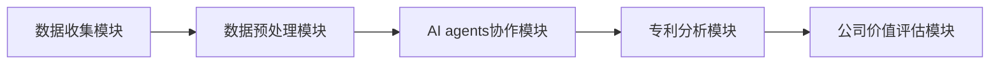

# AI agents协作分析专利组合：评估技术驱动型公司的价值

> 关键词：AI agents、专利组合分析、技术驱动型公司、公司价值评估、协作分析

> 摘要：本文聚焦于利用AI agents协作分析专利组合来评估技术驱动型公司的价值。首先介绍了相关背景，包括目的、预期读者等内容。接着阐述了核心概念及联系，详细说明了AI agents协作分析专利组合的原理和架构。深入探讨了核心算法原理，并用Python代码进行详细展示。给出了相关数学模型和公式，并举例说明。通过项目实战，展示了代码的实际案例和详细解释。分析了该方法的实际应用场景，推荐了相关的工具和资源。最后总结了未来发展趋势与挑战，还设置了常见问题解答和扩展阅读部分，旨在为相关领域的研究者和从业者提供全面且深入的参考。

## 1. 背景介绍 
### 1.1 目的和范围
在当今科技飞速发展的时代，技术驱动型公司在经济舞台上扮演着愈发重要的角色。这些公司的价值不仅仅体现在其现有的资产和财务状况上，更体现在其拥有的技术创新能力和知识产权。专利作为技术创新的重要成果，是衡量技术驱动型公司价值的关键指标之一。然而，专利组合往往数量庞大、内容复杂，传统的人工分析方法效率低下且容易出现遗漏和误差。

本研究的目的在于探索利用AI agents协作的方式来分析专利组合，从而更准确、高效地评估技术驱动型公司的价值。具体范围涵盖了从专利数据的收集、预处理，到利用AI agents进行协作分析，再到最终得出公司价值评估结果的整个流程。同时，还将探讨该方法在不同行业和不同规模公司中的应用。

### 1.2 预期读者
本文的预期读者主要包括以下几类人群：
1. **投资领域从业者**：如风险投资家、私募股权投资者等，他们需要准确评估技术驱动型公司的价值，以便做出投资决策。
2. **技术驱动型公司管理人员**：公司管理层可以通过了解专利组合的价值，更好地制定公司的发展战略和技术创新计划。
3. **知识产权专业人士**：包括专利律师、专利代理人等，他们可以借助AI agents协作分析的方法，提高专利分析和管理的效率。
4. **学术研究人员**：对人工智能、知识产权评估等领域感兴趣的学者，可以从本文中获取相关的研究思路和方法。

### 1.3 文档结构概述
本文将按照以下结构进行组织：
1. **背景介绍**：阐述研究的目的、范围、预期读者和文档结构概述，以及相关术语的定义。
2. **核心概念与联系**：介绍AI agents、专利组合分析和公司价值评估的核心概念，以及它们之间的联系，并给出原理和架构的示意图和流程图。
3. **核心算法原理 & 具体操作步骤**：详细讲解用于协作分析的核心算法原理，并使用Python源代码进行说明。
4. **数学模型和公式 & 详细讲解 & 举例说明**：给出评估公司价值的数学模型和公式，并通过具体例子进行详细解释。
5. **项目实战：代码实际案例和详细解释说明**：展示一个完整的项目实战案例，包括开发环境搭建、源代码实现和代码解读。
6. **实际应用场景**：分析该方法在不同行业和场景中的实际应用。
7. **工具和资源推荐**：推荐相关的学习资源、开发工具框架和论文著作。
8. **总结：未来发展趋势与挑战**：总结研究成果，分析未来的发展趋势和面临的挑战。
9. **附录：常见问题与解答**：解答读者可能遇到的常见问题。
10. **扩展阅读 & 参考资料**：提供相关的扩展阅读材料和参考资料。

### 1.4 术语表
#### 1.4.1 核心术语定义
1. **AI agents（人工智能代理）**：是一种能够感知环境、自主决策并采取行动以实现特定目标的软件实体。在本文中，AI agents用于协作分析专利组合。
2. **专利组合**：指一个公司或组织拥有的所有专利的集合。专利组合反映了公司在技术创新方面的实力和布局。
3. **技术驱动型公司**：主要依靠技术创新来推动业务发展和创造价值的公司。这类公司通常拥有大量的专利和技术秘密。
4. **公司价值评估**：是指对公司的整体价值进行评估的过程，包括公司的资产、负债、盈利能力、技术创新能力等多个方面。

#### 1.4.2 相关概念解释
1. **专利分析**：是指对专利的技术内容、法律状态、市场价值等方面进行分析的过程。专利分析可以帮助了解行业技术发展趋势、竞争对手的技术实力等。
2. **协作分析**：是指多个AI agents通过相互协作和信息共享，共同完成复杂的分析任务。在专利组合分析中，协作分析可以提高分析的效率和准确性。

#### 1.4.3 缩略词列表
1. **AI**：Artificial Intelligence，人工智能
2. **NLP**：Natural Language Processing，自然语言处理
3. **ML**：Machine Learning，机器学习

## 2. 核心概念与联系 

### 核心概念原理
#### AI agents
AI agents是具有自主性、反应性、社会性和主动性的软件实体。在专利组合分析中，AI agents可以通过以下方式发挥作用：
1. **数据收集**：AI agents可以自动从专利数据库、科技新闻网站等数据源收集相关的专利信息。
2. **数据预处理**：对收集到的专利数据进行清洗、分类、标注等预处理操作，以便后续的分析。
3. **专利分析**：利用自然语言处理、机器学习等技术，对专利的技术内容、法律状态、市场价值等进行分析。
4. **协作决策**：多个AI agents可以通过通信和协作，共同制定分析策略和决策。

#### 专利组合分析
专利组合分析是对一个公司或组织拥有的所有专利进行综合评估的过程。专利组合分析的主要内容包括：
1. **专利数量和质量**：分析专利的数量、类型、申请年份等，评估专利的质量和技术创新性。
2. **技术领域分布**：分析专利在不同技术领域的分布情况，了解公司的技术布局和优势领域。
3. **专利引用关系**：分析专利之间的引用关系，了解技术的传承和发展脉络。
4. **市场价值评估**：评估专利的市场价值，包括潜在的商业应用、技术转让价值等。

#### 公司价值评估
公司价值评估是对公司的整体价值进行评估的过程。对于技术驱动型公司，专利组合是评估公司价值的重要因素之一。公司价值评估的主要方法包括：
1. **成本法**：根据公司的资产和负债情况，评估公司的净资产价值。
2. **市场法**：通过比较同行业类似公司的市场价值，评估目标公司的价值。
3. **收益法**：根据公司未来的预期收益，评估公司的价值。

### 架构的文本示意图
```plaintext
|----------------------|
|    数据收集模块      |
|----------------------|
           |
           v
|----------------------|
|    数据预处理模块    |
|----------------------|
           |
           v
|----------------------|
|    AI agents协作模块 |
|----------------------|
           |
           v
|----------------------|
|    专利分析模块      |
|----------------------|
           |
           v
|----------------------|
|    公司价值评估模块  |
|----------------------|
```

### Mermaid 流程图


## 3. 核心算法原理 & 具体操作步骤 

### 核心算法原理
在AI agents协作分析专利组合的过程中，主要涉及以下几种核心算法：
1. **自然语言处理算法**：用于对专利文本进行分词、词性标注、命名实体识别等处理，以便提取关键信息。
2. **机器学习算法**：用于对专利进行分类、聚类、预测等分析，例如使用支持向量机（SVM）对专利进行技术领域分类。
3. **图算法**：用于分析专利之间的引用关系，构建专利引用网络，并进行网络分析，例如计算节点的度中心性、介数中心性等。

### 具体操作步骤
#### 步骤1：数据收集
使用网络爬虫技术从专利数据库（如中国国家知识产权局专利数据库、美国专利商标局数据库等）收集专利信息。以下是一个简单的Python代码示例：
```python
import requests
from bs4 import BeautifulSoup

def get_patent_info(patent_id):
    url = f"https://example.com/patent/{patent_id}"  # 替换为实际的专利查询URL
    response = requests.get(url)
    if response.status_code == 200:
        soup = BeautifulSoup(response.text, 'html.parser')
        # 解析HTML页面，提取专利信息
        title = soup.find('h1', class_='patent-title').text
        abstract = soup.find('div', class_='patent-abstract').text
        return title, abstract
    else:
        return None, None

# 示例调用
patent_id = '123456'
title, abstract = get_patent_info(patent_id)
print(f"专利标题: {title}")
print(f"专利摘要: {abstract}")
```

#### 步骤2：数据预处理
对收集到的专利数据进行清洗、分词、去除停用词等预处理操作。以下是一个简单的Python代码示例：
```python
import re
import jieba
from sklearn.feature_extraction.text import TfidfVectorizer

def preprocess_text(text):
    # 去除特殊字符
    text = re.sub(r'[^\w\s]', '', text)
    # 分词
    words = jieba.lcut(text)
    # 去除停用词
    stopwords = set()
    with open('stopwords.txt', 'r', encoding='utf-8') as f:
        for line in f:
            stopwords.add(line.strip())
    filtered_words = [word for word in words if word not in stopwords]
    return ' '.join(filtered_words)

# 示例调用
text = "这是一个示例专利文本，包含一些特殊字符！"
preprocessed_text = preprocess_text(text)
print(preprocessed_text)

# 使用TF-IDF向量化
corpus = [preprocessed_text]
vectorizer = TfidfVectorizer()
X = vectorizer.fit_transform(corpus)
print(X.toarray())
```

#### 步骤3：AI agents协作分析
多个AI agents通过通信和协作，共同完成专利分析任务。例如，一个AI agent负责对专利进行技术领域分类，另一个AI agent负责分析专利的引用关系。以下是一个简单的Python代码示例：
```python
import threading

class AIAgent:
    def __init__(self, name):
        self.name = name

    def analyze_patent(self, patent):
        print(f"{self.name}正在分析专利: {patent}")

# 创建两个AI agents
agent1 = AIAgent("Agent1")
agent2 = AIAgent("Agent2")

# 模拟专利数据
patents = ["专利1", "专利2", "专利3"]

# 多线程协作分析
threads = []
for patent in patents:
    thread1 = threading.Thread(target=agent1.analyze_patent, args=(patent,))
    thread2 = threading.Thread(target=agent2.analyze_patent, args=(patent,))
    threads.append(thread1)
    threads.append(thread2)
    thread1.start()
    thread2.start()

# 等待所有线程完成
for thread in threads:
    thread.join()
```

#### 步骤4：公司价值评估
根据专利分析的结果，结合公司的财务数据、市场情况等因素，使用合适的评估方法对公司的价值进行评估。以下是一个简单的示例，假设使用收益法进行评估：
```python
def evaluate_company_value(patent_value, financial_income, growth_rate, discount_rate):
    # 计算专利的净现值
    patent_npv = patent_value / (1 + discount_rate)
    # 计算公司未来收益的净现值
    future_income_npv = financial_income * (1 + growth_rate) / (discount_rate - growth_rate)
    # 计算公司的总价值
    company_value = patent_npv + future_income_npv
    return company_value

# 示例调用
patent_value = 1000000  # 专利价值
financial_income = 500000  # 公司当前财务收益
growth_rate = 0.1  # 公司收益增长率
discount_rate = 0.05  # 折现率
company_value = evaluate_company_value(patent_value, financial_income, growth_rate, discount_rate)
print(f"公司价值: {company_value}")
```

## 4. 数学模型和公式 & 详细讲解 & 举例说明 

### 专利价值评估模型
专利的价值可以通过多种方法进行评估，其中一种常用的方法是基于收益法的评估模型。假设专利的预期收益为 $R$，收益的持续时间为 $n$ 年，折现率为 $r$，则专利的净现值 $NPV$ 可以通过以下公式计算：

$$NPV = \sum_{i=1}^{n} \frac{R_i}{(1 + r)^i}$$

其中，$R_i$ 表示第 $i$ 年的预期收益。

### 公司价值评估模型
对于技术驱动型公司，公司的价值 $V$ 可以表示为专利组合的价值 $V_p$ 和其他资产的价值 $V_a$ 之和：

$$V = V_p + V_a$$

其中，专利组合的价值 $V_p$ 可以通过对每个专利的价值进行求和得到：

$$V_p = \sum_{j=1}^{m} NPV_j$$

其中，$m$ 表示专利组合中专利的数量，$NPV_j$ 表示第 $j$ 个专利的净现值。

### 举例说明
假设一个技术驱动型公司拥有3个专利，每个专利的预期收益和持续时间如下：
| 专利编号 | 预期年收益（万元） | 收益持续时间（年） |
| ---- | ---- | ---- |
| 1 | 100 | 5 |
| 2 | 150 | 4 |
| 3 | 200 | 3 |

折现率 $r = 0.1$，公司其他资产的价值 $V_a = 500$ 万元。

首先，计算每个专利的净现值：
- 专利1：
$$NPV_1 = \sum_{i=1}^{5} \frac{100}{(1 + 0.1)^i} \approx 379.08$$
- 专利2：
$$NPV_2 = \sum_{i=1}^{4} \frac{150}{(1 + 0.1)^i} \approx 475.48$$
- 专利3：
$$NPV_3 = \sum_{i=1}^{3} \frac{200}{(1 + 0.1)^i} \approx 497.37$$

然后，计算专利组合的价值：
$$V_p = NPV_1 + NPV_2 + NPV_3 \approx 379.08 + 475.48 + 497.37 = 1351.93$$

最后，计算公司的价值：
$$V = V_p + V_a = 1351.93 + 500 = 1851.93$$

因此，该技术驱动型公司的价值约为1851.93万元。

## 5. 项目实战：代码实际案例和详细解释说明 

### 5.1  开发环境搭建
#### 操作系统
建议使用Linux或macOS系统，因为它们对Python开发环境的支持更好。如果使用Windows系统，也可以通过安装Anaconda等工具来搭建开发环境。

#### Python环境
安装Python 3.7及以上版本。可以从Python官方网站（https://www.python.org/downloads/）下载安装包进行安装。

#### 依赖库安装
使用pip命令安装以下依赖库：
```sh
pip install requests beautifulsoup4 jieba sklearn numpy pandas
```

### 5.2  源代码详细实现和代码解读
以下是一个完整的项目实战代码示例，包括数据收集、预处理、专利分析和公司价值评估的全过程：

```python
import requests
from bs4 import BeautifulSoup
import re
import jieba
from sklearn.feature_extraction.text import TfidfVectorizer
import threading

# 数据收集模块
def get_patent_info(patent_id):
    url = f"https://example.com/patent/{patent_id}"  # 替换为实际的专利查询URL
    response = requests.get(url)
    if response.status_code == 200:
        soup = BeautifulSoup(response.text, 'html.parser')
        # 解析HTML页面，提取专利信息
        title = soup.find('h1', class_='patent-title').text
        abstract = soup.find('div', class_='patent-abstract').text
        return title, abstract
    else:
        return None, None

# 数据预处理模块
def preprocess_text(text):
    # 去除特殊字符
    text = re.sub(r'[^\w\s]', '', text)
    # 分词
    words = jieba.lcut(text)
    # 去除停用词
    stopwords = set()
    with open('stopwords.txt', 'r', encoding='utf-8') as f:
        for line in f:
            stopwords.add(line.strip())
    filtered_words = [word for word in words if word not in stopwords]
    return ' '.join(filtered_words)

# AI agents协作模块
class AIAgent:
    def __init__(self, name):
        self.name = name

    def analyze_patent(self, patent):
        print(f"{self.name}正在分析专利: {patent}")

# 专利分析模块
def analyze_patents(patents):
    preprocessed_patents = []
    for patent in patents:
        preprocessed_patent = preprocess_text(patent)
        preprocessed_patents.append(preprocessed_patent)
    vectorizer = TfidfVectorizer()
    X = vectorizer.fit_transform(preprocessed_patents)
    return X

# 公司价值评估模块
def evaluate_company_value(patent_value, financial_income, growth_rate, discount_rate):
    # 计算专利的净现值
    patent_npv = patent_value / (1 + discount_rate)
    # 计算公司未来收益的净现值
    future_income_npv = financial_income * (1 + growth_rate) / (discount_rate - growth_rate)
    # 计算公司的总价值
    company_value = patent_npv + future_income_npv
    return company_value

# 主程序
if __name__ == "__main__":
    # 数据收集
    patent_ids = ['123456', '234567', '345678']
    patents = []
    for patent_id in patent_ids:
        title, abstract = get_patent_info(patent_id)
        if title and abstract:
            patents.append(title + " " + abstract)

    # AI agents协作分析
    agent1 = AIAgent("Agent1")
    agent2 = AIAgent("Agent2")
    threads = []
    for patent in patents:
        thread1 = threading.Thread(target=agent1.analyze_patent, args=(patent,))
        thread2 = threading.Thread(target=agent2.analyze_patent, args=(patent,))
        threads.append(thread1)
        threads.append(thread2)
        thread1.start()
        thread2.start()

    # 等待所有线程完成
    for thread in threads:
        thread.join()

    # 专利分析
    X = analyze_patents(patents)
    print("专利分析结果:", X.toarray())

    # 公司价值评估
    patent_value = 1000000  # 专利价值
    financial_income = 500000  # 公司当前财务收益
    growth_rate = 0.1  # 公司收益增长率
    discount_rate = 0.05  # 折现率
    company_value = evaluate_company_value(patent_value, financial_income, growth_rate, discount_rate)
    print(f"公司价值: {company_value}")
```

### 5.3  代码解读与分析
1. **数据收集模块**：`get_patent_info` 函数通过发送HTTP请求获取专利信息，并使用BeautifulSoup库解析HTML页面，提取专利标题和摘要。
2. **数据预处理模块**：`preprocess_text` 函数对专利文本进行清洗、分词和去除停用词等预处理操作，以便后续的分析。
3. **AI agents协作模块**：`AIAgent` 类表示一个AI agent，`analyze_patent` 方法用于分析专利。使用多线程技术实现多个AI agents的协作分析。
4. **专利分析模块**：`analyze_patents` 函数对预处理后的专利文本进行TF-IDF向量化，得到专利的特征向量。
5. **公司价值评估模块**：`evaluate_company_value` 函数根据专利价值、公司财务收益、收益增长率和折现率，使用收益法计算公司的价值。
6. **主程序**：依次调用数据收集、AI agents协作分析、专利分析和公司价值评估模块，完成整个分析流程。

## 6. 实际应用场景 
### 投资决策
在风险投资和私募股权投资领域，投资者需要准确评估技术驱动型公司的价值，以便做出投资决策。利用AI agents协作分析专利组合可以帮助投资者更好地了解公司的技术实力和创新能力，从而更准确地评估公司的价值和投资潜力。

### 公司战略规划
技术驱动型公司的管理层可以通过分析专利组合，了解公司在技术领域的优势和劣势，制定合理的技术创新战略和业务发展规划。例如，根据专利分析结果，公司可以决定加大在某些技术领域的研发投入，或者进行技术转让和合作。

### 知识产权管理
知识产权专业人士可以利用AI agents协作分析专利组合，提高专利管理的效率和准确性。例如，对专利进行分类和聚类，以便更好地进行专利检索和维护；分析专利的引用关系，了解技术的发展趋势和竞争对手的技术布局。

### 企业并购
在企业并购过程中，收购方需要对被收购方的专利组合进行评估，以确定收购的价值和风险。AI agents协作分析可以帮助收购方快速、准确地了解被收购方的专利情况，从而做出更明智的并购决策。

## 7. 工具和资源推荐
### 7.1 学习资源推荐
#### 7.1.1 书籍推荐
1. 《人工智能：一种现代的方法》（Artificial Intelligence: A Modern Approach）：全面介绍了人工智能的基本概念、算法和应用，是人工智能领域的经典教材。
2. 《自然语言处理入门》：详细介绍了自然语言处理的基本理论和方法，适合初学者学习。
3. 《机器学习》（Machine Learning）：由周志华教授编写，系统介绍了机器学习的基本概念、算法和应用，是机器学习领域的优秀教材。

#### 7.1.2 在线课程
1. Coursera上的“人工智能基础”（Foundations of Artificial Intelligence）课程：由斯坦福大学教授讲授，介绍了人工智能的基本概念、算法和应用。
2. edX上的“自然语言处理”（Natural Language Processing）课程：由华盛顿大学教授讲授，详细介绍了自然语言处理的理论和方法。
3. 中国大学MOOC上的“机器学习”课程：由清华大学教授讲授，系统介绍了机器学习的基本概念、算法和应用。

#### 7.1.3 技术博客和网站
1. 机器之心（https://www.alienzhou.com/）：提供人工智能领域的最新技术动态、研究成果和应用案例。
2. 算法之心（https://www.zhuanzhi.ai/）：专注于算法和人工智能的技术分享和交流。
3. arXiv（https://arxiv.org/）：提供计算机科学、物理学等领域的最新研究论文。

### 7.2 开发工具框架推荐
#### 7.2.1 IDE和编辑器
1. PyCharm：是一款专门为Python开发设计的集成开发环境，具有代码编辑、调试、版本控制等功能。
2. Jupyter Notebook：是一个交互式的编程环境，适合进行数据探索和分析。
3. Visual Studio Code：是一款轻量级的代码编辑器，支持多种编程语言和插件扩展。

#### 7.2.2 调试和性能分析工具
1. PDB：Python自带的调试工具，可以帮助开发者定位和解决代码中的问题。
2. cProfile：Python标准库中的性能分析工具，可以分析代码的运行时间和函数调用情况。
3. TensorBoard：是TensorFlow框架提供的可视化工具，可以帮助开发者监控模型的训练过程和性能。

#### 7.2.3 相关框架和库
1. TensorFlow：是一个开源的机器学习框架，广泛应用于深度学习领域。
2. PyTorch：是另一个开源的机器学习框架，具有动态图和易于使用的特点。
3. Scikit-learn：是一个简单易用的机器学习库，提供了多种机器学习算法和工具。

### 7.3 相关论文著作推荐
#### 7.3.1 经典论文
1. “A Logical Calculus of the Ideas Immanent in Nervous Activity”（神经活动中内在思想的逻辑演算）：由Warren McCulloch和Walter Pitts于1943年发表，提出了人工神经网络的基本概念。
2. “Learning Representations by Back-propagating Errors”（通过反向传播误差学习表示）：由David Rumelhart、Geoffrey Hinton和Ronald Williams于1986年发表，提出了反向传播算法，推动了神经网络的发展。
3. “ImageNet Classification with Deep Convolutional Neural Networks”（使用深度卷积神经网络进行ImageNet分类）：由Alex Krizhevsky、Ilya Sutskever和Geoffrey Hinton于2012年发表，提出了AlexNet模型，开启了深度学习在计算机视觉领域的热潮。

#### 7.3.2 最新研究成果
1. 关注顶级学术会议（如NeurIPS、ICML、CVPR等）上的最新研究论文，了解人工智能领域的最新技术和方法。
2. 关注知名研究机构（如OpenAI、DeepMind等）的官方网站和博客，获取他们的最新研究成果和应用案例。

#### 7.3.3 应用案例分析
1. 《人工智能时代的商业新物种》：通过多个实际案例，介绍了人工智能在不同行业的应用和商业价值。
2. 《AI+医疗：开启智能医疗新时代》：分析了人工智能在医疗领域的应用案例和发展趋势。

## 8. 总结：未来发展趋势与挑战
### 未来发展趋势
1. **多模态数据融合**：未来的AI agents协作分析将不仅仅局限于专利文本数据，还将融合图像、视频、音频等多模态数据，以更全面地评估技术驱动型公司的价值。
2. **强化学习和深度学习的结合**：强化学习可以使AI agents在与环境的交互中不断学习和优化分析策略，深度学习可以更好地处理复杂的专利数据，两者的结合将提高分析的准确性和效率。
3. **跨领域协作**：AI agents将与其他领域的专家系统进行协作，如财务分析系统、市场调研系统等，以提供更全面的公司价值评估服务。

### 挑战
1. **数据质量和隐私问题**：专利数据的质量和隐私问题是影响分析结果准确性和可靠性的重要因素。需要加强数据清洗和预处理，同时保护数据的隐私和安全。
2. **算法解释性问题**：深度学习等复杂算法的解释性较差，难以理解模型的决策过程。需要研究开发具有可解释性的算法，提高分析结果的可信度。
3. **法律和伦理问题**：在使用AI agents进行专利组合分析和公司价值评估的过程中，可能会涉及到法律和伦理问题，如专利侵权、数据滥用等。需要制定相应的法律法规和伦理准则，规范技术的应用。

## 9. 附录：常见问题与解答
### 问题1：AI agents协作分析专利组合的准确性如何保证？
答：为了保证分析的准确性，可以采取以下措施：
1. 收集高质量的专利数据，并进行严格的数据清洗和预处理。
2. 使用多种算法进行分析，并对分析结果进行综合评估。
3. 引入领域专家的知识和经验，对AI agents的分析结果进行验证和修正。

### 问题2：AI agents协作分析需要多长时间？
答：分析所需的时间取决于专利数据的规模和复杂度、算法的效率以及计算资源的配置等因素。对于小规模的专利组合，分析可能只需要几分钟到几小时；对于大规模的专利组合，分析时间可能会延长到几天甚至几周。

### 问题3：该方法是否适用于所有类型的技术驱动型公司？
答：该方法适用于大多数技术驱动型公司，但对于一些新兴的、技术创新速度极快的公司，可能需要对评估模型和算法进行适当的调整和优化，以更好地反映公司的实际价值。

## 10. 扩展阅读 & 参考资料
### 扩展阅读
1. 《人工智能哲学》：探讨了人工智能的哲学基础和伦理问题。
2. 《大数据时代：生活、工作与思维的大变革》：介绍了大数据的概念、技术和应用。

### 参考资料
1. 中国国家知识产权局官方网站（https://www.cnipa.gov.cn/）
2. 美国专利商标局官方网站（https://www.uspto.gov/）
3. 《人工智能：原理与应用》，作者：李开复、王咏刚

作者：AI天才研究院/AI Genius Institute & 禅与计算机程序设计艺术 /Zen And The Art of Computer Programming