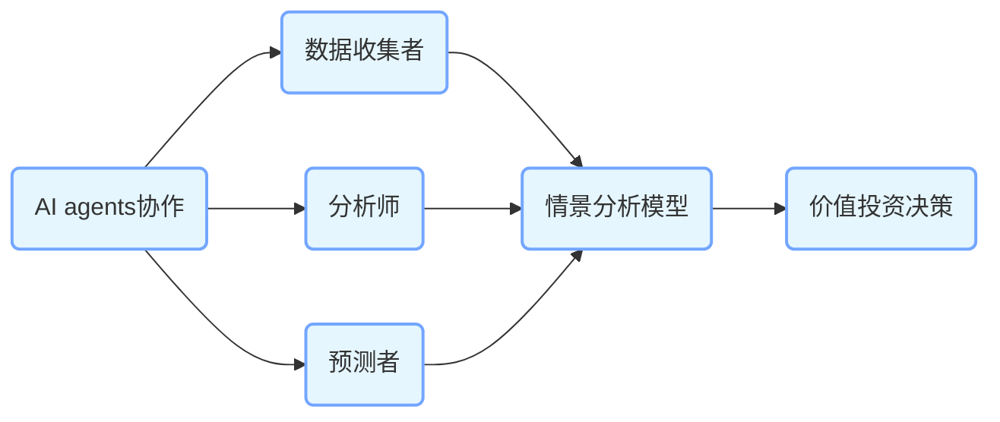

# AI agents协作进行情景分析：增强价值投资的适应性

> 关键词：AI agents、情景分析、价值投资、适应性、协作

> 摘要：本文聚焦于AI agents协作进行情景分析以增强价值投资适应性这一主题。首先介绍了相关背景，包括目的、预期读者、文档结构和术语表。接着阐述了核心概念与联系，详细解释了AI agents、情景分析和价值投资的原理及它们之间的关系，并给出了文本示意图和Mermaid流程图。在核心算法原理部分，使用Python源代码详细阐述了算法的实现。同时，给出了相关的数学模型和公式，并通过举例进行了说明。通过项目实战，展示了开发环境搭建、源代码实现及解读。分析了该技术在实际应用场景中的表现，推荐了学习资源、开发工具框架和相关论文著作。最后总结了未来发展趋势与挑战，解答了常见问题，并提供了扩展阅读和参考资料，旨在为投资者和技术人员提供全面的技术指导和应用思路。

## 1. 背景介绍 
### 1.1 目的和范围
在当今复杂多变的金融市场环境中，价值投资面临着诸多挑战。传统的价值投资方法往往依赖于静态的财务指标和经验判断，难以适应市场的快速变化和不确定性。本研究的目的是探索如何利用AI agents协作进行情景分析，以增强价值投资的适应性。通过模拟不同的市场情景，AI agents可以更全面地评估投资标的的价值和风险，为投资者提供更准确的决策依据。

本研究的范围涵盖了AI agents的基本原理、情景分析的方法、价值投资的理论和实践，以及如何将三者有机结合起来。我们将重点关注如何利用AI agents的协作能力，提高情景分析的准确性和效率，从而为价值投资带来更好的效果。

### 1.2 预期读者
本文的预期读者包括金融投资者、投资顾问、金融分析师、人工智能研究者以及对价值投资和人工智能技术感兴趣的专业人士。对于投资者来说，本文可以帮助他们了解如何利用AI agents协作进行情景分析，从而优化投资决策；对于人工智能研究者来说，本文可以为他们提供一个新的应用场景和研究方向；对于金融从业者来说，本文可以为他们提供一种创新的投资分析方法。

### 1.3 文档结构概述
本文将按照以下结构进行组织：
- 核心概念与联系：介绍AI agents、情景分析和价值投资的核心概念，以及它们之间的联系。
- 核心算法原理 & 具体操作步骤：详细阐述AI agents协作进行情景分析的核心算法原理，并给出具体的操作步骤，同时使用Python源代码进行说明。
- 数学模型和公式 & 详细讲解 & 举例说明：建立相关的数学模型和公式，对其进行详细讲解，并通过具体的例子进行说明。
- 项目实战：代码实际案例和详细解释说明：通过一个实际的项目案例，展示如何使用AI agents协作进行情景分析，包括开发环境搭建、源代码实现和代码解读。
- 实际应用场景：分析AI agents协作进行情景分析在价值投资中的实际应用场景。
- 工具和资源推荐：推荐相关的学习资源、开发工具框架和论文著作。
- 总结：未来发展趋势与挑战：总结本文的主要内容，分析未来的发展趋势和面临的挑战。
- 附录：常见问题与解答：解答读者可能关心的常见问题。
- 扩展阅读 & 参考资料：提供相关的扩展阅读和参考资料。

### 1.4 术语表
#### 1.4.1 核心术语定义
- **AI agents**：人工智能代理，是一种能够感知环境、自主决策并采取行动的智能实体。在本文中，AI agents可以根据市场数据和情景设定，进行分析和预测。
- **情景分析**：一种通过模拟不同的市场情景，评估投资标的在各种情况下的表现和风险的方法。
- **价值投资**：一种基于公司内在价值进行投资的策略，投资者通过分析公司的财务状况、行业前景等因素，寻找被低估的股票进行投资。

#### 1.4.2 相关概念解释
- **协作**：指多个AI agents之间通过信息共享和协同工作，共同完成情景分析任务的过程。
- **适应性**：指价值投资策略能够根据市场环境的变化及时调整，以适应不同的市场情景。

#### 1.4.3 缩略词列表
- **AI**：Artificial Intelligence，人工智能
- **ML**：Machine Learning，机器学习
- **DL**：Deep Learning，深度学习

## 2. 核心概念与联系 

### 核心概念原理

#### AI agents
AI agents是人工智能领域中的一个重要概念，它可以被看作是具有自主性、反应性、社会性和能动性的智能实体。自主性意味着AI agents可以在没有人类干预的情况下，自主地感知环境、做出决策并采取行动；反应性表示AI agents能够对环境中的变化做出及时的反应；社会性指的是AI agents可以与其他AI agents或人类进行交互和协作；能动性则强调AI agents可以主动地追求自己的目标。

在价值投资的情景分析中，AI agents可以扮演不同的角色，如数据收集者、分析师、预测者等。数据收集者AI agents负责从各种数据源收集市场数据，包括股票价格、财务报表、新闻资讯等；分析师AI agents对收集到的数据进行分析，提取有用的信息和特征；预测者AI agents则根据分析结果，对不同情景下的投资标的表现进行预测。

#### 情景分析
情景分析是一种重要的风险管理和决策工具，它通过构建不同的市场情景，模拟各种可能的市场变化，从而评估投资标的在不同情况下的表现和风险。情景分析的关键在于确定合适的情景变量和情景设定。情景变量可以包括宏观经济指标（如GDP增长率、通货膨胀率、利率等）、行业因素（如行业竞争格局、技术创新等）和公司特定因素（如财务状况、管理层能力等）。情景设定则是根据历史数据、专家意见和市场趋势，确定不同情景变量的取值范围和组合。

在价值投资中，情景分析可以帮助投资者更全面地了解投资标的的价值和风险。通过模拟不同的市场情景，投资者可以评估投资标的在牛市、熊市和震荡市等不同市场环境下的表现，从而制定更加合理的投资策略。

#### 价值投资
价值投资是由本杰明·格雷厄姆（Benjamin Graham）和戴维·多德（David Dodd）在20世纪30年代提出的一种投资策略。价值投资的核心思想是寻找被市场低估的股票，即股票的市场价格低于其内在价值。投资者通过分析公司的财务状况、行业前景、管理层能力等因素，评估公司的内在价值，并在股票价格低于内在价值时买入，等待价格回归价值时卖出，从而获得投资收益。

价值投资强调长期投资和基本面分析，认为市场短期内可能会出现非理性波动，但从长期来看，股票价格会回归其内在价值。在实际应用中，价值投资者通常会关注公司的市盈率、市净率、股息率等财务指标，以及公司的竞争优势、行业地位等基本面因素。

### 核心概念架构的文本示意图
```plaintext
                      +-------------------+
                      |   AI agents协作   |
                      +-------------------+
                      /         |         \
                     /          |          \
        +----------------+ +----------------+ +----------------+
        |  数据收集者    | |  分析师        | |  预测者        |
        +----------------+ +----------------+ +----------------+
                      |
                      |  数据与信息传递
                      v
             +-------------------+
             |   情景分析模型   |
             +-------------------+
                      |
                      |  情景模拟与评估
                      v
             +-------------------+
             |   价值投资决策   |
             +-------------------+
```

### Mermaid流程图


## 3. 核心算法原理 & 具体操作步骤 

### 核心算法原理

在AI agents协作进行情景分析以增强价值投资适应性的过程中，主要涉及到数据处理、机器学习模型训练和情景模拟三个核心步骤。下面我们将详细介绍每个步骤的算法原理，并给出相应的Python源代码。

#### 数据处理
数据处理是整个过程的基础，它包括数据收集、清洗、特征提取和归一化等步骤。数据收集可以通过网络爬虫、API接口等方式从各种数据源获取市场数据；数据清洗用于去除数据中的噪声、缺失值和异常值；特征提取则是从原始数据中提取出对投资决策有意义的特征；归一化是将特征值缩放到一个合适的范围，以提高机器学习模型的训练效果。

以下是一个简单的数据处理示例代码：
```python
import pandas as pd
from sklearn.preprocessing import MinMaxScaler

# 数据收集（假设从CSV文件中读取）
data = pd.read_csv('market_data.csv')

# 数据清洗
data = data.dropna()  # 去除缺失值

# 特征提取（假设提取一些财务指标作为特征）
features = data[['PE_ratio', 'PB_ratio', 'Dividend_yield']]

# 归一化
scaler = MinMaxScaler()
normalized_features = scaler.fit_transform(features)
```

#### 机器学习模型训练
机器学习模型训练是根据处理后的数据，训练一个能够预测投资标的表现的模型。常用的机器学习模型包括线性回归、逻辑回归、决策树、随机森林、支持向量机等。在本研究中，我们选择使用随机森林模型，因为它具有较好的泛化能力和抗噪声能力。

以下是一个随机森林模型训练的示例代码：
```python
from sklearn.ensemble import RandomForestRegressor
from sklearn.model_selection import train_test_split

# 划分训练集和测试集
X_train, X_test, y_train, y_test = train_test_split(normalized_features, data['Stock_return'], test_size=0.2, random_state=42)

# 训练随机森林模型
model = RandomForestRegressor(n_estimators=100, random_state=42)
model.fit(X_train, y_train)

# 模型评估
score = model.score(X_test, y_test)
print(f"模型得分: {score}")
```

#### 情景模拟
情景模拟是根据不同的情景设定，使用训练好的模型预测投资标的在各种情景下的表现。情景设定可以根据历史数据、专家意见和市场趋势进行确定。

以下是一个情景模拟的示例代码：
```python
import numpy as np

# 定义情景设定（假设三种情景）
scenarios = [
    [0.1, 0.2, 0.3],  # 情景1
    [0.4, 0.5, 0.6],  # 情景2
    [0.7, 0.8, 0.9]   # 情景3
]

# 对情景进行归一化
scenarios_normalized = scaler.transform(scenarios)

# 进行情景模拟
predictions = model.predict(scenarios_normalized)

for i, prediction in enumerate(predictions):
    print(f"情景 {i+1} 下的预测收益率: {prediction}")
```

### 具体操作步骤
1. **数据收集**：从各种数据源收集市场数据，包括股票价格、财务报表、新闻资讯等。
2. **数据处理**：对收集到的数据进行清洗、特征提取和归一化等处理。
3. **模型训练**：使用处理后的数据训练一个机器学习模型，如随机森林模型。
4. **情景设定**：根据历史数据、专家意见和市场趋势，确定不同的情景变量和情景设定。
5. **情景模拟**：使用训练好的模型对不同情景下的投资标的表现进行预测。
6. **投资决策**：根据情景模拟结果，制定相应的价值投资策略。

## 4. 数学模型和公式 & 详细讲解 & 举例说明 

### 随机森林模型原理
随机森林是一种集成学习方法，它通过组合多个决策树来提高模型的预测性能。随机森林的基本思想是在训练过程中，从原始数据集中有放回地随机抽取一定数量的样本，构建多个决策树，然后将这些决策树的预测结果进行综合，得到最终的预测结果。

#### 决策树模型
决策树是一种基于树结构进行决策的模型，它由节点和边组成。节点分为内部节点和叶节点，内部节点表示一个特征的判断条件，叶节点表示一个预测结果。决策树的构建过程是一个递归划分数据集的过程，每次选择一个最优的特征进行划分，直到满足停止条件。

决策树的划分准则通常使用信息增益、信息增益比、基尼指数等。以信息增益为例，信息增益是指在划分数据集前后，信息熵的减少量。信息熵是衡量数据集纯度的一个指标，信息熵越小，数据集越纯。

信息熵的计算公式为：
$$H(D)=-\sum_{k=1}^{K}p_k\log_2p_k$$
其中，$D$ 表示数据集，$K$ 表示数据集的类别数，$p_k$ 表示第 $k$ 类样本在数据集中所占的比例。

信息增益的计算公式为：
$$g(D,A)=H(D)-H(D|A)$$
其中，$A$ 表示划分特征，$H(D|A)$ 表示在特征 $A$ 划分下数据集的条件熵，计算公式为：
$$H(D|A)=\sum_{i=1}^{n}\frac{|D_i|}{|D|}H(D_i)$$
其中，$n$ 表示特征 $A$ 的取值个数，$D_i$ 表示特征 $A$ 取值为 $i$ 时的子集。

#### 随机森林模型
随机森林在构建决策树时，引入了两个随机机制：样本随机和特征随机。样本随机是指在训练每个决策树时，从原始数据集中有放回地随机抽取一定数量的样本；特征随机是指在每个内部节点选择划分特征时，从所有特征中随机选择一部分特征进行比较，选择最优的特征进行划分。

随机森林的预测结果是通过对多个决策树的预测结果进行投票或平均得到的。对于分类问题，通常采用投票的方式，选择票数最多的类别作为最终的预测结果；对于回归问题，通常采用平均的方式，将多个决策树的预测结果进行平均得到最终的预测结果。

### 举例说明
假设我们有一个包含 100 个样本的数据集，每个样本有 5 个特征和一个目标变量（收益率）。我们使用随机森林模型对收益率进行预测。

首先，我们从原始数据集中有放回地随机抽取 80 个样本，构建一个决策树。在每个内部节点选择划分特征时，从 5 个特征中随机选择 2 个特征进行比较，选择最优的特征进行划分。重复这个过程，构建 100 个决策树，得到一个随机森林模型。

当我们需要对一个新的样本进行预测时，将该样本输入到 100 个决策树中，得到 100 个预测结果。然后将这 100 个预测结果进行平均，得到最终的预测收益率。

## 5. 项目实战：代码实际案例和详细解释说明 

### 5.1  开发环境搭建
在进行项目实战之前，我们需要搭建一个合适的开发环境。以下是具体的搭建步骤：

#### 安装Python
Python是一种广泛使用的编程语言，具有丰富的科学计算和机器学习库。我们可以从Python官方网站（https://www.python.org/downloads/）下载并安装Python 3.x版本。

#### 安装必要的库
我们需要安装一些必要的Python库，包括pandas、numpy、scikit-learn等。可以使用pip命令进行安装：
```sh
pip install pandas numpy scikit-learn
```

#### 准备数据
我们需要准备一个包含市场数据的CSV文件，文件中应包含股票价格、财务指标等信息。假设我们的文件名为 `market_data.csv`。

### 5.2  源代码详细实现和代码解读
以下是一个完整的项目实战代码示例：
```python
import pandas as pd
from sklearn.preprocessing import MinMaxScaler
from sklearn.ensemble import RandomForestRegressor
from sklearn.model_selection import train_test_split

# 数据收集（假设从CSV文件中读取）
data = pd.read_csv('market_data.csv')

# 数据清洗
data = data.dropna()  # 去除缺失值

# 特征提取（假设提取一些财务指标作为特征）
features = data[['PE_ratio', 'PB_ratio', 'Dividend_yield']]

# 归一化
scaler = MinMaxScaler()
normalized_features = scaler.fit_transform(features)

# 划分训练集和测试集
X_train, X_test, y_train, y_test = train_test_split(normalized_features, data['Stock_return'], test_size=0.2, random_state=42)

# 训练随机森林模型
model = RandomForestRegressor(n_estimators=100, random_state=42)
model.fit(X_train, y_train)

# 模型评估
score = model.score(X_test, y_test)
print(f"模型得分: {score}")

# 定义情景设定（假设三种情景）
scenarios = [
    [0.1, 0.2, 0.3],  # 情景1
    [0.4, 0.5, 0.6],  # 情景2
    [0.7, 0.8, 0.9]   # 情景3
]

# 对情景进行归一化
scenarios_normalized = scaler.transform(scenarios)

# 进行情景模拟
predictions = model.predict(scenarios_normalized)

for i, prediction in enumerate(predictions):
    print(f"情景 {i+1} 下的预测收益率: {prediction}")
```

### 代码解读与分析
1. **数据收集**：使用 `pandas` 库的 `read_csv` 函数从CSV文件中读取市场数据。
2. **数据清洗**：使用 `dropna` 函数去除数据中的缺失值。
3. **特征提取**：选择一些财务指标作为特征，如市盈率、市净率和股息率。
4. **归一化**：使用 `MinMaxScaler` 对特征进行归一化处理，将特征值缩放到 [0, 1] 范围内。
5. **划分训练集和测试集**：使用 `train_test_split` 函数将数据集划分为训练集和测试集，测试集占比为 20%。
6. **训练随机森林模型**：使用 `RandomForestRegressor` 构建随机森林模型，并使用训练集进行训练。
7. **模型评估**：使用 `score` 方法评估模型在测试集上的性能。
8. **情景设定**：定义三种不同的情景，每个情景包含三个特征值。
9. **情景模拟**：对情景进行归一化处理，并使用训练好的模型进行预测，得到每个情景下的预测收益率。

通过这个项目实战，我们可以看到如何使用AI agents协作进行情景分析，以增强价值投资的适应性。

## 6. 实际应用场景 
### 投资组合优化
在价值投资中，投资者通常会构建一个投资组合，以分散风险并提高收益。AI agents协作进行情景分析可以帮助投资者优化投资组合。通过模拟不同的市场情景，AI agents可以评估投资组合中各个资产在不同情景下的表现和风险，从而为投资者提供最优的资产配置建议。例如，在牛市情景下，AI agents可能会建议增加股票的持仓比例；在熊市情景下，可能会建议增加债券或现金的持仓比例。

### 风险管理
风险管理是价值投资中的一个重要环节。AI agents协作进行情景分析可以帮助投资者识别和评估投资风险。通过模拟各种可能的市场情景，AI agents可以预测投资标的在不同情景下的收益率波动情况，从而为投资者提供风险预警和应对策略。例如，当模拟结果显示在某种情景下投资组合的收益率可能会大幅下降时，投资者可以及时调整投资组合，降低风险。

### 投资机会发现
AI agents协作进行情景分析可以帮助投资者发现潜在的投资机会。通过对不同行业和公司在不同情景下的表现进行分析，AI agents可以找出那些在特定情景下具有较高投资价值的股票。例如，在经济复苏情景下，一些周期性行业的股票可能会有较好的表现；在科技进步情景下，一些新兴科技公司的股票可能会有较大的增长潜力。

### 投资决策支持
在做出投资决策时，投资者需要考虑各种因素，包括市场趋势、公司基本面、宏观经济环境等。AI agents协作进行情景分析可以为投资者提供全面的信息和分析结果，帮助投资者做出更明智的投资决策。例如，当投资者考虑是否买入某只股票时，AI agents可以提供该股票在不同情景下的预测收益率、风险评估等信息，帮助投资者权衡利弊。

## 7. 工具和资源推荐
### 7.1 学习资源推荐
#### 7.1.1 书籍推荐
- 《人工智能：一种现代的方法》（Artificial Intelligence: A Modern Approach）：这本书是人工智能领域的经典教材，涵盖了AI agents、机器学习、自然语言处理等多个方面的内容。
- 《Python机器学习》（Python Machine Learning）：这本书详细介绍了如何使用Python进行机器学习，包括数据处理、模型训练、模型评估等内容。
- 《价值投资：从格雷厄姆到巴菲特》（Value Investing: From Graham to Buffett and Beyond）：这本书系统地介绍了价值投资的理论和实践，是价值投资者的必读之书。

#### 7.1.2 在线课程
- Coursera上的“人工智能基础”（Foundations of Artificial Intelligence）课程：该课程由知名教授授课，介绍了人工智能的基本概念、算法和应用。
- edX上的“Python数据科学导论”（Introduction to Data Science in Python）课程：该课程主要讲解如何使用Python进行数据科学分析，包括数据处理、可视化和机器学习等内容。
- Udemy上的“价值投资实战课程”（Value Investing Masterclass）：该课程结合实际案例，介绍了价值投资的方法和技巧。

#### 7.1.3 技术博客和网站
- Medium：这是一个技术博客平台，上面有很多关于人工智能、机器学习和价值投资的文章。
- Towards Data Science：这是一个专注于数据科学和机器学习的网站，提供了很多高质量的技术文章和教程。
- Seeking Alpha：这是一个金融投资网站，提供了大量的股票分析、投资策略和市场评论。

### 7.2 开发工具框架推荐
#### 7.2.1 IDE和编辑器
- PyCharm：这是一款专业的Python集成开发环境，具有代码编辑、调试、版本控制等功能，非常适合Python开发。
- Jupyter Notebook：这是一个交互式的开发环境，可以方便地进行数据探索、模型训练和结果展示。
- Visual Studio Code：这是一款轻量级的代码编辑器，支持多种编程语言，具有丰富的插件扩展功能。

#### 7.2.2 调试和性能分析工具
- pdb：这是Python自带的调试工具，可以帮助开发者调试代码，查找问题。
- cProfile：这是Python的性能分析工具，可以分析代码的运行时间和函数调用情况，帮助开发者优化代码性能。
- TensorBoard：这是TensorFlow的可视化工具，可以帮助开发者可视化模型训练过程和结果。

#### 7.2.3 相关框架和库
- scikit-learn：这是一个常用的机器学习库，提供了各种机器学习算法和工具，如分类、回归、聚类等。
- pandas：这是一个用于数据处理和分析的库，提供了高效的数据结构和数据操作方法。
- numpy：这是一个用于科学计算的库，提供了高效的数组操作和数学函数。

### 7.3 相关论文著作推荐
#### 7.3.1 经典论文
- “Random Forests” by Leo Breiman：这篇论文介绍了随机森林算法的原理和应用，是随机森林领域的经典之作。
- “A Machine Learning Approach to Portfolio Optimization” by Markowitz：这篇论文探讨了如何使用机器学习方法进行投资组合优化。
- “Value Investing: The Use of Historical Financial Statement Information to Separate Winners from Losers” by Joseph D. Piotroski：这篇论文提出了一种基于财务报表信息的价值投资策略。

#### 7.3.2 最新研究成果
- 关注顶级学术会议（如NeurIPS、ICML、KDD等）和期刊（如Journal of Financial Economics、Review of Financial Studies等）上发表的关于人工智能在金融领域应用的最新研究成果。
- 关注知名研究机构（如MIT、Stanford、Harvard等）的研究报告和工作论文。

#### 7.3.3 应用案例分析
- 分析一些知名投资机构（如巴菲特的伯克希尔·哈撒韦公司、索罗斯的量子基金等）的投资案例，了解他们在价值投资中如何应用情景分析和风险管理。
- 研究一些科技公司（如谷歌、亚马逊、苹果等）在人工智能领域的应用案例，学习他们如何利用AI技术进行决策和创新。

## 8. 总结：未来发展趋势与挑战
### 未来发展趋势
- **多模态数据融合**：未来，AI agents协作进行情景分析将不仅仅依赖于传统的财务数据和市场数据，还将融合更多的多模态数据，如文本数据（新闻资讯、社交媒体评论等）、图像数据（公司产品图片、行业发展趋势图等）和视频数据（公司业绩发布会视频、行业研讨会视频等）。通过多模态数据融合，可以更全面地了解市场和投资标的的情况，提高情景分析的准确性和可靠性。
- **强化学习的应用**：强化学习是一种通过智能体与环境进行交互，不断学习最优策略的机器学习方法。在价值投资中，强化学习可以用于动态调整投资策略。AI agents可以根据不同的市场情景和投资组合表现，通过强化学习算法不断优化投资决策，以实现长期的投资收益最大化。
- **跨领域协作**：随着人工智能技术的不断发展，AI agents协作进行情景分析将与其他领域进行更深入的跨领域协作。例如，与区块链技术结合，可以实现投资数据的安全共享和可信交易；与物联网技术结合，可以实时获取投资标的的物理状态和运营数据，为情景分析提供更丰富的信息。
- **个性化投资服务**：未来，AI agents将能够根据投资者的个性化需求和风险偏好，提供定制化的情景分析和投资建议。通过对投资者的历史投资记录、财务状况、投资目标等信息进行分析，AI agents可以为每个投资者量身定制最适合的投资策略，提高投资者的满意度和投资收益。

### 挑战
- **数据质量和隐私问题**：AI agents协作进行情景分析需要大量的高质量数据。然而，数据的质量和可靠性往往受到数据源、数据采集方法和数据处理过程的影响。此外，数据隐私问题也是一个重要的挑战。在收集和使用投资者数据时，需要严格遵守相关的法律法规，保护投资者的隐私和权益。
- **模型解释性和可解释性**：虽然机器学习模型在预测和分析方面表现出了很好的性能，但大多数模型都是黑盒模型，缺乏解释性和可解释性。在价值投资中，投资者需要了解模型的决策依据和推理过程，以便做出合理的投资决策。因此，如何提高模型的解释性和可解释性是一个亟待解决的问题。
- **市场不确定性和复杂性**：金融市场具有高度的不确定性和复杂性，受到宏观经济环境、政策法规、行业竞争、突发事件等多种因素的影响。AI agents在进行情景分析时，很难准确地预测和模拟所有可能的市场情景。如何提高AI agents对市场不确定性和复杂性的适应能力，是一个巨大的挑战。
- **技术人才短缺**：AI agents协作进行情景分析需要具备人工智能、机器学习、金融投资等多领域知识的复合型技术人才。目前，这类技术人才相对短缺，制约了该技术的推广和应用。如何培养和吸引更多的复合型技术人才，是推动该技术发展的关键。

## 9. 附录：常见问题与解答
### 问题1：AI agents协作进行情景分析的准确性如何保证？
答：为了保证AI agents协作进行情景分析的准确性，需要从以下几个方面入手：
- **数据质量**：确保收集到的数据准确、完整、可靠。可以通过多数据源验证、数据清洗和预处理等方法提高数据质量。
- **模型选择和训练**：选择合适的机器学习模型，并使用足够的训练数据进行训练。同时，进行模型评估和调优，以提高模型的性能和泛化能力。
- **情景设定的合理性**：情景设定应基于历史数据、专家意见和市场趋势，确保情景的合理性和代表性。
- **多AI agents协作**：通过多个AI agents之间的协作和信息共享，可以提高情景分析的准确性和可靠性。

### 问题2：AI agents协作进行情景分析是否可以完全替代人类投资者的决策？
答：虽然AI agents协作进行情景分析可以为投资者提供全面的信息和分析结果，但目前还不能完全替代人类投资者的决策。原因如下：
- **市场的不确定性**：金融市场具有高度的不确定性和复杂性，AI agents很难准确地预测和模拟所有可能的市场情景。人类投资者的经验、直觉和判断力在应对市场不确定性方面具有重要作用。
- **伦理和法律问题**：投资决策不仅涉及到经济利益，还涉及到伦理和法律问题。人类投资者可以更好地考虑这些因素，做出符合道德和法律要求的决策。
- **个性化需求**：每个投资者都有不同的投资目标、风险偏好和财务状况。人类投资者可以根据自己的个性化需求，综合考虑各种因素，做出最适合自己的投资决策。

### 问题3：如何选择合适的AI agents进行情景分析？
答：选择合适的AI agents进行情景分析需要考虑以下几个因素：
- **功能和性能**：根据具体的需求，选择具有相应功能和性能的AI agents。例如，如果需要进行复杂的数据分析和预测，可以选择具有强大机器学习能力的AI agents。
- **可扩展性和兼容性**：考虑AI agents是否具有良好的可扩展性和兼容性，以便与其他系统和工具进行集成。
- **数据安全性**：确保AI agents能够保证数据的安全性和隐私性，防止数据泄露和滥用。
- **成本和效益**：综合考虑AI agents的购买成本、使用成本和带来的效益，选择性价比最高的AI agents。

### 问题4：AI agents协作进行情景分析对投资者的技术要求高吗？
答：AI agents协作进行情景分析对投资者的技术要求有一定的差异。如果投资者只是使用现成的AI agents平台或工具，技术要求相对较低，只需要了解基本的操作和使用方法即可。但如果投资者想要自己开发和定制AI agents，或者对AI agents进行深入的优化和调整，则需要具备一定的人工智能、机器学习和编程知识。不过，随着技术的不断发展，越来越多的AI agents平台和工具将变得更加易用和友好，降低了投资者的技术门槛。

## 10. 扩展阅读 & 参考资料
### 扩展阅读
- 《智能时代》（The Age of Intelligence）：这本书探讨了人工智能技术对社会和经济的影响，以及未来的发展趋势。
- 《大数据时代》（Big Data: A Revolution That Will Transform How We Live, Work, and Think）：介绍了大数据的概念、技术和应用，以及如何利用大数据进行决策和创新。
- 《金融科技前沿：创新、应用与监管》：该书分析了金融科技在金融领域的应用和发展，包括人工智能、区块链、大数据等技术在金融投资中的应用。

### 参考资料
- 相关的学术论文和研究报告，如IEEE、ACM等学术组织发表的关于人工智能和金融投资的论文。
- 金融机构和咨询公司发布的市场研究报告和投资策略报告。
- 官方文档和技术博客，如scikit-learn、pandas等库的官方文档和相关的技术博客文章。

作者：AI天才研究院/AI Genius Institute & 禅与计算机程序设计艺术 /Zen And The Art of Computer Programming