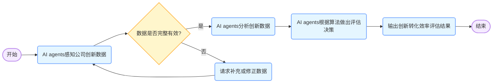

# AI agents在公司创新转化效率评估中的应用

> 关键词：AI agents、公司创新转化效率评估、创新指标、数据驱动、机器学习算法

> 摘要：本文聚焦于AI agents在公司创新转化效率评估中的应用。首先介绍了相关背景，包括目的、预期读者等内容。接着阐述了AI agents和公司创新转化效率评估的核心概念及联系，通过流程图直观展示其关系。详细讲解了核心算法原理，并用Python代码进行示例。同时给出了相关数学模型和公式，结合实例进行说明。在项目实战部分，从开发环境搭建到源代码实现及解读，深入分析了如何运用AI agents进行评估。还探讨了实际应用场景，推荐了学习资源、开发工具框架和相关论文著作。最后总结了未来发展趋势与挑战，提供了常见问题解答和扩展阅读参考资料，旨在为企业利用AI agents提升创新转化效率评估水平提供全面的技术指导。

## 1. 背景介绍 
### 1.1 目的和范围
在当今竞争激烈的商业环境中，公司的创新能力和创新转化效率成为决定其生存和发展的关键因素。准确评估公司的创新转化效率，有助于企业了解自身的创新优势和不足，及时调整创新策略，提高资源利用效率。本文章的目的在于探讨如何运用AI agents技术来进行公司创新转化效率的评估，通过引入先进的人工智能技术，提高评估的准确性、客观性和效率。

文章的范围主要涵盖AI agents的基本概念、核心算法原理，以及如何将其应用于公司创新转化效率评估的具体流程。同时，会结合实际案例进行详细分析，展示AI agents在评估过程中的实际应用效果。

### 1.2 预期读者
本文的预期读者包括企业管理人员、创新管理专家、人工智能研究人员以及对公司创新和人工智能应用感兴趣的技术爱好者。企业管理人员可以从中了解如何利用AI agents提升公司创新转化效率评估的水平，为企业的创新决策提供有力支持；创新管理专家可以借鉴文中的方法和思路，优化现有的创新评估体系；人工智能研究人员可以关注AI agents在特定领域的应用，探索新的研究方向；技术爱好者则可以通过本文了解AI agents的实际应用场景，拓宽技术视野。

### 1.3 文档结构概述
本文将按照以下结构进行组织：
- 核心概念与联系：介绍AI agents和公司创新转化效率评估的基本概念，以及它们之间的联系，并通过文本示意图和Mermaid流程图进行直观展示。
- 核心算法原理 & 具体操作步骤：详细讲解用于评估的核心算法原理，并用Python代码实现具体操作步骤。
- 数学模型和公式 & 详细讲解 & 举例说明：给出相关的数学模型和公式，进行详细讲解，并结合实际例子说明其应用。
- 项目实战：代码实际案例和详细解释说明：从开发环境搭建开始，逐步实现利用AI agents进行公司创新转化效率评估的代码，并对代码进行详细解读。
- 实际应用场景：探讨AI agents在公司创新转化效率评估中的实际应用场景。
- 工具和资源推荐：推荐学习资源、开发工具框架和相关论文著作。
- 总结：未来发展趋势与挑战：总结AI agents在公司创新转化效率评估中的应用现状，分析未来发展趋势和面临的挑战。
- 附录：常见问题与解答：解答读者在阅读过程中可能遇到的常见问题。
- 扩展阅读 & 参考资料：提供相关的扩展阅读资料和参考书目。

### 1.4 术语表
#### 1.4.1 核心术语定义
- **AI agents（人工智能代理）**：是一种能够感知环境、自主决策并采取行动以实现特定目标的人工智能实体。它可以根据预设的规则或通过学习来适应不同的环境，与环境进行交互并完成任务。
- **公司创新转化效率评估**：指对公司将创新投入（如研发资金、人力等）转化为创新产出（如新产品、新技术、新市场份额等）的效率进行量化评估的过程。
- **创新指标**：用于衡量公司创新活动和创新成果的各种量化指标，如研发投入强度、专利数量、新产品销售收入等。

#### 1.4.2 相关概念解释
- **机器学习**：是一门多领域交叉学科，涉及概率论、统计学、逼近论、凸分析、算法复杂度理论等多门学科。它专门研究计算机怎样模拟或实现人类的学习行为，以获取新的知识或技能，重新组织已有的知识结构使之不断改善自身的性能。在公司创新转化效率评估中，机器学习算法可以用于分析大量的创新数据，挖掘数据中的潜在模式和规律。
- **数据驱动决策**：指在决策过程中，充分利用数据和数据分析工具，基于数据所反映的事实和趋势来做出决策，而不是仅仅依靠经验和直觉。在公司创新转化效率评估中，通过收集和分析各种创新数据，利用AI agents进行评估，为企业的创新决策提供数据支持。

#### 1.4.3 缩略词列表
- **ML（Machine Learning）**：机器学习
- **AI（Artificial Intelligence）**：人工智能

## 2. 核心概念与联系 
### 核心概念原理
#### AI agents原理
AI agents的核心原理是基于感知、决策和行动的循环过程。它通过传感器感知环境信息，然后根据内部的决策机制对这些信息进行处理和分析，做出决策，最后通过执行器采取相应的行动。在公司创新转化效率评估中，AI agents可以作为一个智能的评估工具，感知公司的创新数据（如研发投入、专利申请情况等），运用内置的算法进行分析和决策，最终输出对公司创新转化效率的评估结果。

#### 公司创新转化效率评估原理
公司创新转化效率评估的原理是通过建立一系列的创新指标体系，对公司的创新投入和产出进行量化分析。将创新投入指标（如研发资金、研发人员数量等）与创新产出指标（如专利数量、新产品销售收入等）进行对比，计算出创新转化效率的量化值。评估过程需要考虑多个因素，如创新活动的复杂性、市场环境的变化等，以确保评估结果的准确性和可靠性。

### 架构的文本示意图
```plaintext
+---------------------+              +----------------------+
|      AI agents      |              | 公司创新数据来源     |
|                     |              |                      |
|  - 数据感知模块     | <----------> |  - 内部数据库         |
|  - 数据分析模块     |              |  - 外部市场数据       |
|  - 决策输出模块     |              |  - 行业报告等         |
+---------------------+              +----------------------+
                              |
                              v
+---------------------+
| 创新转化效率评估结果 |
|                     |
|  - 量化评估值       |
|  - 评估报告         |
+---------------------+
```

### Mermaid流程图


## 3. 核心算法原理 & 具体操作步骤 
### 核心算法原理
在公司创新转化效率评估中，我们可以使用多元线性回归算法来建立创新投入和产出之间的关系模型。多元线性回归是一种用于分析多个自变量与一个因变量之间线性关系的统计方法。其基本原理是通过最小化实际观测值与模型预测值之间的误差平方和，来确定最佳的回归系数。

假设我们有 $n$ 个样本，每个样本包含 $m$ 个创新投入指标 $x_{i1}, x_{i2}, \cdots, x_{im}$ 和一个创新产出指标 $y_i$，其中 $i = 1, 2, \cdots, n$。多元线性回归模型可以表示为：

$$y_i = \beta_0 + \beta_1x_{i1} + \beta_2x_{i2} + \cdots + \beta_mx_{im} + \epsilon_i$$

其中，$\beta_0$ 是截距项，$\beta_1, \beta_2, \cdots, \beta_m$ 是回归系数，$\epsilon_i$ 是误差项。

我们的目标是找到一组最优的回归系数 $\hat{\beta}_0, \hat{\beta}_1, \cdots, \hat{\beta}_m$，使得误差平方和 $SSE$ 最小：

$$SSE = \sum_{i=1}^{n}(y_i - \hat{y}_i)^2 = \sum_{i=1}^{n}(y_i - (\hat{\beta}_0 + \hat{\beta}_1x_{i1} + \hat{\beta}_2x_{i2} + \cdots + \hat{\beta}_mx_{im}))^2$$

### 具体操作步骤
#### 步骤1：数据收集与预处理
收集公司的创新投入和产出数据，包括研发资金、研发人员数量、专利数量、新产品销售收入等。对数据进行清洗，处理缺失值和异常值，然后进行标准化处理，以消除不同指标之间的量纲差异。

#### 步骤2：模型训练
将预处理后的数据分为训练集和测试集，使用训练集数据来训练多元线性回归模型，通过最小化误差平方和来估计回归系数。

#### 步骤3：模型评估
使用测试集数据对训练好的模型进行评估，计算模型的评估指标，如均方误差（MSE）、决定系数（$R^2$）等，以评估模型的性能。

#### 步骤4：创新转化效率评估
使用训练好的模型对公司的创新转化效率进行评估，将公司的创新投入指标代入模型中，得到预测的创新产出值，然后与实际的创新产出值进行对比，计算创新转化效率。

### Python源代码实现
```python
import numpy as np
from sklearn.linear_model import LinearRegression
from sklearn.model_selection import train_test_split
from sklearn.preprocessing import StandardScaler
from sklearn.metrics import mean_squared_error, r2_score

# 步骤1：数据收集与预处理
# 假设我们有以下创新投入和产出数据
# 创新投入指标：研发资金、研发人员数量
X = np.array([[100, 10], [200, 20], [300, 30], [400, 40], [500, 50]])
# 创新产出指标：新产品销售收入
y = np.array([200, 400, 600, 800, 1000])

# 数据标准化处理
scaler = StandardScaler()
X_scaled = scaler.fit_transform(X)

# 步骤2：模型训练
# 划分训练集和测试集
X_train, X_test, y_train, y_test = train_test_split(X_scaled, y, test_size=0.2, random_state=42)

# 创建多元线性回归模型
model = LinearRegression()
# 训练模型
model.fit(X_train, y_train)

# 步骤3：模型评估
# 预测测试集数据
y_pred = model.predict(X_test)

# 计算评估指标
mse = mean_squared_error(y_test, y_pred)
r2 = r2_score(y_test, y_pred)

print(f"均方误差 (MSE): {mse}")
print(f"决定系数 (R^2): {r2}")

# 步骤4：创新转化效率评估
# 假设我们要评估一个新公司的创新转化效率
new_company_input = np.array([[600, 60]])
# 数据标准化处理
new_company_input_scaled = scaler.transform(new_company_input)
# 预测创新产出
predicted_output = model.predict(new_company_input_scaled)

# 假设该公司的实际创新产出为 1200
actual_output = 1200
# 计算创新转化效率
efficiency = predicted_output / actual_output
print(f"创新转化效率: {efficiency[0]}")
```

## 4. 数学模型和公式 & 详细讲解 & 举例说明 
### 数学模型和公式
#### 多元线性回归模型
如前文所述，多元线性回归模型的一般形式为：

$$y_i = \beta_0 + \beta_1x_{i1} + \beta_2x_{i2} + \cdots + \beta_mx_{im} + \epsilon_i$$

其中，$y_i$ 是第 $i$ 个样本的因变量（创新产出指标），$x_{i1}, x_{i2}, \cdots, x_{im}$ 是第 $i$ 个样本的自变量（创新投入指标），$\beta_0$ 是截距项，$\beta_1, \beta_2, \cdots, \beta_m$ 是回归系数，$\epsilon_i$ 是误差项，假设 $\epsilon_i$ 服从均值为 0，方差为 $\sigma^2$ 的正态分布。

#### 误差平方和（SSE）
误差平方和用于衡量模型预测值与实际观测值之间的差异，其计算公式为：

$$SSE = \sum_{i=1}^{n}(y_i - \hat{y}_i)^2 = \sum_{i=1}^{n}(y_i - (\hat{\beta}_0 + \hat{\beta}_1x_{i1} + \hat{\beta}_2x_{i2} + \cdots + \hat{\beta}_mx_{im}))^2$$

其中，$\hat{y}_i$ 是模型的预测值，$\hat{\beta}_0, \hat{\beta}_1, \cdots, \hat{\beta}_m$ 是估计的回归系数。

#### 均方误差（MSE）
均方误差是误差平方和的平均值，用于评估模型的预测误差，其计算公式为：

$$MSE = \frac{1}{n}\sum_{i=1}^{n}(y_i - \hat{y}_i)^2$$

#### 决定系数（$R^2$）
决定系数用于衡量模型对数据的拟合程度，其取值范围在 0 到 1 之间，越接近 1 表示模型拟合效果越好。其计算公式为：

$$R^2 = 1 - \frac{SSE}{SST}$$

其中，$SST = \sum_{i=1}^{n}(y_i - \bar{y})^2$ 是总离差平方和，$\bar{y}$ 是因变量的均值。

### 详细讲解
#### 多元线性回归模型
多元线性回归模型假设因变量与自变量之间存在线性关系，通过估计回归系数来确定这种线性关系的具体形式。在公司创新转化效率评估中，我们可以将创新投入指标作为自变量，创新产出指标作为因变量，建立多元线性回归模型，以预测公司的创新产出。

#### 误差平方和（SSE）
误差平方和是评估模型拟合效果的重要指标，我们的目标是找到一组回归系数，使得误差平方和最小。通过最小化误差平方和，可以得到最优的回归系数估计值。

#### 均方误差（MSE）
均方误差是误差平方和的平均值，它消除了样本数量的影响，更直观地反映了模型的预测误差。MSE 值越小，说明模型的预测效果越好。

#### 决定系数（$R^2$）
决定系数表示模型能够解释的因变量变异的比例。例如，$R^2 = 0.8$ 表示模型能够解释因变量 80% 的变异，剩下的 20% 由其他未考虑的因素解释。$R^2$ 值越接近 1，说明模型对数据的拟合效果越好。

### 举例说明
假设我们有以下公司创新数据：

| 研发资金（万元） | 研发人员数量 | 新产品销售收入（万元） |
|------------------|--------------|------------------------|
| 100              | 10           | 200                    |
| 200              | 20           | 400                    |
| 300              | 30           | 600                    |
| 400              | 40           | 800                    |
| 500              | 50           | 1000                   |

我们使用这些数据来建立多元线性回归模型，预测新产品销售收入。通过训练模型，我们得到回归系数 $\hat{\beta}_0 = 0$，$\hat{\beta}_1 = 2$，$\hat{\beta}_2 = 0$（假设）。

对于一个新的公司，其研发资金为 600 万元，研发人员数量为 60 人，我们可以使用模型预测其新产品销售收入：

$$\hat{y} = \hat{\beta}_0 + \hat{\beta}_1x_1 + \hat{\beta}_2x_2 = 0 + 2\times600 + 0\times60 = 1200$$

假设该公司的实际新产品销售收入为 1200 万元，我们可以计算创新转化效率：

$$效率 = \frac{预测值}{实际值} = \frac{1200}{1200} = 1$$

这表示该公司的创新转化效率达到了 100%。

## 5. 项目实战：代码实际案例和详细解释说明 
### 5.1  开发环境搭建
#### 操作系统
本项目可以在 Windows、Linux 或 macOS 操作系统上进行开发，建议使用最新版本的操作系统以确保兼容性和稳定性。

#### Python环境
安装 Python 3.7 及以上版本，可以从 Python 官方网站（https://www.python.org/downloads/）下载安装包进行安装。安装完成后，建议使用虚拟环境来管理项目的依赖包，以避免不同项目之间的依赖冲突。可以使用 `venv` 或 `conda` 来创建虚拟环境。

以下是使用 `venv` 创建虚拟环境的示例：

```bash
# 创建虚拟环境
python -m venv myenv

# 激活虚拟环境
# Windows
myenv\Scripts\activate
# Linux/macOS
source myenv/bin/activate
```

#### 依赖包安装
在激活虚拟环境后，使用 `pip` 安装项目所需的依赖包，主要包括 `numpy`、`pandas`、`scikit-learn` 等。

```bash
pip install numpy pandas scikit-learn
```

### 5.2  源代码详细实现和代码解读
```python
import numpy as np
import pandas as pd
from sklearn.linear_model import LinearRegression
from sklearn.model_selection import train_test_split
from sklearn.preprocessing import StandardScaler
from sklearn.metrics import mean_squared_error, r2_score

# 步骤1：数据加载与预处理
# 假设我们有一个包含创新投入和产出数据的 CSV 文件
data = pd.read_csv('innovation_data.csv')

# 提取创新投入指标和创新产出指标
X = data[['R&D_funding', 'R&D_staff']].values
y = data['New_product_sales'].values

# 数据标准化处理
scaler = StandardScaler()
X_scaled = scaler.fit_transform(X)

# 步骤2：模型训练
# 划分训练集和测试集
X_train, X_test, y_train, y_test = train_test_split(X_scaled, y, test_size=0.2, random_state=42)

# 创建多元线性回归模型
model = LinearRegression()
# 训练模型
model.fit(X_train, y_train)

# 步骤3：模型评估
# 预测测试集数据
y_pred = model.predict(X_test)

# 计算评估指标
mse = mean_squared_error(y_test, y_pred)
r2 = r2_score(y_test, y_pred)

print(f"均方误差 (MSE): {mse}")
print(f"决定系数 (R^2): {r2}")

# 步骤4：创新转化效率评估
# 假设我们要评估一个新公司的创新转化效率
new_company_data = pd.DataFrame({
    'R&D_funding': [600],
    'R&D_staff': [60]
})
new_company_input = new_company_data.values
# 数据标准化处理
new_company_input_scaled = scaler.transform(new_company_input)
# 预测创新产出
predicted_output = model.predict(new_company_input_scaled)

# 假设该公司的实际创新产出为 1200
actual_output = 1200
# 计算创新转化效率
efficiency = predicted_output / actual_output
print(f"创新转化效率: {efficiency[0]}")
```

### 代码解读与分析
#### 数据加载与预处理
- 使用 `pandas` 库的 `read_csv` 函数加载包含创新投入和产出数据的 CSV 文件。
- 提取创新投入指标（研发资金和研发人员数量）和创新产出指标（新产品销售收入）。
- 使用 `StandardScaler` 对创新投入数据进行标准化处理，以消除不同指标之间的量纲差异。

#### 模型训练
- 使用 `train_test_split` 函数将数据划分为训练集和测试集，其中测试集占总数据的 20%。
- 创建 `LinearRegression` 模型，并使用训练集数据进行训练。

#### 模型评估
- 使用训练好的模型对测试集数据进行预测，得到预测的创新产出值。
- 计算均方误差（MSE）和决定系数（$R^2$），以评估模型的性能。

#### 创新转化效率评估
- 对于一个新的公司，构造其创新投入数据，并进行标准化处理。
- 使用训练好的模型预测该公司的创新产出值。
- 假设该公司的实际创新产出值，计算创新转化效率。

## 6. 实际应用场景 
### 企业内部创新管理
企业可以利用AI agents对不同部门或项目的创新转化效率进行评估，及时发现创新过程中的问题和瓶颈。例如，通过对比不同研发部门的创新转化效率，找出效率低下的部门，分析原因并采取针对性的改进措施，如调整研发策略、优化资源配置等。同时，AI agents可以持续监测创新项目的进展，为企业管理层提供实时的评估报告，帮助他们做出科学的创新决策。

### 投资决策参考
投资者在选择投资对象时，通常会关注企业的创新能力和创新转化效率。AI agents可以为投资者提供客观、准确的评估结果，帮助他们筛选出具有高创新潜力和高转化效率的企业。例如，在评估一家科技初创公司时，AI agents可以分析其研发投入、专利申请情况、新产品市场表现等数据，计算出创新转化效率，为投资者提供决策参考。

### 行业竞争分析
企业可以利用AI agents对整个行业的创新转化效率进行评估和分析，了解自身在行业中的地位和竞争力。通过与行业平均水平或竞争对手进行对比，发现自身的优势和不足，及时调整创新策略，以提高市场竞争力。例如，一家制造业企业可以通过分析行业内其他企业的创新转化效率，发现行业的创新趋势和热点，从而调整自身的研发方向和产品布局。

### 政府政策制定
政府部门在制定创新政策时，需要了解企业的创新现状和需求。AI agents可以为政府提供全面、准确的企业创新数据和评估结果，帮助政府制定更加科学、有效的创新政策。例如，政府可以根据AI agents的评估结果，确定重点扶持的创新领域和企业，加大对创新的投入和支持力度，促进整个行业的创新发展。

## 7. 工具和资源推荐
### 7.1 学习资源推荐
#### 7.1.1 书籍推荐
- 《Python机器学习》：本书全面介绍了Python在机器学习领域的应用，包括各种机器学习算法的原理、实现和应用案例，适合初学者和有一定基础的读者。
- 《人工智能：一种现代的方法》：这是一本经典的人工智能教材，涵盖了人工智能的各个方面，包括搜索算法、知识表示、机器学习、自然语言处理等，是学习人工智能的必备书籍。
- 《创新管理》：本书系统地介绍了创新管理的理论和方法，包括创新战略、创新流程、创新评估等内容，对于理解公司创新转化效率评估具有重要的参考价值。

#### 7.1.2 在线课程
- Coursera上的“机器学习”课程：由斯坦福大学教授Andrew Ng主讲，是一门非常经典的机器学习课程，适合初学者入门。
- edX上的“人工智能基础”课程：该课程全面介绍了人工智能的基本概念、算法和应用，帮助学习者建立人工智能的基础知识体系。
- 中国大学MOOC上的“创新管理与创业”课程：课程结合了实际案例，介绍了创新管理的理论和方法，对于企业管理人员和创新爱好者具有很大的帮助。

#### 7.1.3 技术博客和网站
- Medium：是一个知名的技术博客平台，上面有很多关于人工智能、机器学习和创新管理的优秀文章，作者来自世界各地的技术专家和学者。
- Towards Data Science：专注于数据科学和机器学习领域的技术博客，提供了大量的技术文章、教程和案例分析。
- 创新前沿网：专门关注企业创新和创业领域的网站，提供了最新的创新动态、研究报告和案例分析。

### 7.2 开发工具框架推荐
#### 7.2.1 IDE和编辑器
- PyCharm：是一款专门为Python开发设计的集成开发环境（IDE），具有强大的代码编辑、调试、自动补全和项目管理功能，适合开发大型Python项目。
- Jupyter Notebook：是一个交互式的开发环境，支持Python、R等多种编程语言，非常适合进行数据探索、模型开发和可视化。
- Visual Studio Code：是一款轻量级的代码编辑器，支持多种编程语言和插件扩展，具有丰富的功能和良好的用户体验。

#### 7.2.2 调试和性能分析工具
- pdb：是Python自带的调试工具，可以帮助开发者在代码中设置断点、单步执行、查看变量值等，方便调试代码。
- cProfile：是Python的性能分析工具，可以分析代码的执行时间和函数调用次数，帮助开发者找出代码中的性能瓶颈。
- TensorBoard：是TensorFlow的可视化工具，可以用于可视化训练过程、模型结构和数据分布等，方便开发者进行模型调试和优化。

#### 7.2.3 相关框架和库
- Scikit-learn：是一个常用的机器学习库，提供了各种机器学习算法的实现，如分类、回归、聚类等，方便开发者快速实现机器学习模型。
- TensorFlow：是一个开源的深度学习框架，由Google开发，广泛应用于图像识别、自然语言处理等领域。
- PyTorch：是另一个流行的深度学习框架，具有动态图和易于使用的特点，受到了很多研究者和开发者的喜爱。

### 7.3 相关论文著作推荐
#### 7.3.1 经典论文
- “Machine Learning” by Tom M. Mitchell：这是机器学习领域的经典教材，对机器学习的基本概念、算法和理论进行了系统的介绍。
- “A Mathematical Theory of Communication” by Claude E. Shannon：这篇论文奠定了信息论的基础，对于理解数据处理和信息传输具有重要的意义。
- “The Nature of Technology: What It Is and How It Evolves” by W. Brian Arthur：本书探讨了技术的本质和演化规律，对于理解企业创新和技术发展具有重要的启示。

#### 7.3.2 最新研究成果
- 在IEEE Transactions on Engineering Management、Research Policy等学术期刊上发表的关于创新管理和人工智能应用的最新研究论文，这些论文反映了该领域的最新研究动态和前沿成果。
- 国际学术会议如ACM SIGKDD、NeurIPS等上的相关研究报告，展示了最新的人工智能算法和应用案例。

#### 7.3.3 应用案例分析
- 《创新的扩散》：本书通过大量的案例分析，介绍了创新在不同领域的扩散过程和影响因素，对于企业创新管理具有重要的参考价值。
- 《精益创业》：书中提出了精益创业的理念和方法，通过实际案例展示了如何快速验证创新想法，提高创新成功率。

## 8. 总结：未来发展趋势与挑战
### 未来发展趋势
#### 智能化程度不断提高
随着人工智能技术的不断发展，AI agents在公司创新转化效率评估中的智能化程度将不断提高。未来的AI agents将能够更加自主地感知环境、分析数据、做出决策，并且能够不断学习和进化，以适应不同的评估场景和需求。

#### 与其他技术的融合更加深入
AI agents将与大数据、区块链、物联网等技术更加深入地融合。例如，通过与物联网技术结合，AI agents可以实时获取公司的创新数据，提高评估的及时性和准确性；通过与区块链技术结合，可以保证数据的安全性和可信度。

#### 应用场景不断拓展
除了现有的企业内部创新管理、投资决策参考、行业竞争分析和政府政策制定等应用场景，AI agents在公司创新转化效率评估中的应用场景将不断拓展。例如，在供应链创新、商业模式创新等领域，AI agents也将发挥重要的作用。

### 挑战
#### 数据质量和安全性问题
AI agents的评估结果高度依赖于数据的质量和安全性。如果数据存在缺失值、异常值或错误，将影响评估结果的准确性。同时，公司的创新数据往往包含敏感信息，如研发机密、商业策略等，如何保证数据的安全性是一个重要的挑战。

#### 算法可解释性问题
目前，一些复杂的人工智能算法（如深度学习算法）的可解释性较差，难以理解算法的决策过程和依据。在公司创新转化效率评估中，决策者需要了解评估结果的依据和合理性，因此提高算法的可解释性是一个亟待解决的问题。

#### 人才短缺问题
AI agents在公司创新转化效率评估中的应用需要既懂人工智能技术又懂创新管理的复合型人才。目前，这类人才相对短缺，如何培养和吸引更多的复合型人才是企业和学术界面临的共同挑战。

## 9. 附录：常见问题与解答
### 问题1：AI agents在评估公司创新转化效率时，需要收集哪些数据？
答：一般需要收集公司的创新投入数据，如研发资金、研发人员数量、研发设备投入等；创新产出数据，如专利数量、新产品销售收入、新技术应用数量等；以及其他相关数据，如市场份额、客户满意度等。具体的数据收集需求可以根据评估的目的和要求进行调整。

### 问题2：如何选择合适的评估算法？
答：选择合适的评估算法需要考虑多个因素，如数据的特点、评估的目的和要求、算法的复杂度和可解释性等。对于简单的线性关系数据，可以选择多元线性回归算法；对于复杂的非线性关系数据，可以选择深度学习算法等。同时，需要根据算法的评估指标（如均方误差、决定系数等）来评估算法的性能，选择性能最优的算法。

### 问题3：AI agents的评估结果是否可靠？
答：AI agents的评估结果的可靠性取决于多个因素，如数据的质量、算法的选择和优化、模型的训练和评估等。如果数据质量高、算法选择合适、模型训练和评估得当，AI agents的评估结果是比较可靠的。但是，由于创新过程本身具有不确定性和复杂性，评估结果只能作为参考，不能完全替代人类的判断和决策。

### 问题4：如何提高AI agents在评估中的性能？
答：可以从以下几个方面提高AI agents在评估中的性能：
- 提高数据质量：收集准确、完整、可靠的数据，并进行有效的预处理。
- 优化算法：选择合适的算法，并对算法进行优化和调整。
- 增加数据量：增加训练数据的数量，可以提高模型的泛化能力。
- 进行模型融合：将多个不同的模型进行融合，可以提高评估结果的准确性和稳定性。

## 10. 扩展阅读 & 参考资料
### 扩展阅读
- 《人工智能时代的企业创新》：深入探讨了人工智能技术对企业创新的影响和机遇，以及企业如何在人工智能时代进行创新管理。
- 《数字化转型：从战略到执行》：介绍了企业数字化转型的理论和实践，包括如何利用人工智能等技术推动企业的创新和发展。
- 《创新的艺术》：通过大量的案例和故事，介绍了创新的方法和技巧，对于激发创新思维具有很大的帮助。

### 参考资料
- [Scikit-learn官方文档](https://scikit-learn.org/stable/documentation.html)
- [TensorFlow官方文档](https://www.tensorflow.org/api_docs)
- [PyTorch官方文档](https://pytorch.org/docs/stable/index.html)

作者：AI天才研究院/AI Genius Institute & 禅与计算机程序设计艺术 /Zen And The Art of Computer Programming