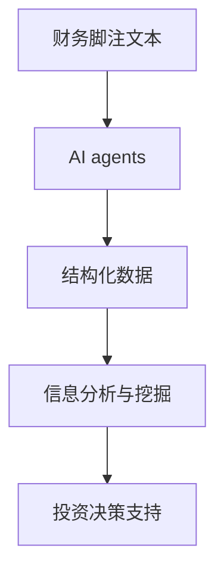

# AI agents辅助价值投资者解读复杂的财务脚注

> 关键词：AI agents、价值投资者、财务脚注、自然语言处理、数据分析、投资决策、财务解读

> 摘要：本文聚焦于AI agents在辅助价值投资者解读复杂财务脚注方面的应用。首先介绍了相关背景，包括目的范围、预期读者等。接着阐述了核心概念与联系，通过文本示意图和Mermaid流程图呈现其架构。详细讲解了核心算法原理，用Python代码进行说明，并给出了数学模型和公式。通过项目实战展示了具体实现过程，分析了代码。探讨了实际应用场景，推荐了相关工具和资源。最后总结了未来发展趋势与挑战，还设置了附录解答常见问题，并提供了扩展阅读与参考资料，旨在为价值投资者借助AI agents更好地解读财务脚注提供全面而深入的指导。

## 1. 背景介绍 
### 1.1 目的和范围
在金融投资领域，价值投资者往往依赖财务报表来评估公司的内在价值。然而，财务报表中的脚注部分包含了大量复杂、详细且非结构化的信息，这些信息对于准确理解公司的财务状况和经营成果至关重要，但却难以被投资者快速、准确地解读。本文章的目的在于探讨如何利用AI agents来辅助价值投资者解读这些复杂的财务脚注，提高投资决策的准确性和效率。

本文的范围涵盖了AI agents的相关技术原理、如何应用于财务脚注解读、实际案例分析以及未来发展趋势等方面。将从技术和投资实践的角度出发，全面深入地分析这一领域的相关问题。

### 1.2 预期读者
本文预期读者主要包括价值投资者，他们希望借助先进的技术手段更高效地解读财务信息，提升投资决策的质量；金融分析师，需要对公司财务状况进行深入研究，AI agents的应用可以为他们提供新的分析工具和思路；以及对人工智能在金融领域应用感兴趣的技术人员和研究人员，他们可以从中了解相关技术的具体应用场景和实践经验。

### 1.3 文档结构概述
本文首先介绍背景信息，让读者了解研究的目的和范围。接着阐述核心概念与联系，包括AI agents和财务脚注解读的相关原理和架构。然后详细讲解核心算法原理和具体操作步骤，并用Python代码进行说明。随后给出数学模型和公式，帮助读者从理论层面理解。通过项目实战展示代码的实际应用和详细解释。探讨实际应用场景，让读者了解其实际价值。推荐相关的工具和资源，为读者提供学习和实践的途径。最后总结未来发展趋势与挑战，设置附录解答常见问题，并提供扩展阅读与参考资料。

### 1.4 术语表
#### 1.4.1 核心术语定义
- **AI agents（人工智能智能体）**：是一种能够感知环境、自主决策并采取行动以实现特定目标的人工智能实体。在本文中，主要指能够处理财务脚注文本信息的智能程序。
- **价值投资者**：遵循价值投资理念，通过分析公司的财务状况、经营业绩等基本面因素，寻找被低估的股票进行投资的投资者。
- **财务脚注**：是对财务报表中各项数据的详细说明和补充，包含了公司的会计政策、重大事项、或有事项等重要信息。

#### 1.4.2 相关概念解释
- **自然语言处理（NLP）**：是人工智能的一个分支，主要研究如何让计算机理解和处理人类语言。在解读财务脚注时，NLP技术可以用于文本分类、信息提取、情感分析等任务。
- **数据分析**：是指对大量数据进行收集、整理、分析和解释的过程。在财务脚注解读中，数据分析可以帮助投资者发现数据中的规律和趋势，评估公司的财务状况。

#### 1.4.3 缩略词列表
- **NLP**：自然语言处理（Natural Language Processing）
- **AI**：人工智能（Artificial Intelligence）

## 2. 核心概念与联系 

### 核心概念原理
AI agents辅助价值投资者解读复杂的财务脚注主要基于自然语言处理和数据分析技术。AI agents通过对财务脚注文本的处理，将非结构化的文本信息转化为结构化的数据，然后进行分析和挖掘，提取出有价值的信息，为价值投资者提供决策支持。

自然语言处理技术包括文本预处理、词性标注、命名实体识别、句法分析等步骤。通过这些步骤，AI agents可以理解财务脚注文本的语义和语法结构，提取出关键信息，如公司的会计政策、重大事项、或有事项等。

数据分析技术则用于对提取出的信息进行进一步的分析和挖掘。通过统计分析、机器学习等方法，AI agents可以发现数据中的规律和趋势，评估公司的财务状况和经营风险，为价值投资者提供投资建议。

### 架构的文本示意图
```plaintext
                +----------------+
                |  财务脚注文本  |
                +----------------+
                        |
                        v
                +----------------+
                |  AI agents     |
                |  - 自然语言处理 |
                |  - 数据分析     |
                +----------------+
                        |
                        v
                +----------------+
                |  结构化数据    |
                +----------------+
                        |
                        v
                +----------------+
                |  信息分析与挖掘 |
                +----------------+
                        |
                        v
                +----------------+
                |  投资决策支持  |
                +----------------+
```

### Mermaid流程图


## 3. 核心算法原理 & 具体操作步骤 

### 核心算法原理
在AI agents辅助解读财务脚注的过程中，核心算法主要包括自然语言处理算法和数据分析算法。

#### 自然语言处理算法
- **文本预处理**：包括去除停用词、标点符号，将文本转换为小写等操作，以减少噪声数据对后续处理的影响。
- **命名实体识别（NER）**：识别文本中的命名实体，如公司名称、人名、日期、金额等，有助于提取关键信息。
- **文本分类**：将财务脚注文本分类到不同的类别中，如会计政策、重大事项、或有事项等，方便后续的分析和处理。

#### 数据分析算法
- **统计分析**：对提取出的信息进行统计分析，如计算平均值、中位数、标准差等，以了解数据的基本特征。
- **机器学习算法**：如决策树、随机森林、支持向量机等，用于对公司的财务状况和经营风险进行评估和预测。

### 具体操作步骤
#### 步骤1：数据收集
收集公司的财务报表和相关的财务脚注文本数据。可以从公司的官方网站、证券交易所网站等渠道获取。

#### 步骤2：文本预处理
使用Python代码进行文本预处理，示例代码如下：
```python
import re
import nltk
from nltk.corpus import stopwords
from nltk.tokenize import word_tokenize

nltk.download('stopwords')
nltk.download('punkt')

def preprocess_text(text):
    # 去除标点符号
    text = re.sub(r'[^\w\s]', '', text)
    # 转换为小写
    text = text.lower()
    # 分词
    tokens = word_tokenize(text)
    # 去除停用词
    stop_words = set(stopwords.words('english'))
    filtered_tokens = [token for token in tokens if token not in stop_words]
    # 拼接成文本
    preprocessed_text = ' '.join(filtered_tokens)
    return preprocessed_text

# 示例文本
text = "This is a sample financial footnote text, containing some important information."
preprocessed_text = preprocess_text(text)
print(preprocessed_text)
```

#### 步骤3：命名实体识别
使用Python的`spaCy`库进行命名实体识别，示例代码如下：
```python
import spacy

nlp = spacy.load('en_core_web_sm')

def named_entity_recognition(text):
    doc = nlp(text)
    entities = [(ent.text, ent.label_) for ent in doc.ents]
    return entities

# 示例文本
text = "Apple Inc. reported a revenue of $100 million in 2023."
entities = named_entity_recognition(text)
print(entities)
```

#### 步骤4：文本分类
使用Python的`sklearn`库进行文本分类，示例代码如下：
```python
from sklearn.feature_extraction.text import TfidfVectorizer
from sklearn.naive_bayes import MultinomialNB
from sklearn.pipeline import Pipeline

# 示例数据
texts = ["This is an accounting policy footnote.", "This is a significant event footnote."]
labels = ["accounting_policy", "significant_event"]

# 构建分类器
classifier = Pipeline([
    ('vectorizer', TfidfVectorizer()),
    ('classifier', MultinomialNB())
])

# 训练分类器
classifier.fit(texts, labels)

# 预测
new_text = "This is another accounting policy footnote."
predicted_label = classifier.predict([new_text])
print(predicted_label)
```

#### 步骤5：数据分析
使用Python的`pandas`和`scikit-learn`库进行数据分析，示例代码如下：
```python
import pandas as pd
from sklearn.ensemble import RandomForestClassifier

# 示例数据
data = {
    'feature1': [1, 2, 3, 4, 5],
    'feature2': [5, 4, 3, 2, 1],
    'label': [0, 1, 0, 1, 0]
}
df = pd.DataFrame(data)

# 特征和标签
X = df[['feature1', 'feature2']]
y = df['label']

# 训练随机森林分类器
model = RandomForestClassifier()
model.fit(X, y)

# 预测
new_data = pd.DataFrame({'feature1': [6], 'feature2': [0]})
predicted_label = model.predict(new_data)
print(predicted_label)
```

## 4. 数学模型和公式 & 详细讲解 & 举例说明 

### 自然语言处理中的数学模型
#### 词袋模型（Bag of Words）
词袋模型是一种简单的文本表示方法，它将文本看作是一个词的集合，不考虑词的顺序。每个文本可以表示为一个向量，向量的每个维度对应一个词，向量的值表示该词在文本中出现的频率。

设文本集合为 $D = \{d_1, d_2, \cdots, d_n\}$，词汇表为 $V = \{w_1, w_2, \cdots, w_m\}$，则文本 $d_i$ 的词袋向量表示为：

$$\mathbf{x}_i = [x_{i1}, x_{i2}, \cdots, x_{im}]$$

其中 $x_{ij}$ 表示词 $w_j$ 在文本 $d_i$ 中出现的频率。

举例说明：假设有两个文本 $d_1 = "apple banana apple"$ 和 $d_2 = "banana cherry"$，词汇表 $V = \{"apple", "banana", "cherry"\}$，则 $d_1$ 的词袋向量为 $\mathbf{x}_1 = [2, 1, 0]$，$d_2$ 的词袋向量为 $\mathbf{x}_2 = [0, 1, 1]$。

#### TF-IDF模型（Term Frequency - Inverse Document Frequency）
TF-IDF模型是一种常用的文本特征加权方法，它综合考虑了词在文本中的频率和在整个文本集合中的稀有性。

词 $w_j$ 在文本 $d_i$ 中的TF-IDF值定义为：

$$tfidf_{ij} = tf_{ij} \times idf_j$$

其中 $tf_{ij}$ 表示词 $w_j$ 在文本 $d_i$ 中出现的频率，$idf_j$ 表示词 $w_j$ 的逆文档频率，定义为：

$$idf_j = \log \frac{N}{n_j}$$

其中 $N$ 是文本集合中的文本总数，$n_j$ 是包含词 $w_j$ 的文本数。

举例说明：假设有三个文本 $d_1 = "apple banana apple"$，$d_2 = "banana cherry"$，$d_3 = "apple cherry"$，词汇表 $V = \{"apple", "banana", "cherry"\}$。则词 "apple" 在 $d_1$ 中的TF值为 $tf_{11} = 2$，包含 "apple" 的文本数 $n_1 = 2$，文本总数 $N = 3$，则 "apple" 的IDF值为 $idf_1 = \log \frac{3}{2}$，"apple" 在 $d_1$ 中的TF-IDF值为 $tfidf_{11} = 2 \times \log \frac{3}{2}$。

### 数据分析中的数学模型
#### 决策树模型
决策树是一种常用的分类和回归模型，它通过对特征空间进行划分，构建一棵决策树来进行决策。

决策树的每个内部节点对应一个特征的测试，每个分支对应一个测试输出，每个叶节点对应一个类别或一个值。

决策树的构建过程通常基于信息增益、基尼指数等准则。以信息增益为例，信息增益定义为：

$$IG(S, A) = H(S) - \sum_{v \in Values(A)} \frac{|S_v|}{|S|} H(S_v)$$

其中 $S$ 是样本集合，$A$ 是特征，$Values(A)$ 是特征 $A$ 的取值集合，$S_v$ 是 $S$ 中特征 $A$ 取值为 $v$ 的样本子集，$H(S)$ 是样本集合 $S$ 的信息熵，定义为：

$$H(S) = - \sum_{c \in Classes(S)} p(c) \log p(c)$$

其中 $Classes(S)$ 是样本集合 $S$ 的类别集合，$p(c)$ 是样本集合 $S$ 中属于类别 $c$ 的样本比例。

举例说明：假设有一个样本集合 $S$ 包含 10 个样本，其中 6 个属于类别 0，4 个属于类别 1，则 $H(S) = - \frac{6}{10} \log \frac{6}{10} - \frac{4}{10} \log \frac{4}{10}$。假设有一个特征 $A$，其取值集合为 $\{0, 1\}$，$S_0$ 包含 4 个样本，其中 3 个属于类别 0，1 个属于类别 1，$S_1$ 包含 6 个样本，其中 3 个属于类别 0，3 个属于类别 1，则 $IG(S, A) = H(S) - (\frac{4}{10} H(S_0) + \frac{6}{10} H(S_1))$。

## 5. 项目实战：代码实际案例和详细解释说明 

### 5.1  开发环境搭建
#### 安装Python
首先需要安装Python，可以从Python官方网站（https://www.python.org/downloads/） 下载适合自己操作系统的Python版本，并按照安装向导进行安装。

#### 安装必要的库
使用`pip`命令安装必要的库，示例命令如下：
```sh
pip install nltk spacy scikit-learn pandas
```

#### 下载语言模型
对于`spacy`库，需要下载相应的语言模型，示例命令如下：
```sh
python -m spacy download en_core_web_sm
```

### 5.2  源代码详细实现和代码解读
以下是一个完整的示例代码，实现了从财务脚注文本的预处理、命名实体识别、文本分类到数据分析的整个流程：

```python
import re
import nltk
from nltk.corpus import stopwords
from nltk.tokenize import word_tokenize
import spacy
from sklearn.feature_extraction.text import TfidfVectorizer
from sklearn.naive_bayes import MultinomialNB
from sklearn.pipeline import Pipeline
import pandas as pd
from sklearn.ensemble import RandomForestClassifier

# 文本预处理
nltk.download('stopwords')
nltk.download('punkt')

def preprocess_text(text):
    # 去除标点符号
    text = re.sub(r'[^\w\s]', '', text)
    # 转换为小写
    text = text.lower()
    # 分词
    tokens = word_tokenize(text)
    # 去除停用词
    stop_words = set(stopwords.words('english'))
    filtered_tokens = [token for token in tokens if token not in stop_words]
    # 拼接成文本
    preprocessed_text = ' '.join(filtered_tokens)
    return preprocessed_text

# 命名实体识别
nlp = spacy.load('en_core_web_sm')

def named_entity_recognition(text):
    doc = nlp(text)
    entities = [(ent.text, ent.label_) for ent in doc.ents]
    return entities

# 文本分类
texts = ["This is an accounting policy footnote.", "This is a significant event footnote."]
labels = ["accounting_policy", "significant_event"]

classifier = Pipeline([
    ('vectorizer', TfidfVectorizer()),
    ('classifier', MultinomialNB())
])

classifier.fit(texts, labels)

# 数据分析
data = {
    'feature1': [1, 2, 3, 4, 5],
    'feature2': [5, 4, 3, 2, 1],
    'label': [0, 1, 0, 1, 0]
}
df = pd.DataFrame(data)

X = df[['feature1', 'feature2']]
y = df['label']

model = RandomForestClassifier()
model.fit(X, y)

# 示例使用
sample_text = "This is a sample financial footnote containing important information about the company's accounting policy."
preprocessed_sample_text = preprocess_text(sample_text)
print("Preprocessed text:", preprocessed_sample_text)

entities = named_entity_recognition(preprocessed_sample_text)
print("Named entities:", entities)

predicted_label = classifier.predict([preprocessed_sample_text])
print("Predicted label:", predicted_label)

new_data = pd.DataFrame({'feature1': [6], 'feature2': [0]})
predicted_data_label = model.predict(new_data)
print("Predicted data label:", predicted_data_label)
```

### 5.3  代码解读与分析
#### 文本预处理部分
`preprocess_text`函数首先使用正则表达式去除文本中的标点符号，然后将文本转换为小写，接着使用`nltk`库进行分词和去除停用词操作，最后将处理后的词拼接成文本。

#### 命名实体识别部分
`named_entity_recognition`函数使用`spacy`库的语言模型对文本进行处理，提取出文本中的命名实体，并返回一个包含实体文本和实体标签的列表。

#### 文本分类部分
使用`sklearn`库的`TfidfVectorizer`将文本转换为TF-IDF向量，然后使用`MultinomialNB`分类器进行训练和预测。

#### 数据分析部分
使用`pandas`库创建一个数据框，然后使用`sklearn`库的`RandomForestClassifier`进行训练和预测。

## 6. 实际应用场景 
### 投资决策辅助
价值投资者可以利用AI agents解读财务脚注，获取公司的真实财务状况和经营风险信息，从而更准确地评估公司的内在价值，做出更明智的投资决策。例如，通过分析财务脚注中的或有事项，投资者可以了解公司可能面临的潜在风险，避免投资风险较高的公司。

### 财务报表审计
审计人员可以借助AI agents快速、准确地解读财务脚注，发现财务报表中的异常信息和潜在问题，提高审计效率和质量。例如，通过对财务脚注中会计政策变更的分析，审计人员可以评估公司的会计处理是否符合会计准则。

### 金融监管
金融监管机构可以利用AI agents对公司的财务脚注进行监测和分析，及时发现金融市场中的违规行为和风险隐患，维护金融市场的稳定和健康发展。例如，通过对财务脚注中关联交易的分析，监管机构可以发现公司是否存在利益输送等违规行为。

## 7. 工具和资源推荐
### 7.1 学习资源推荐
#### 7.1.1 书籍推荐
- 《自然语言处理入门》：介绍了自然语言处理的基本概念、算法和技术，适合初学者学习。
- 《Python数据分析实战》：详细讲解了Python在数据分析中的应用，包括数据处理、可视化、机器学习等方面。
- 《机器学习》：系统地介绍了机器学习的基本原理、算法和应用，是机器学习领域的经典教材。

#### 7.1.2 在线课程
- Coursera上的“Natural Language Processing Specialization”：由顶尖大学的教授授课，全面介绍了自然语言处理的各个方面。
- edX上的“Data Science MicroMasters Program”：提供了丰富的数据科学课程，包括数据分析、机器学习、深度学习等内容。
- 中国大学MOOC上的“人工智能基础”：适合初学者了解人工智能的基本概念和技术。

#### 7.1.3 技术博客和网站
- Medium：有许多关于人工智能、自然语言处理和金融科技的技术博客文章，提供了最新的技术动态和实践经验。
- Towards Data Science：专注于数据科学和机器学习领域，有大量的优质文章和教程。
- Kaggle：是一个数据科学竞赛平台，上面有许多关于金融数据分析和自然语言处理的竞赛和数据集，可以学习到其他选手的优秀经验和代码。

### 7.2 开发工具框架推荐
#### 7.2.1 IDE和编辑器
- PyCharm：是一款专业的Python集成开发环境，提供了丰富的功能和插件，适合Python开发。
- Visual Studio Code：是一款轻量级的代码编辑器，支持多种编程语言，有许多实用的插件可以提高开发效率。

#### 7.2.2 调试和性能分析工具
- pdb：是Python的内置调试器，可以帮助开发者快速定位和解决代码中的问题。
- cProfile：是Python的性能分析工具，可以分析代码的运行时间和性能瓶颈。

#### 7.2.3 相关框架和库
- NLTK：是Python的自然语言处理工具包，提供了丰富的自然语言处理算法和数据集。
- SpaCy：是一个高效的自然语言处理库，提供了快速的命名实体识别、词性标注等功能。
- Scikit-learn：是Python的机器学习库，提供了各种机器学习算法和工具，方便进行数据分析和模型训练。

### 7.3 相关论文著作推荐
#### 7.3.1 经典论文
- “A Survey of Text Classification Algorithms”：对文本分类算法进行了全面的综述，介绍了各种文本分类算法的原理和应用。
- “Natural Language Processing: An Overview”：对自然语言处理的发展历程、主要任务和技术进行了概述。
- “Machine Learning for Financial Applications”：探讨了机器学习在金融领域的应用，包括风险评估、投资决策等方面。

#### 7.3.2 最新研究成果
- 可以通过IEEE Xplore、ACM Digital Library等学术数据库搜索最新的关于AI agents在金融领域应用的研究论文，了解该领域的最新发展动态。

#### 7.3.3 应用案例分析
- 可以参考一些金融科技公司的研究报告和案例分析，了解AI agents在实际金融业务中的应用效果和经验教训。

## 8. 总结：未来发展趋势与挑战
### 未来发展趋势
#### 更强大的语言理解能力
随着自然语言处理技术的不断发展，AI agents将具备更强大的语言理解能力，能够更准确地解读复杂的财务脚注文本，提取出更有价值的信息。

#### 与其他技术的融合
AI agents将与区块链、大数据、云计算等技术深度融合，实现更高效、更安全的财务信息处理和分析。例如，利用区块链技术可以确保财务信息的真实性和不可篡改，利用大数据和云计算技术可以处理海量的财务数据。

#### 个性化的投资决策支持
AI agents将根据投资者的个性化需求和风险偏好，提供更加个性化的投资决策支持。例如，根据投资者的投资目标、资产规模、风险承受能力等因素，为投资者推荐最适合的投资组合。

### 挑战
#### 数据质量和隐私问题
财务脚注数据往往包含大量的敏感信息，如何保证数据的质量和隐私是一个重要的挑战。在数据收集、处理和存储过程中，需要采取有效的措施来保护数据的安全和隐私。

#### 算法的可解释性
AI agents使用的机器学习和深度学习算法往往是黑盒模型，其决策过程难以解释。在金融投资领域，投资者需要了解AI agents的决策依据，以便做出合理的投资决策。因此，提高算法的可解释性是一个亟待解决的问题。

#### 法律法规和监管问题
随着AI agents在金融领域的广泛应用，相关的法律法规和监管政策也需要不断完善。如何确保AI agents的应用符合法律法规和监管要求，是一个需要关注的问题。

## 9. 附录：常见问题与解答
### 问题1：AI agents解读财务脚注的准确性如何保证？
解答：可以通过以下几个方面来保证准确性：一是使用高质量的训练数据，包括大量的财务脚注文本和标注数据；二是选择合适的自然语言处理和机器学习算法，并进行调优和优化；三是进行人工审核和验证，对AI agents的解读结果进行检查和修正。

### 问题2：AI agents能否完全替代价值投资者的分析？
解答：不能。AI agents可以辅助价值投资者解读财务脚注，提供有价值的信息和分析结果，但不能完全替代投资者的主观判断和分析。投资者还需要结合自己的经验、知识和市场情况，进行综合分析和决策。

### 问题3：如何选择适合的AI agents工具和技术？
解答：需要根据自己的需求和实际情况来选择。可以考虑工具和技术的功能、性能、易用性、成本等因素。同时，可以参考其他用户的评价和经验，选择口碑较好的工具和技术。

## 10. 扩展阅读 & 参考资料
### 扩展阅读
- 《智能金融：AI时代金融行业的转型与创新》：介绍了人工智能在金融领域的应用和发展趋势，包括智能投资、智能风控等方面。
- 《数字金融时代：科技重塑金融未来》：探讨了数字技术对金融行业的影响和变革，包括区块链、大数据、人工智能等技术在金融领域的应用。

### 参考资料
- NLTK官方文档：https://www.nltk.org/
- SpaCy官方文档：https://spacy.io/
- Scikit-learn官方文档：https://scikit-learn.org/

作者：AI天才研究院/AI Genius Institute & 禅与计算机程序设计艺术 /Zen And The Art of Computer Programming