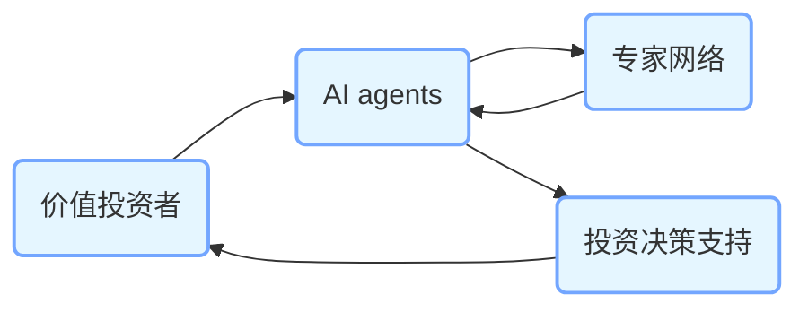

# AI agents辅助价值投资者进行专家网络分析

> 关键词：AI agents、价值投资者、专家网络分析、投资决策、信息挖掘

> 摘要：本文聚焦于AI agents在辅助价值投资者进行专家网络分析方面的应用。详细阐述了相关核心概念、算法原理、数学模型，通过项目实战展示其具体应用，探讨了实际应用场景，推荐了学习资源、开发工具和相关论文著作。最后总结了未来发展趋势与挑战，并对常见问题进行解答。旨在为价值投资者和相关从业者提供全面深入的技术参考，帮助其更好地利用AI agents提升专家网络分析的效率和质量，做出更明智的投资决策。

## 1. 背景介绍 
### 1.1 目的和范围
在当今复杂多变的金融市场中，价值投资者需要深入了解各个行业和企业的真实情况，以做出明智的投资决策。专家网络分析作为一种获取专业信息和见解的重要手段，正发挥着越来越重要的作用。然而，传统的专家网络分析方法存在信息获取效率低、分析深度不足等问题。本文章的目的在于探讨如何利用AI agents技术辅助价值投资者进行更高效、更准确的专家网络分析。范围涵盖了AI agents的基本原理、在专家网络分析中的具体应用、相关算法和数学模型，以及实际项目案例等方面。

### 1.2 预期读者
本文预期读者主要包括价值投资者、金融分析师、投资顾问、AI技术研究人员以及对金融科技领域感兴趣的专业人士。对于价值投资者而言，能够从中了解如何借助AI agents提升专家网络分析能力，优化投资决策；金融分析师和投资顾问可以学习到新的分析方法和工具，提高服务质量；AI技术研究人员则可以深入了解AI agents在金融领域的具体应用场景和挑战；对金融科技感兴趣的专业人士可以获得全面的知识体系，拓宽视野。

### 1.3 文档结构概述
本文将按照以下结构进行阐述：首先介绍核心概念与联系，明确AI agents和专家网络分析的基本定义和相互关系；接着详细讲解核心算法原理和具体操作步骤，通过Python代码进行演示；然后介绍相关的数学模型和公式，并举例说明；随后进行项目实战，包括开发环境搭建、源代码实现和代码解读；再探讨实际应用场景；之后推荐相关的学习资源、开发工具和论文著作；最后总结未来发展趋势与挑战，解答常见问题，并提供扩展阅读和参考资料。

### 1.4 术语表
#### 1.4.1 核心术语定义
- **AI agents（人工智能代理）**：是一种能够感知环境、自主决策并采取行动以实现特定目标的智能实体。在本文中，AI agents可以自动收集、分析和处理与专家网络相关的信息，为价值投资者提供决策支持。
- **价值投资者**：是指那些基于对企业内在价值的评估，寻找被低估的股票或其他投资标的，长期持有以获取价值增长的投资者。
- **专家网络分析**：是指通过与各领域的专家进行交流和沟通，获取专业知识、行业动态和企业内部信息等，以辅助投资决策的分析方法。

#### 1.4.2 相关概念解释
- **知识图谱**：是一种以图形化方式表示实体及其之间关系的知识库。在专家网络分析中，知识图谱可以用于整合专家信息、行业知识和企业数据，为AI agents提供更全面的信息支持。
- **自然语言处理（NLP）**：是人工智能的一个重要分支，主要研究如何让计算机理解和处理人类语言。在本文中，NLP技术可用于对专家的言论、报告等文本信息进行分析和挖掘。

#### 1.4.3 缩略词列表
- **AI**：Artificial Intelligence，人工智能
- **NLP**：Natural Language Processing，自然语言处理
- **API**：Application Programming Interface，应用程序编程接口

## 2. 核心概念与联系 

### 核心概念原理
#### AI agents原理
AI agents是基于一定的算法和模型构建的智能系统，它通常由感知模块、决策模块和行动模块组成。感知模块负责收集环境中的信息，例如从各种数据源获取专家的言论、行业报告等；决策模块根据感知到的信息进行分析和推理，确定下一步的行动策略；行动模块则根据决策结果采取相应的行动，如与专家进行进一步的沟通、生成分析报告等。

#### 专家网络分析原理
专家网络分析的核心在于通过与各领域的专家建立联系，获取他们的专业知识和经验。专家可以来自学术界、企业界、咨询机构等不同领域，他们对特定行业或企业有着深入的了解。通过与专家的交流和沟通，价值投资者可以获得有关行业趋势、企业竞争力、市场前景等方面的信息，从而更准确地评估投资标的的价值。

### 架构的文本示意图
```plaintext
价值投资者 <-> AI agents <-> 专家网络
|                          |
|                          |
v                          v
投资决策                 专家信息收集与分析
```

### Mermaid流程图


## 3. 核心算法原理 & 具体操作步骤 

### 核心算法原理
#### 信息收集算法
在专家网络分析中，信息收集是第一步。AI agents可以使用网络爬虫算法从各种网站、社交媒体、新闻媒体等数据源收集与专家相关的信息。以下是一个简单的Python网络爬虫示例：

```python
import requests
from bs4 import BeautifulSoup

def get_expert_info(url):
    try:
        response = requests.get(url)
        response.raise_for_status()
        soup = BeautifulSoup(response.text, 'html.parser')
        # 这里可以根据具体网页结构提取专家信息
        expert_info = soup.find_all('div', class_='expert-info')
        return expert_info
    except requests.RequestException as e:
        print(f"Error: {e}")
        return None

# 使用示例
url = 'https://example.com/expert-list'
expert_info = get_expert_info(url)
if expert_info:
    for info in expert_info:
        print(info.text)
```

#### 信息分析算法
收集到专家信息后，需要对其进行分析。自然语言处理算法可以用于对专家的言论、报告等文本信息进行情感分析、主题提取等。以下是一个使用Python的`TextBlob`库进行情感分析的示例：

```python
from textblob import TextBlob

def sentiment_analysis(text):
    blob = TextBlob(text)
    sentiment = blob.sentiment.polarity
    if sentiment > 0:
        return 'Positive'
    elif sentiment < 0:
        return 'Negative'
    else:
        return 'Neutral'

# 使用示例
text = "The company's future prospects are very promising."
result = sentiment_analysis(text)
print(f"Sentiment: {result}")
```

### 具体操作步骤
1. **确定目标专家网络**：价值投资者根据投资领域和需求，确定需要分析的专家网络范围，例如特定行业的专家、企业高管等。
2. **AI agents信息收集**：AI agents使用网络爬虫等算法从各种数据源收集目标专家的信息，包括个人简介、言论、研究报告等。
3. **信息预处理**：对收集到的信息进行清洗、去重、分词等预处理操作，以便后续分析。
4. **信息分析**：使用自然语言处理、机器学习等算法对预处理后的信息进行分析，如情感分析、主题提取、关联分析等。
5. **生成分析报告**：AI agents根据分析结果生成详细的分析报告，为价值投资者提供决策支持。
6. **反馈与优化**：价值投资者根据分析报告做出投资决策，并将决策结果反馈给AI agents。AI agents根据反馈信息进行优化，提高分析的准确性和效率。

## 4. 数学模型和公式 & 详细讲解 & 举例说明 

### 情感分析数学模型
在情感分析中，常用的数学模型是基于词袋模型和朴素贝叶斯分类器。

#### 词袋模型
词袋模型将文本看作是一个无序的词集合，每个词被看作是一个特征。假设一个文本集合 $D = \{d_1, d_2, \cdots, d_n\}$，其中 $d_i$ 表示第 $i$ 个文本。对于每个文本 $d_i$，可以将其表示为一个向量 $\mathbf{x}_i = [x_{i1}, x_{i2}, \cdots, x_{im}]$，其中 $x_{ij}$ 表示第 $i$ 个文本中第 $j$ 个词的出现次数。

#### 朴素贝叶斯分类器
朴素贝叶斯分类器基于贝叶斯定理，假设特征之间相互独立。对于一个文本 $\mathbf{x}$，其属于类别 $c$ 的概率可以表示为：

$$P(c|\mathbf{x}) = \frac{P(\mathbf{x}|c)P(c)}{P(\mathbf{x})}$$

其中，$P(c)$ 是类别 $c$ 的先验概率，$P(\mathbf{x}|c)$ 是在类别 $c$ 下文本 $\mathbf{x}$ 的条件概率，$P(\mathbf{x})$ 是文本 $\mathbf{x}$ 的先验概率。由于 $P(\mathbf{x})$ 对于所有类别都是相同的，因此可以忽略不计。根据朴素贝叶斯假设，特征之间相互独立，因此有：

$$P(\mathbf{x}|c) = \prod_{j=1}^{m} P(x_j|c)$$

其中，$x_j$ 是文本 $\mathbf{x}$ 的第 $j$ 个特征。

### 举例说明
假设我们有一个文本分类任务，要将文本分为积极、消极和中性三类。我们有以下训练数据：

| 文本 | 类别 |
| ---- | ---- |
| This movie is great! | Positive |
| The food here is terrible. | Negative |
| It's just okay. | Neutral |

首先，我们需要构建词袋模型。对于上述训练数据，词汇表为 $\{this, movie, is, great, the, food, here, terrible, just, okay\}$。

对于文本 “This movie is great!”，其词袋向量为 $\mathbf{x} = [1, 1, 1, 1, 0, 0, 0, 0, 0, 0]$。

假设我们已经计算出了各类别的先验概率和条件概率，例如 $P(Positive) = 0.3$，$P(Negative) = 0.3$，$P(Neutral) = 0.4$。对于词 “great”，$P(great|Positive) = 0.8$，$P(great|Negative) = 0.1$，$P(great|Neutral) = 0.1$。

根据朴素贝叶斯分类器，该文本属于积极类别的概率为：

$$P(Positive|\mathbf{x}) \propto P(\mathbf{x}|Positive)P(Positive) = P(this|Positive)P(movie|Positive)P(is|Positive)P(great|Positive)P(Positive)$$

同理，可以计算出该文本属于消极和中性类别的概率，然后选择概率最大的类别作为分类结果。

## 5. 项目实战：代码实际案例和详细解释说明 

### 5.1  开发环境搭建
#### 安装Python
首先，需要安装Python编程语言。可以从Python官方网站（https://www.python.org/downloads/）下载适合自己操作系统的Python版本，并按照安装向导进行安装。

#### 安装必要的库
在项目中，我们需要使用一些Python库，如`requests`、`BeautifulSoup`、`TextBlob`等。可以使用`pip`命令进行安装：

```sh
pip install requests beautifulsoup4 textblob
```

### 5.2  源代码详细实现和代码解读
以下是一个完整的项目示例，用于收集专家信息并进行情感分析：

```python
import requests
from bs4 import BeautifulSoup
from textblob import TextBlob

# 信息收集函数
def get_expert_info(url):
    try:
        response = requests.get(url)
        response.raise_for_status()
        soup = BeautifulSoup(response.text, 'html.parser')
        # 假设专家信息在 <p> 标签中
        expert_info = soup.find_all('p')
        return [info.text for info in expert_info]
    except requests.RequestException as e:
        print(f"Error: {e}")
        return []

# 情感分析函数
def sentiment_analysis(text):
    blob = TextBlob(text)
    sentiment = blob.sentiment.polarity
    if sentiment > 0:
        return 'Positive'
    elif sentiment < 0:
        return 'Negative'
    else:
        return 'Neutral'

# 主函数
def main():
    url = 'https://example.com/expert-info'
    expert_info_list = get_expert_info(url)
    for info in expert_info_list:
        sentiment = sentiment_analysis(info)
        print(f"Text: {info}")
        print(f"Sentiment: {sentiment}")
        print("-" * 50)

if __name__ == "__main__":
    main()
```

### 代码解读与分析
1. **信息收集函数 `get_expert_info`**：该函数使用`requests`库发送HTTP请求，获取指定URL的网页内容。然后使用`BeautifulSoup`库对网页内容进行解析，提取出专家信息。最后返回一个包含专家信息的列表。
2. **情感分析函数 `sentiment_analysis`**：该函数使用`TextBlob`库对输入的文本进行情感分析。根据情感极性值判断文本的情感类别，返回 “Positive”、“Negative” 或 “Neutral”。
3. **主函数 `main`**：该函数调用`get_expert_info`函数获取专家信息列表，然后遍历列表，对每个专家信息调用`sentiment_analysis`函数进行情感分析，并输出分析结果。

## 6. 实际应用场景 
### 投资决策支持
价值投资者可以利用AI agents辅助进行专家网络分析，获取有关投资标的的详细信息和专业见解。通过对专家言论的情感分析和主题提取，投资者可以更好地了解市场趋势、企业竞争力和潜在风险，从而做出更明智的投资决策。

### 行业研究
AI agents可以帮助投资者对特定行业进行深入研究。通过收集行业专家的观点和研究报告，分析行业的发展趋势、竞争格局和政策环境等因素，为投资者提供全面的行业信息，帮助其发现投资机会。

### 风险评估
在投资过程中，风险评估是非常重要的环节。AI agents可以通过分析专家对企业财务状况、市场风险、技术创新等方面的看法，帮助投资者评估投资标的的风险水平，提前做好风险防范措施。

## 7. 工具和资源推荐
### 7.1 学习资源推荐
#### 7.1.1 书籍推荐
- 《人工智能：一种现代的方法》：这是一本经典的人工智能教材，全面介绍了人工智能的基本概念、算法和应用。
- 《Python自然语言处理实战》：详细讲解了Python在自然语言处理领域的应用，包括文本处理、情感分析、主题建模等内容。
- 《价值投资：从格雷厄姆到巴菲特》：介绍了价值投资的基本理论和方法，以及如何进行基本面分析和估值。

#### 7.1.2 在线课程
- Coursera上的“人工智能基础”课程：由知名高校教授授课，系统介绍人工智能的基础知识和算法。
- edX上的“自然语言处理”课程：深入讲解自然语言处理的原理和技术，包括词法分析、句法分析、语义理解等内容。
- Udemy上的“价值投资实战”课程：结合实际案例，讲解价值投资的方法和策略。

#### 7.1.3 技术博客和网站
- Medium：是一个知名的技术博客平台，上面有很多关于人工智能、金融科技等领域的优质文章。
- Towards Data Science：专注于数据科学和人工智能领域的技术分享和经验交流。
- Seeking Alpha：是一个金融投资领域的网站，提供大量的投资分析报告和专家观点。

### 7.2 开发工具框架推荐
#### 7.2.1 IDE和编辑器
- PyCharm：是一款专业的Python集成开发环境，提供了丰富的代码编辑、调试和测试功能。
- Visual Studio Code：是一款轻量级的代码编辑器，支持多种编程语言，具有丰富的插件生态系统。

#### 7.2.2 调试和性能分析工具
- PDB：是Python自带的调试工具，可以帮助开发者定位和解决代码中的问题。
- cProfile：是Python的性能分析工具，可以分析代码的运行时间和内存使用情况。

#### 7.2.3 相关框架和库
- Scikit-learn：是一个常用的机器学习库，提供了丰富的机器学习算法和工具，如分类、回归、聚类等。
- TensorFlow：是一个开源的深度学习框架，广泛应用于图像识别、自然语言处理等领域。
- NLTK：是一个自然语言处理工具包，提供了丰富的文本处理功能，如分词、词性标注、命名实体识别等。

### 7.3 相关论文著作推荐
#### 7.3.1 经典论文
- “A Mathematical Theory of Communication”：由克劳德·香农（Claude Shannon）发表，奠定了信息论的基础。
- “The Nature of Statistical Learning Theory”：介绍了统计学习理论的基本概念和方法。
- “Efficient Capital Markets: A Review of Theory and Empirical Work”：提出了有效市场假说，对金融市场的研究产生了深远影响。

#### 7.3.2 最新研究成果
- 可以关注顶级学术会议如NeurIPS（神经信息处理系统大会）、ICML（国际机器学习会议）、KDD（知识发现与数据挖掘会议）等的论文，了解人工智能和机器学习领域的最新研究成果。
- 金融领域的研究可以关注《Journal of Finance》、《Review of Financial Studies》等学术期刊。

#### 7.3.3 应用案例分析
- 可以参考一些知名金融机构的研究报告和案例分析，了解他们在投资决策中如何应用人工智能和专家网络分析技术。
- 一些科技公司也会发布相关的应用案例，如谷歌、微软等公司在自然语言处理和数据分析方面的应用案例。

## 8. 总结：未来发展趋势与挑战
### 未来发展趋势
#### 智能化程度不断提高
随着人工智能技术的不断发展，AI agents的智能化程度将不断提高。它们将能够更准确地理解专家的意图和观点，进行更深入的分析和推理，为价值投资者提供更精准的决策支持。

#### 与其他技术的融合
AI agents将与区块链、物联网等技术进行更深入的融合。例如，利用区块链技术确保专家信息的真实性和安全性，利用物联网技术获取更多的实时数据，为专家网络分析提供更丰富的信息来源。

#### 个性化服务
未来，AI agents将能够根据价值投资者的个性化需求，提供定制化的专家网络分析服务。例如，根据投资者的投资偏好、风险承受能力等因素，为其推荐合适的专家和分析报告。

### 挑战
#### 数据质量和隐私问题
在专家网络分析中，数据质量至关重要。如果收集到的数据存在误差或不完整，将影响分析结果的准确性。此外，专家信息涉及个人隐私，如何在保证数据安全和隐私的前提下进行有效的分析是一个挑战。

#### 算法可解释性
AI agents中使用的一些复杂算法，如深度学习算法，往往具有较高的黑盒性，难以解释其决策过程和结果。对于价值投资者来说，理解算法的决策依据非常重要，因此如何提高算法的可解释性是一个亟待解决的问题。

#### 法律法规和监管
随着AI agents在金融领域的广泛应用，相关的法律法规和监管政策也需要不断完善。如何确保AI agents的使用符合法律法规的要求，避免潜在的风险和违规行为，是一个需要关注的问题。

## 9. 附录：常见问题与解答
### 问题1：AI agents能否完全替代专家网络分析中的人工交流？
答：不能。虽然AI agents可以高效地收集和分析大量信息，但人工交流仍然具有不可替代的作用。专家的经验、洞察力和直觉等因素很难通过数据和算法完全体现，与专家进行面对面的交流可以获取更深入的信息和见解。AI agents可以作为辅助工具，提高专家网络分析的效率和准确性，但不能完全替代人工交流。

### 问题2：如何确保AI agents收集到的专家信息的真实性和可靠性？
答：可以采取以下措施来确保信息的真实性和可靠性：
- 选择可靠的数据源，如权威的新闻媒体、专业的行业网站等。
- 对收集到的信息进行多渠道验证，通过对比不同来源的信息来判断其真实性。
- 利用区块链等技术确保信息的不可篡改和可追溯性。

### 问题3：AI agents在专家网络分析中的应用是否会受到行业限制？
答：理论上，AI agents可以应用于各个行业的专家网络分析。但不同行业的特点和数据类型可能存在差异，需要对AI agents进行相应的调整和优化。例如，金融行业的数据具有较高的敏感性和复杂性，需要采用更严格的安全措施和更复杂的分析算法；医疗行业的专家信息可能涉及患者隐私，需要遵守相关的法律法规。

## 10. 扩展阅读 & 参考资料
### 扩展阅读
- 《AI未来进行式》：探讨了人工智能在各个领域的应用和未来发展趋势。
- 《金融科技前沿：技术驱动的金融创新》：介绍了金融科技领域的最新技术和应用案例。
- 《大数据时代：生活、工作与思维的大变革》：阐述了大数据对社会和经济的影响。

### 参考资料
- 相关学术论文和研究报告，如在IEEE、ACM等学术数据库中搜索的关于人工智能、自然语言处理和金融分析的论文。
- 金融机构和科技公司发布的白皮书和技术文档，如高盛、摩根大通等金融机构的研究报告，谷歌、微软等科技公司的技术文档。

作者：AI天才研究院/AI Genius Institute & 禅与计算机程序设计艺术 /Zen And The Art of Computer Programming