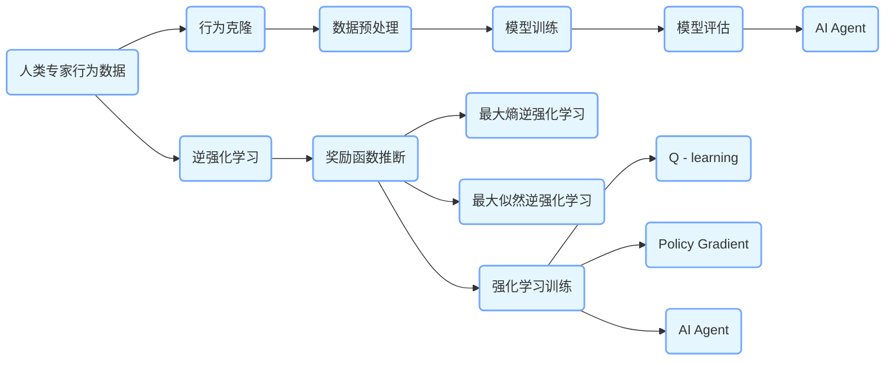

# AI Agent的模仿学习：从人类行为中学习

> 关键词：AI Agent、模仿学习、人类行为、策略学习、机器学习

> 摘要：本文围绕AI Agent的模仿学习展开，详细探讨了从人类行为中学习的技术原理、核心算法、数学模型等内容。首先介绍了模仿学习的背景知识，包括目的、预期读者、文档结构和术语表等。接着阐述了核心概念与联系，用示意图和流程图展示其架构。通过Python代码详细讲解了核心算法原理和具体操作步骤，并给出了数学模型和公式。在项目实战部分，提供了开发环境搭建、源代码实现与解读。还介绍了实际应用场景、推荐了相关工具和资源，最后总结了未来发展趋势与挑战，给出常见问题解答和参考资料，旨在为读者全面深入地理解AI Agent的模仿学习提供指导。

## 1. 背景介绍 
### 1.1 目的和范围
模仿学习是机器学习领域的一个重要分支，其目的在于让AI Agent通过观察人类的行为来学习执行任务的策略。在现实世界中，人类拥有丰富的知识和经验，能够高效地完成各种复杂的任务。将这些人类的智慧和行为模式传授给AI Agent，不仅可以加速AI的学习过程，还能使其在实际应用中表现得更加智能和自然。

本文的范围涵盖了AI Agent模仿学习的基本概念、核心算法、数学模型、实际应用以及相关的工具和资源等方面。通过详细的阐述和实例分析，帮助读者全面了解模仿学习的原理和实践方法。

### 1.2 预期读者
本文预期读者包括对人工智能、机器学习感兴趣的研究人员、工程师和学生。对于初学者来说，可以通过本文了解模仿学习的基本概念和方法，为进一步深入学习打下基础；对于有一定经验的专业人士，本文提供了更深入的技术分析和实际应用案例，有助于他们在实际项目中应用模仿学习技术。

### 1.3 文档结构概述
本文将按照以下结构进行组织：
1. **背景介绍**：介绍模仿学习的目的、预期读者、文档结构和术语表。
2. **核心概念与联系**：阐述模仿学习的核心概念，包括行为克隆、逆强化学习等，并展示其架构和联系。
3. **核心算法原理 & 具体操作步骤**：通过Python代码详细讲解模仿学习的核心算法，如行为克隆算法。
4. **数学模型和公式 & 详细讲解 & 举例说明**：给出模仿学习的数学模型和公式，并进行详细讲解和举例。
5. **项目实战：代码实际案例和详细解释说明**：提供一个实际的项目案例，包括开发环境搭建、源代码实现和代码解读。
6. **实际应用场景**：介绍模仿学习在不同领域的实际应用场景。
7. **工具和资源推荐**：推荐相关的学习资源、开发工具和研究论文。
8. **总结：未来发展趋势与挑战**：总结模仿学习的发展趋势和面临的挑战。
9. **附录：常见问题与解答**：解答读者在学习和实践中常见的问题。
10. **扩展阅读 & 参考资料**：提供相关的扩展阅读材料和参考资料。

### 1.4 术语表
#### 1.4.1 核心术语定义
- **AI Agent**：人工智能代理，是一个能够感知环境、做出决策并采取行动的实体。
- **模仿学习**：让AI Agent通过观察人类的行为来学习执行任务的策略的方法。
- **行为克隆**：一种简单的模仿学习方法，通过直接复制人类的行为来训练AI Agent。
- **逆强化学习**：通过观察人类的行为来推断环境的奖励函数，从而让AI Agent学习最优策略。

#### 1.4.2 相关概念解释
- **策略**：AI Agent在不同状态下选择行动的规则。
- **状态**：环境的一种描述，包括AI Agent和环境的相关信息。
- **行动**：AI Agent在某个状态下采取的具体操作。
- **奖励函数**：用于评估AI Agent在某个状态下采取某个行动的好坏程度。

#### 1.4.3 缩略词列表
- **RL**：强化学习（Reinforcement Learning）
- **IL**：模仿学习（Imitation Learning）
- **BC**：行为克隆（Behavior Cloning）
- **IRL**：逆强化学习（Inverse Reinforcement Learning）

## 2. 核心概念与联系 
### 核心概念原理
#### 行为克隆（Behavior Cloning）
行为克隆是模仿学习中最基本的方法之一。其核心思想是将人类专家的行为数据看作是一个监督学习的数据集，其中状态作为输入，对应的人类行动作为输出。AI Agent通过学习这个数据集，建立状态到行动的映射关系，从而在实际应用中能够根据当前状态输出相应的行动。

例如，在自动驾驶领域，人类驾驶员在不同的路况下（状态）会采取不同的驾驶操作（行动）。通过收集大量的人类驾驶数据，AI Agent可以学习到在各种路况下应该如何驾驶。

#### 逆强化学习（Inverse Reinforcement Learning）
逆强化学习的目标是通过观察人类的行为来推断环境的奖励函数。在传统的强化学习中，奖励函数是已知的，AI Agent通过最大化累积奖励来学习最优策略。而在逆强化学习中，奖励函数是未知的，需要从人类的行为数据中推断出来。

一旦推断出奖励函数，就可以使用传统的强化学习方法来训练AI Agent，使其学习到与人类专家相似的策略。例如，在机器人操作任务中，通过观察人类的操作行为，可以推断出完成任务的奖励函数，然后让机器人根据这个奖励函数学习最优操作策略。

### 架构的文本示意图
```plaintext
人类专家行为数据
|
|-- 行为克隆
|   |-- 数据预处理
|   |-- 模型训练（如神经网络）
|   |-- 模型评估
|   |-- AI Agent（基于训练好的模型）
|
|-- 逆强化学习
|   |-- 奖励函数推断
|   |   |-- 最大熵逆强化学习
|   |   |-- 最大似然逆强化学习
|   |-- 强化学习训练
|   |   |-- Q-learning
|   |   |-- Policy Gradient
|   |-- AI Agent（基于学习到的策略）
```

### Mermaid流程图


## 3. 核心算法原理 & 具体操作步骤 
### 行为克隆算法原理
行为克隆可以看作是一个监督学习问题，通常使用神经网络作为模型。给定一组人类专家的行为数据 $\{(s_i, a_i)\}_{i=1}^N$，其中 $s_i$ 是状态，$a_i$ 是对应的行动。神经网络的目标是学习一个函数 $f: S \to A$，使得 $f(s_i) \approx a_i$ 对于所有的 $i$ 都成立。

### Python代码实现
```python
import numpy as np
import torch
import torch.nn as nn
import torch.optim as optim

# 定义神经网络模型
class BehaviorCloningModel(nn.Module):
    def __init__(self, input_dim, output_dim):
        super(BehaviorCloningModel, self).__init__()
        self.fc1 = nn.Linear(input_dim, 64)
        self.fc2 = nn.Linear(64, 64)
        self.fc3 = nn.Linear(64, output_dim)

    def forward(self, x):
        x = torch.relu(self.fc1(x))
        x = torch.relu(self.fc2(x))
        x = self.fc3(x)
        return x

# 生成一些示例数据
input_dim = 10
output_dim = 5
num_samples = 1000

states = np.random.randn(num_samples, input_dim)
actions = np.random.randn(num_samples, output_dim)

# 将数据转换为PyTorch张量
states = torch.tensor(states, dtype=torch.float32)
actions = torch.tensor(actions, dtype=torch.float32)

# 初始化模型、损失函数和优化器
model = BehaviorCloningModel(input_dim, output_dim)
criterion = nn.MSELoss()
optimizer = optim.Adam(model.parameters(), lr=0.001)

# 训练模型
num_epochs = 100
for epoch in range(num_epochs):
    optimizer.zero_grad()
    outputs = model(states)
    loss = criterion(outputs, actions)
    loss.backward()
    optimizer.step()

    if (epoch + 1) % 10 == 0:
        print(f'Epoch [{epoch+1}/{num_epochs}], Loss: {loss.item():.4f}')

# 使用训练好的模型进行预测
test_state = torch.tensor(np.random.randn(1, input_dim), dtype=torch.float32)
predicted_action = model(test_state)
print(f'Predicted action: {predicted_action.detach().numpy()}')
```

### 具体操作步骤
1. **数据收集**：收集人类专家的行为数据，包括状态和对应的行动。
2. **数据预处理**：对收集到的数据进行预处理，如归一化、划分训练集和测试集等。
3. **模型定义**：定义一个合适的神经网络模型，根据输入和输出的维度确定网络结构。
4. **损失函数和优化器选择**：选择合适的损失函数（如均方误差损失）和优化器（如Adam优化器）。
5. **模型训练**：使用训练数据对模型进行训练，通过不断迭代更新模型的参数，使得损失函数最小化。
6. **模型评估**：使用测试数据对训练好的模型进行评估，检查模型的泛化能力。
7. **模型应用**：使用训练好的模型在实际环境中进行预测和决策。

## 4. 数学模型和公式 & 详细讲解 & 举例说明 
### 行为克隆的数学模型
行为克隆的目标是最小化预测行动 $\hat{a}$ 与真实行动 $a$ 之间的损失。通常使用均方误差损失函数，其数学公式为：

$$L = \frac{1}{N} \sum_{i=1}^N ||\hat{a}_i - a_i||^2$$

其中，$N$ 是数据集中样本的数量，$\hat{a}_i$ 是模型预测的行动，$a_i$ 是真实的行动。

### 详细讲解
均方误差损失函数衡量了预测值与真实值之间的平均平方误差。在行为克隆中，通过最小化这个损失函数，模型可以学习到状态到行动的映射关系，使得预测的行动尽可能接近真实的人类行动。

### 举例说明
假设我们有一个简单的二维状态空间和一维行动空间，数据集中有三个样本：

| 状态 $s$ | 行动 $a$ |
|----------|----------|
| [1, 2]   | 3        |
| [2, 3]   | 4        |
| [3, 4]   | 5        |

我们的模型预测的行动分别为 $\hat{a}_1 = 2.8$，$\hat{a}_2 = 4.1$，$\hat{a}_3 = 4.9$。则均方误差损失为：

$$L = \frac{1}{3} [(2.8 - 3)^2 + (4.1 - 4)^2 + (4.9 - 5)^2] = \frac{1}{3} [(-0.2)^2 + 0.1^2 + (-0.1)^2] = \frac{1}{3} [0.04 + 0.01 + 0.01] = \frac{0.06}{3} = 0.02$$

### 逆强化学习的数学模型
逆强化学习的目标是找到一个奖励函数 $R(s, a)$，使得人类专家的行为在这个奖励函数下是最优的。一种常见的方法是最大熵逆强化学习，其目标是最大化以下目标函数：

$$\max_R \sum_{i=1}^N \log p_{\pi^*}(a_i | s_i; R)$$

其中，$p_{\pi^*}(a_i | s_i; R)$ 是在奖励函数 $R$ 下，最优策略 $\pi^*$ 选择行动 $a_i$ 在状态 $s_i$ 下的概率。

### 详细讲解
最大熵逆强化学习的核心思想是在满足人类专家行为的约束下，使得策略具有最大的熵。这样可以避免过拟合，使得学习到的奖励函数更加泛化。通过最大化目标函数，可以找到一个合适的奖励函数，使得人类专家的行为在这个奖励函数下是最优的。

### 举例说明
假设我们有一个简单的网格世界环境，人类专家的行为数据显示在某些状态下总是选择向右移动。在最大熵逆强化学习中，我们通过调整奖励函数，使得在这些状态下向右移动的策略具有最大的概率，同时保证策略的熵尽可能大。

## 5. 项目实战：代码实际案例和详细解释说明 
### 5.1  开发环境搭建
#### 安装Python
首先，确保你已经安装了Python 3.x版本。可以从Python官方网站（https://www.python.org/downloads/）下载并安装。

#### 安装必要的库
在命令行中使用以下命令安装必要的库：
```sh
pip install torch numpy
```

### 5.2  源代码详细实现和代码解读
```python
import numpy as np
import torch
import torch.nn as nn
import torch.optim as optim

# 定义神经网络模型
class BehaviorCloningModel(nn.Module):
    def __init__(self, input_dim, output_dim):
        super(BehaviorCloningModel, self).__init__()
        # 定义全连接层
        self.fc1 = nn.Linear(input_dim, 64)
        self.fc2 = nn.Linear(64, 64)
        self.fc3 = nn.Linear(64, output_dim)

    def forward(self, x):
        # 前向传播
        x = torch.relu(self.fc1(x))
        x = torch.relu(self.fc2(x))
        x = self.fc3(x)
        return x

# 生成一些示例数据
input_dim = 10
output_dim = 5
num_samples = 1000

states = np.random.randn(num_samples, input_dim)
actions = np.random.randn(num_samples, output_dim)

# 将数据转换为PyTorch张量
states = torch.tensor(states, dtype=torch.float32)
actions = torch.tensor(actions, dtype=torch.float32)

# 初始化模型、损失函数和优化器
model = BehaviorCloningModel(input_dim, output_dim)
criterion = nn.MSELoss()
optimizer = optim.Adam(model.parameters(), lr=0.001)

# 训练模型
num_epochs = 100
for epoch in range(num_epochs):
    optimizer.zero_grad()
    outputs = model(states)
    loss = criterion(outputs, actions)
    loss.backward()
    optimizer.step()

    if (epoch + 1) % 10 == 0:
        print(f'Epoch [{epoch+1}/{num_epochs}], Loss: {loss.item():.4f}')

# 使用训练好的模型进行预测
test_state = torch.tensor(np.random.randn(1, input_dim), dtype=torch.float32)
predicted_action = model(test_state)
print(f'Predicted action: {predicted_action.detach().numpy()}')
```

### 代码解读与分析
1. **模型定义**：`BehaviorCloningModel` 类继承自 `nn.Module`，定义了一个三层全连接神经网络。在 `__init__` 方法中，初始化了三个全连接层；在 `forward` 方法中，定义了前向传播的过程，使用ReLU激活函数增加模型的非线性。
2. **数据生成**：使用 `np.random.randn` 生成一些随机的状态和行动数据，并将其转换为PyTorch张量。
3. **模型初始化**：初始化模型、损失函数（均方误差损失）和优化器（Adam优化器）。
4. **模型训练**：通过循环迭代训练模型，每次迭代中，首先将优化器的梯度清零，然后进行前向传播得到模型的输出，计算损失，进行反向传播更新模型的参数。
5. **模型预测**：使用训练好的模型对一个随机的测试状态进行预测，并输出预测的行动。

## 6. 实际应用场景 
### 自动驾驶
在自动驾驶领域，模仿学习可以让AI Agent学习人类驾驶员的驾驶行为。通过收集大量的人类驾驶数据，包括不同路况下的转向、加速、刹车等操作，AI Agent可以学习到在各种情况下的最佳驾驶策略。例如，在复杂的城市道路中，人类驾驶员能够根据交通信号灯、行人、其他车辆等情况做出合理的决策，AI Agent可以通过模仿学习来学习这些决策过程，提高自动驾驶的安全性和可靠性。

### 机器人操作
在机器人操作任务中，模仿学习可以帮助机器人学习人类的操作技能。例如，在工业生产线上，人类工人可以完成各种复杂的装配任务，机器人可以通过观察人类工人的操作行为，学习到如何抓取、搬运和组装零件。此外，在家庭服务机器人领域，机器人可以通过模仿学习来学习如何完成家务任务，如打扫卫生、洗碗等。

### 游戏领域
在游戏中，模仿学习可以让AI Agent学习人类玩家的游戏策略。例如，在电子竞技游戏中，职业玩家具有高超的游戏技巧和策略，AI Agent可以通过观察职业玩家的游戏操作，学习到如何在游戏中取得胜利。这不仅可以提高游戏的趣味性，还可以为游戏开发提供更多的创新思路。

### 医疗领域
在医疗领域，模仿学习可以应用于手术机器人的训练。外科医生具有丰富的手术经验和精湛的手术技巧，手术机器人可以通过观察外科医生的手术操作，学习到如何进行精确的手术操作。此外，模仿学习还可以用于医疗影像诊断，通过学习人类医生的诊断经验，提高医疗影像诊断的准确性和效率。

## 7. 工具和资源推荐
### 7.1 学习资源推荐
#### 7.1.1 书籍推荐
- 《深度学习》（Deep Learning）：由Ian Goodfellow、Yoshua Bengio和Aaron Courville撰写，是深度学习领域的经典教材，涵盖了深度学习的基本概念、算法和应用。
- 《强化学习：原理与Python实现》（Reinforcement Learning: An Introduction）：由Richard S. Sutton和Andrew G. Barto撰写，是强化学习领域的权威教材，对模仿学习也有相关的介绍。
- 《机器学习》（Machine Learning）：由Tom M. Mitchell撰写，是机器学习领域的经典教材，介绍了机器学习的基本概念、算法和应用。

#### 7.1.2 在线课程
- Coursera上的“深度学习专项课程”（Deep Learning Specialization）：由Andrew Ng教授授课，涵盖了深度学习的各个方面，包括模仿学习的相关内容。
- edX上的“强化学习基础”（Fundamentals of Reinforcement Learning）：介绍了强化学习的基本概念和算法，对模仿学习也有一定的涉及。
- Udemy上的“Python机器学习实战”（Machine Learning A-Z™: Hands-On Python & R In Data Science）：通过实际案例介绍了机器学习的各种算法，包括模仿学习的应用。

#### 7.1.3 技术博客和网站
- Medium：是一个技术博客平台，上面有很多关于人工智能、机器学习的优秀文章，包括模仿学习的最新研究成果和实践经验。
- arXiv：是一个预印本平台，提供了大量的学术论文，包括模仿学习领域的最新研究成果。
- OpenAI博客：OpenAI是人工智能领域的知名研究机构，其博客上发布了很多关于人工智能技术的最新进展和研究成果。

### 7.2 开发工具框架推荐
#### 7.2.1 IDE和编辑器
- PyCharm：是一款专门为Python开发设计的集成开发环境，提供了丰富的代码编辑、调试和测试功能，适合用于开发模仿学习相关的项目。
- Jupyter Notebook：是一个交互式的开发环境，支持Python代码的编写和运行，还可以方便地展示代码的运行结果和可视化图表，适合用于实验和研究。
- Visual Studio Code：是一款轻量级的代码编辑器，支持多种编程语言，通过安装Python扩展可以方便地进行Python开发，并且具有丰富的插件生态系统。

#### 7.2.2 调试和性能分析工具
- PyTorch Profiler：是PyTorch提供的性能分析工具，可以帮助开发者分析模型的训练和推理时间，找出性能瓶颈。
- TensorBoard：是TensorFlow提供的可视化工具，也可以与PyTorch结合使用，用于可视化模型的训练过程、损失曲线、参数分布等信息。
- cProfile：是Python标准库中的性能分析工具，可以帮助开发者分析代码的运行时间和函数调用情况。

#### 7.2.3 相关框架和库
- PyTorch：是一个开源的深度学习框架，提供了丰富的神经网络层和优化算法，方便开发者实现模仿学习的算法。
- TensorFlow：是另一个广泛使用的深度学习框架，具有强大的分布式训练和部署能力，也可以用于实现模仿学习的算法。
- Stable Baselines：是一个基于OpenAI Gym的强化学习库，提供了多种强化学习算法的实现，包括一些与模仿学习相关的算法。

### 7.3 相关论文著作推荐
#### 7.3.1 经典论文
- “Learning from Demonstrations”：这篇论文介绍了模仿学习的基本概念和方法，是模仿学习领域的经典之作。
- “Algorithms for Inverse Reinforcement Learning”：提出了逆强化学习的算法框架，为逆强化学习的研究奠定了基础。
- “Maximum Entropy Inverse Reinforcement Learning”：介绍了最大熵逆强化学习的方法，是逆强化学习领域的重要论文。

#### 7.3.2 最新研究成果
- 在arXiv上可以找到很多模仿学习领域的最新研究成果，例如关于基于生成对抗网络的模仿学习、基于元学习的模仿学习等方面的研究。
- 每年的机器学习和人工智能领域的顶级会议，如NeurIPS、ICML、AAAI等，都会有关于模仿学习的最新研究论文发表。

#### 7.3.3 应用案例分析
- 一些学术论文和技术博客会介绍模仿学习在不同领域的应用案例，例如自动驾驶、机器人操作等领域的应用案例分析。通过阅读这些案例，可以了解模仿学习在实际应用中的挑战和解决方案。

## 8. 总结：未来发展趋势与挑战
### 未来发展趋势
#### 与其他技术的融合
模仿学习将与强化学习、迁移学习、元学习等技术进一步融合，提高AI Agent的学习能力和泛化能力。例如，通过迁移学习可以将在一个任务中学习到的知识迁移到另一个相关的任务中，加快学习速度；通过元学习可以让AI Agent学会如何学习，提高学习效率。

#### 多模态数据的应用
未来的模仿学习将不仅仅依赖于单一的视觉或动作数据，而是会综合利用多模态数据，如视觉、听觉、触觉等。例如，在机器人操作任务中，结合视觉和触觉数据可以让机器人更准确地感知环境和操作物体。

#### 应用领域的拓展
模仿学习将在更多的领域得到应用，如金融、教育、娱乐等。在金融领域，AI Agent可以通过模仿人类交易员的交易行为来进行股票交易；在教育领域，AI Agent可以通过模仿教师的教学行为来进行个性化教学。

### 面临的挑战
#### 数据质量和数量
模仿学习需要大量高质量的人类行为数据，但收集和标注这些数据是一项非常耗时和昂贵的工作。此外，数据的质量也会影响模仿学习的效果，如果数据存在噪声或偏差，可能会导致模型学习到错误的策略。

#### 泛化能力
目前的模仿学习方法在训练数据的分布范围内表现较好，但在面对未知的环境和任务时，泛化能力往往较差。如何提高AI Agent的泛化能力，使其能够在不同的环境和任务中都能表现出良好的性能，是模仿学习面临的一个重要挑战。

#### 安全性和可靠性
在一些关键领域，如自动驾驶和医疗领域，AI Agent的安全性和可靠性至关重要。模仿学习可能会学习到人类的一些错误或不安全的行为，如何保证AI Agent的安全性和可靠性，避免出现意外情况，是需要解决的一个问题。

## 9. 附录：常见问题与解答
### 问题1：行为克隆和逆强化学习有什么区别？
行为克隆是直接复制人类的行为，将人类专家的行为数据看作是一个监督学习的数据集，通过学习状态到行动的映射关系来训练AI Agent。而逆强化学习是通过观察人类的行为来推断环境的奖励函数，然后使用传统的强化学习方法来训练AI Agent，使其学习到与人类专家相似的策略。

### 问题2：模仿学习需要多少数据？
模仿学习需要的数据量取决于具体的任务和模型的复杂度。一般来说，数据量越大，模型的学习效果越好。但在实际应用中，收集大量的数据往往是困难的，因此需要在数据量和模型性能之间进行权衡。可以通过数据增强、迁移学习等方法来减少对数据量的需求。

### 问题3：模仿学习的模型容易过拟合吗？
模仿学习的模型在训练数据量较少或模型复杂度较高的情况下容易出现过拟合现象。为了避免过拟合，可以采用正则化方法，如L1和L2正则化，也可以使用交叉验证来选择合适的模型参数。此外，增加数据量和采用数据增强技术也可以提高模型的泛化能力，减少过拟合的风险。

### 问题4：如何评估模仿学习模型的性能？
可以使用多种指标来评估模仿学习模型的性能，如均方误差（MSE）、准确率、召回率等。在实际应用中，还可以根据具体的任务需求选择合适的评估指标。例如，在自动驾驶任务中，可以使用安全性指标、行驶效率指标等来评估模型的性能。

## 10. 扩展阅读 & 参考资料
### 扩展阅读
- 《人工智能：现代方法》（Artificial Intelligence: A Modern Approach）：全面介绍了人工智能的各个领域，包括模仿学习的相关内容。
- 《深度学习实战》（Deep Learning in Practice）：通过实际案例介绍了深度学习的应用，包括模仿学习在不同领域的应用案例。
- 《强化学习实战》（Reinforcement Learning in Practice）：介绍了强化学习的基本概念和算法，以及如何将强化学习应用于实际问题，对模仿学习也有一定的涉及。

### 参考资料
- 相关学术论文：可以在IEEE Xplore、ACM Digital Library等学术数据库中查找模仿学习领域的相关论文。
- 开源代码库：可以在GitHub等开源代码托管平台上查找模仿学习相关的开源代码库，如OpenAI Gym、Stable Baselines等。
- 官方文档：PyTorch、TensorFlow等深度学习框架的官方文档提供了丰富的教程和示例代码，对于学习模仿学习的实现非常有帮助。

作者：AI天才研究院/AI Genius Institute & 禅与计算机程序设计艺术 /Zen And The Art of Computer Programming