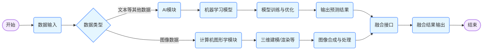

# AI与计算机图形学的融合:机遇与挑战

> 关键词：AI、计算机图形学、融合、机遇、挑战

> 摘要：本文深入探讨了AI与计算机图形学融合这一前沿领域。首先介绍了研究的背景、目的、预期读者等内容，接着阐述了AI与计算机图形学的核心概念及联系，详细讲解了相关核心算法原理、数学模型和公式。通过项目实战展示了二者融合的实际代码案例和开发过程，分析了其实际应用场景。同时推荐了学习、开发相关的工具和资源，最后总结了未来发展趋势与挑战，并对常见问题进行解答，给出扩展阅读和参考资料，旨在为读者全面呈现AI与计算机图形学融合的全貌。

## 1. 背景介绍 
### 1.1 目的和范围
AI（人工智能）和计算机图形学作为计算机科学领域的两大重要分支，近年来各自取得了显著的进展。本文章旨在深入探讨AI与计算机图形学融合所带来的机遇与挑战。范围涵盖从核心概念的介绍，到相关算法原理、数学模型的分析，再到实际项目的案例展示以及未来发展趋势的展望。通过全面的研究，为相关领域的研究者、开发者和爱好者提供一个系统的参考。

### 1.2 预期读者
本文预期读者包括计算机科学专业的学生、从事AI和计算机图形学研究的科研人员、相关领域的开发者以及对新兴技术感兴趣的爱好者。对于学生来说，可作为学习参考资料，帮助他们了解前沿技术；科研人员可以从中获取新的研究思路；开发者能借鉴实际案例进行项目开发；爱好者则可以对这一领域有一个初步的认识。

### 1.3 文档结构概述
本文首先介绍背景信息，让读者了解研究的目的和适用对象。接着阐述AI与计算机图形学的核心概念及它们之间的联系，为后续的内容打下基础。然后详细讲解核心算法原理和具体操作步骤，通过Python代码进行阐述。之后介绍数学模型和公式，并举例说明。再通过项目实战展示代码案例和详细解释。分析实际应用场景，推荐学习和开发所需的工具和资源。最后总结未来发展趋势与挑战，解答常见问题并给出扩展阅读和参考资料。

### 1.4 术语表
#### 1.4.1 核心术语定义
- **AI（人工智能）**：是一门研究如何使计算机能够模拟人类智能的学科，包括机器学习、深度学习、自然语言处理等多个领域。
- **计算机图形学**：主要研究如何在计算机中表示、处理和显示图形的学科，涉及到图像生成、动画制作、三维建模等方面。
- **GAN（生成对抗网络）**：是一种深度学习模型，由生成器和判别器组成，用于生成新的数据样本。
- **CNN（卷积神经网络）**：是一种专门用于处理具有网格结构数据（如图像）的深度学习模型。

#### 1.4.2 相关概念解释
- **图像合成**：利用计算机技术将多个图像或图像元素组合成一个新的图像的过程。
- **风格迁移**：将一种图像的风格应用到另一种图像上，使目标图像具有源图像的风格特征。
- **三维重建**：根据二维图像或其他数据重建出三维物体模型的过程。

#### 1.4.3 缩略词列表
- **AI**：Artificial Intelligence
- **GAN**：Generative Adversarial Networks
- **CNN**：Convolutional Neural Networks
- **ML**：Machine Learning
- **DL**：Deep Learning

## 2. 核心概念与联系 

### 核心概念原理
#### AI的核心原理
AI的核心在于模拟人类的智能行为，通过数据驱动的方式让计算机学习和做出决策。机器学习是AI的重要组成部分，它通过对大量数据的学习来发现数据中的模式和规律。深度学习则是机器学习的一个分支，它利用深度神经网络来处理复杂的数据，如图像、语音等。深度神经网络由多个神经元层组成，通过不断调整神经元之间的连接权重来优化模型的性能。

#### 计算机图形学的核心原理
计算机图形学主要研究如何在计算机中表示和处理图形。在二维图形方面，涉及到图像的像素表示、颜色模型等概念。在三维图形方面，需要进行三维建模，包括物体的几何形状、材质、光照等信息的表示。通过渲染算法将三维模型转换为二维图像，常见的渲染算法有光线追踪、光栅化等。

### 架构的文本示意图
```plaintext
AI与计算机图形学融合架构
|-- AI模块
|   |-- 数据输入（图像、文本等）
|   |-- 机器学习模型（CNN、GAN等）
|   |-- 模型训练与优化
|   |-- 输出预测结果
|-- 计算机图形学模块
|   |-- 三维建模（几何形状、材质等）
|   |-- 渲染算法（光线追踪、光栅化）
|   |-- 动画制作
|   |-- 图像合成与处理
|-- 融合接口
|   |-- 将AI预测结果应用到图形学处理中
|   |-- 利用图形学数据训练AI模型
```

### Mermaid流程图


## 3. 核心算法原理 & 具体操作步骤 

### GAN算法原理
GAN由生成器（Generator）和判别器（Discriminator）组成。生成器的目标是生成逼真的数据样本，而判别器的目标是区分生成的样本和真实的样本。二者通过对抗训练的方式不断提高性能。

以下是一个简单的GAN实现的Python代码示例：
```python
import torch
import torch.nn as nn
import torch.optim as optim
import numpy as np

# 定义生成器
class Generator(nn.Module):
    def __init__(self, input_dim, output_dim):
        super(Generator, self).__init__()
        self.model = nn.Sequential(
            nn.Linear(input_dim, 128),
            nn.LeakyReLU(0.2),
            nn.Linear(128, 256),
            nn.BatchNorm1d(256),
            nn.LeakyReLU(0.2),
            nn.Linear(256, 512),
            nn.BatchNorm1d(512),
            nn.LeakyReLU(0.2),
            nn.Linear(512, output_dim),
            nn.Tanh()
        )

    def forward(self, z):
        return self.model(z)

# 定义判别器
class Discriminator(nn.Module):
    def __init__(self, input_dim):
        super(Discriminator, self).__init__()
        self.model = nn.Sequential(
            nn.Linear(input_dim, 512),
            nn.LeakyReLU(0.2),
            nn.Linear(512, 256),
            nn.LeakyReLU(0.2),
            nn.Linear(256, 1),
            nn.Sigmoid()
        )

    def forward(self, x):
        return self.model(x)

# 超参数设置
input_dim = 100
output_dim = 784
batch_size = 32
epochs = 100
lr = 0.0002

# 初始化生成器和判别器
generator = Generator(input_dim, output_dim)
discriminator = Discriminator(output_dim)

# 定义损失函数和优化器
criterion = nn.BCELoss()
g_optimizer = optim.Adam(generator.parameters(), lr=lr)
d_optimizer = optim.Adam(discriminator.parameters(), lr=lr)

# 模拟数据
real_data = torch.randn(batch_size, output_dim)

for epoch in range(epochs):
    # 训练判别器
    d_optimizer.zero_grad()
    real_labels = torch.ones(batch_size, 1)
    fake_labels = torch.zeros(batch_size, 1)

    # 计算判别器对真实数据的损失
    real_output = discriminator(real_data)
    d_real_loss = criterion(real_output, real_labels)

    # 生成假数据
    z = torch.randn(batch_size, input_dim)
    fake_data = generator(z)

    # 计算判别器对假数据的损失
    fake_output = discriminator(fake_data.detach())
    d_fake_loss = criterion(fake_output, fake_labels)

    # 总判别器损失
    d_loss = d_real_loss + d_fake_loss
    d_loss.backward()
    d_optimizer.step()

    # 训练生成器
    g_optimizer.zero_grad()
    fake_output = discriminator(fake_data)
    g_loss = criterion(fake_output, real_labels)
    g_loss.backward()
    g_optimizer.step()

    if epoch % 10 == 0:
        print(f'Epoch [{epoch}/{epochs}] D_loss: {d_loss.item():.4f} G_loss: {g_loss.item():.4f}')
```

### 具体操作步骤
1. **数据准备**：收集和整理用于训练的图形数据，如图像、三维模型等。对数据进行预处理，包括归一化、裁剪等操作。
2. **模型选择**：根据具体的任务选择合适的AI模型，如CNN用于图像分类、GAN用于图像生成等。
3. **模型训练**：使用准备好的数据对选定的模型进行训练，调整模型的参数以提高性能。
4. **图形处理**：将训练好的AI模型应用到计算机图形学的任务中，如图像合成、风格迁移等。
5. **评估和优化**：对融合后的结果进行评估，根据评估结果对模型和算法进行优化。

## 4. 数学模型和公式 & 详细讲解 & 举例说明 

### GAN的数学模型和公式
GAN的目标可以表示为一个极小极大博弈问题：
$$
\min_G \max_D V(D, G)=\mathbb{E}_{\mathbf{x} \sim p_{\text {data }}(\mathbf{x})}[\log D(\mathbf{x})]+\mathbb{E}_{\mathbf{z} \sim p_{\mathbf{z}}(\mathbf{z})}[\log (1 - D(G(\mathbf{z})))]
$$
其中，$D$ 是判别器，$G$ 是生成器，$p_{\text {data }}(\mathbf{x})$ 是真实数据的分布，$p_{\mathbf{z}}(\mathbf{z})$ 是噪声的分布。

#### 详细讲解
- **判别器的目标**：最大化 $V(D, G)$，即尽可能准确地区分真实数据和生成的数据。
- **生成器的目标**：最小化 $V(D, G)$，即生成尽可能逼真的数据来欺骗判别器。

#### 举例说明
假设我们要生成手写数字图像。真实数据是从MNIST数据集中选取的手写数字图像，噪声数据是随机生成的向量。生成器将噪声向量转换为手写数字图像，判别器则判断输入的图像是真实的还是生成的。通过不断的对抗训练，生成器生成的图像会越来越逼真。

### CNN的数学模型和公式
CNN主要由卷积层、池化层和全连接层组成。

#### 卷积层
卷积操作可以表示为：
$$
y_{i, j}^{(l)}=\sum_{m=0}^{M - 1} \sum_{n=0}^{N - 1} x_{i + m, j + n}^{(l - 1)} w_{m, n}^{(l)}+b^{(l)}
$$
其中，$y_{i, j}^{(l)}$ 是第 $l$ 层的输出特征图的第 $(i, j)$ 个元素，$x_{i + m, j + n}^{(l - 1)}$ 是第 $l - 1$ 层的输入特征图的元素，$w_{m, n}^{(l)}$ 是卷积核的元素，$b^{(l)}$ 是偏置。

#### 池化层
常见的池化操作有最大池化和平均池化。以最大池化为例，其公式为：
$$
y_{i, j}^{(l)}=\max _{m, n \in \mathcal{R}_{i, j}} x_{m, n}^{(l - 1)}
$$
其中，$\mathcal{R}_{i, j}$ 是池化区域。

#### 举例说明
假设我们有一个 $3\times3$ 的卷积核，输入特征图的大小为 $5\times5$。卷积操作会在输入特征图上滑动卷积核，计算每个位置的卷积结果，得到一个新的特征图。池化操作则会对特征图进行下采样，减少数据的维度。

## 5. 项目实战：代码实际案例和详细解释说明 

### 5.1  开发环境搭建
#### 安装Python
首先需要安装Python，建议使用Python 3.7及以上版本。可以从Python官方网站（https://www.python.org/downloads/）下载安装包进行安装。

#### 安装深度学习框架
推荐使用PyTorch作为深度学习框架，可以根据自己的系统和CUDA版本选择合适的安装方式。例如，在Linux系统上使用以下命令安装：
```sh
pip install torch torchvision
```

#### 安装其他依赖库
还需要安装一些其他的依赖库，如NumPy、Matplotlib等：
```sh
pip install numpy matplotlib
```

### 5.2  源代码详细实现和代码解读
以下是一个基于CNN的图像分类项目的代码示例：
```python
import torch
import torch.nn as nn
import torch.optim as optim
import torchvision
import torchvision.transforms as transforms
import matplotlib.pyplot as plt
import numpy as np

# 数据预处理
transform = transforms.Compose(
    [transforms.ToTensor(),
     transforms.Normalize((0.5, 0.5, 0.5), (0.5, 0.5, 0.5))])

# 加载训练集和测试集
trainset = torchvision.datasets.CIFAR10(root='./data', train=True,
                                        download=True, transform=transform)
trainloader = torch.utils.data.DataLoader(trainset, batch_size=4,
                                          shuffle=True, num_workers=2)

testset = torchvision.datasets.CIFAR10(root='./data', train=False,
                                       download=True, transform=transform)
testloader = torch.utils.data.DataLoader(testset, batch_size=4,
                                         shuffle=False, num_workers=2)

classes = ('plane', 'car', 'bird', 'cat',
           'deer', 'dog', 'frog', 'horse', 'ship', 'truck')

# 定义CNN模型
class Net(nn.Module):
    def __init__(self):
        super(Net, self).__init__()
        self.conv1 = nn.Conv2d(3, 6, 5)
        self.pool = nn.MaxPool2d(2, 2)
        self.conv2 = nn.Conv2d(6, 16, 5)
        self.fc1 = nn.Linear(16 * 5 * 5, 120)
        self.fc2 = nn.Linear(120, 84)
        self.fc3 = nn.Linear(84, 10)

    def forward(self, x):
        x = self.pool(torch.relu(self.conv1(x)))
        x = self.pool(torch.relu(self.conv2(x)))
        x = x.view(-1, 16 * 5 * 5)
        x = torch.relu(self.fc1(x))
        x = torch.relu(self.fc2(x))
        x = self.fc3(x)
        return x

net = Net()

# 定义损失函数和优化器
criterion = nn.CrossEntropyLoss()
optimizer = optim.SGD(net.parameters(), lr=0.001, momentum=0.9)

# 训练模型
for epoch in range(2):  # 训练2个epoch
    running_loss = 0.0
    for i, data in enumerate(trainloader, 0):
        # 获取输入数据
        inputs, labels = data

        # 梯度清零
        optimizer.zero_grad()

        # 前向传播 + 反向传播 + 优化
        outputs = net(inputs)
        loss = criterion(outputs, labels)
        loss.backward()
        optimizer.step()

        # 打印统计信息
        running_loss += loss.item()
        if i % 2000 == 1999:    # 每2000个batch打印一次
            print(f'[{epoch + 1}, {i + 1:5d}] loss: {running_loss / 2000:.3f}')
            running_loss = 0.0

print('Finished Training')

# 测试模型
correct = 0
total = 0
with torch.no_grad():
    for data in testloader:
        images, labels = data
        outputs = net(images)
        _, predicted = torch.max(outputs.data, 1)
        total += labels.size(0)
        correct += (predicted == labels).sum().item()

print(f'Accuracy of the network on the 10000 test images: {100 * correct / total} %')
```

### 5.3  代码解读与分析
#### 数据预处理
使用 `transforms.Compose` 对图像数据进行预处理，包括将图像转换为张量和归一化操作。

#### 数据加载
使用 `torchvision.datasets.CIFAR10` 加载CIFAR-10数据集，并使用 `torch.utils.data.DataLoader` 创建数据加载器。

#### 模型定义
定义了一个简单的CNN模型，包含两个卷积层、两个池化层和三个全连接层。

#### 损失函数和优化器
使用交叉熵损失函数 `nn.CrossEntropyLoss` 和随机梯度下降优化器 `optim.SGD`。

#### 训练模型
通过循环迭代训练集，进行前向传播、反向传播和参数更新。

#### 测试模型
使用测试集对训练好的模型进行测试，计算模型的准确率。

## 6. 实际应用场景 
### 游戏开发
在游戏开发中，AI与计算机图形学的融合可以带来更加逼真的游戏场景和智能的游戏角色。例如，使用GAN生成游戏中的地形、建筑等场景元素，使用深度学习模型实现游戏角色的智能行为，如自主决策、路径规划等。

### 影视制作
在影视制作中，AI可以辅助计算机图形学进行特效制作和动画生成。例如，通过风格迁移技术将真实场景转换为特定的艺术风格，使用深度学习模型进行角色动画的自动生成，提高制作效率和质量。

### 虚拟现实和增强现实
在虚拟现实（VR）和增强现实（AR）领域，AI与计算机图形学的融合可以提供更加沉浸式的体验。例如，使用计算机图形学生成虚拟场景，使用AI技术实现场景的实时交互和智能响应，如根据用户的动作和表情实时调整虚拟场景。

### 工业设计
在工业设计中，AI可以帮助计算机图形学进行产品的三维建模和设计优化。例如，通过深度学习模型对产品的外观和性能进行预测和优化，使用计算机图形学技术进行产品的可视化展示。

## 7. 工具和资源推荐
### 7.1 学习资源推荐
#### 7.1.1 书籍推荐
- 《深度学习》（Deep Learning）：由Ian Goodfellow、Yoshua Bengio和Aaron Courville所著，是深度学习领域的经典教材。
- 《计算机图形学原理及实践》（Computer Graphics: Principles and Practice）：全面介绍了计算机图形学的基本原理和实践方法。
- 《人工智能：一种现代的方法》（Artificial Intelligence: A Modern Approach）：是人工智能领域的权威教材，涵盖了机器学习、知识表示等多个方面。

#### 7.1.2 在线课程
- Coursera上的“深度学习专项课程”（Deep Learning Specialization）：由Andrew Ng教授授课，系统地介绍了深度学习的各个方面。
- edX上的“计算机图形学基础”（Foundations of Computer Graphics）：提供了计算机图形学的基础知识和实践经验。
- Udemy上的“AI与计算机图形学实战课程”：结合实际项目，讲解AI与计算机图形学的融合应用。

#### 7.1.3 技术博客和网站
- Medium：有许多关于AI和计算机图形学的技术文章和研究成果分享。
- arXiv：是一个预印本平台，提供了大量的最新学术论文。
- NVIDIA Developer Blog：NVIDIA官方博客，分享了许多关于GPU加速计算、深度学习和计算机图形学的技术文章。

### 7.2 开发工具框架推荐
#### 7.2.1 IDE和编辑器
- PyCharm：是一款专门用于Python开发的集成开发环境，提供了丰富的代码编辑、调试和版本控制功能。
- Visual Studio Code：是一款轻量级的代码编辑器，支持多种编程语言，有丰富的插件扩展。
- JetBrains Rider：适用于.NET开发，也支持Python和其他语言，提供了强大的代码分析和调试功能。

#### 7.2.2 调试和性能分析工具
- TensorBoard：是TensorFlow的可视化工具，可用于监控模型的训练过程、可视化模型结构等。
- Py-Spy：是一个用于Python代码的性能分析工具，可以帮助找出代码中的性能瓶颈。
- NVIDIA Nsight：是NVIDIA提供的GPU性能分析工具，可用于优化深度学习和计算机图形学应用的性能。

#### 7.2.3 相关框架和库
- PyTorch：是一个开源的深度学习框架，具有动态图和易于使用的特点。
- TensorFlow：是Google开发的深度学习框架，具有广泛的应用和丰富的工具生态。
- OpenCV：是一个开源的计算机视觉库，提供了许多图像处理和计算机视觉算法。
- Blender：是一个开源的三维建模和动画制作软件，支持Python脚本编程。

### 7.3 相关论文著作推荐
#### 7.3.1 经典论文
- “Generative Adversarial Nets”：首次提出了生成对抗网络的概念。
- “ImageNet Classification with Deep Convolutional Neural Networks”：介绍了AlexNet，开启了深度学习在图像分类领域的热潮。
- “A Neural Algorithm of Artistic Style”：提出了风格迁移的算法。

#### 7.3.2 最新研究成果
- 在arXiv和顶级学术会议（如CVPR、NeurIPS等）上可以找到关于AI与计算机图形学融合的最新研究成果。

#### 7.3.3 应用案例分析
- 一些知名公司（如NVIDIA、Adobe等）的技术博客和研究报告中会分享AI与计算机图形学融合的应用案例。

## 8. 总结：未来发展趋势与挑战
### 未来发展趋势
- **更加智能的图形生成**：AI将能够生成更加逼真、复杂的图形和动画，减少人工干预。
- **实时交互与反馈**：在VR、AR等领域，实现更加实时的交互和智能反馈，提高用户体验。
- **跨领域融合**：AI与计算机图形学将与其他领域（如生物学、医学等）进行更深入的融合，开拓新的应用场景。

### 挑战
- **数据隐私和安全**：AI需要大量的数据进行训练，如何保护数据的隐私和安全是一个重要的问题。
- **计算资源需求**：深度学习模型的训练和推理需要大量的计算资源，如何提高计算效率是一个挑战。
- **算法可解释性**：AI模型通常是黑盒模型，如何解释模型的决策过程和结果是一个亟待解决的问题。

## 9. 附录：常见问题与解答
### 问题1：AI与计算机图形学融合的难度在哪里？
解答：融合的难度主要在于两个领域的知识体系差异较大，需要开发者同时掌握AI和计算机图形学的知识。此外，如何将AI的预测结果有效地应用到计算机图形学的任务中，以及如何利用图形学数据训练高效的AI模型也是挑战。

### 问题2：如何选择适合的AI模型用于计算机图形学任务？
解答：需要根据具体的任务需求来选择。例如，对于图像生成任务，可以选择GAN；对于图像分类任务，可以选择CNN。同时，还需要考虑模型的复杂度、训练时间和性能等因素。

### 问题3：AI与计算机图形学融合对硬件有什么要求？
解答：由于深度学习模型的训练和推理需要大量的计算资源，通常需要配备高性能的GPU。此外，对于大规模的图形数据处理，还需要足够的内存和存储空间。

## 10. 扩展阅读 & 参考资料
### 扩展阅读
- 《人工智能时代的计算机图形学新进展》
- 《深度学习在计算机图形学中的应用案例集》

### 参考资料
- Goodfellow, I. J., Bengio, Y., & Courville, A. (2016). Deep Learning. MIT Press.
- Foley, J. D., van Dam, A., Feiner, S. K., & Hughes, J. F. (2013). Computer Graphics: Principles and Practice. Addison-Wesley.
- Russell, S. J., & Norvig, P. (2016). Artificial Intelligence: A Modern Approach. Pearson.

作者：AI天才研究院/AI Genius Institute & 禅与计算机程序设计艺术 /Zen And The Art of Computer Programming