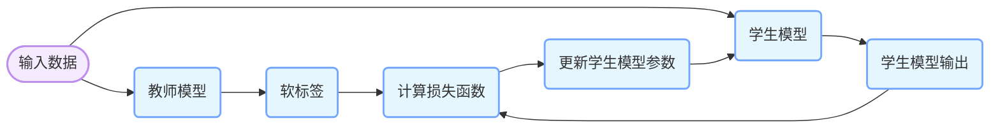

# AI中的知识蒸馏:从大模型到小模型的技能传递

> 关键词：知识蒸馏、大模型、小模型、技能传递、人工智能

> 摘要：本文围绕AI中的知识蒸馏展开，深入探讨从大模型到小模型的技能传递过程。首先介绍了知识蒸馏的背景，包括目的、预期读者等内容。接着阐述了知识蒸馏的核心概念与联系，通过文本示意图和Mermaid流程图进行直观展示。详细讲解了核心算法原理，用Python代码呈现具体操作步骤，并给出了相关的数学模型和公式。通过项目实战，展示代码实际案例并进行详细解释。分析了知识蒸馏的实际应用场景，推荐了相关的学习资源、开发工具框架以及论文著作。最后总结了知识蒸馏的未来发展趋势与挑战，还给出了常见问题与解答以及扩展阅读和参考资料。

## 1. 背景介绍 
### 1.1 目的和范围
在人工智能领域，大模型如GPT - 3、BERT等展现出了强大的性能，但它们通常具有巨大的参数量和高昂的计算成本，这使得在资源受限的设备（如移动终端、嵌入式设备）上部署这些模型变得困难。知识蒸馏的目的就是将大模型（教师模型）所学到的知识传递给小模型（学生模型），使得小模型在保持相对较低的计算资源消耗的同时，尽可能达到与大模型相近的性能。

本文的范围将涵盖知识蒸馏的基本概念、核心算法原理、数学模型、实际代码案例以及其在不同场景下的应用，旨在为读者全面深入地介绍知识蒸馏这一技术。

### 1.2 预期读者
本文预期读者包括对人工智能、机器学习感兴趣的研究人员、开发者，以及希望了解知识蒸馏技术原理和应用的技术爱好者。无论是初学者想要了解基础知识，还是有一定经验的从业者寻求技术提升，都能从本文中获得有价值的信息。

### 1.3 文档结构概述
本文将按照以下结构进行阐述：首先介绍知识蒸馏的背景信息，包括目的、读者群体和文档结构。接着深入讲解知识蒸馏的核心概念，通过文本示意图和流程图进行清晰展示。然后详细说明核心算法原理，并给出Python代码示例。之后介绍知识蒸馏的数学模型和公式，并举例说明。通过项目实战，展示代码的实际应用和详细解读。分析知识蒸馏在不同场景下的实际应用。推荐相关的学习资源、开发工具框架和论文著作。最后总结知识蒸馏的未来发展趋势与挑战，提供常见问题解答和扩展阅读资料。

### 1.4 术语表
#### 1.4.1 核心术语定义
- **知识蒸馏（Knowledge Distillation）**：一种将大模型（教师模型）的知识传递给小模型（学生模型）的技术，通过让学生模型学习教师模型的输出分布，从而提升学生模型的性能。
- **教师模型（Teacher Model）**：具有大量参数和强大性能的大模型，作为知识的提供者，其输出将用于指导学生模型的训练。
- **学生模型（Student Model）**：参数量相对较少、计算成本较低的小模型，通过学习教师模型的知识来提高自身性能。
- **软标签（Soft Labels）**：教师模型输出的概率分布，包含了比硬标签（如分类任务中的类别标签）更多的信息，用于指导学生模型的学习。

#### 1.4.2 相关概念解释
- **模型压缩**：为了减少模型的存储和计算成本，对模型进行优化的一系列技术，知识蒸馏是其中的一种重要方法。
- **迁移学习**：将在一个任务上学习到的知识迁移到另一个相关任务上的技术，知识蒸馏可以看作是一种特殊的迁移学习，是从大模型向小模型的知识迁移。

#### 1.4.3 缩略词列表
- **DNN**：Deep Neural Network，深度神经网络
- **CNN**：Convolutional Neural Network，卷积神经网络
- **RNN**：Recurrent Neural Network，循环神经网络

## 2. 核心概念与联系 
知识蒸馏的核心思想是让学生模型学习教师模型的输出分布，从而获取教师模型所学到的知识。其基本流程如下：

### 文本示意图
教师模型接收输入数据，经过一系列的神经网络层计算，输出一个概率分布（软标签）。同时，输入数据也被输入到学生模型中，学生模型同样输出一个概率分布。通过比较学生模型的输出和教师模型的输出，计算两者之间的损失函数，然后使用优化算法更新学生模型的参数，使得学生模型的输出逐渐接近教师模型的输出。

### Mermaid流程图


在这个流程图中，输入数据同时被输入到教师模型和学生模型中。教师模型输出软标签，学生模型输出自己的预测结果。通过计算两者之间的损失函数，使用优化算法更新学生模型的参数，不断迭代这个过程，直到学生模型的性能达到满意的程度。

## 3. 核心算法原理 & 具体操作步骤 
### 核心算法原理
知识蒸馏的核心是通过最小化学生模型输出和教师模型输出之间的差异来训练学生模型。通常使用的损失函数是蒸馏损失（Distillation Loss），它由两部分组成：一部分是学生模型输出和教师模型输出之间的软标签损失，另一部分是学生模型输出和真实标签之间的硬标签损失。

蒸馏损失的计算公式如下：
$$
L_{distillation} = \alpha \cdot L_{soft} + (1 - \alpha) \cdot L_{hard}
$$
其中，$L_{soft}$ 是软标签损失，通常使用KL散度（Kullback - Leibler Divergence）来计算；$L_{hard}$ 是硬标签损失，通常使用交叉熵损失（Cross - Entropy Loss）来计算；$\alpha$ 是一个超参数，用于平衡软标签损失和硬标签损失的权重。

### 具体操作步骤
以下是使用Python和PyTorch实现知识蒸馏的具体步骤：

```python
import torch
import torch.nn as nn
import torch.optim as optim

# 定义教师模型
class TeacherModel(nn.Module):
    def __init__(self):
        super(TeacherModel, self).__init__()
        # 这里简单定义一个全连接层网络作为示例
        self.fc1 = nn.Linear(10, 20)
        self.fc2 = nn.Linear(20, 5)

    def forward(self, x):
        x = torch.relu(self.fc1(x))
        x = self.fc2(x)
        return x

# 定义学生模型
class StudentModel(nn.Module):
    def __init__(self):
        super(StudentModel, self).__init__()
        # 学生模型的参数相对较少
        self.fc1 = nn.Linear(10, 10)
        self.fc2 = nn.Linear(10, 5)

    def forward(self, x):
        x = torch.relu(self.fc1(x))
        x = self.fc2(x)
        return x

# 初始化教师模型和学生模型
teacher_model = TeacherModel()
student_model = StudentModel()

# 定义优化器和损失函数
optimizer = optim.Adam(student_model.parameters(), lr=0.001)
soft_loss = nn.KLDivLoss(reduction='batchmean')
hard_loss = nn.CrossEntropyLoss()

# 超参数
alpha = 0.5

# 模拟训练数据
num_samples = 100
input_data = torch.randn(num_samples, 10)
labels = torch.randint(0, 5, (num_samples,))

# 训练学生模型
num_epochs = 10
for epoch in range(num_epochs):
    optimizer.zero_grad()
    
    # 教师模型输出
    teacher_output = teacher_model(input_data)
    teacher_probs = torch.softmax(teacher_output, dim=1)
    
    # 学生模型输出
    student_output = student_model(input_data)
    student_probs = torch.softmax(student_output, dim=1)
    
    # 计算软标签损失
    L_soft = soft_loss(torch.log(student_probs), teacher_probs)
    
    # 计算硬标签损失
    L_hard = hard_loss(student_output, labels)
    
    # 计算蒸馏损失
    L_distillation = alpha * L_soft + (1 - alpha) * L_hard
    
    # 反向传播和参数更新
    L_distillation.backward()
    optimizer.step()
    
    print(f'Epoch {epoch+1}/{num_epochs}, Loss: {L_distillation.item()}')
```

### 代码解释
1. **模型定义**：定义了教师模型和学生模型，教师模型的参数相对较多，学生模型的参数相对较少。
2. **优化器和损失函数**：使用Adam优化器来更新学生模型的参数，使用KL散度损失函数计算软标签损失，使用交叉熵损失函数计算硬标签损失。
3. **训练过程**：在每个训练周期中，首先计算教师模型的输出和学生模型的输出，然后分别计算软标签损失和硬标签损失，最后根据蒸馏损失公式计算总的损失，并进行反向传播和参数更新。

## 4. 数学模型和公式 & 详细讲解 & 举例说明 
### 数学模型和公式
#### 1. KL散度（Kullback - Leibler Divergence）
KL散度用于衡量两个概率分布之间的差异，其计算公式如下：
$$
D_{KL}(P || Q) = \sum_{i} P(i) \log \frac{P(i)}{Q(i)}
$$
其中，$P$ 和 $Q$ 是两个概率分布，$i$ 是分布中的元素。在知识蒸馏中，$P$ 通常是教师模型输出的概率分布，$Q$ 是学生模型输出的概率分布。

#### 2. 交叉熵损失（Cross - Entropy Loss）
交叉熵损失用于衡量模型预测结果和真实标签之间的差异，其计算公式如下：
$$
L_{CE} = - \sum_{i} y_i \log p_i
$$
其中，$y_i$ 是真实标签的概率分布（通常是一个one - hot向量），$p_i$ 是模型预测的概率分布。

#### 3. 蒸馏损失（Distillation Loss）
如前面所述，蒸馏损失的计算公式为：
$$
L_{distillation} = \alpha \cdot L_{soft} + (1 - \alpha) \cdot L_{hard}
$$

### 详细讲解
- **KL散度**：KL散度的值越小，说明两个概率分布越接近。在知识蒸馏中，通过最小化学生模型输出和教师模型输出之间的KL散度，使得学生模型的输出分布逐渐接近教师模型的输出分布。
- **交叉熵损失**：交叉熵损失反映了模型预测结果和真实标签之间的差距。在知识蒸馏中，加入交叉熵损失可以保证学生模型仍然能够学习到真实标签的信息。
- **蒸馏损失**：通过调整超参数 $\alpha$，可以平衡软标签损失和硬标签损失的权重。当 $\alpha$ 较大时，学生模型更倾向于学习教师模型的输出分布；当 $\alpha$ 较小时，学生模型更注重学习真实标签的信息。

### 举例说明
假设在一个三分类任务中，教师模型的输出概率分布为 $P = [0.1, 0.3, 0.6]$，学生模型的输出概率分布为 $Q = [0.2, 0.2, 0.6]$。

#### 计算KL散度
$$
\begin{align*}
D_{KL}(P || Q) &= 0.1 \log \frac{0.1}{0.2} + 0.3 \log \frac{0.3}{0.2} + 0.6 \log \frac{0.6}{0.6} \\
&= 0.1 \log 0.5 + 0.3 \log 1.5 + 0 \\
&\approx -0.1 \times 0.693 + 0.3 \times 0.405 \\
&\approx -0.0693 + 0.1215 \\
&\approx 0.0522
\end{align*}
$$

假设真实标签为 $y = [0, 0, 1]$，则学生模型的交叉熵损失为：
$$
\begin{align*}
L_{CE} &= - (0 \log 0.2 + 0 \log 0.2 + 1 \log 0.6) \\
&= - \log 0.6 \\
&\approx 0.5108
\end{align*}
$$

假设 $\alpha = 0.5$，则蒸馏损失为：
$$
L_{distillation} = 0.5 \times 0.0522 + (1 - 0.5) \times 0.5108 = 0.0261 + 0.2554 = 0.2815
$$

## 5. 项目实战：代码实际案例和详细解释说明 
### 5.1  开发环境搭建
#### 操作系统
可以选择Windows、Linux或macOS等常见的操作系统。

#### 编程语言和框架
使用Python作为编程语言，推荐使用Anaconda来管理Python环境。同时，需要安装PyTorch深度学习框架，可以根据自己的显卡情况选择安装CPU版本或GPU版本。

```bash
# 创建一个新的Anaconda环境
conda create -n knowledge_distillation python=3.8
conda activate knowledge_distillation

# 安装PyTorch
# CPU版本
pip install torch torchvision torchaudio

# GPU版本（以CUDA 11.3为例）
pip install torch torchvision torchaudio --extra-index-url https://download.pytorch.org/whl/cu113
```

### 5.2  源代码详细实现和代码解读
以下是一个更完整的知识蒸馏项目代码示例，使用MNIST数据集进行图像分类任务：

```python
import torch
import torch.nn as nn
import torch.optim as optim
import torchvision
import torchvision.transforms as transforms

# 定义教师模型
class TeacherModel(nn.Module):
    def __init__(self):
        super(TeacherModel, self).__init__()
        self.conv1 = nn.Conv2d(1, 16, kernel_size=3, padding=1)
        self.pool = nn.MaxPool2d(2, 2)
        self.conv2 = nn.Conv2d(16, 32, kernel_size=3, padding=1)
        self.fc1 = nn.Linear(32 * 7 * 7, 128)
        self.fc2 = nn.Linear(128, 10)

    def forward(self, x):
        x = self.pool(torch.relu(self.conv1(x)))
        x = self.pool(torch.relu(self.conv2(x)))
        x = x.view(-1, 32 * 7 * 7)
        x = torch.relu(self.fc1(x))
        x = self.fc2(x)
        return x

# 定义学生模型
class StudentModel(nn.Module):
    def __init__(self):
        super(StudentModel, self).__init__()
        self.conv1 = nn.Conv2d(1, 8, kernel_size=3, padding=1)
        self.pool = nn.MaxPool2d(2, 2)
        self.fc1 = nn.Linear(8 * 7 * 7, 64)
        self.fc2 = nn.Linear(64, 10)

    def forward(self, x):
        x = self.pool(torch.relu(self.conv1(x)))
        x = x.view(-1, 8 * 7 * 7)
        x = torch.relu(self.fc1(x))
        x = self.fc2(x)
        return x

# 数据加载
transform = transforms.Compose([
    transforms.ToTensor(),
    transforms.Normalize((0.5,), (0.5,))
])

trainset = torchvision.datasets.MNIST(root='./data', train=True,
                                      download=True, transform=transform)
trainloader = torch.utils.data.DataLoader(trainset, batch_size=64,
                                          shuffle=True)

testset = torchvision.datasets.MNIST(root='./data', train=False,
                                     download=True, transform=transform)
testloader = torch.utils.data.DataLoader(testset, batch_size=64,
                                         shuffle=False)

# 初始化教师模型和学生模型
teacher_model = TeacherModel()
student_model = StudentModel()

# 定义优化器和损失函数
optimizer = optim.Adam(student_model.parameters(), lr=0.001)
soft_loss = nn.KLDivLoss(reduction='batchmean')
hard_loss = nn.CrossEntropyLoss()

# 超参数
alpha = 0.5
temperature = 2.0

# 训练教师模型（这里简单假设教师模型已经训练好）
#...

# 训练学生模型
num_epochs = 10
for epoch in range(num_epochs):
    running_loss = 0.0
    for i, data in enumerate(trainloader, 0):
        inputs, labels = data
        
        # 教师模型输出
        with torch.no_grad():
            teacher_output = teacher_model(inputs)
            teacher_probs = torch.softmax(teacher_output / temperature, dim=1)
        
        # 学生模型输出
        student_output = student_model(inputs)
        student_probs = torch.softmax(student_output / temperature, dim=1)
        
        # 计算软标签损失
        L_soft = soft_loss(torch.log(student_probs), teacher_probs)
        
        # 计算硬标签损失
        L_hard = hard_loss(student_output, labels)
        
        # 计算蒸馏损失
        L_distillation = alpha * L_soft + (1 - alpha) * L_hard
        
        # 反向传播和参数更新
        optimizer.zero_grad()
        L_distillation.backward()
        optimizer.step()
        
        running_loss += L_distillation.item()
    
    print(f'Epoch {epoch+1}/{num_epochs}, Loss: {running_loss / len(trainloader)}')

# 测试学生模型
correct = 0
total = 0
with torch.no_grad():
    for data in testloader:
        images, labels = data
        outputs = student_model(images)
        _, predicted = torch.max(outputs.data, 1)
        total += labels.size(0)
        correct += (predicted == labels).sum().item()

print(f'Accuracy of the student network on the 10000 test images: {100 * correct / total}%')
```

### 代码解读与分析
#### 1. 模型定义
- **教师模型**：使用了两个卷积层和两个全连接层，参数量相对较多。
- **学生模型**：卷积层的通道数和全连接层的神经元数量都比教师模型少，参数量相对较少。

#### 2. 数据加载
使用`torchvision`库加载MNIST数据集，并进行归一化处理。

#### 3. 训练过程
- **教师模型输出**：在每个训练批次中，首先计算教师模型的输出，并将其转换为概率分布。
- **学生模型输出**：计算学生模型的输出，并将其转换为概率分布。
- **损失计算**：分别计算软标签损失和硬标签损失，然后根据蒸馏损失公式计算总的损失。
- **反向传播和参数更新**：使用优化器更新学生模型的参数。

#### 4. 测试过程
在训练完成后，使用测试集对学生模型进行测试，计算其准确率。

## 6. 实际应用场景 
### 移动端设备
在移动设备（如手机、平板电脑）上，由于计算资源和存储容量有限，难以部署大型的深度学习模型。知识蒸馏可以将大模型的知识传递给小模型，使得小模型在保持较高性能的同时，能够在移动设备上高效运行。例如，在图像识别、语音识别等应用中，使用经过知识蒸馏的小模型可以实现实时处理，提高用户体验。

### 嵌入式系统
嵌入式系统（如智能摄像头、智能家居设备等）通常具有较低的计算能力和内存。知识蒸馏技术可以帮助将复杂的深度学习模型压缩为适合嵌入式系统运行的小模型，从而实现智能监控、智能控制等功能。

### 边缘计算
在边缘计算场景中，数据需要在本地设备上进行快速处理，而不需要将数据传输到云端。知识蒸馏可以训练出轻量级的模型，在边缘设备上进行实时推理，减少数据传输延迟，提高系统的响应速度和安全性。

### 多模型集成
在一些复杂的任务中，可能需要使用多个模型进行集成。知识蒸馏可以将多个大模型的知识整合到一个小模型中，减少模型的数量和计算成本，同时提高模型的性能和效率。

## 7. 工具和资源推荐
### 7.1 学习资源推荐
#### 7.1.1 书籍推荐
- 《深度学习》（Deep Learning）：由Ian Goodfellow、Yoshua Bengio和Aaron Courville所著，是深度学习领域的经典教材，涵盖了深度学习的基本原理、算法和应用。
- 《动手学深度学习》（Dive into Deep Learning）：开源的深度学习教材，提供了丰富的代码示例和详细的讲解，适合初学者快速上手。

#### 7.1.2 在线课程
- Coursera上的“深度学习专项课程”（Deep Learning Specialization）：由Andrew Ng教授授课，包括神经网络、卷积神经网络、循环神经网络等多个方面的内容。
- edX上的“人工智能基础”（Fundamentals of Artificial Intelligence）：全面介绍了人工智能的基本概念、算法和应用。

#### 7.1.3 技术博客和网站
- Medium上的Towards Data Science：汇集了众多数据科学和人工智能领域的优秀文章，提供了最新的技术动态和实践经验。
- arXiv：预印本平台，包含了大量的人工智能领域的研究论文，可以及时了解最新的研究成果。

### 7.2 开发工具框架推荐
#### 7.2.1 IDE和编辑器
- PyCharm：功能强大的Python集成开发环境，提供了代码编辑、调试、版本控制等丰富的功能。
- Jupyter Notebook：交互式的开发环境，适合进行数据分析和模型实验，方便展示代码和结果。

#### 7.2.2 调试和性能分析工具
- TensorBoard：TensorFlow提供的可视化工具，可以用于监控模型的训练过程、查看模型的结构和性能指标。
- PyTorch Profiler：PyTorch提供的性能分析工具，可以帮助开发者找出代码中的性能瓶颈。

#### 7.2.3 相关框架和库
- PyTorch：开源的深度学习框架，具有动态图特性，易于使用和调试，广泛应用于学术界和工业界。
- TensorFlow：另一个流行的深度学习框架，提供了丰富的工具和库，支持分布式训练和模型部署。

### 7.3 相关论文著作推荐
#### 7.3.1 经典论文
- “Distilling the Knowledge in a Neural Network”：知识蒸馏领域的开山之作，由Geoffrey Hinton等人发表，详细介绍了知识蒸馏的基本原理和方法。
- “MobileNetV2: Inverted Residuals and Linear Bottlenecks”：提出了MobileNetV2架构，是一种轻量级的卷积神经网络，结合了知识蒸馏技术可以在移动设备上高效运行。

#### 7.3.2 最新研究成果
- 关注arXiv上关于知识蒸馏的最新论文，了解该领域的最新技术和研究方向。

#### 7.3.3 应用案例分析
- 一些顶级学术会议（如NeurIPS、ICML、CVPR等）上的论文会介绍知识蒸馏在不同领域的应用案例，可以从中学习到实际应用中的经验和技巧。

## 8. 总结：未来发展趋势与挑战
### 未来发展趋势
- **更高效的蒸馏方法**：研究人员将不断探索更高效的知识蒸馏方法，进一步提高小模型的性能，减少蒸馏过程中的计算成本和时间开销。
- **与其他技术的融合**：知识蒸馏可能会与模型剪枝、量化等其他模型压缩技术相结合，实现更强大的模型压缩效果。
- **跨领域应用**：知识蒸馏将在更多领域得到应用，如医疗、金融、交通等，为这些领域的智能化发展提供支持。

### 挑战
- **知识表示和传递的准确性**：如何准确地将大模型的知识传递给小模型，避免信息丢失和扭曲，是知识蒸馏面临的一个重要挑战。
- **蒸馏损失函数的设计**：目前的蒸馏损失函数还存在一些局限性，需要设计更合理的损失函数，以更好地平衡软标签损失和硬标签损失。
- **模型的泛化能力**：在知识蒸馏过程中，需要确保小模型具有良好的泛化能力，能够在不同的数据集和任务上取得较好的性能。

## 9. 附录：常见问题与解答
### 1. 知识蒸馏和模型压缩有什么关系？
知识蒸馏是模型压缩的一种重要方法，通过将大模型的知识传递给小模型，减少模型的参数量和计算成本，从而实现模型压缩的目的。

### 2. 如何选择合适的 $\alpha$ 值？
$\alpha$ 值的选择需要根据具体的任务和数据集进行调整。一般来说，可以通过实验来确定最佳的 $\alpha$ 值。当 $\alpha$ 较大时，学生模型更倾向于学习教师模型的输出分布；当 $\alpha$ 较小时，学生模型更注重学习真实标签的信息。

### 3. 知识蒸馏是否适用于所有类型的模型？
知识蒸馏适用于大多数类型的深度学习模型，包括神经网络、卷积神经网络、循环神经网络等。但对于一些特殊的模型，可能需要进行适当的调整和改进。

### 4. 教师模型是否一定要经过充分训练？
是的，教师模型需要经过充分训练，以确保其能够提供准确的知识。如果教师模型的性能不佳，那么传递给学生模型的知识也会不准确，从而影响学生模型的性能。

## 10. 扩展阅读 & 参考资料
- Hinton, G., Vinyals, O., & Dean, J. (2015). Distilling the Knowledge in a Neural Network. arXiv preprint arXiv:1503.02531.
- Sandler, M., Howard, A., Zhu, M., Zhmoginov, A., & Chen, L. C. (2018). MobileNetV2: Inverted Residuals and Linear Bottlenecks. In Proceedings of the IEEE conference on computer vision and pattern recognition (pp. 4510 - 4520).
- 《深度学习》（Deep Learning），Ian Goodfellow、Yoshua Bengio和Aaron Courville著
- 《动手学深度学习》（Dive into Deep Learning），李沐、Aston Zhang等著

作者：AI天才研究院/AI Genius Institute & 禅与计算机程序设计艺术 /Zen And The Art of Computer Programming