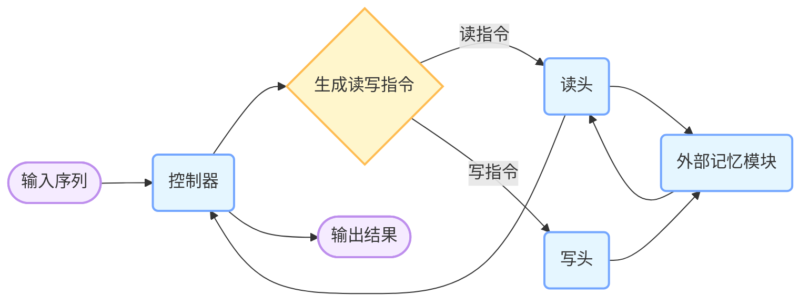

# AI中的记忆增强网络:长期依赖性建模

> 关键词：AI、记忆增强网络、长期依赖性建模、深度学习、神经网络

> 摘要：本文深入探讨了AI中记忆增强网络在长期依赖性建模方面的应用。首先介绍了记忆增强网络相关背景知识，包括目的范围、预期读者等。接着阐述核心概念与联系，给出原理和架构的示意图及流程图。详细讲解了核心算法原理和具体操作步骤，结合Python代码说明。还介绍了相关数学模型和公式，并举例说明。通过项目实战展示代码实现和解读。分析了实际应用场景，推荐了学习资源、开发工具框架以及相关论文著作。最后总结未来发展趋势与挑战，提供常见问题解答和扩展阅读参考资料，旨在为读者全面深入地了解记忆增强网络在长期依赖性建模方面的技术提供帮助。

## 1. 背景介绍 
### 1.1 目的和范围
在人工智能领域，许多任务都涉及到对序列数据的处理，如自然语言处理、语音识别、时间序列预测等。这些序列数据往往具有长期依赖性，即当前时刻的输出不仅依赖于近期的输入，还与较早之前的输入信息有关。传统的神经网络在处理长期依赖性问题时存在一定的局限性，例如循环神经网络（RNN）在处理长序列时容易出现梯度消失或梯度爆炸的问题。记忆增强网络（Memory Augmented Neural Networks，MANNs）应运而生，其目的是通过引入外部记忆模块，增强神经网络对长期信息的存储和访问能力，从而更好地建模长期依赖性。

本文的范围将涵盖记忆增强网络的核心概念、算法原理、数学模型、实际应用案例等方面，旨在为读者提供一个全面深入的关于记忆增强网络在长期依赖性建模方面的技术指南。

### 1.2 预期读者
本文预期读者包括人工智能领域的研究人员、开发者、学生等。对于希望深入了解记忆增强网络技术原理和应用的专业人士，本文可以提供详细的技术分析和代码实现；对于正在学习人工智能相关课程的学生，本文可以作为学习参考资料，帮助他们理解记忆增强网络在处理长期依赖性问题上的优势和方法。

### 1.3 文档结构概述
本文将按照以下结构进行组织：首先介绍记忆增强网络的核心概念与联系，包括其原理和架构的文本示意图和Mermaid流程图；接着详细讲解核心算法原理和具体操作步骤，并使用Python源代码进行阐述；然后介绍相关的数学模型和公式，并举例说明；通过项目实战展示代码的实际案例和详细解释；分析记忆增强网络的实际应用场景；推荐相关的学习资源、开发工具框架和论文著作；最后总结未来发展趋势与挑战，提供常见问题解答和扩展阅读参考资料。

### 1.4 术语表
#### 1.4.1 核心术语定义
- **记忆增强网络（Memory Augmented Neural Networks，MANNs）**：一种在传统神经网络基础上引入外部记忆模块的神经网络结构，通过增强对长期信息的存储和访问能力，来更好地处理序列数据中的长期依赖性问题。
- **长期依赖性**：指在序列数据处理中，当前时刻的输出不仅依赖于近期的输入，还与较早之前的输入信息存在关联的特性。
- **外部记忆模块**：记忆增强网络中用于存储长期信息的模块，通常具有较大的存储容量和灵活的读写操作机制。

#### 1.4.2 相关概念解释
- **循环神经网络（RNN）**：一种用于处理序列数据的神经网络，通过在网络中引入循环结构，使得网络能够保留之前时刻的信息。但在处理长序列时，RNN容易出现梯度消失或梯度爆炸的问题，导致难以捕捉长期依赖性。
- **注意力机制**：一种在神经网络中用于自动选择重要信息的机制，通过计算输入序列中每个元素的重要性权重，使得网络能够更加关注与当前任务相关的信息。

#### 1.4.3 缩略词列表
- **MANNs**：Memory Augmented Neural Networks（记忆增强网络）
- **RNN**：Recurrent Neural Network（循环神经网络）
- **LSTM**：Long Short-Term Memory（长短期记忆网络）
- **GRU**：Gated Recurrent Unit（门控循环单元）

## 2. 核心概念与联系 
### 核心概念原理
记忆增强网络的核心思想是在传统神经网络的基础上引入一个外部记忆模块，该模块可以存储和管理长期信息。网络通过读写操作与记忆模块进行交互，从而实现对长期信息的有效利用。

传统的神经网络（如RNN）在处理序列数据时，只能通过隐藏状态来传递信息，隐藏状态的容量有限，难以存储和保留长距离的信息。而记忆增强网络的外部记忆模块具有更大的存储容量，可以将重要的信息长期保存。在每个时间步，网络根据当前输入和之前的隐藏状态生成读写操作指令，对记忆模块进行读写操作。读操作从记忆模块中提取相关信息，用于当前时刻的输出计算；写操作则将新的信息写入记忆模块，更新记忆内容。

### 架构的文本示意图
记忆增强网络的基本架构主要由三部分组成：控制器、外部记忆模块和读写操作接口。

- **控制器**：通常是一个神经网络（如多层感知机、LSTM等），负责接收输入序列，并根据输入和之前的隐藏状态生成读写操作指令。控制器还会利用从记忆模块中读取的信息进行当前时刻的输出计算。
- **外部记忆模块**：是一个二维矩阵，每一行表示一个记忆单元，每个记忆单元可以存储一定数量的信息。记忆模块的大小可以根据具体任务进行调整。
- **读写操作接口**：包括读头和写头，负责执行控制器生成的读写操作指令。读头从记忆模块中读取信息，写头将新的信息写入记忆模块。

### Mermaid流程图


该流程图展示了记忆增强网络的基本工作流程：输入序列首先进入控制器，控制器根据输入生成读写指令，读头和写头根据指令对外部记忆模块进行读写操作，读头将从记忆模块中读取的信息反馈给控制器，控制器最终生成输出结果。

## 3. 核心算法原理 & 具体操作步骤 
### 核心算法原理
记忆增强网络的核心算法主要包括读写操作的实现和控制器的设计。

#### 读操作
读操作的目的是从外部记忆模块中提取与当前任务相关的信息。通常采用注意力机制来计算每个记忆单元的重要性权重，然后根据权重对记忆单元进行加权求和，得到读取的信息。

假设外部记忆模块为 $M \in \mathbb{R}^{N \times D}$，其中 $N$ 是记忆单元的数量，$D$ 是每个记忆单元的维度。读头生成一个查询向量 $q \in \mathbb{R}^{D}$，用于计算每个记忆单元的重要性权重。权重的计算可以使用余弦相似度：

$$
w_i = \frac{\exp(\text{cosine}(q, M_i))}{\sum_{j=1}^{N} \exp(\text{cosine}(q, M_j))}
$$

其中，$\text{cosine}(q, M_i)$ 表示查询向量 $q$ 与第 $i$ 个记忆单元 $M_i$ 的余弦相似度，$w_i$ 是第 $i$ 个记忆单元的权重。

读取的信息 $r$ 可以通过对记忆单元进行加权求和得到：

$$
r = \sum_{i=1}^{N} w_i M_i
$$

#### 写操作
写操作的目的是将新的信息写入外部记忆模块。写操作通常包括擦除和写入两个步骤。

擦除操作通过一个擦除向量 $e \in \mathbb{R}^{D}$ 来实现，用于将记忆模块中某些位置的信息擦除：

$$
M_i' = M_i \odot (1 - w_i e)
$$

其中，$M_i'$ 是擦除后的第 $i$ 个记忆单元，$\odot$ 表示逐元素相乘。

写入操作通过一个写入向量 $a \in \mathbb{R}^{D}$ 来实现，用于将新的信息写入记忆模块：

$$
M_i'' = M_i' + w_i a
$$

其中，$M_i''$ 是写入后的第 $i$ 个记忆单元。

#### 控制器设计
控制器通常采用神经网络来实现，如多层感知机（MLP）或长短期记忆网络（LSTM）。控制器接收输入序列和从记忆模块中读取的信息，生成读写操作指令（查询向量 $q$、擦除向量 $e$ 和写入向量 $a$）以及当前时刻的输出。

### 具体操作步骤
以下是记忆增强网络的具体操作步骤：

1. **初始化**：初始化外部记忆模块 $M$、控制器的参数和隐藏状态。
2. **输入处理**：在每个时间步，将当前输入 $x_t$ 输入到控制器中。
3. **生成读写指令**：控制器根据当前输入 $x_t$ 和之前的隐藏状态，生成查询向量 $q_t$、擦除向量 $e_t$ 和写入向量 $a_t$。
4. **读操作**：根据查询向量 $q_t$ 计算每个记忆单元的权重 $w_{t,i}$，并通过加权求和得到读取的信息 $r_t$。
5. **更新控制器状态**：控制器将读取的信息 $r_t$ 与当前输入 $x_t$ 结合，更新隐藏状态。
6. **写操作**：根据擦除向量 $e_t$ 和写入向量 $a_t$ 对记忆模块进行擦除和写入操作，更新记忆模块 $M$。
7. **输出计算**：控制器根据更新后的隐藏状态生成当前时刻的输出 $y_t$。
8. **重复步骤2 - 7**：直到处理完整个输入序列。

### Python源代码实现
```python
import torch
import torch.nn as nn
import torch.nn.functional as F

class MemoryAugmentedNetwork(nn.Module):
    def __init__(self, input_size, hidden_size, memory_size, memory_dim):
        super(MemoryAugmentedNetwork, self).__init__()
        self.input_size = input_size
        self.hidden_size = hidden_size
        self.memory_size = memory_size
        self.memory_dim = memory_dim
        
        # 控制器（这里使用LSTM）
        self.controller = nn.LSTM(input_size + memory_dim, hidden_size)
        
        # 读写头
        self.read_head = nn.Linear(hidden_size, memory_dim)
        self.erase_head = nn.Linear(hidden_size, memory_dim)
        self.write_head = nn.Linear(hidden_size, memory_dim)
        
        # 初始化记忆模块
        self.memory = torch.randn(memory_size, memory_dim)
        
    def read(self, query):
        # 计算相似度
        similarities = F.cosine_similarity(query.unsqueeze(1), self.memory, dim=2)
        # 计算权重
        weights = F.softmax(similarities, dim=1)
        # 加权求和得到读取的信息
        read_info = torch.sum(weights.unsqueeze(2) * self.memory, dim=1)
        return read_info
    
    def write(self, erase, add):
        # 擦除操作
        erase_weights = torch.sigmoid(erase).unsqueeze(1)
        self.memory = self.memory * (1 - erase_weights)
        # 写入操作
        add_weights = torch.sigmoid(add).unsqueeze(1)
        self.memory = self.memory + add_weights
    
    def forward(self, inputs):
        batch_size, seq_len, _ = inputs.size()
        hidden = (torch.zeros(1, batch_size, self.hidden_size),
                  torch.zeros(1, batch_size, self.hidden_size))
        outputs = []
        
        for t in range(seq_len):
            # 获取当前输入
            input_t = inputs[:, t, :]
            # 读操作
            query = self.read_head(hidden[0].squeeze(0))
            read_info = self.read(query)
            # 合并输入和读取的信息
            combined_input = torch.cat([input_t, read_info], dim=1).unsqueeze(0)
            # 更新控制器状态
            output, hidden = self.controller(combined_input, hidden)
            # 生成擦除和写入向量
            erase = self.erase_head(output.squeeze(0))
            add = self.write_head(output.squeeze(0))
            # 写操作
            self.write(erase, add)
            # 输出
            outputs.append(output.squeeze(0))
        
        outputs = torch.stack(outputs, dim=1)
        return outputs

# 示例使用
input_size = 10
hidden_size = 20
memory_size = 30
memory_dim = 15
batch_size = 5
seq_len = 8

model = MemoryAugmentedNetwork(input_size, hidden_size, memory_size, memory_dim)
inputs = torch.randn(batch_size, seq_len, input_size)
outputs = model(inputs)
print(outputs.shape)
```

## 4. 数学模型和公式 & 详细讲解 & 举例说明 
### 读操作数学模型和公式
读操作的核心是计算每个记忆单元的重要性权重，并根据权重对记忆单元进行加权求和。

#### 余弦相似度计算
余弦相似度用于衡量查询向量 $q$ 与记忆单元 $M_i$ 之间的相似程度，计算公式为：

$$
\text{cosine}(q, M_i) = \frac{q \cdot M_i}{\|q\| \|M_i\|}
$$

其中，$\cdot$ 表示向量的点积，$\|q\|$ 和 $\|M_i\|$ 分别表示查询向量 $q$ 和记忆单元 $M_i$ 的模。

#### 权重计算
通过对余弦相似度进行 softmax 操作，得到每个记忆单元的权重 $w_i$：

$$
w_i = \frac{\exp(\text{cosine}(q, M_i))}{\sum_{j=1}^{N} \exp(\text{cosine}(q, M_j))}
$$

softmax 函数将相似度转换为概率分布，使得所有权重之和为 1。

#### 读取信息计算
读取的信息 $r$ 是所有记忆单元的加权和：

$$
r = \sum_{i=1}^{N} w_i M_i
$$

### 写操作数学模型和公式
写操作包括擦除和写入两个步骤。

#### 擦除操作
擦除操作通过擦除向量 $e$ 来实现，计算公式为：

$$
M_i' = M_i \odot (1 - w_i e)
$$

其中，$\odot$ 表示逐元素相乘，$M_i'$ 是擦除后的第 $i$ 个记忆单元。

#### 写入操作
写入操作通过写入向量 $a$ 来实现，计算公式为：

$$
M_i'' = M_i' + w_i a
$$

其中，$M_i''$ 是写入后的第 $i$ 个记忆单元。

### 详细讲解
读操作的目的是从记忆模块中提取与当前查询相关的信息。通过余弦相似度计算每个记忆单元与查询向量的相似程度，然后使用 softmax 函数将相似度转换为权重，最后根据权重对记忆单元进行加权求和，得到读取的信息。

写操作的目的是更新记忆模块中的信息。擦除操作通过逐元素相乘的方式将记忆单元中某些位置的信息置零，写入操作则将新的信息添加到记忆单元中。

### 举例说明
假设外部记忆模块 $M$ 是一个 $3 \times 2$ 的矩阵：

$$
M = \begin{bmatrix}
1 & 2 \\
3 & 4 \\
5 & 6
\end{bmatrix}
$$

查询向量 $q = \begin{bmatrix} 2 & 3 \end{bmatrix}$，擦除向量 $e = \begin{bmatrix} 0.5 & 0.5 \end{bmatrix}$，写入向量 $a = \begin{bmatrix} 1 & 1 \end{bmatrix}$。

#### 读操作
首先计算余弦相似度：

$$
\text{cosine}(q, M_1) = \frac{2 \times 1 + 3 \times 2}{\sqrt{2^2 + 3^2} \sqrt{1^2 + 2^2}} \approx 0.91
$$

$$
\text{cosine}(q, M_2) = \frac{2 \times 3 + 3 \times 4}{\sqrt{2^2 + 3^2} \sqrt{3^2 + 4^2}} \approx 0.98
$$

$$
\text{cosine}(q, M_3) = \frac{2 \times 5 + 3 \times 6}{\sqrt{2^2 + 3^2} \sqrt{5^2 + 6^2}} \approx 0.99
$$

然后计算权重：

$$
w_1 = \frac{\exp(0.91)}{\exp(0.91) + \exp(0.98) + \exp(0.99)} \approx 0.29
$$

$$
w_2 = \frac{\exp(0.98)}{\exp(0.91) + \exp(0.98) + \exp(0.99)} \approx 0.34
$$

$$
w_3 = \frac{\exp(0.99)}{\exp(0.91) + \exp(0.98) + \exp(0.99)} \approx 0.37
$$

最后计算读取的信息：

$$
r = 0.29 \begin{bmatrix} 1 & 2 \end{bmatrix} + 0.34 \begin{bmatrix} 3 & 4 \end{bmatrix} + 0.37 \begin{bmatrix} 5 & 6 \end{bmatrix} = \begin{bmatrix} 3.36 & 4.46 \end{bmatrix}
$$

#### 写操作
假设读操作得到的权重 $w_1 = 0.29$，$w_2 = 0.34$，$w_3 = 0.37$。

擦除操作：

$$
M_1' = \begin{bmatrix} 1 & 2 \end{bmatrix} \odot (1 - 0.29 \begin{bmatrix} 0.5 & 0.5 \end{bmatrix}) = \begin{bmatrix} 0.86 & 1.71 \end{bmatrix}
$$

$$
M_2' = \begin{bmatrix} 3 & 4 \end{bmatrix} \odot (1 - 0.34 \begin{bmatrix} 0.5 & 0.5 \end{bmatrix}) = \begin{bmatrix} 2.49 & 3.32 \end{bmatrix}
$$

$$
M_3' = \begin{bmatrix} 5 & 6 \end{bmatrix} \odot (1 - 0.37 \begin{bmatrix} 0.5 & 0.5 \end{bmatrix}) = \begin{bmatrix} 4.07 & 5.06 \end{bmatrix}
$$

写入操作：

$$
M_1'' = \begin{bmatrix} 0.86 & 1.71 \end{bmatrix} + 0.29 \begin{bmatrix} 1 & 1 \end{bmatrix} = \begin{bmatrix} 1.15 & 2.0 \end{bmatrix}
$$

$$
M_2'' = \begin{bmatrix} 2.49 & 3.32 \end{bmatrix} + 0.34 \begin{bmatrix} 1 & 1 \end{bmatrix} = \begin{bmatrix} 2.83 & 3.66 \end{bmatrix}
$$

$$
M_3'' = \begin{bmatrix} 4.07 & 5.06 \end{bmatrix} + 0.37 \begin{bmatrix} 1 & 1 \end{bmatrix} = \begin{bmatrix} 4.44 & 5.43 \end{bmatrix}
$$

## 5. 项目实战：代码实际案例和详细解释说明 
### 5.1  开发环境搭建
为了实现记忆增强网络的项目实战，我们需要搭建相应的开发环境。以下是具体步骤：

#### 安装Python
首先确保你已经安装了Python，建议使用Python 3.6及以上版本。可以从Python官方网站（https://www.python.org/downloads/）下载并安装。

#### 安装深度学习框架
我们使用PyTorch作为深度学习框架，因为它具有动态图机制，易于使用和调试。可以根据自己的CUDA版本和操作系统，从PyTorch官方网站（https://pytorch.org/get-started/locally/）选择合适的安装命令进行安装。例如，如果你使用的是CPU版本的PyTorch，可以使用以下命令安装：

```sh
pip install torch torchvision
```

#### 安装其他依赖库
还需要安装一些其他的依赖库，如NumPy、Matplotlib等。可以使用以下命令进行安装：

```sh
pip install numpy matplotlib
```

### 5.2  源代码详细实现和代码解读
以下是一个完整的记忆增强网络的项目实战代码，用于处理序列预测任务：

```python
import torch
import torch.nn as nn
import torch.optim as optim
import numpy as np
import matplotlib.pyplot as plt

# 定义记忆增强网络模型
class MemoryAugmentedNetwork(nn.Module):
    def __init__(self, input_size, hidden_size, memory_size, memory_dim):
        super(MemoryAugmentedNetwork, self).__init__()
        self.input_size = input_size
        self.hidden_size = hidden_size
        self.memory_size = memory_size
        self.memory_dim = memory_dim
        
        # 控制器（这里使用LSTM）
        self.controller = nn.LSTM(input_size + memory_dim, hidden_size)
        
        # 读写头
        self.read_head = nn.Linear(hidden_size, memory_dim)
        self.erase_head = nn.Linear(hidden_size, memory_dim)
        self.write_head = nn.Linear(hidden_size, memory_dim)
        
        # 输出层
        self.output_layer = nn.Linear(hidden_size, 1)
        
        # 初始化记忆模块
        self.memory = torch.randn(memory_size, memory_dim)
    
    def read(self, query):
        # 计算相似度
        similarities = nn.functional.cosine_similarity(query.unsqueeze(1), self.memory, dim=2)
        # 计算权重
        weights = nn.functional.softmax(similarities, dim=1)
        # 加权求和得到读取的信息
        read_info = torch.sum(weights.unsqueeze(2) * self.memory, dim=1)
        return read_info
    
    def write(self, erase, add):
        # 擦除操作
        erase_weights = torch.sigmoid(erase).unsqueeze(1)
        self.memory = self.memory * (1 - erase_weights)
        # 写入操作
        add_weights = torch.sigmoid(add).unsqueeze(1)
        self.memory = self.memory + add_weights
    
    def forward(self, inputs):
        batch_size, seq_len, _ = inputs.size()
        hidden = (torch.zeros(1, batch_size, self.hidden_size),
                  torch.zeros(1, batch_size, self.hidden_size))
        outputs = []
        
        for t in range(seq_len):
            # 获取当前输入
            input_t = inputs[:, t, :]
            # 读操作
            query = self.read_head(hidden[0].squeeze(0))
            read_info = self.read(query)
            # 合并输入和读取的信息
            combined_input = torch.cat([input_t, read_info], dim=1).unsqueeze(0)
            # 更新控制器状态
            output, hidden = self.controller(combined_input, hidden)
            # 生成擦除和写入向量
            erase = self.erase_head(output.squeeze(0))
            add = self.write_head(output.squeeze(0))
            # 写操作
            self.write(erase, add)
            # 输出计算
            output = self.output_layer(output.squeeze(0))
            outputs.append(output)
        
        outputs = torch.stack(outputs, dim=1)
        return outputs

# 生成数据集
def generate_data(seq_len, num_samples):
    data = []
    targets = []
    for _ in range(num_samples):
        sequence = np.random.randn(seq_len)
        target = np.sum(sequence)
        data.append(sequence)
        targets.append(target)
    data = np.array(data)
    targets = np.array(targets)
    data = torch.from_numpy(data).float().unsqueeze(2)
    targets = torch.from_numpy(targets).float().unsqueeze(1)
    return data, targets

# 训练模型
def train_model(model, data, targets, num_epochs, learning_rate):
    criterion = nn.MSELoss()
    optimizer = optim.Adam(model.parameters(), lr=learning_rate)
    
    losses = []
    for epoch in range(num_epochs):
        optimizer.zero_grad()
        outputs = model(data)
        loss = criterion(outputs[:, -1, :], targets)
        loss.backward()
        optimizer.step()
        losses.append(loss.item())
        if (epoch + 1) % 100 == 0:
            print(f'Epoch {epoch + 1}/{num_epochs}, Loss: {loss.item()}')
    
    return losses

# 主函数
if __name__ == '__main__':
    # 超参数设置
    input_size = 1
    hidden_size = 20
    memory_size = 30
    memory_dim = 15
    seq_len = 10
    num_samples = 1000
    num_epochs = 1000
    learning_rate = 0.001
    
    # 生成数据集
    data, targets = generate_data(seq_len, num_samples)
    
    # 初始化模型
    model = MemoryAugmentedNetwork(input_size, hidden_size, memory_size, memory_dim)
    
    # 训练模型
    losses = train_model(model, data, targets, num_epochs, learning_rate)
    
    # 绘制损失曲线
    plt.plot(losses)
    plt.xlabel('Epoch')
    plt.ylabel('Loss')
    plt.title('Training Loss')
    plt.show()
```

### 5.3  代码解读与分析
#### 模型定义
`MemoryAugmentedNetwork` 类定义了记忆增强网络的模型结构。在 `__init__` 方法中，初始化了控制器、读写头、输出层和记忆模块。`read` 方法实现了读操作，通过计算相似度和权重，从记忆模块中读取信息；`write` 方法实现了写操作，包括擦除和写入两个步骤；`forward` 方法定义了模型的前向传播过程，在每个时间步进行读写操作，并更新控制器状态和记忆模块。

#### 数据集生成
`generate_data` 函数用于生成数据集，生成随机序列并计算序列的和作为目标值。

#### 训练模型
`train_model` 函数用于训练模型，使用均方误差损失函数（MSE）和Adam优化器进行训练。在每个epoch中，前向传播计算输出，计算损失，反向传播更新参数。

#### 主函数
在主函数中，设置了超参数，生成数据集，初始化模型，调用 `train_model` 函数进行训练，并绘制损失曲线。

通过这个项目实战，我们可以看到记忆增强网络在处理序列预测任务中的应用，并且可以观察到模型的训练过程和损失变化情况。

## 6. 实际应用场景 
### 自然语言处理
在自然语言处理任务中，如机器翻译、文本生成、问答系统等，需要处理长文本序列，其中包含大量的长期依赖性信息。记忆增强网络可以通过外部记忆模块存储和管理这些长期信息，从而更好地捕捉文本中的语义和上下文信息。例如，在机器翻译中，记忆增强网络可以记住之前翻译过的词汇和句子结构，提高翻译的准确性和一致性。

### 语音识别
语音识别任务需要处理连续的语音信号，语音信号中的语义信息往往与较长时间范围内的音频特征相关。记忆增强网络可以利用外部记忆模块存储和更新语音特征信息，从而更好地识别语音中的内容。例如，在语音指令识别中，记忆增强网络可以记住之前的语音指令，提高对复杂指令的识别能力。

### 时间序列预测
时间序列预测任务，如股票价格预测、气象预报等，需要根据历史数据预测未来的值。时间序列数据通常具有长期的趋势和周期性，记忆增强网络可以通过外部记忆模块存储历史数据的特征，从而更好地捕捉时间序列中的长期依赖性，提高预测的准确性。

### 机器人控制
在机器人控制任务中，机器人需要根据历史的环境信息和自身状态信息做出决策。记忆增强网络可以帮助机器人存储和管理这些长期信息，从而更好地适应复杂的环境和任务需求。例如，在自主导航任务中，机器人可以利用记忆增强网络记住之前走过的路径和环境特征，提高导航的效率和准确性。

## 7. 工具和资源推荐
### 7.1 学习资源推荐
#### 7.1.1 书籍推荐
- 《深度学习》（Deep Learning）：由Ian Goodfellow、Yoshua Bengio和Aaron Courville所著，是深度学习领域的经典教材，涵盖了深度学习的基本概念、算法和应用。
- 《神经网络与深度学习》（Neural Networks and Deep Learning）：由Michael Nielsen所著，是一本免费的在线书籍，以通俗易懂的方式介绍了神经网络和深度学习的原理和实践。
- 《动手学深度学习》（Dive into Deep Learning）：由李沐等人所著，提供了丰富的代码示例和实践项目，适合初学者快速上手深度学习。

#### 7.1.2 在线课程
- Coursera上的“深度学习专项课程”（Deep Learning Specialization）：由Andrew Ng教授授课，包括五门课程，系统地介绍了深度学习的各个方面。
- edX上的“强化学习基础”（Foundations of Reinforcement Learning）：介绍了强化学习的基本概念和算法，对于理解记忆增强网络在强化学习中的应用有帮助。
- 哔哩哔哩上的“李宏毅机器学习课程”：以生动有趣的方式讲解机器学习和深度学习的知识，适合初学者学习。

#### 7.1.3 技术博客和网站
- Medium：是一个技术博客平台，上面有很多关于人工智能和深度学习的优质文章。
- arXiv：是一个预印本平台，提供了大量的最新研究论文，包括记忆增强网络相关的研究成果。
- Kaggle：是一个数据科学竞赛平台，上面有很多关于深度学习的开源代码和项目，可以学习和参考。

### 7.2 开发工具框架推荐
#### 7.2.1 IDE和编辑器
- PyCharm：是一款专门为Python开发设计的集成开发环境，具有强大的代码编辑、调试和分析功能。
- Jupyter Notebook：是一个交互式的开发环境，适合进行数据分析和模型实验，可以实时显示代码运行结果和可视化图表。
- Visual Studio Code：是一款轻量级的代码编辑器，支持多种编程语言和插件扩展，具有良好的代码编辑体验。

#### 7.2.2 调试和性能分析工具
- PyTorch Profiler：是PyTorch提供的性能分析工具，可以帮助开发者分析模型的运行时间、内存使用等情况，优化模型性能。
- TensorBoard：是TensorFlow提供的可视化工具，也可以与PyTorch结合使用，用于可视化模型的训练过程和性能指标。
- PDB：是Python自带的调试工具，可以帮助开发者在代码中设置断点，逐步调试程序。

#### 7.2.3 相关框架和库
- PyTorch：是一个开源的深度学习框架，具有动态图机制，易于使用和调试，广泛应用于记忆增强网络的研究和开发。
- TensorFlow：是另一个流行的深度学习框架，具有强大的分布式训练和部署能力。
- NumPy：是Python的科学计算库，提供了高效的数组操作和数学函数，是深度学习开发的基础库之一。

### 7.3 相关论文著作推荐
#### 7.3.1 经典论文
- "Neural Turing Machines"：提出了神经图灵机（Neural Turing Machines，NTM），是记忆增强网络的经典论文之一，介绍了如何通过外部记忆模块和读写操作实现神经网络的可编程性。
- "Memory Networks"：提出了记忆网络（Memory Networks），通过引入外部记忆模块和注意力机制，提高了神经网络对长期信息的处理能力。

#### 7.3.2 最新研究成果
- 在arXiv上搜索“Memory Augmented Neural Networks”可以找到最新的研究论文，了解记忆增强网络的最新发展趋势和技术创新。

#### 7.3.3 应用案例分析
- 可以在Kaggle、GitHub等平台上找到记忆增强网络在不同应用场景下的开源项目和代码实现，通过分析这些应用案例，学习如何将记忆增强网络应用到实际问题中。

## 8. 总结：未来发展趋势与挑战
### 未来发展趋势
#### 与其他技术的融合
记忆增强网络可能会与其他人工智能技术，如强化学习、生成对抗网络等进行更深入的融合。例如，在强化学习中，记忆增强网络可以帮助智能体更好地记住历史经验，提高学习效率和决策能力；在生成对抗网络中，记忆增强网络可以用于生成更具连贯性和逻辑性的图像或文本。

#### 模型结构的创新
未来可能会出现更多创新的记忆增强网络模型结构，以进一步提高模型的性能和表达能力。例如，改进外部记忆模块的设计，引入更复杂的读写操作机制，或者结合其他类型的神经网络结构。

#### 应用领域的拓展
记忆增强网络的应用领域可能会不断拓展，除了现有的自然语言处理、语音识别、时间序列预测等领域，还可能应用到医疗保健、金融、交通等更多领域，为解决实际问题提供更有效的方法。

### 挑战
#### 计算资源需求
记忆增强网络通常需要较大的计算资源来训练和运行，特别是在处理大规模数据集和复杂任务时。如何降低计算资源需求，提高模型的训练和推理效率，是一个需要解决的挑战。

#### 可解释性问题
记忆增强网络的模型结构相对复杂，其决策过程和内部机制难以解释。在一些对可解释性要求较高的应用场景中，如医疗诊断、金融风险评估等，如何提高模型的可解释性是一个重要的挑战。

#### 数据隐私和安全
在使用记忆增强网络处理敏感数据时，如个人隐私信息、商业机密等，需要确保数据的隐私和安全。如何设计安全可靠的记忆增强网络模型，防止数据泄露和恶意攻击，是一个需要关注的问题。

## 9. 附录：常见问题与解答
### 1. 记忆增强网络与传统神经网络有什么区别？
传统神经网络（如RNN、CNN等）主要通过隐藏状态或卷积核来处理和传递信息，其信息存储和处理能力有限，难以处理长序列数据中的长期依赖性问题。而记忆增强网络引入了外部记忆模块，通过读写操作与记忆模块进行交互，能够更好地存储和管理长期信息，从而提高对长期依赖性的建模能力。

### 2. 记忆增强网络的训练难度大吗？
记忆增强网络的训练难度相对较大，主要原因在于其模型结构复杂，包含外部记忆模块和读写操作，需要更多的计算资源和训练时间。此外，记忆增强网络的训练过程中可能会出现梯度消失或梯度爆炸等问题，需要采用合适的优化算法和正则化方法来解决。

### 3. 如何选择记忆模块的大小和维度？
记忆模块的大小和维度需要根据具体的任务和数据集进行选择。一般来说，记忆模块的大小越大，能够存储的信息就越多，但同时也会增加计算资源的需求和训练的难度。记忆模块的维度需要根据输入数据的特征和模型的复杂度进行调整，通常可以通过实验来确定最佳的大小和维度。

### 4. 记忆增强网络在实际应用中有哪些局限性？
记忆增强网络在实际应用中的局限性主要包括计算资源需求大、可解释性差、数据隐私和安全问题等。此外，记忆增强网络的训练过程相对复杂，需要大量的标注数据和调参经验，对于一些数据量较小或对实时性要求较高的应用场景，可能不太适用。

## 10. 扩展阅读 & 参考资料
### 扩展阅读
- "Attention Is All You Need"：介绍了Transformer模型，其中的注意力机制与记忆增强网络中的读写操作有一定的相似性，可以进一步了解注意力机制在序列数据处理中的应用。
- "Hierarchical Memory Networks for Sequential Data"：提出了层次化记忆网络，用于处理更复杂的序列数据，为记忆增强网络的发展提供了新的思路。

### 参考资料
- Goodfellow, I., Bengio, Y., & Courville, A. (2016). Deep Learning. MIT Press.
- Nielsen, M. A. (2015). Neural Networks and Deep Learning. Determination Press.
- Li, M., Zhang, A., & Li, Z. (2020). Dive into Deep Learning. Aston Zhang, Zachary C. Lipton, Mu Li, and Alexander J. Smola.

作者：AI天才研究院/AI Genius Institute & 禅与计算机程序设计艺术 /Zen And The Art of Computer Programming