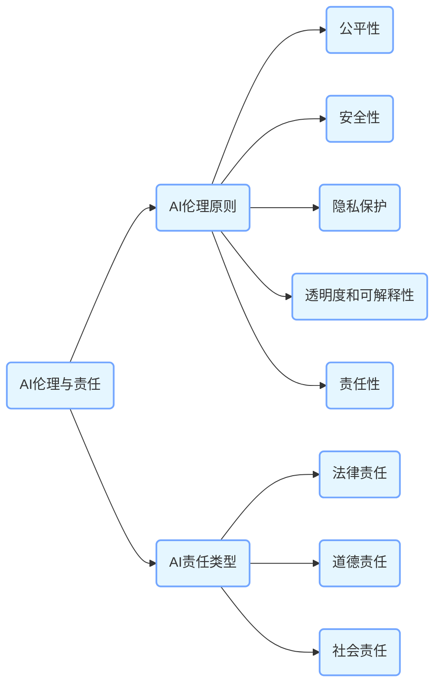

# AI伦理与责任

> 关键词：AI伦理、AI责任、算法偏见、数据隐私、透明度、可解释性、社会责任

> 摘要：本文围绕AI伦理与责任展开深入探讨。首先介绍了AI伦理与责任的研究背景、目的、预期读者等基本信息。接着阐述了AI伦理与责任相关的核心概念及联系，分析了核心算法原理和操作步骤。从数学模型和公式层面深入剖析AI中的伦理与责任问题，并结合实际案例进行说明。通过项目实战展示代码实现和分析，探讨了AI伦理与责任在不同场景下的实际应用。同时推荐了学习资源、开发工具框架以及相关论文著作。最后总结了AI伦理与责任的未来发展趋势与挑战，提供常见问题解答和扩展阅读参考资料，旨在帮助读者全面了解AI伦理与责任的重要性及应对方法。

## 1. 背景介绍 
### 1.1 目的和范围
随着人工智能（AI）技术的飞速发展，其在医疗、金融、交通、娱乐等各个领域得到了广泛应用。然而，AI技术的应用也带来了一系列伦理和责任问题，如算法偏见、数据隐私泄露、自主决策的责任归属等。本文的目的在于深入探讨AI伦理与责任的相关问题，分析其产生的原因、影响，并提出相应的解决措施。范围涵盖AI伦理与责任的基本概念、核心算法原理、数学模型、实际应用场景以及未来发展趋势等方面。

### 1.2 预期读者
本文预期读者包括AI领域的研究人员、开发者、政策制定者、企业管理人员以及对AI伦理与责任问题感兴趣的普通读者。对于研究人员和开发者，本文可提供理论和实践方面的参考，帮助他们在开发和应用AI技术时更好地考虑伦理和责任因素；对于政策制定者，本文可为制定相关政策和法规提供依据；对于企业管理人员，本文有助于他们在企业运营中管理和应对AI伦理与责任问题；对于普通读者，本文可帮助他们了解AI伦理与责任的基本知识，增强对AI技术的认知和理解。

### 1.3 文档结构概述
本文共分为十个部分。第一部分为背景介绍，阐述了文章的目的、范围、预期读者和文档结构概述，并给出了相关术语的定义和解释。第二部分介绍AI伦理与责任的核心概念与联系，包括伦理原则、责任类型等，并通过文本示意图和Mermaid流程图进行说明。第三部分详细讲解核心算法原理和具体操作步骤，结合Python源代码进行阐述。第四部分分析数学模型和公式，对相关概念进行详细讲解，并举例说明。第五部分进行项目实战，包括开发环境搭建、源代码实现和代码解读。第六部分探讨AI伦理与责任的实际应用场景。第七部分推荐学习资源、开发工具框架和相关论文著作。第八部分总结未来发展趋势与挑战。第九部分为附录，解答常见问题。第十部分提供扩展阅读和参考资料。

### 1.4 术语表
#### 1.4.1 核心术语定义
- **AI伦理**：指在人工智能技术的开发、部署和使用过程中，遵循的道德原则和规范，以确保AI技术的发展和应用符合人类的利益和价值观。
- **AI责任**：指在人工智能系统的设计、开发、运营和使用过程中，相关主体（如开发者、使用者、企业等）对AI系统的行为和后果所应承担的法律、道德和社会责任。
- **算法偏见**：指算法在处理数据和做出决策时，由于数据偏差、算法设计缺陷等原因，导致对某些群体产生不公平的结果。
- **数据隐私**：指个人或组织对其数据的控制和保护权利，包括数据的收集、存储、使用、共享和删除等方面的隐私保护。
- **透明度**：指AI系统的设计、开发、运行和决策过程能够被外部人员理解和监督的程度。
- **可解释性**：指AI系统能够以人类可理解的方式解释其决策和行为的原因和依据。

#### 1.4.2 相关概念解释
- **道德原则**：是指指导人类行为的基本道德准则，如公平、正义、尊重、责任等。在AI伦理中，道德原则是制定伦理规范和解决伦理问题的基础。
- **责任归属**：是指在AI系统的行为和后果中，确定哪些主体应该承担责任以及承担何种责任的过程。责任归属问题是AI责任的核心问题之一。
- **伦理审查**：是指对AI项目的伦理合规性进行评估和审查的过程，旨在确保AI项目的开发和应用符合伦理原则和规范。
- **社会影响评估**：是指对AI技术的应用可能产生的社会、经济、文化等方面的影响进行评估和分析的过程，以帮助决策者更好地了解AI技术的利弊，做出合理的决策。

#### 1.4.3 缩略词列表
- **AI**：Artificial Intelligence，人工智能
- **ML**：Machine Learning，机器学习
- **DL**：Deep Learning，深度学习
- **GDPR**：General Data Protection Regulation，通用数据保护条例
- **AIES**：Artificial Intelligence, Ethics and Society，人工智能、伦理与社会

## 2. 核心概念与联系 

### 核心概念原理
#### AI伦理原则
AI伦理原则是指导AI技术发展和应用的基本准则，常见的AI伦理原则包括：
- **公平性**：确保AI系统在处理数据和做出决策时，不会对任何群体产生不公平的影响。例如，在招聘过程中，AI招聘系统不应因性别、种族等因素对求职者产生歧视。
- **安全性**：保证AI系统的运行安全可靠，避免对人类生命、财产和环境造成危害。例如，自动驾驶汽车的AI系统必须具备高度的安全性，以防止发生交通事故。
- **隐私保护**：尊重和保护个人数据隐私，确保数据的收集、存储和使用符合相关法律法规和伦理规范。例如，AI医疗系统在处理患者数据时，必须严格遵守隐私保护规定。
- **透明度和可解释性**：使AI系统的决策过程和算法逻辑能够被人类理解和监督，以便对其进行评估和改进。例如，金融领域的AI风险评估系统应该能够解释其评估结果的依据。
- **责任性**：明确AI系统开发、部署和使用过程中各主体的责任，确保对AI系统的行为和后果负责。例如，如果AI系统导致了错误的决策，应该能够确定责任归属并进行相应的处理。

#### AI责任类型
AI责任主要包括以下几种类型：
- **法律责任**：指AI系统的开发、运营和使用过程中，违反法律法规所应承担的责任。例如，AI系统侵犯了他人的知识产权、隐私权等，开发者或使用者可能需要承担法律赔偿责任。
- **道德责任**：指AI系统的相关主体在道德层面上对其行为和后果所应承担的责任。即使某些行为没有违反法律法规，但如果不符合道德原则，相关主体也应该承担道德责任。例如，AI系统的开发者如果知道其系统存在潜在的偏见，但没有采取措施加以纠正，就可能承担道德责任。
- **社会责任**：指AI系统的发展和应用对社会整体产生的影响，相关主体应该对促进社会福祉、减少社会危害等方面承担责任。例如，AI技术的应用可能会导致某些职业的失业，开发者和企业应该采取措施帮助受影响的人群进行职业转型。

### 架构的文本示意图
```plaintext
AI伦理与责任
|-- AI伦理原则
|   |-- 公平性
|   |-- 安全性
|   |-- 隐私保护
|   |-- 透明度和可解释性
|   |-- 责任性
|-- AI责任类型
|   |-- 法律责任
|   |-- 道德责任
|   |-- 社会责任
```

### Mermaid流程图


## 3. 核心算法原理 & 具体操作步骤 

### 算法原理讲解
在AI伦理与责任的算法原理中，我们主要关注如何检测和消除算法偏见。以下是一种基于机器学习的算法偏见检测和纠正的原理：

#### 数据预处理
首先，对输入的数据进行预处理，包括数据清洗、特征选择和数据标准化等操作。数据清洗的目的是去除数据中的噪声和异常值，特征选择是为了选择与目标变量相关的特征，数据标准化是为了将不同特征的取值范围统一。

#### 偏见检测
使用统计方法和机器学习模型对数据进行分析，检测是否存在算法偏见。例如，可以计算不同群体之间的差异指标，如均值差异、方差差异等，来判断是否存在偏见。还可以使用机器学习模型对不同群体的预测结果进行比较，如果模型对某些群体的预测准确率明显低于其他群体，则可能存在偏见。

#### 偏见纠正
如果检测到算法偏见，可以采用以下方法进行纠正：
- **数据重采样**：通过对不同群体的数据进行重采样，使得不同群体的数据量更加平衡，从而减少因数据不平衡导致的偏见。
- **算法调整**：对机器学习算法进行调整，如引入公平性约束条件，使得算法在做出决策时考虑到公平性因素。

### Python源代码详细阐述
```python
import pandas as pd
from sklearn.model_selection import train_test_split
from sklearn.linear_model import LogisticRegression
from sklearn.metrics import accuracy_score
from imblearn.over_sampling import SMOTE

# 加载数据
data = pd.read_csv('data.csv')

# 数据预处理
# 假设数据集中有一个特征 'gender' 表示性别，'label' 表示目标变量
X = data.drop('label', axis=1)
y = data['label']

# 划分训练集和测试集
X_train, X_test, y_train, y_test = train_test_split(X, y, test_size=0.2, random_state=42)

# 检测算法偏见
# 假设我们关注 'gender' 特征的偏见
male_indices = X_train['gender'] == 1
female_indices = X_train['gender'] == 0

male_X_train = X_train[male_indices]
male_y_train = y_train[male_indices]
female_X_train = X_train[female_indices]
female_y_train = y_train[female_indices]

# 训练模型
model = LogisticRegression()
model.fit(X_train, y_train)

# 预测不同群体的结果
male_predictions = model.predict(male_X_train)
female_predictions = model.predict(female_X_train)

# 计算不同群体的准确率
male_accuracy = accuracy_score(male_y_train, male_predictions)
female_accuracy = accuracy_score(female_y_train, female_predictions)

print(f"男性群体的准确率: {male_accuracy}")
print(f"女性群体的准确率: {female_accuracy}")

# 检测是否存在偏见
if abs(male_accuracy - female_accuracy) > 0.1:
    print("存在算法偏见！")

# 偏见纠正
# 使用 SMOTE 进行数据重采样
smote = SMOTE()
X_train_resampled, y_train_resampled = smote.fit_resample(X_train, y_train)

# 重新训练模型
model_resampled = LogisticRegression()
model_resampled.fit(X_train_resampled, y_train_resampled)

# 预测测试集结果
predictions_resampled = model_resampled.predict(X_test)

# 计算重采样后的准确率
accuracy_resampled = accuracy_score(y_test, predictions_resampled)
print(f"重采样后的准确率: {accuracy_resampled}")
```

### 具体操作步骤
1. **数据加载**：使用`pandas`库加载数据集。
2. **数据预处理**：对数据进行清洗、特征选择和划分训练集和测试集。
3. **偏见检测**：根据特定特征将训练集划分为不同群体，训练模型并计算不同群体的预测准确率，通过比较准确率判断是否存在偏见。
4. **偏见纠正**：使用`SMOTE`算法对数据进行重采样，重新训练模型并计算重采样后的准确率。

## 4. 数学模型和公式 & 详细讲解 & 举例说明 

### 算法偏见的数学模型
#### 均值差异
假设我们有两个群体 $A$ 和 $B$，对于某个特征 $x$，群体 $A$ 的样本均值为 $\mu_A$，群体 $B$ 的样本均值为 $\mu_B$，则均值差异可以表示为：
$$\Delta\mu = |\mu_A - \mu_B|$$
如果 $\Delta\mu$ 较大，则说明两个群体在该特征上存在较大差异，可能存在算法偏见。

#### 方差差异
群体 $A$ 的样本方差为 $\sigma_A^2$，群体 $B$ 的样本方差为 $\sigma_B^2$，则方差差异可以表示为：
$$\Delta\sigma^2 = |\sigma_A^2 - \sigma_B^2|$$
方差差异反映了两个群体在特征分布上的离散程度差异，较大的方差差异也可能暗示存在算法偏见。

#### 公平性指标
常见的公平性指标包括平等机会（Equal Opportunity）和均等赔率（Equal Odds）。

##### 平等机会
平等机会要求对于正样本，不同群体的真阳性率（True Positive Rate, TPR）相等。设群体 $A$ 的真阳性率为 $TPR_A$，群体 $B$ 的真阳性率为 $TPR_B$，则平等机会可以表示为：
$$TPR_A = TPR_B$$
其中，$TPR = \frac{TP}{TP + FN}$，$TP$ 表示真阳性样本数，$FN$ 表示假阴性样本数。

##### 均等赔率
均等赔率要求对于正样本和负样本，不同群体的真阳性率和假阳性率（False Positive Rate, FPR）分别相等。即：
$$TPR_A = TPR_B$$
$$FPR_A = FPR_B$$
其中，$FPR = \frac{FP}{FP + TN}$，$FP$ 表示假阳性样本数，$TN$ 表示真阴性样本数。

### 详细讲解
均值差异和方差差异主要从数据的统计特征角度来检测算法偏见。均值差异反映了两个群体在特征取值上的平均差异，方差差异反映了特征取值的离散程度差异。如果两个群体在某些重要特征上存在较大的均值差异或方差差异，可能会导致算法在处理不同群体的数据时产生不公平的结果。

公平性指标则从模型预测结果的角度来衡量算法的公平性。平等机会关注的是正样本的预测准确性，要求不同群体的正样本被正确预测的概率相等。均等赔率则进一步考虑了负样本的预测情况，要求不同群体在正样本和负样本的预测上都具有相同的准确性。

### 举例说明
假设我们有一个贷款审批的AI系统，数据集中包含申请人的性别（男性和女性）和是否批准贷款的标签。我们可以计算男性和女性申请人在某些特征（如收入、信用评分等）上的均值差异和方差差异，来检测是否存在数据偏差。

同时，我们可以使用公平性指标来评估模型的公平性。例如，计算男性和女性申请人的真阳性率和假阳性率，如果男性申请人的真阳性率明显高于女性申请人，而假阳性率明显低于女性申请人，则说明模型可能存在对女性申请人的偏见。

以下是一个简单的Python代码示例，用于计算公平性指标：
```python
from sklearn.metrics import confusion_matrix

# 假设 y_true 是真实标签，y_pred 是预测标签，group 是群体标签（0 表示群体 A，1 表示群体 B）
y_true = [1, 0, 1, 0, 1, 0]
y_pred = [1, 0, 1, 1, 0, 0]
group = [0, 1, 0, 1, 0, 1]

# 划分不同群体的真实标签和预测标签
group_A_y_true = [y_true[i] for i in range(len(y_true)) if group[i] == 0]
group_A_y_pred = [y_pred[i] for i in range(len(y_pred)) if group[i] == 0]
group_B_y_true = [y_true[i] for i in range(len(y_true)) if group[i] == 1]
group_B_y_pred = [y_pred[i] for i in range(len(y_pred)) if group[i] == 1]

# 计算不同群体的混淆矩阵
cm_A = confusion_matrix(group_A_y_true, group_A_y_pred)
cm_B = confusion_matrix(group_B_y_true, group_B_y_pred)

# 计算真阳性率和假阳性率
TPR_A = cm_A[1, 1] / (cm_A[1, 1] + cm_A[1, 0])
FPR_A = cm_A[0, 1] / (cm_A[0, 1] + cm_A[0, 0])
TPR_B = cm_B[1, 1] / (cm_B[1, 1] + cm_B[1, 0])
FPR_B = cm_B[0, 1] / (cm_B[0, 1] + cm_B[0, 0])

print(f"群体 A 的真阳性率: {TPR_A}")
print(f"群体 A 的假阳性率: {FPR_A}")
print(f"群体 B 的真阳性率: {TPR_B}")
print(f"群体 B 的假阳性率: {FPR_B}")

# 检测是否满足平等机会和均等赔率
equal_opportunity = abs(TPR_A - TPR_B) < 0.1
equal_odds = equal_opportunity and abs(FPR_A - FPR_B) < 0.1

print(f"是否满足平等机会: {equal_opportunity}")
print(f"是否满足均等赔率: {equal_odds}")
```

## 5. 项目实战：代码实际案例和详细解释说明 

### 5.1  开发环境搭建
#### 安装Python
首先，确保你已经安装了Python。可以从Python官方网站（https://www.python.org/downloads/）下载适合你操作系统的Python版本，并按照安装向导进行安装。

#### 安装必要的库
在命令行中使用`pip`工具安装所需的库，包括`pandas`、`scikit-learn`、`imblearn`等。
```bash
pip install pandas scikit-learn imblearn
```

### 5.2  源代码详细实现和代码解读
```python
import pandas as pd
from sklearn.model_selection import train_test_split
from sklearn.linear_model import LogisticRegression
from sklearn.metrics import accuracy_score
from imblearn.over_sampling import SMOTE

# 加载数据
data = pd.read_csv('data.csv')

# 数据预处理
# 假设数据集中有一个特征 'gender' 表示性别，'label' 表示目标变量
X = data.drop('label', axis=1)
y = data['label']

# 划分训练集和测试集
X_train, X_test, y_train, y_test = train_test_split(X, y, test_size=0.2, random_state=42)

# 检测算法偏见
# 假设我们关注 'gender' 特征的偏见
male_indices = X_train['gender'] == 1
female_indices = X_train['gender'] == 0

male_X_train = X_train[male_indices]
male_y_train = y_train[male_indices]
female_X_train = X_train[female_indices]
female_y_train = y_train[female_indices]

# 训练模型
model = LogisticRegression()
model.fit(X_train, y_train)

# 预测不同群体的结果
male_predictions = model.predict(male_X_train)
female_predictions = model.predict(female_X_train)

# 计算不同群体的准确率
male_accuracy = accuracy_score(male_y_train, male_predictions)
female_accuracy = accuracy_score(female_y_train, female_predictions)

print(f"男性群体的准确率: {male_accuracy}")
print(f"女性群体的准确率: {female_accuracy}")

# 检测是否存在偏见
if abs(male_accuracy - female_accuracy) > 0.1:
    print("存在算法偏见！")

# 偏见纠正
# 使用 SMOTE 进行数据重采样
smote = SMOTE()
X_train_resampled, y_train_resampled = smote.fit_resample(X_train, y_train)

# 重新训练模型
model_resampled = LogisticRegression()
model_resampled.fit(X_train_resampled, y_train_resampled)

# 预测测试集结果
predictions_resampled = model_resampled.predict(X_test)

# 计算重采样后的准确率
accuracy_resampled = accuracy_score(y_test, predictions_resampled)
print(f"重采样后的准确率: {accuracy_resampled}")
```

### 代码解读与分析
1. **数据加载和预处理**：使用`pandas`库的`read_csv`函数加载数据集，然后将特征和目标变量分离。使用`train_test_split`函数将数据集划分为训练集和测试集。
2. **偏见检测**：根据`gender`特征将训练集划分为男性和女性两个群体，分别训练模型并计算不同群体的预测准确率。通过比较两个群体的准确率，判断是否存在算法偏见。
3. **偏见纠正**：使用`SMOTE`算法对训练集进行数据重采样，使得不同群体的数据量更加平衡。重新训练模型并计算重采样后的准确率。

通过这个项目实战，我们可以看到如何检测和纠正算法偏见，提高AI系统的公平性。

## 6. 实际应用场景 

### 医疗领域
在医疗诊断中，AI系统可以帮助医生进行疾病诊断和治疗方案推荐。然而，如果AI系统存在算法偏见，可能会导致对某些群体的误诊或漏诊。例如，某些医疗影像诊断算法可能在不同种族或性别的患者身上表现出不同的准确率，这可能是由于训练数据中不同群体的样本分布不均衡导致的。为了确保AI在医疗领域的公平性和可靠性，需要对训练数据进行严格的筛选和处理，同时对AI系统进行伦理审查和监督。

### 金融领域
金融机构广泛使用AI技术进行风险评估、信贷审批和投资决策等。如果AI系统存在偏见，可能会导致对某些群体的不公平待遇，如拒绝向某些特定种族或性别的申请人提供贷款。例如，一些信贷审批算法可能会基于历史数据中的偏见对申请人进行评估，而忽略了申请人的实际还款能力。为了避免这种情况，金融机构需要确保训练数据的多样性和代表性，同时采用公平性评估指标对AI系统进行评估和改进。

### 司法领域
在司法领域，AI系统可以用于犯罪预测、量刑建议等。然而，AI系统的应用也引发了伦理和责任问题。例如，一些犯罪预测算法可能会对某些群体产生偏见，导致对这些群体的过度监控和不公正的司法判决。为了保证司法的公正性和公平性，需要对AI系统在司法领域的应用进行严格的监管和审查，确保其符合法律和伦理原则。

### 教育领域
AI技术在教育领域的应用越来越广泛，如智能辅导系统、学习分析等。然而，AI系统的设计和使用也可能会对学生产生不公平的影响。例如，一些智能辅导系统可能会根据学生的历史成绩和表现进行个性化推荐，但如果这些历史数据存在偏见，可能会导致对某些学生的错误评估和推荐。为了确保教育的公平性，需要在AI教育系统的开发和应用过程中充分考虑伦理和责任问题，避免对学生造成不必要的伤害。

## 7. 工具和资源推荐
### 7.1 学习资源推荐
#### 7.1.1 书籍推荐
- 《AI 3.0》：作者为梅拉妮·米歇尔，本书深入探讨了人工智能的发展现状、挑战和未来趋势，同时也涉及了AI伦理和责任等相关问题。
- 《算法霸权：数学杀伤性武器的威胁与反抗》：作者凯西·奥尼尔揭示了算法在社会各个领域的应用中可能带来的不公平和危害，呼吁人们关注算法的伦理和责任问题。
- 《人工智能时代与人类未来》：由李开复和王咏刚所著，本书介绍了人工智能的发展历程、技术原理和应用场景，同时也探讨了AI对人类社会的影响以及相应的伦理和责任问题。

#### 7.1.2 在线课程
- Coursera上的“AI Ethics”课程：该课程由专业教授授课，系统地介绍了AI伦理的基本概念、原则和方法，以及如何在实际项目中应用AI伦理。
- edX上的“Responsible AI”课程：课程内容涵盖了AI责任的各个方面，包括算法偏见、数据隐私、透明度等，通过案例分析和实践项目帮助学习者深入理解AI责任问题。
- Udemy上的“Artificial Intelligence and Ethics”课程：提供了丰富的视频教程和学习资料，帮助学习者了解AI伦理的最新研究成果和实践经验。

#### 7.1.3 技术博客和网站
- Medium上的“AI Ethics”专栏：汇集了众多AI伦理领域的专家和学者的文章，涵盖了AI伦理的各个方面，包括研究进展、案例分析、政策讨论等。
- AI Now Institute的官方网站：该机构专注于研究AI技术对社会的影响，网站上提供了大量关于AI伦理和责任的研究报告、政策建议和案例分析。
- IEEE Spectrum的AI伦理板块：发布了许多关于AI伦理的最新资讯、研究成果和技术文章，是了解AI伦理领域动态的重要渠道。

### 7.2 开发工具框架推荐
#### 7.2.1 IDE和编辑器
- PyCharm：是一款专门为Python开发设计的集成开发环境（IDE），具有强大的代码编辑、调试和分析功能，适合AI项目的开发。
- Jupyter Notebook：是一个交互式的开发环境，支持Python等多种编程语言，非常适合进行数据探索、模型训练和可视化等工作。
- Visual Studio Code：是一款轻量级的代码编辑器，支持多种编程语言和插件扩展，具有丰富的AI开发相关插件，如Python扩展、Jupyter扩展等。

#### 7.2.2 调试和性能分析工具
- TensorBoard：是TensorFlow框架自带的可视化工具，可以帮助开发者监控模型的训练过程、分析模型的性能指标，如损失函数、准确率等。
- PyTorch Profiler：是PyTorch框架提供的性能分析工具，可以帮助开发者找出模型训练过程中的性能瓶颈，优化代码性能。
- cProfile：是Python标准库中的性能分析工具，可以对Python代码进行性能分析，找出代码中的耗时函数和瓶颈所在。

#### 7.2.3 相关框架和库
- Fairlearn：是一个开源的Python库，专门用于检测和缓解AI系统中的算法偏见。它提供了多种公平性评估指标和偏见纠正算法，方便开发者在实际项目中应用。
- IBM AI Fairness 360：是IBM开发的一个开源工具包，用于评估和改善AI系统的公平性。它支持多种机器学习算法和数据集，提供了丰富的公平性评估指标和偏见缓解策略。
- Scikit-learn：是一个广泛使用的Python机器学习库，提供了丰富的机器学习算法和工具，可用于AI项目的开发和实验。

### 7.3 相关论文著作推荐
#### 7.3.1 经典论文
- “Machine Bias”：作者为ProPublica的记者，该论文通过对美国一些地区的犯罪预测算法进行调查，揭示了算法中存在的种族偏见问题，引起了广泛的社会关注。
- “On the Measure of Intelligence”：作者为弗朗索瓦·肖莱，论文提出了一种新的衡量人工智能智能水平的方法，同时也探讨了AI伦理和责任等相关问题。
- “Fairness in Machine Learning”：由Moritz Hardt等人撰写，该论文对机器学习中的公平性问题进行了系统的研究，提出了多种公平性定义和评估方法。

#### 7.3.2 最新研究成果
- “AI and the Future of Humanity”：是近期发表的一篇关于AI对人类社会影响的研究论文，探讨了AI在各个领域的应用前景和挑战，以及相应的伦理和责任问题。
- “Ethical Considerations in AI Development”：该研究成果关注AI开发过程中的伦理考虑，提出了一些在AI系统设计、开发和部署过程中应该遵循的伦理原则和方法。
- “Addressing Algorithmic Bias in AI”：论文介绍了最新的算法偏见检测和纠正技术，为解决AI系统中的偏见问题提供了新的思路和方法。

#### 7.3.3 应用案例分析
- “Case Studies in AI Ethics”：收集了多个AI伦理应用案例，包括医疗、金融、司法等领域，通过对这些案例的分析，帮助读者更好地理解AI伦理和责任在实际应用中的重要性和挑战。
- “AI in Healthcare: Ethical and Legal Considerations”：详细分析了AI在医疗领域的应用案例，探讨了其中涉及的伦理和法律问题，为医疗行业的AI应用提供了参考和指导。
- “Financial AI and Ethical Challenges”：以金融领域的AI应用为例，分析了AI在金融风险评估、信贷审批等方面可能带来的伦理挑战，并提出了相应的解决方案。

## 8. 总结：未来发展趋势与挑战

### 未来发展趋势
#### 伦理和责任纳入AI开发流程
未来，越来越多的AI开发者和企业将把伦理和责任纳入AI开发的全流程。从数据收集、模型设计到系统部署和维护，都将充分考虑伦理和责任因素，确保AI系统的开发和应用符合人类的利益和价值观。

#### 法规和政策的不断完善
随着AI技术的广泛应用，各国政府和国际组织将加强对AI伦理和责任的监管，制定更加完善的法规和政策。例如，欧盟已经出台了《通用数据保护条例》（GDPR），对数据隐私保护提出了严格要求。未来，可能会有更多针对AI伦理和责任的法规和政策出台，以规范AI技术的发展和应用。

#### 跨学科研究的深入开展
AI伦理和责任是一个涉及计算机科学、哲学、法学、社会学等多个学科的交叉领域。未来，跨学科研究将更加深入开展，不同学科的专家将共同合作，从不同角度探讨AI伦理和责任问题，提出更加全面和有效的解决方案。

#### 公众意识的提高
随着AI技术对社会的影响越来越大，公众对AI伦理和责任问题的关注度也将不断提高。公众将更加关注AI系统的公平性、透明度和可解释性，要求AI开发者和企业对其系统的行为和后果负责。这将促使AI行业更加注重伦理和责任问题，推动AI技术的健康发展。

### 挑战
#### 伦理标准的统一
由于不同文化、宗教和价值观的差异，对于AI伦理和责任的理解和标准可能存在分歧。如何在全球范围内统一伦理标准，是一个亟待解决的问题。

#### 技术难题的攻克
检测和纠正算法偏见、提高AI系统的透明度和可解释性等技术难题仍然存在。需要不断研发新的技术和方法，以应对这些挑战。

#### 责任归属的确定
在AI系统的开发、部署和使用过程中，涉及多个主体，如开发者、使用者、数据提供者等。如何确定各个主体的责任归属，是一个复杂的法律和伦理问题。

#### 公众信任的建立
由于AI系统的复杂性和不透明性，公众对AI技术的信任度可能较低。如何建立公众对AI系统的信任，让公众放心地使用AI技术，是AI行业面临的一个重要挑战。

## 9. 附录：常见问题与解答

### 1. 什么是算法偏见？
算法偏见是指算法在处理数据和做出决策时，由于数据偏差、算法设计缺陷等原因，导致对某些群体产生不公平的结果。例如，在招聘过程中，AI招聘系统可能会因为训练数据中存在性别或种族偏见，而对某些群体的求职者产生歧视。

### 2. 如何检测算法偏见？
可以使用统计方法和机器学习模型对数据进行分析，检测是否存在算法偏见。例如，计算不同群体之间的差异指标，如均值差异、方差差异等，来判断是否存在偏见。还可以使用机器学习模型对不同群体的预测结果进行比较，如果模型对某些群体的预测准确率明显低于其他群体，则可能存在偏见。

### 3. 如何纠正算法偏见？
可以采用以下方法纠正算法偏见：
- **数据重采样**：通过对不同群体的数据进行重采样，使得不同群体的数据量更加平衡，从而减少因数据不平衡导致的偏见。
- **算法调整**：对机器学习算法进行调整，如引入公平性约束条件，使得算法在做出决策时考虑到公平性因素。

### 4. 为什么AI系统需要透明度和可解释性？
透明度和可解释性可以使AI系统的决策过程和算法逻辑能够被人类理解和监督。这有助于发现和纠正算法中的偏见和错误，提高AI系统的可靠性和可信度。同时，在一些关键领域，如医疗、金融和司法等，透明度和可解释性也是确保AI系统符合伦理和法律要求的必要条件。

### 5. 谁应该对AI系统的行为和后果负责？
在AI系统的开发、部署和使用过程中，涉及多个主体，如开发者、使用者、数据提供者等。一般来说，各个主体应该根据其在AI系统中的角色和贡献，承担相应的责任。例如，开发者应该对AI系统的设计和开发负责，使用者应该对AI系统的合理使用负责，数据提供者应该对数据的质量和合法性负责。

## 10. 扩展阅读 & 参考资料
### 扩展阅读
- 《AI时代的社会重构》：探讨了AI技术对社会结构、经济模式和人类生活方式的影响，以及如何应对这些变化。
- 《未来简史：从智人到神人》：作者尤瓦尔·赫拉利在书中对AI和生物技术的发展进行了大胆预测，引发了人们对人类未来的深入思考。
- 《智能时代》：李开复的这本书介绍了AI技术在各个领域的应用和发展趋势，同时也讨论了AI对就业、教育等方面的影响。

### 参考资料
- ProPublica. (2016). Machine Bias. https://www.propublica.org/article/machine-bias-risk-assessments-in-criminal-sentencing
- Hardt, M., Price, E., & Srebro, N. (2016). Equality of Opportunity in Supervised Learning. Proceedings of the 30th International Conference on Neural Information Processing Systems.
- IBM. (n.d.). AI Fairness 360. https://aif360.mybluemix.net/
- Microsoft. (n.d.). Fairlearn. https://fairlearn.org/

作者：AI天才研究院/AI Genius Institute & 禅与计算机程序设计艺术 /Zen And The Art of Computer Programming