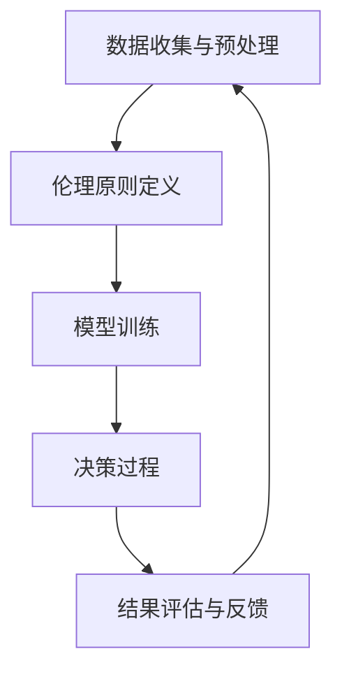

# AI伦理决策模型:将道德考量融入算法

> 关键词：AI伦理、决策模型、道德考量、算法、人工智能、伦理框架、公平性

> 摘要：本文聚焦于AI伦理决策模型，深入探讨如何将道德考量融入算法之中。随着人工智能技术的飞速发展，其在各个领域的应用日益广泛，而算法决策所带来的伦理问题也愈发凸显。通过构建有效的AI伦理决策模型，能够确保人工智能系统在运行过程中遵循道德原则，减少潜在的伦理风险，促进人工智能的可持续发展。文章首先介绍了AI伦理决策模型的背景，包括目的、预期读者、文档结构和相关术语；接着阐述了核心概念与联系，给出了原理和架构的文本示意图与Mermaid流程图；详细讲解了核心算法原理及具体操作步骤，并用Python源代码进行了阐述；探讨了数学模型和公式，并举例说明；通过项目实战展示了代码实际案例和详细解释；分析了实际应用场景；推荐了相关的工具和资源；最后总结了未来发展趋势与挑战，还提供了常见问题与解答以及扩展阅读和参考资料。

## 1. 背景介绍 
### 1.1 目的和范围
人工智能的快速发展已经深刻地改变了我们的生活和社会。从智能助手到自动驾驶汽车，从医疗诊断到金融风险评估，AI系统的决策对人们的生活产生着越来越大的影响。然而，这些决策并非总是符合人类的道德和伦理标准。例如，在招聘过程中，AI算法可能会因数据偏差而对某些群体产生歧视；在司法量刑预测中，算法可能会强化社会的不公平现象。因此，将道德考量融入算法，构建AI伦理决策模型具有重要的现实意义。

本文的范围涵盖了AI伦理决策模型的基本概念、算法原理、数学模型、实际应用以及未来发展趋势等方面。旨在为研究人员、开发者和相关从业者提供一个全面的参考，帮助他们理解和应用AI伦理决策模型，确保AI系统的决策符合道德和伦理要求。

### 1.2 预期读者
本文的预期读者包括但不限于以下几类人群：
- **人工智能研究人员**：希望深入了解AI伦理决策模型的理论和技术，为进一步的研究提供参考。
- **软件开发人员**：需要在开发AI系统时考虑伦理因素，将道德考量融入算法实现中。
- **政策制定者**：关注人工智能发展带来的伦理问题，需要了解AI伦理决策模型的相关知识，以便制定合理的政策和法规。
- **企业管理者**：在应用AI技术时，需要确保企业的AI系统符合道德和伦理标准，避免潜在的法律和声誉风险。
- **普通公众**：对人工智能的发展和伦理问题感兴趣，希望了解AI伦理决策模型的基本概念和作用。

### 1.3 文档结构概述
本文的文档结构如下：
- **核心概念与联系**：介绍AI伦理决策模型的核心概念，包括伦理原则、决策过程等，并给出原理和架构的文本示意图与Mermaid流程图。
- **核心算法原理 & 具体操作步骤**：详细讲解核心算法原理，并用Python源代码进行阐述，同时给出具体的操作步骤。
- **数学模型和公式 & 详细讲解 & 举例说明**：介绍相关的数学模型和公式，并通过具体的例子进行说明。
- **项目实战：代码实际案例和详细解释说明**：通过一个实际的项目案例，展示如何实现AI伦理决策模型，并对代码进行详细的解读和分析。
- **实际应用场景**：分析AI伦理决策模型在不同领域的实际应用场景。
- **工具和资源推荐**：推荐相关的学习资源、开发工具框架和论文著作。
- **总结：未来发展趋势与挑战**：总结AI伦理决策模型的未来发展趋势，并分析面临的挑战。
- **附录：常见问题与解答**：提供常见问题的解答，帮助读者更好地理解和应用AI伦理决策模型。
- **扩展阅读 & 参考资料**：提供相关的扩展阅读材料和参考资料，供读者进一步深入学习。

### 1.4 术语表
#### 1.4.1 核心术语定义
- **AI伦理决策模型**：一种将道德考量融入算法的模型，用于指导AI系统在决策过程中遵循伦理原则。
- **伦理原则**：指导人类行为的道德准则，如公平、公正、尊重隐私等，在AI伦理决策模型中作为决策的依据。
- **算法**：解决特定问题的一系列步骤和规则，在AI系统中用于实现各种功能。
- **道德考量**：在决策过程中考虑道德因素，确保决策的结果符合道德和伦理标准。
- **决策过程**：AI系统从输入数据到产生决策结果的一系列步骤。

#### 1.4.2 相关概念解释
- **数据偏差**：指数据集中存在的系统性偏差，可能导致AI算法在决策过程中产生不公平的结果。
- **公平性**：指AI系统在决策过程中对不同群体一视同仁，不产生歧视性的结果。
- **透明度**：指AI系统的决策过程和结果能够被人类理解和解释，便于进行监督和评估。
- **可解释性**：指AI系统能够对其决策结果提供合理的解释，让用户了解决策的依据和过程。

#### 1.4.3 缩略词列表
- **AI**：Artificial Intelligence，人工智能
- **ML**：Machine Learning，机器学习
- **DL**：Deep Learning，深度学习

## 2. 核心概念与联系 

### 核心概念原理
AI伦理决策模型的核心原理是将伦理原则融入到AI系统的决策过程中。传统的AI算法主要关注如何优化模型的性能，以达到预测准确性、效率等目标。而AI伦理决策模型则在此基础上，增加了对道德和伦理因素的考虑。

在AI系统中，决策通常基于输入数据和训练好的模型。数据中可能存在各种偏差，模型也可能因为训练方式的原因产生不公平的结果。AI伦理决策模型通过引入伦理原则，对数据和模型进行调整和约束，确保决策结果符合道德标准。

例如，在一个招聘算法中，传统的算法可能会根据求职者的学历、工作经验等因素进行排序和筛选。但如果数据集中存在对某些性别或种族的偏见，算法可能会不公平地拒绝一些优秀的求职者。AI伦理决策模型可以通过对数据进行预处理，去除潜在的偏差，或者在模型训练过程中引入公平性约束，使得算法在筛选求职者时更加公平。

### 架构的文本示意图
AI伦理决策模型的架构可以分为以下几个主要部分：
1. **数据收集与预处理**：收集相关的数据，并对数据进行清洗、标注和预处理，以去除数据中的偏差和噪声。
2. **伦理原则定义**：明确需要遵循的伦理原则，如公平性、隐私保护等。
3. **模型训练**：使用预处理后的数据训练AI模型，并在训练过程中融入伦理原则，对模型进行约束和优化。
4. **决策过程**：在实际应用中，AI模型根据输入数据进行决策，并在决策过程中考虑伦理原则。
5. **结果评估与反馈**：对决策结果进行评估，检查是否符合伦理原则。如果不符合，将反馈信息用于调整数据、模型或伦理原则。

### Mermaid流程图


## 3. 核心算法原理 & 具体操作步骤 

### 核心算法原理
一种常见的将道德考量融入算法的方法是使用约束优化算法。在传统的机器学习中，我们通常通过最小化损失函数来训练模型，以提高模型的预测准确性。而在AI伦理决策模型中，我们在损失函数中加入额外的约束条件，以确保模型的决策符合伦理原则。

例如，假设我们有一个二分类问题，目标是预测一个人是否会违约。我们可以使用逻辑回归模型，其损失函数通常是对数损失函数：

```python
import numpy as np

def log_loss(y_true, y_pred):
    epsilon = 1e-15
    y_pred = np.clip(y_pred, epsilon, 1 - epsilon)
    return -np.mean(y_true * np.log(y_pred) + (1 - y_true) * np.log(1 - y_pred))
```

为了引入公平性约束，我们可以定义一个公平性指标，如不同群体之间的预测准确率差异。假设我们有两个群体A和B，我们希望这两个群体的预测准确率尽可能接近。我们可以在损失函数中加入一个惩罚项，当两个群体的准确率差异超过一定阈值时，增加损失值。

```python
def fairness_penalty(y_true_A, y_pred_A, y_true_B, y_pred_B, threshold):
    acc_A = np.mean((y_pred_A > 0.5) == y_true_A)
    acc_B = np.mean((y_pred_B > 0.5) == y_true_B)
    diff = abs(acc_A - acc_B)
    if diff > threshold:
        return diff - threshold
    else:
        return 0

def combined_loss(y_true, y_pred, y_true_A, y_pred_A, y_true_B, y_pred_B, threshold, alpha):
    log_loss_value = log_loss(y_true, y_pred)
    fairness_penalty_value = fairness_penalty(y_true_A, y_pred_A, y_true_B, y_pred_B, threshold)
    return log_loss_value + alpha * fairness_penalty_value
```

### 具体操作步骤
1. **数据划分**：将数据集按照群体（如性别、种族等）进行划分，得到不同群体的数据子集。
2. **初始化模型参数**：随机初始化逻辑回归模型的参数。
3. **迭代训练**：在每次迭代中，计算当前模型的预测结果，然后计算损失函数（包括对数损失和公平性惩罚项）。使用梯度下降等优化算法更新模型参数，以最小化损失函数。
4. **评估模型**：在训练过程中，定期评估模型的性能和公平性指标。如果公平性指标不符合要求，可以调整阈值或惩罚系数 $\alpha$。
5. **部署模型**：当模型训练完成且满足公平性要求后，将模型部署到实际应用中。

以下是一个简单的示例代码，展示了如何使用上述算法进行训练：

```python
from sklearn.linear_model import LogisticRegression
from sklearn.datasets import make_classification
from sklearn.model_selection import train_test_split

# 生成示例数据
X, y = make_classification(n_samples=1000, n_features=10, random_state=42)
# 假设前500个样本属于群体A，后500个样本属于群体B
X_A = X[:500]
y_A = y[:500]
X_B = X[500:]
y_B = y[500:]

# 划分训练集和测试集
X_train_A, X_test_A, y_train_A, y_test_A = train_test_split(X_A, y_A, test_size=0.2, random_state=42)
X_train_B, X_test_B, y_train_B, y_test_B = train_test_split(X_B, y_B, test_size=0.2, random_state=42)

X_train = np.concatenate((X_train_A, X_train_B))
y_train = np.concatenate((y_train_A, y_train_B))

# 初始化模型
model = LogisticRegression()

# 训练模型
num_iterations = 100
threshold = 0.1
alpha = 0.1

for i in range(num_iterations):
    model.fit(X_train, y_train)
    y_pred = model.predict_proba(X_train)[:, 1]
    y_pred_A = model.predict_proba(X_train_A)[:, 1]
    y_pred_B = model.predict_proba(X_train_B)[:, 1]
    loss = combined_loss(y_train, y_pred, y_train_A, y_pred_A, y_train_B, y_pred_B, threshold, alpha)
    print(f'Iteration {i}: Loss = {loss}')

# 评估模型
y_pred_test = model.predict(X_test_A)
acc_A = np.mean(y_pred_test == y_test_A)
y_pred_test = model.predict(X_test_B)
acc_B = np.mean(y_pred_test == y_test_B)
print(f'Accuracy A: {acc_A}, Accuracy B: {acc_B}')
```

## 4. 数学模型和公式 & 详细讲解 & 举例说明 

### 数学模型和公式
在AI伦理决策模型中，我们通常使用约束优化的数学模型。设 $\theta$ 为模型的参数，$L(\theta)$ 为传统的损失函数（如对数损失、均方误差等），$C(\theta)$ 为伦理约束函数。我们的目标是在满足伦理约束的前提下，最小化损失函数，即：

$$
\min_{\theta} L(\theta)
$$

subject to

$$
C(\theta) \leq 0
$$

在上述的公平性约束示例中，$L(\theta)$ 是对数损失函数，$C(\theta)$ 是公平性惩罚项。具体来说，设 $y_i$ 为真实标签，$\hat{y}_i$ 为模型的预测概率，$I_A$ 和 $I_B$ 分别为群体A和群体B的样本索引集合。对数损失函数为：

$$
L(\theta) = -\frac{1}{n} \sum_{i=1}^{n} [y_i \log(\hat{y}_i) + (1 - y_i) \log(1 - \hat{y}_i)]
$$

公平性惩罚项为：

$$
C(\theta) = \max\left(0, \left|\frac{1}{|I_A|} \sum_{i \in I_A} \mathbb{1}(\hat{y}_i > 0.5) - y_i\right| - \left|\frac{1}{|I_B|} \sum_{i \in I_B} \mathbb{1}(\hat{y}_i > 0.5) - y_i\right| - \tau\right)
$$

其中，$\tau$ 是公平性阈值，$\mathbb{1}(\cdot)$ 是指示函数。

### 详细讲解
- **损失函数 $L(\theta)$**：用于衡量模型的预测结果与真实标签之间的差异。在分类问题中，常用对数损失函数；在回归问题中，常用均方误差函数。通过最小化损失函数，我们可以提高模型的预测准确性。
- **伦理约束函数 $C(\theta)$**：用于确保模型的决策符合伦理原则。在公平性约束的例子中，我们通过比较不同群体的预测准确率差异，当差异超过阈值 $\tau$ 时，惩罚项不为零，从而促使模型调整参数，减少不公平性。
- **约束优化问题**：在实际求解中，我们通常使用拉格朗日乘子法将约束优化问题转化为无约束优化问题。引入拉格朗日乘子 $\lambda \geq 0$，构造拉格朗日函数：

$$
\mathcal{L}(\theta, \lambda) = L(\theta) + \lambda C(\theta)
$$

然后通过求解 $\frac{\partial \mathcal{L}}{\partial \theta} = 0$ 和 $\frac{\partial \mathcal{L}}{\partial \lambda} = 0$ 来得到最优解。

### 举例说明
假设我们有一个简单的二分类问题，数据集包含100个样本，其中50个属于群体A，50个属于群体B。真实标签 $y$ 为0或1，模型的预测概率 $\hat{y}$ 为 $[0, 1]$ 之间的实数。我们设定公平性阈值 $\tau = 0.1$。

在某一次迭代中，群体A的预测准确率为0.8，群体B的预测准确率为0.6。则公平性差异为 $|0.8 - 0.6| = 0.2$，超过了阈值0.1，公平性惩罚项 $C(\theta) = 0.2 - 0.1 = 0.1$。假设对数损失函数 $L(\theta) = 0.3$，拉格朗日乘子 $\lambda = 0.5$，则拉格朗日函数 $\mathcal{L}(\theta, \lambda) = 0.3 + 0.5 \times 0.1 = 0.35$。通过梯度下降等优化算法，我们可以更新模型参数 $\theta$，以减小拉格朗日函数的值，从而在提高预测准确性的同时，满足公平性要求。

## 5. 项目实战：代码实际案例和详细解释说明 

### 5.1  开发环境搭建
在进行AI伦理决策模型的开发之前，我们需要搭建相应的开发环境。以下是具体的步骤：
1. **安装Python**：推荐使用Python 3.7及以上版本。可以从Python官方网站（https://www.python.org/downloads/） 下载并安装。
2. **安装必要的库**：我们需要安装一些常用的机器学习和数据处理库，如 `numpy`、`pandas`、`scikit-learn` 等。可以使用 `pip` 进行安装：
```sh
pip install numpy pandas scikit-learn
```
3. **选择开发工具**：可以使用Jupyter Notebook、PyCharm等开发工具。Jupyter Notebook适合进行交互式开发和实验，PyCharm则更适合进行大规模项目的开发和调试。

### 5.2  源代码详细实现和代码解读
我们以一个简单的信用风险评估项目为例，展示如何实现AI伦理决策模型。

```python
import numpy as np
import pandas as pd
from sklearn.linear_model import LogisticRegression
from sklearn.model_selection import train_test_split
from sklearn.preprocessing import StandardScaler

# 生成示例数据
np.random.seed(42)
n_samples = 1000
n_features = 10

# 假设前500个样本属于群体A，后500个