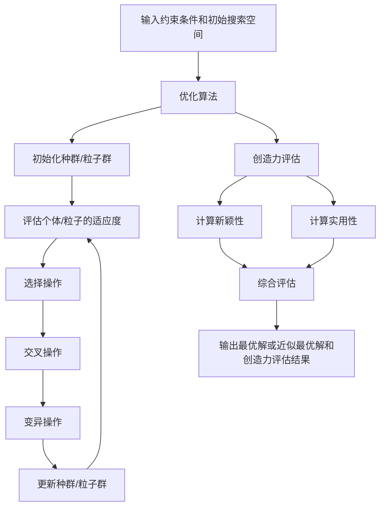

# AI创造力的多约束优化问题

> 关键词：AI创造力、多约束优化、约束条件、优化算法、创造力评估

> 摘要：本文围绕AI创造力的多约束优化问题展开深入探讨。首先介绍了该问题的研究背景和相关概念，阐述了多约束条件下AI创造力优化的重要性和意义。接着详细讲解了核心概念及其联系，通过文本示意图和Mermaid流程图直观呈现。深入分析了核心算法原理，用Python代码进行具体操作步骤的阐述，并给出数学模型和公式进行详细说明与举例。通过项目实战展示了代码实现和解读，探讨了实际应用场景。推荐了相关的学习资源、开发工具框架和论文著作。最后总结了未来发展趋势与挑战，提供了常见问题的解答和扩展阅读参考资料，旨在全面剖析AI创造力的多约束优化问题，为相关研究和实践提供有价值的参考。

## 1. 背景介绍 
### 1.1 目的和范围
随着人工智能技术的飞速发展，AI在各个领域的应用越来越广泛，对AI创造力的需求也日益增长。然而，AI在发挥创造力的过程中往往面临着多种约束条件，如计算资源限制、时间限制、任务目标约束等。本研究的目的在于深入探讨AI创造力的多约束优化问题，寻找有效的方法来在满足各种约束条件的前提下，最大程度地提升AI的创造力表现。研究范围涵盖了多约束条件的分类与分析、优化算法的选择与应用、创造力评估指标的确定等方面，旨在为解决实际问题提供理论和实践指导。

### 1.2 预期读者
本文预期读者包括人工智能领域的研究人员、开发者、学生，以及对AI创造力和优化问题感兴趣的技术爱好者。对于研究人员，本文可提供新的研究思路和方法；对于开发者，可作为实际项目开发的参考；对于学生，有助于深入理解相关领域的知识；对于技术爱好者，能帮助他们拓宽对AI创造力的认知。

### 1.3 文档结构概述
本文将按照以下结构进行阐述：首先介绍核心概念与联系，通过直观的方式呈现多约束优化与AI创造力之间的关系；接着详细讲解核心算法原理和具体操作步骤，并用Python代码进行说明；然后给出数学模型和公式，结合实际例子加深理解；通过项目实战展示代码实现和详细解读；探讨实际应用场景；推荐相关的工具和资源；总结未来发展趋势与挑战；提供常见问题的解答和扩展阅读参考资料。

### 1.4 术语表
#### 1.4.1 核心术语定义
- **AI创造力**：指人工智能系统能够产生新颖、有价值的想法、解决方案或作品的能力。
- **多约束优化**：在存在多个约束条件的情况下，寻找最优解或近似最优解的过程。
- **约束条件**：对AI创造力发挥过程中施加的限制因素，如资源限制、任务要求等。
- **优化算法**：用于在多约束条件下寻找最优解的算法，如遗传算法、粒子群算法等。
- **创造力评估指标**：用于衡量AI创造力水平的量化指标，如新颖性、实用性等。

#### 1.4.2 相关概念解释
- **新颖性**：指AI产生的结果与已有结果的差异程度，新颖性越高，创造力表现越强。
- **实用性**：指AI产生的结果在实际应用中的价值和可行性。
- **搜索空间**：在多约束优化问题中，所有可能解的集合。
- **可行解**：满足所有约束条件的解。

#### 1.4.3 缩略词列表
- **GA**：Genetic Algorithm，遗传算法
- **PSO**：Particle Swarm Optimization，粒子群算法
- **NP**：Non-deterministic Polynomial，非确定性多项式

## 2. 核心概念与联系 
### 核心概念原理
AI创造力的多约束优化问题涉及到多个核心概念，它们之间相互关联、相互影响。AI创造力的发挥需要在一定的约束条件下进行，而多约束优化的目的就是在这些约束条件的限制下，找到能够使AI创造力最大化的解决方案。

约束条件可以分为硬约束和软约束。硬约束是必须严格满足的条件，如计算资源的上限、任务的截止时间等；软约束则是希望尽量满足的条件，如用户对结果的偏好等。优化算法的作用就是在搜索空间中寻找满足约束条件的可行解，并在这些可行解中找到最优解或近似最优解。

创造力评估指标用于衡量AI产生的结果的创造力水平。不同的应用场景可能需要不同的评估指标，例如在艺术创作领域，新颖性可能更为重要；而在工程设计领域，实用性可能更为关键。

### 架构的文本示意图
```plaintext
AI创造力多约束优化问题架构

输入：
- 约束条件（硬约束、软约束）
- 初始搜索空间

处理过程：
- 优化算法（遗传算法、粒子群算法等）
    - 初始化种群/粒子群
    - 评估个体/粒子的适应度
    - 选择操作
    - 交叉操作
    - 变异操作
    - 更新种群/粒子群
- 创造力评估
    - 计算新颖性
    - 计算实用性
    - 综合评估

输出：
- 最优解或近似最优解
- 创造力评估结果
```

### Mermaid流程图


## 3. 核心算法原理 & 具体操作步骤 
### 遗传算法原理
遗传算法（GA）是一种基于生物进化原理的优化算法，它通过模拟自然选择和遗传机制来寻找最优解。遗传算法的基本操作包括选择、交叉和变异。

- **选择操作**：根据个体的适应度值，选择适应度较高的个体作为父代，用于产生下一代个体。
- **交叉操作**：将父代个体的染色体进行交换，产生新的子代个体。
- **变异操作**：对个体的染色体进行随机变异，增加种群的多样性。

### 具体操作步骤
1. **初始化种群**：随机生成一定数量的个体，构成初始种群。
2. **评估适应度**：计算每个个体的适应度值，适应度值越高表示该个体越优秀。
3. **选择操作**：根据适应度值，选择一部分个体作为父代。
4. **交叉操作**：对父代个体进行交叉操作，产生子代个体。
5. **变异操作**：对子代个体进行变异操作，增加种群的多样性。
6. **更新种群**：用子代个体替换父代个体，更新种群。
7. **终止条件判断**：如果满足终止条件（如达到最大迭代次数、适应度值达到阈值等），则停止迭代，输出最优解；否则，返回步骤2。

### Python代码实现
```python
import random

# 定义问题的参数
population_size = 50
chromosome_length = 10
max_generations = 100
mutation_rate = 0.01

# 初始化种群
def initialize_population():
    population = []
    for _ in range(population_size):
        chromosome = [random.randint(0, 1) for _ in range(chromosome_length)]
        population.append(chromosome)
    return population

# 评估适应度
def evaluate_fitness(chromosome):
    # 这里简单示例，适应度为染色体中1的个数
    return sum(chromosome)

# 选择操作
def selection(population):
    fitness_values = [evaluate_fitness(chromosome) for chromosome in population]
    total_fitness = sum(fitness_values)
    probabilities = [fitness / total_fitness for fitness in fitness_values]
    selected_indices = []
    for _ in range(population_size):
        r = random.random()
        cumulative_probability = 0
        for i, probability in enumerate(probabilities):
            cumulative_probability += probability
            if r <= cumulative_probability:
                selected_indices.append(i)
                break
    selected_population = [population[i] for i in selected_indices]
    return selected_population

# 交叉操作
def crossover(parent1, parent2):
    crossover_point = random.randint(1, chromosome_length - 1)
    child1 = parent1[:crossover_point] + parent2[crossover_point:]
    child2 = parent2[:crossover_point] + parent1[crossover_point:]
    return child1, child2

# 变异操作
def mutation(chromosome):
    for i in range(chromosome_length):
        if random.random() < mutation_rate:
            chromosome[i] = 1 - chromosome[i]
    return chromosome

# 主循环
def genetic_algorithm():
    population = initialize_population()
    for generation in range(max_generations):
        selected_population = selection(population)
        new_population = []
        for i in range(0, population_size, 2):
            parent1 = selected_population[i]
            parent2 = selected_population[i + 1]
            child1, child2 = crossover(parent1, parent2)
            child1 = mutation(child1)
            child2 = mutation(child2)
            new_population.extend([child1, child2])
        population = new_population
    best_chromosome = max(population, key=evaluate_fitness)
    best_fitness = evaluate_fitness(best_chromosome)
    return best_chromosome, best_fitness

# 运行遗传算法
best_chromosome, best_fitness = genetic_algorithm()
print("Best chromosome:", best_chromosome)
print("Best fitness:", best_fitness)
```

## 4. 数学模型和公式 & 详细讲解 & 举例说明 
### 数学模型
在AI创造力的多约束优化问题中，我们可以将其抽象为一个数学优化问题。假设我们有 $n$ 个决策变量 $x_1, x_2, \cdots, x_n$，目标是最大化一个目标函数 $f(x_1, x_2, \cdots, x_n)$，同时满足 $m$ 个约束条件 $g_i(x_1, x_2, \cdots, x_n) \leq 0$，$i = 1, 2, \cdots, m$。

数学模型可以表示为：
$$
\begin{aligned}
\max_{x_1, x_2, \cdots, x_n} &\quad f(x_1, x_2, \cdots, x_n) \\
\text{s.t.} &\quad g_i(x_1, x_2, \cdots, x_n) \leq 0, \quad i = 1, 2, \cdots, m
\end{aligned}
$$

### 详细讲解
- **目标函数 $f(x_1, x_2, \cdots, x_n)$**：用于衡量AI创造力的水平，例如可以是新颖性和实用性的加权和。
- **约束条件 $g_i(x_1, x_2, \cdots, x_n) \leq 0$**：表示各种限制条件，如计算资源限制、时间限制等。

### 举例说明
假设我们要设计一个AI绘画系统，决策变量 $x_1$ 表示绘画的颜色选择，$x_2$ 表示绘画的线条风格。目标函数 $f(x_1, x_2)$ 可以是绘画的新颖性和艺术性的加权和，约束条件 $g_1(x_1, x_2)$ 可以表示绘画的时间限制，$g_2(x_1, x_2)$ 可以表示绘画的计算资源限制。

例如，目标函数可以定义为：
$$
f(x_1, x_2) = 0.6 \times \text{novelty}(x_1, x_2) + 0.4 \times \text{artistry}(x_1, x_2)
$$
约束条件可以定义为：
$$
\begin{aligned}
g_1(x_1, x_2) &= \text{time}(x_1, x_2) - T_{\text{max}} \leq 0 \\
g_2(x_1, x_2) &= \text{resource}(x_1, x_2) - R_{\text{max}} \leq 0
\end{aligned}
$$
其中，$\text{novelty}(x_1, x_2)$ 表示绘画的新颖性，$\text{artistry}(x_1, x_2)$ 表示绘画的艺术性，$\text{time}(x_1, x_2)$ 表示绘画所需的时间，$\text{resource}(x_1, x_2)$ 表示绘画所需的计算资源，$T_{\text{max}}$ 表示时间上限，$R_{\text{max}}$ 表示资源上限。

## 5. 项目实战：代码实际案例和详细解释说明 
### 5.1  开发环境搭建
- **操作系统**：Windows、Linux或macOS
- **编程语言**：Python 3.x
- **开发工具**：PyCharm、Jupyter Notebook等
- **依赖库**：numpy、matplotlib等

### 5.2  源代码详细实现和代码解读
以下是一个简单的AI创造力多约束优化的项目实战代码示例，假设我们要优化一个AI生成的音乐作品，目标是在满足时间和复杂度约束的前提下，最大化音乐的新颖性和动听程度。

```python
import numpy as np
import random

# 定义问题的参数
population_size = 50
chromosome_length = 20
max_generations = 100
mutation_rate = 0.01
time_limit = 100
complexity_limit = 50

# 初始化种群
def initialize_population():
    population = []
    for _ in range(population_size):
        chromosome = [random.randint(0, 1) for _ in range(chromosome_length)]
        population.append(chromosome)
    return population

# 评估适应度
def evaluate_fitness(chromosome):
    # 计算新颖性和动听程度
    novelty = sum(chromosome)
    appeal = sum([i * gene for i, gene in enumerate(chromosome)])
    # 计算时间和复杂度
    time = sum([(i + 1) * gene for i, gene in enumerate(chromosome)])
    complexity = sum(chromosome)
    # 检查约束条件
    if time > time_limit or complexity > complexity_limit:
        return 0
    else:
        return 0.6 * novelty + 0.4 * appeal

# 选择操作
def selection(population):
    fitness_values = [evaluate_fitness(chromosome) for chromosome in population]
    total_fitness = sum(fitness_values)
    probabilities = [fitness / total_fitness for fitness in fitness_values]
    selected_indices = []
    for _ in range(population_size):
        r = random.random()
        cumulative_probability = 0
        for i, probability in enumerate(probabilities):
            cumulative_probability += probability
            if r <= cumulative_probability:
                selected_indices.append(i)
                break
    selected_population = [population[i] for i in selected_indices]
    return selected_population

# 交叉操作
def crossover(parent1, parent2):
    crossover_point = random.randint(1, chromosome_length - 1)
    child1 = parent1[:crossover_point] + parent2[crossover_point:]
    child2 = parent2[:crossover_point] + parent1[crossover_point:]
    return child1, child2

# 变异操作
def mutation(chromosome):
    for i in range(chromosome_length):
        if random.random() < mutation_rate:
            chromosome[i] = 1 - chromosome[i]
    return chromosome

# 主循环
def genetic_algorithm():
    population = initialize_population()
    for generation in range(max_generations):
        selected_population = selection(population)
        new_population = []
        for i in range(0, population_size, 2):
            parent1 = selected_population[i]
            parent2 = selected_population[i + 1]
            child1, child2 = crossover(parent1, parent2)
            child1 = mutation(child1)
            child2 = mutation(child2)
            new_population.extend([child1, child2])
        population = new_population
    best_chromosome = max(population, key=evaluate_fitness)
    best_fitness = evaluate_fitness(best_chromosome)
    return best_chromosome, best_fitness

# 运行遗传算法
best_chromosome, best_fitness = genetic_algorithm()
print("Best chromosome:", best_chromosome)
print("Best fitness:", best_fitness)
```

### 5.3  代码解读与分析
- **初始化种群**：`initialize_population` 函数随机生成一定数量的染色体，每个染色体表示一个可能的音乐作品。
- **评估适应度**：`evaluate_fitness` 函数计算每个染色体的适应度值，适应度值由新颖性和动听程度加权得到，同时检查是否满足时间和复杂度约束条件。
- **选择操作**：`selection` 函数根据适应度值选择一部分染色体作为父代。
- **交叉操作**：`crossover` 函数对父代染色体进行交叉操作，产生子代染色体。
- **变异操作**：`mutation` 函数对子代染色体进行变异操作，增加种群的多样性。
- **主循环**：`genetic_algorithm` 函数通过多次迭代，不断更新种群，直到达到最大迭代次数，输出最优染色体和适应度值。

## 6. 实际应用场景 
### 艺术创作领域
在绘画、音乐、文学等艺术创作领域，AI可以在满足一定风格、主题、时间等约束条件的前提下，生成新颖、有创意的作品。例如，AI绘画系统可以根据用户指定的风格和颜色要求，在规定的时间内生成一幅独特的绘画作品；AI音乐创作系统可以根据音乐类型和时长限制，创作一首动听的音乐。

### 工程设计领域
在建筑设计、机械设计、电路设计等工程设计领域，AI可以在满足性能、成本、安全等约束条件的前提下，优化设计方案。例如，AI建筑设计系统可以在给定的预算和场地条件下，设计出既美观又实用的建筑方案；AI机械设计系统可以在满足强度和重量要求的前提下，优化机械零件的结构。

### 游戏开发领域
在游戏开发中，AI可以在满足游戏规则、性能要求等约束条件的前提下，设计出有趣、富有挑战性的游戏关卡和角色。例如，AI游戏关卡设计系统可以根据游戏难度和玩家体验要求，生成不同难度级别的游戏关卡；AI游戏角色设计系统可以根据游戏背景和角色定位，设计出独特的游戏角色。

## 7. 工具和资源推荐
### 7.1 学习资源推荐
#### 7.1.1 书籍推荐
- 《人工智能：一种现代的方法》：全面介绍了人工智能的基本概念、算法和应用，是人工智能领域的经典教材。
- 《遗传算法原理及应用》：详细讲解了遗传算法的原理、实现和应用，对于理解多约束优化问题有很大帮助。
- 《创造力算法：人工智能如何改变艺术与设计》：探讨了AI在艺术和设计领域的创造力应用，提供了很多实际案例和思考。

#### 7.1.2 在线课程
- Coursera上的“人工智能基础”课程：由知名高校的教授授课，系统介绍了人工智能的基础知识和算法。
- edX上的“遗传算法与进化计算”课程：深入讲解了遗传算法的原理和应用，有丰富的实践案例。
- 中国大学MOOC上的“人工智能与机器学习”课程：结合实际项目，介绍了人工智能和机器学习的相关知识和技术。

#### 7.1.3 技术博客和网站
- 机器之心：提供了人工智能领域的最新技术、研究成果和行业动态。
- 开源中国：有很多关于人工智能和优化算法的技术文章和开源项目。
- 知乎：有很多关于AI创造力和多约束优化问题的讨论和分享。

### 7.2 开发工具框架推荐
#### 7.2.1 IDE和编辑器
- PyCharm：功能强大的Python集成开发环境，提供了代码编辑、调试、版本控制等功能。
- Jupyter Notebook：交互式的编程环境，适合进行数据分析和算法实验。
- Visual Studio Code：轻量级的代码编辑器，支持多种编程语言和插件扩展。

#### 7.2.2 调试和性能分析工具
- PDB：Python自带的调试工具，可以帮助开发者定位和解决代码中的问题。
- cProfile：Python的性能分析工具，可以分析代码的运行时间和内存使用情况。
- TensorBoard：用于可视化深度学习模型的训练过程和性能指标。

#### 7.2.3 相关框架和库
- NumPy：Python的数值计算库，提供了高效的数组操作和数学函数。
- Matplotlib：Python的绘图库，用于可视化数据和结果。
- DEAP：Python的进化算法框架，提供了遗传算法、粒子群算法等多种优化算法的实现。

### 7.3 相关论文著作推荐
#### 7.3.1 经典论文
- Holland, J. H. (1975). Adaptation in natural and artificial systems. MIT press. 介绍了遗传算法的基本原理和应用。
- Kennedy, J., & Eberhart, R. C. (1995, November). Particle swarm optimization. In Proceedings of ICNN'95 - International Conference on Neural Networks (Vol. 4, pp. 1942-1948). IEEE. 提出了粒子群优化算法。

#### 7.3.2 最新研究成果
- 搜索IEEE Xplore、ACM Digital Library等学术数据库，查找关于AI创造力和多约束优化问题的最新研究论文。

#### 7.3.3 应用案例分析
- 查看相关领域的学术期刊和会议论文，了解AI创造力在不同应用场景中的实际案例和效果。

## 8. 总结：未来发展趋势与挑战
### 未来发展趋势
- **多学科融合**：AI创造力的多约束优化问题将与计算机科学、数学、心理学、艺术等多个学科进行更深入的融合，从不同角度探索创造力的本质和优化方法。
- **强化学习与创造力**：强化学习技术将在AI创造力优化中发挥更大的作用，通过奖励机制引导AI不断探索和创新。
- **可解释性和可控性**：未来的AI创造力系统将更加注重可解释性和可控性，让用户能够理解和干预AI的创作过程。

### 挑战
- **约束条件的复杂性**：随着应用场景的不断扩展，约束条件将变得越来越复杂，如何有效地处理这些约束条件是一个挑战。
- **创造力评估的主观性**：创造力评估往往具有主观性，不同的人对创造力的理解和评价标准可能不同，如何建立客观、准确的创造力评估指标是一个难题。
- **计算资源的限制**：在多约束优化问题中，搜索空间往往非常大，需要大量的计算资源和时间，如何在有限的计算资源下高效地求解是一个挑战。

## 9. 附录：常见问题与解答
### 问题1：如何确定约束条件？
答：约束条件的确定需要根据具体的应用场景和问题来进行。首先要明确问题的目标和要求，然后分析在实现目标过程中可能受到的限制因素，如资源、时间、性能等，将这些限制因素转化为数学表达式作为约束条件。

### 问题2：如何选择优化算法？
答：选择优化算法需要考虑问题的特点和规模。对于小规模问题，可以使用一些简单的算法，如贪心算法、穷举法等；对于大规模问题，需要使用一些高效的优化算法，如遗传算法、粒子群算法等。同时，还需要考虑算法的收敛速度、稳定性等因素。

### 问题3：如何评估AI的创造力？
答：评估AI的创造力可以从多个角度进行，如新颖性、实用性、艺术性等。可以根据具体的应用场景和需求，选择合适的评估指标，并将这些指标进行量化，综合评估AI的创造力水平。

## 10. 扩展阅读 & 参考资料
- 相关的学术论文和研究报告
- 人工智能领域的经典著作和教材
- 在线技术论坛和社区的讨论和分享

作者：AI天才研究院/AI Genius Institute & 禅与计算机程序设计艺术 /Zen And The Art of Computer Programming