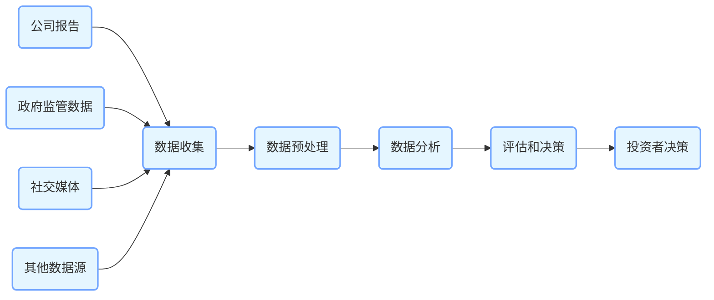

# AI协作分析公司环境责任：可持续价值投资新维度

> 关键词：AI协作、公司环境责任、可持续价值投资、数据分析、环境评估

> 摘要：本文聚焦于利用AI协作来分析公司环境责任，将其视为可持续价值投资的新维度。通过深入探讨AI协作在这一领域的应用，详细阐述了核心概念、算法原理、数学模型等内容。同时，结合实际案例展示了如何运用相关技术进行公司环境责任分析，探讨了其实际应用场景，并推荐了学习资源、开发工具和相关论文著作。最后，对未来发展趋势与挑战进行了总结，为可持续价值投资提供了新的思路和方法。

## 1. 背景介绍 
### 1.1 目的和范围
随着全球对环境保护和可持续发展的关注度不断提高，投资者越来越重视公司的环境责任表现。本研究旨在探索如何利用AI协作技术来分析公司的环境责任，为可持续价值投资提供新的维度和方法。研究范围涵盖了AI技术在环境责任数据收集、分析、评估等方面的应用，以及如何将这些分析结果应用于投资决策中。

### 1.2 预期读者
本文的预期读者包括投资领域的专业人士，如基金经理、投资分析师等，他们可以从中获取新的投资分析方法和思路；环境科学和可持续发展领域的研究人员，能够了解AI技术在环境责任评估中的应用；以及对AI和可持续发展感兴趣的技术爱好者和学者。

### 1.3 文档结构概述
本文首先介绍了相关的背景信息，包括目的、预期读者和文档结构。接着阐述了核心概念与联系，展示了相关的原理和架构示意图。然后详细讲解了核心算法原理和具体操作步骤，并给出了数学模型和公式。通过项目实战部分，展示了代码实际案例和详细解释。之后探讨了实际应用场景，推荐了相关的工具和资源。最后对未来发展趋势与挑战进行了总结，并提供了常见问题解答和扩展阅读参考资料。

### 1.4 术语表
#### 1.4.1 核心术语定义
- **AI协作**：指多个AI系统或AI与人类专家之间相互配合、协同工作，以实现更高效、更准确的数据分析和决策。
- **公司环境责任**：公司在生产经营过程中对环境产生影响所应承担的责任，包括减少污染排放、节约资源、保护生态环境等方面。
- **可持续价值投资**：将环境、社会和治理（ESG）因素纳入投资决策过程，追求长期的、可持续的投资回报。

#### 1.4.2 相关概念解释
- **环境数据**：与公司环境责任相关的数据，如能源消耗、温室气体排放、废水排放等。
- **机器学习算法**：一类通过数据学习模式和规律，并用于预测和决策的算法，在AI协作分析中常用于处理环境数据。
- **自然语言处理**：使计算机能够理解、处理和生成人类语言的技术，可用于从文本信息中提取与公司环境责任相关的内容。

#### 1.4.3 缩略词列表
- **AI**：Artificial Intelligence，人工智能
- **ESG**：Environmental, Social and Governance，环境、社会和治理
- **ML**：Machine Learning，机器学习
- **NLP**：Natural Language Processing，自然语言处理

## 2. 核心概念与联系 

### 核心概念原理
AI协作分析公司环境责任的核心原理是利用AI技术收集、处理和分析与公司环境责任相关的数据，以评估公司在环境方面的表现和责任履行情况。具体来说，通过以下几个步骤实现：
1. **数据收集**：利用各种数据源，如公司报告、政府监管数据、社交媒体等，收集与公司环境责任相关的数据。
2. **数据预处理**：对收集到的数据进行清洗、转换和整合，以提高数据的质量和可用性。
3. **数据分析**：运用机器学习、自然语言处理等AI技术对预处理后的数据进行分析，提取有价值的信息和模式。
4. **评估和决策**：根据分析结果，对公司的环境责任进行评估，并为投资者提供决策支持。

### 架构示意图


该架构图展示了AI协作分析公司环境责任的主要流程。首先从多个数据源收集数据，经过预处理后进行数据分析，最后根据分析结果进行评估和决策，为投资者提供支持。

## 3. 核心算法原理 & 具体操作步骤 

### 核心算法原理
在AI协作分析公司环境责任中，常用的算法包括机器学习算法和自然语言处理算法。下面以决策树算法为例，介绍其原理和应用。

决策树是一种基于树结构进行决策的机器学习算法。它通过对数据的特征进行划分，构建一棵决策树，每个内部节点表示一个特征上的测试，每个分支表示测试输出，每个叶节点表示一个类别或值。决策树算法的目标是找到最优的划分方式，使得树的每个叶节点尽可能纯净，即包含同一类别的样本。

### Python源代码详细阐述
```python
import pandas as pd
from sklearn.model_selection import train_test_split
from sklearn.tree import DecisionTreeClassifier
from sklearn.metrics import accuracy_score

# 假设我们有一个包含公司环境责任相关特征和标签的数据集
# 读取数据集
data = pd.read_csv('company_environment_data.csv')

# 分离特征和标签
X = data.drop('environment_rating', axis=1)
y = data['environment_rating']

# 划分训练集和测试集
X_train, X_test, y_train, y_test = train_test_split(X, y, test_size=0.2, random_state=42)

# 创建决策树分类器
clf = DecisionTreeClassifier()

# 训练模型
clf.fit(X_train, y_train)

# 预测测试集
y_pred = clf.predict(X_test)

# 计算准确率
accuracy = accuracy_score(y_test, y_pred)
print(f"决策树模型的准确率: {accuracy}")
```

### 具体操作步骤
1. **数据准备**：收集和整理与公司环境责任相关的数据，将其存储在一个数据集中。确保数据集中包含特征（如能源消耗、污染排放等）和标签（如环境评级）。
2. **数据预处理**：对数据进行清洗、转换和归一化处理，以提高数据的质量和可用性。
3. **模型选择**：根据数据的特点和问题的需求，选择合适的机器学习算法，如决策树、支持向量机等。
4. **模型训练**：将数据集划分为训练集和测试集，使用训练集对模型进行训练。
5. **模型评估**：使用测试集对训练好的模型进行评估，计算模型的准确率、召回率等指标。
6. **模型应用**：将训练好的模型应用于新的数据，对公司的环境责任进行评估和预测。

## 4. 数学模型和公式 & 详细讲解 & 举例说明 

### 信息熵和基尼不纯度
在决策树算法中，常用的划分准则包括信息熵和基尼不纯度。

#### 信息熵
信息熵是衡量数据集中不确定性的指标。对于一个包含 $n$ 个类别的数据集，其信息熵的计算公式为：
$$H(S)=-\sum_{i=1}^{n}p_i\log_2(p_i)$$
其中，$S$ 表示数据集，$p_i$ 表示第 $i$ 个类别的样本在数据集中所占的比例。

例如，假设有一个数据集包含两个类别，分别为正类和负类，正类样本有 30 个，负类样本有 20 个，数据集总样本数为 50 个。则正类样本的比例 $p_1=\frac{30}{50}=0.6$，负类样本的比例 $p_2=\frac{20}{50}=0.4$。该数据集的信息熵为：
$$H(S)=-0.6\log_2(0.6)-0.4\log_2(0.4)\approx 0.971$$

#### 基尼不纯度
基尼不纯度也是衡量数据集纯度的指标。对于一个包含 $n$ 个类别的数据集，其基尼不纯度的计算公式为：
$$Gini(S)=1-\sum_{i=1}^{n}p_i^2$$
仍以上述数据集为例，该数据集的基尼不纯度为：
$$Gini(S)=1-(0.6^2 + 0.4^2)=1 - 0.52 = 0.48$$

### 决策树的划分准则
决策树在进行划分时，会选择使得划分后子节点的信息熵或基尼不纯度最小的特征进行划分。具体来说，对于一个特征 $A$，其划分后的信息增益或基尼增益的计算公式如下：

#### 信息增益
信息增益是指划分前后数据集信息熵的减少量。对于特征 $A$，其信息增益的计算公式为：
$$IG(S,A)=H(S)-\sum_{v\in Values(A)}\frac{|S_v|}{|S|}H(S_v)$$
其中，$Values(A)$ 表示特征 $A$ 的所有取值，$S_v$ 表示特征 $A$ 取值为 $v$ 时的子集，$|S|$ 表示数据集 $S$ 的样本数，$|S_v|$ 表示子集 $S_v$ 的样本数。

#### 基尼增益
基尼增益是指划分前后数据集基尼不纯度的减少量。对于特征 $A$，其基尼增益的计算公式为：
$$GiniGain(S,A)=Gini(S)-\sum_{v\in Values(A)}\frac{|S_v|}{|S|}Gini(S_v)$$

### 举例说明
假设我们有一个包含公司环境责任相关数据的数据集，其中一个特征是“能源消耗”，有两个取值：“高”和“低”。划分前数据集的信息熵为 $H(S)=0.9$，划分后“能源消耗高”的子集信息熵为 $H(S_1)=0.8$，样本数为 30；“能源消耗低”的子集信息熵为 $H(S_2)=0.7$，样本数为 20。数据集总样本数为 50。则“能源消耗”特征的信息增益为：
$$IG(S,能源消耗)=0.9 - (\frac{30}{50}\times0.8 + \frac{20}{50}\times0.7)=0.9 - 0.76 = 0.14$$

决策树会根据信息增益或基尼增益的大小选择最优的划分特征，逐步构建决策树模型。

## 5. 项目实战：代码实际案例和详细解释说明 

### 5.1  开发环境搭建
为了实现AI协作分析公司环境责任的项目，我们需要搭建以下开发环境：
1. **操作系统**：推荐使用Linux或Windows操作系统。
2. **Python环境**：安装Python 3.6及以上版本。可以使用Anaconda来管理Python环境，它提供了丰富的科学计算库和工具。
3. **开发工具**：推荐使用PyCharm或Jupyter Notebook作为开发工具。PyCharm是一款功能强大的Python集成开发环境，Jupyter Notebook则适合进行交互式的数据探索和模型开发。
4. **相关库的安装**：使用以下命令安装所需的Python库：
```bash
pip install pandas scikit-learn matplotlib seaborn
```

### 5.2  源代码详细实现和代码解读
```python
import pandas as pd
import numpy as np
import matplotlib.pyplot as plt
import seaborn as sns
from sklearn.model_selection import train_test_split
from sklearn.ensemble import RandomForestClassifier
from sklearn.metrics import classification_report, confusion_matrix

# 读取数据集
data = pd.read_csv('company_environment_data.csv')

# 查看数据集基本信息
print("数据集基本信息：")
data.info()

# 查看数据集行数和列数
rows, columns = data.shape

if rows < 100:
    # 小样本数据（行数少于100）查看全量数据信息
    print("数据全部内容信息：")
    print(data.to_csv(sep='\t', na_rep='nan'))
else:
    # 大样本数据查看数据前几行信息
    print("数据前几行内容信息：")
    print(data.head().to_csv(sep='\t', na_rep='nan'))

# 分离特征和标签
X = data.drop('environment_rating', axis=1)
y = data['environment_rating']

# 划分训练集和测试集
X_train, X_test, y_train, y_test = train_test_split(X, y, test_size=0.2, random_state=42)

# 创建随机森林分类器
model = RandomForestClassifier()

# 训练模型
model.fit(X_train, y_train)

# 在测试集上进行预测
y_pred = model.predict(X_test)

# 输出分类报告
print("分类报告：")
print(classification_report(y_test, y_pred))

# 输出混淆矩阵
conf_matrix = confusion_matrix(y_test, y_pred)
print("混淆矩阵：")
print(conf_matrix)

# 绘制混淆矩阵热力图
plt.figure(figsize=(8, 6))
sns.heatmap(conf_matrix, annot=True, fmt='d', cmap='Blues')
plt.xlabel('预测标签')
plt.ylabel('真实标签')
plt.title('混淆矩阵热力图')
plt.show()
```

### 代码解读与分析
1. **数据读取和查看**：使用`pandas`库的`read_csv`函数读取包含公司环境责任数据的CSV文件。通过`info`方法查看数据集的基本信息，根据数据集的行数决定查看全量数据信息还是前几行信息。
2. **特征和标签分离**：使用`drop`方法将目标标签`environment_rating`从数据集中分离出来，得到特征矩阵`X`和标签向量`y`。
3. **数据集划分**：使用`train_test_split`函数将数据集划分为训练集和测试集，测试集占比为 20%。
4. **模型创建和训练**：创建一个随机森林分类器`RandomForestClassifier`，并使用训练集对模型进行训练。
5. **模型预测和评估**：使用训练好的模型对测试集进行预测，得到预测结果`y_pred`。使用`classification_report`函数输出分类报告，包括准确率、召回率、F1 值等指标；使用`confusion_matrix`函数输出混淆矩阵，并使用`seaborn`库绘制混淆矩阵热力图，直观展示模型的预测效果。

通过这个项目实战，我们可以利用随机森林算法对公司的环境责任进行分类预测，并评估模型的性能。

## 6. 实际应用场景 
### 投资决策
投资者可以利用AI协作分析公司环境责任的结果，将环境因素纳入投资决策过程。通过评估公司的环境责任表现，投资者可以选择那些环境友好、具有可持续发展潜力的公司进行投资，从而降低投资风险，获得长期的、可持续的投资回报。

### 公司风险管理
公司自身可以利用AI协作技术对自身的环境责任进行评估和管理。通过分析环境数据，公司可以发现潜在的环境风险，采取相应的措施进行改进，提高公司的环境绩效，增强公司的社会形象和竞争力。

### 政府监管
政府监管部门可以利用AI协作分析公司环境责任的结果，加强对企业的环境监管。通过实时监测公司的环境数据，政府可以及时发现企业的环境违法行为，采取相应的监管措施，促进企业履行环境责任，保护生态环境。

### 行业比较和 benchmarking
行业协会和研究机构可以利用AI协作技术对行业内公司的环境责任进行比较和 benchmarking。通过分析不同公司的环境表现，找出行业内的领先者和落后者，为行业的可持续发展提供参考和指导。

## 7. 工具和资源推荐
### 7.1 学习资源推荐
#### 7.1.1 书籍推荐
- 《Python机器学习》：介绍了Python在机器学习领域的应用，包括各种机器学习算法的原理和实现。
- 《深度学习》：由深度学习领域的三位顶尖专家撰写，全面介绍了深度学习的理论和实践。
- 《可持续投资：ESG整合的艺术与科学》：深入探讨了可持续投资的概念、方法和实践，包括环境责任评估在投资决策中的应用。

#### 7.1.2 在线课程
- Coursera上的“机器学习”课程：由斯坦福大学教授Andrew Ng主讲，是机器学习领域的经典课程。
- edX上的“深度学习”课程：提供了深度学习的系统学习资源，包括理论讲解和实践项目。
- Udemy上的“可持续投资与ESG分析”课程：专门介绍了可持续投资和ESG分析的相关知识和技能。

#### 7.1.3 技术博客和网站
- Towards Data Science：一个专注于数据科学和机器学习的技术博客平台，提供了大量的技术文章和实践案例。
- Medium上的AI和可持续发展相关专栏：有许多关于AI在可持续发展领域应用的文章和见解。
- ESG Investor：专门关注可持续投资和ESG分析的网站，提供了最新的行业动态和研究报告。

### 7.2 开发工具框架推荐
#### 7.2.1 IDE和编辑器
- PyCharm：一款功能强大的Python集成开发环境，提供了代码编辑、调试、版本控制等功能。
- Jupyter Notebook：适合进行交互式的数据探索和模型开发，支持多种编程语言和可视化工具。
- Visual Studio Code：一款轻量级的代码编辑器，支持多种编程语言和插件扩展，可用于Python开发。

#### 7.2.2 调试和性能分析工具
- PDB：Python自带的调试工具，可以帮助开发者定位和解决代码中的问题。
- Py-Spy：一个用于分析Python程序性能的工具，可以实时监控程序的CPU使用率和函数调用情况。
- TensorBoard：TensorFlow提供的可视化工具，可用于监控深度学习模型的训练过程和性能指标。

#### 7.2.3 相关框架和库
- Scikit-learn：一个简单易用的机器学习库，提供了各种机器学习算法的实现和工具。
- TensorFlow：一个开源的深度学习框架，广泛应用于图像识别、自然语言处理等领域。
- PyTorch：另一个流行的深度学习框架，具有动态图和易于使用的特点。

### 7.3 相关论文著作推荐
#### 7.3.1 经典论文
- "A Decision-Theoretic Generalization of On-Line Learning and an Application to Boosting"：介绍了Boosting算法的理论基础和应用。
- "ImageNet Classification with Deep Convolutional Neural Networks"：开创了深度学习在图像识别领域的先河，提出了AlexNet模型。
- "Attention Is All You Need"：提出了Transformer模型，在自然语言处理领域取得了巨大的成功。

#### 7.3.2 最新研究成果
- 关注顶级学术会议如NeurIPS、ICML、CVPR等上关于AI和可持续发展的研究论文，了解最新的技术进展和应用案例。
- 查阅相关学术期刊如Journal of Sustainable Finance & Investment、Nature Sustainability等上的研究成果。

#### 7.3.3 应用案例分析
- 研究机构和咨询公司发布的关于AI在公司环境责任评估和可持续价值投资方面的应用案例报告，了解实际应用中的挑战和解决方案。

## 8. 总结：未来发展趋势与挑战
### 未来发展趋势
- **更强大的AI技术应用**：随着AI技术的不断发展，如深度学习、强化学习等技术将在公司环境责任分析中得到更广泛的应用，提高分析的准确性和效率。
- **多源数据融合**：除了现有的公司报告、政府监管数据等数据源，未来将融合更多的数据源，如卫星图像、传感器数据等，提供更全面的公司环境责任信息。
- **与其他领域的融合**：AI协作分析公司环境责任将与区块链、物联网等技术相结合，实现数据的安全共享和实时监测，为可持续价值投资提供更可靠的支持。
- **个性化投资建议**：根据投资者的风险偏好和投资目标，提供个性化的基于公司环境责任的投资建议，满足不同投资者的需求。

### 挑战
- **数据质量和可用性**：目前与公司环境责任相关的数据存在质量参差不齐、标准不统一等问题，需要建立统一的数据标准和规范，提高数据的质量和可用性。
- **算法解释性**：一些复杂的AI算法如深度学习模型具有较强的黑盒性，难以解释其决策过程和结果。在投资决策等领域，需要提高算法的解释性，让投资者能够理解和信任分析结果。
- **隐私和安全问题**：在收集和处理公司环境责任数据时，需要保护数据的隐私和安全，防止数据泄露和滥用。
- **监管和政策支持**：需要政府和监管部门出台相关的政策和法规，规范AI在公司环境责任分析和可持续价值投资领域的应用，促进该领域的健康发展。

## 9. 附录：常见问题与解答
### 问题1：AI协作分析公司环境责任的准确性如何保证？
解答：为了保证分析的准确性，需要从多个方面入手。首先，要确保数据的质量，对收集到的数据进行严格的清洗和预处理。其次，选择合适的AI算法和模型，并进行充分的训练和优化。此外，还可以采用多种算法和模型进行集成，综合考虑多个因素，提高分析的准确性。最后，通过与实际情况进行对比和验证，不断调整和改进分析方法。

### 问题2：如何获取与公司环境责任相关的数据？
解答：可以通过以下几种途径获取数据：一是公司自身发布的年度报告、可持续发展报告等，这些报告中通常包含了公司的环境责任相关信息；二是政府监管部门发布的数据，如环保部门的污染物排放数据等；三是第三方数据提供商，他们可能收集和整理了大量的公司环境责任数据；四是社交媒体和新闻媒体，从中可以获取一些关于公司环境事件的信息。

### 问题3：AI协作分析公司环境责任对投资者有哪些好处？
解答：对于投资者来说，AI协作分析公司环境责任可以带来多方面的好处。首先，可以帮助投资者识别具有可持续发展潜力的公司，降低投资风险。其次，关注公司的环境责任表现符合当前社会的发展趋势，有助于提升投资组合的社会形象。此外，从长期来看，环境友好型公司往往具有更好的财务表现，能够为投资者带来更高的投资回报。

### 问题4：在实际应用中，AI协作分析公司环境责任会遇到哪些困难？
解答：实际应用中可能会遇到以下困难：数据获取困难，部分公司可能不愿意公开或提供准确的环境责任数据；数据处理复杂，不同数据源的数据格式和标准不统一，需要进行大量的清洗和转换工作；算法的适应性问题，不同行业和公司的环境责任特点不同，需要选择合适的算法和模型；以及技术和人才短缺，缺乏既懂AI技术又了解环境责任评估的专业人才。

## 10. 扩展阅读 & 参考资料
### 扩展阅读
- 《人工智能时代的可持续发展》：探讨了AI技术在可持续发展各个领域的应用和挑战。
- 《绿色金融与可持续投资》：深入介绍了绿色金融和可持续投资的理论和实践。
- 《环境数据科学》：介绍了如何运用数据科学方法处理和分析环境数据。

### 参考资料
- 相关学术论文和研究报告，如发表在《Journal of Business Ethics》《Energy Policy》等期刊上的论文。
- 行业协会和研究机构发布的报告，如世界可持续发展工商理事会（WBCSD）、全球报告倡议组织（GRI）等发布的报告。
- 政府部门发布的政策文件和统计数据，如国家环保部门发布的环境统计公报等。

作者：AI天才研究院/AI Genius Institute & 禅与计算机程序设计艺术 /Zen And The Art of Computer Programming