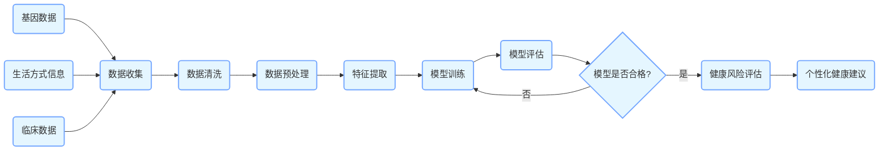

# AI在个性化健康风险评估中的应用：从基因到生活方式

> 关键词：人工智能、个性化健康风险评估、基因数据、生活方式、机器学习、大数据、健康管理

> 摘要：本文深入探讨了AI在个性化健康风险评估中的应用，从基因到生活方式全方位分析其原理、方法及实际应用。首先介绍了相关背景，包括目的范围、预期读者等内容。接着阐述核心概念与联系，构建起清晰的理论架构。通过核心算法原理和具体操作步骤的讲解，结合Python代码示例，让读者理解AI如何处理和分析数据。详细介绍数学模型和公式，辅以举例说明，使复杂的原理更易理解。通过项目实战，展示了开发环境搭建、源代码实现及解读分析。还探讨了实际应用场景，推荐了相关的工具和资源。最后总结未来发展趋势与挑战，解答常见问题，并提供扩展阅读和参考资料，旨在为关注AI在健康领域应用的读者提供全面且深入的技术指导和知识参考。

## 1. 背景介绍 
### 1.1 目的和范围
随着人们对健康关注度的不断提高，个性化健康风险评估成为了医疗健康领域的重要研究方向。传统的健康风险评估方法往往基于群体数据，难以满足个体的特异性需求。而AI技术的发展为个性化健康风险评估带来了新的机遇。本文的目的在于深入探讨AI如何结合基因数据和生活方式信息，实现精准的个性化健康风险评估。范围涵盖了从基因数据的解读到生活方式因素的分析，以及AI在整个评估过程中的应用原理、方法和实际案例。

### 1.2 预期读者
本文预期读者包括医疗健康领域的专业人士，如医生、健康管理师等，他们可以通过本文了解AI在个性化健康风险评估中的应用，为临床实践和健康管理提供新的思路和方法。同时，也适合计算机科学领域的研究者和开发者，他们可以从中获取AI在医疗健康领域的应用场景和技术实现细节。此外，对健康和科技感兴趣的普通读者也能通过本文了解相关的前沿知识。

### 1.3 文档结构概述
本文首先介绍背景信息，包括目的、预期读者和文档结构概述等。接着阐述核心概念与联系，构建起AI在个性化健康风险评估中的理论框架。然后详细讲解核心算法原理和具体操作步骤，并结合Python代码进行说明。随后介绍数学模型和公式，通过举例让读者更好地理解。项目实战部分展示了如何在实际中实现个性化健康风险评估系统，包括开发环境搭建、源代码实现和代码解读分析。之后探讨实际应用场景，推荐相关的工具和资源。最后总结未来发展趋势与挑战，解答常见问题，并提供扩展阅读和参考资料。

### 1.4 术语表
#### 1.4.1 核心术语定义
- **人工智能（AI）**：计算机科学的一个分支，旨在使计算机系统能够模拟人类智能，包括学习、推理、决策等能力。
- **个性化健康风险评估**：基于个体的基因数据、生活方式信息等，利用先进的技术和方法，对个体患特定疾病的风险进行精准评估。
- **基因数据**：包含个体遗传信息的生物数据，如DNA序列等。
- **生活方式信息**：个体的日常行为和习惯，如饮食、运动、吸烟、饮酒等。
- **机器学习**：AI的一个重要领域，通过让计算机从数据中学习模式和规律，从而实现预测和决策等任务。

#### 1.4.2 相关概念解释
- **多组学数据**：包括基因组学、转录组学、蛋白质组学等多种组学数据，这些数据从不同层面反映了生物体内的分子信息，为个性化健康风险评估提供了更全面的依据。
- **数据挖掘**：从大量数据中发现有价值的信息和知识的过程，在个性化健康风险评估中可用于挖掘基因数据和生活方式信息与疾病风险之间的关联。
- **深度学习**：机器学习的一个分支，通过构建深度神经网络模型，自动学习数据中的复杂特征和模式，在图像识别、自然语言处理等领域取得了显著成果，也逐渐应用于个性化健康风险评估中。

#### 1.4.3 缩略词列表
- **AI**：Artificial Intelligence（人工智能）
- **ML**：Machine Learning（机器学习）
- **DL**：Deep Learning（深度学习）
- **DNA**：Deoxyribonucleic Acid（脱氧核糖核酸）

## 2. 核心概念与联系 
在个性化健康风险评估中，涉及到多个核心概念，它们之间相互关联，共同构成了一个复杂的系统。

### 核心概念原理
- **基因数据**：基因是生物体遗传信息的载体，不同的基因序列可能导致个体对某些疾病的易感性不同。例如，某些基因突变可能增加患癌症、心血管疾病等的风险。通过对基因数据的分析，可以了解个体的遗传背景，为健康风险评估提供基础信息。
- **生活方式信息**：生活方式对健康有着重要的影响。不良的生活习惯，如长期吸烟、酗酒、缺乏运动、不合理的饮食等，会增加患各种疾病的风险。而健康的生活方式则有助于降低疾病风险，保持身体健康。
- **人工智能**：AI技术可以对基因数据和生活方式信息进行整合和分析，挖掘其中隐藏的模式和规律。通过机器学习和深度学习算法，建立个性化的健康风险评估模型，预测个体患特定疾病的概率。

### 架构的文本示意图
个性化健康风险评估系统的架构可以分为数据层、处理层和应用层。
- **数据层**：包含基因数据、生活方式信息、临床数据等多种数据源。基因数据可以通过基因测序技术获取，生活方式信息可以通过问卷调查、可穿戴设备等方式收集。
- **处理层**：主要负责对数据进行清洗、预处理、特征提取和模型训练。利用机器学习和深度学习算法，对数据进行分析和建模，挖掘数据中的有用信息。
- **应用层**：将训练好的模型应用于实际的健康风险评估中，为个体提供个性化的健康建议和干预措施。

### Mermaid 流程图


## 3. 核心算法原理 & 具体操作步骤 
### 核心算法原理
在个性化健康风险评估中，常用的算法包括逻辑回归、决策树、随机森林、支持向量机和深度学习算法等。下面以逻辑回归算法为例进行详细讲解。

逻辑回归是一种广泛应用于分类问题的机器学习算法，它通过对输入特征进行线性组合，然后使用逻辑函数将线性组合的结果映射到概率值。逻辑函数的表达式为：

$$\sigma(z)=\frac{1}{1 + e^{-z}}$$

其中，$z$ 是线性组合的结果，$\sigma(z)$ 是逻辑函数的输出，取值范围在 $[0, 1]$ 之间。在个性化健康风险评估中，我们可以将逻辑回归模型表示为：

$$P(y = 1|x)=\sigma(\beta_0+\beta_1x_1+\beta_2x_2+\cdots+\beta_nx_n)$$

其中，$P(y = 1|x)$ 表示在给定输入特征 $x$ 的情况下，个体患某种疾病的概率，$\beta_0, \beta_1, \cdots, \beta_n$ 是模型的参数，$x_1, x_2, \cdots, x_n$ 是输入特征。

### 具体操作步骤
1. **数据收集**：收集个体的基因数据、生活方式信息和临床数据等。
2. **数据清洗**：去除数据中的噪声、缺失值和异常值，确保数据的质量。
3. **数据预处理**：对数据进行标准化、编码等处理，将数据转换为适合模型训练的格式。
4. **特征提取**：从原始数据中提取有用的特征，减少数据的维度，提高模型的效率和性能。
5. **模型训练**：使用训练数据对逻辑回归模型进行训练，估计模型的参数。
6. **模型评估**：使用测试数据对训练好的模型进行评估，计算模型的准确率、召回率、F1值等指标，评估模型的性能。
7. **健康风险评估**：将个体的特征输入到训练好的模型中，计算个体患某种疾病的概率，进行健康风险评估。

### Python源代码示例
```python
import pandas as pd
from sklearn.model_selection import train_test_split
from sklearn.linear_model import LogisticRegression
from sklearn.preprocessing import StandardScaler
from sklearn.metrics import accuracy_score, recall_score, f1_score

# 1. 数据收集
# 假设数据存储在CSV文件中
data = pd.read_csv('health_data.csv')

# 2. 数据清洗
data = data.dropna()  # 去除缺失值

# 3. 数据预处理
X = data.drop('disease_label', axis=1)  # 特征
y = data['disease_label']  # 标签

scaler = StandardScaler()
X = scaler.fit_transform(X)  # 标准化处理

# 4. 特征提取
# 这里可以使用特征选择方法，如相关性分析、卡方检验等
# 为了简化，直接使用所有特征

# 5. 模型训练
X_train, X_test, y_train, y_test = train_test_split(X, y, test_size=0.2, random_state=42)

model = LogisticRegression()
model.fit(X_train, y_train)

# 6. 模型评估
y_pred = model.predict(X_test)

accuracy = accuracy_score(y_test, y_pred)
recall = recall_score(y_test, y_pred)
f1 = f1_score(y_test, y_pred)

print(f"Accuracy: {accuracy}")
print(f"Recall: {recall}")
print(f"F1 Score: {f1}")

# 7. 健康风险评估
new_data = pd.read_csv('new_health_data.csv')
new_data = new_data.dropna()
new_X = scaler.transform(new_data)

risk_probs = model.predict_proba(new_X)[:, 1]
print("Health risk probabilities:", risk_probs)
```

## 4. 数学模型和公式 & 详细讲解 & 举例说明 
### 逻辑回归的数学模型和公式
逻辑回归的数学模型基于逻辑函数，其目标是通过对输入特征进行线性组合，然后使用逻辑函数将线性组合的结果映射到概率值。具体公式如下：

#### 线性组合
$$z=\beta_0+\beta_1x_1+\beta_2x_2+\cdots+\beta_nx_n$$

其中，$z$ 是线性组合的结果，$\beta_0$ 是截距，$\beta_1, \beta_2, \cdots, \beta_n$ 是特征的系数，$x_1, x_2, \cdots, x_n$ 是输入特征。

#### 逻辑函数
$$\sigma(z)=\frac{1}{1 + e^{-z}}$$

逻辑函数将线性组合的结果 $z$ 映射到 $[0, 1]$ 之间的概率值。当 $z$ 趋近于正无穷时，$\sigma(z)$ 趋近于 1；当 $z$ 趋近于负无穷时，$\sigma(z)$ 趋近于 0。

#### 概率模型
$$P(y = 1|x)=\sigma(\beta_0+\beta_1x_1+\beta_2x_2+\cdots+\beta_nx_n)$$

其中，$P(y = 1|x)$ 表示在给定输入特征 $x$ 的情况下，个体患某种疾病的概率。

### 详细讲解
逻辑回归的核心思想是通过最大化似然函数来估计模型的参数 $\beta_0, \beta_1, \cdots, \beta_n$。似然函数表示在给定模型参数的情况下，观测数据出现的概率。对于逻辑回归模型，似然函数可以表示为：

$$L(\beta)=\prod_{i=1}^{m}P(y_i = 1|x_i)^{y_i}(1 - P(y_i = 1|x_i))^{1 - y_i}$$

其中，$m$ 是样本数量，$y_i$ 是第 $i$ 个样本的标签（0 或 1），$x_i$ 是第 $i$ 个样本的特征向量。

为了方便计算，通常对似然函数取对数，得到对数似然函数：

$$\ell(\beta)=\sum_{i=1}^{m}[y_i\log(P(y_i = 1|x_i))+(1 - y_i)\log(1 - P(y_i = 1|x_i))]$$

然后通过梯度下降等优化算法来最大化对数似然函数，从而估计模型的参数。

### 举例说明
假设我们有一个简单的数据集，包含两个特征 $x_1$ 和 $x_2$，以及一个二分类标签 $y$。数据集如下：

| $x_1$ | $x_2$ | $y$ |
|-------|-------|-----|
| 1     | 2     | 0   |
| 2     | 3     | 0   |
| 3     | 4     | 1   |
| 4     | 5     | 1   |

我们使用逻辑回归模型来预测个体患某种疾病的概率。首先，我们需要对数据进行预处理，然后训练模型。

```python
import numpy as np
from sklearn.linear_model import LogisticRegression

# 数据
X = np.array([[1, 2], [2, 3], [3, 4], [4, 5]])
y = np.array([0, 0, 1, 1])

# 训练模型
model = LogisticRegression()
model.fit(X, y)

# 预测新数据的概率
new_X = np.array([[5, 6]])
risk_probs = model.predict_proba(new_X)[:, 1]
print("Health risk probability:", risk_probs)
```

在这个例子中，我们使用逻辑回归模型对新数据的健康风险概率进行了预测。

## 5. 项目实战：代码实际案例和详细解释说明 
### 5.1  开发环境搭建
#### 安装Python
首先，需要安装Python环境。可以从Python官方网站（https://www.python.org/downloads/） 下载适合自己操作系统的Python版本，并按照安装向导进行安装。

#### 安装必要的库
在命令行中使用以下命令安装必要的库：
```sh
pip install pandas numpy scikit-learn matplotlib seaborn
```

- **pandas**：用于数据处理和分析。
- **numpy**：用于数值计算。
- **scikit-learn**：提供了各种机器学习算法和工具。
- **matplotlib** 和 **seaborn**：用于数据可视化。

### 5.2  源代码详细实现和代码解读
#### 数据加载和预处理
```python
import pandas as pd
from sklearn.preprocessing import StandardScaler

# 加载数据
data = pd.read_csv('health_data.csv')

# 数据清洗
data = data.dropna()

# 分离特征和标签
X = data.drop('disease_label', axis=1)
y = data['disease_label']

# 数据标准化
scaler = StandardScaler()
X = scaler.fit_transform(X)
```
代码解读：
- 使用 `pandas` 库的 `read_csv` 函数加载存储在CSV文件中的数据。
- 使用 `dropna` 函数去除数据中的缺失值。
- 使用 `drop` 函数分离特征和标签。
- 使用 `StandardScaler` 对特征进行标准化处理，使特征具有零均值和单位方差。

#### 模型训练和评估
```python
from sklearn.model_selection import train_test_split
from sklearn.linear_model import LogisticRegression
from sklearn.metrics import accuracy_score, recall_score, f1_score

# 划分训练集和测试集
X_train, X_test, y_train, y_test = train_test_split(X, y, test_size=0.2, random_state=42)

# 训练逻辑回归模型
model = LogisticRegression()
model.fit(X_train, y_train)

# 模型预测
y_pred = model.predict(X_test)

# 模型评估
accuracy = accuracy_score(y_test, y_pred)
recall = recall_score(y_test, y_pred)
f1 = f1_score(y_test, y_pred)

print(f"Accuracy: {accuracy}")
print(f"Recall: {recall}")
print(f"F1 Score: {f1}")
```
代码解读：
- 使用 `train_test_split` 函数将数据集划分为训练集和测试集，测试集占比为 20%。
- 使用 `LogisticRegression` 类创建逻辑回归模型，并使用 `fit` 方法进行训练。
- 使用 `predict` 方法对测试集进行预测。
- 使用 `accuracy_score`、`recall_score` 和 `f1_score` 函数计算模型的准确率、召回率和 F1 值。

#### 健康风险评估
```python
new_data = pd.read_csv('new_health_data.csv')
new_data = new_data.dropna()
new_X = scaler.transform(new_data)

risk_probs = model.predict_proba(new_X)[:, 1]
print("Health