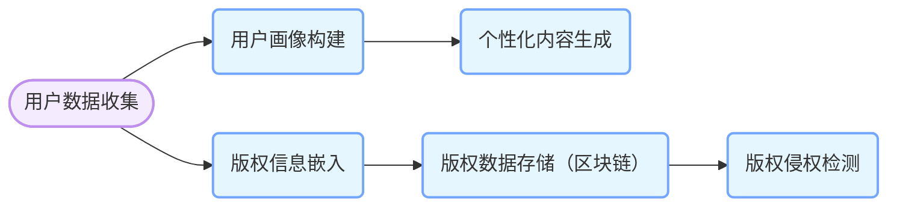

# AI在个性化内容创作与版权保护中的应用与伦理考量

> 关键词：AI、个性化内容创作、版权保护、应用、伦理考量

> 摘要：本文深入探讨了AI在个性化内容创作与版权保护领域的应用，详细分析了相关技术原理、操作步骤、数学模型等。通过实际案例展示了AI在这两个方面的具体应用场景，同时推荐了学习资源、开发工具和相关论文著作。此外，还对AI应用过程中面临的伦理问题进行了思考，并展望了未来发展趋势与挑战，最后针对常见问题给出了解答。

## 1. 背景介绍 
### 1.1 目的和范围
随着人工智能技术的飞速发展，其在各个领域的应用日益广泛，尤其是在个性化内容创作和版权保护方面。本文旨在全面剖析AI在这两个重要领域的应用原理、实际案例以及面临的伦理问题。通过详细的技术讲解和案例分析，让读者深入了解AI如何助力个性化内容创作和版权保护，同时探讨如何在应用过程中遵循伦理道德规范，确保技术的合理使用。

### 1.2 预期读者
本文的预期读者包括从事人工智能、内容创作、版权保护等相关领域的专业人士，如程序员、软件架构师、版权律师等。同时，也适合对AI技术在内容创作和版权保护方面应用感兴趣的科研人员、学生以及普通爱好者阅读，帮助他们了解该领域的最新动态和技术发展趋势。

### 1.3 文档结构概述
本文首先介绍相关背景信息，包括目的、预期读者和文档结构。接着阐述核心概念与联系，展示其原理和架构的文本示意图以及Mermaid流程图。然后详细讲解核心算法原理和具体操作步骤，并给出Python源代码示例。随后介绍数学模型和公式，并通过举例说明其应用。再通过项目实战展示代码实际案例和详细解释。之后探讨实际应用场景，推荐相关工具和资源。最后总结未来发展趋势与挑战，解答常见问题，并提供扩展阅读和参考资料。

### 1.4 术语表
#### 1.4.1 核心术语定义
- **人工智能（AI）**：是一门研究如何使计算机系统能够模拟人类智能的学科，包括学习、推理、解决问题等能力。
- **个性化内容创作**：根据用户的兴趣、偏好、行为等特征，为用户生成符合其特定需求的内容。
- **版权保护**：通过法律手段保护作品的创作者对其作品享有的权利，防止他人未经授权的使用、复制和传播。
- **生成对抗网络（GAN）**：一种深度学习模型，由生成器和判别器组成，用于生成新的数据样本。
- **自然语言处理（NLP）**：让计算机能够理解、处理和生成人类语言的技术。

#### 1.4.2 相关概念解释
- **数据驱动的个性化**：利用大量用户数据，通过数据分析和机器学习算法，实现对用户的精准画像，从而为其提供个性化的内容。
- **版权侵权检测**：通过技术手段检测作品是否存在侵权行为，如相似度检测、水印识别等。
- **伦理考量**：在技术应用过程中，需要考虑其对社会、人类和环境的影响，遵循道德和法律规范。

#### 1.4.3 缩略词列表
- **AI**：Artificial Intelligence（人工智能）
- **GAN**：Generative Adversarial Networks（生成对抗网络）
- **NLP**：Natural Language Processing（自然语言处理）

## 2. 核心概念与联系 
### 核心概念原理
#### 个性化内容创作
个性化内容创作主要基于用户画像和内容生成技术。用户画像通过收集用户的各种数据，如浏览历史、购买记录、社交行为等，利用机器学习算法对用户进行建模，了解其兴趣、偏好和需求。内容生成技术则根据用户画像，利用深度学习模型，如循环神经网络（RNN）、生成对抗网络（GAN）等，生成符合用户需求的内容。例如，在新闻推荐系统中，根据用户的浏览历史和兴趣标签，为用户生成个性化的新闻文章。

#### 版权保护
版权保护主要依靠技术手段和法律手段。技术手段包括数字水印、区块链技术、版权侵权检测算法等。数字水印是将版权信息嵌入到作品中，通过特定的算法可以提取水印信息，证明作品的版权归属。区块链技术具有不可篡改、可追溯的特点，可以记录作品的创作、传播和使用过程，为版权保护提供有力的证据。版权侵权检测算法通过比对作品的特征，如文本相似度、图像特征等，检测是否存在侵权行为。

### 架构的文本示意图
```plaintext
用户数据收集 --> 用户画像构建 --> 个性化内容生成
|
|
V
版权信息嵌入 --> 版权数据存储（区块链） --> 版权侵权检测
```

### Mermaid流程图


## 3. 核心算法原理 & 具体操作步骤 
### 个性化内容创作算法原理
#### 基于RNN的文本生成
循环神经网络（RNN）是一种具有记忆功能的神经网络，适合处理序列数据，如文本。其基本原理是通过隐藏层的状态更新来记忆之前的输入信息。在文本生成中，RNN可以根据前面的文本内容预测下一个单词或字符。

以下是一个简单的基于RNN的文本生成的Python代码示例：
```python
import numpy as np
import tensorflow as tf
from tensorflow.keras.models import Sequential
from tensorflow.keras.layers import SimpleRNN, Dense

# 示例文本
text = "hello world"
chars = sorted(list(set(text)))
char_indices = dict((c, i) for i, c in enumerate(chars))
indices_char = dict((i, c) for i, c in enumerate(chars))

# 准备训练数据
maxlen = 5
step = 1
sentences = []
next_chars = []
for i in range(0, len(text) - maxlen, step):
    sentences.append(text[i: i + maxlen])
    next_chars.append(text[i + maxlen])

x = np.zeros((len(sentences), maxlen, len(chars)), dtype=np.bool)
y = np.zeros((len(sentences), len(chars)), dtype=np.bool)
for i, sentence in enumerate(sentences):
    for t, char in enumerate(sentence):
        x[i, t, char_indices[char]] = 1
    y[i, char_indices[next_chars[i]]] = 1

# 构建RNN模型
model = Sequential()
model.add(SimpleRNN(128, input_shape=(maxlen, len(chars))))
model.add(Dense(len(chars), activation='softmax'))

model.compile(loss='categorical_crossentropy', optimizer='adam')

# 训练模型
model.fit(x, y, batch_size=128, epochs=100)

# 生成文本
def sample(preds, temperature=1.0):
    preds = np.asarray(preds).astype('float64')
    preds = np.log(preds) / temperature
    exp_preds = np.exp(preds)
    preds = exp_preds / np.sum(exp_preds)
    probas = np.random.multinomial(1, preds, 1)
    return np.argmax(probas)

start_index = 0
sentence = text[start_index: start_index + maxlen]
generated = ''
for i in range(400):
    x_pred = np.zeros((1, maxlen, len(chars)))
    for t, char in enumerate(sentence):
        x_pred[0, t, char_indices[char]] = 1.

    preds = model.predict(x_pred, verbose=0)[0]
    next_index = sample(preds, 0.2)
    next_char = indices_char[next_index]

    generated += next_char
    sentence = sentence[1:] + next_char

print(generated)
```
### 操作步骤
1. **数据准备**：收集用户数据，进行清洗和预处理，构建用户画像。
2. **模型选择和训练**：根据具体的应用场景选择合适的深度学习模型，如RNN、GAN等，并使用准备好的数据进行训练。
3. **内容生成**：根据用户画像，使用训练好的模型生成个性化的内容。

### 版权保护算法原理
#### 基于哈希的版权侵权检测
哈希算法可以将任意长度的数据转换为固定长度的哈希值。在版权侵权检测中，可以对作品提取哈希值，通过比较不同作品的哈希值来判断是否存在侵权行为。

以下是一个简单的基于哈希的版权侵权检测的Python代码示例：
```python
import hashlib

def get_hash(file_path):
    hash_object = hashlib.sha256()
    with open(file_path, 'rb') as f:
        while True:
            data = f.read(4096)
            if not data:
                break
            hash_object.update(data)
    return hash_object.hexdigest()

# 示例文件路径
file1 = 'file1.txt'
file2 = 'file2.txt'

hash1 = get_hash(file1)
hash2 = get_hash(file2)

if hash1 == hash2:
    print("可能存在侵权行为")
else:
    print("未发现侵权行为")
```
### 操作步骤
1. **版权信息嵌入**：在作品创作过程中，将版权信息嵌入到作品中，如数字水印。
2. **版权数据存储**：使用区块链技术将版权信息存储在分布式账本中，确保数据的安全性和不可篡改。
3. **侵权检测**：定期对网络上的作品进行扫描，提取哈希值或其他特征，与存储的版权信息进行比对，检测是否存在侵权行为。

## 4. 数学模型和公式 & 详细讲解 & 举例说明 
### 个性化内容创作数学模型
#### 概率语言模型
概率语言模型用于计算文本序列的概率。在RNN中，我们可以使用条件概率来表示生成下一个单词的概率。假设 $w_1, w_2, \cdots, w_n$ 是一个文本序列，概率语言模型可以表示为：
$$P(w_1, w_2, \cdots, w_n) = P(w_1) \times P(w_2|w_1) \times \cdots \times P(w_n|w_1, w_2, \cdots, w_{n-1})$$

在实际应用中，由于计算 $P(w_n|w_1, w_2, \cdots, w_{n-1})$ 比较复杂，通常使用简化的模型，如n-gram模型。n-gram模型假设一个单词的出现只与前面的n-1个单词有关，即：
$$P(w_n|w_1, w_2, \cdots, w_{n-1}) \approx P(w_n|w_{n-(n-1)}, \cdots, w_{n-1})$$

例如，在2-gram模型中，计算 $P(w_n|w_{n-1})$ 可以通过统计语料库中 $w_{n-1}w_n$ 出现的频率来估计。

### 版权保护数学模型
#### 相似度计算
在版权侵权检测中，需要计算两个作品之间的相似度。常用的相似度计算方法有余弦相似度和编辑距离。

#### 余弦相似度
对于两个向量 $\vec{A}$ 和 $\vec{B}$，余弦相似度定义为：
$$\text{cosine similarity} = \frac{\vec{A} \cdot \vec{B}}{\|\vec{A}\| \times \|\vec{B}\|}$$

其中，$\vec{A} \cdot \vec{B}$ 是向量的点积，$\|\vec{A}\|$ 和 $\|\vec{B}\|$ 分别是向量的模。

例如，对于两个文本向量 $\vec{A} = [1, 2, 3]$ 和 $\vec{B} = [2, 4, 6]$，计算余弦相似度：
```python
import numpy as np

A = np.array([1, 2, 3])
B = np.array([2, 4, 6])

dot_product = np.dot(A, B)
norm_A = np.linalg.norm(A)
norm_B = np.linalg.norm(B)

cosine_similarity = dot_product / (norm_A * norm_B)
print(cosine_similarity)
```

#### 编辑距离
编辑距离是指将一个字符串转换为另一个字符串所需的最少编辑操作次数，如插入、删除、替换。

例如，计算字符串 "kitten" 和 "sitting" 的编辑距离：
```python
import Levenshtein

str1 = "kitten"
str2 = "sitting"

edit_distance = Levenshtein.distance(str1, str2)
print(edit_distance)
```

## 5. 项目实战：代码实际案例和详细解释说明 
### 5.1  开发环境搭建
#### 安装Python
首先，需要安装Python环境。可以从Python官方网站（https://www.python.org/downloads/）下载适合自己操作系统的Python版本，并按照安装向导进行安装。

#### 安装必要的库
在命令行中使用以下命令安装必要的库：
```sh
pip install tensorflow numpy pandas scikit-learn Levenshtein
```

### 5.2  源代码详细实现和代码解读
#### 个性化新闻推荐系统
```python
import pandas as pd
from sklearn.feature_extraction.text import TfidfVectorizer
from sklearn.metrics.pairwise import cosine_similarity

# 读取新闻数据
news_data = pd.read_csv('news.csv')

# 提取新闻内容
news_content = news_data['content']

# 计算TF-IDF矩阵
vectorizer = TfidfVectorizer()
tfidf_matrix = vectorizer.fit_transform(news_content)

# 假设用户的历史浏览记录
user_history = ["科技新闻，人工智能发展迅速"]
user_vector = vectorizer.transform(user_history)

# 计算用户历史记录与所有新闻的相似度
similarities = cosine_similarity(user_vector, tfidf_matrix)

# 获取相似度最高的新闻索引
top_indices = similarities.argsort()[0][::-1][:5]

# 输出推荐的新闻
recommended_news = news_data.iloc[top_indices]
print(recommended_news)
```
#### 代码解读
1. **数据读取**：使用 `pandas` 库读取新闻数据文件。
2. **TF-IDF计算**：使用 `TfidfVectorizer` 计算新闻内容的TF-IDF矩阵，将文本转换为向量表示。
3. **用户向量生成**：将用户的历史浏览记录转换为向量。
4. **相似度计算**：使用 `cosine_similarity` 计算用户向量与所有新闻向量的相似度。
5. **新闻推荐**：根据相似度排序，选择相似度最高的新闻进行推荐。

#### 版权侵权检测系统
```python
import os
import hashlib

def get_hash(file_path):
    hash_object = hashlib.sha256()
    with open(file_path, 'rb') as f:
        while True:
            data = f.read(4096)
            if not data:
                break
            hash_object.update(data)
    return hash_object.hexdigest()

# 版权文件路径
copyright_file = 'copyright.txt'
copyright_hash = get_hash(copyright_file)

# 待检测文件目录
check_dir = 'check_files'
for root, dirs, files in os.walk(check_dir):
    for file in files:
        file_path = os.path.join(root, file)
        file_hash = get_hash(file_path)
        if file_hash == copyright_hash:
            print(f"发现侵权文件: {file_path}")
```
#### 代码解读
1. **哈希计算函数**：定义 `get_hash` 函数，用于计算文件的哈希值。
2. **版权文件哈希计算**：计算版权文件的哈希值。
3. **待检测文件遍历**：遍历待检测文件目录，计算每个文件的哈希值。
4. **侵权检测**：比较文件哈希值与版权文件哈希值，如果相同则认为存在侵权行为。

### 5.3  代码解读与分析
#### 个性化新闻推荐系统
该系统通过TF-IDF算法将新闻文本转换为向量，利用余弦相似度计算用户历史记录与新闻的相似度，从而实现个性化推荐。优点是简单易懂，计算效率较高；缺点是没有考虑新闻的语义信息，可能会出现推荐不准确的情况。

#### 版权侵权检测系统
该系统通过计算文件的哈希值进行侵权检测，具有较高的准确性和效率。但对于经过修改的文件，哈希值会发生变化，可能无法检测到侵权行为。可以结合其他技术，如相似度检测、特征提取等，提高检测的准确性。

## 6. 实际应用场景 
### 个性化内容创作应用场景
#### 新闻媒体
新闻媒体可以根据用户的兴趣和偏好，为用户推送个性化的新闻文章。例如，今日头条等新闻客户端通过AI技术实现了精准的新闻推荐，提高了用户的阅读体验和平台的用户粘性。

#### 电商平台
电商平台可以根据用户的购买历史、浏览记录等信息，为用户推荐个性化的商品。例如，淘宝、京东等电商平台通过个性化推荐系统，提高了商品的转化率和用户的购买意愿。

#### 娱乐行业
娱乐行业可以根据用户的音乐、电影、游戏等偏好，为用户推荐个性化的娱乐内容。例如，网易云音乐通过AI算法为用户推荐个性化的音乐歌单，提高了用户的音乐收听体验。

### 版权保护应用场景
#### 数字媒体
在数字媒体领域，如音乐、电影、图片等，版权保护尤为重要。通过数字水印、区块链等技术，可以有效防止数字作品的侵权行为。例如，腾讯音乐通过数字水印技术保护音乐作品的版权。

#### 软件行业
软件行业也面临着版权保护的问题。通过软件加密、版权管理系统等技术，可以防止软件的盗版和非法使用。例如，微软通过数字版权管理（DRM）技术保护其软件产品的版权。

#### 出版行业
出版行业可以通过版权保护技术，保护图书、期刊等出版物的版权。例如，通过区块链技术记录出版物的版权信息，实现版权的可追溯和不可篡改。

## 7. 工具和资源推荐
### 7.1 学习资源推荐
#### 7.1.1 书籍推荐
- 《深度学习》（Deep Learning）：由Ian Goodfellow、Yoshua Bengio和Aaron Courville所著，是深度学习领域的经典教材，全面介绍了深度学习的理论和实践。
- 《Python自然语言处理》（Natural Language Processing with Python）：由Steven Bird、Ewan Klein和Edward Loper所著，详细介绍了使用Python进行自然语言处理的方法和技术。
- 《人工智能：现代方法》（Artificial Intelligence: A Modern Approach）：由Stuart Russell和Peter Norvig所著，是人工智能领域的权威教材，涵盖了人工智能的各个方面。

#### 7.1.2 在线课程
- Coursera上的“深度学习专项课程”（Deep Learning Specialization）：由Andrew Ng教授主讲，包括神经网络和深度学习、改善深层神经网络、结构化机器学习项目等课程。
- edX上的“人工智能导论”（Introduction to Artificial Intelligence）：由MIT教授Patrick H. Winston主讲，介绍了人工智能的基本概念、算法和应用。
- 中国大学MOOC上的“自然语言处理”课程：由哈工大的车万翔教授主讲，系统介绍了自然语言处理的理论和技术。

#### 7.1.3 技术博客和网站
- Medium：是一个技术博客平台，有很多关于人工智能、机器学习、深度学习等领域的优秀文章。
- Towards Data Science：专注于数据科学和机器学习领域的技术博客，提供了很多实用的教程和案例。
- AI Stack Exchange：是一个人工智能领域的问答社区，用户可以在这里提问、交流和分享经验。

### 7.2 开发工具框架推荐
#### 7.2.1 IDE和编辑器
- PyCharm：是一款专门为Python开发设计的集成开发环境（IDE），具有代码编辑、调试、版本控制等功能。
- Jupyter Notebook：是一个交互式的笔记本环境，适合进行数据探索、模型开发和可视化。
- Visual Studio Code：是一款轻量级的代码编辑器，支持多种编程语言，具有丰富的插件扩展功能。

#### 7.2.2 调试和性能分析工具
- TensorBoard：是TensorFlow提供的可视化工具，可以用于查看模型的训练过程、损失曲线、参数分布等信息。
- Py-Spy：是一个Python性能分析工具，可以实时查看Python程序的CPU使用情况和函数调用栈。
- Memory Profiler：是一个Python内存分析工具，可以帮助开发者找出内存泄漏和高内存使用的问题。

#### 7.2.3 相关框架和库
- TensorFlow：是一个开源的深度学习框架，由Google开发，提供了丰富的工具和库，支持各种深度学习模型的开发和训练。
- PyTorch：是另一个流行的深度学习框架，由Facebook开发，具有动态图的特点，适合快速开发和实验。
- NLTK：是Python的自然语言处理工具包，提供了丰富的语料库、分词器、词性标注器等工具。

### 7.3 相关论文著作推荐
#### 7.3.1 经典论文
- 《Generative Adversarial Nets》：Ian Goodfellow等人提出了生成对抗网络（GAN）的概念，开创了生成模型的新领域。
- 《Attention Is All You Need》：提出了Transformer模型，在自然语言处理领域取得了巨大的成功。
- 《ImageNet Classification with Deep Convolutional Neural Networks》：Alex Krizhevsky等人提出了AlexNet模型，推动了深度学习在计算机视觉领域的发展。

#### 7.3.2 最新研究成果
- 关注顶级学术会议，如NeurIPS（神经信息处理系统大会）、ICML（国际机器学习会议）、ACL（计算语言学协会年会）等，这些会议上会发表很多关于人工智能、机器学习、自然语言处理等领域的最新研究成果。
- 关注顶级学术期刊，如Journal of Artificial Intelligence Research（JAIR）、Artificial Intelligence等，这些期刊上会发表高质量的学术论文。

#### 7.3.3 应用案例分析
- 《AI in Content Creation: From Text Generation to Video Editing》：分析了AI在内容创作领域的应用案例，包括文本生成、图像生成、视频编辑等方面。
- 《Copyright Protection in the Digital Age: Challenges and Solutions》：探讨了数字时代版权保护面临的挑战和解决方案，包括技术手段和法律手段。

## 8. 总结：未来发展趋势与挑战
### 未来发展趋势
#### 个性化内容创作
- **多模态融合**：未来的个性化内容创作将不仅仅局限于文本，还将融合图像、音频、视频等多种模态，为用户提供更加丰富和生动的内容体验。
- **情感计算**：通过情感计算技术，了解用户的情感状态，生成更加符合用户情感需求的内容。例如，在用户情绪低落时，推荐积极向上的音乐或文章。
- **实时交互**：实现与用户的实时交互，根据用户的反馈及时调整内容生成策略，提高用户的参与度和满意度。

#### 版权保护
- **区块链技术的广泛应用**：区块链技术将在版权保护领域得到更广泛的应用，实现版权信息的透明化、可追溯和不可篡改，提高版权保护的效率和可信度。
- **人工智能与版权保护的深度融合**：利用人工智能技术，如机器学习、深度学习等，实现更加智能的版权侵权检测和管理，提高版权保护的准确性和效率。
- **国际合作与标准制定**：随着全球化的发展，版权保护需要国际间的合作和标准制定，共同应对跨国版权侵权问题。

### 挑战
#### 伦理问题
- **隐私保护**：在个性化内容创作过程中，需要收集大量的用户数据，如何保护用户的隐私是一个重要的问题。如果用户数据被泄露或滥用，将对用户的权益造成损害。
- **虚假信息传播**：AI生成的内容可能存在虚假信息和误导性内容，如何防止这些内容的传播，维护社会的公序良俗是一个挑战。
- **创作权归属**：在AI参与内容创作的情况下，创作权的归属问题变得复杂。是归AI开发者、使用者还是AI本身，需要明确的法律和伦理界定。

#### 技术挑战
- **数据质量和数量**：个性化内容创作和版权保护都需要大量高质量的数据支持。如何获取、清洗和标注这些数据是一个技术挑战。
- **模型的可解释性**：深度学习模型通常是黑盒模型，其决策过程难以解释。在版权保护和内容创作等领域，需要模型具有可解释性，以便于法律和伦理审查。
- **计算资源和效率**：训练和运行复杂的AI模型需要大量的计算资源和时间。如何提高计算效率，降低成本是一个亟待解决的问题。

## 9. 附录：常见问题与解答
### 个性化内容创作相关问题
#### 问：个性化内容创作会侵犯用户的隐私吗？
答：如果在数据收集和使用过程中不遵循严格的隐私保护原则，可能会侵犯用户的隐私。因此，在进行个性化内容创作时，需要采取有效的隐私保护措施，如数据加密、匿名化处理等，确保用户数据的安全。

#### 问：个性化内容创作生成的内容质量如何保证？
答：可以通过以下方法保证内容质量：选择合适的模型和算法，使用高质量的训练数据，进行人工审核和优化，根据用户反馈不断调整和改进模型。

### 版权保护相关问题
#### 问：数字水印技术能完全防止版权侵权吗？
答：数字水印技术可以在一定程度上防止版权侵权，但不能完全杜绝。一些恶意攻击者可能会通过技术手段去除或破坏数字水印。因此，需要结合其他技术和法律手段，共同加强版权保护。

#### 问：区块链技术在版权保护中的应用有哪些局限性？
答：区块链技术在版权保护中的应用存在一些局限性，如区块链的存储容量有限，处理速度较慢，法律监管尚不完善等。需要不断改进和完善区块链技术，同时加强法律监管，以更好地发挥其在版权保护中的作用。

## 10. 扩展阅读 & 参考资料
### 扩展阅读
- 《AI Superpowers: China, Silicon Valley, and the New World Order》：探讨了中美在人工智能领域的竞争和合作，以及人工智能对全球秩序的影响。
- 《The Fourth Industrial Revolution》：介绍了第四次工业革命的概念和特点，包括人工智能、物联网、大数据等技术的发展和应用。

### 参考资料
- 相关学术论文和研究报告，如IEEE、ACM等学术组织发表的论文。
- 行业报告和统计数据，如Gartner、IDC等机构发布的报告。
- 法律法规和政策文件，如《中华人民共和国著作权法》等。

作者：AI天才研究院/AI Genius Institute & 禅与计算机程序设计艺术 /Zen And The Art of Computer Programming