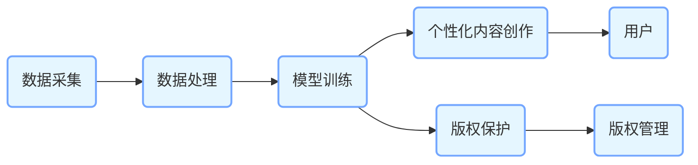

# AI在个性化内容创作与版权保护中的应用与伦理考量

> 关键词：AI、个性化内容创作、版权保护、应用、伦理考量

> 摘要：本文深入探讨了AI在个性化内容创作与版权保护中的应用，详细分析了其背后的核心概念、算法原理和数学模型。通过实际项目案例展示了AI在相关领域的具体应用，同时阐述了AI在个性化内容创作与版权保护中的实际应用场景。此外，还推荐了学习资源、开发工具框架以及相关论文著作。最后对AI在该领域的未来发展趋势与挑战进行了总结，并解答了常见问题，为相关研究和实践提供了全面且深入的参考。

## 1. 背景介绍 
### 1.1 目的和范围
随着人工智能技术的飞速发展，其在各个领域的应用越来越广泛。在内容创作领域，AI实现个性化内容创作能够满足用户多样化的需求，提升用户体验。同时，在版权保护方面，AI也能发挥重要作用，有效识别侵权行为。本文旨在全面探讨AI在个性化内容创作与版权保护中的应用，分析其技术原理、实际应用案例，并深入思考其中涉及的伦理问题。范围涵盖AI在文本、图像、视频等多种内容形式的个性化创作，以及版权归属判断、侵权检测等版权保护方面的应用。

### 1.2 预期读者
本文预期读者包括人工智能领域的研究人员、开发者，内容创作行业的从业者，如作家、设计师、视频制作人等，以及关注版权保护和伦理问题的法律工作者、学者等。希望通过本文为不同领域的读者提供关于AI在个性化内容创作与版权保护方面的全面知识和深入思考。

### 1.3 文档结构概述
本文首先介绍背景信息，让读者了解研究的目的和范围。接着阐述核心概念与联系，包括AI、个性化内容创作和版权保护的相关原理和架构。然后详细讲解核心算法原理及具体操作步骤，并给出数学模型和公式。通过项目实战部分展示AI在实际中的应用案例。之后探讨实际应用场景，推荐相关的工具和资源。最后总结未来发展趋势与挑战，解答常见问题并提供扩展阅读和参考资料。

### 1.4 术语表
#### 1.4.1 核心术语定义
- **人工智能（AI）**：是一门研究如何使计算机能够模拟人类智能的学科，通过机器学习、深度学习等技术让计算机具备感知、学习、推理和决策等能力。
- **个性化内容创作**：根据用户的兴趣、偏好、行为等特征，利用技术手段生成符合用户特定需求的内容。
- **版权保护**：通过法律和技术手段，确保作品的创作者对其作品享有合法的权利，防止他人未经授权的使用、复制和传播。

#### 1.4.2 相关概念解释
- **机器学习**：是AI的一个重要分支，它通过让计算机从数据中学习模式和规律，从而实现预测和决策。常见的机器学习算法包括决策树、支持向量机等。
- **深度学习**：是一种基于人工神经网络的机器学习方法，通过构建多层神经网络，自动从大量数据中提取特征，在图像识别、自然语言处理等领域取得了显著成果。
- **版权归属**：指确定作品的创作者或拥有者，明确其对作品所享有的权利。

#### 1.4.3 缩略词列表
- **AI**：Artificial Intelligence（人工智能）
- **ML**：Machine Learning（机器学习）
- **DL**：Deep Learning（深度学习）

## 2. 核心概念与联系 

### 核心概念原理
#### AI原理
AI主要基于机器学习和深度学习技术。机器学习通过对大量数据的学习，构建模型来进行预测和决策。深度学习则是利用深度神经网络，模拟人类大脑的神经元结构，自动从数据中提取高级特征。例如，在图像识别中，深度学习模型可以学习到图像中物体的特征，从而实现对不同物体的分类。

#### 个性化内容创作原理
个性化内容创作是基于用户画像和内容生成技术。用户画像通过收集用户的行为数据、兴趣爱好等信息，构建用户的特征模型。内容生成技术则根据用户画像，结合预训练的模型，生成符合用户需求的内容。例如，在新闻推荐中，系统根据用户的历史阅读记录和兴趣标签，为用户推荐个性化的新闻文章。

#### 版权保护原理
版权保护主要通过技术手段和法律手段实现。技术手段包括数字水印、区块链等，用于标记作品的版权信息和记录作品的创作和传播过程。法律手段则通过制定和执行版权相关的法律法规，对侵权行为进行制裁。

### 架构的文本示意图
```plaintext
AI系统
├── 数据采集模块
│   ├── 用户行为数据
│   ├── 内容数据
├── 数据处理模块
│   ├── 数据清洗
│   ├── 特征提取
├── 模型训练模块
│   ├── 机器学习模型
│   ├── 深度学习模型
├── 个性化内容创作模块
│   ├── 用户画像生成
│   ├── 内容生成
├── 版权保护模块
│   ├── 版权标记
│   ├── 侵权检测
```

### Mermaid流程图


## 3. 核心算法原理 & 具体操作步骤 

### 核心算法原理
#### 个性化推荐算法（以协同过滤为例）
协同过滤算法是一种基于用户行为数据的个性化推荐算法，分为用户协同过滤和物品协同过滤。用户协同过滤通过找到与目标用户兴趣相似的其他用户，推荐这些用户喜欢的物品。物品协同过滤则是通过找到与目标物品相似的其他物品，推荐给对目标物品感兴趣的用户。

以下是用户协同过滤的Python代码示例：
```python
import numpy as np

# 用户-物品评分矩阵
ratings = np.array([
    [5, 3, 0, 1],
    [4, 0, 0, 1],
    [1, 1, 0, 5],
    [1, 0, 0, 4],
    [0, 1, 5, 4]
])

def user_similarity(ratings):
    """
    计算用户之间的相似度
    """
    num_users = ratings.shape[0]
    similarity = np.zeros((num_users, num_users))
    for i in range(num_users):
        for j in range(num_users):
            if i == j:
                similarity[i][j] = 0
            else:
                common_items = np.logical_and(ratings[i] > 0, ratings[j] > 0)
                if np.sum(common_items) > 0:
                    dot_product = np.dot(ratings[i][common_items], ratings[j][common_items])
                    norm_i = np.linalg.norm(ratings[i][common_items])
                    norm_j = np.linalg.norm(ratings[j][common_items])
                    similarity[i][j] = dot_product / (norm_i * norm_j)
    return similarity

def user_based_recommendation(ratings, user_id, top_n=3):
    """
    用户协同过滤推荐
    """
    similarity = user_similarity(ratings)
    num_items = ratings.shape[1]
    user_ratings = ratings[user_id]
    user_similarities = similarity[user_id]
    item_scores = np.zeros(num_items)
    for item_id in range(num_items):
        if user_ratings[item_id] == 0:
            weighted_sum = 0
            similarity_sum = 0
            for other_user_id in range(len(user_similarities)):
                if user_similarities[other_user_id] > 0 and ratings[other_user_id][item_id] > 0:
                    weighted_sum += user_similarities[other_user_id] * ratings[other_user_id][item_id]
                    similarity_sum += user_similarities[other_user_id]
            if similarity_sum > 0:
                item_scores[item_id] = weighted_sum / similarity_sum
    top_items = np.argsort(item_scores)[::-1][:top_n]
    return top_items

# 为用户0进行推荐
recommended_items = user_based_recommendation(ratings, 0)
print("推荐的物品ID:", recommended_items)
```

#### 侵权检测算法（以文本相似度检测为例）
文本相似度检测算法用于判断两篇文本的相似程度，常用的方法有余弦相似度、编辑距离等。余弦相似度通过计算文本向量的夹角余弦值来衡量相似度。

以下是余弦相似度的Python代码示例：
```python
from sklearn.feature_extraction.text import TfidfVectorizer
from sklearn.metrics.pairwise import cosine_similarity

# 两篇文本
text1 = "这是一篇关于人工智能的文章"
text2 = "这是一篇关于机器学习的文章"

# 计算TF-IDF向量
vectorizer = TfidfVectorizer()
tfidf_matrix = vectorizer.fit_transform([text1, text2])

# 计算余弦相似度
similarity = cosine_similarity(tfidf_matrix[0:1], tfidf_matrix[1:2])
print("文本相似度:", similarity[0][0])
```

### 具体操作步骤
#### 个性化内容创作步骤
1. **数据采集**：收集用户的行为数据，如浏览记录、购买记录、搜索关键词等，以及内容数据，如文章、图片、视频等。
2. **数据处理**：对采集到的数据进行清洗、预处理，提取用户特征和内容特征。
3. **模型训练**：使用机器学习或深度学习算法，根据用户特征和内容特征训练个性化推荐模型。
4. **内容生成**：根据用户画像和训练好的模型，生成个性化的内容推荐。

#### 版权保护步骤
1. **版权标记**：在作品创作过程中，使用数字水印、区块链等技术为作品添加版权信息。
2. **数据采集**：收集网络上的作品数据，用于侵权检测。
3. **相似度检测**：使用文本相似度检测、图像相似度检测等算法，判断作品之间的相似度。
4. **侵权判断**：根据相似度阈值，判断是否存在侵权行为，并采取相应的措施。

## 4. 数学模型和公式 & 详细讲解 & 举例说明 

### 个性化推荐的数学模型和公式
#### 余弦相似度公式
余弦相似度用于衡量两个向量的相似程度，公式为：
$$
\cos(\theta) = \frac{\mathbf{A} \cdot \mathbf{B}}{\|\mathbf{A}\| \|\mathbf{B}\|}
$$
其中，$\mathbf{A}$ 和 $\mathbf{B}$ 是两个向量，$\mathbf{A} \cdot \mathbf{B}$ 是向量的点积，$\|\mathbf{A}\|$ 和 $\|\mathbf{B}\|$ 分别是向量的模。

举例说明：假设有两个用户的评分向量 $\mathbf{A} = [5, 3, 0, 1]$ 和 $\mathbf{B} = [4, 0, 0, 1]$，则它们的余弦相似度为：
$$
\begin{align*}
\cos(\theta) &= \frac{5 \times 4 + 3 \times 0 + 0 \times 0 + 1 \times 1}{\sqrt{5^2 + 3^2 + 0^2 + 1^2} \sqrt{4^2 + 0^2 + 0^2 + 1^2}}\\
&= \frac{20 + 0 + 0 + 1}{\sqrt{35} \sqrt{17}}\\
&\approx 0.83
\end{align*}
$$

#### 加权评分公式
在用户协同过滤中，为目标用户推荐物品时，需要计算物品的加权评分，公式为：
$$
\hat{r}_{u,i} = \frac{\sum_{v \in N(u)} w_{u,v} r_{v,i}}{\sum_{v \in N(u)} |w_{u,v}|}
$$
其中，$\hat{r}_{u,i}$ 是目标用户 $u$ 对物品 $i$ 的预测评分，$N(u)$ 是与目标用户 $u$ 相似的用户集合，$w_{u,v}$ 是用户 $u$ 和用户 $v$ 的相似度，$r_{v,i}$ 是用户 $v$ 对物品 $i$ 的评分。

举例说明：假设目标用户 $u$ 与用户 $v_1$、$v_2$ 的相似度分别为 $w_{u,v_1} = 0.8$ 和 $w_{u,v_2} = 0.6$，用户 $v_1$ 对物品 $i$ 的评分为 $r_{v_1,i} = 5$，用户 $v_2$ 对物品 $i$ 的评分为 $r_{v_2,i} = 4$，则目标用户 $u$ 对物品 $i$ 的预测评分为：
$$
\begin{align*}
\hat{r}_{u,i} &= \frac{0.8 \times 5 + 0.6 \times 4}{0.8 + 0.6}\\
&= \frac{4 + 2.4}{1.4}\\
&\approx 4.57
\end{align*}
$$

### 侵权检测的数学模型和公式
#### 编辑距离公式
编辑距离是指将一个字符串转换为另一个字符串所需的最少编辑操作次数（插入、删除、替换）。可以使用动态规划算法计算编辑距离，公式为：
$$
d[i][j] = \begin{cases}
i & \text{if } j = 0\\
j & \text{if } i = 0\\
d[i-1][j-1] & \text{if } s_1[i-1] = s_2[j-1]\\
\min(d[i-1][j] + 1, d[i][j-1] + 1, d[i-1][j-1] + 1) & \text{if } s_1[i-1] \neq s_2[j-1]
\end{cases}
$$
其中，$d[i][j]$ 表示字符串 $s_1$ 的前 $i$ 个字符和字符串 $s_2$ 的前 $j$ 个字符的编辑距离。

举例说明：计算字符串 "kitten" 和 "sitting" 的编辑距离。
```python
def edit_distance(s1, s2):
    m = len(s1)
    n = len(s2)
    d = [[0] * (n + 1) for _ in range(m + 1)]
    for i in range(m + 1):
        d[i][0] = i
    for j in range(n + 1):
        d[0][j] = j
    for i in range(1, m + 1):
        for j in range(1, n + 1):
            if s1[i - 1] == s2[j - 1]:
                d[i][j] = d[i - 1][j - 1]
            else:
                d[i][j] = min(d[i - 1][j] + 1, d[i][j - 1] + 1, d[i - 1][j - 1] + 1)
    return d[m][n]

s1 = "kitten"
s2 = "sitting"
distance = edit_distance(s1, s2)
print("编辑距离:", distance)
```
输出结果为 3，表示将 "kitten" 转换为 "sitting" 最少需要 3 次编辑操作。

## 5. 项目实战：代码实际案例和详细解释说明 

### 5.1  开发环境搭建
#### 安装Python
首先需要安装Python，建议使用Python 3.7及以上版本。可以从Python官方网站（https://www.python.org/downloads/）下载安装包，按照安装向导进行安装。

#### 安装必要的库
使用pip命令安装必要的库，如numpy、scikit-learn等。
```sh
pip install numpy scikit-learn
```

### 5.2  源代码详细实现和代码解读
#### 个性化新闻推荐系统
```python
import numpy as np
from sklearn.feature_extraction.text import TfidfVectorizer
from sklearn.metrics.pairwise import cosine_similarity

# 新闻文章数据
news_articles = [
    "人工智能在医疗领域的应用取得了重大突破",
    "机器学习算法助力金融风险预测",
    "新能源汽车市场前景广阔",
    "智能手机行业竞争激烈"
]

# 用户历史阅读记录
user_history = ["人工智能在医疗领域的应用取得了重大突破"]

# 计算TF-IDF向量
vectorizer = TfidfVectorizer()
tfidf_matrix = vectorizer.fit_transform(news_articles + user_history)

# 计算用户历史记录与所有新闻文章的相似度
user_vector = tfidf_matrix[-1]
article_vectors = tfidf_matrix[:-1]
similarities = cosine_similarity(user_vector, article_vectors)

# 排序并推荐前2篇新闻
top_indices = np.argsort(similarities[0])[::-1][:2]
recommended_articles = [news_articles[i] for i in top_indices]

print("推荐的新闻文章:", recommended_articles)
```
代码解读：
1. **数据准备**：定义了新闻文章数据和用户历史阅读记录。
2. **特征提取**：使用TfidfVectorizer将文本数据转换为TF-IDF向量。
3. **相似度计算**：使用cosine_similarity计算用户历史记录与所有新闻文章的相似度。
4. **排序推荐**：根据相似度排序，推荐前2篇新闻文章。

#### 文本侵权检测系统
```python
from difflib import SequenceMatcher

# 原始文本
original_text = "这是一篇关于人工智能的文章"
# 待检测文本
test_text = "这是一篇关于机器学习的文章"

# 计算文本相似度
similarity = SequenceMatcher(None, original_text, test_text).ratio()

# 判断是否侵权
if similarity > 0.8:
    print("存在侵权行为")
else:
    print("未发现侵权行为")
```
代码解读：
1. **数据准备**：定义了原始文本和待检测文本。
2. **相似度计算**：使用SequenceMatcher计算文本相似度。
3. **侵权判断**：根据相似度阈值判断是否存在侵权行为。

### 5.3  代码解读与分析
#### 个性化新闻推荐系统分析
- **优点**：基于TF-IDF和余弦相似度的方法简单有效，能够快速计算文本之间的相似度，为用户推荐相关的新闻文章。
- **缺点**：没有考虑用户的长期兴趣和短期兴趣的变化，推荐结果可能不够精准。可以进一步引入用户画像和深度学习模型来提高推荐的准确性。

#### 文本侵权检测系统分析
- **优点**：使用SequenceMatcher计算文本相似度，方法简单易懂，能够快速判断文本之间的相似程度。
- **缺点**：只能检测文本的表面相似度，对于语义相似但表述不同的文本可能无法准确检测。可以结合自然语言处理技术，如词向量、语义相似度计算等，提高侵权检测的准确性。

## 6. 实际应用场景 
### 个性化内容创作场景
#### 新闻媒体
新闻媒体可以利用AI实现个性化新闻推荐，根据用户的兴趣和偏好，为用户推送符合其需求的新闻文章。例如，今日头条等新闻客户端通过AI算法，为用户提供个性化的新闻阅读体验。

#### 电商平台
电商平台可以利用AI为用户提供个性化的商品推荐，根据用户的浏览记录、购买历史等信息，推荐用户可能感兴趣的商品。例如，淘宝、京东等电商平台的个性化推荐系统，提高了用户的购买转化率。

#### 社交媒体
社交媒体平台可以利用AI为用户生成个性化的内容，如个性化的动态、推荐的好友等。例如，Facebook、微博等社交媒体平台通过AI算法，为用户提供个性化的社交体验。

### 版权保护场景
#### 音乐行业
音乐行业可以利用AI技术进行版权保护，通过音频指纹识别技术，识别音乐作品的版权信息，防止未经授权的传播和使用。例如，QQ音乐、网易云音乐等平台利用音频指纹识别技术，对音乐作品进行版权管理。

#### 影视行业
影视行业可以利用AI技术进行视频内容的版权保护，通过视频指纹识别技术，识别视频作品的版权信息，防止盗版和侵权行为。例如，爱奇艺、腾讯视频等平台利用视频指纹识别技术，对影视内容进行版权保护。

#### 出版行业
出版行业可以利用AI技术进行文本内容的版权保护，通过文本相似度检测技术，识别文本作品的版权信息，防止抄袭和侵权行为。例如，知网等学术平台利用文本相似度检测技术，对学术论文进行版权管理。

## 7. 工具和资源推荐
### 7.1 学习资源推荐
#### 7.1.1 书籍推荐
- 《人工智能：一种现代的方法》：全面介绍了人工智能的基本概念、算法和应用，是人工智能领域的经典教材。
- 《深度学习》：由深度学习领域的三位先驱Ian Goodfellow、Yoshua Bengio和Aaron Courville撰写，系统介绍了深度学习的理论和实践。
- 《Python机器学习》：详细介绍了Python在机器学习中的应用，包括各种机器学习算法的实现和案例分析。

#### 7.1.2 在线课程
- Coursera上的“机器学习”课程：由斯坦福大学教授Andrew Ng讲授，是机器学习领域的经典课程，介绍了机器学习的基本概念、算法和应用。
- edX上的“深度学习”课程：由麻省理工学院教授Geoffrey Hinton等讲授，深入介绍了深度学习的理论和实践。
- 中国大学MOOC上的“人工智能基础”课程：由北京大学教授林鸿飞讲授，适合初学者了解人工智能的基本概念和方法。

#### 7.1.3 技术博客和网站
- Medium：一个知名的技术博客平台，有很多关于人工智能、机器学习和深度学习的优质文章。
- Towards Data Science：专注于数据科学和机器学习领域的技术博客，提供了大量的教程和案例分析。
- AI开源社区：国内的人工智能开源社区，提供了丰富的开源项目和技术文章。

### 7.2 开发工具框架推荐
#### 7.2.1 IDE和编辑器
- PyCharm：一款专业的Python集成开发环境，提供了丰富的代码编辑、调试和项目管理功能。
- Jupyter Notebook：一个交互式的开发环境，适合进行数据分析和机器学习实验，支持Python、R等多种编程语言。
- Visual Studio Code：一款轻量级的代码编辑器，支持多种编程语言和插件扩展，适合快速开发和调试。

#### 7.2.2 调试和性能分析工具
- TensorBoard：TensorFlow提供的可视化工具，可以用于查看模型的训练过程、性能指标等信息。
- Py-Spy：一个Python性能分析工具，可以实时监控Python程序的CPU使用率和函数调用情况。
- cProfile：Python标准库中的性能分析模块，可以用于分析Python程序的性能瓶颈。

#### 7.2.3 相关框架和库
- TensorFlow：一个开源的机器学习框架，由Google开发，提供了丰富的深度学习模型和工具。
- PyTorch：一个开源的深度学习框架，由Facebook开发，具有动态图和易于使用的特点。
- Scikit-learn：一个简单易用的机器学习库，提供了各种机器学习算法和工具，适合初学者和快速开发。

### 7.3 相关论文著作推荐
#### 7.3.1 经典论文
- “ImageNet Classification with Deep Convolutional Neural Networks”：介绍了AlexNet模型，开启了深度学习在图像识别领域的热潮。
- “Long Short-Term Memory”：介绍了LSTM模型，解决了传统循环神经网络的梯度消失问题，在自然语言处理领域取得了广泛应用。
- “Attention Is All You Need”：介绍了Transformer模型，提出了注意力机制，在自然语言处理领域取得了巨大成功。

#### 7.3.2 最新研究成果
- 关注顶级学术会议，如NeurIPS、ICML、CVPR等，这些会议上会发表人工智能领域的最新研究成果。
- 关注知名学术期刊，如Journal of Artificial Intelligence Research、Artificial Intelligence等，这些期刊会发表人工智能领域的高质量研究论文。

#### 7.3.3 应用案例分析
- 《人工智能应用案例集》：收集了人工智能在各个领域的应用案例，包括医疗、金融、交通等，为实际应用提供了参考。
- 各大科技公司的官方博客，如Google AI Blog、Facebook AI Research等，会分享他们在人工智能领域的应用案例和研究成果。

## 8. 总结：未来发展趋势与挑战
### 未来发展趋势
#### 更精准的个性化内容创作
随着AI技术的不断发展，个性化内容创作将更加精准。通过结合多模态数据，如文本、图像、视频等，以及更深入的用户画像分析，能够生成更加符合用户需求的个性化内容。

#### 更强的版权保护技术
AI将在版权保护领域发挥更大的作用，开发出更先进的版权标记和侵权检测技术。例如，利用区块链技术实现版权信息的不可篡改和可追溯，利用深度学习模型提高侵权检测的准确性。

#### 跨领域融合应用
AI在个性化内容创作与版权保护中的应用将与其他领域进行更深入的融合，如与法律、金融等领域的结合，为版权交易和保护提供更加完善的解决方案。

### 挑战
#### 伦理问题
AI在个性化内容创作与版权保护中引发了一系列伦理问题，如隐私保护、算法偏见、版权归属等。需要制定相应的伦理准则和法律法规，规范AI的应用。

#### 数据质量和安全
个性化内容创作和版权保护需要大量的数据支持，但数据质量和安全问题是一个挑战。需要加强数据管理和保护，防止数据泄露和滥用。

#### 技术创新和人才培养
AI技术发展迅速，需要不断进行技术创新和人才培养。需要加强高校和科研机构的合作，培养更多的AI专业人才，推动AI技术的发展和应用。

## 9. 附录：常见问题与解答
### 1. AI生成的内容是否具有版权？
目前关于AI生成的内容是否具有版权存在争议。一些观点认为，AI只是工具，版权应归属于使用AI的人；另一些观点认为，AI生成的内容具有一定的创造性，应该赋予其一定的版权。目前不同国家和地区的法律对此有不同的规定。

### 2. 如何确保AI个性化推荐的公平性和无偏见性？
为了确保AI个性化推荐的公平性和无偏见性，需要在数据采集、模型训练和评估等环节进行严格的控制。例如，在数据采集时要避免数据偏差，在模型训练时要使用公平性评估指标进行优化。

### 3. AI在版权保护中的应用是否会侵犯用户的隐私？
如果在版权保护过程中，AI系统过度收集和使用用户的个人信息，可能会侵犯用户的隐私。因此，在应用AI进行版权保护时，需要遵循相关的隐私保护法律法规，确保用户的个人信息安全。

## 10. 扩展阅读 & 参考资料
### 扩展阅读
- 《AI伦理与治理》：深入探讨了AI领域的伦理问题和治理方法。
- 《数字版权管理技术》：详细介绍了数字版权管理的相关技术和应用。

### 参考资料
- 《中华人民共和国著作权法》
- 《人工智能发展报告》

作者：AI天才研究院/AI Genius Institute & 禅与计算机程序设计艺术 /Zen And The Art of Computer Programming