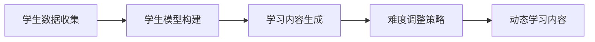

# AI在个性化学习内容生成与难度调整中的动态应用

> 关键词：AI、个性化学习、内容生成、难度调整、动态应用

> 摘要：本文深入探讨了AI在个性化学习内容生成与难度调整中的动态应用。首先介绍了相关背景，包括目的、预期读者等内容。接着阐述了核心概念与联系，分析了核心算法原理及具体操作步骤，运用数学模型和公式进行详细讲解。通过项目实战展示了代码实现及解读，探讨了实际应用场景。同时推荐了相关的工具和资源，最后总结了未来发展趋势与挑战，并给出常见问题解答和扩展阅读参考资料，旨在为教育领域利用AI实现个性化学习提供全面的技术支持和理论指导。

## 1. 背景介绍 
### 1.1 目的和范围
在当今教育领域，传统的“一刀切”式教学模式难以满足每个学生的独特学习需求。每个学生的学习速度、兴趣点、知识基础都存在差异，而AI在个性化学习内容生成与难度调整中的动态应用旨在解决这一问题。其目的是借助人工智能技术，根据学生的学习情况、能力水平、兴趣爱好等多方面因素，动态地生成适合每个学生的个性化学习内容，并实时调整学习内容的难度，以提高学习效果和效率。

本文章的范围涵盖了AI在个性化学习领域的相关理论、技术、算法，以及实际应用案例和未来发展趋势等方面。从基础的概念解释到具体的代码实现，再到实际场景的应用和工具资源的推荐，为读者提供一个全面深入的了解。

### 1.2 预期读者
本文预期读者主要包括教育领域的从业者，如教师、教育研究员、教育技术开发者等，他们可以通过本文了解如何利用AI技术改进教学方法和提高教学质量；计算机科学和人工智能领域的专业人士，如程序员、软件架构师等，能够从中获取在个性化学习场景下AI技术应用的具体实现思路和方法；同时，对个性化学习和AI技术感兴趣的普通读者也可以通过本文对该领域有一个初步的认识和了解。

### 1.3 文档结构概述
本文将按照以下结构进行详细阐述：首先介绍背景知识，让读者对文章的目的、读者群体和整体结构有清晰的认识；接着讲解核心概念与联系，包括相关概念的原理和架构，并通过文本示意图和Mermaid流程图进行直观展示；然后深入分析核心算法原理和具体操作步骤，结合Python源代码进行详细说明；之后运用数学模型和公式对相关内容进行理论推导和举例说明；通过项目实战部分展示代码的实际案例和详细解释；探讨实际应用场景；推荐相关的工具和资源；最后总结未来发展趋势与挑战，给出常见问题解答和扩展阅读参考资料。

### 1.4 术语表
#### 1.4.1 核心术语定义
- **AI（Artificial Intelligence）**：人工智能，是一门研究如何使计算机能够模拟人类智能的学科，包括机器学习、深度学习、自然语言处理等多种技术。
- **个性化学习**：根据每个学生的学习特点、能力水平、兴趣爱好等因素，为其定制专属的学习内容和学习路径的教育方式。
- **内容生成**：利用技术手段自动创建适合特定需求的学习内容，如文本、图像、视频等。
- **难度调整**：根据学生的学习表现和能力水平，实时调整学习内容的难度，以确保学习的挑战性和适应性。
- **动态应用**：在学习过程中，根据学生的实时反馈和变化情况，不断调整和优化学习内容和难度的应用方式。

#### 1.4.2 相关概念解释
- **机器学习**：AI的一个重要分支，通过让计算机从数据中学习模式和规律，从而实现预测和决策等功能。在个性化学习中，机器学习可以用于分析学生的学习数据，预测学生的学习表现和需求。
- **深度学习**：一种基于神经网络的机器学习方法，具有强大的特征提取和模式识别能力。在个性化学习内容生成中，深度学习可以用于生成高质量的文本、图像等学习资源。
- **自然语言处理**：研究如何让计算机理解和处理人类语言的技术。在个性化学习中，自然语言处理可以用于智能答疑、文本生成等方面。

#### 1.4.3 缩略词列表
- **AI**：Artificial Intelligence（人工智能）
- **ML**：Machine Learning（机器学习）
- **DL**：Deep Learning（深度学习）
- **NLP**：Natural Language Processing（自然语言处理）

## 2. 核心概念与联系 
### 核心概念原理
在AI个性化学习内容生成与难度调整的动态应用中，主要涉及到以下几个核心概念及其原理。

#### 学生模型构建
学生模型是个性化学习的基础，它通过收集和分析学生的各种学习数据，如学习成绩、学习时间、答题正确率等，来描述学生的学习状态和能力水平。常见的学生模型包括贝叶斯网络模型、知识空间模型等。以贝叶斯网络模型为例，它通过概率推理来描述学生对不同知识点的掌握程度。假设学生在某个知识点上的答题情况为事件 $A$，学生对该知识点的掌握状态为事件 $B$，则可以通过贝叶斯公式 $P(B|A)=\frac{P(A|B)P(B)}{P(A)}$ 来计算学生在已知答题情况 $A$ 下对知识点的掌握概率 $P(B|A)$。

#### 学习内容生成
学习内容生成是根据学生模型和教学目标，自动创建适合学生的学习内容。这可以通过多种技术实现，如模板填充、生成对抗网络（GAN）等。模板填充是一种简单有效的方法，它预先定义好学习内容的模板，然后根据学生的需求和特点填充相应的内容。例如，对于数学练习题的生成，可以定义一个题目模板 “已知 $x$ 的值为 $[x_value]$，求 $2x + 3$ 的值”，然后根据学生的能力水平随机生成不同的 $[x_value]$。

#### 难度调整策略
难度调整策略是根据学生的学习表现实时调整学习内容的难度。常见的难度调整策略包括基于阈值的调整策略、自适应调整策略等。基于阈值的调整策略是设定一个答题正确率的阈值，当学生的答题正确率高于阈值时，提高学习内容的难度；当答题正确率低于阈值时，降低学习内容的难度。自适应调整策略则是通过更复杂的算法，如强化学习算法，根据学生的学习反馈动态地调整难度。

### 架构的文本示意图
```plaintext
+----------------+           +-------------------+           +----------------+
|   学生数据收集  | --------> |     学生模型构建    | --------> |  学习内容生成  |
+----------------+           +-------------------+           +----------------+
                                                     |
                                                     v
                                              +----------------+
                                              |  难度调整策略  |
                                              +----------------+
                                                     |
                                                     v
                                              +----------------+
                                              |  动态学习内容  |
                                              +----------------+
```

### Mermaid流程图


## 3. 核心算法原理 & 具体操作步骤 
### 学生模型构建算法：朴素贝叶斯分类器
朴素贝叶斯分类器是一种基于贝叶斯定理的简单概率分类器，它假设特征之间相互独立。在学生模型构建中，可以使用朴素贝叶斯分类器来预测学生对知识点的掌握情况。

```python
import numpy as np
from sklearn.naive_bayes import GaussianNB

# 假设我们有学生的学习时间、答题正确率和复习次数作为特征
# 学习时间（小时）、答题正确率（百分比）、复习次数
X = np.array([[2, 80, 3], [3, 90, 4], [1, 60, 2], [4, 95, 5]])
# 学生对知识点的掌握情况，1表示掌握，0表示未掌握
y = np.array([1, 1, 0, 1])

# 创建朴素贝叶斯分类器
clf = GaussianNB()
# 训练模型
clf.fit(X, y)

# 新学生的特征数据
new_student = np.array([[3, 85, 4]])
# 预测新学生对知识点的掌握情况
prediction = clf.predict(new_student)
print("预测结果：", prediction)
```

### 具体操作步骤
1. **数据收集**：收集学生的学习数据，如学习时间、答题正确率、复习次数等，作为特征数据。
2. **标签定义**：根据学生的实际掌握情况，为每个学生的特征数据标记相应的标签（掌握或未掌握）。
3. **模型训练**：使用收集到的数据和标签训练朴素贝叶斯分类器。
4. **预测**：对于新的学生数据，使用训练好的模型进行预测，得到学生对知识点的掌握情况。

### 学习内容生成算法：基于模板的文本生成
```python
import random

# 定义数学练习题模板
templates = [
    "已知 $x$ 的值为 $[x_value]$，求 $2x + 3$ 的值",
    "若 $y = [y_value]$，计算 $3y - 5$ 的结果",
    "当 $z$ 等于 $[z_value]$ 时，$4z + 7$ 是多少"
]

# 生成不同难度的数值范围
easy_range = range(1, 10)
medium_range = range(10, 20)
hard_range = range(20, 30)

# 根据难度级别选择数值范围
def get_value_range(difficulty):
    if difficulty == 'easy':
        return easy_range
    elif difficulty == 'medium':
        return medium_range
    else:
        return hard_range

# 生成学习内容
def generate_learning_content(difficulty):
    template = random.choice(templates)
    value_range = get_value_range(difficulty)
    value = random.choice(value_range)
    if '[x_value]' in template:
        content = template.replace('[x_value]', str(value))
    elif '[y_value]' in template:
        content = template.replace('[y_value]', str(value))
    else:
        content = template.replace('[z_value]', str(value))
    return content

# 生成简单难度的学习内容
easy_content = generate_learning_content('easy')
print("简单难度学习内容：", easy_content)
```

### 具体操作步骤
1. **模板定义**：预先定义好学习内容的模板，包含需要填充的变量。
2. **难度范围设定**：根据不同的难度级别，设定相应的数值范围。
3. **模板选择**：随机选择一个模板。
4. **数值填充**：根据难度级别从相应的数值范围中随机选择一个数值，填充到模板中的变量位置，生成最终的学习内容。

## 4. 数学模型和公式 & 详细讲解 & 举例说明 
### 贝叶斯公式在学生模型中的应用
贝叶斯公式为 $P(B|A)=\frac{P(A|B)P(B)}{P(A)}$，其中：
- $P(B|A)$ 表示在事件 $A$ 发生的条件下，事件 $B$ 发生的概率，在学生模型中，即已知学生的答题情况 $A$ 下，学生对知识点的掌握概率。
- $P(A|B)$ 表示在事件 $B$ 发生的条件下，事件 $A$ 发生的概率，例如学生掌握了某个知识点的情况下，答对相关题目的概率。
- $P(B)$ 表示事件 $B$ 发生的先验概率，即学生在未进行答题之前对知识点的掌握概率。
- $P(A)$ 表示事件 $A$ 发生的概率，即学生答对题目的总概率。

### 详细讲解
假设我们要评估学生对数学中的“一元一次方程”知识点的掌握情况。设事件 $B$ 为学生掌握了“一元一次方程”知识点，事件 $A$ 为学生答对了一道关于“一元一次方程”的题目。

已知：
- $P(B)=0.6$，即学生在未答题之前，我们估计有 60% 的概率掌握了该知识点。
- $P(A|B)=0.9$，即如果学生掌握了该知识点，那么答对题目的概率为 90%。
- $P(A|\overline{B}) = 0.2$，即如果学生未掌握该知识点，答对题目的概率为 20%。

首先计算 $P(A)$：
$$P(A)=P(A|B)P(B)+P(A|\overline{B})P(\overline{B})$$
其中 $P(\overline{B}) = 1 - P(B)=1 - 0.6 = 0.4$
$$P(A)=0.9\times0.6 + 0.2\times0.4=0.54 + 0.08 = 0.62$$

然后根据贝叶斯公式计算 $P(B|A)$：
$$P(B|A)=\frac{P(A|B)P(B)}{P(A)}=\frac{0.9\times0.6}{0.62}\approx0.87$$

这意味着当学生答对了这道题目后，我们可以认为学生掌握该知识点的概率从原来的 60% 提高到了约 87%。

### 难度调整的数学模型：基于阈值的调整
设学生的答题正确率为 $r$，设定两个阈值 $r_{high}$ 和 $r_{low}$（$r_{high}>r_{low}$）。难度级别 $d$ 初始为 $d_0$。

当 $r > r_{high}$ 时，提高难度级别：$d = d + 1$
当 $r < r_{low}$ 时，降低难度级别：$d = d - 1$
当 $r_{low}\leq r\leq r_{high}$ 时，保持难度级别不变：$d = d$

例如，设 $r_{high}=0.8$，$r_{low}=0.2$，$d_0 = 2$（难度级别从 1 到 5，1 为最简单，5 为最难）。如果学生的答题正确率 $r = 0.9$，则 $r > r_{high}$，难度级别调整为 $d = 2 + 1 = 3$。

## 5. 项目实战：代码实际案例和详细解释说明 
### 5.1  开发环境搭建
#### 操作系统
可以选择 Windows、Linux 或 macOS 操作系统。本项目在 Python 环境下开发，对操作系统的兼容性较好。

#### Python 安装
建议安装 Python 3.7 及以上版本。可以从 Python 官方网站（https://www.python.org/downloads/） 下载并安装。

#### 依赖库安装
使用以下命令安装项目所需的依赖库：
```bash
pip install numpy scikit-learn
```

### 5.2  源代码详细实现和代码解读
```python
import numpy as np
from sklearn.naive_bayes import GaussianNB
import random

# 学生模型构建
# 学习时间（小时）、答题正确率（百分比）、复习次数
X = np.array([[2, 80, 3], [3, 90, 4], [1, 60, 2], [4, 95, 5]])
# 学生对知识点的掌握情况，1表示掌握，0表示未掌握
y = np.array([1, 1, 0, 1])

# 创建朴素贝叶斯分类器
clf = GaussianNB()
# 训练模型
clf.fit(X, y)

# 学习内容生成模板
templates = [
    "已知 $x$ 的值为 $[x_value]$，求 $2x + 3$ 的值",
    "若 $y = [y_value]$，计算 $3y - 5$ 的结果",
    "当 $z$ 等于 $[z_value]$ 时，$4z + 7$ 是多少"
]

# 生成不同难度的数值范围
easy_range = range(1, 10)
medium_range = range(10, 20)
hard_range = range(20, 30)

# 根据难度级别选择数值范围
def get_value_range(difficulty):
    if difficulty == 'easy':
        return easy_range
    elif difficulty == 'medium':
        return medium_range
    else:
        return hard_range

# 生成学习内容
def generate_learning_content(difficulty):
    template = random.choice(templates)
    value_range = get_value_range(difficulty)
    value = random.choice(value_range)
    if '[x_value]' in template:
        content = template.replace('[x_value]', str(value))
    elif '[y_value]' in template:
        content = template.replace('[y_value]', str(value))
    else:
        content = template.replace('[z_value]', str(value))
    return content

# 难度调整策略
r_high = 0.8
r_low = 0.2
difficulty = 'medium'

# 模拟学生答题过程
for i in range(5):
    # 新学生的特征数据
    new_student = np.array([[random.randint(1, 5), random.randint(50, 100), random.randint(1, 5)]])
    # 预测新学生对知识点的掌握情况
    prediction = clf.predict(new_student)
    # 模拟答题正确率
    correct_rate = random.random()
    if correct_rate > r_high:
        if difficulty == 'easy':
            difficulty = 'medium'
        elif difficulty == 'medium':
            difficulty = 'hard'
    elif correct_rate < r_low:
        if difficulty == 'hard':
            difficulty = 'medium'
        elif difficulty == 'medium':
            difficulty = 'easy'
    # 生成学习内容
    content = generate_learning_content(difficulty)
    print(f"第 {i + 1} 次学习，答题正确率：{correct_rate:.2f}，难度级别：{difficulty}，学习内容：{content}")
```

### 5.3  代码解读与分析
#### 学生模型构建部分
```python
X = np.array([[2, 80, 3], [3, 90, 4], [1, 60, 2], [4, 95, 5]])
y = np.array([1, 1, 0, 1])
clf = GaussianNB()
clf.fit(X, y)
```
这部分代码使用朴素贝叶斯分类器构建学生模型。`X` 是学生的特征数据，包括学习时间、答题正确率和复习次数；`y` 是学生对知识点的掌握情况标签。通过 `fit` 方法训练模型。

#### 学习内容生成部分
```python
templates = [
    "已知 $x$ 的值为 $[x_value]$，求 $2x + 3$ 的值",
    "若 $y = [y_value]$，计算 $3y - 5$ 的结果",
    "当 $z$ 等于 $[z_value]$ 时，$4z + 7$ 是多少"
]
easy_range = range(1, 10)
medium_range = range(10, 20)
hard_range = range(20, 30)

def get_value_range(difficulty):
    if difficulty == 'easy':
        return easy_range
    elif difficulty == 'medium':
        return medium_range
    else:
        return hard_range

def generate_learning_content(difficulty):
    template = random.choice(templates)
    value_range = get_value_range(difficulty)
    value = random.choice(value_range)
    if '[x_value]' in template:
        content = template.replace('[x_value]', str(value))
    elif '[y_value]' in template:
        content = template.replace('[y_value]', str(value))
    else:
        content = template.replace('[z_value]', str(value))
    return content
```
这部分代码实现了基于模板的学习内容生成。根据不同的难度级别，从相应的数值范围中随机选择一个数值，填充到模板中生成学习内容。

#### 难度调整策略部分
```python
r_high = 0.8
r_low = 0.2
difficulty = 'medium'

for i in range(5):
    new_student = np.array([[random.randint(1, 5), random.randint(50, 100), random.randint(1, 5)]])
    prediction = clf.predict(new_student)
    correct_rate = random.random()
    if correct_rate > r_high:
        if difficulty == 'easy':
            difficulty = 'medium'
        elif difficulty == 'medium':
            difficulty = 'hard'
    elif correct_rate < r_low:
        if difficulty == 'hard':
            difficulty = 'medium'
        elif difficulty == 'medium':
            difficulty = 'easy'
    content = generate_learning_content(difficulty)
    print(f"第 {i + 1} 次学习，答题正确率：{correct_rate:.2f}，难度级别：{difficulty}，学习内容：{content}")
```
这部分代码模拟了学生的答题过程，根据答题正确率调整学习内容的难度级别，并生成相应难度的学习内容。

## 6. 实际应用场景 
### 在线教育平台
在线教育平台可以利用AI技术实现个性化学习内容生成与难度调整。例如，学生在平台上学习课程时，平台可以收集学生的学习数据，如观看视频的时长、做题的正确率等，通过学生模型分析学生的学习情况，为学生生成个性化的学习计划和学习内容。当学生的答题正确率较高时，平台自动提高学习内容的难度；当答题正确率较低时，降低难度，确保学生始终在适合自己的难度水平上学习。

### 智能辅导系统
智能辅导系统可以为学生提供实时的个性化辅导。系统根据学生的提问和答题情况，分析学生的知识短板，生成针对性的学习内容进行辅导。同时，根据学生在辅导过程中的表现，动态调整辅导内容的难度。例如，对于数学学科，当学生在某一类型的题目上多次出错时，系统会降低该类型题目的难度，提供更多的基础练习和详细讲解；当学生掌握较好时，逐渐提高难度，拓展学生的思维能力。

### 自适应考试系统
自适应考试系统可以根据考生的答题情况实时调整试题的难度。在考试开始时，系统先给出一道中等难度的题目，如果考生答对，则接下来给出难度更高的题目；如果答错，则给出难度较低的题目。这样可以更准确地评估考生的真实水平，同时也能提高考试的效率和公平性。

## 7. 工具和资源推荐
### 7.1 学习资源推荐
#### 7.1.1 书籍推荐
- 《人工智能：一种现代的方法》（Artificial Intelligence: A Modern Approach）：这本书是人工智能领域的经典教材，全面介绍了人工智能的基本概念、算法和应用，对于深入理解AI在个性化学习中的应用原理有很大帮助。
- 《Python机器学习实战》（Machine Learning in Action）：通过实际案例详细介绍了Python在机器学习中的应用，适合初学者快速上手机器学习算法，为实现个性化学习系统提供编程基础。
- 《深度学习》（Deep Learning）：由深度学习领域的三位顶尖专家编写，系统地介绍了深度学习的理论和实践，对于理解深度学习在学习内容生成中的应用有重要意义。

#### 7.1.2 在线课程
- Coursera上的“机器学习”课程（Machine Learning）：由斯坦福大学的Andrew Ng教授授课，是机器学习领域最受欢迎的在线课程之一，课程内容深入浅出，适合零基础学习者。
- edX上的“人工智能导论”课程（Introduction to Artificial Intelligence）：全面介绍了人工智能的各个方面，包括搜索算法、知识表示、机器学习等，为学习者提供了一个完整的人工智能知识体系。
- Udemy上的“Python深度学习实战”课程（Deep Learning with Python）：通过实际项目讲解Python在深度学习中的应用，帮助学习者掌握深度学习的编程技巧。

#### 7.1.3 技术博客和网站
- Towards Data Science：这是一个专注于数据科学和机器学习的技术博客平台，上面有很多关于AI在教育领域应用的文章和案例分享。
- Medium：一个综合性的写作平台，有许多AI专家和从业者在上面分享他们的研究成果和实践经验。
- arXiv：一个预印本论文库，提供了大量最新的人工智能研究论文，对于了解AI在个性化学习领域的前沿研究非常有帮助。

### 7.2 开发工具框架推荐
#### 7.2.1 IDE和编辑器
- PyCharm：一款专业的Python集成开发环境，提供了丰富的代码编辑、调试和项目管理功能，适合开发复杂的AI应用程序。
- Jupyter Notebook：一种交互式的开发环境，支持代码、文本、图像等多种形式的展示，非常适合进行数据探索和模型实验。
- Visual Studio Code：一款轻量级的代码编辑器，具有丰富的插件扩展功能，对Python开发有良好的支持。

#### 7.2.2 调试和性能分析工具
- TensorBoard：TensorFlow的可视化工具，可以帮助开发者监控模型的训练过程、分析模型的性能指标，如损失函数、准确率等。
- Py-Spy：一个Python性能分析工具，可以实时监控Python程序的CPU使用情况，找出性能瓶颈。
- cProfile：Python标准库中的性能分析模块，可以统计函数的调用次数、执行时间等信息，帮助开发者优化代码性能。

#### 7.2.3 相关框架和库
- TensorFlow：一个开源的机器学习框架，提供了丰富的深度学习模型和工具，广泛应用于图像识别、自然语言处理等领域。
- PyTorch：另一个流行的深度学习框架，具有动态图机制，代码简洁易懂，适合快速开发和实验。
- Scikit-learn：一个简单易用的机器学习库，提供了各种机器学习算法和工具，如分类、回归、聚类等，适合初学者入门。

### 7.3 相关论文著作推荐
#### 7.3.1 经典论文
- “Learning to Rank using Gradient Descent”：介绍了一种基于梯度下降的排序学习方法，可用于个性化学习中对学习内容的排序。
- “Generative Adversarial Nets”：提出了生成对抗网络（GAN）的概念，为学习内容生成提供了新的思路和方法。
- “Probabilistic Reasoning in Intelligent Systems: Networks of Plausible Inference”：详细阐述了贝叶斯网络在概率推理中的应用，对于学生模型构建有重要的参考价值。

#### 7.3.2 最新研究成果
- 关注顶级学术会议如NeurIPS（神经信息处理系统大会）、ICML（国际机器学习会议）、ACL（计算语言学协会年会）上关于AI在教育领域应用的研究论文，了解最新的技术和方法。
- 查阅相关学术期刊如“Journal of Educational Data Mining”、“Artificial Intelligence in Education”上的研究成果，获取最新的理论和实践进展。

#### 7.3.3 应用案例分析
- 一些知名的在线教育平台如Coursera、EdX等会发布关于AI在个性化学习中的应用案例和实践经验，可以通过他们的官方博客和研究报告进行学习和参考。
- 一些教育科技公司如Knewton、DreamBox等也在AI个性化学习领域有很多成功的应用案例，可以关注他们的官方网站和相关报道。

## 8. 总结：未来发展趋势与挑战
### 未来发展趋势
#### 多模态学习内容生成
未来，AI将不仅仅局限于生成文本形式的学习内容，还将能够生成图像、视频、音频等多模态的学习资源。例如，根据学生的需求和特点，自动生成生动有趣的动画视频来讲解复杂的知识概念，或者生成具有针对性的语音辅导内容，提高学习的趣味性和效果。

#### 强化学习在难度调整中的深度应用
强化学习算法将在难度调整中得到更广泛和深入的应用。通过智能体与学生的交互，不断优化难度调整策略，使学习内容的难度能够更加精准地适应学生的能力水平和学习状态，实现真正的自适应学习。

#### 与虚拟现实（VR）和增强现实（AR）技术的融合
AI与VR/AR技术的融合将为个性化学习带来全新的体验。学生可以在虚拟环境中进行沉浸式学习，AI根据学生在虚拟环境中的表现实时生成和调整学习内容，如在虚拟实验室中进行科学实验，AI根据学生的操作情况提供个性化的指导和反馈。

### 挑战
#### 数据隐私和安全问题
在收集和使用学生的学习数据时，必须高度重视数据隐私和安全问题。学生的个人信息和学习数据包含了大量的敏感信息，如果泄露可能会对学生造成不良影响。因此，需要建立完善的数据保护机制，确保数据的安全存储和传输。

#### 模型的可解释性
许多AI模型，尤其是深度学习模型，具有很强的黑盒性质，难以解释其决策过程和结果。在个性化学习中，教师和学生需要了解模型为什么生成这样的学习内容和调整难度，因此提高模型的可解释性是一个亟待解决的问题。

#### 教育理念和教师角色的转变
引入AI技术实现个性化学习需要教育理念和教师角色的转变。传统的教学模式强调教师的主导地位，而个性化学习更注重学生的主体地位。教师需要从知识的传授者转变为学习的引导者和促进者，这对教师的专业素养和教学能力提出了更高的要求。

## 9. 附录：常见问题与解答
### 问题1：AI生成的学习内容质量如何保证？
解答：可以通过以下几种方式保证学习内容的质量。一是使用高质量的训练数据，让AI模型学习到正确和有价值的知识；二是在生成内容后，进行人工审核和筛选，去除不符合要求的内容；三是建立反馈机制，根据学生的使用反馈不断优化生成模型。

### 问题2：如何确定难度调整的阈值？
解答：难度调整的阈值可以根据教学经验和实验数据来确定。首先，可以参考教师在传统教学中的经验，了解学生在不同难度水平下的学习表现。然后，通过小规模的实验，观察不同阈值设置下学生的学习效果，选择最合适的阈值。同时，阈值也可以根据学生的群体特征和学习阶段进行动态调整。

### 问题3：AI个性化学习系统是否会取代教师？
解答：AI个性化学习系统不会取代教师。虽然AI可以提供个性化的学习内容和难度调整，但教师在教育中具有不可替代的作用。教师可以给予学生情感支持、引导学生思考、培养学生的团队合作能力和创新精神等。AI个性化学习系统可以作为教师的辅助工具，帮助教师更好地开展教学工作。

## 10. 扩展阅读 & 参考资料
### 扩展阅读
- 《教育中的人工智能：机遇与挑战》：深入探讨了AI在教育领域的应用现状、发展趋势和面临的挑战，为读者提供了更全面的视角。
- 《智能教育：从理念到实践》：介绍了智能教育的理论和实践案例，对于理解AI在个性化学习中的应用有很大的启发。

### 参考资料
- 相关学术论文和研究报告，如NeurIPS、ICML、ACL等会议的论文集，以及“Journal of Educational Data Mining”、“Artificial Intelligence in Education”等期刊上的文章。
- 在线教育平台和教育科技公司的官方网站和研究报告，如Coursera、EdX、Knewton、DreamBox等。

作者：AI天才研究院/AI Genius Institute & 禅与计算机程序设计艺术 /Zen And The Art of Computer Programming