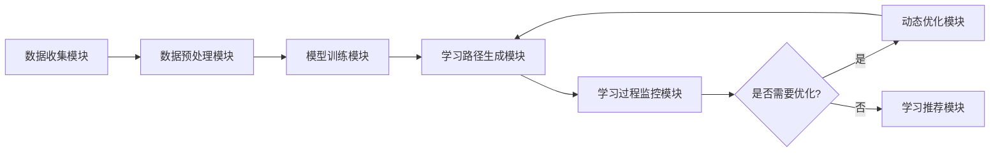

# AI在个性化学习路径规划中的动态优化应用

> 关键词：AI、个性化学习路径规划、动态优化、教育技术、机器学习

> 摘要：本文围绕AI在个性化学习路径规划中的动态优化应用展开深入探讨。首先介绍了相关背景，包括目的范围、预期读者等内容。接着阐述了核心概念与联系，呈现了其原理和架构。详细讲解了核心算法原理及具体操作步骤，结合Python代码进行分析。通过数学模型和公式进一步说明其理论基础。在项目实战部分，给出代码实际案例并进行详细解释。还探讨了实际应用场景，推荐了相关工具和资源。最后总结未来发展趋势与挑战，提供常见问题解答及扩展阅读参考资料，旨在全面深入地研究AI在个性化学习路径规划动态优化方面的应用，为教育领域的智能化发展提供理论和实践指导。

## 1. 背景介绍 
### 1.1 目的和范围
在当今教育领域，传统的“一刀切”式教学方式已难以满足学生多样化的学习需求。每个学生的学习能力、兴趣爱好、知识储备等都存在差异，因此个性化学习成为了教育发展的重要方向。AI在个性化学习路径规划中的动态优化应用的目的在于，利用人工智能技术，根据学生的个体特征和学习过程中的实时数据，为学生量身定制个性化的学习路径，并根据学生的学习进展和表现动态调整学习路径，以提高学习效率和学习效果。

本文章的范围涵盖了AI在个性化学习路径规划中动态优化的各个方面，包括核心概念、算法原理、数学模型、实际应用案例、相关工具和资源等，旨在为教育从业者、技术开发者以及对个性化学习感兴趣的人士提供全面的参考。

### 1.2 预期读者
- **教育从业者**：包括教师、教育管理人员等，他们可以通过本文了解如何利用AI技术实现个性化教学，提高教学质量和学生的学习效果。
- **技术开发者**：如人工智能工程师、软件开发者等，本文提供的算法原理和代码实现可以为他们在开发个性化学习系统时提供参考。
- **教育技术研究者**：对个性化学习和AI技术在教育领域应用感兴趣的研究人员，可以从本文中获取相关的理论和实践案例，为进一步的研究提供思路。
- **学生和家长**：了解AI在个性化学习中的应用，有助于他们更好地理解个性化学习的优势和方法，积极参与到个性化学习过程中。

### 1.3 文档结构概述
本文将按照以下结构进行阐述：
1. **背景介绍**：介绍本文的目的、范围、预期读者和文档结构概述，以及相关术语的定义和解释。
2. **核心概念与联系**：阐述AI在个性化学习路径规划中动态优化的核心概念、原理和架构，并通过文本示意图和Mermaid流程图进行直观展示。
3. **核心算法原理 & 具体操作步骤**：详细讲解实现个性化学习路径规划动态优化的核心算法原理，并使用Python源代码进行详细阐述。
4. **数学模型和公式 & 详细讲解 & 举例说明**：介绍相关的数学模型和公式，并通过具体例子进行说明。
5. **项目实战：代码实际案例和详细解释说明**：提供一个实际的项目案例，包括开发环境搭建、源代码详细实现和代码解读。
6. **实际应用场景**：探讨AI在个性化学习路径规划中动态优化的实际应用场景。
7. **工具和资源推荐**：推荐相关的学习资源、开发工具框架和论文著作。
8. **总结：未来发展趋势与挑战**：总结AI在个性化学习路径规划中动态优化的未来发展趋势和面临的挑战。
9. **附录：常见问题与解答**：解答读者在阅读过程中可能遇到的常见问题。
10. **扩展阅读 & 参考资料**：提供相关的扩展阅读材料和参考资料。

### 1.4 术语表
#### 1.4.1 核心术语定义
- **AI（Artificial Intelligence）**：人工智能，是研究、开发用于模拟、延伸和扩展人的智能的理论、方法、技术及应用系统的一门新的技术科学。
- **个性化学习路径规划**：根据学生的个体特征（如学习能力、兴趣爱好、知识储备等），为学生制定适合其自身发展的学习路径。
- **动态优化**：在学习过程中，根据学生的实时学习数据和表现，对学习路径进行实时调整和优化。
- **学习数据**：包括学生的学习行为数据（如学习时间、学习频率、答题正确率等）和学习结果数据（如考试成绩、作业完成情况等）。

#### 1.4.2 相关概念解释
- **机器学习**：是一门多领域交叉学科，涉及概率论、统计学、逼近论、凸分析、算法复杂度理论等多门学科。它专门研究计算机怎样模拟或实现人类的学习行为，以获取新的知识或技能，重新组织已有的知识结构使之不断改善自身的性能。在个性化学习路径规划中，机器学习算法可以用于分析学生的学习数据，预测学生的学习需求和表现。
- **深度学习**：是机器学习的一个分支领域，它是一种基于对数据进行表征学习的方法。深度学习通过构建具有很多层的神经网络模型，自动从大量数据中学习特征和模式。在个性化学习路径规划中，深度学习可以用于处理复杂的学习数据，如文本、图像、视频等，提高学习路径规划的准确性和个性化程度。

#### 1.4.3 缩略词列表
- **AI**：Artificial Intelligence（人工智能）
- **ML**：Machine Learning（机器学习）
- **DL**：Deep Learning（深度学习）

## 2. 核心概念与联系 

### 核心概念原理
AI在个性化学习路径规划中的动态优化应用基于以下原理：首先，通过收集学生的学习数据，包括学习行为数据和学习结果数据，对学生的学习状态进行全面了解。然后，利用机器学习和深度学习算法对这些数据进行分析和建模，挖掘学生的学习特征和模式。根据这些特征和模式，为学生生成个性化的学习路径。在学生的学习过程中，不断收集新的学习数据，实时评估学生的学习进展和表现。如果发现学生的学习情况与预期不符，或者学生的学习需求发生变化，就对学习路径进行动态调整和优化，以确保学习路径始终适合学生的学习需求。

### 架构的文本示意图
AI在个性化学习路径规划中的动态优化应用的架构主要包括以下几个部分：
1. **数据收集模块**：负责收集学生的学习数据，包括学习平台、在线测试系统、作业管理系统等多个数据源。
2. **数据预处理模块**：对收集到的学习数据进行清洗、转换和特征提取，以提高数据的质量和可用性。
3. **模型训练模块**：利用机器学习和深度学习算法对预处理后的数据进行训练，构建学生学习模型和学习路径规划模型。
4. **学习路径生成模块**：根据学生的学习模型和学习目标，生成个性化的学习路径。
5. **学习过程监控模块**：实时监控学生的学习过程，收集新的学习数据，评估学生的学习进展和表现。
6. **动态优化模块**：根据学习过程监控模块的反馈，对学习路径进行动态调整和优化。
7. **学习推荐模块**：根据学生的学习路径和学习进展，为学生推荐适合的学习资源和学习活动。

### Mermaid流程图


## 3. 核心算法原理 & 具体操作步骤 

### 核心算法原理
在AI在个性化学习路径规划中的动态优化应用中，常用的核心算法包括决策树、神经网络、强化学习等。下面以决策树算法为例，详细讲解其原理。

决策树是一种基于树结构进行决策的算法，它通过对数据的特征进行划分，构建一棵决策树。决策树的每个内部节点是一个特征上的测试，每个分支是一个测试输出，每个叶节点是一个类别或值。在个性化学习路径规划中，决策树可以用于根据学生的学习数据（如学习能力、知识储备、兴趣爱好等），对学生进行分类，从而为不同类别的学生生成不同的学习路径。

### 具体操作步骤
以下是使用Python实现基于决策树算法的个性化学习路径规划的具体操作步骤：

```python
import pandas as pd
from sklearn.tree import DecisionTreeClassifier
from sklearn.model_selection import train_test_split
from sklearn.metrics import accuracy_score

# 1. 数据收集和预处理
# 假设我们有一个包含学生学习数据的CSV文件，文件名为'student_data.csv'
data = pd.read_csv('student_data.csv')

# 分离特征和标签
X = data.drop('learning_path', axis=1)  # 特征
y = data['learning_path']  # 标签

# 划分训练集和测试集
X_train, X_test, y_train, y_test = train_test_split(X, y, test_size=0.2, random_state=42)

# 2. 模型训练
# 创建决策树分类器
clf = DecisionTreeClassifier()

# 训练模型
clf.fit(X_train, y_train)

# 3. 模型评估
# 预测测试集
y_pred = clf.predict(X_test)

# 计算准确率
accuracy = accuracy_score(y_test, y_pred)
print(f"模型准确率: {accuracy}")

# 4. 生成个性化学习路径
# 假设我们有一个新学生的学习数据
new_student_data = pd.DataFrame({
    'learning_ability': [80],
    'knowledge_reserve': [70],
    'interest': [90]
})

# 预测新学生的学习路径
new_student_path = clf.predict(new_student_data)
print(f"新学生的学习路径: {new_student_path}")
```

### 代码解释
1. **数据收集和预处理**：使用`pandas`库读取包含学生学习数据的CSV文件，并将其分为特征和标签。然后使用`train_test_split`函数将数据划分为训练集和测试集。
2. **模型训练**：创建一个决策树分类器，并使用训练集对其进行训练。
3. **模型评估**：使用测试集对训练好的模型进行评估，计算模型的准确率。
4. **生成个性化学习路径**：对于一个新学生的学习数据，使用训练好的模型进行预测，得到该学生的个性化学习路径。

## 4. 数学模型和公式 & 详细讲解 & 举例说明 

### 信息熵
信息熵是信息论中的一个概念，用于衡量一个随机变量的不确定性。在决策树算法中，信息熵可以用于衡量数据集的纯度。信息熵的计算公式如下：

$$H(X) = -\sum_{i=1}^{n}p(x_i)\log_2p(x_i)$$

其中，$X$ 是一个随机变量，$p(x_i)$ 是 $X$ 取值为 $x_i$ 的概率，$n$ 是 $X$ 可能取值的个数。

### 信息增益
信息增益是决策树算法中用于选择最优划分特征的指标。信息增益的计算公式如下：

$$IG(D, A) = H(D) - \sum_{v=1}^{V}\frac{|D^v|}{|D|}H(D^v)$$

其中，$D$ 是数据集，$A$ 是特征，$V$ 是特征 $A$ 可能取值的个数，$D^v$ 是特征 $A$ 取值为 $v$ 时的子集，$|D|$ 和 $|D^v|$ 分别表示数据集 $D$ 和子集 $D^v$ 的样本数，$H(D)$ 和 $H(D^v)$ 分别表示数据集 $D$ 和子集 $D^v$ 的信息熵。

### 详细讲解
信息熵的值越大，说明数据集的不确定性越大，纯度越低；信息熵的值越小，说明数据集的不确定性越小，纯度越高。在决策树算法中，我们希望通过选择最优的划分特征，使得划分后的子集的信息熵尽可能小，即纯度尽可能高。信息增益表示在使用某个特征进行划分后，数据集的信息熵减少的程度。信息增益越大，说明使用该特征进行划分后，数据集的纯度提高得越多，该特征越适合作为划分特征。

### 举例说明
假设我们有一个数据集 $D$，包含 10 个样本，其中 6 个样本的标签为正类，4 个样本的标签为负类。则数据集 $D$ 的信息熵为：

$$H(D) = -\frac{6}{10}\log_2\frac{6}{10} - \frac{4}{10}\log_2\frac{4}{10} \approx 0.971$$

假设我们有一个特征 $A$，它有两个取值 $a_1$ 和 $a_2$。在特征 $A$ 取值为 $a_1$ 的子集中，有 4 个样本，其中 3 个样本的标签为正类，1 个样本的标签为负类；在特征 $A$ 取值为 $a_2$ 的子集中，有 6 个样本，其中 3 个样本的标签为正类，3 个样本的标签为负类。则特征 $A$ 取值为 $a_1$ 的子集的信息熵为：

$$H(D^{a_1}) = -\frac{3}{4}\log_2\frac{3}{4} - \frac{1}{4}\log_2\frac{1}{4} \approx 0.811$$

特征 $A$ 取值为 $a_2$ 的子集的信息熵为：

$$H(D^{a_2}) = -\frac{3}{6}\log_2\frac{3}{6} - \frac{3}{6}\log_2\frac{3}{6} = 1$$

则使用特征 $A$ 进行划分后的信息增益为：

$$IG(D, A) = H(D) - \frac{4}{10}H(D^{a_1}) - \frac{6}{10}H(D^{a_2}) \approx 0.971 - \frac{4}{10} \times 0.811 - \frac{6}{10} \times 1 \approx 0.107$$

## 5. 项目实战：代码实际案例和详细解释说明 

### 5.1  开发环境搭建
- **Python环境**：建议使用Python 3.7及以上版本。可以从Python官方网站（https://www.python.org/downloads/）下载并安装。
- **开发工具**：可以使用PyCharm、Jupyter Notebook等开发工具。
- **相关库**：需要安装`pandas`、`scikit-learn`等库。可以使用以下命令进行安装：
```sh
pip install pandas scikit-learn
```

### 5.2  源代码详细实现和代码解读
以下是一个完整的项目实战代码，实现了基于决策树算法的个性化学习路径规划的动态优化：

```python
import pandas as pd
from sklearn.tree import DecisionTreeClassifier
from sklearn.model_selection import train_test_split
from sklearn.metrics import accuracy_score

# 1. 数据收集和预处理
def load_and_preprocess_data(file_path):
    data = pd.read_csv(file_path)
    X = data.drop('learning_path', axis=1)  # 特征
    y = data['learning_path']  # 标签
    X_train, X_test, y_train, y_test = train_test_split(X, y, test_size=0.2, random_state=42)
    return X_train, X_test, y_train, y_test

# 2. 模型训练
def train_model(X_train, y_train):
    clf = DecisionTreeClassifier()
    clf.fit(X_train, y_train)
    return clf

# 3. 模型评估
def evaluate_model(clf, X_test, y_test):
    y_pred = clf.predict(X_test)
    accuracy = accuracy_score(y_test, y_pred)
    print(f"模型准确率: {accuracy}")
    return accuracy

# 4. 生成个性化学习路径
def generate_learning_path(clf, new_student_data):
    new_student_path = clf.predict(new_student_data)
    print(f"新学生的学习路径: {new_student_path}")
    return new_student_path

# 5. 动态优化
def dynamic_optimization(clf, new_data):
    # 假设新数据包含新的学生学习数据和对应的真实学习路径
    X_new = new_data.drop('learning_path', axis=1)
    y_new = new_data['learning_path']
    # 重新训练模型
    clf.fit(X_new, y_new)
    print("模型已动态优化")
    return clf

# 主函数
if __name__ == "__main__":
    # 数据文件路径
    file_path = 'student_data.csv'

    # 数据收集和预处理
    X_train, X_test, y_train, y_test = load_and_preprocess_data(file_path)

    # 模型训练
    clf = train_model(X_train, y_train)

    # 模型评估
    evaluate_model(clf, X_test, y_test)

    # 生成个性化学习路径
    new_student_data = pd.DataFrame({
        'learning_ability': [80],
        'knowledge_reserve': [70],
        'interest': [90]
    })
    generate_learning_path(clf, new_student_data)

    # 动态优化
    new_data = pd.read_csv('new_student_data.csv')
    clf = dynamic_optimization(clf, new_data)

    # 再次生成个性化学习路径
    generate_learning_path(clf, new_student_data)
