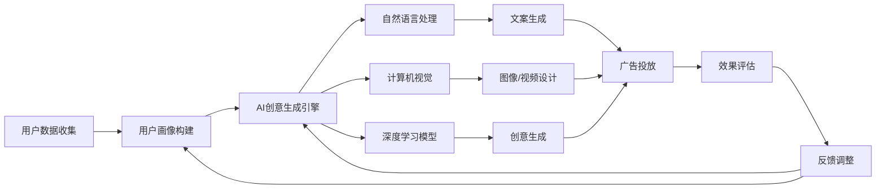

# AI在个性化广告创意生成中的应用

> 关键词：AI、个性化广告创意生成、用户画像、深度学习、自然语言处理、计算机视觉

> 摘要：本文深入探讨了AI在个性化广告创意生成中的应用。首先介绍了相关背景，包括目的范围、预期读者等内容。接着阐述了核心概念及联系，详细讲解了核心算法原理与操作步骤，并通过数学模型和公式进行理论支持。通过项目实战展示了代码实现与分析，探讨了实际应用场景。还推荐了学习工具和资源，最后总结了未来发展趋势与挑战，并提供了常见问题解答及参考资料，旨在为读者全面呈现AI在个性化广告创意生成领域的应用全貌。

## 1. 背景介绍 
### 1.1 目的和范围
在当今数字化时代，广告行业面临着越来越激烈的竞争，如何吸引消费者的注意力并提高广告的转化率成为了关键问题。传统的广告投放方式往往采用大规模的广播式传播，缺乏针对性，导致广告效果不佳。而个性化广告创意生成则能够根据用户的个性化特征和行为习惯，生成与之匹配的广告创意，从而提高广告的吸引力和效果。

本文的目的是全面介绍AI在个性化广告创意生成中的应用，包括核心概念、算法原理、数学模型、项目实战、实际应用场景等方面。范围涵盖了AI技术在广告创意生成过程中的各个环节，如用户画像构建、创意内容生成、视觉设计等。

### 1.2 预期读者
本文预期读者包括广告行业从业者，如广告策划师、创意设计师、营销人员等，他们可以从中了解如何利用AI技术提升广告创意的质量和效果；计算机科学领域的研究人员和开发者，他们可以关注AI算法在广告创意生成中的具体应用和实现；以及对AI和广告行业感兴趣的普通读者，帮助他们了解这一新兴领域的发展动态。

### 1.3 文档结构概述
本文将按照以下结构进行阐述：首先介绍相关背景知识，包括目的、预期读者和文档结构；接着讲解核心概念与联系，展示其原理和架构；然后详细介绍核心算法原理和具体操作步骤，并给出Python源代码；再通过数学模型和公式进行理论分析；之后进行项目实战，包括开发环境搭建、源代码实现和代码解读；探讨实际应用场景；推荐相关的学习工具和资源；最后总结未来发展趋势与挑战，提供常见问题解答和参考资料。

### 1.4 术语表
#### 1.4.1 核心术语定义
- **AI（Artificial Intelligence）**：人工智能，是一门研究如何使计算机能够模拟人类智能的学科，包括机器学习、深度学习、自然语言处理等技术。
- **个性化广告创意生成**：根据用户的个性化特征和行为习惯，利用AI技术生成与之匹配的广告创意内容。
- **用户画像**：通过收集和分析用户的各种数据，如人口统计学信息、行为数据、兴趣爱好等，构建出的用户模型，用于描述用户的特征和需求。
- **深度学习**：一种基于人工神经网络的机器学习方法，能够自动从大量数据中学习特征和模式。
- **自然语言处理（NLP）**：研究如何让计算机理解、处理和生成人类语言的技术。
- **计算机视觉（CV）**：研究如何让计算机理解和处理图像和视频的技术。

#### 1.4.2 相关概念解释
- **广告创意**：广告中具有吸引力和独特性的内容，包括文案、图像、视频等，旨在引起消费者的兴趣和购买欲望。
- **个性化推荐**：根据用户的个性化特征和历史行为，为用户推荐相关的产品、服务或内容。
- **生成对抗网络（GAN）**：一种深度学习模型，由生成器和判别器组成，用于生成逼真的数据。

#### 1.4.3 缩略词列表
- **AI**：Artificial Intelligence
- **NLP**：Natural Language Processing
- **CV**：Computer Vision
- **GAN**：Generative Adversarial Network

## 2. 核心概念与联系 
### 核心概念原理
AI在个性化广告创意生成中的核心原理是通过收集和分析用户的多源数据，构建用户画像，然后利用各种AI技术，如深度学习、自然语言处理和计算机视觉，根据用户画像生成个性化的广告创意。

用户画像构建是个性化广告创意生成的基础。通过收集用户在互联网上的各种行为数据，如浏览记录、购买记录、社交互动等，以及人口统计学信息，如年龄、性别、地域等，可以构建出用户的兴趣、偏好、需求等特征模型。

在广告创意生成方面，自然语言处理技术可以用于生成个性化的广告文案，根据用户的兴趣和需求，自动生成吸引人的文字内容。计算机视觉技术可以用于设计个性化的广告图像和视频，通过分析用户的视觉偏好，生成符合用户喜好的视觉元素。深度学习模型，如生成对抗网络（GAN），可以用于生成逼真的广告创意，使广告更具吸引力。

### 架构的文本示意图
```plaintext
用户数据收集 -> 用户画像构建 -> AI创意生成引擎
                                      |
                                      |-- 自然语言处理（文案生成）
                                      |-- 计算机视觉（图像/视频设计）
                                      |-- 深度学习模型（如GAN）
                                      |
广告投放与效果评估 -> 反馈调整用户画像和创意生成策略
```

### Mermaid流程图


## 3. 核心算法原理 & 具体操作步骤 
### 核心算法原理
#### 自然语言处理用于文案生成
在自然语言处理中，常用的文案生成算法是基于循环神经网络（RNN）及其变体，如长短期记忆网络（LSTM）和门控循环单元（GRU）。这些模型可以处理序列数据，通过学习大量的文本数据，能够生成自然流畅的文本。

以下是一个简单的基于LSTM的文本生成示例的Python代码：
```python
import numpy as np
import tensorflow as tf
from tensorflow.keras.preprocessing.text import Tokenizer
from tensorflow.keras.preprocessing.sequence import pad_sequences
from tensorflow.keras.models import Sequential
from tensorflow.keras.layers import Embedding, LSTM, Dense

# 示例文本数据
texts = ["This is an example sentence.", "Another example for text generation."]

# 分词
tokenizer = Tokenizer()
tokenizer.fit_on_texts(texts)
total_words = len(tokenizer.word_index) + 1

# 生成输入序列
input_sequences = []
for line in texts:
    token_list = tokenizer.texts_to_sequences([line])[0]
    for i in range(1, len(token_list)):
        n_gram_sequence = token_list[:i+1]
        input_sequences.append(n_gram_sequence)

# 填充序列
max_sequence_len = max([len(x) for x in input_sequences])
input_sequences = np.array(pad_sequences(input_sequences, maxlen=max_sequence_len, padding='pre'))

# 准备输入和标签
xs, labels = input_sequences[:,:-1], input_sequences[:,-1]
ys = tf.keras.utils.to_categorical(labels, num_classes=total_words)

# 构建模型
model = Sequential()
model.add(Embedding(total_words, 100, input_length=max_sequence_len-1))
model.add(LSTM(150))
model.add(Dense(total_words, activation='softmax'))
model.compile(loss='categorical_crossentropy', optimizer='adam', metrics=['accuracy'])

# 训练模型
model.fit(xs, ys, epochs=100, verbose=1)

# 生成文本
seed_text = "This is"
next_words = 3
for _ in range(next_words):
    token_list = tokenizer.texts_to_sequences([seed_text])[0]
    token_list = pad_sequences([token_list], maxlen=max_sequence_len-1, padding='pre')
    predicted = model.predict_classes(token_list, verbose=0)
    output_word = ""
    for word, index in tokenizer.word_index.items():
        if index == predicted:
            output_word = word
            break
    seed_text += " " + output_word

print(seed_text)
```
#### 计算机视觉用于图像设计
在计算机视觉中，卷积神经网络（CNN）是常用的模型。对于个性化图像设计，可以使用预训练的CNN模型，如VGG、ResNet等，提取图像的特征，然后根据用户的视觉偏好进行调整和生成。

以下是一个使用Keras加载预训练的VGG16模型进行图像特征提取的示例代码：
```python
from tensorflow.keras.applications.vgg16 import VGG16
from tensorflow.keras.preprocessing import image
from tensorflow.keras.applications.vgg16 import preprocess_input
import numpy as np

# 加载预训练的VGG16模型
model = VGG16(weights='imagenet', include_top=False)

# 加载图像
img_path = 'example.jpg'
img = image.load_img(img_path, target_size=(224, 224))
x = image.img_to_array(img)
x = np.expand_dims(x, axis=0)
x = preprocess_input(x)

# 提取特征
features = model.predict(x)
print(features.shape)
```
#### 生成对抗网络（GAN）用于创意生成
GAN由生成器和判别器组成。生成器尝试生成逼真的数据，判别器则尝试区分生成的数据和真实的数据。通过不断的对抗训练，生成器能够生成越来越逼真的数据。

以下是一个简单的GAN示例代码：
```python
import tensorflow as tf
from tensorflow.keras import layers
import numpy as np
import matplotlib.pyplot as plt

# 生成器模型
def make_generator_model():
    model = tf.keras.Sequential()
    model.add(layers.Dense(7*7*256, use_bias=False, input_shape=(100,)))
    model.add(layers.BatchNormalization())
    model.add(layers.LeakyReLU())

    model.add(layers.Reshape((7, 7, 256)))
    assert model.output_shape == (None, 7, 7, 256)

    model.add(layers.Conv2DTranspose(128, (5, 5), strides=(2, 2), padding='same', use_bias=False))
    assert model.output_shape == (None, 14, 14, 128)
    model.add(layers.BatchNormalization())
    model.add(layers.LeakyReLU())

    model.add(layers.Conv2DTranspose(64, (5, 5), strides=(2, 2), padding='same', use_bias=False))
    assert model.output_shape == (None, 28, 28, 64)
    model.add(layers.BatchNormalization())
    model.add(layers.LeakyReLU())

    model.add(layers.Conv2DTranspose(1, (5, 5), strides=(1, 1), padding='same', use_bias=False, activation='tanh'))
    assert model.output_shape == (None, 28, 28, 1)

    return model

# 判别器模型
def make_discriminator_model():
    model = tf.keras.Sequential()
    model.add(layers.Conv2D(64, (5, 5), strides=(2, 2), padding='same',
                                     input_shape=[28, 28, 1]))
    model.add(layers.LeakyReLU())
    model.add(layers.Dropout(0.3))

    model.add(layers.Conv2D(128, (5, 5), strides=(2, 2), padding='same'))
    model.add(layers.LeakyReLU())
    model.add(layers.Dropout(0.3))

    model.add(layers.Flatten())
    model.add(layers.Dense(1))

    return model

# 损失函数
cross_entropy = tf.keras.losses.BinaryCrossentropy(from_logits=True)

def discriminator_loss(real_output, fake_output):
    real_loss = cross_entropy(tf.ones_like(real_output), real_output)
    fake_loss = cross_entropy(tf.zeros_like(fake_output), fake_output)
    total_loss = real_loss + fake_loss
    return total_loss

def generator_loss(fake_output):
    return cross_entropy(tf.ones_like(fake_output), fake_output)

# 优化器
generator_optimizer = tf.keras.optimizers.Adam(1e-4)
discriminator_optimizer = tf.keras.optimizers.Adam(1e-4)

# 训练步骤
@tf.function
def train_step(images):
    noise = tf.random.normal([BATCH_SIZE, 100])

    with tf.GradientTape() as gen_tape, tf.GradientTape() as disc_tape:
        generated_images = generator(noise, training=True)

        real_output = discriminator(images, training=True)
        fake_output = discriminator(generated_images, training=True)

        gen_loss = generator_loss(fake_output)
        disc_loss = discriminator_loss(real_output, fake_output)

    gradients_of_generator = gen_tape.gradient(gen_loss, generator.trainable_variables)
    gradients_of_discriminator = disc_tape.gradient(disc_loss, discriminator.trainable_variables)

    generator_optimizer.apply_gradients(zip(gradients_of_generator, generator.trainable_variables))
    discriminator_optimizer.apply_gradients(zip(gradients_of_discriminator, discriminator.trainable_variables))

# 训练循环
def train(dataset, epochs):
    for epoch in range(epochs):
        for image_batch in dataset:
            train_step(image_batch)

# 加载数据
(train_images, _), (_, _) = tf.keras.datasets.mnist.load_data()
train_images = train_images.reshape(train_images.shape[0], 28, 28, 1).astype('float32')
train_images = (train_images - 127.5) / 127.5  # 归一化到 [-1, 1]

BUFFER_SIZE = 60000
BATCH_SIZE = 256

# 创建数据集
train_dataset = tf.data.Dataset.from_tensor_slices(train_images).shuffle(BUFFER_SIZE).batch(BATCH_SIZE)

# 创建模型
generator = make_generator_model()
discriminator = make_discriminator_model()

# 训练模型
EPOCHS = 50
train(train_dataset, EPOCHS)

# 生成图像
noise = tf.random.normal([1, 100])
generated_image = generator(noise, training=False)
plt.imshow(generated_image[0, :, :, 0], cmap='gray')
plt.show()
```

### 具体操作步骤
1. **数据收集**：收集用户的多源数据，包括行为数据、人口统计学信息等。
2. **用户画像构建**：对收集到的数据进行清洗和预处理，然后使用聚类、分类等算法构建用户画像。
3. **创意生成**：根据用户画像，选择合适的AI算法进行广告创意生成，如使用自然语言处理生成文案，使用计算机视觉设计图像，使用GAN生成创意。
4. **广告投放**：将生成的广告创意投放到合适的渠道，如社交媒体、搜索引擎等。
5. **效果评估**：通过点击率、转化率等指标评估广告的效果。
6. **反馈调整**：根据效果评估的结果，调整用户画像和创意生成策略，不断优化广告效果。

## 4. 数学模型和公式 & 详细讲解 & 举例说明 
### 自然语言处理中的数学模型
#### 词向量表示
在自然语言处理中，词向量是常用的表示方法。一种常见的词向量模型是Word2Vec，它基于神经网络，通过学习词的上下文信息来生成词向量。

Word2Vec有两种模型：连续词袋模型（CBOW）和跳字模型（Skip-gram）。

**CBOW模型**：CBOW模型的目标是根据上下文词预测中心词。假设上下文词的词向量分别为 $\mathbf{w}_1, \mathbf{w}_2, \cdots, \mathbf{w}_n$，中心词的词向量为 $\mathbf{w}_c$，则CBOW模型的输入是上下文词向量的平均值 $\mathbf{h}=\frac{1}{n}\sum_{i = 1}^{n}\mathbf{w}_i$，输出是中心词的概率分布 $P(w_c|\mathbf{h})$。

数学公式如下：
$$
\mathbf{h}=\frac{1}{n}\sum_{i = 1}^{n}\mathbf{w}_i
$$
$$
P(w_c|\mathbf{h})=\frac{\exp(\mathbf{w}_c^T\mathbf{h})}{\sum_{w\in V}\exp(\mathbf{w}^T\mathbf{h})}
$$
其中，$V$ 是词汇表，$\mathbf{w}^T$ 表示词向量的转置。

**Skip-gram模型**：Skip-gram模型的目标是根据中心词预测上下文词。假设中心词的词向量为 $\mathbf{w}_c$，上下文词的词向量为 $\mathbf{w}_i$，则Skip-gram模型的输入是中心词向量 $\mathbf{w}_c$，输出是上下文词的概率分布 $P(w_i|\mathbf{w}_c)$。

数学公式如下：
$$
P(w_i|\mathbf{w}_c)=\frac{\exp(\mathbf{w}_i^T\mathbf{w}_c)}{\sum_{w\in V}\exp(\mathbf{w}^T\mathbf{w}_c)}
$$

**举例说明**：假设我们有一个句子 “The quick brown fox jumps over the lazy dog”，如果使用CBOW模型，以 “brown” 为中心词，上下文词为 “The”、“quick”、“fox”、“jumps”，则先将这些上下文词转换为词向量，然后求平均值得到输入向量 $\mathbf{h}$，最后通过公式计算 “brown” 的概率分布。

#### 序列模型（LSTM）
LSTM是一种特殊的RNN，它能够解决长序列依赖问题。LSTM的核心是细胞状态 $\mathbf{C}_t$ 和三个门：输入门 $\mathbf{i}_t$、遗忘门 $\mathbf{f}_t$ 和输出门 $\mathbf{o}_t$。

数学公式如下：
$$
\mathbf{f}_t=\sigma(\mathbf{W}_f[\mathbf{h}_{t - 1}, \mathbf{x}_t]+\mathbf{b}_f)
$$
$$
\mathbf{i}_t=\sigma(\mathbf{W}_i[\mathbf{h}_{t - 1}, \mathbf{x}_t]+\mathbf{b}_i)
$$
$$
\tilde{\mathbf{C}}_t=\tanh(\mathbf{W}_C[\mathbf{h}_{t - 1}, \mathbf{x}_t]+\mathbf{b}_C)
$$
$$
\mathbf{C}_t=\mathbf{f}_t\odot\mathbf{C}_{t - 1}+\mathbf{i}_t\odot\tilde{\mathbf{C}}_t
$$
$$
\mathbf{o}_t=\sigma(\mathbf{W}_o[\mathbf{h}_{t - 1}, \mathbf{x}_t]+\mathbf{b}_o)
$$
$$
\mathbf{h}_t=\mathbf{o}_t\odot\tanh(\mathbf{C}_t)
$$
其中，$\sigma$ 是Sigmoid函数，$\tanh$ 是双曲正切函数，$\odot$ 表示逐元素相乘，$\mathbf{W}$ 是权重矩阵，$\mathbf{b}$ 是偏置向量，$\mathbf{x}_t$ 是输入向量，$\mathbf{h}_{t - 1}$ 是上一时刻的隐藏状态。

**举例说明**：在文本生成任务中，输入是一个词序列，每个词转换为词向量作为 $\mathbf{x}_t$ 输入到LSTM中，LSTM通过上述公式更新细胞状态和隐藏状态，最后根据隐藏状态生成下一个词的概率分布。

### 计算机视觉中的数学模型
#### 卷积神经网络（CNN）
CNN的核心是卷积层、池化层和全连接层。

**卷积层**：卷积层通过卷积核与输入图像进行卷积操作，提取图像的特征。假设输入图像为 $X$，卷积核为 $K$，则卷积操作的输出 $Y$ 可以表示为：
$$
Y_{i,j}=\sum_{m = 0}^{M - 1}\sum_{n = 0}^{N - 1}X_{i + m,j + n}K_{m,n}+b
$$
其中，$M$ 和 $N$ 是卷积核的大小，$b$ 是偏置。

**池化层**：池化层用于降低特征图的维度，常用的池化操作有最大池化和平均池化。以最大池化为例，假设输入特征图为 $X$，池化窗口大小为 $P\times P$，则最大池化的输出 $Y$ 可以表示为：
$$
Y_{i,j}=\max_{m = 0}^{P - 1}\max_{n = 0}^{P - 1}X_{iP + m,jP + n}
$$

**全连接层**：全连接层将卷积层和池化层提取的特征进行组合，用于分类或回归任务。假设输入向量为 $\mathbf{x}$，权重矩阵为 $\mathbf{W}$，偏置向量为 $\mathbf{b}$，则全连接层的输出 $\mathbf{y}$ 可以表示为：
$$
\mathbf{y}=\mathbf{W}\mathbf{x}+\mathbf{b}
$$

**举例说明**：在图像分类任务中，输入一张图像，通过卷积层提取图像的特征，如边缘、纹理等，然后通过池化层降低特征图的维度，最后通过全连接层将特征组合起来进行分类。

### 生成对抗网络（GAN）中的数学模型
GAN的目标是通过生成器 $G$ 和判别器 $D$ 的对抗训练，使生成器能够生成逼真的数据。

生成器的目标是最大化判别器将生成的数据判断为真实数据的概率，判别器的目标是最大化区分真实数据和生成数据的能力。

数学公式如下：
$$
\min_G\max_D V(D,G)=\mathbb{E}_{x\sim p_{data}(x)}[\log D(x)]+\mathbb{E}_{z\sim p_z(z)}[\log(1 - D(G(z)))]
$$
其中，$p_{data}(x)$ 是真实数据的分布，$p_z(z)$ 是噪声的分布，$x$ 是真实数据，$z$ 是噪声，$G(z)$ 是生成器生成的数据，$D(x)$ 是判别器对真实数据的判断结果，$D(G(z))$ 是判别器对生成数据的判断结果。

**举例说明**：在手写数字生成任务中，生成器以随机噪声为输入，生成手写数字图像，判别器则判断输入的图像是真实的手写数字图像还是生成的图像。通过不断的对抗训练，生成器能够生成越来越逼真的手写数字图像。

## 5. 项目实战：代码实际案例和详细解释说明 
### 5.1  开发环境搭建
#### 安装Python
首先需要安装Python，建议使用Python 3.7及以上版本。可以从Python官方网站（https://www.python.org/downloads/）下载安装包进行安装。

#### 安装深度学习框架
推荐使用TensorFlow和Keras进行深度学习开发。可以使用以下命令进行安装：
```sh
pip install tensorflow
```

#### 安装其他依赖库
还需要安装一些其他的依赖库，如NumPy、Pandas、Matplotlib等。可以使用以下命令进行安装：
```sh
pip install numpy pandas matplotlib
```

### 5.2  源代码详细实现和代码解读
#### 用户画像构建
以下是一个简单的用户画像构建示例代码：
```python
import pandas as pd

# 模拟用户数据
data = {
    'user_id': [1, 2, 3, 4, 5],
    'age': [25, 30, 22, 35, 28],
    'gender': ['M', 'F', 'M', 'F', 'M'],
    'purchase_amount': [100, 200, 50, 300, 150]
}

df = pd.DataFrame(data)

# 构建用户画像
user_profiles = []
for index, row in df.iterrows():
    profile = {
        'user_id': row['user_id'],
        'age_group': 'Young' if row['age'] < 30 else 'Old',
        'gender': row['gender'],
        'purchase_level': 'Low' if row['purchase_amount'] < 150 else 'High'
    }
    user_profiles.append(profile)

# 输出用户画像
for profile in user_profiles:
    print(profile)
```
**代码解读**：
- 首先，使用Pandas创建一个包含用户数据的DataFrame。
- 然后，遍历DataFrame的每一行，根据用户的年龄和购买金额进行分类，构建用户画像。
- 最后，输出用户画像。

#### 个性化广告文案生成
以下是一个基于LSTM的个性化广告文案生成示例代码：
```python
import numpy as np
import tensorflow as tf
from tensorflow.keras.preprocessing.text import Tokenizer
from tensorflow.keras.preprocessing.sequence import pad_sequences
from tensorflow.keras.models import Sequential
from tensorflow.keras.layers import Embedding, LSTM, Dense

# 示例文本数据
texts = [
    "For young men, our new sports shoes are very cool!",
    "For young women, our new dresses are very beautiful!",
    "For old men, our classic suits are very elegant!",
    "For old women, our comfortable coats are very warm!"
]

# 分词
tokenizer = Tokenizer()
tokenizer.fit_on_texts(texts)
total_words = len(tokenizer.word_index) + 1

# 生成输入序列
input_sequences = []
for line in texts:
    token_list = tokenizer.texts_to_sequences([line])[0]
    for i in range(1, len(token_list)):
        n_gram_sequence = token_list[:i+1]
        input_sequences.append(n_gram_sequence)

# 填充序列
max_sequence_len = max([len(x) for x in input_sequences])
input_sequences = np.array(pad_sequences(input_sequences, maxlen=max_sequence_len, padding='pre'))

# 准备输入和标签
xs, labels = input_sequences[:,:-1], input_sequences[:,-1]
ys = tf.keras.utils.to_categorical(labels, num_classes=total_words)

# 构建模型
model = Sequential()
model.add(Embedding(total_words, 100, input_length=max_sequence_len-1))
model.add(LSTM(150))
model.add(Dense(total_words, activation='softmax'))
model.compile(loss='categorical_crossentropy', optimizer='adam', metrics=['accuracy'])

# 训练模型
model.fit(xs, ys, epochs=100, verbose=1)

# 根据用户画像生成个性化文案
user_profile = {
    'age_group': 'Young',
    'gender': 'M'
}

seed_text = f"For {user_profile['age_group'].lower()} {user_profile['gender'].lower()},"
next_words = 5
for _ in range(next_words):
    token_list = tokenizer.texts_to_sequences([seed_text])[0]
    token_list = pad_sequences([token_list], maxlen=max_sequence_len-1, padding='pre')
    predicted = model.predict_classes(token_list, verbose=0)
    output_word = ""
    for word, index in tokenizer.word_index.items():
        if index == predicted:
            output_word = word
            break
    seed_text += " " + output_word

print(seed_text)
```
**代码解读**：
- 首先，定义示例文本数据，使用Tokenizer进行分词。
- 然后，生成输入序列并填充，准备输入和标签。
- 接着，构建LSTM模型并编译，训练模型。
- 最后，根据用户画像生成个性化的广告文案。

### 5.3  代码解读与分析
#### 用户画像构建代码分析
- 优点：代码简单易懂，使用Pandas可以方便地处理数据。通过对用户的年龄和购买金额进行分类，能够快速构建用户画像。
- 缺点：用户画像的构建比较简单，只考虑了年龄、性别和购买金额，没有考虑更多的用户特征。

#### 个性化广告文案生成代码分析
- 优点：使用LSTM模型能够学习文本的序列信息，生成自然流畅的文本。通过根据用户画像生成种子文本，能够实现个性化的文案生成。
- 缺点：训练数据较少，可能导致生成的文案质量不高。模型的泛化能力有限，对于未在训练数据中出现的词汇可能无法处理。

## 6. 实际应用场景 
### 社交媒体广告
在社交媒体平台上，如Facebook、Instagram等，用户的行为数据丰富，包括点赞、评论、分享等。通过收集和分析这些数据，可以构建用户画像，然后利用AI技术生成个性化的广告创意。例如，根据用户的兴趣爱好，生成与特定品牌、产品或活动相关的广告文案和图像，提高广告的点击率和转化率。

### 搜索引擎广告
搜索引擎广告，如Google Ads，用户在搜索时会表达出明确的需求。通过分析用户的搜索关键词和历史搜索记录，可以了解用户的意图和兴趣，从而生成个性化的广告创意。例如，当用户搜索“运动鞋”时，广告系统可以根据用户的年龄、性别、购买历史等信息，生成适合该用户的运动鞋广告，包括文案、图片和价格等信息。

### 电子邮件营销
在电子邮件营销中，通过收集用户的注册信息和历史交互数据，构建用户画像。然后根据用户画像生成个性化的电子邮件广告内容，如推荐用户可能感兴趣的产品、提供专属优惠等。个性化的电子邮件广告能够提高用户的打开率和点击率，增强用户与品牌的互动。

### 移动应用广告
移动应用中的广告可以根据用户的设备信息、使用行为和地理位置等数据，生成个性化的广告创意。例如，根据用户所在的地理位置，推送附近商家的优惠信息；根据用户的应用使用习惯，推荐相关的应用或服务。这样可以提高广告的相关性和吸引力，提升用户体验。

## 7. 工具和资源推荐
### 7.1 学习资源推荐
#### 7.1.1 书籍推荐
- 《深度学习》（Deep Learning）：由Ian Goodfellow、Yoshua Bengio和Aaron Courville撰写，是深度学习领域的经典教材，涵盖了深度学习的基本概念、算法和应用。
- 《Python自然语言处理实战》（Natural Language Processing with Python Cookbook）：介绍了使用Python进行自然语言处理的各种技术和方法，包括文本分类、情感分析、信息提取等。
- 《计算机视觉：算法与应用》（Computer Vision: Algorithms and Applications）：详细介绍了计算机视觉的基本算法和应用，如图像处理、特征提取、目标检测等。

#### 7.1.2 在线课程
- Coursera上的“深度学习专项课程”（Deep Learning Specialization）：由Andrew Ng教授授课，包括深度学习的基础、卷积神经网络、循环神经网络等内容。
- edX上的“自然语言处理基础”（Foundations of Natural Language Processing）：介绍了自然语言处理的基本概念和技术，如词法分析、句法分析、语义理解等。
- Udemy上的“计算机视觉大师课程”（Computer Vision Masterclass）：涵盖了计算机视觉的各个方面，从基础的图像处理到高级的深度学习应用。

#### 7.1.3 技术博客和网站
- Medium：有许多关于AI、机器学习和广告技术的优秀博客文章，如Towards Data Science、The AI Journal等。
- arXiv：提供了大量的学术论文，涵盖了AI领域的最新研究成果。
- Kaggle：一个数据科学竞赛平台，有许多关于AI和广告的数据集和解决方案可供学习。

### 7.2 开发工具框架推荐
#### 7.2.1 IDE和编辑器
- PyCharm：一款专业的Python集成开发环境，提供了代码编辑、调试、版本控制等功能，适合开发大型的Python项目。
- Jupyter Notebook：一种交互式的开发环境，支持Python、R等多种编程语言，方便进行数据探索和模型开发。
- Visual Studio Code：一款轻量级的代码编辑器，支持多种编程语言和插件，具有丰富的扩展功能。

#### 7.2.2 调试和性能分析工具
- TensorBoard：TensorFlow的可视化工具，用于监控模型的训练过程，如损失函数、准确率等指标的变化。
- Py-Spy：一个用于分析Python代码性能的工具，可以找出代码中的性能瓶颈。
- NVIDIA Nsight Systems：用于GPU性能分析的工具，帮助优化深度学习模型在GPU上的运行效率。

#### 7.2.3 相关框架和库
- TensorFlow：一个开源的深度学习框架，提供了丰富的工具和API，支持各种深度学习模型的开发和训练。
- PyTorch：另一个流行的深度学习框架，具有动态图和简洁的API，适合快速开发和实验。
- Scikit-learn：一个用于机器学习的Python库，提供了各种机器学习算法和工具，如分类、回归、聚类等。

### 7.3 相关论文著作推荐
#### 7.3.1 经典论文
- “Generative Adversarial Nets”：由Ian Goodfellow等人发表，首次提出了生成对抗网络（GAN）的概念。
- “Long Short-Term Memory”：由Sepp Hochreiter和Jürgen Schmidhuber发表，介绍了长短期记忆网络（LSTM）的原理和应用。
- “Efficient Estimation of Word Representations in Vector Space”：由Tomas Mikolov等人发表，提出了Word2Vec模型，用于词向量的学习。

#### 7.3.2 最新研究成果
- 关注顶级学术会议，如NeurIPS、ICML、CVPR等，这些会议上会发表AI领域的最新研究成果。
- 关注知名学术期刊，如Journal of Artificial Intelligence Research（JAIR）、Artificial Intelligence等，这些期刊上会刊登高质量的学术论文。

#### 7.3.3 应用案例分析
- 可以参考一些知名公司的技术博客，如Google AI Blog、Facebook AI Research等，了解他们在AI和广告领域的应用案例和实践经验。
- 一些行业报告和研究机构的分析文章也会提供有关AI在广告创意生成中的应用案例和效果评估。

## 8. 总结：未来发展趋势与挑战
### 未来发展趋势
#### 多模态融合
未来的个性化广告创意生成将不仅仅局限于文本和图像，还将融合音频、视频等多种模态。通过多模态融合，可以生成更加丰富、生动的广告创意，提高广告的吸引力和用户体验。

#### 实时生成
随着计算能力的提升和算法的优化，广告创意生成将实现实时化。在用户与广告接触的瞬间，根据用户的实时行为和上下文信息，生成个性化的广告创意，提高广告的及时性和相关性。

#### 与虚拟现实（VR）和增强现实（AR）结合
VR和AR技术为广告创意生成带来了新的机遇。通过将AI与VR/AR技术结合，可以创建沉浸式的广告体验，让用户更加身临其境地感受广告内容，增强广告的影响力。

#### 跨平台和跨设备适配
用户在不同的平台和设备上浏览广告，因此广告创意需要能够自适应不同的屏幕尺寸和分辨率。未来的AI技术将能够自动生成适合不同平台和设备的广告创意，提高广告的兼容性和效果。

### 挑战
#### 数据隐私和安全
个性化广告创意生成需要收集和分析大量的用户数据，这涉及到用户的隐私和数据安全问题。如何在保护用户隐私的前提下，合法、合规地收集和使用数据，是一个亟待解决的问题。

#### 创意质量和创新性
虽然AI可以生成大量的广告创意，但创意的质量和创新性仍然是一个挑战。如何让AI生成的广告创意具有独特性和吸引力，能够真正打动消费者，需要进一步的研究和探索。

#### 算法解释性和可解释性
深度学习等AI算法往往是黑盒模型，难以解释其决策过程和生成的创意的合理性。在广告领域，需要能够解释AI生成的广告创意的原因和依据，以便广告主和监管机构进行评估和监管。

#### 技术成本和人才短缺
AI技术的研发和应用需要大量的计算资源和专业人才。对于一些小型广告公司和企业来说，技术成本可能过高，同时，AI领域的专业人才也相对短缺，这限制了AI在个性化广告创意生成中的广泛应用。

## 9. 附录：常见问题与解答
### 1. AI生成的广告创意是否能够替代人类创意？
目前，AI生成的广告创意还不能完全替代人类创意。虽然AI可以快速生成大量的创意，但在创意的独特性、情感表达和对复杂文化背景的理解方面，人类创意仍然具有优势。AI可以作为人类创意的辅助工具，帮助创意人员提高效率和拓展思路。

### 2. 如何评估AI生成的广告创意的效果？
可以通过多种指标来评估AI生成的广告创意的效果，如点击率、转化率、曝光量、用户反馈等。同时，还可以进行A/B测试，将AI生成的广告创意与传统的广告创意进行对比，评估其优劣。

### 3. AI在个性化广告创意生成中需要多少数据？
数据量的需求取决于具体的应用场景和算法。一般来说，数据量越大，AI模型的学习效果越好，生成的广告创意也越准确和个性化。但同时也需要注意数据的质量和多样性，避免数据偏差和过拟合问题。

### 4. 如何解决AI生成的广告创意的版权问题？
目前，关于AI生成的作品的版权问题还存在争议。一种观点认为，AI只是工具，其生成的作品的版权应归属于使用AI的用户或企业；另一种观点认为，需要制定专门的法律和政策来规范AI生成作品的版权归属。在实际应用中，建议在使用AI生成广告创意时，明确版权归属，并遵守相关的法律法规。

## 10. 扩展阅读 & 参考资料
- 《AI营销：从算法到实战》
- 《广告创意学》
- 相关学术论文：“Personalized Advertising using Deep Learning”、“AI-driven Creative Generation for Advertising”等
- 行业报告：如艾瑞咨询、易观智库等发布的关于AI和广告行业的研究报告

作者：AI天才研究院/AI Genius Institute & 禅与计算机程序设计艺术 /Zen And The Art of Computer Programming