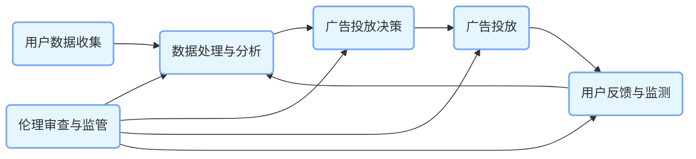

# AI在个性化广告投放策略中的实时优化与伦理考量

> 关键词：AI、个性化广告投放、实时优化、伦理考量、数据隐私

> 摘要：本文深入探讨了AI在个性化广告投放策略中的实时优化与伦理考量问题。首先介绍了研究的背景、目的、预期读者等内容，接着阐述了核心概念及联系，详细讲解了相关核心算法原理和操作步骤，引入了数学模型和公式并举例说明。通过项目实战展示了代码实现和分析，探讨了实际应用场景，推荐了相关工具和资源。最后总结了未来发展趋势与挑战，解答了常见问题并提供了扩展阅读和参考资料。旨在为读者全面呈现AI在个性化广告投放领域的技术原理、应用实践以及需要关注的伦理问题。

## 1. 背景介绍 
### 1.1 目的和范围
随着互联网和移动设备的普及，广告市场面临着巨大的变革。传统的广告投放方式难以精准触达目标受众，导致广告效果不佳和资源浪费。AI技术的出现为个性化广告投放带来了新的机遇。本文章的目的在于深入研究AI如何实现个性化广告投放策略的实时优化，同时探讨其中涉及的伦理问题。范围涵盖了AI在广告投放中的核心算法、数学模型、实际应用场景，以及与之相关的伦理考量和数据隐私保护等方面。

### 1.2 预期读者
本文预期读者包括广告行业从业者，如广告策划师、营销人员等，他们可以从中了解如何利用AI技术提升广告投放效果；计算机科学领域的专业人士，如程序员、算法工程师等，能够获取相关算法和技术实现的细节；同时也适合对AI伦理和数据隐私感兴趣的研究人员和普通读者，帮助他们了解AI在广告领域应用中可能带来的社会影响。

### 1.3 文档结构概述
本文首先介绍背景信息，让读者了解研究的目的和范围。接着阐述核心概念及联系，包括AI、个性化广告投放、实时优化等概念的原理和架构。然后详细讲解核心算法原理和具体操作步骤，结合Python代码进行说明。引入数学模型和公式，并通过举例加深理解。通过项目实战展示代码的实际应用和分析。探讨实际应用场景，为读者呈现AI在个性化广告投放中的具体应用。推荐相关的工具和资源，帮助读者进一步学习和研究。最后总结未来发展趋势与挑战，解答常见问题并提供扩展阅读和参考资料。

### 1.4 术语表
#### 1.4.1 核心术语定义
- **AI（Artificial Intelligence）**：人工智能，是指计算机系统能够执行通常需要人类智能才能完成的任务，如学习、推理、决策等。
- **个性化广告投放**：根据用户的个人特征、行为、兴趣等信息，为用户提供量身定制的广告内容，以提高广告的相关性和效果。
- **实时优化**：在广告投放过程中，根据实时数据和反馈，动态调整广告投放策略，以实现最佳的广告效果。
- **伦理考量**：在AI应用中，需要考虑道德、法律、社会等方面的因素，确保技术的使用符合人类的价值观和利益。
- **数据隐私**：指用户对自己个人数据的控制权和保护权，防止个人数据被非法获取、使用和泄露。

#### 1.4.2 相关概念解释
- **机器学习**：是AI的一个重要分支，通过让计算机从数据中学习模式和规律，从而实现预测和决策。在个性化广告投放中，机器学习算法可以用于分析用户数据，预测用户的兴趣和行为。
- **深度学习**：是一种基于人工神经网络的机器学习技术，能够处理复杂的非线性数据。在广告投放中，深度学习可以用于图像识别、自然语言处理等任务，提高广告的创意和效果。
- **推荐系统**：是一种根据用户的历史行为和偏好，为用户推荐相关物品或内容的系统。在个性化广告投放中，推荐系统可以用于选择合适的广告素材和投放渠道。

#### 1.4.3 缩略词列表
- **AI**：Artificial Intelligence（人工智能）
- **ML**：Machine Learning（机器学习）
- **DL**：Deep Learning（深度学习）
- **RTB**：Real - Time Bidding（实时竞价）

## 2. 核心概念与联系 

### 核心概念原理
#### AI在个性化广告投放中的原理
AI在个性化广告投放中的核心原理是通过收集和分析大量的用户数据，建立用户画像，然后根据用户画像为用户推荐个性化的广告。具体来说，AI系统会从多个渠道收集用户数据，如网站浏览记录、搜索记录、社交媒体活动等。然后使用机器学习和深度学习算法对这些数据进行分析，提取用户的特征和兴趣，建立用户画像。最后，根据用户画像和广告投放目标，选择合适的广告素材和投放渠道，将广告推送给目标用户。

#### 实时优化的原理
实时优化的原理是在广告投放过程中，不断收集和分析实时数据，根据数据反馈动态调整广告投放策略。例如，通过实时监测广告的展示量、点击量、转化率等指标，AI系统可以判断广告的效果，并根据效果调整广告的投放时间、投放地点、投放对象等参数，以提高广告的效果和ROI（投资回报率）。

#### 伦理考量的原理
伦理考量在AI个性化广告投放中是为了确保技术的使用符合道德、法律和社会的要求。在收集和使用用户数据时，需要遵循数据隐私原则，获得用户的明确授权，保护用户的个人信息安全。同时，广告内容应该真实、准确，不得误导和欺骗用户。此外，还需要避免因个性化广告投放导致的信息茧房和歧视等问题。

### 架构的文本示意图
```plaintext
用户数据收集层：从网站、APP、社交媒体等多渠道收集用户的浏览记录、搜索记录、购买行为等数据。
数据处理与分析层：对收集到的原始数据进行清洗、预处理，然后使用机器学习和深度学习算法进行分析，建立用户画像和广告效果预测模型。
广告投放决策层：根据用户画像和广告投放目标，选择合适的广告素材和投放渠道，使用实时优化算法动态调整投放策略。
用户反馈与监测层：实时监测广告的展示量、点击量、转化率等指标，收集用户的反馈信息，将数据反馈给数据处理与分析层进行模型更新和策略优化。
伦理审查与监管层：对整个广告投放过程进行伦理审查和监管，确保数据使用符合隐私保护原则，广告内容真实合法。
```

### Mermaid流程图


## 3. 核心算法原理 & 具体操作步骤 

### 核心算法原理
#### 协同过滤算法
协同过滤算法是一种常用的推荐算法，分为基于用户的协同过滤和基于物品的协同过滤。基于用户的协同过滤算法通过找到与目标用户兴趣相似的其他用户，然后将这些用户喜欢的物品推荐给目标用户。基于物品的协同过滤算法则是通过找到与目标物品相似的其他物品，然后将这些物品推荐给喜欢目标物品的用户。

以下是基于用户的协同过滤算法的Python代码示例：
```python
import numpy as np

def user_similarity(user_item_matrix):
    """
    计算用户之间的相似度
    :param user_item_matrix: 用户-物品矩阵
    :return: 用户相似度矩阵
    """
    num_users = user_item_matrix.shape[0]
    similarity_matrix = np.zeros((num_users, num_users))
    for i in range(num_users):
        for j in range(num_users):
            if i == j:
                similarity_matrix[i][j] = 0
            else:
                intersection = np.sum(user_item_matrix[i] * user_item_matrix[j])
                norm_i = np.sqrt(np.sum(user_item_matrix[i] ** 2))
                norm_j = np.sqrt(np.sum(user_item_matrix[j] ** 2))
                similarity_matrix[i][j] = intersection / (norm_i * norm_j)
    return similarity_matrix

def recommend_items(user_item_matrix, user_id, similarity_matrix, top_n):
    """
    为指定用户推荐物品
    :param user_item_matrix: 用户-物品矩阵
    :param user_id: 用户ID
    :param similarity_matrix: 用户相似度矩阵
    :param top_n: 推荐物品的数量
    :return: 推荐物品的列表
    """
    num_items = user_item_matrix.shape[1]
    user_similarity = similarity_matrix[user_id]
    user_items = user_item_matrix[user_id]
    scores = np.zeros(num_items)
    for item_id in range(num_items):
        if user_items[item_id] == 0:
            score = 0
            for other_user_id in range(user_item_matrix.shape[0]):
                if user_item_matrix[other_user_id][item_id] == 1:
                    score += user_similarity[other_user_id]
            scores[item_id] = score
    sorted_indices = np.argsort(scores)[::-1]
    recommended_items = sorted_indices[:top_n]
    return recommended_items

# 示例数据
user_item_matrix = np.array([
    [1, 1, 0, 0],
    [1, 0, 1, 0],
    [0, 1, 1, 0],
    [0, 0, 1, 1]
])

# 计算用户相似度
similarity_matrix = user_similarity(user_item_matrix)

# 为用户0推荐物品
user_id = 0
top_n = 2
recommended_items = recommend_items(user_item_matrix, user_id, similarity_matrix, top_n)
print(f"为用户{user_id}推荐的物品ID: {recommended_items}")
```

#### 深度学习算法
深度学习算法在个性化广告投放中也有广泛的应用，如使用卷积神经网络（CNN）进行图像广告的创意优化，使用循环神经网络（RNN）或长短时记忆网络（LSTM）处理用户的序列行为数据。以简单的多层感知机（MLP）为例，以下是使用Python和Keras库实现的代码示例：
```python
from keras.models import Sequential
from keras.layers import Dense
import numpy as np

# 生成示例数据
X = np.random.rand(100, 10)
y = np.random.randint(0, 2, 100)

# 构建模型
model = Sequential()
model.add(Dense(12, input_dim=10, activation='relu'))
model.add(Dense(8, activation='relu'))
model.add(Dense(1, activation='sigmoid'))

# 编译模型
model.compile(loss='binary_crossentropy', optimizer='adam', metrics=['accuracy'])

# 训练模型
model.fit(X, y, epochs=10, batch_size=10)

# 预测
predictions = model.predict(X)
print(predictions)
```

### 具体操作步骤
1. **数据收集**：从多个数据源收集用户的行为数据，如网站日志、APP使用记录、社交媒体数据等。
2. **数据预处理**：对收集到的原始数据进行清洗、去重、归一化等操作，将数据转换为适合算法处理的格式。
3. **特征工程**：从预处理后的数据中提取有用的特征，如用户的年龄、性别、兴趣爱好、消费习惯等。
4. **模型训练**：使用收集到的数据和提取的特征，训练协同过滤、深度学习等模型。
5. **模型评估**：使用测试数据对训练好的模型进行评估，计算模型的准确率、召回率、F1值等指标，评估模型的性能。
6. **广告投放决策**：根据训练好的模型和实时数据，选择合适的广告素材和投放渠道，进行广告投放。
7. **实时优化**：在广告投放过程中，实时监测广告的效果，根据反馈数据动态调整广告投放策略，如调整投放时间、投放地点、投放对象等。

## 4. 数学模型和公式 & 详细讲解 & 举例说明 

### 协同过滤算法的数学模型和公式
#### 基于用户的协同过滤
- **相似度计算**：常用的相似度计算方法是余弦相似度，公式如下：
$$sim(u, v)=\frac{\sum_{i\in I_{u}\cap I_{v}}r_{ui}r_{vi}}{\sqrt{\sum_{i\in I_{u}}r_{ui}^{2}}\sqrt{\sum_{i\in I_{v}}r_{vi}^{2}}}$$
其中，$u$ 和 $v$ 表示两个用户，$I_{u}$ 和 $I_{v}$ 分别表示用户 $u$ 和 $v$ 交互过的物品集合，$r_{ui}$ 表示用户 $u$ 对物品 $i$ 的评分。

- **推荐得分计算**：对于目标用户 $u$ 和物品 $i$，推荐得分的计算公式为：
$$score(u, i)=\sum_{v\in N(u)}sim(u, v)r_{vi}$$
其中，$N(u)$ 表示与用户 $u$ 兴趣相似的用户集合。

#### 举例说明
假设有三个用户 $u_1$、$u_2$、$u_3$ 和四个物品 $i_1$、$i_2$、$i_3$、$i_4$，用户-物品评分矩阵如下：
| 用户 \ 物品 | $i_1$ | $i_2$ | $i_3$ | $i_4$ |
| --- | --- | --- | --- | --- |
| $u_1$ | 5 | 3 | 0 | 0 |
| $u_2$ | 4 | 0 | 3 | 0 |
| $u_3$ | 0 | 3 | 4 | 0 |

计算用户 $u_1$ 和 $u_2$ 的余弦相似度：
$$sim(u_1, u_2)=\frac{5\times4 + 3\times0}{\sqrt{5^2 + 3^2}\sqrt{4^2 + 3^2}}=\frac{20}{\sqrt{34}\sqrt{25}}\approx0.69$$

假设要为用户 $u_1$ 推荐物品 $i_3$，用户 $u_2$ 和 $u_3$ 与 $u_1$ 的相似度分别为 $sim(u_1, u_2)=0.69$，$sim(u_1, u_3)=0.47$，$u_2$ 对 $i_3$ 的评分为 3，$u_3$ 对 $i_3$ 的评分为 4，则推荐得分：
$$score(u_1, i_3)=0.69\times3 + 0.47\times4 = 2.07 + 1.88 = 3.95$$

### 深度学习算法的数学模型和公式
#### 多层感知机（MLP）
- **前向传播**：对于一个具有 $L$ 层的MLP，第 $l$ 层的输出 $a^{(l)}$ 计算公式为：
$$a^{(l)} = f(W^{(l)}a^{(l - 1)} + b^{(l)})$$
其中，$W^{(l)}$ 是第 $l$ 层的权重矩阵，$b^{(l)}$ 是第 $l$ 层的偏置向量，$f$ 是激活函数，如ReLU、Sigmoid等。

- **损失函数**：常用的损失函数是交叉熵损失函数，对于二分类问题，公式如下：
$$L(y, \hat{y}) = -[y\log(\hat{y})+(1 - y)\log(1 - \hat{y})]$$
其中，$y$ 是真实标签，$\hat{y}$ 是模型的预测输出。

#### 举例说明
假设有一个简单的MLP，输入层有 2 个神经元，隐藏层有 3 个神经元，输出层有 1 个神经元。输入向量 $x = [1, 2]$，权重矩阵 $W^{(1)}=\begin{bmatrix}0.1 & 0.2\\0.3 & 0.4\\0.5 & 0.6\end{bmatrix}$，偏置向量 $b^{(1)} = [0.1, 0.2, 0.3]$，激活函数使用ReLU，即 $f(x)=\max(0, x)$。

计算隐藏层的输入 $z^{(1)}$：
$$z^{(1)} = W^{(1)}x + b^{(1)}=\begin{bmatrix}0.1 & 0.2\\0.3 & 0.4\\0.5 & 0.6\end{bmatrix}\begin{bmatrix}1\\2\end{bmatrix}+\begin{bmatrix}0.1\\0.2\\0.3\end{bmatrix}=\begin{bmatrix}0.1\times1 + 0.2\times2 + 0.1\\0.3\times1 + 0.4\times2 + 0.2\\0.5\times1 + 0.6\times2 + 0.3\end{bmatrix}=\begin{bmatrix}0.6\\1.3\\2\end{bmatrix}$$

计算隐藏层的输出 $a^{(1)}$：
$$a^{(1)} = f(z^{(1)})=\begin{bmatrix}\max(0, 0.6)\\\max(0, 1.3)\\\max(0, 2)\end{bmatrix}=\begin{bmatrix}0.6\\1.3\\2\end{bmatrix}$$

假设输出层的权重矩阵 $W^{(2)} = [0.1, 0.2, 0.3]$，偏置向量 $b^{(2)} = 0.1$，激活函数使用Sigmoid，即 $f(x)=\frac{1}{1 + e^{-x}}$。

计算输出层的输入 $z^{(2)}$：
$$z^{(2)} = W^{(2)}a^{(1)} + b^{(2)} = 0.1\times0.6 + 0.2\times1.3 + 0.3\times2 + 0.1 = 0.6 + 0.26 + 0.6 + 0.1 = 1.56$$

计算输出层的输出 $\hat{y}$：
$$\hat{y} = f(z^{(2)})=\frac{1}{1 + e^{-1.56}}\approx0.83$$

假设真实标签 $y = 1$，则交叉熵损失：
$$L(y, \hat{y}) = -[1\times\log(0.83)+(1 - 1)\times\log(1 - 0.83)]=-\log(0.83)\approx0.19$$

## 5. 项目实战：代码实际案例和详细解释说明 

### 5.1  开发环境搭建
#### 操作系统
可以选择Windows、Linux（如Ubuntu）或macOS等操作系统。

#### Python环境
安装Python 3.x版本，建议使用Anaconda来管理Python环境。可以从Anaconda官网（https://www.anaconda.com/products/individual）下载适合自己操作系统的安装包，按照安装向导进行安装。

#### 安装必要的库
使用以下命令安装所需的Python库：
```bash
pip install numpy pandas scikit-learn keras tensorflow
```

### 5.2  源代码详细实现和代码解读
以下是一个基于协同过滤算法的个性化广告推荐系统的完整代码示例：
```python
import numpy as np
import pandas as pd
from sklearn.metrics.pairwise import cosine_similarity

# 生成示例数据
data = {
    'user_id': [1, 1, 2, 2, 3, 3],
    'ad_id': [101, 102, 101, 103, 102, 103],
    'click': [1, 1, 1, 1, 1, 1]
}
df = pd.DataFrame(data)

# 创建用户-广告矩阵
user_ad_matrix = df.pivot(index='user_id', columns='ad_id', values='click').fillna(0)

# 计算用户相似度矩阵
user_similarity_matrix = cosine_similarity(user_ad_matrix)

# 为指定用户推荐广告
def recommend_ads(user_id, user_similarity_matrix, user_ad_matrix, top_n=2):
    user_index = user_ad_matrix.index.tolist().index(user_id)
    similar_users = np.argsort(user_similarity_matrix[user_index])[::-1][1:top_n + 1]
    user_ads = user_ad_matrix.iloc[user_index]
    recommended_ads = []
    for similar_user_index in similar_users:
        similar_user_ads = user_ad_matrix.iloc[similar_user_index]
        new_ads = similar_user_ads[similar_user_ads == 1][user_ads == 0].index.tolist()
        recommended_ads.extend(new_ads)
    return recommended_ads

# 为用户1推荐广告
user_id = 1
recommended_ads = recommend_ads(user_id, user_similarity_matrix, user_ad_matrix)
print(f"为用户{user_id}推荐的广告ID: {recommended_ads}")
```

### 代码解读与分析
1. **数据生成**：使用`pandas`库生成示例数据，包含用户ID、广告ID和点击信息。
2. **用户-广告矩阵创建**：使用`pivot`方法将数据转换为用户-广告矩阵，矩阵中的元素表示用户是否点击过该广告。
3. **用户相似度计算**：使用`sklearn`库中的`cosine_similarity`函数计算用户之间的余弦相似度，得到用户相似度矩阵。
4. **广告推荐函数**：定义`recommend_ads`函数，根据用户相似度矩阵和用户-广告矩阵，为指定用户推荐未点击过的广告。
5. **推荐结果输出**：调用`recommend_ads`函数为用户1推荐广告，并输出推荐结果。

通过这个项目实战，我们可以看到如何使用协同过滤算法实现一个简单的个性化广告推荐系统。在实际应用中，还可以根据需要进行扩展和优化，如使用更复杂的算法、处理大规模数据等。

## 6. 实际应用场景 
### 电商平台
在电商平台上，AI个性化广告投放可以根据用户的浏览历史、购买记录、收藏偏好等信息，为用户推荐个性化的商品广告。例如，当用户在电商平台上浏览了一款手机，平台可以实时推送相关的手机配件、手机评测等广告，提高用户的购买转化率。同时，通过实时优化广告投放策略，根据用户的实时行为和市场动态，调整广告的投放时间、投放渠道和投放内容，提高广告的效果和投资回报率。

### 社交媒体平台
社交媒体平台拥有大量的用户数据，AI可以利用这些数据实现个性化广告投放。例如，根据用户的社交关系、兴趣爱好、地理位置等信息，为用户推送符合其兴趣的广告。同时，社交媒体平台可以实时监测用户的互动行为，如点赞、评论、分享等，根据这些反馈信息实时优化广告投放策略。例如，如果某个广告的互动率较低，平台可以及时调整广告的投放范围或内容，提高广告的吸引力。

### 视频平台
视频平台可以根据用户的观看历史、收藏列表、搜索记录等信息，为用户推荐个性化的视频广告。例如，当用户观看了一部科幻电影，平台可以推送相关的科幻电影预告片、科幻周边产品广告等。在广告投放过程中，视频平台可以实时监测用户的观看行为，如是否跳过广告、观看时长等，根据这些数据实时优化广告投放策略，提高广告的观看率和效果。

### 金融服务行业
在金融服务行业，AI个性化广告投放可以根据用户的财务状况、投资偏好、风险承受能力等信息，为用户推荐个性化的金融产品广告。例如，对于风险偏好较高的用户，可以推送股票、基金等投资产品广告；对于风险偏好较低的用户，可以推送债券、储蓄等稳健型金融产品广告。同时，金融机构可以实时监测市场动态和用户的财务状况变化，根据这些信息实时调整广告投放策略，为用户提供更合适的金融产品推荐。

## 7. 工具和资源推荐
### 7.1 学习资源推荐
#### 7.1.1 书籍推荐
- 《人工智能：一种现代的方法》（Artificial Intelligence: A Modern Approach）：这本书是人工智能领域的经典教材，全面介绍了人工智能的各个方面，包括搜索算法、知识表示、机器学习、自然语言处理等。
- 《深度学习》（Deep Learning）：由Ian Goodfellow、Yoshua Bengio和Aaron Courville三位深度学习领域的专家撰写，详细介绍了深度学习的基本原理、算法和应用。
- 《推荐系统实践》：由项亮编写，系统介绍了推荐系统的基本概念、算法和实践案例，对于学习个性化广告推荐系统有很大的帮助。

#### 7.1.2 在线课程
- Coursera上的“机器学习”课程（Machine Learning）：由斯坦福大学的Andrew Ng教授授课，是机器学习领域的经典课程，涵盖了机器学习的基本算法和应用。
- edX上的“深度学习专项课程”（Deep Learning Specialization）：由深度学习领域的专家授课，包括深度学习基础、卷积神经网络、循环神经网络等内容。
- 网易云课堂上的“人工智能实战”课程：结合实际项目，介绍人工智能在各个领域的应用，包括个性化广告投放。

#### 7.1.3 技术博客和网站
- Medium：一个技术博客平台，有很多关于AI、机器学习、深度学习等领域的优质文章。
- Towards Data Science：专注于数据科学和机器学习领域的博客，提供了很多实用的技术文章和案例分析。
- AI Stack Exchange：一个问答社区，用户可以在这里提问和交流关于AI的技术问题。

### 7.2 开发工具框架推荐
#### 7.2.1 IDE和编辑器
- PyCharm：一款专业的Python集成开发环境，提供了代码编辑、调试、版本控制等功能，适合开发Python项目。
- Jupyter Notebook：一个交互式的开发环境，可以在浏览器中编写和运行代码，支持多种编程语言，非常适合数据探索和模型实验。
- Visual Studio Code：一款轻量级的代码编辑器，支持多种编程语言和插件扩展，具有丰富的代码编辑和调试功能。

#### 7.2.2 调试和性能分析工具
- TensorBoard：TensorFlow的可视化工具，可以用于可视化模型的训练过程、损失函数变化、模型结构等，帮助开发者调试和优化模型。
- Py-Spy：一个用于分析Python程序性能的工具，可以实时监测Python程序的CPU使用率、函数调用时间等信息，帮助开发者找出性能瓶颈。
- cProfile：Python标准库中的性能分析工具，可以统计Python程序中各个函数的调用次数、执行时间等信息，帮助开发者优化代码性能。

#### 7.2.3 相关框架和库
- TensorFlow：一个开源的深度学习框架，由Google开发，提供了丰富的深度学习模型和工具，支持分布式训练和部署。
- PyTorch：另一个流行的深度学习框架，由Facebook开发，具有动态图的特点，易于使用和调试，在学术界和工业界都有广泛的应用。
- Scikit-learn：一个用于机器学习的Python库，提供了各种机器学习算法和工具，如分类、回归、聚类等，适合初学者快速上手。

### 7.3 相关论文著作推荐
#### 7.3.1 经典论文
- “Item-based Collaborative Filtering Recommendation Algorithms”：介绍了基于物品的协同过滤算法，是推荐系统领域的经典论文。
- “Deep Residual Learning for Image Recognition”：提出了残差网络（ResNet），解决了深度学习中的梯度消失问题，在图像识别领域取得了巨大的成功。
- “Attention Is All You Need”：提出了Transformer模型，在自然语言处理领域引起了巨大的变革。

#### 7.3.2 最新研究成果
- 可以关注顶级学术会议如NeurIPS（神经信息处理系统大会）、ICML（国际机器学习会议）、KDD（知识发现与数据挖掘会议）等的最新论文，了解AI在个性化广告投放领域的最新研究进展。

#### 7.3.3 应用案例分析
- 可以查阅一些知名企业的技术博客和研究报告，如Google、Facebook、阿里巴巴等，了解他们在个性化广告投放方面的实践经验和应用案例。

## 8. 总结：未来发展趋势与挑战
### 未来发展趋势
#### 更精准的个性化推荐
随着AI技术的不断发展，未来的个性化广告投放将能够更精准地捕捉用户的兴趣和需求。通过融合多源数据，如用户的生理数据、环境数据等，进一步完善用户画像，实现更加个性化的广告推荐。例如，结合用户的健康数据，为关注健康的用户推送健康食品、健身器材等广告。

#### 实时交互与动态广告
未来的广告将不再是静态的展示，而是具有实时交互性。用户可以与广告进行实时互动，如参与游戏、填写问卷等。同时，广告内容也将根据用户的实时反馈进行动态调整，提高广告的吸引力和参与度。例如，在用户与广告互动的过程中，实时推荐相关的产品或服务。

#### 跨平台整合
随着用户在多个平台上的活动日益频繁，未来的个性化广告投放将实现跨平台整合。广告主可以通过统一的平台管理和投放广告，实现用户在不同平台上的无缝体验。例如，用户在手机上浏览了一款产品的广告，在电脑上也能收到相关的广告推荐。

#### 伦理与合规的重视
随着AI在广告领域的广泛应用，伦理和合规问题将越来越受到重视。未来的广告投放将更加注重用户的隐私保护和数据安全，遵守相关的法律法规和道德准则。同时，行业也将建立更加完善的监管机制，确保AI广告的公平、公正和透明。

### 挑战
#### 数据隐私和安全问题
个性化广告投放需要收集和分析大量的用户数据，这带来了数据隐私和安全的挑战。如何在保护用户隐私的前提下，合理利用用户数据进行广告投放，是一个亟待解决的问题。同时，随着数据泄露事件的不断发生，如何保障用户数据的安全也是一个重要的挑战。

#### 算法偏见和歧视
AI算法在学习和决策过程中可能会存在偏见和歧视问题。例如，某些算法可能会根据用户的性别、种族等因素进行广告投放，导致不公平的结果。如何避免算法偏见和歧视，确保广告投放的公平性和公正性，是一个需要关注的问题。

#### 伦理和法律监管
AI在个性化广告投放中的应用涉及到许多伦理和法律问题，如用户同意、数据使用规范、广告真实性等。目前，相关的伦理和法律监管还不够完善，需要政府、企业和社会各界共同努力，建立健全的监管机制，确保AI广告的合法合规。

#### 技术复杂性和成本
实现AI个性化广告投放的实时优化需要复杂的技术和大量的计算资源，这对于企业来说是一个挑战。同时，技术的不断更新换代也需要企业不断投入研发和维护成本。如何在保证广告效果的前提下，降低技术复杂性和成本，是企业需要解决的问题。

## 9. 附录：常见问题与解答
### 1. AI个性化广告投放是否会侵犯用户的隐私？
AI个性化广告投放本身并不一定会侵犯用户的隐私，关键在于如何收集、使用和保护用户的数据。合法合规的广告投放应该遵循数据隐私原则，获得用户的明确授权，对用户数据进行加密和安全存储，并且只用于合法的广告投放目的。同时，用户也应该有权利选择是否参与个性化广告投放，以及控制自己的数据使用。

### 2. 如何避免AI算法在广告投放中的偏见和歧视？
为了避免AI算法在广告投放中的偏见和歧视，可以采取以下措施：
- **数据预处理**：对训练数据进行清洗和预处理，去除可能存在的偏见和歧视性数据。
- **算法设计**：在算法设计阶段，考虑公平性和公正性原则，采用公平性约束和正则化方法，避免算法产生偏见。
- **模型评估**：在模型评估阶段，引入公平性指标，如平等机会、统计均等性等，评估模型的公平性。
- **人工监督**：在广告投放过程中，引入人工监督机制，对算法的决策结果进行审核和调整，确保广告投放的公平性。

### 3. AI个性化广告投放的效果如何衡量？
AI个性化广告投放的效果可以从多个方面进行衡量，常见的指标包括：
- **点击率（CTR）**：广告被点击的次数与展示次数的比例，反映了广告的吸引力。
- **转化率（CVR）**：用户在点击广告后完成目标行为（如购买、注册等）的比例，反映了广告的转化能力。
- **投资回报率（ROI）**：广告投放所带来的收益与成本的比例，反映了广告投放的经济效益。
- **用户参与度**：如用户的互动行为（点赞、评论、分享等）、停留时间等，反映了用户对广告的兴趣和参与程度。

### 4. 实时优化广告投放策略需要考虑哪些因素？
实时优化广告投放策略需要考虑以下因素：
- **用户行为**：实时监测用户的浏览、点击、购买等行为，根据用户的实时行为调整广告投放策略。
- **市场动态**：关注市场的变化和竞争对手的情况，及时调整广告的投放时间、投放渠道和投放内容。
- **广告效果**：实时监测广告的展示量、点击量、转化率等指标，根据广告效果调整广告投放策略。
- **资源限制**：考虑广告投放的预算、时间、流量等资源限制，合理分配资源，提高广告投放的效率。

## 10. 扩展阅读 & 参考资料
### 扩展阅读
- 《AI时代的营销革命》：探讨了AI在营销领域的应用和变革，包括个性化广告投放、客户关系管理等方面。
- 《数据隐私与安全》：深入介绍了数据隐私和安全的相关知识和技术，对于理解AI个性化广告投放中的数据隐私问题有很大的帮助。
- 《算法伦理》：讨论了算法在各个领域应用中涉及的伦理问题，包括算法偏见、歧视、公平性等方面。

### 参考资料
- 《人工智能基础教程》
- TensorFlow官方文档（https://www.tensorflow.org/）
- PyTorch官方文档（https://pytorch.org/）
- Scikit-learn官方文档（https://scikit-learn.org/）

作者：AI天才研究院/AI Genius Institute & 禅与计算机程序设计艺术 /Zen And The Art of Computer Programming