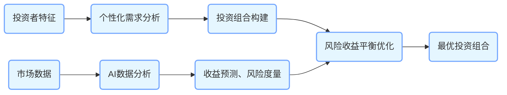

# AI在个性化投资组合管理中的风险收益平衡应用

> 关键词：AI、个性化投资组合管理、风险收益平衡、机器学习、量化分析

> 摘要：本文深入探讨了AI在个性化投资组合管理中实现风险收益平衡的应用。首先介绍了相关背景知识，包括目的、预期读者、文档结构和术语表。接着阐述了核心概念与联系，分析了核心算法原理及具体操作步骤，并结合数学模型和公式进行详细讲解。通过项目实战案例，展示了如何在实际中运用AI技术进行投资组合管理。同时，探讨了实际应用场景，推荐了学习资源、开发工具框架和相关论文著作。最后总结了未来发展趋势与挑战，提供了常见问题解答和扩展阅读参考资料，旨在为投资者和相关从业者提供全面且深入的技术指导。

## 1. 背景介绍 
### 1.1 目的和范围
随着金融市场的不断发展和复杂化，投资者面临着越来越多的投资选择和风险。个性化投资组合管理旨在根据投资者的特定需求、风险偏好和投资目标，构建最优的投资组合。而AI技术的发展为实现这一目标提供了强大的工具。本文的目的是详细探讨AI在个性化投资组合管理中如何实现风险收益平衡，涵盖了从理论概念到实际应用的各个方面，包括核心算法原理、数学模型、项目实战案例等。

### 1.2 预期读者
本文预期读者包括金融投资者、投资组合经理、金融分析师、AI技术开发者以及对金融科技领域感兴趣的研究人员。对于投资者来说，了解AI在投资组合管理中的应用可以帮助他们做出更明智的投资决策；对于金融从业者，本文提供了技术层面的深入分析，有助于提升他们的专业能力；对于AI开发者，本文展示了AI在金融领域的具体应用场景和挑战。

### 1.3 文档结构概述
本文共分为十个部分。第一部分为背景介绍，阐述了文章的目的、预期读者、文档结构和术语表。第二部分介绍核心概念与联系，包括相关的金融和AI概念以及它们之间的关系。第三部分详细讲解核心算法原理和具体操作步骤，并给出Python源代码示例。第四部分分析数学模型和公式，并通过举例进行说明。第五部分是项目实战，包括开发环境搭建、源代码实现和代码解读。第六部分探讨实际应用场景。第七部分推荐学习资源、开发工具框架和相关论文著作。第八部分总结未来发展趋势与挑战。第九部分为附录，提供常见问题解答。第十部分列出扩展阅读和参考资料。

### 1.4 术语表
#### 1.4.1 核心术语定义
- **个性化投资组合管理**：根据投资者的个人特征、风险偏好、投资目标等因素，为其量身定制的投资组合构建和管理过程。
- **风险收益平衡**：在投资过程中，通过合理配置资产，在追求投资收益的同时，控制投资风险，使两者达到一种相对平衡的状态。
- **AI（人工智能）**：研究、开发用于模拟、延伸和扩展人的智能的理论、方法、技术及应用系统的一门新的技术科学。
- **机器学习**：一门多领域交叉学科，涉及概率论、统计学、逼近论、凸分析、算法复杂度理论等多门学科。它专门研究计算机怎样模拟或实现人类的学习行为，以获取新的知识或技能，重新组织已有的知识结构使之不断改善自身的性能。

#### 1.4.2 相关概念解释
- **资产配置**：根据投资需求将投资资金在不同资产类别之间进行分配，通常是将资产在低风险、低收益证券与高风险、高收益证券之间进行分配。
- **风险度量**：对投资组合所面临的风险进行量化评估的过程，常用的风险度量指标包括方差、标准差、夏普比率等。
- **收益预测**：通过对历史数据和市场信息的分析，预测投资组合未来可能获得的收益。

#### 1.4.3 缩略词列表
- **AI**：Artificial Intelligence（人工智能）
- **ML**：Machine Learning（机器学习）
- **VAR**：Value at Risk（风险价值）

## 2. 核心概念与联系 

### 核心概念原理
#### 个性化投资组合管理
个性化投资组合管理的核心原理是根据投资者的独特需求和特征，构建适合其风险承受能力和投资目标的投资组合。这需要考虑多个因素，如投资者的年龄、收入、投资经验、风险偏好等。通过对这些因素的分析，可以确定投资者对不同资产类别的偏好和需求，从而进行合理的资产配置。

#### 风险收益平衡
风险收益平衡的原理基于风险和收益的权衡关系。一般来说，高收益往往伴随着高风险，而低风险则通常意味着低收益。在投资组合管理中，需要通过合理的资产配置和投资策略，在追求一定收益的同时，控制风险在可接受的范围内。这可以通过分散投资、选择不同风险特征的资产等方式来实现。

#### AI在投资组合管理中的应用
AI技术在投资组合管理中的应用主要基于其强大的数据分析和模式识别能力。通过机器学习算法，可以对大量的历史数据和市场信息进行分析，挖掘其中的规律和模式，从而为投资决策提供支持。例如，AI可以用于收益预测、风险度量、资产配置优化等方面。

### 架构的文本示意图
```plaintext
投资者特征（年龄、收入、风险偏好等） --> 个性化需求分析 --> 投资组合构建
市场数据（历史价格、交易量等） --> AI数据分析（机器学习算法） --> 收益预测、风险度量
投资组合构建 + 收益预测、风险度量 --> 风险收益平衡优化 --> 最优投资组合
```

### Mermaid流程图


## 3. 核心算法原理 & 具体操作步骤 

### 核心算法原理
在AI用于个性化投资组合管理的风险收益平衡中，常用的算法包括机器学习算法如线性回归、决策树、神经网络等。这里以线性回归为例进行说明。

线性回归是一种用于建立自变量和因变量之间线性关系的统计方法。在投资组合管理中，可以使用线性回归来预测资产的收益。假设我们有一组历史数据，包括多个自变量（如市场指数、行业指标等）和一个因变量（资产的收益率），线性回归的目标是找到一组最优的系数，使得预测值与实际值之间的误差最小。

线性回归的数学模型可以表示为：

$y = \beta_0 + \beta_1x_1 + \beta_2x_2 + \cdots + \beta_nx_n + \epsilon$

其中，$y$ 是因变量（资产收益率），$x_1, x_2, \cdots, x_n$ 是自变量，$\beta_0, \beta_1, \cdots, \beta_n$ 是待求解的系数，$\epsilon$ 是误差项。

### 具体操作步骤
#### 步骤1：数据收集
收集与投资组合相关的历史数据，包括资产价格、市场指数、宏观经济指标等。

#### 步骤2：数据预处理
对收集到的数据进行清洗、缺失值处理、标准化等操作，以提高数据的质量和可用性。

#### 步骤3：特征选择
从预处理后的数据中选择与资产收益率相关的特征作为自变量。

#### 步骤4：模型训练
使用线性回归算法对训练数据进行训练，求解最优的系数。

#### 步骤5：模型评估
使用测试数据对训练好的模型进行评估，计算预测误差和模型的性能指标。

#### 步骤6：投资组合构建
根据模型的预测结果和投资者的风险偏好，构建投资组合。

### Python源代码示例
```python
import numpy as np
from sklearn.linear_model import LinearRegression
from sklearn.model_selection import train_test_split
from sklearn.metrics import mean_squared_error

# 步骤1：数据收集
# 假设我们有一组历史数据，X是自变量，y是因变量
X = np.array([[1, 2], [2, 4], [3, 6], [4, 8]])
y = np.array([3, 6, 9, 12])

# 步骤2：数据预处理
# 这里可以进行缺失值处理、标准化等操作，示例中省略

# 步骤3：特征选择
# 示例中使用所有特征

# 步骤4：模型训练
# 划分训练集和测试集
X_train, X_test, y_train, y_test = train_test_split(X, y, test_size=0.2, random_state=42)

# 创建线性回归模型
model = LinearRegression()

# 训练模型
model.fit(X_train, y_train)

# 步骤5：模型评估
# 预测测试集
y_pred = model.predict(X_test)

# 计算均方误差
mse = mean_squared_error(y_test, y_pred)
print(f"均方误差: {mse}")

# 步骤6：投资组合构建
# 这里省略具体的投资组合构建代码，根据模型预测结果和风险偏好进行构建
```

## 4. 数学模型和公式 & 详细讲解 & 举例说明 

### 线性回归模型
线性回归模型的一般形式为：

$$y = \beta_0 + \beta_1x_1 + \beta_2x_2 + \cdots + \beta_nx_n + \epsilon$$

其中，$y$ 是因变量，$x_1, x_2, \cdots, x_n$ 是自变量，$\beta_0, \beta_1, \cdots, \beta_n$ 是待求解的系数，$\epsilon$ 是误差项。

### 最小二乘法求解系数
线性回归模型的系数可以通过最小二乘法求解。最小二乘法的目标是使预测值与实际值之间的误差平方和最小，即：

$$\min_{\beta_0, \beta_1, \cdots, \beta_n} \sum_{i=1}^{m} (y_i - (\beta_0 + \beta_1x_{i1} + \beta_2x_{i2} + \cdots + \beta_nx_{in}))^2$$

其中，$m$ 是样本数量，$y_i$ 是第 $i$ 个样本的实际值，$x_{i1}, x_{i2}, \cdots, x_{in}$ 是第 $i$ 个样本的自变量值。

通过对上述目标函数求偏导数并令其为零，可以得到一组正规方程，求解正规方程即可得到最优的系数。

### 举例说明
假设我们有以下历史数据：

| $x_1$ | $x_2$ | $y$ |
|-------|-------|-----|
| 1     | 2     | 3   |
| 2     | 4     | 6   |
| 3     | 6     | 9   |
| 4     | 8     | 12  |

我们使用线性回归模型来预测 $y$ 的值。根据上述数据，我们可以列出以下方程组：

$$
\begin{cases}
3 = \beta_0 + \beta_1 \times 1 + \beta_2 \times 2 \\
6 = \beta_0 + \beta_1 \times 2 + \beta_2 \times 4 \\
9 = \beta_0 + \beta_1 \times 3 + \beta_2 \times 6 \\
12 = \beta_0 + \beta_1 \times 4 + \beta_2 \times 8
\end{cases}
$$

通过最小二乘法求解上述方程组，可以得到 $\beta_0 = 0$，$\beta_1 = 1$，$\beta_2 = 1$。因此，线性回归模型为：

$$y = x_1 + x_2$$

### 风险度量指标
在投资组合管理中，常用的风险度量指标包括方差、标准差和夏普比率。

#### 方差
方差是衡量数据离散程度的指标，在投资组合中，方差可以用来衡量投资组合的风险。投资组合的方差计算公式为：

$$\sigma_p^2 = \sum_{i=1}^{n} \sum_{j=1}^{n} w_i w_j \sigma_{ij}$$

其中，$\sigma_p^2$ 是投资组合的方差，$w_i$ 和 $w_j$ 分别是资产 $i$ 和资产 $j$ 的权重，$\sigma_{ij}$ 是资产 $i$ 和资产 $j$ 的协方差。

#### 标准差
标准差是方差的平方根，它与方差的含义相同，但标准差的单位与原始数据的单位相同，更便于理解和比较。投资组合的标准差计算公式为：

$$\sigma_p = \sqrt{\sum_{i=1}^{n} \sum_{j=1}^{n} w_i w_j \sigma_{ij}}$$

#### 夏普比率
夏普比率是衡量投资组合风险调整后收益的指标，它表示投资组合每承担一单位风险所获得的额外收益。夏普比率的计算公式为：

$$Sharpe Ratio = \frac{R_p - R_f}{\sigma_p}$$

其中，$R_p$ 是投资组合的预期收益率，$R_f$ 是无风险收益率，$\sigma_p$ 是投资组合的标准差。

## 5. 项目实战：代码实际案例和详细解释说明 

### 5.1  开发环境搭建
#### 操作系统
可以选择Windows、Linux或Mac OS等操作系统。这里以Windows为例进行说明。

#### Python环境
安装Python 3.x版本，可以从Python官方网站（https://www.python.org/downloads/）下载安装包进行安装。

#### 安装必要的库
使用pip命令安装必要的库，包括NumPy、pandas、scikit-learn等。

```bash
pip install numpy pandas scikit-learn
```

### 5.2  源代码详细实现和代码解读
```python
import numpy as np
import pandas as pd
from sklearn.linear_model import LinearRegression
from sklearn.model_selection import train_test_split
from sklearn.metrics import mean_squared_error

# 步骤1：数据收集
# 假设我们有一个包含多个资产价格和市场指数的CSV文件
data = pd.read_csv('investment_data.csv')

# 提取自变量和因变量
X = data[['market_index', 'industry_index']]
y = data['asset_return']

# 步骤2：数据预处理
# 处理缺失值
X = X.fillna(X.mean())
y = y.fillna(y.mean())

# 标准化数据
from sklearn.preprocessing import StandardScaler
scaler = StandardScaler()
X_scaled = scaler.fit_transform(X)

# 步骤3：特征选择
# 这里使用所有特征

# 步骤4：模型训练
# 划分训练集和测试集
X_train, X_test, y_train, y_test = train_test_split(X_scaled, y, test_size=0.2, random_state=42)

# 创建线性回归模型
model = LinearRegression()

# 训练模型
model.fit(X_train, y_train)

# 步骤5：模型评估
# 预测测试集
y_pred = model.predict(X_test)

# 计算均方误差
mse = mean_squared_error(y_test, y_pred)
print(f"均方误差: {mse}")

# 步骤6：投资组合构建
# 假设我们根据模型预测结果和风险偏好，选择部分资产进行投资
# 这里简单假设选择预测收益率最高的前两个资产
predictions = model.predict(X_scaled)
top_assets = np.argsort(predictions)[-2:]
print(f"选择的资产索引: {top_assets}")
```

### 5.3  代码解读与分析
#### 数据收集
使用pandas库读取CSV文件，将数据加载到DataFrame中。然后提取自变量和因变量。

#### 数据预处理
处理缺失值，使用均值填充缺失值。使用StandardScaler对数据进行标准化处理，使数据具有零均值和单位方差。

#### 特征选择
示例中使用所有特征，实际应用中可以根据相关性分析等方法选择更合适的特征。

#### 模型训练
使用train_test_split函数将数据划分为训练集和测试集，比例为8:2。创建线性回归模型并使用训练集进行训练。

#### 模型评估
使用测试集进行预测，并计算均方误差来评估模型的性能。

#### 投资组合构建
根据模型的预测结果，选择预测收益率最高的前两个资产作为投资组合。

## 6. 实际应用场景 
### 个人投资者
对于个人投资者来说，AI在个性化投资组合管理中的应用可以帮助他们根据自己的风险偏好和投资目标，构建适合自己的投资组合。例如，年轻的投资者可能更倾向于高风险高收益的投资，而老年投资者则更注重资产的保值和稳定收益。通过AI技术，可以分析投资者的特征和市场数据，为他们提供个性化的投资建议。

### 投资机构
投资机构管理着大量的资金和客户资产，需要在保证收益的同时控制风险。AI技术可以帮助投资机构进行更精准的收益预测和风险度量，优化资产配置，提高投资组合的绩效。例如，通过机器学习算法对市场趋势进行分析，及时调整投资组合的比例，以适应市场变化。

### 金融科技公司
金融科技公司可以利用AI技术开发创新的投资产品和服务，为投资者提供更加便捷和高效的投资体验。例如，开发智能投顾平台，根据投资者的输入自动生成个性化的投资组合，并实时跟踪和调整投资组合。

## 7. 工具和资源推荐
### 7.1 学习资源推荐
#### 7.1.1 书籍推荐
- 《机器学习》（周志华著）：介绍了机器学习的基本概念、算法和应用，是机器学习领域的经典教材。
- 《Python金融大数据分析》（Yves Hilpisch著）：讲解了如何使用Python进行金融数据的分析和处理，包括投资组合管理、风险度量等方面的内容。
- 《聪明的投资者》（本杰明·格雷厄姆著）：投资领域的经典著作，介绍了价值投资的理念和方法。

#### 7.1.2 在线课程
- Coursera上的“机器学习”课程（Andrew Ng教授授课）：是一门非常受欢迎的机器学习入门课程，涵盖了机器学习的基本算法和应用。
- edX上的“金融科技：人工智能在金融中的应用”课程：专门介绍了AI在金融领域的应用，包括投资组合管理、风险评估等方面的内容。

#### 7.1.3 技术博客和网站
- Towards Data Science：一个专注于数据科学和机器学习的博客平台，上面有很多关于AI在金融领域应用的文章。
- QuantNet：一个金融量化分析的社区，提供了丰富的金融数据、算法和工具资源。

### 7.2 开发工具框架推荐
#### 7.2.1 IDE和编辑器
- PyCharm：一款专业的Python集成开发环境，提供了丰富的代码编辑、调试和项目管理功能。
- Jupyter Notebook：一个交互式的开发环境，适合进行数据探索和模型实验。

#### 7.2.2 调试和性能分析工具
- PDB：Python自带的调试工具，可以帮助开发者定位和解决代码中的问题。
- cProfile：Python的性能分析工具，可以分析代码的运行时间和内存使用情况。

#### 7.2.3 相关框架和库
- NumPy：一个用于科学计算的Python库，提供了高效的数组操作和数学函数。
- pandas：一个用于数据处理和分析的Python库，提供了丰富的数据结构和数据处理方法。
- scikit-learn：一个用于机器学习的Python库，提供了各种机器学习算法和工具。

### 7.3 相关论文著作推荐
#### 7.3.1 经典论文
- “A Portfolio Selection Model”（Harry Markowitz著）：提出了现代投资组合理论，为投资组合管理提供了理论基础。
- “Capital Asset Prices: A Theory of Market Equilibrium Under Conditions of Risk”（William Sharpe著）：提出了资本资产定价模型（CAPM），用于衡量资产的风险和收益。

#### 7.3.2 最新研究成果
- “Deep Learning for Portfolio Optimization”：研究了深度学习在投资组合优化中的应用，提出了基于深度学习的投资组合优化模型。
- “Risk Parity Portfolios: Properties and Performance”：探讨了风险平价投资组合的性质和绩效，为投资组合管理提供了新的思路。

#### 7.3.3 应用案例分析
- “AI in Investment Management: Case Studies and Best Practices”：介绍了AI在投资管理中的实际应用案例和最佳实践，为从业者提供了参考。

## 8. 总结：未来发展趋势与挑战
### 未来发展趋势
#### 更精准的个性化服务
随着AI技术的不断发展，未来在个性化投资组合管理中，将能够更精准地分析投资者的特征和需求，提供更加个性化的投资建议和服务。

#### 多模态数据的应用
除了传统的金融数据，未来将更多地利用文本、图像、音频等多模态数据进行投资分析和决策。例如，通过分析新闻文本和社交媒体数据，获取市场情绪和趋势信息。

#### 与区块链技术的结合
区块链技术的去中心化、不可篡改等特点，与AI在投资组合管理中的应用相结合，可以提高数据的安全性和可信度，降低交易成本。

### 挑战
#### 数据质量和隐私问题
AI在投资组合管理中的应用依赖于大量的数据，但数据质量和隐私问题是一个挑战。如何确保数据的准确性、完整性和安全性，以及保护投资者的隐私，是需要解决的问题。

#### 模型解释性
机器学习模型，尤其是深度学习模型，往往具有较高的复杂性，难以解释其决策过程和结果。在投资领域，模型的解释性至关重要，因为投资者需要了解投资决策的依据。

#### 监管和合规问题
随着AI在金融领域的广泛应用，监管和合规问题也日益凸显。如何制定合适的监管政策，确保AI技术的合法、合规应用，是需要关注的问题。

## 9. 附录：常见问题与解答
### 问题1：AI在投资组合管理中的应用是否会取代人类投资经理？
解答：虽然AI技术在投资组合管理中具有很多优势，但目前还不能完全取代人类投资经理。AI可以提供数据支持和分析建议，但人类投资经理具有丰富的经验和判断力，能够考虑到更多的因素，如市场情绪、政策变化等。未来，AI和人类投资经理将相互协作，共同提高投资组合管理的效率和绩效。

### 问题2：如何选择适合自己的AI投资工具？
解答：选择适合自己的AI投资工具需要考虑多个因素，如工具的功能、性能、易用性、数据质量等。可以通过查看工具的文档、用户评价、进行试用等方式来了解工具的特点和优势。同时，还需要根据自己的投资目标和风险偏好来选择合适的工具。

### 问题3：AI投资模型的准确性如何保证？
解答：保证AI投资模型的准确性需要从多个方面入手。首先，需要收集高质量的数据，并进行合理的预处理和特征选择。其次，选择合适的模型和算法，并进行充分的训练和调优。最后，需要对模型进行评估和验证，及时发现和解决模型中的问题。

## 10. 扩展阅读 & 参考资料
### 扩展阅读
- 《金融科技前沿：人工智能与区块链》
- 《智能金融：科技驱动的金融创新》

### 参考资料
- [Investopedia](https://www.investopedia.com/)
- [Journal of Financial Economics](https://www.journals.elsevier.com/journal-of-financial-economics)

作者：AI天才研究院/AI Genius Institute & 禅与计算机程序设计艺术 /Zen And The Art of Computer Programming