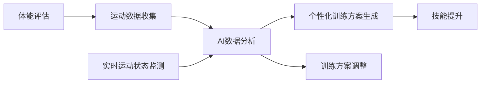

# AI在个性化运动训练方案制定中的应用：从体能评估到技能提升

> 关键词：人工智能、个性化运动训练、体能评估、技能提升、运动数据分析

> 摘要：本文深入探讨了AI在个性化运动训练方案制定中的应用，从体能评估到技能提升的全过程进行了详细剖析。首先介绍了相关背景，包括目的范围、预期读者等。接着阐述了核心概念及联系，分析了核心算法原理并给出Python代码示例。通过数学模型和公式进一步解释其原理，并结合实际案例说明。还介绍了项目实战的开发环境搭建、代码实现与解读。最后探讨了实际应用场景、推荐了相关工具和资源，总结了未来发展趋势与挑战，并给出常见问题解答和参考资料。旨在为相关领域的研究者、开发者和运动从业者提供全面的技术指导和理论支持。

## 1. 背景介绍 
### 1.1 目的和范围
在当今的运动领域，每个人的身体状况、运动目标和能力都存在差异。传统的通用运动训练方案难以满足个体的特殊需求，可能导致训练效果不佳，甚至增加受伤的风险。因此，开发个性化的运动训练方案变得至关重要。本文的目的是详细探讨AI技术如何应用于个性化运动训练方案的制定，从体能评估开始，逐步实现技能提升。我们将涵盖AI在体能数据收集、分析、模型构建以及训练方案生成等方面的应用，同时分析其在不同运动项目中的可行性和优势。

### 1.2 预期读者
本文预期读者包括运动科学领域的研究者、体育教练、健身爱好者、AI开发者以及对运动与科技融合感兴趣的人士。对于运动科学研究者，本文将提供AI技术在运动训练领域的前沿应用案例和理论支持；体育教练可以从中学习如何利用AI工具为学员制定更有效的训练方案；健身爱好者能够了解如何借助科技手段实现个性化的健身目标；AI开发者则可以获得在运动领域应用AI算法的实践指导。

### 1.3 文档结构概述
本文将按照以下结构展开：首先介绍核心概念与联系，包括AI、体能评估和技能提升等相关概念及其关系；接着阐述核心算法原理和具体操作步骤，并给出Python代码示例；然后通过数学模型和公式进一步解释其原理，并举例说明；随后进行项目实战，包括开发环境搭建、源代码实现和代码解读；之后探讨实际应用场景；再推荐相关的工具和资源；最后总结未来发展趋势与挑战，给出常见问题解答和参考资料。

### 1.4 术语表
#### 1.4.1 核心术语定义
- **人工智能（AI）**：是一门研究如何使计算机能够模拟人类智能的技术，包括机器学习、深度学习、自然语言处理等多个领域。在本文中，AI主要用于处理运动数据、构建模型和生成个性化训练方案。
- **个性化运动训练方案**：根据个体的身体状况、运动目标、运动能力等因素制定的专属训练计划，旨在提高训练效果和降低受伤风险。
- **体能评估**：对个体的身体机能、运动能力等方面进行全面的测试和评价，为个性化训练方案的制定提供基础数据。
- **技能提升**：通过针对性的训练，提高个体在特定运动项目中的技术水平和表现能力。

#### 1.4.2 相关概念解释
- **机器学习**：是AI的一个重要分支，通过让计算机从数据中学习模式和规律，从而实现预测和决策。在个性化运动训练中，机器学习算法可以用于分析体能数据、预测运动表现和生成训练方案。
- **深度学习**：是一种基于人工神经网络的机器学习方法，具有强大的特征提取和模式识别能力。在运动领域，深度学习可以用于处理图像、视频等复杂数据，例如分析运动员的动作姿态。
- **运动数据**：包括个体的身体指标（如身高、体重、体脂率等）、运动表现数据（如跑步速度、跳跃高度等）以及运动习惯等信息。这些数据是制定个性化训练方案的重要依据。

#### 1.4.3 缩略词列表
- **AI**：Artificial Intelligence（人工智能）
- **ML**：Machine Learning（机器学习）
- **DL**：Deep Learning（深度学习）

## 2. 核心概念与联系 
### 核心概念原理
在个性化运动训练方案制定中，涉及到多个核心概念，它们相互关联，共同构成了一个完整的体系。

#### 体能评估
体能评估是个性化运动训练的基础。通过对个体的身体机能、运动能力等方面进行全面的测试和评价，可以了解个体的优势和不足，为后续的训练方案制定提供依据。体能评估的内容包括身体形态（如身高、体重、体脂率等）、生理机能（如心率、血压、肺活量等）和运动素质（如力量、速度、耐力等）。

#### 技能提升
技能提升是个性化运动训练的目标之一。通过分析个体在特定运动项目中的技术动作，找出存在的问题，并制定针对性的训练方案，可以提高个体的技术水平和表现能力。技能提升的过程需要结合体能评估的结果，确保训练方案的科学性和有效性。

#### 人工智能
AI在个性化运动训练方案制定中发挥着关键作用。通过机器学习和深度学习算法，AI可以对大量的运动数据进行分析和处理，挖掘数据中的潜在模式和规律，从而为个体生成个性化的训练方案。AI还可以实时监测个体的运动状态，根据实际情况调整训练方案，提高训练效果。

### 架构的文本示意图
```plaintext
体能评估 -> 运动数据收集 -> AI数据分析 -> 个性化训练方案生成 -> 技能提升
|                                        |
|                                        v
|                                实时运动状态监测
|                                        |
|                                        v
|                                训练方案调整
```

### Mermaid流程图


## 3. 核心算法原理 & 具体操作步骤 
### 核心算法原理
在个性化运动训练方案制定中，常用的机器学习算法包括线性回归、决策树、神经网络等。下面以线性回归为例，介绍其原理和应用。

线性回归是一种用于建立自变量和因变量之间线性关系的统计模型。在运动训练中，我们可以将个体的体能指标作为自变量，运动表现作为因变量，通过线性回归模型来预测个体在不同体能状态下的运动表现。

线性回归模型的一般形式为：

$$y = \theta_0 + \theta_1x_1 + \theta_2x_2 + \cdots + \theta_nx_n$$

其中，$y$ 是因变量，$x_1, x_2, \cdots, x_n$ 是自变量，$\theta_0, \theta_1, \theta_2, \cdots, \theta_n$ 是模型的参数。

### 具体操作步骤
#### 步骤1：数据收集
收集个体的体能指标（如身高、体重、体脂率、心率等）和运动表现数据（如跑步速度、跳跃高度等）。

#### 步骤2：数据预处理
对收集到的数据进行清洗、归一化等预处理操作，以提高模型的训练效果。

#### 步骤3：模型训练
使用线性回归算法对预处理后的数据进行训练，得到模型的参数。

#### 步骤4：模型评估
使用测试数据对训练好的模型进行评估，计算模型的误差和准确率。

#### 步骤5：生成训练方案
根据模型的预测结果，为个体生成个性化的训练方案。

### Python源代码示例
```python
import numpy as np
from sklearn.linear_model import LinearRegression
from sklearn.model_selection import train_test_split
from sklearn.metrics import mean_squared_error

# 步骤1：数据收集
# 假设我们有以下体能指标和运动表现数据
X = np.array([[170, 70, 15], [175, 75, 12], [180, 80, 10], [165, 65, 18]])  # 身高、体重、体脂率
y = np.array([12, 13, 14, 11])  # 跑步速度

# 步骤2：数据预处理
# 这里可以进行归一化等操作，为了简单起见，我们省略这一步

# 步骤3：模型训练
# 划分训练集和测试集
X_train, X_test, y_train, y_test = train_test_split(X, y, test_size=0.2, random_state=42)

# 创建线性回归模型
model = LinearRegression()

# 训练模型
model.fit(X_train, y_train)

# 步骤4：模型评估
# 预测测试集结果
y_pred = model.predict(X_test)

# 计算均方误差
mse = mean_squared_error(y_test, y_pred)
print(f"均方误差: {mse}")

# 步骤5：生成训练方案
# 假设我们有一个新的个体的体能指标
new_X = np.array([[172, 72, 14]])
predicted_speed = model.predict(new_X)
print(f"预测的跑步速度: {predicted_speed[0]}")
```

## 4. 数学模型和公式 & 详细讲解 & 举例说明 
### 线性回归模型的数学原理
线性回归模型的目标是找到一组参数 $\theta_0, \theta_1, \theta_2, \cdots, \theta_n$，使得预测值 $\hat{y}$ 与真实值 $y$ 之间的误差最小。常用的误差度量方法是均方误差（Mean Squared Error, MSE），其公式为：

$$MSE = \frac{1}{m} \sum_{i=1}^{m} (y^{(i)} - \hat{y}^{(i)})^2$$

其中，$m$ 是样本数量，$y^{(i)}$ 是第 $i$ 个样本的真实值，$\hat{y}^{(i)}$ 是第 $i$ 个样本的预测值。

为了最小化均方误差，我们可以使用最小二乘法来求解模型的参数。最小二乘法的目标是找到一组参数 $\theta$，使得误差函数 $J(\theta)$ 最小，误差函数的公式为：

$$J(\theta) = \frac{1}{2m} \sum_{i=1}^{m} (h_{\theta}(x^{(i)}) - y^{(i)})^2$$

其中，$h_{\theta}(x^{(i)})$ 是线性回归模型的预测函数，其公式为：

$$h_{\theta}(x^{(i)}) = \theta_0 + \theta_1x_1^{(i)} + \theta_2x_2^{(i)} + \cdots + \theta_nx_n^{(i)}$$

### 详细讲解
最小二乘法的求解过程可以通过对误差函数 $J(\theta)$ 求偏导数，并令偏导数等于零来得到。具体来说，我们需要求解以下方程组：

$$\frac{\partial J(\theta)}{\partial \theta_j} = 0, \quad j = 0, 1, 2, \cdots, n$$

通过求解上述方程组，可以得到模型的参数 $\theta$。

### 举例说明
假设我们有以下数据集：

| 身高（cm） | 体重（kg） | 体脂率（%） | 跑步速度（km/h） |
| --- | --- | --- | --- |
| 170 | 70 | 15 | 12 |
| 175 | 75 | 12 | 13 |
| 180 | 80 | 10 | 14 |
| 165 | 65 | 18 | 11 |

我们可以使用线性回归模型来预测个体的跑步速度。首先，我们将身高、体重和体脂率作为自变量，跑步速度作为因变量，构建线性回归模型：

$$y = \theta_0 + \theta_1x_1 + \theta_2x_2 + \theta_3x_3$$

其中，$x_1$ 是身高，$x_2$ 是体重，$x_3$ 是体脂率，$y$ 是跑步速度。

然后，我们使用最小二乘法来求解模型的参数 $\theta_0, \theta_1, \theta_2, \theta_3$。最后，我们可以使用训练好的模型来预测新个体的跑步速度。

## 5. 项目实战：代码实际案例和详细解释说明 
### 5.1  开发环境搭建
#### 安装Python
首先，需要安装Python编程语言。可以从Python官方网站（https://www.python.org/downloads/）下载适合自己操作系统的Python版本，并按照安装向导进行安装。

#### 安装必要的库
在Python环境中，我们需要安装一些必要的库，如NumPy、Pandas、Scikit-learn等。可以使用以下命令进行安装：

```sh
pip install numpy pandas scikit-learn
```

### 5.2  源代码详细实现和代码解读
```python
import numpy as np
import pandas as pd
from sklearn.linear_model import LinearRegression
from sklearn.model_selection import train_test_split
from sklearn.metrics import mean_squared_error

# 步骤1：数据收集
# 假设我们有一个包含体能指标和运动表现数据的CSV文件
data = pd.read_csv('sports_data.csv')

# 提取自变量和因变量
X = data[['height', 'weight', 'body_fat']].values
y = data['running_speed'].values

# 步骤2：数据预处理
# 这里可以进行归一化等操作，为了简单起见，我们省略这一步

# 步骤3：模型训练
# 划分训练集和测试集
X_train, X_test, y_train, y_test = train_test_split(X, y, test_size=0.2, random_state=42)

# 创建线性回归模型
model = LinearRegression()

# 训练模型
model.fit(X_train, y_train)

# 步骤4：模型评估
# 预测测试集结果
y_pred = model.predict(X_test)

# 计算均方误差
mse = mean_squared_error(y_test, y_pred)
print(f"均方误差: {mse}")

# 步骤5：生成训练方案
# 假设我们有一个新的个体的体能指标
new_X = np.array([[172, 72, 14]])
predicted_speed = model.predict(new_X)
print(f"预测的跑步速度: {predicted_speed[0]}")
```

### 代码解读与分析
#### 数据收集
使用Pandas库读取包含体能指标和运动表现数据的CSV文件，并提取自变量和因变量。

#### 数据预处理
在实际应用中，可能需要对数据进行清洗、归一化等预处理操作，以提高模型的训练效果。这里为了简单起见，省略了这一步。

#### 模型训练
使用Scikit-learn库的`train_test_split`函数将数据集划分为训练集和测试集，然后使用`LinearRegression`类创建线性回归模型，并使用训练集对模型进行训练。

#### 模型评估
使用训练好的模型对测试集进行预测，并计算均方误差，以评估模型的性能。

#### 生成训练方案
使用训练好的模型对新个体的体能指标进行预测，得到预测的跑步速度。

## 6. 实际应用场景 
### 健身俱乐部
在健身俱乐部中，AI可以帮助教练为会员制定个性化的健身方案。通过收集会员的身体指标、运动目标和运动习惯等信息，AI可以分析会员的体能状况，并生成适合会员的训练计划。同时，AI还可以实时监测会员的运动状态，根据实际情况调整训练方案，提高训练效果。

### 专业运动队
对于专业运动队，AI可以用于运动员的体能评估和技能提升。通过分析运动员的比赛数据和训练数据，AI可以找出运动员的优势和不足，并制定针对性的训练方案。此外，AI还可以帮助教练进行战术分析和对手研究，提高球队的比赛成绩。

### 康复中心
在康复中心，AI可以为患者制定个性化的康复训练方案。通过收集患者的身体状况、康复目标和运动能力等信息，AI可以分析患者的康复需求，并生成适合患者的训练计划。同时，AI还可以实时监测患者的康复进展，根据实际情况调整训练方案，促进患者的康复。

## 7. 工具和资源推荐
### 7.1 学习资源推荐
#### 7.1.1 书籍推荐
- 《机器学习》（周志华）：全面介绍了机器学习的基本概念、算法和应用，是机器学习领域的经典教材。
- 《深度学习》（Ian Goodfellow、Yoshua Bengio、Aaron Courville）：深入探讨了深度学习的理论和实践，是深度学习领域的权威著作。
- 《Python数据分析实战》（Sebastian Raschka）：介绍了如何使用Python进行数据分析和机器学习，适合初学者入门。

#### 7.1.2 在线课程
- Coursera上的“机器学习”课程（Andrew Ng教授主讲）：是机器学习领域最受欢迎的在线课程之一，讲解深入浅出，适合初学者。
- edX上的“深度学习”课程（由多所知名高校的教授联合授课）：系统介绍了深度学习的理论和实践，适合有一定基础的学习者。
- 中国大学MOOC上的“Python语言程序设计”课程（嵩天教授主讲）：适合初学者快速掌握Python编程语言。

#### 7.1.3 技术博客和网站
- Medium：是一个汇聚了众多技术专家和开发者的博客平台，上面有很多关于AI和机器学习的优质文章。
- Kaggle：是一个数据科学和机器学习竞赛平台，上面有很多开源的数据集和代码，可以学习到很多实际应用案例。
- 机器之心：是一个专注于AI技术的媒体平台，提供了大量的技术文章、行业动态和研究报告。

### 7.2 开发工具框架推荐
#### 7.2.1 IDE和编辑器
- PyCharm：是一款专门为Python开发设计的集成开发环境，具有强大的代码编辑、调试和自动补全功能。
- Jupyter Notebook：是一个交互式的开发环境，适合进行数据分析和机器学习实验，可以实时查看代码的运行结果。
- Visual Studio Code：是一款轻量级的代码编辑器，支持多种编程语言，具有丰富的插件和扩展功能。

#### 7.2.2 调试和性能分析工具
- Py-Spy：是一个用于分析Python程序性能的工具，可以实时监测程序的CPU使用率和函数调用情况。
- cProfile：是Python标准库中的一个性能分析工具，可以统计程序中各个函数的执行时间和调用次数。
- TensorBoard：是TensorFlow框架提供的一个可视化工具，可以用于可视化模型的训练过程和性能指标。

#### 7.2.3 相关框架和库
- Scikit-learn：是一个用于机器学习的Python库，提供了丰富的机器学习算法和工具，如线性回归、决策树、支持向量机等。
- TensorFlow：是一个开源的深度学习框架，由Google开发，广泛应用于图像识别、自然语言处理等领域。
- PyTorch：是另一个开源的深度学习框架，具有动态图的特点，易于使用和调试，受到了很多研究者和开发者的喜爱。

### 7.3 相关论文著作推荐
#### 7.3.1 经典论文
- “Gradient-Based Learning Applied to Document Recognition”（Yann LeCun、Léon Bottou、Yoshua Bengio、Patrick Haffner）：介绍了卷积神经网络（CNN）在手写字符识别中的应用，是深度学习领域的经典论文之一。
- “Long Short-Term Memory”（Sepp Hochreiter、Jürgen Schmidhuber）：提出了长短期记忆网络（LSTM），解决了传统循环神经网络（RNN）中的梯度消失问题。
- “Attention Is All You Need”（Ashish Vaswani、Noam Shazeer、Niki Parmar等）：提出了Transformer模型，是自然语言处理领域的重要突破。

#### 7.3.2 最新研究成果
- 关注顶级学术会议（如NeurIPS、ICML、CVPR等）上的最新研究论文，了解AI在个性化运动训练领域的最新研究进展。
- 查阅知名学术期刊（如Journal of Artificial Intelligence Research、Artificial Intelligence等）上的相关研究文章。

#### 7.3.3 应用案例分析
- 分析一些知名体育品牌（如耐克、阿迪达斯等）在运动科技方面的应用案例，了解他们如何利用AI技术为消费者提供个性化的运动体验。
- 研究一些专业运动队（如NBA球队、英超球队等）在训练和比赛中应用AI技术的案例，学习他们的成功经验。

## 8. 总结：未来发展趋势与挑战
### 未来发展趋势
- **多模态数据融合**：未来，AI将不仅仅依赖于传统的体能指标和运动表现数据，还将融合更多的多模态数据，如生物电信号、运动图像、环境数据等，以更全面地了解个体的运动状态和需求。
- **强化学习的应用**：强化学习是一种通过智能体与环境进行交互并获得奖励来学习最优策略的机器学习方法。在个性化运动训练中，强化学习可以用于实时调整训练方案，使训练过程更加自适应和高效。
- **虚拟现实（VR）和增强现实（AR）技术的结合**：VR和AR技术可以为运动训练提供更加沉浸式和交互式的体验。结合AI技术，VR和AR可以根据个体的训练情况实时生成个性化的训练场景和反馈，提高训练的趣味性和效果。
- **跨领域合作**：AI在个性化运动训练中的应用将越来越需要跨领域的合作，包括运动科学、医学、计算机科学等多个领域的专家共同参与，以推动该领域的发展。

### 挑战
- **数据隐私和安全**：在收集和使用个体的运动数据时，需要确保数据的隐私和安全。如何保护用户的个人信息不被泄露和滥用，是一个亟待解决的问题。
- **模型的可解释性**：深度学习模型通常是黑盒模型，其决策过程难以解释。在个性化运动训练中，需要模型具有一定的可解释性，以便教练和运动员能够理解模型的决策依据，并做出合理的调整。
- **数据质量和标注**：高质量的数据是AI模型训练的基础。然而，在实际应用中，运动数据的质量可能受到多种因素的影响，如数据采集设备的精度、数据标注的准确性等。如何提高数据质量和标注的效率，是一个挑战。
- **技术的普及和应用成本**：虽然AI技术在个性化运动训练中具有巨大的潜力，但目前该技术的普及程度还比较低，应用成本也比较高。如何降低技术的应用门槛，使更多的人能够受益于AI技术，是一个需要解决的问题。

## 9. 附录：常见问题与解答
### 问题1：AI在个性化运动训练中的应用是否会取代教练？
解答：不会。AI在个性化运动训练中的应用可以为教练提供辅助支持，帮助教练更科学地制定训练方案和监测运动员的训练状态。但教练的经验和专业知识仍然是不可替代的，教练可以根据运动员的实际情况进行灵活调整和指导。

### 问题2：如何确保AI生成的训练方案的安全性和有效性？
解答：首先，需要使用大量的高质量数据对AI模型进行训练和验证，以确保模型的准确性和可靠性。其次，在生成训练方案时，需要结合运动科学的原理和经验，对方案进行评估和审核。最后，在实际应用中，需要对运动员的训练过程进行实时监测，根据实际情况及时调整训练方案。

### 问题3：AI在个性化运动训练中的应用是否适用于所有运动项目？
解答：AI在个性化运动训练中的应用具有一定的通用性，但不同的运动项目可能需要不同的算法和模型。例如，对于一些需要高度技巧和策略的运动项目，如围棋、象棋等，可能需要更复杂的AI算法和模型。因此，在应用AI技术时，需要根据具体的运动项目进行定制化开发。

### 问题4：如何获取和标注运动数据？
解答：可以通过各种传感器（如心率带、运动手环、加速度计等）和设备（如运动摄像机、跑步机等）来获取运动数据。在标注数据时，可以采用人工标注和自动标注相结合的方法。人工标注可以确保数据的准确性，但效率较低；自动标注可以提高标注的效率，但可能存在一定的误差。因此，需要根据实际情况选择合适的标注方法。

## 10. 扩展阅读 & 参考资料
### 扩展阅读
- 《运动生理学》：深入了解人体在运动过程中的生理变化和适应机制，为个性化运动训练方案的制定提供理论基础。
- 《体育统计学》：学习如何运用统计学方法对运动数据进行分析和处理，以提高训练方案的科学性和有效性。
- 《人工智能与体育》：探讨AI技术在体育领域的应用现状和未来发展趋势，了解更多相关的案例和实践经验。

### 参考资料
- 相关学术论文和研究报告，如IEEE Transactions on Pattern Analysis and Machine Intelligence、ACM Transactions on Intelligent Systems and Technology等期刊上的文章。
- 知名体育组织和机构发布的官方文件和报告，如国际奥委会、世界反兴奋剂机构等发布的相关资料。
- 各大科技公司和研究机构的官方网站和博客，如Google AI、Facebook AI Research等发布的技术文章和研究成果。

作者：AI天才研究院/AI Genius Institute & 禅与计算机程序设计艺术 /Zen And The Art of Computer Programming