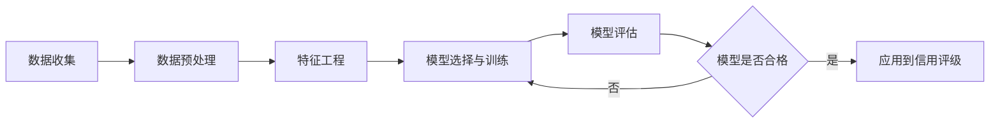

# AI在企业信用评级中的应用与挑战

> 关键词：AI、企业信用评级、机器学习、数据分析、应用挑战

> 摘要：本文聚焦于AI在企业信用评级领域的应用与挑战。首先介绍了研究的背景、目的、预期读者等内容。详细阐述了企业信用评级和AI的核心概念及联系，给出了相关原理和架构的示意图与流程图。深入分析了核心算法原理，用Python代码进行了说明，还讲解了涉及的数学模型和公式。通过项目实战展示了代码实现及解读。探讨了AI在企业信用评级中的实际应用场景，推荐了学习资源、开发工具框架和相关论文著作。最后总结了未来发展趋势与挑战，并对常见问题进行了解答，为AI在企业信用评级中的应用提供了全面的参考。

## 1. 背景介绍 
### 1.1 目的和范围
企业信用评级对于金融机构、投资者以及企业自身都具有至关重要的意义。准确的信用评级能够帮助金融机构合理评估贷款风险，投资者做出明智的投资决策，企业了解自身信用状况以优化经营策略。随着人工智能（AI）技术的飞速发展，其在企业信用评级领域的应用越来越广泛。本文章的目的在于深入探讨AI在企业信用评级中的应用方式、优势以及面临的挑战，范围涵盖AI技术在企业信用评级的各个环节，包括数据处理、模型构建、评级结果分析等。

### 1.2 预期读者
本文预期读者包括金融行业从业者，如银行信贷人员、投资分析师等，他们可以从中学到如何利用AI技术提升企业信用评级的准确性和效率；AI技术开发者，了解企业信用评级领域的业务需求，以便更好地开发适合该领域的AI算法和模型；企业管理人员，有助于他们理解自身信用评级的评估机制，从而采取措施提升企业信用水平；以及对AI和金融交叉领域感兴趣的研究人员和学生。

### 1.3 文档结构概述
本文首先介绍了相关背景信息，包括目的、预期读者和文档结构。接着阐述了企业信用评级和AI的核心概念及它们之间的联系，给出了原理和架构的示意图与流程图。然后详细讲解了核心算法原理和具体操作步骤，并用Python代码进行了说明。随后介绍了涉及的数学模型和公式，并举例说明。通过项目实战展示了代码的实际案例和详细解释。探讨了AI在企业信用评级中的实际应用场景。推荐了学习资源、开发工具框架和相关论文著作。最后总结了未来发展趋势与挑战，对常见问题进行了解答，并提供了扩展阅读和参考资料。

### 1.4 术语表
#### 1.4.1 核心术语定义
- **企业信用评级**：是指信用评级机构对企业的信用状况进行评估，通过对企业的财务状况、经营能力、市场竞争力等多方面因素进行分析，给出一个反映企业信用风险程度的等级。
- **人工智能（AI）**：是一门研究如何使计算机能够模拟人类智能的学科，包括机器学习、深度学习、自然语言处理等多种技术，旨在让计算机具有感知、学习、推理和决策等能力。
- **机器学习**：是AI的一个重要分支，它通过让计算机从数据中学习模式和规律，从而实现对未知数据的预测和分类。常见的机器学习算法包括决策树、支持向量机、神经网络等。
- **深度学习**：是一种基于人工神经网络的机器学习技术，它通过构建多层神经网络来学习数据的复杂特征和模式，在图像识别、语音识别等领域取得了巨大成功。

#### 1.4.2 相关概念解释
- **数据挖掘**：是从大量的数据中发现有价值信息和知识的过程，在企业信用评级中，数据挖掘可以用于发现影响企业信用的关键因素和模式。
- **特征工程**：是指从原始数据中提取和选择有意义的特征，以提高模型的性能。在企业信用评级中，特征工程可以帮助筛选出对信用评级有重要影响的指标。
- **模型评估**：是指对构建的信用评级模型进行评估，以确定其准确性和可靠性。常用的评估指标包括准确率、召回率、F1值等。

#### 1.4.3 缩略词列表
- **AI**：Artificial Intelligence（人工智能）
- **ML**：Machine Learning（机器学习）
- **DL**：Deep Learning（深度学习）
- **ROC**：Receiver Operating Characteristic（受试者工作特征曲线）
- **AUC**：Area Under the Curve（曲线下面积）

## 2. 核心概念与联系 
### 企业信用评级概念
企业信用评级是对企业信用风险的综合评估。传统的企业信用评级主要基于企业的财务报表、信用记录等结构化数据，通过分析企业的偿债能力、盈利能力、营运能力等指标来确定信用等级。例如，银行在对企业发放贷款时，会根据企业的资产负债率、流动比率等财务指标来评估企业的还款能力。

### AI概念
AI是使计算机模拟人类智能的技术。在企业信用评级中，常用的AI技术包括机器学习和深度学习。机器学习算法可以自动从数据中学习模式和规律，从而对企业的信用风险进行预测。深度学习则可以处理更加复杂和大规模的数据，挖掘数据中的深层次特征。

### 核心概念原理和架构的文本示意图
| 层级 | 内容 |
| ---- | ---- |
| 数据层 | 包括企业的财务数据、经营数据、市场数据等，这些数据可以是结构化的，也可以是非结构化的。 |
| 特征工程层 | 对原始数据进行清洗、转换和特征提取，筛选出对信用评级有重要影响的特征。 |
| 模型层 | 选择合适的AI模型，如决策树、神经网络等，对处理后的数据进行训练和学习。 |
| 评估层 | 对训练好的模型进行评估，使用评估指标来衡量模型的性能。 |
| 应用层 | 将评估合格的模型应用到实际的企业信用评级中，为金融机构、投资者等提供决策支持。 |

### Mermaid流程图


## 3. 核心算法原理 & 具体操作步骤 
### 逻辑回归算法原理
逻辑回归是一种常用的二分类算法，在企业信用评级中，可以将企业分为信用良好和信用不良两类。逻辑回归的基本原理是通过对输入特征进行线性组合，然后通过逻辑函数将线性组合的结果映射到[0, 1]区间，得到企业属于某一类别的概率。

逻辑函数的公式为：
$$\sigma(z)=\frac{1}{1 + e^{-z}}$$
其中，$z$ 是输入特征的线性组合：
$$z = \theta_0 + \theta_1x_1 + \theta_2x_2 + \cdots + \theta_nx_n$$
$\theta_0, \theta_1, \cdots, \theta_n$ 是模型的参数，$x_1, x_2, \cdots, x_n$ 是输入特征。

### Python代码实现
```python
import numpy as np
from sklearn.linear_model import LogisticRegression
from sklearn.model_selection import train_test_split
from sklearn.metrics import accuracy_score

# 生成示例数据
np.random.seed(0)
X = np.random.randn(100, 5)
y = np.random.randint(0, 2, 100)

# 划分训练集和测试集
X_train, X_test, y_train, y_test = train_test_split(X, y, test_size=0.2, random_state=42)

# 创建逻辑回归模型
model = LogisticRegression()

# 训练模型
model.fit(X_train, y_train)

# 预测
y_pred = model.predict(X_test)

# 评估模型
accuracy = accuracy_score(y_test, y_pred)
print(f"模型准确率: {accuracy}")
```

### 具体操作步骤
1. **数据收集**：收集企业的相关数据，包括财务数据、经营数据等。
2. **数据预处理**：对收集到的数据进行清洗，处理缺失值、异常值等。
3. **特征工程**：从预处理后的数据中提取和选择有意义的特征。
4. **模型选择**：根据数据特点和问题需求，选择合适的AI模型，如逻辑回归、决策树等。
5. **模型训练**：使用训练数据对模型进行训练，调整模型的参数。
6. **模型评估**：使用测试数据对训练好的模型进行评估，计算评估指标。
7. **模型应用**：将评估合格的模型应用到实际的企业信用评级中。

## 4. 数学模型和公式 & 详细讲解 & 举例说明 
### 逻辑回归损失函数
逻辑回归的损失函数通常使用对数损失函数，也称为交叉熵损失函数。对于一个样本 $(x, y)$，其对数损失函数的公式为：
$$L(\theta)=-y\log(\sigma(z))-(1 - y)\log(1 - \sigma(z))$$
其中，$y$ 是样本的真实标签，$\sigma(z)$ 是模型预测的概率。

对于整个训练数据集，损失函数为：
$$J(\theta)=\frac{1}{m}\sum_{i = 1}^{m}L(\theta^{(i)})$$
其中，$m$ 是训练样本的数量。

### 详细讲解
对数损失函数的作用是衡量模型预测的概率与真实标签之间的差异。当样本的真实标签为 $y = 1$ 时，损失函数为 $- \log(\sigma(z))$，如果模型预测的概率 $\sigma(z)$ 接近 1，则损失函数的值接近 0；如果 $\sigma(z)$ 接近 0，则损失函数的值趋近于正无穷。当样本的真实标签为 $y = 0$ 时，损失函数为 $- \log(1 - \sigma(z))$，同理，如果模型预测的概率 $\sigma(z)$ 接近 0，则损失函数的值接近 0；如果 $\sigma(z)$ 接近 1，则损失函数的值趋近于正无穷。

### 举例说明
假设我们有一个样本 $(x, y)$，其中 $y = 1$，模型预测的概率 $\sigma(z) = 0.8$。则该样本的对数损失函数值为：
$$L(\theta)=-1\times\log(0.8)-(1 - 1)\times\log(1 - 0.8)=-\log(0.8)\approx0.223$$

如果模型预测的概率 $\sigma(z) = 0.2$，则对数损失函数值为：
$$L(\theta)=-1\times\log(0.2)-(1 - 1)\times\log(1 - 0.2)=-\log(0.2)\approx1.609$$

可以看到，当模型预测的概率与真实标签相差较大时，损失函数的值较大；当相差较小时，损失函数的值较小。

## 5. 项目实战：代码实际案例和详细解释说明 
### 5.1  开发环境搭建
- **Python环境**：安装Python 3.x版本，可以从Python官方网站（https://www.python.org/downloads/）下载安装包进行安装。
- **开发工具**：推荐使用Jupyter Notebook或PyCharm作为开发工具。Jupyter Notebook适合进行交互式开发和数据分析，PyCharm是一个功能强大的Python集成开发环境。
- **必要的库**：安装NumPy、Pandas、Scikit-learn等库，可以使用以下命令进行安装：
```bash
pip install numpy pandas scikit-learn
```

### 5.2  源代码详细实现和代码解读
```python
import numpy as np
import pandas as pd
from sklearn.model_selection import train_test_split
from sklearn.ensemble import RandomForestClassifier
from sklearn.metrics import classification_report

# 读取数据
data = pd.read_csv('enterprise_credit_data.csv')

# 数据预处理
# 处理缺失值
data = data.dropna()

# 分离特征和标签
X = data.drop('credit_rating', axis=1)
y = data['credit_rating']

# 划分训练集和测试集
X_train, X_test, y_train, y_test = train_test_split(X, y, test_size=0.2, random_state=42)

# 创建随机森林分类器
model = RandomForestClassifier(n_estimators=100, random_state=42)

# 训练模型
model.fit(X_train, y_train)

# 预测
y_pred = model.predict(X_test)

# 评估模型
report = classification_report(y_test, y_pred)
print(report)
```

### 代码解读与分析
1. **数据读取**：使用Pandas库的 `read_csv` 函数读取企业信用评级数据文件。
2. **数据预处理**：使用 `dropna` 函数处理数据中的缺失值。
3. **特征和标签分离**：将数据集中的特征和标签分离，`X` 表示特征，`y` 表示标签。
4. **数据集划分**：使用 `train_test_split` 函数将数据集划分为训练集和测试集，测试集占比为20%。
5. **模型创建**：创建一个随机森林分类器，设置树的数量为100。
6. **模型训练**：使用训练集数据对模型进行训练。
7. **模型预测**：使用训练好的模型对测试集数据进行预测。
8. **模型评估**：使用 `classification_report` 函数生成分类报告，包括准确率、召回率、F1值等评估指标。

## 6. 实际应用场景 
### 金融机构信贷决策
金融机构在发放贷款时，需要对企业的信用状况进行评估。AI技术可以帮助金融机构更准确地评估企业的信用风险，提高信贷决策的准确性和效率。通过分析企业的财务数据、经营数据、市场数据等多源数据，AI模型可以预测企业的违约概率，从而决定是否给予贷款以及贷款的额度和利率。

### 投资者投资决策
投资者在选择投资对象时，企业的信用状况是一个重要的考虑因素。AI在企业信用评级中的应用可以为投资者提供更全面、准确的企业信用信息，帮助投资者做出更明智的投资决策。投资者可以根据AI模型给出的信用评级结果，选择信用良好的企业进行投资，降低投资风险。

### 企业自身信用管理
企业可以利用AI技术对自身的信用状况进行评估和管理。通过分析自身的财务数据、经营数据等，企业可以了解自己在市场中的信用地位，发现自身存在的问题和不足，从而采取相应的措施进行改进。例如，企业可以根据信用评级结果优化财务管理、加强风险管理等，提高自身的信用水平。

### 供应链金融
在供应链金融中，核心企业的信用状况会影响整个供应链的稳定性。AI技术可以对供应链上的企业进行信用评级，帮助金融机构评估供应链金融业务的风险。同时，供应链上的企业也可以根据信用评级结果优化供应链管理，提高供应链的效率和竞争力。

## 7. 工具和资源推荐
### 7.1 学习资源推荐
#### 7.1.1 书籍推荐
- 《机器学习》（周志华）：这本书是机器学习领域的经典教材，全面介绍了机器学习的基本概念、算法和应用。
- 《深度学习》（Ian Goodfellow、Yoshua Bengio和Aaron Courville）：深度学习领域的权威著作，深入讲解了深度学习的原理和方法。
- 《Python数据分析实战》（Sebastian Raschka）：介绍了如何使用Python进行数据分析，包括数据处理、可视化、机器学习等方面的内容。

#### 7.1.2 在线课程
- Coursera上的“机器学习”课程（Andrew Ng教授）：该课程是机器学习领域的经典在线课程，由斯坦福大学的Andrew Ng教授授课，内容深入浅出，适合初学者。
- edX上的“深度学习基础”课程：由深度学习领域的专家授课，介绍了深度学习的基本概念和方法。
- 中国大学MOOC上的“人工智能基础”课程：涵盖了人工智能的多个方面，包括机器学习、深度学习、自然语言处理等。

#### 7.1.3 技术博客和网站
- 机器之心（https://www.alienzone.org/）：提供人工智能领域的最新技术、研究成果和行业动态。
- 深度学习技术前沿（https://www.deeplearning.ai/）：专注于深度学习领域的技术分享和交流。
- Kaggle（https://www.kaggle.com/）：一个数据科学和机器学习的竞赛平台，上面有很多优秀的开源代码和案例。

### 7.2 开发工具框架推荐
#### 7.2.1 IDE和编辑器
- Jupyter Notebook：一个交互式的开发环境，适合进行数据分析和模型实验。
- PyCharm：功能强大的Python集成开发环境，提供代码编辑、调试、版本控制等功能。
- Visual Studio Code：轻量级的代码编辑器，支持多种编程语言，有丰富的插件扩展。

#### 7.2.2 调试和性能分析工具
- Py-Spy：一个用于Python程序的性能分析工具，可以帮助开发者找出程序中的性能瓶颈。
- TensorBoard：TensorFlow提供的可视化工具，可以用于可视化模型的训练过程和性能指标。
- PDB：Python自带的调试器，可以帮助开发者调试Python代码。

#### 7.2.3 相关框架和库
- Scikit-learn：一个简单易用的机器学习库，提供了多种机器学习算法和工具，适合初学者。
- TensorFlow：Google开发的深度学习框架，具有强大的计算能力和广泛的应用场景。
- PyTorch：Facebook开发的深度学习框架，以其动态图机制和简洁的API受到开发者的喜爱。

### 7.3 相关论文著作推荐
#### 7.3.1 经典论文
- “Neural Networks and Deep Learning”（Michael Nielsen）：介绍了神经网络和深度学习的基本原理和方法。
- “Gradient-Based Learning Applied to Document Recognition”（Yann LeCun、Léon Bottou、Yoshua Bengio和Patrick Haffner）：卷积神经网络领域的经典论文，提出了LeNet-5网络结构。
- “A Decision-Theoretic Generalization of On-Line Learning and an Application to Boosting”（Yoav Freund和Robert E. Schapire）：介绍了Adaboost算法的原理和应用。

#### 7.3.2 最新研究成果
- 可以关注顶级学术会议如NeurIPS（神经信息处理系统大会）、ICML（国际机器学习会议）、KDD（知识发现与数据挖掘会议）上的相关论文，了解AI在企业信用评级领域的最新研究进展。
- 一些知名学术期刊如Journal of Machine Learning Research、Artificial Intelligence等也会发表相关的研究成果。

#### 7.3.3 应用案例分析
- 可以参考一些金融机构和企业发布的AI在企业信用评级中的应用案例报告，了解实际应用中的经验和教训。例如，一些银行会发布关于使用AI技术进行信贷风险评估的案例分析。

## 8. 总结：未来发展趋势与挑战
### 未来发展趋势
- **多源数据融合**：未来，AI在企业信用评级中将更多地融合多源数据，包括企业的社交媒体数据、物联网数据等，以更全面地了解企业的信用状况。
- **深度学习的深入应用**：深度学习技术将在企业信用评级中得到更深入的应用，如使用循环神经网络（RNN）处理企业的时间序列数据，使用图神经网络（GNN）处理企业之间的关系网络数据。
- **可解释性AI**：随着AI在企业信用评级中的应用越来越广泛，对模型可解释性的要求也越来越高。未来，可解释性AI技术将得到更多的关注和发展，以便金融机构和监管部门能够理解模型的决策过程。
- **自动化信用评级**：借助AI技术，企业信用评级将实现自动化，提高评级的效率和准确性。自动化信用评级系统可以实时监测企业的信用状况，及时发现潜在的风险。

### 挑战
- **数据质量问题**：企业信用评级需要大量高质量的数据，但实际中数据可能存在缺失、错误、不一致等问题，影响模型的性能。如何处理数据质量问题是一个重要的挑战。
- **模型可解释性**：一些复杂的AI模型，如深度学习模型，往往是黑盒模型，难以解释其决策过程。在企业信用评级中，模型的可解释性至关重要，如何提高模型的可解释性是一个亟待解决的问题。
- **数据隐私和安全**：企业信用评级涉及大量的企业敏感信息，如财务数据、经营数据等。如何保护这些数据的隐私和安全，防止数据泄露和滥用，是一个重要的挑战。
- **监管和合规性**：AI在企业信用评级中的应用需要符合相关的监管要求和法律法规。如何确保模型的开发和应用符合监管要求，是金融机构和企业需要面对的挑战。

## 9. 附录：常见问题与解答
### 问题1：AI模型在企业信用评级中的准确性如何保证？
答：可以通过以下方法保证AI模型在企业信用评级中的准确性：
- 使用高质量的数据进行模型训练，对数据进行清洗和预处理，处理缺失值和异常值。
- 选择合适的模型，并进行模型调优，通过交叉验证等方法选择最优的模型参数。
- 对模型进行评估，使用多种评估指标，如准确率、召回率、F1值等，评估模型的性能。
- 定期更新模型，随着企业数据的不断变化，及时更新模型以保证其准确性。

### 问题2：AI在企业信用评级中会完全取代人工评级吗？
答：目前来看，AI在企业信用评级中不会完全取代人工评级。虽然AI技术可以提高评级的效率和准确性，但人工评级仍然具有不可替代的作用。人工评级可以考虑一些难以量化的因素，如企业的管理团队素质、行业发展趋势等。同时，在一些复杂的情况下，人工判断可以对AI模型的结果进行验证和补充。未来，AI和人工评级将相互结合，共同提高企业信用评级的质量。

### 问题3：如何选择适合企业信用评级的AI模型？
答：选择适合企业信用评级的AI模型需要考虑以下因素：
- 数据特点：如果数据是结构化的，且特征数量较少，可以选择逻辑回归、决策树等简单模型；如果数据是非结构化的，或者特征数量较多，可以选择深度学习模型。
- 问题复杂度：如果问题比较简单，如二分类问题，可以选择简单的分类模型；如果问题比较复杂，如多分类问题或回归问题，可能需要选择更复杂的模型。
- 可解释性要求：如果对模型的可解释性要求较高，可以选择决策树、逻辑回归等可解释性较强的模型；如果对可解释性要求较低，可以选择深度学习等复杂模型。

### 问题4：AI在企业信用评级中面临的数据隐私和安全问题如何解决？
答：可以通过以下措施解决AI在企业信用评级中面临的数据隐私和安全问题：
- 数据加密：对企业的敏感数据进行加密处理，确保数据在传输和存储过程中的安全性。
- 访问控制：设置严格的访问权限，只有授权人员才能访问企业的信用评级数据。
- 匿名化处理：在使用数据进行模型训练时，对数据进行匿名化处理，保护企业的隐私。
- 合规性管理：确保数据的使用符合相关的法律法规和监管要求，如《网络安全法》、《数据保护法》等。

## 10. 扩展阅读 & 参考资料
### 扩展阅读
- 《人工智能时代的金融风险管理》：深入探讨了AI在金融风险管理领域的应用和挑战。
- 《信用评级理论与实务》：系统介绍了企业信用评级的理论和方法。
- 《大数据与金融》：介绍了大数据技术在金融领域的应用，包括企业信用评级。

### 参考资料
- 《机器学习实战》（Peter Harrington）
- 《Python机器学习基础教程》（Andreas C. Müller、Sarah Guido）
- 《深度学习实战》（Antoine Géron）

作者：AI天才研究院/AI Genius Institute & 禅与计算机程序设计艺术 /Zen And The Art of Computer Programming