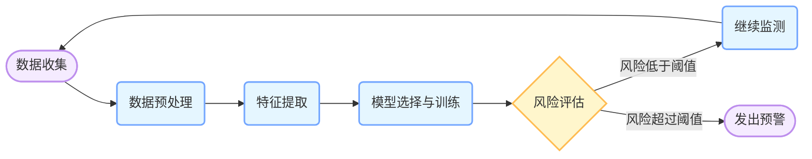

# AI在企业并购整合风险预警中的应用与挑战

> 关键词：人工智能、企业并购整合、风险预警、应用、挑战

> 摘要：本文聚焦于AI在企业并购整合风险预警中的应用与挑战。首先介绍了研究的背景，包括目的、预期读者、文档结构和相关术语。接着阐述了AI、企业并购整合、风险预警等核心概念及其联系，并通过文本示意图和Mermaid流程图展示。详细讲解了用于风险预警的核心算法原理及具体操作步骤，结合Python代码进行说明。探讨了相关数学模型和公式，并举例分析。通过项目实战，介绍了开发环境搭建、源代码实现与解读。分析了AI在企业并购整合风险预警中的实际应用场景。推荐了学习资源、开发工具框架以及相关论文著作。最后总结了未来发展趋势与挑战，解答常见问题，并提供扩展阅读和参考资料，旨在为企业和相关研究者在利用AI进行并购整合风险预警方面提供全面的指导。

## 1. 背景介绍 
### 1.1 目的和范围
企业并购整合是企业实现扩张、战略转型等目标的重要手段，但其中伴随着诸多风险，如文化冲突、财务风险、业务协同不足等。准确及时地预警这些风险对于并购整合的成功至关重要。本研究的目的在于探讨如何利用人工智能（AI）技术构建有效的企业并购整合风险预警体系，提高风险预警的准确性和及时性。研究范围涵盖了AI在企业并购整合风险预警中的应用原理、算法、实际案例以及面临的挑战等方面。

### 1.2 预期读者
本文的预期读者包括企业的管理层、投资银行家、风险管理专家、AI技术开发者以及对企业并购和AI应用感兴趣的研究者。企业管理层可以从中了解如何利用AI技术提升并购整合风险预警能力；投资银行家可以在并购业务中更好地评估风险；风险管理专家能够获取新的风险预警思路和方法；AI技术开发者可以找到在金融领域应用AI的新场景；研究者则可以深入探讨相关理论和实践问题。

### 1.3 文档结构概述
本文将按照以下结构展开：首先介绍核心概念与联系，帮助读者理解相关术语和基本原理；接着阐述核心算法原理和具体操作步骤，通过Python代码详细说明；然后讲解数学模型和公式，并举例说明其应用；通过项目实战展示代码实际案例和详细解释；分析AI在企业并购整合风险预警中的实际应用场景；推荐相关的工具和资源；最后总结未来发展趋势与挑战，解答常见问题，并提供扩展阅读和参考资料。

### 1.4 术语表
#### 1.4.1 核心术语定义
- **人工智能（AI）**：是指让计算机模拟人类智能的技术和方法，包括机器学习、深度学习、自然语言处理等。
- **企业并购整合**：企业通过收购或合并其他企业，将其业务、资产、人员等进行整合，以实现战略目标的过程。
- **风险预警**：对可能发生的风险进行提前监测、分析和预测，并发出警示信号的过程。

#### 1.4.2 相关概念解释
- **机器学习**：是AI的一个重要分支，通过让计算机从数据中学习模式和规律，从而进行预测和决策。
- **深度学习**：是一种基于神经网络的机器学习方法，能够自动从大量数据中提取复杂的特征。
- **自然语言处理**：使计算机能够理解、处理和生成人类语言的技术。

#### 1.4.3 缩略词列表
- **AI**：Artificial Intelligence（人工智能）
- **ML**：Machine Learning（机器学习）
- **DL**：Deep Learning（深度学习）
- **NLP**：Natural Language Processing（自然语言处理）

## 2. 核心概念与联系 

### 核心概念原理
- **人工智能（AI）**：AI的核心原理是模拟人类的智能行为，通过算法和模型从数据中学习模式和规律。机器学习是AI的重要实现方式，它可以分为监督学习、无监督学习和强化学习。监督学习通过给定的输入和输出数据对模型进行训练，使其能够对新的输入数据进行预测；无监督学习则是在没有标注数据的情况下，发现数据中的内在结构和模式；强化学习通过智能体与环境进行交互，根据环境反馈的奖励信号来学习最优策略。
- **企业并购整合**：企业并购整合的目的是实现协同效应，提高企业的竞争力和价值。在并购整合过程中，需要考虑多个方面的因素，如战略协同、业务协同、财务协同、文化协同等。并购整合的成功与否取决于对这些因素的有效管理和协调。
- **风险预警**：风险预警的原理是通过对相关数据的监测和分析，识别潜在的风险因素，并根据一定的规则和模型发出警示信号。风险预警系统通常包括数据采集、数据预处理、风险评估和预警信号发出等环节。

### 架构的文本示意图
AI在企业并购整合风险预警中的应用架构可以分为以下几个层次：
- **数据层**：收集与企业并购整合相关的数据，包括财务数据、市场数据、行业数据、企业内部数据等。
- **处理层**：对收集到的数据进行清洗、转换和特征提取，为后续的分析和建模做准备。
- **模型层**：选择合适的AI算法和模型，如机器学习模型、深度学习模型等，对处理后的数据进行训练和预测。
- **预警层**：根据模型的预测结果，设定预警阈值，当风险指标超过阈值时，发出预警信号。
- **应用层**：将预警信息提供给企业管理层和相关人员，以便他们采取相应的措施。

### Mermaid流程图


## 3. 核心算法原理 & 具体操作步骤 

### 核心算法原理
在企业并购整合风险预警中，常用的AI算法包括逻辑回归、决策树、随机森林、支持向量机和深度学习中的神经网络等。下面以逻辑回归算法为例进行详细讲解。

逻辑回归是一种广泛应用于分类问题的机器学习算法，它通过对输入特征进行线性组合，然后通过逻辑函数将其映射到[0, 1]区间，得到样本属于某一类别的概率。逻辑函数的表达式为：

$$
\sigma(z)=\frac{1}{1 + e^{-z}}
$$

其中，$z$ 是输入特征的线性组合，即：

$$
z = \theta_0 + \theta_1x_1 + \theta_2x_2 + \cdots + \theta_nx_n
$$

$\theta_i$ 是模型的参数，$x_i$ 是输入特征。逻辑回归的目标是通过最大化似然函数来估计模型的参数。

### 具体操作步骤
以下是使用逻辑回归算法进行企业并购整合风险预警的具体操作步骤：

#### 步骤1：数据收集与预处理
收集与企业并购整合相关的数据，包括财务指标、市场指标、行业指标等。对数据进行清洗，处理缺失值和异常值，然后进行标准化处理，使数据具有相同的尺度。

#### 步骤2：特征选择
从收集到的特征中选择与风险预警相关的特征，可以使用相关性分析、方差分析等方法进行特征选择。

#### 步骤3：模型训练
将预处理后的数据分为训练集和测试集，使用训练集对逻辑回归模型进行训练，通过优化算法（如梯度下降法）来估计模型的参数。

#### 步骤4：模型评估
使用测试集对训练好的模型进行评估，常用的评估指标包括准确率、召回率、F1值等。

#### 步骤5：风险预警
使用训练好的模型对新的数据进行预测，根据预测结果设定预警阈值，当风险概率超过阈值时，发出预警信号。

### Python源代码实现
```python
import pandas as pd
from sklearn.model_selection import train_test_split
from sklearn.linear_model import LogisticRegression
from sklearn.preprocessing import StandardScaler
from sklearn.metrics import accuracy_score

# 步骤1：数据收集与预处理
# 假设已经有一个包含企业并购整合数据的CSV文件
data = pd.read_csv('merger_data.csv')
# 分离特征和标签
X = data.drop('risk_label', axis=1)
y = data['risk_label']
# 数据标准化
scaler = StandardScaler()
X_scaled = scaler.fit_transform(X)

# 步骤2：划分训练集和测试集
X_train, X_test, y_train, y_test = train_test_split(X_scaled, y, test_size=0.2, random_state=42)

# 步骤3：模型训练
model = LogisticRegression()
model.fit(X_train, y_train)

# 步骤4：模型评估
y_pred = model.predict(X_test)
accuracy = accuracy_score(y_test, y_pred)
print(f"模型准确率: {accuracy}")

# 步骤5：风险预警
# 假设新的数据
new_data = pd.DataFrame({
    'feature1': [1.2],
    'feature2': [0.8],
    # 其他特征...
})
new_data_scaled = scaler.transform(new_data)
risk_prob = model.predict_proba(new_data_scaled)[:, 1]
threshold = 0.5
if risk_prob > threshold:
    print("发出风险预警！")
else:
    print("风险在可控范围内。")
```

## 4. 数学模型和公式 & 详细讲解 & 举例说明 

### 逻辑回归的数学模型和公式
逻辑回归的数学模型基于逻辑函数，通过对输入特征进行线性组合，然后将其映射到[0, 1]区间，得到样本属于某一类别的概率。具体公式如下：

#### 线性组合
$$
z = \theta_0 + \theta_1x_1 + \theta_2x_2 + \cdots + \theta_nx_n = \theta^T X
$$

其中，$\theta = [\theta_0, \theta_1, \cdots, \theta_n]^T$ 是模型的参数向量，$X = [1, x_1, x_2, \cdots, x_n]^T$ 是输入特征向量。

#### 逻辑函数
$$
\sigma(z)=\frac{1}{1 + e^{-z}}
$$

逻辑函数将线性组合 $z$ 映射到[0, 1]区间，得到样本属于正类别的概率：

$$
P(y = 1|X) = \sigma(\theta^T X)
$$

样本属于负类别的概率为：

$$
P(y = 0|X) = 1 - P(y = 1|X) = 1 - \sigma(\theta^T X)
$$

#### 似然函数
逻辑回归的目标是最大化似然函数，即找到一组参数 $\theta$ 使得样本的观测值出现的概率最大。似然函数的表达式为：

$$
L(\theta)=\prod_{i=1}^{m} [P(y^{(i)} = 1|X^{(i)})]^{y^{(i)}} [1 - P(y^{(i)} = 1|X^{(i)})]^{1 - y^{(i)}}
$$

其中，$m$ 是样本数量，$y^{(i)}$ 是第 $i$ 个样本的标签，$X^{(i)}$ 是第 $i$ 个样本的特征向量。

为了方便计算，通常对似然函数取对数，得到对数似然函数：

$$
\ell(\theta)=\log L(\theta)=\sum_{i=1}^{m} [y^{(i)} \log P(y^{(i)} = 1|X^{(i)}) + (1 - y^{(i)}) \log (1 - P(y^{(i)} = 1|X^{(i)}))]
$$

#### 优化目标
逻辑回归的优化目标是最大化对数似然函数，即：

$$
\max_{\theta} \ell(\theta)
$$

通常使用梯度下降法等优化算法来求解该问题。

### 详细讲解
逻辑回归的核心思想是通过对输入特征进行线性组合，然后使用逻辑函数将其映射到[0, 1]区间，得到样本属于某一类别的概率。似然函数表示了在给定参数 $\theta$ 的情况下，样本的观测值出现的概率。最大化似然函数就是找到一组参数 $\theta$ 使得样本的观测值出现的概率最大。对数似然函数是似然函数的对数形式，取对数的目的是将乘法运算转化为加法运算，方便计算。梯度下降法是一种常用的优化算法，它通过不断迭代更新参数 $\theta$，使得对数似然函数的值不断增大，直到收敛到最优解。

### 举例说明
假设我们有一个简单的企业并购整合风险预警问题，有两个特征 $x_1$ 和 $x_2$，标签 $y$ 表示是否存在风险（$y = 1$ 表示存在风险，$y = 0$ 表示不存在风险）。我们收集了以下数据：

| $x_1$ | $x_2$ | $y$ |
| --- | --- | --- |
| 1 | 2 | 0 |
| 2 | 3 | 0 |
| 3 | 4 | 1 |
| 4 | 5 | 1 |

我们可以使用逻辑回归模型来对这些数据进行训练，预测新样本的风险概率。首先，我们需要对数据进行预处理，然后使用梯度下降法来估计模型的参数 $\theta$。最后，我们可以使用训练好的模型对新样本进行预测。

```python
import numpy as np
from sklearn.linear_model import LogisticRegression

# 输入特征
X = np.array([[1, 2], [2, 3], [3, 4], [4, 5]])
# 标签
y = np.array([0, 0, 1, 1])

# 创建逻辑回归模型
model = LogisticRegression()
# 训练模型
model.fit(X, y)

# 新样本
new_sample = np.array([[5, 6]])
# 预测风险概率
risk_prob = model.predict_proba(new_sample)[:, 1]
print(f"新样本的风险概率: {risk_prob}")
```

在这个例子中，我们使用逻辑回归模型对企业并购整合风险进行了预测。通过训练模型，我们可以得到模型的参数 $\theta$，然后使用这些参数对新样本进行预测，得到其风险概率。

## 5. 项目实战：代码实际案例和详细解释说明 

### 5.1  开发环境搭建
#### 操作系统
可以选择Windows、Linux或macOS操作系统，本案例以Windows 10为例。

#### Python环境
安装Python 3.7及以上版本，可以从Python官方网站（https://www.python.org/downloads/）下载安装包进行安装。安装完成后，配置好环境变量，确保可以在命令行中使用 `python` 和 `pip` 命令。

#### 安装依赖库
使用 `pip` 命令安装所需的依赖库，包括 `pandas`、`numpy`、`scikit-learn` 等。

```sh
pip install pandas numpy scikit-learn
```

### 5.2  源代码详细实现和代码解读
以下是一个完整的企业并购整合风险预警项目的源代码：

```python
import pandas as pd
import numpy as np
from sklearn.model_selection import train_test_split
from sklearn.linear_model import LogisticRegression
from sklearn.preprocessing import StandardScaler
from sklearn.metrics import accuracy_score, recall_score, f1_score

# 步骤1：数据加载与预处理
def load_and_preprocess_data(file_path):
    # 加载数据
    data = pd.read_csv(file_path)
    # 分离特征和标签
    X = data.drop('risk_label', axis=1)
    y = data['risk_label']
    # 数据标准化
    scaler = StandardScaler()
    X_scaled = scaler.fit_transform(X)
    return X_scaled, y, scaler

# 步骤2：模型训练与评估
def train_and_evaluate_model(X, y):
    # 划分训练集和测试集
    X_train, X_test, y_train, y_test = train_test_split(X, y, test_size=0.2, random_state=42)
    # 创建逻辑回归模型
    model = LogisticRegression()
    # 训练模型
    model.fit(X_train, y_train)
    # 预测
    y_pred = model.predict(X_test)
    # 评估模型
    accuracy = accuracy_score(y_test, y_pred)
    recall = recall_score(y_test, y_pred)
    f1 = f1_score(y_test, y_pred)
    print(f"模型准确率: {accuracy}")
    print(f"模型召回率: {recall}")
    print(f"模型F1值: {f1}")
    return model

# 步骤3：风险预警
def risk_warning(model, scaler, new_data):
    new_data_scaled = scaler.transform(new_data)
    risk_prob = model.predict_proba(new_data_scaled)[:, 1]
    threshold = 0.5
    if risk_prob > threshold:
        print("发出风险预警！")
    else:
        print("风险在可控范围内。")

if __name__ == "__main__":
    # 数据文件路径
    file_path = 'merger_data.csv'
    # 加载和预处理数据
    X, y, scaler = load_and_preprocess_data(file_path)
    # 训练和评估模型
    model = train_and_evaluate_model(X, y)
    # 新数据
    new_data = pd.DataFrame({
        'feature1': [1.2],
        'feature2': [0.8],
        # 其他特征...
    })
    # 风险预警
    risk_warning(model, scaler, new_data)
```

### 代码解读与分析
#### 数据加载与预处理函数 `load_and_preprocess_data`
- 该函数接受一个CSV文件路径作为输入，使用 `pandas` 库加载数据。
- 分离特征和标签，将特征数据存储在 `X` 中，标签数据存储在 `y` 中。
- 使用 `StandardScaler` 对特征数据进行标准化处理，使得数据具有相同的尺度，有利于模型的训练。

#### 模型训练与评估函数 `train_and_evaluate_model`
- 使用 `train_test_split` 函数将数据划分为训练集和测试集，测试集占比为20%。
- 创建逻辑回归模型，并使用训练集对模型进行训练。
- 使用训练好的模型对测试集进行预测，得到预测结果 `y_pred`。
- 使用 `accuracy_score`、`recall_score` 和 `f1_score` 等评估指标对模型进行评估，并打印评估结果。

#### 风险预警函数 `risk_warning`
- 对新数据进行标准化处理，使其与训练数据具有相同的尺度。
- 使用训练好的模型对新数据进行预测，得到风险概率 `risk_prob`。
- 设定预警阈值为0.5，当风险概率超过阈值时，发出风险预警；否则，提示风险在可控范围内。

#### 主程序
- 调用 `load_and_preprocess_data` 函数加载和预处理数据。
- 调用 `train_and_evaluate_model` 函数训练和评估模型。
- 定义新数据，并调用 `risk_warning` 函数进行风险预警。

通过以上步骤，我们完成了一个完整的企业并购整合风险预警项目，从数据加载、预处理、模型训练、评估到风险预警，每个环节都有详细的代码实现和解释。

## 6. 实际应用场景 
### 财务风险预警
在企业并购整合过程中，财务风险是一个重要的关注点。AI可以通过对企业的财务数据进行分析，如资产负债表、利润表、现金流量表等，预警潜在的财务风险。例如，通过分析企业的偿债能力、盈利能力、营运能力等指标，预测企业是否可能出现财务困境。如果企业的资产负债率过高、流动比率过低，AI模型可以及时发出预警信号，提醒企业管理层采取相应的措施。

### 业务协同风险预警
业务协同是企业并购整合的重要目标之一，但在实际操作中，可能会出现业务协同不足的情况。AI可以通过对企业的业务数据进行分析，如市场份额、客户群体、产品结构等，预警业务协同风险。例如，如果并购双方的市场份额重叠度较高，但产品差异化不足，可能会导致市场竞争加剧，影响业务协同效果。AI模型可以通过分析这些数据，提前发现潜在的问题，并发出预警。

### 文化整合风险预警
文化整合是企业并购整合中最具挑战性的方面之一。不同企业的文化差异可能会导致员工之间的冲突、沟通障碍等问题，影响企业的运营效率和员工的工作积极性。AI可以通过对企业的员工数据、社交媒体数据等进行分析，预警文化整合风险。例如，通过分析员工的满意度调查数据、社交媒体上的言论等，了解员工对文化整合的态度和感受。如果发现员工对文化整合存在较大的抵触情绪，AI模型可以及时发出预警，提醒企业管理层采取相应的文化整合措施。

### 法律合规风险预警
企业并购整合过程中需要遵守各种法律法规，如反垄断法、证券法、劳动法等。AI可以通过对法律法规文本进行分析，结合企业的并购整合活动，预警法律合规风险。例如，通过自然语言处理技术对反垄断法的条文进行解析，分析企业的并购行为是否可能违反反垄断法。如果发现存在潜在的法律合规风险，AI模型可以及时发出预警，提醒企业管理层咨询法律专家，采取相应的措施避免法律纠纷。

## 7. 工具和资源推荐
### 7.1 学习资源推荐
#### 7.1.1 书籍推荐
- 《Python机器学习》：本书详细介绍了Python在机器学习中的应用，包括各种机器学习算法的原理、实现和应用案例，适合初学者入门。
- 《深度学习》：由深度学习领域的三位顶尖专家撰写，系统地介绍了深度学习的基本原理、算法和应用，是深度学习领域的经典教材。
- 《人工智能：现代方法》：全面介绍了人工智能的各个领域，包括搜索算法、知识表示、机器学习、自然语言处理等，是人工智能领域的权威著作。

#### 7.1.2 在线课程
- Coursera上的“机器学习”课程：由斯坦福大学教授Andrew Ng主讲，是机器学习领域最受欢迎的在线课程之一，课程内容丰富，讲解详细，适合初学者。
- edX上的“深度学习”课程：由MIT等知名高校的教授授课，深入介绍了深度学习的原理和应用，课程难度较高，适合有一定机器学习基础的学习者。
- 中国大学MOOC上的“人工智能基础”课程：由国内知名高校的教授授课，系统地介绍了人工智能的基本概念、算法和应用，适合国内学习者。

#### 7.1.3 技术博客和网站
- Medium：是一个技术博客平台，上面有很多关于AI、机器学习、深度学习等领域的优秀文章，作者来自世界各地的技术专家和研究者。
- Towards Data Science：专注于数据科学和机器学习领域的技术博客，提供了大量的技术文章、案例分析和实践经验分享。
- Kaggle：是一个数据科学竞赛平台，上面有很多关于机器学习、深度学习等领域的数据集和竞赛项目，可以通过参与竞赛来提高自己的技术水平。

### 7.2 开发工具框架推荐
#### 7.2.1 IDE和编辑器
- PyCharm：是一款专门为Python开发设计的集成开发环境（IDE），具有代码编辑、调试、版本控制等功能，适合专业的Python开发者。
- Jupyter Notebook：是一个交互式的开发环境，支持Python、R等多种编程语言，适合数据科学家和研究者进行数据分析和模型开发。
- Visual Studio Code：是一款轻量级的代码编辑器，支持多种编程语言和插件扩展，具有丰富的功能和良好的用户体验，适合初学者和专业开发者。

#### 7.2.2 调试和性能分析工具
- Py-Spy：是一个用于Python程序性能分析的工具，可以实时监测Python程序的CPU使用率、内存使用率等指标，帮助开发者找出性能瓶颈。
- PDB：是Python自带的调试工具，可以在代码中设置断点，逐行执行代码，查看变量的值，帮助开发者调试程序。
- TensorBoard：是TensorFlow提供的一个可视化工具，可以用于可视化深度学习模型的训练过程、网络结构、参数分布等信息，帮助开发者更好地理解和优化模型。

#### 7.2.3 相关框架和库
- Scikit-learn：是一个常用的机器学习库，提供了各种机器学习算法的实现，如分类、回归、聚类等，具有简单易用、文档丰富等特点。
- TensorFlow：是Google开发的一个深度学习框架，支持多种深度学习模型的构建和训练，具有高效、灵活等特点。
- PyTorch：是Facebook开发的一个深度学习框架，具有动态图机制、易于调试等优点，受到了很多研究者和开发者的喜爱。

### 7.3 相关论文著作推荐
#### 7.3.1 经典论文
- “Gradient-Based Learning Applied to Document Recognition”：由Yann LeCun等人发表，介绍了卷积神经网络（CNN）在手写数字识别中的应用，是深度学习领域的经典论文之一。
- “ImageNet Classification with Deep Convolutional Neural Networks”：由Alex Krizhevsky等人发表，提出了AlexNet模型，在ImageNet图像分类竞赛中取得了优异的成绩，推动了深度学习在计算机视觉领域的发展。
- “Long Short-Term Memory”：由Sepp Hochreiter和Jürgen Schmidhuber发表，介绍了长短期记忆网络（LSTM）的原理和应用，解决了传统循环神经网络（RNN）中的梯度消失问题，在自然语言处理等领域得到了广泛应用。

#### 7.3.2 最新研究成果
- 在学术搜索引擎（如Google Scholar、IEEE Xplore等）上搜索关于“AI in corporate merger and acquisition risk warning”的最新研究论文，可以了解到该领域的最新研究动态和技术进展。
- 参加相关的学术会议（如NeurIPS、ICML、KDD等），可以听取该领域的顶尖研究者的报告，了解最新的研究成果和趋势。

#### 7.3.3 应用案例分析
- 可以关注一些知名企业在企业并购整合风险预警中应用AI的案例分析，如IBM、Microsoft等公司的相关案例，了解他们的实践经验和技术方案。
- 阅读一些行业报告和研究机构发布的关于企业并购整合和AI应用的报告，如麦肯锡、波士顿咨询等公司的报告，获取更多的应用案例和行业洞察。

## 8. 总结：未来发展趋势与挑战
### 未来发展趋势
#### 多模态数据融合
未来，AI在企业并购整合风险预警中将越来越多地融合多模态数据，如财务数据、文本数据、图像数据、音频数据等。通过融合不同类型的数据，可以更全面地了解企业的状况，提高风险预警的准确性。例如，结合企业的财务报表、新闻报道、社交媒体评论等数据，对企业的声誉风险进行更准确的评估。

#### 深度学习与强化学习的应用
深度学习和强化学习将在企业并购整合风险预警中发挥越来越重要的作用。深度学习可以自动从大量数据中提取复杂的特征，提高模型的预测能力；强化学习可以通过智能体与环境的交互，不断优化风险预警策略，提高预警的及时性和有效性。例如，使用深度强化学习算法对企业的并购决策进行优化，降低并购风险。

#### 可解释性AI
随着AI技术在企业并购整合风险预警中的广泛应用，可解释性AI将变得越来越重要。企业管理层和监管机构需要了解AI模型的决策过程和依据，以便做出合理的决策。未来，研究人员将致力于开发可解释性的AI模型，提高模型的透明度和可信度。例如，使用特征重要性分析、决策树可视化等方法，解释AI模型的决策过程。

#### 与区块链技术的结合
区块链技术具有去中心化、不可篡改、可追溯等特点，可以为企业并购整合风险预警提供更安全、可靠的数据支持。未来，AI技术可能会与区块链技术相结合，构建更加安全、可信的风险预警系统。例如，使用区块链技术记录企业的并购交易数据，确保数据的真实性和完整性，同时使用AI技术对这些数据进行分析和预警。

### 挑战
#### 数据质量和隐私问题
数据是AI模型训练的基础，数据质量的好坏直接影响模型的性能。在企业并购整合风险预警中，数据来源广泛，数据质量参差不齐，可能存在数据缺失、错误、不一致等问题。此外，企业的一些数据可能涉及商业机密和个人隐私，如何在保护数据隐私的前提下，有效地利用这些数据进行风险预警，是一个亟待解决的问题。

#### 模型的泛化能力和稳定性
AI模型的泛化能力和稳定性是影响风险预警准确性的重要因素。在实际应用中，企业并购整合的情况复杂多变，不同行业、不同企业的风险特征可能存在很大差异。如何开发具有良好泛化能力和稳定性的AI模型，使其能够在不同的场景下准确地预警风险，是一个挑战。

#### 技术人才短缺
AI技术的应用需要具备专业知识和技能的技术人才。目前，市场上掌握AI技术和企业并购整合知识的复合型人才短缺，这限制了AI在企业并购整合风险预警中的应用和推广。如何培养和吸引更多的复合型人才，是企业和学术界需要共同面对的问题。

#### 法律法规和监管问题
随着AI技术在企业并购整合风险预警中的广泛应用，相关的法律法规和监管问题也日益凸显。例如，如何规范AI模型的开发和使用，确保其符合法律法规和道德标准；如何对AI模型的决策结果进行监管，防止其对企业和社会造成不良影响等。需要政府和监管机构制定相应的法律法规和监管政策，引导AI技术的健康发展。

## 9. 附录：常见问题与解答
### 问题1：AI模型在企业并购整合风险预警中的准确率有多高？
AI模型的准确率受到多种因素的影响，如数据质量、特征选择、模型算法等。在实际应用中，需要通过不断地优化模型和调整参数，来提高模型的准确率。一般来说，经过合理训练和优化的AI模型可以达到较高的准确率，但不能保证100%的准确性。

### 问题2：如何选择适合企业并购整合风险预警的AI算法？
选择适合的AI算法需要考虑多个因素，如数据类型、问题复杂度、模型可解释性等。对于简单的分类问题，可以选择逻辑回归、决策树等算法；对于复杂的非线性问题，可以选择深度学习算法，如神经网络、卷积神经网络等。此外，还需要根据企业的实际情况和需求，选择具有良好可解释性的算法，以便企业管理层能够理解模型的决策过程。

### 问题3：AI在企业并购整合风险预警中的应用是否会取代人类的决策？
AI在企业并购整合风险预警中的应用可以提供更准确、及时的风险信息，辅助企业管理层做出决策，但不能取代人类的决策。人类具有丰富的经验、判断力和创造力，能够综合考虑各种因素，做出更全面、合理的决策。AI技术只是一种工具，需要与人类的智慧相结合，才能更好地发挥作用。

### 问题4：如何保护企业并购整合风险预警中的数据安全和隐私？
保护企业并购整合风险预警中的数据安全和隐私需要采取多种措施，如数据加密、访问控制、匿名化处理等。在数据采集阶段，需要确保数据来源的合法性和安全性；在数据存储阶段，需要使用安全的数据库和存储设备，对数据进行加密处理；在数据使用阶段，需要对数据访问进行严格的权限控制，对敏感数据进行匿名化处理，防止数据泄露。

## 10. 扩展阅读 & 参考资料
### 扩展阅读
- 《企业并购与重组》：深入介绍了企业并购与重组的理论、方法和实践案例，有助于读者更全面地了解企业并购整合的过程和风险。
- 《大数据时代》：探讨了大数据对社会、经济和科技发展的影响，以及如何利用大数据解决实际问题，为AI在企业并购整合风险预警中的应用提供了更广阔的视角。
- 《人工智能时代的风险管理》：介绍了人工智能在风险管理领域的应用和挑战，以及如何构建智能化的风险管理体系，对AI在企业并购整合风险预警中的应用具有一定的借鉴意义。

### 参考资料
- [Scikit-learn官方文档](https://scikit-learn.org/stable/documentation.html)
- [TensorFlow官方文档](https://www.tensorflow.org/api_docs)
- [PyTorch官方文档](https://pytorch.org/docs/stable/index.html)
- [IEEE Xplore](https://ieeexplore.ieee.org/)
- [ACM Digital Library](https://dl.acm.org/)

作者：AI天才研究院/AI Genius Institute & 禅与计算机程序设计艺术 /Zen And The Art of Computer Programming