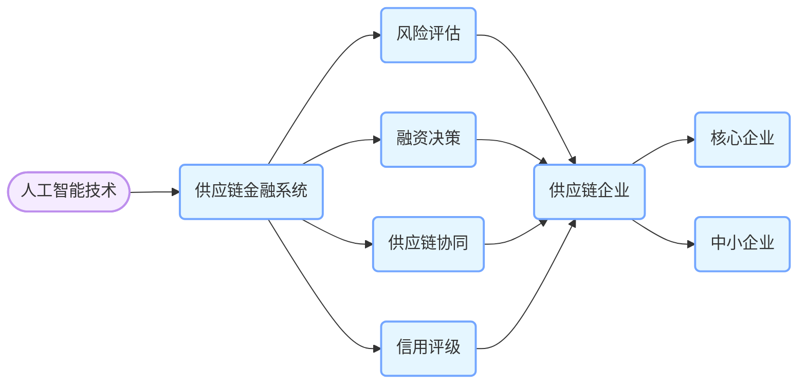

# AI在供应链金融中的深度应用研究

> 关键词：人工智能、供应链金融、深度应用、风险评估、决策优化

> 摘要：本文聚焦于AI在供应链金融中的深度应用，详细探讨了相关核心概念、算法原理、数学模型等内容。首先介绍了研究的背景，包括目的、范围、预期读者等。接着阐述了AI与供应链金融的核心概念及联系，给出了原理和架构的示意图与流程图。深入分析了核心算法原理，并通过Python代码进行详细阐述。对相关数学模型和公式进行了详细讲解并举例说明。通过项目实战展示了代码实际案例及详细解释。探讨了AI在供应链金融中的实际应用场景，推荐了相关的工具和资源。最后总结了未来发展趋势与挑战，解答了常见问题，并提供了扩展阅读和参考资料，旨在为AI在供应链金融领域的应用提供全面且深入的研究。

## 1. 背景介绍 
### 1.1 目的和范围
随着全球经济的发展，供应链金融作为一种创新的金融服务模式，在促进产业协同发展、解决中小企业融资难题等方面发挥着重要作用。然而，传统供应链金融面临着信息不对称、风险评估困难、决策效率低下等问题。人工智能（AI）技术的快速发展为解决这些问题提供了新的思路和方法。本文的目的在于深入研究AI在供应链金融中的深度应用，探索如何利用AI技术提升供应链金融的效率和质量，降低风险。研究范围涵盖了AI在供应链金融各个环节的应用，包括风险评估、融资决策、供应链协同等方面。

### 1.2 预期读者
本文的预期读者包括金融行业从业者，如银行信贷人员、供应链金融业务经理等，他们可以通过本文了解如何利用AI技术优化业务流程，提高风险控制能力；供应链企业管理人员，他们可以借助AI技术加强供应链协同，提升企业竞争力；科研人员和学生，他们可以从本文中获取相关的理论知识和研究思路，为进一步的研究提供参考。

### 1.3 文档结构概述
本文首先介绍研究的背景，包括目的、范围、预期读者和文档结构概述。接着阐述AI与供应链金融的核心概念及联系，给出原理和架构的示意图与流程图。然后深入分析核心算法原理，并通过Python代码进行详细阐述。对相关数学模型和公式进行详细讲解并举例说明。通过项目实战展示代码实际案例及详细解释。探讨AI在供应链金融中的实际应用场景，推荐相关的工具和资源。最后总结未来发展趋势与挑战，解答常见问题，并提供扩展阅读和参考资料。

### 1.4 术语表
#### 1.4.1 核心术语定义
- **人工智能（AI）**：是指计算机系统能够执行通常需要人类智能才能完成的任务，如学习、推理、感知、决策等。
- **供应链金融**：是指金融机构围绕核心企业，管理上下游中小企业的资金流和物流，把单个企业的不可控风险转变为供应链企业整体的可控风险，通过立体获取各类信息，将风险控制在最低的金融服务。
- **风险评估**：是指在金融活动中，对可能面临的风险进行识别、分析和评价的过程。
- **融资决策**：是指金融机构根据企业的信用状况、经营情况等因素，决定是否为企业提供融资以及融资的额度、期限等条件的过程。

#### 1.4.2 相关概念解释
- **机器学习**：是人工智能的一个分支，它使计算机能够通过数据学习模式和规律，而无需明确编程。常见的机器学习算法包括决策树、支持向量机、神经网络等。
- **深度学习**：是机器学习的一个子集，它使用多层神经网络来学习数据的复杂表示。深度学习在图像识别、语音识别、自然语言处理等领域取得了巨大的成功。
- **大数据**：是指海量的数据集合，具有体量大、类型多样、生成速度快等特点。在供应链金融中，大数据可以包括企业的交易数据、物流数据、财务数据等。

#### 1.4.3 缩略词列表
- **AI**：Artificial Intelligence（人工智能）
- **ML**：Machine Learning（机器学习）
- **DL**：Deep Learning（深度学习）
- **SCM**：Supply Chain Management（供应链管理）

## 2. 核心概念与联系 

### 核心概念原理
#### 人工智能原理
人工智能的核心原理是模拟人类的智能行为，通过数据和算法让计算机系统具有学习、推理和决策的能力。机器学习是实现人工智能的重要手段，它通过对大量数据的学习来发现数据中的模式和规律。深度学习则是机器学习的一种高级形式，它使用深度神经网络来自动提取数据的特征，从而实现更复杂的任务，如图像识别、语音识别等。

#### 供应链金融原理
供应链金融的原理是基于供应链上核心企业与上下游中小企业之间的交易关系，金融机构通过对供应链上的资金流、物流和信息流进行整合和管理，为供应链上的企业提供融资服务。其核心是通过对供应链整体风险的评估，降低单个企业的融资风险，实现供应链上企业的协同发展。

### 架构的文本示意图
```plaintext
          ┌───────────────┐
          │  人工智能技术  │
          │  (机器学习、深度学习) │
          └───────────────┘
                   │
                   ▼
┌───────────────────────────────┐
│        供应链金融系统         │
│ ┌───────────┐ ┌───────────┐ │
│ │  风险评估  │ │  融资决策  │ │
│ └───────────┘ └───────────┘ │
│ ┌───────────┐ ┌───────────┐ │
│ │  供应链协同  │ │  信用评级  │ │
│ └───────────┘ └───────────┘ │
└───────────────────────────────┘
                   │
                   ▼
┌───────────────────────────────┐
│        供应链企业             │
│ ┌───────────┐ ┌───────────┐ │
│ │  核心企业  │ │  中小企业  │ │
│ └───────────┘ └───────────┘ │
└───────────────────────────────┘
```

### Mermaid 流程图


## 3. 核心算法原理 & 具体操作步骤 

### 核心算法原理
#### 风险评估算法 - 逻辑回归
逻辑回归是一种常用的分类算法，在供应链金融的风险评估中，可以用于判断企业是否存在违约风险。逻辑回归的基本原理是通过对输入特征进行线性组合，然后通过逻辑函数将其转换为概率值。逻辑函数的表达式为：
$$
\sigma(z)=\frac{1}{1 + e^{-z}}
$$
其中，$z$ 是线性组合的结果，$z = w_0 + w_1x_1 + w_2x_2 + \cdots + w_nx_n$，$w_i$ 是权重，$x_i$ 是输入特征。

#### 融资决策算法 - 决策树
决策树是一种基于树结构进行决策的算法，在融资决策中，可以根据企业的各种特征（如财务状况、信用记录等）构建决策树，从而决定是否为企业提供融资以及融资的额度和期限。决策树的构建过程是通过递归地划分数据集，选择最优的特征进行分裂，直到满足停止条件。

### 具体操作步骤及Python代码实现

#### 风险评估 - 逻辑回归
```python
import numpy as np
from sklearn.linear_model import LogisticRegression
from sklearn.model_selection import train_test_split
from sklearn.metrics import accuracy_score

# 生成示例数据
np.random.seed(42)
X = np.random.randn(100, 5)
y = np.random.randint(0, 2, 100)

# 划分训练集和测试集
X_train, X_test, y_train, y_test = train_test_split(X, y, test_size=0.2, random_state=42)

# 创建逻辑回归模型
model = LogisticRegression()

# 训练模型
model.fit(X_train, y_train)

# 预测
y_pred = model.predict(X_test)

# 计算准确率
accuracy = accuracy_score(y_test, y_pred)
print(f"风险评估准确率: {accuracy}")
```

#### 融资决策 - 决策树
```python
from sklearn.tree import DecisionTreeClassifier

# 创建决策树模型
dt_model = DecisionTreeClassifier()

# 训练模型
dt_model.fit(X_train, y_train)

# 预测
dt_y_pred = dt_model.predict(X_test)

# 计算准确率
dt_accuracy = accuracy_score(y_test, dt_y_pred)
print(f"融资决策准确率: {dt_accuracy}")
```

## 4. 数学模型和公式 & 详细讲解 & 举例说明 

### 逻辑回归数学模型和公式
逻辑回归的目标是找到一组权重 $w$，使得预测的概率尽可能接近真实的标签。为了实现这一目标，通常使用对数损失函数（也称为交叉熵损失函数）来衡量预测概率和真实标签之间的差异。对数损失函数的表达式为：
$$
L(w)=-\frac{1}{N}\sum_{i=1}^{N}[y_i\log(\sigma(z_i))+(1 - y_i)\log(1 - \sigma(z_i))]
$$
其中，$N$ 是样本数量，$y_i$ 是第 $i$ 个样本的真实标签，$\sigma(z_i)$ 是第 $i$ 个样本的预测概率。

为了最小化对数损失函数，通常使用梯度下降法来更新权重 $w$。梯度下降法的更新公式为：
$$
w_{j}=w_{j}-\alpha\frac{\partial L(w)}{\partial w_{j}}
$$
其中，$\alpha$ 是学习率，$\frac{\partial L(w)}{\partial w_{j}}$ 是对数损失函数关于权重 $w_j$ 的偏导数。

### 举例说明
假设我们有一个简单的数据集，包含两个特征 $x_1$ 和 $x_2$，以及一个二元标签 $y$。数据集如下：
| $x_1$ | $x_2$ | $y$ |
| --- | --- | --- |
| 1 | 2 | 0 |
| 2 | 3 | 1 |
| 3 | 4 | 1 |
| 4 | 5 | 0 |

我们可以使用逻辑回归来对这个数据集进行分类。首先，我们需要初始化权重 $w_0$、$w_1$ 和 $w_2$，然后使用梯度下降法来更新权重，直到对数损失函数收敛。

### 决策树数学模型和公式
决策树的构建过程中，通常使用信息增益或基尼不纯度来选择最优的特征进行分裂。

#### 信息增益
信息增益是指在划分数据集前后信息熵的减少量。信息熵的计算公式为：
$$
H(S)=-\sum_{i=1}^{n}p_i\log_2(p_i)
$$
其中，$S$ 是数据集，$p_i$ 是第 $i$ 类样本在数据集中的比例。

信息增益的计算公式为：
$$
IG(S, A)=H(S)-\sum_{v\in Values(A)}\frac{|S_v|}{|S|}H(S_v)
$$
其中，$A$ 是特征，$Values(A)$ 是特征 $A$ 的取值集合，$S_v$ 是根据特征 $A$ 的取值 $v$ 划分得到的子集。

#### 基尼不纯度
基尼不纯度是指从数据集中随机选择一个样本，将其错误分类的概率。基尼不纯度的计算公式为：
$$
Gini(S)=1-\sum_{i=1}^{n}p_i^2
$$
在决策树的构建过程中，我们选择信息增益最大或基尼不纯度最小的特征进行分裂。

### 举例说明
假设我们有一个数据集，包含三个特征 $A$、$B$、$C$ 和一个二元标签 $y$。数据集如下：
| $A$ | $B$ | $C$ | $y$ |
| --- | --- | --- | --- |
| 0 | 1 | 0 | 0 |
| 1 | 1 | 1 | 1 |
| 0 | 0 | 1 | 1 |
| 1 | 0 | 0 | 0 |

我们可以使用信息增益来选择最优的特征进行分裂。首先，计算数据集的信息熵 $H(S)$，然后分别计算每个特征的信息增益 $IG(S, A)$、$IG(S, B)$ 和 $IG(S, C)$，选择信息增益最大的特征进行分裂。

## 5. 项目实战：代码实际案例和详细解释说明 

### 5.1  开发环境搭建
#### 操作系统
可以选择 Windows、Linux 或 macOS 操作系统。建议使用 Linux 系统，因为它在开发和部署方面具有更好的稳定性和兼容性。

#### Python 环境
安装 Python 3.7 及以上版本。可以使用 Anaconda 来管理 Python 环境，它提供了方便的包管理和虚拟环境创建功能。

#### 安装必要的库
使用以下命令安装必要的库：
```bash
pip install numpy pandas scikit-learn matplotlib
```

### 5.2  源代码详细实现和代码解读
#### 数据准备
```python
import pandas as pd

# 读取数据
data = pd.read_csv('supply_chain_finance_data.csv')

# 分离特征和标签
X = data.drop('label', axis=1)
y = data['label']
```
代码解读：首先使用 `pandas` 库读取供应链金融数据集，然后将特征和标签分离。

#### 数据预处理
```python
from sklearn.preprocessing import StandardScaler
from sklearn.model_selection import train_test_split

# 数据标准化
scaler = StandardScaler()
X_scaled = scaler.fit_transform(X)

# 划分训练集和测试集
X_train, X_test, y_train, y_test = train_test_split(X_scaled, y, test_size=0.2, random_state=42)
```
代码解读：使用 `StandardScaler` 对特征进行标准化处理，使特征具有相同的尺度。然后使用 `train_test_split` 函数将数据集划分为训练集和测试集。

#### 模型训练和评估
```python
from sklearn.linear_model import LogisticRegression
from sklearn.metrics import accuracy_score, confusion_matrix

# 创建逻辑回归模型
model = LogisticRegression()

# 训练模型
model.fit(X_train, y_train)

# 预测
y_pred = model.predict(X_test)

# 计算准确率
accuracy = accuracy_score(y_test, y_pred)
print(f"准确率: {accuracy}")

# 计算混淆矩阵
conf_matrix = confusion_matrix(y_test, y_pred)
print(f"混淆矩阵:\n{conf_matrix}")
```
代码解读：创建逻辑回归模型并使用训练集进行训练，然后使用测试集进行预测。计算预测的准确率和混淆矩阵，以评估模型的性能。

### 5.3  代码解读与分析
#### 数据准备部分
读取数据集是整个项目的基础，确保数据的准确性和完整性非常重要。在分离特征和标签时，需要根据数据集的实际情况选择合适的特征和标签列。

#### 数据预处理部分
数据标准化可以使模型更快地收敛，提高模型的性能。划分训练集和测试集的比例需要根据数据集的大小和实际需求进行调整。

#### 模型训练和评估部分
逻辑回归模型是一种简单而有效的分类模型，适用于二分类问题。准确率和混淆矩阵是评估分类模型性能的常用指标。准确率表示模型预测正确的样本占总样本的比例，混淆矩阵可以更详细地展示模型的分类情况，包括真正例、假正例、真反例和假反例。

## 6. 实际应用场景 
### 风险评估
在供应链金融中，风险评估是非常重要的环节。AI技术可以通过对企业的多源数据（如财务数据、交易数据、物流数据等）进行分析，构建风险评估模型，准确地评估企业的违约风险。例如，通过机器学习算法对企业的历史交易数据进行学习，预测企业未来的还款能力和违约概率，为金融机构提供决策依据。

### 融资决策
AI可以帮助金融机构优化融资决策过程。通过对企业的信用状况、经营情况、供应链关系等因素进行综合分析，利用决策树、神经网络等算法，为企业提供个性化的融资方案。例如，根据企业的订单数量、库存水平、应收账款等信息，评估企业的融资需求和还款能力，确定融资额度和期限。

### 供应链协同
AI技术可以促进供应链上企业之间的协同合作。通过对供应链上的信息流、物流和资金流进行实时监控和分析，利用智能合约、区块链等技术，实现供应链上企业之间的信息共享和协同决策。例如，当供应链上的某个环节出现异常情况时，AI系统可以及时发出预警，并自动调整供应链的运作策略，提高供应链的整体效率和稳定性。

### 信用评级
AI可以为供应链上的企业提供更准确的信用评级。传统的信用评级方法主要依赖于企业的财务报表和信用记录，而AI技术可以综合考虑企业的多源数据，如社交媒体数据、市场口碑等，构建更全面、更准确的信用评级模型。例如，通过对企业在社交媒体上的舆情信息进行分析，评估企业的品牌形象和市场声誉，为信用评级提供参考。

## 7. 工具和资源推荐
### 7.1 学习资源推荐
#### 7.1.1 书籍推荐
- 《人工智能：一种现代的方法》：这是一本经典的人工智能教材，涵盖了人工智能的各个领域，包括机器学习、知识表示、推理等，适合初学者和有一定基础的读者。
- 《Python机器学习》：本书详细介绍了Python在机器学习中的应用，包括各种机器学习算法的原理和实现，以及如何使用Python进行数据预处理、模型训练和评估。
- 《供应链金融：理论、实务与案例》：全面介绍了供应链金融的理论和实务，包括供应链金融的模式、风险控制、案例分析等，对于了解供应链金融的基本概念和业务流程非常有帮助。

#### 7.1.2 在线课程
- Coursera上的“机器学习”课程：由斯坦福大学教授Andrew Ng主讲，是一门非常经典的机器学习课程，涵盖了机器学习的基本概念、算法和应用。
- edX上的“人工智能基础”课程：介绍了人工智能的基本概念、技术和应用，包括机器学习、自然语言处理、计算机视觉等领域。
- 中国大学MOOC上的“供应链金融”课程：由国内高校的专家教授授课，系统地介绍了供应链金融的理论和实践，适合对供应链金融感兴趣的学习者。

#### 7.1.3 技术博客和网站
- Medium：一个技术博客平台，上面有很多关于人工智能、供应链金融等领域的优秀文章，作者来自世界各地的技术专家和从业者。
- Kaggle：一个数据科学竞赛平台，上面有很多关于机器学习、数据分析的数据集和竞赛项目，可以通过参与竞赛来提高自己的技术水平。
- 供应链金融网：专门提供供应链金融相关的资讯、研究报告、案例分析等内容，是了解供应链金融行业动态的重要渠道。

### 7.2 开发工具框架推荐
#### 7.2.1 IDE和编辑器
- PyCharm：一款专业的Python集成开发环境，具有代码编辑、调试、自动补全、版本控制等功能，非常适合Python开发。
- Jupyter Notebook：一个交互式的开发环境，可以将代码、文本、图表等内容整合在一起，方便进行数据分析和模型训练。
- Visual Studio Code：一款轻量级的代码编辑器，支持多种编程语言，具有丰富的插件扩展功能，可以根据需要进行个性化配置。

#### 7.2.2 调试和性能分析工具
- PDB：Python自带的调试器，可以帮助开发者在代码运行过程中进行调试，查找和解决问题。
- cProfile：Python的性能分析工具，可以分析代码的运行时间和内存使用情况，帮助开发者优化代码性能。
- TensorBoard：一个可视化工具，主要用于深度学习模型的训练过程监控和结果可视化，可以查看模型的损失函数、准确率等指标的变化情况。

#### 7.2.3 相关框架和库
- Scikit-learn：一个开源的机器学习库，提供了各种机器学习算法的实现，包括分类、回归、聚类等，使用简单方便。
- TensorFlow：一个开源的深度学习框架，由Google开发，广泛应用于图像识别、语音识别、自然语言处理等领域。
- PyTorch：另一个开源的深度学习框架，具有动态图机制，易于使用和调试，在学术界和工业界都有广泛的应用。

### 7.3 相关论文著作推荐
#### 7.3.1 经典论文
- “The Nature of Statistical Learning Theory”：由Vladimir N. Vapnik撰写，是机器学习领域的经典论文，介绍了统计学习理论的基本概念和方法。
- “Deep Residual Learning for Image Recognition”：提出了残差网络（ResNet）的概念，在图像识别领域取得了巨大的成功，是深度学习领域的重要论文之一。
- “Supply Chain Finance: A Literature Review”：对供应链金融的相关研究进行了全面的综述，包括供应链金融的定义、模式、风险控制等方面，为进一步的研究提供了重要的参考。

#### 7.3.2 最新研究成果
- 关注顶级学术会议如NeurIPS（神经信息处理系统大会）、ICML（国际机器学习会议）、KDD（知识发现与数据挖掘会议）等，这些会议上会发表很多关于人工智能和供应链金融的最新研究成果。
- 查阅顶级学术期刊如Journal of Artificial Intelligence Research（JAIR）、Management Science（管理科学）、Journal of Supply Chain Management等，这些期刊上的论文通常具有较高的学术水平和研究价值。

#### 7.3.3 应用案例分析
- 可以参考一些知名企业的供应链金融应用案例，如阿里巴巴的蚂蚁金服、京东的京东金融等。这些企业在供应链金融领域有着丰富的实践经验，其应用案例可以为其他企业提供借鉴和参考。

## 8. 总结：未来发展趋势与挑战
### 未来发展趋势
#### 智能化程度不断提高
随着AI技术的不断发展，供应链金融将更加智能化。未来，AI将能够自动处理和分析海量的供应链数据，实现风险评估、融资决策等环节的自动化和智能化，提高供应链金融的效率和准确性。

#### 与区块链技术深度融合
区块链技术具有去中心化、不可篡改、可追溯等特点，与供应链金融的业务需求高度契合。未来，AI与区块链技术将深度融合，实现供应链金融数据的安全共享和可信流转，提高供应链金融的透明度和可信度。

#### 拓展应用场景
除了现有的风险评估、融资决策等应用场景，AI在供应链金融中的应用场景将不断拓展。例如，AI可以用于供应链金融的产品创新，开发出更加个性化、定制化的金融产品；可以用于供应链金融的监管，提高监管的效率和精准度。

### 挑战
#### 数据质量和隐私问题
AI技术的应用依赖于大量的高质量数据。然而，在供应链金融领域，数据质量参差不齐，存在数据缺失、错误、不一致等问题。此外，数据隐私和安全也是一个重要的问题，如何在保护数据隐私的前提下，充分利用数据进行分析和决策，是需要解决的挑战之一。

#### 算法可解释性问题
很多AI算法，如深度学习算法，是一种黑盒模型，其决策过程难以解释。在供应链金融领域，金融机构和企业需要了解模型的决策依据，以便进行风险控制和决策。因此，如何提高AI算法的可解释性，是一个亟待解决的问题。

#### 人才短缺问题
AI在供应链金融中的应用需要既懂AI技术又懂供应链金融业务的复合型人才。然而，目前市场上这类人才非常短缺，如何培养和吸引复合型人才，是推动AI在供应链金融中应用的关键。

## 9. 附录：常见问题与解答
### 问题1：AI在供应链金融中的应用是否会完全取代人工决策？
解答：不会。虽然AI技术可以提高供应链金融的效率和准确性，但它不能完全取代人工决策。在供应链金融中，存在很多复杂的情况和因素，需要人类的经验和判断力来进行综合考虑。例如，在一些特殊的融资项目中，需要人工对企业的实际情况进行实地考察和评估。AI技术可以为人工决策提供支持和参考，帮助人类做出更科学、更合理的决策。

### 问题2：如何确保AI模型在供应链金融中的可靠性和稳定性？
解答：可以从以下几个方面确保AI模型的可靠性和稳定性：
- 数据质量：使用高质量、准确、完整的数据进行模型训练，对数据进行预处理和清洗，去除噪声和异常值。
- 模型评估：使用多种评估指标对模型进行评估，如准确率、召回率、F1值等，同时进行交叉验证和模型选择，选择最优的模型。
- 模型监控：在模型上线后，对模型的性能进行实时监控，及时发现和处理模型的异常情况，如模型漂移等。
- 模型更新：随着供应链金融业务的发展和数据的变化，及时对模型进行更新和优化，以保证模型的可靠性和稳定性。

### 问题3：AI在供应链金融中的应用会带来哪些新的风险？
解答：AI在供应链金融中的应用可能会带来以下新的风险：
- 算法风险：AI算法可能存在缺陷或漏洞，导致模型的预测结果不准确，从而给金融机构和企业带来风险。
- 数据安全风险：AI技术的应用需要大量的数据，数据的泄露和滥用可能会导致企业的商业机密和客户信息泄露，给企业带来损失。
- 技术依赖风险：过度依赖AI技术可能会导致金融机构和企业在面对技术故障或系统崩溃时无法正常开展业务，带来业务中断风险。

## 10. 扩展阅读 & 参考资料
### 扩展阅读
- 《人工智能时代的供应链金融创新》：深入探讨了AI技术在供应链金融创新中的应用和发展趋势。
- 《区块链与供应链金融：理论与实践》：介绍了区块链技术在供应链金融中的应用原理和实践案例。
- 《大数据驱动的供应链金融风险管理》：研究了如何利用大数据和AI技术进行供应链金融的风险管理。

### 参考资料
- 相关学术论文和研究报告，如IEEE Transactions on Artificial Intelligence、Journal of Financial Economics等期刊上的论文。
- 行业报告和白皮书，如麦肯锡、波士顿咨询等咨询公司发布的关于供应链金融和AI应用的报告。
- 相关法律法规和政策文件，如中国人民银行、银保监会等发布的关于金融科技和供应链金融的政策文件。

作者：AI天才研究院/AI Genius Institute & 禅与计算机程序设计艺术 /Zen And The Art of Computer Programming