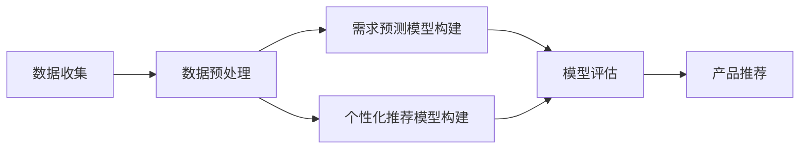

# AI在保险产品需求预测与个性化推荐中的深度应用

> 关键词：人工智能、保险产品、需求预测、个性化推荐、数据挖掘

> 摘要：本文深入探讨了人工智能在保险产品需求预测与个性化推荐中的应用。首先介绍了研究的背景、目的、预期读者等内容。接着阐述了核心概念及其联系，包括人工智能、需求预测和个性化推荐的原理与架构。详细讲解了核心算法原理及具体操作步骤，结合Python代码进行说明。给出了相关的数学模型和公式，并举例说明。通过项目实战，展示了开发环境搭建、源代码实现及解读。分析了实际应用场景，推荐了学习资源、开发工具框架和相关论文著作。最后总结了未来发展趋势与挑战，并给出常见问题解答和扩展阅读参考资料，旨在为保险行业利用人工智能提升业务水平提供全面的技术指导。

## 1. 背景介绍 
### 1.1 目的和范围
随着保险市场的竞争日益激烈，保险公司需要更精准地了解客户需求，提供个性化的保险产品推荐，以提高客户满意度和市场竞争力。本研究的目的是探讨如何利用人工智能技术实现保险产品的需求预测和个性化推荐，从而优化保险业务流程，提升运营效率和服务质量。研究范围涵盖了人工智能在保险领域的主要应用场景，包括数据收集、预处理、模型构建、预测和推荐等环节。

### 1.2 预期读者
本文的预期读者包括保险行业的从业者，如保险产品经理、市场营销人员、数据分析人员等，他们可以从中获取关于如何应用人工智能技术改进业务的思路和方法；同时也适合对人工智能在金融领域应用感兴趣的研究人员和学生，为他们提供相关的理论和实践参考。

### 1.3 文档结构概述
本文将按照以下结构进行组织：首先介绍核心概念与联系，明确相关术语和概念的定义；然后详细阐述核心算法原理及具体操作步骤，结合Python代码进行实现；接着给出数学模型和公式，并举例说明其应用；通过项目实战展示如何将理论应用到实际中；分析实际应用场景，探讨人工智能在保险业务中的具体应用方式；推荐学习资源、开发工具框架和相关论文著作；最后总结未来发展趋势与挑战，提供常见问题解答和扩展阅读参考资料。

### 1.4 术语表
#### 1.4.1 核心术语定义
- **人工智能（Artificial Intelligence，AI）**：是一门研究如何使计算机系统能够模拟人类智能的学科，包括机器学习、深度学习、自然语言处理等技术。
- **保险产品需求预测**：通过对客户数据的分析和挖掘，预测客户对不同保险产品的需求概率。
- **个性化推荐**：根据客户的个人特征、行为数据和历史购买记录等信息，为客户提供符合其特定需求的保险产品推荐。
- **机器学习（Machine Learning，ML）**：是人工智能的一个分支，通过让计算机从数据中学习模式和规律，从而实现预测和决策的能力。
- **深度学习（Deep Learning，DL）**：是机器学习的一种，使用多层神经网络模型来学习数据的复杂特征和表示。

#### 1.4.2 相关概念解释
- **数据挖掘**：从大量数据中发现有价值的信息和知识的过程，常用于客户细分、需求预测等任务。
- **特征工程**：对原始数据进行处理和转换，提取出对模型有意义的特征，以提高模型的性能。
- **模型评估**：使用特定的指标和方法对训练好的模型进行评估，衡量模型的预测能力和准确性。

#### 1.4.3 缩略词列表
- **AI**：Artificial Intelligence（人工智能）
- **ML**：Machine Learning（机器学习）
- **DL**：Deep Learning（深度学习）
- **KNN**：K-Nearest Neighbors（K近邻算法）
- **SVM**：Support Vector Machine（支持向量机）
- **DNN**：Deep Neural Network（深度神经网络）

## 2. 核心概念与联系 
### 核心概念原理
#### 人工智能
人工智能是一个广泛的领域，旨在使计算机系统能够模拟人类的智能行为。在保险产品需求预测与个性化推荐中，主要应用机器学习和深度学习技术。机器学习通过让计算机从数据中学习模式和规律，从而实现对未知数据的预测和分类。深度学习则是使用多层神经网络模型，能够自动学习数据的复杂特征和表示，在处理大规模数据和复杂任务时表现出色。

#### 保险产品需求预测
保险产品需求预测是基于客户的各种信息，如年龄、性别、收入、职业、健康状况等，通过建立预测模型来预测客户对不同保险产品的需求概率。常用的预测方法包括回归分析、分类算法等。通过需求预测，保险公司可以提前了解客户的潜在需求，制定相应的营销策略。

#### 个性化推荐
个性化推荐是根据客户的个人特征、行为数据和历史购买记录等信息，为客户提供符合其特定需求的保险产品推荐。推荐系统通常采用协同过滤、内容推荐等算法，通过分析客户之间的相似性或产品的特征，为客户推荐最适合的保险产品。个性化推荐可以提高客户的购买意愿和满意度，增加保险公司的业务收入。

### 架构的文本示意图
```plaintext
+----------------------+
|      数据收集       |
| (客户信息、市场数据等)|
+----------------------+
         |
         v
+----------------------+
|      数据预处理     |
| (清洗、特征工程等)    |
+----------------------+
         |
         v
+----------------------+
|    需求预测模型构建  |
| (机器学习、深度学习)  |
+----------------------+
         |
         v
+----------------------+
|    个性化推荐模型构建|
| (协同过滤、内容推荐)  |
+----------------------+
         |
         v
+----------------------+
|      模型评估       |
| (准确率、召回率等)    |
+----------------------+
         |
         v
+----------------------+
|      产品推荐       |
| (向客户推荐保险产品) |
+----------------------+
```

### Mermaid 流程图


## 3. 核心算法原理 & 具体操作步骤 
### 核心算法原理
#### 机器学习算法 - K近邻算法（KNN）
K近邻算法是一种简单而有效的分类和回归算法。其基本思想是：对于一个待预测的样本，在训练数据集中找到与其最近的K个样本，然后根据这K个样本的类别或数值来决定待预测样本的类别或数值。在保险产品需求预测中，可以将客户的特征向量作为样本，根据K个最近邻客户的保险购买情况来预测待预测客户的需求。

#### 深度学习算法 - 深度神经网络（DNN）
深度神经网络是一种具有多个隐藏层的神经网络模型。它通过多层神经元的非线性变换，能够自动学习数据的复杂特征和表示。在保险产品需求预测和个性化推荐中，DNN可以处理高维、复杂的数据，如客户的文本描述、图像等。通过对大量数据的训练，DNN可以学习到客户特征与保险产品需求之间的复杂关系，从而实现更准确的预测和推荐。

### 具体操作步骤
#### 数据收集
收集客户的各种信息，包括基本信息（年龄、性别、收入等）、行为数据（浏览记录、购买记录等）、市场数据（保险产品价格、竞争情况等）。可以通过保险业务系统、网站日志、第三方数据提供商等渠道获取数据。

#### 数据预处理
- **数据清洗**：去除数据中的噪声、缺失值和异常值。可以使用均值、中位数等方法填充缺失值，使用统计方法检测和处理异常值。
- **特征工程**：对原始数据进行处理和转换，提取出对模型有意义的特征。例如，将类别型特征进行编码，将连续型特征进行归一化处理。

#### 模型训练
- **划分数据集**：将预处理后的数据划分为训练集、验证集和测试集。训练集用于模型的训练，验证集用于调整模型的超参数，测试集用于评估模型的性能。
- **选择算法和模型**：根据问题的特点和数据的规模，选择合适的算法和模型，如KNN、DNN等。
- **训练模型**：使用训练集对模型进行训练，调整模型的参数，使模型能够学习到数据中的模式和规律。

#### 模型评估
使用验证集和测试集对训练好的模型进行评估，常用的评估指标包括准确率、召回率、F1值、均方误差等。根据评估结果，调整模型的超参数或选择更合适的模型。

#### 产品推荐
使用训练好的模型对客户进行需求预测和个性化推荐。根据预测结果，为客户推荐最适合的保险产品。

### Python源代码实现
```python
import numpy as np
from sklearn.neighbors import KNeighborsClassifier
from sklearn.model_selection import train_test_split
from sklearn.preprocessing import StandardScaler
from sklearn.metrics import accuracy_score

# 生成示例数据
X = np.random.rand(100, 5)  # 100个样本，每个样本有5个特征
y = np.random.randint(0, 2, 100)  # 二分类标签

# 划分数据集
X_train, X_test, y_train, y_test = train_test_split(X, y, test_size=0.2, random_state=42)

# 数据预处理 - 标准化
scaler = StandardScaler()
X_train = scaler.fit_transform(X_train)
X_test = scaler.transform(X_test)

# 选择模型 - KNN
knn = KNeighborsClassifier(n_neighbors=5)

# 训练模型
knn.fit(X_train, y_train)

# 预测
y_pred = knn.predict(X_test)

# 评估模型
accuracy = accuracy_score(y_test, y_pred)
print(f"模型准确率: {accuracy}")
```

## 4. 数学模型和公式 & 详细讲解 & 举例说明 
### K近邻算法（KNN）
#### 数学模型和公式
在K近邻算法中，对于一个待预测的样本 $x$，需要计算它与训练数据集中每个样本 $x_i$ 的距离 $d(x, x_i)$。常用的距离度量方法是欧氏距离：
$$d(x, x_i) = \sqrt{\sum_{j=1}^{n}(x_j - x_{ij})^2}$$
其中，$n$ 是特征的数量，$x_j$ 是待预测样本 $x$ 的第 $j$ 个特征，$x_{ij}$ 是训练样本 $x_i$ 的第 $j$ 个特征。

然后，选择距离最近的K个样本，根据这K个样本的类别进行投票，得到待预测样本的类别。对于分类问题，投票的规则通常是多数表决：
$$\hat{y} = \arg\max_{c \in C} \sum_{i=1}^{K} I(y_i = c)$$
其中，$\hat{y}$ 是待预测样本的预测类别，$C$ 是所有可能的类别集合，$y_i$ 是第 $i$ 个最近邻样本的真实类别，$I$ 是指示函数，如果 $y_i = c$ 则 $I(y_i = c) = 1$，否则 $I(y_i = c) = 0$。

#### 详细讲解
K近邻算法的核心思想是基于“物以类聚”的原则，即相似的样本具有相似的类别。通过计算待预测样本与训练样本的距离，找到最近的K个样本，然后根据这K个样本的类别来决定待预测样本的类别。K值的选择是K近邻算法的一个重要超参数，K值过小可能会导致过拟合，K值过大可能会导致欠拟合。

#### 举例说明
假设有一个简单的二分类问题，训练数据集中有3个样本：$x_1 = [1, 2]$，$y_1 = 0$；$x_2 = [3, 4]$，$y_2 = 1$；$x_3 = [5, 6]$，$y_3 = 1$。待预测样本 $x = [2, 3]$。

首先，计算 $x$ 与每个训练样本的欧氏距离：
- $d(x, x_1) = \sqrt{(2 - 1)^2 + (3 - 2)^2} = \sqrt{2}$
- $d(x, x_2) = \sqrt{(2 - 3)^2 + (3 - 4)^2} = \sqrt{2}$
- $d(x, x_3) = \sqrt{(2 - 5)^2 + (3 - 6)^2} = \sqrt{18}$

选择K = 2，距离最近的2个样本是 $x_1$ 和 $x_2$，它们的类别分别是 $y_1 = 0$ 和 $y_2 = 1$。由于 $0$ 和 $1$ 各有一个，我们可以根据具体的投票规则（如随机选择）来决定待预测样本的类别。

### 深度神经网络（DNN）
#### 数学模型和公式
深度神经网络由输入层、多个隐藏层和输出层组成。对于一个具有 $L$ 层的神经网络，第 $l$ 层的输出 $a^{(l)}$ 可以通过以下公式计算：
$$z^{(l)} = W^{(l)}a^{(l - 1)} + b^{(l)}$$
$$a^{(l)} = f(z^{(l)})$$
其中，$W^{(l)}$ 是第 $l$ 层的权重矩阵，$b^{(l)}$ 是第 $l$ 层的偏置向量，$f$ 是激活函数，如Sigmoid函数、ReLU函数等。

在训练过程中，通常使用损失函数来衡量模型的预测结果与真实标签之间的差异。对于分类问题，常用的损失函数是交叉熵损失函数：
$$L(y, \hat{y}) = -\sum_{i=1}^{n} y_i \log(\hat{y}_i)$$
其中，$y$ 是真实标签，$\hat{y}$ 是模型的预测结果，$n$ 是样本的数量。

通过反向传播算法，根据损失函数对模型的参数 $W$ 和 $b$ 进行更新，以最小化损失函数：
$$\theta = \theta - \alpha \frac{\partial L}{\partial \theta}$$
其中，$\theta$ 表示模型的参数（$W$ 和 $b$），$\alpha$ 是学习率。

#### 详细讲解
深度神经网络通过多层神经元的非线性变换，能够自动学习数据的复杂特征和表示。输入层接收原始数据，隐藏层对数据进行特征提取和变换，输出层输出模型的预测结果。激活函数的作用是引入非线性因素，使神经网络能够学习到更复杂的函数关系。损失函数用于衡量模型的性能，反向传播算法用于更新模型的参数，使模型不断优化。

#### 举例说明
假设有一个简单的两层神经网络，输入层有2个神经元，隐藏层有3个神经元，输出层有1个神经元。输入样本 $x = [x_1, x_2]$，隐藏层的权重矩阵 $W^{(1)}$ 是一个 $3 \times 2$ 的矩阵，偏置向量 $b^{(1)}$ 是一个长度为3的向量，输出层的权重矩阵 $W^{(2)}$ 是一个 $1 \times 3$ 的矩阵，偏置向量 $b^{(2)}$ 是一个长度为1的向量。

首先，计算隐藏层的输入 $z^{(1)}$：
$$z^{(1)} = W^{(1)}x + b^{(1)}$$
然后，使用激活函数（如ReLU函数）计算隐藏层的输出 $a^{(1)}$：
$$a^{(1)} = \max(0, z^{(1)})$$
接着，计算输出层的输入 $z^{(2)}$：
$$z^{(2)} = W^{(2)}a^{(1)} + b^{(2)}$$
最后，使用Sigmoid函数计算输出层的输出 $\hat{y}$：
$$\hat{y} = \frac{1}{1 + e^{-z^{(2)}}}$$

根据真实标签 $y$ 和预测结果 $\hat{y}$，计算交叉熵损失函数 $L(y, \hat{y})$，并使用反向传播算法更新模型的参数 $W^{(1)}$、$b^{(1)}$、$W^{(2)}$ 和 $b^{(2)}$。

## 5. 项目实战：代码实际案例和详细解释说明 
### 5.1  开发环境搭建
#### 安装Python
首先，需要安装Python环境。可以从Python官方网站（https://www.python.org/downloads/）下载适合自己操作系统的Python安装包，并按照安装向导进行安装。建议安装Python 3.6及以上版本。

#### 安装必要的库
使用pip命令安装以下必要的库：
```sh
pip install numpy pandas scikit-learn tensorflow keras
```
- **numpy**：用于数值计算和数组操作。
- **pandas**：用于数据处理和分析。
- **scikit-learn**：提供了丰富的机器学习算法和工具。
- **tensorflow** 和 **keras**：用于深度学习模型的构建和训练。

### 5.2  源代码详细实现和代码解读
```python
import pandas as pd
import numpy as np
from sklearn.model_selection import train_test_split
from sklearn.preprocessing import StandardScaler
from tensorflow.keras.models import Sequential
from tensorflow.keras.layers import Dense
from sklearn.metrics import accuracy_score

# 读取数据
data = pd.read_csv('insurance_data.csv')

# 数据预处理
# 假设数据集中有特征列 'age', 'gender', 'income' 和目标列 'insurance_need'
X = data[['age', 'gender', 'income']]
y = data['insurance_need']

# 对类别型特征进行编码
X = pd.get_dummies(X, columns=['gender'])

# 划分数据集
X_train, X_test, y_train, y_test = train_test_split(X, y, test_size=0.2, random_state=42)

# 数据标准化
scaler = StandardScaler()
X_train = scaler.fit_transform(X_train)
X_test = scaler.transform(X_test)

# 构建深度神经网络模型
model = Sequential()
model.add(Dense(10, input_dim=X_train.shape[1], activation='relu'))
model.add(Dense(10, activation='relu'))
model.add(Dense(1, activation='sigmoid'))

# 编译模型
model.compile(loss='binary_crossentropy', optimizer='adam', metrics=['accuracy'])

# 训练模型
model.fit(X_train, y_train, epochs=50, batch_size=32, validation_split=0.1)

# 预测
y_pred = model.predict(X_test)
y_pred = (y_pred > 0.5).astype(int)

# 评估模型
accuracy = accuracy_score(y_test, y_pred)
print(f"模型准确率: {accuracy}")
```

### 5.3  代码解读与分析
#### 数据读取和预处理
- 使用 `pandas` 库的 `read_csv` 函数读取保险数据集。
- 提取特征列和目标列，对类别型特征 `gender` 进行独热编码，将其转换为数值型特征。
- 使用 `train_test_split` 函数将数据集划分为训练集和测试集，测试集占比为20%。
- 使用 `StandardScaler` 对特征数据进行标准化处理，使特征数据具有零均值和单位方差。

#### 模型构建
- 使用 `Sequential` 模型构建一个简单的深度神经网络，包含两个隐藏层和一个输出层。
- 隐藏层使用ReLU激活函数，输出层使用Sigmoid激活函数，适用于二分类问题。

#### 模型编译和训练
- 使用 `compile` 方法编译模型，指定损失函数为二元交叉熵损失函数，优化器为Adam优化器，评估指标为准确率。
- 使用 `fit` 方法训练模型，指定训练的轮数为50，批量大小为32，同时使用10%的训练数据作为验证集。

#### 模型预测和评估
- 使用训练好的模型对测试集进行预测，将预测结果转换为二进制标签。
- 使用 `accuracy_score` 函数计算模型的准确率。

## 6. 实际应用场景 
### 客户细分与精准营销
通过人工智能技术对客户进行细分，将客户分为不同的群体，如高风险客户、低风险客户、年轻客户、老年客户等。针对不同的客户群体，制定个性化的营销策略，推荐适合他们的保险产品。例如，对于年轻客户，可以推荐一些短期、灵活的保险产品；对于老年客户，可以推荐一些健康保险和养老保险产品。

### 风险评估与定价
利用人工智能算法对客户的风险进行评估，根据客户的个人特征、行为数据和历史记录等信息，预测客户发生保险事故的概率。根据风险评估结果，为客户制定合理的保险费率，实现差异化定价。例如，对于驾驶记录良好的客户，可以给予较低的车险费率；对于患有某些疾病的客户，可以提高健康保险的费率。

### 客户服务与智能客服
在客户服务方面，人工智能可以实现智能客服功能。通过自然语言处理技术，智能客服可以理解客户的问题，并提供准确的回答和解决方案。同时，智能客服还可以根据客户的问题和需求，为客户推荐合适的保险产品。例如，当客户询问关于医疗保险的问题时，智能客服可以详细介绍不同医疗保险产品的特点和优势，并根据客户的情况进行推荐。

### 欺诈检测
人工智能可以用于保险欺诈检测。通过分析客户的理赔数据和行为模式，建立欺诈检测模型，识别可能的欺诈行为。例如，对于一些频繁申请理赔、理赔金额异常高的客户，系统可以自动进行预警和调查，降低保险公司的欺诈损失。

## 7. 工具和资源推荐
### 7.1 学习资源推荐
#### 7.1.1 书籍推荐
- 《机器学习》（周志华）：全面介绍了机器学习的基本概念、算法和应用，是机器学习领域的经典教材。
- 《深度学习》（Ian Goodfellow、Yoshua Bengio、Aaron Courville）：深入讲解了深度学习的理论和实践，是深度学习领域的权威著作。
- 《Python机器学习》（Sebastian Raschka）：结合Python代码，详细介绍了机器学习的算法和应用，适合初学者入门。

#### 7.1.2 在线课程
- Coursera上的“机器学习”课程（Andrew Ng教授）：由机器学习领域的知名专家授课，系统地介绍了机器学习的基本概念和算法。
- edX上的“深度学习微硕士项目”：提供了深度学习的全面课程，包括神经网络、卷积神经网络、循环神经网络等内容。
- 中国大学MOOC上的“人工智能基础”课程：适合初学者了解人工智能的基本概念和技术。

#### 7.1.3 技术博客和网站
- Medium：有很多关于人工智能和机器学习的优秀博客文章，涵盖了最新的研究成果和应用案例。
- Kaggle：是一个数据科学竞赛平台，提供了丰富的数据集和代码示例，有助于学习和实践机器学习算法。
- 机器之心：专注于人工智能领域的资讯和技术分享，及时报道最新的行业动态和技术进展。

### 7.2 开发工具框架推荐
#### 7.2.1 IDE和编辑器
- PyCharm：是一款专业的Python集成开发环境，提供了丰富的代码编辑、调试和项目管理功能。
- Jupyter Notebook：是一个交互式的开发环境，适合进行数据探索和模型实验，支持Python、R等多种编程语言。
- Visual Studio Code：是一款轻量级的代码编辑器，支持多种编程语言和插件，具有良好的扩展性。

#### 7.2.2 调试和性能分析工具
- TensorBoard：是TensorFlow提供的可视化工具，可以用于可视化模型的训练过程、网络结构和性能指标等。
- Py-Spy：是一个用于Python代码性能分析的工具，可以帮助找出代码中的性能瓶颈。
- Scikit-learn的交叉验证工具：可以用于评估模型的性能和选择最优的超参数。

#### 7.2.3 相关框架和库
- TensorFlow：是一个开源的深度学习框架，提供了丰富的工具和接口，支持大规模分布式训练。
- PyTorch：是另一个流行的深度学习框架，具有简洁的API和动态图机制，适合快速开发和研究。
- Scikit-learn：是一个简单易用的机器学习库，提供了各种机器学习算法和工具，如分类、回归、聚类等。

### 7.3 相关论文著作推荐
#### 7.3.1 经典论文
- “Neural Networks and Deep Learning”（Michael Nielsen）：介绍了神经网络和深度学习的基本原理和算法，是深度学习领域的经典论文。
- “Support-Vector Networks”（Corinna Cortes、Vladimir Vapnik）：提出了支持向量机的理论和算法，是机器学习领域的重要论文。
- “A Logical Calculus of the Ideas Immanent in Nervous Activity”（Warren McCulloch、Walter Pitts）：是神经网络领域的开山之作，提出了神经元模型。

#### 7.3.2 最新研究成果
- 在顶级学术会议如NeurIPS、ICML、CVPR等上发表的关于人工智能在保险领域应用的研究论文，关注最新的技术和方法。
- 各大科研机构和高校的研究报告，如斯坦福大学、麻省理工学院等的相关研究成果。

#### 7.3.3 应用案例分析
- 一些保险公司发布的关于人工智能应用的案例报告，如平安保险、中国人寿等的相关实践经验。
- 咨询公司和行业研究机构的报告，如麦肯锡、波士顿咨询等的研究成果，分析人工智能在保险行业的应用现状和发展趋势。

## 8. 总结：未来发展趋势与挑战
### 未来发展趋势
#### 融合多模态数据
未来，人工智能在保险产品需求预测与个性化推荐中将融合更多类型的数据，如文本、图像、语音等多模态数据。例如，通过分析客户的社交媒体文本、医疗影像等信息，更全面地了解客户的需求和风险状况，提供更精准的推荐。

#### 强化学习的应用
强化学习可以在动态环境中进行决策优化，未来有望在保险业务中得到更广泛的应用。例如，通过强化学习算法，根据客户的实时行为和市场变化，动态调整保险产品的推荐策略和定价方案。

#### 与区块链技术结合
区块链技术具有去中心化、不可篡改、安全可靠等特点，与人工智能结合可以提高保险业务的透明度和可信度。例如，利用区块链记录客户的保险信息和理赔记录，人工智能可以更准确地进行风险评估和欺诈检测。

### 挑战
#### 数据隐私和安全问题
在收集和使用客户数据时，需要严格遵守数据隐私和安全法规，保护客户的个人信息不被泄露。同时，要防止数据被恶意攻击和篡改，确保数据的安全性和完整性。

#### 模型可解释性
深度学习模型通常是黑盒模型，难以解释其决策过程和结果。在保险领域，模型的可解释性非常重要，因为保险公司需要向客户解释为什么推荐某个保险产品或制定某个保险费率。因此，需要研究和开发可解释的人工智能模型。

#### 技术人才短缺
人工智能技术的应用需要具备专业知识和技能的人才，包括数据科学家、机器学习工程师等。目前，保险行业中这类技术人才相对短缺，需要加强人才培养和引进。

## 9. 附录：常见问题与解答
### 问题1：如何选择合适的人工智能算法用于保险产品需求预测和个性化推荐？
解答：选择合适的算法需要考虑多个因素，如数据的规模和特征、问题的复杂度、模型的可解释性等。如果数据规模较小且特征较为简单，可以选择传统的机器学习算法，如K近邻算法、逻辑回归等；如果数据规模较大且特征复杂，可以考虑使用深度学习算法，如深度神经网络。同时，还可以通过交叉验证等方法对不同算法进行评估和比较，选择性能最优的算法。

### 问题2：数据预处理在人工智能应用中重要吗？
解答：数据预处理非常重要。原始数据通常存在噪声、缺失值和异常值等问题，如果不进行预处理，会影响模型的性能和准确性。数据预处理包括数据清洗、特征工程等步骤，可以提高数据的质量和可用性，使模型能够更好地学习数据中的模式和规律。

### 问题3：如何评估人工智能模型在保险产品需求预测和个性化推荐中的性能？
解答：常用的评估指标包括准确率、召回率、F1值、均方误差等。对于分类问题，可以使用准确率、召回率和F1值来评估模型的分类性能；对于回归问题，可以使用均方误差来评估模型的预测准确性。此外，还可以使用交叉验证等方法对模型进行评估，以确保模型的泛化能力。

### 问题4：人工智能在保险领域的应用会取代人类保险顾问吗？
解答：人工智能在保险领域的应用可以提高效率和准确性，但不会完全取代人类保险顾问。人类保险顾问具有丰富的经验和专业知识，能够与客户进行面对面的沟通和交流，了解客户的个性化需求和情感因素。人工智能可以作为辅助工具，为保险顾问提供数据支持和决策建议，两者相互结合可以提供更好的服务。

## 10. 扩展阅读 & 参考资料
### 扩展阅读
- 《人工智能时代的保险革命》：深入探讨了人工智能对保险行业的影响和变革，介绍了人工智能在保险业务各个环节的应用案例和实践经验。
- 《智能保险：科技驱动保险新未来》：分析了保险科技的发展趋势和应用场景，包括人工智能、区块链、大数据等技术在保险领域的应用。

### 参考资料
- 各保险公司的官方网站和年报，获取保险业务数据和行业信息。
- 学术数据库，如IEEE Xplore、ACM Digital Library等，查阅人工智能和保险领域的学术论文。
- 行业报告和研究机构的出版物，如艾瑞咨询、易观智库等的相关报告。

作者：AI天才研究院/AI Genius Institute & 禅与计算机程序设计艺术 /Zen And The Art of Computer Programming