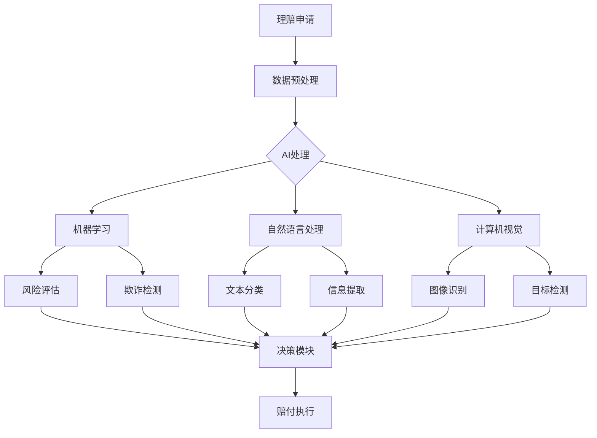

# AI在保险理赔自动化中的创新应用

> 关键词：AI、保险理赔自动化、机器学习、自然语言处理、计算机视觉、创新应用、风险评估

> 摘要：本文深入探讨了AI在保险理赔自动化中的创新应用。随着科技的飞速发展，AI技术为保险理赔领域带来了巨大的变革。文章首先介绍了研究的背景、目的、预期读者和文档结构，接着阐述了AI相关的核心概念及其联系，详细讲解了核心算法原理和具体操作步骤，并给出了数学模型和公式。通过实际的项目实战案例，展示了AI在保险理赔自动化中的具体实现和代码解读。同时，分析了AI在保险理赔自动化中的实际应用场景，推荐了相关的工具和资源。最后，总结了未来的发展趋势与挑战，并提供了常见问题的解答和扩展阅读参考资料。旨在为保险行业从业者和对AI技术应用感兴趣的人士提供全面而深入的了解。

## 1. 背景介绍 
### 1.1 目的和范围
保险理赔是保险业务流程中的关键环节，传统的理赔方式存在效率低下、成本高、易出错等问题。本研究的目的在于探索AI技术如何应用于保险理赔自动化，以提高理赔效率、降低成本、提升客户满意度，并改善风险评估的准确性。研究范围涵盖了AI在理赔流程各个阶段的应用，包括理赔申请受理、损失评估、欺诈检测、赔付决策等，同时涉及到相关的机器学习算法、自然语言处理技术和计算机视觉技术等。

### 1.2 预期读者
本文的预期读者包括保险行业的从业者，如理赔专员、风险评估师、保险产品开发人员等，他们可以从中了解AI技术在保险理赔中的应用，为实际工作提供参考；还包括对AI技术在金融领域应用感兴趣的技术人员，如数据科学家、机器学习工程师等，他们可以深入了解AI在保险理赔自动化中的具体实现和挑战；此外，也适合保险行业的研究者和学者，为他们的研究提供新的思路和方向。

### 1.3 文档结构概述
本文将按照以下结构进行阐述：首先介绍AI在保险理赔自动化中的核心概念与联系，包括AI技术的分类和在理赔流程中的作用；接着详细讲解核心算法原理和具体操作步骤，通过Python代码示例进行说明；然后给出相关的数学模型和公式，并进行详细讲解和举例；通过项目实战案例，展示AI在保险理赔自动化中的具体实现和代码解读；分析AI在保险理赔自动化中的实际应用场景；推荐相关的工具和资源，包括学习资源、开发工具框架和相关论文著作；最后总结未来的发展趋势与挑战，提供常见问题的解答和扩展阅读参考资料。

### 1.4 术语表
#### 1.4.1 核心术语定义
- **AI（Artificial Intelligence）**：人工智能，是指让计算机模拟人类智能的技术和方法，包括机器学习、自然语言处理、计算机视觉等领域。
- **保险理赔自动化**：利用计算机技术和AI算法，自动处理保险理赔申请、评估损失、检测欺诈和做出赔付决策的过程。
- **机器学习（Machine Learning）**：AI的一个分支，通过让计算机从数据中学习模式和规律，从而进行预测和决策。
- **自然语言处理（Natural Language Processing，NLP）**：AI的一个领域，研究如何让计算机理解和处理人类语言，包括文本分类、情感分析、信息提取等任务。
- **计算机视觉（Computer Vision）**：AI的一个领域，研究如何让计算机理解和处理图像和视频数据，包括图像识别、目标检测、图像分割等任务。

#### 1.4.2 相关概念解释
- **理赔流程**：包括理赔申请、受理、调查、评估、决策和赔付等环节，是保险业务中客户获得赔偿的过程。
- **风险评估**：在保险理赔中，对理赔申请的风险程度进行评估，以确定是否赔付以及赔付的金额。
- **欺诈检测**：通过分析理赔申请的数据和特征，识别可能存在的欺诈行为，避免保险公司的损失。

#### 1.4.3 缩略词列表
- **AI**：Artificial Intelligence
- **NLP**：Natural Language Processing
- **CV**：Computer Vision
- **ML**：Machine Learning
- **DNN**：Deep Neural Network
- **CNN**：Convolutional Neural Network
- **RNN**：Recurrent Neural Network

## 2. 核心概念与联系 
### 核心概念原理
在保险理赔自动化中，主要涉及到的AI技术包括机器学习、自然语言处理和计算机视觉。

#### 机器学习
机器学习是让计算机从数据中学习模式和规律的技术。在保险理赔自动化中，常用的机器学习算法包括决策树、支持向量机、神经网络等。决策树算法通过构建树状结构，根据数据的特征进行分类和预测；支持向量机通过寻找最优的超平面，将不同类别的数据分开；神经网络则模拟人类大脑的神经元结构，通过多层神经元的计算来学习数据的特征和模式。

#### 自然语言处理
自然语言处理是让计算机理解和处理人类语言的技术。在保险理赔自动化中，NLP可以用于处理理赔申请中的文本信息，如理赔原因、事故描述等。常见的NLP任务包括文本分类、命名实体识别、情感分析等。文本分类可以将理赔申请分为不同的类别，如医疗理赔、财产理赔等；命名实体识别可以识别出文本中的关键信息，如人名、地名、时间等；情感分析可以判断文本的情感倾向，如积极、消极或中性。

#### 计算机视觉
计算机视觉是让计算机理解和处理图像和视频数据的技术。在保险理赔自动化中，CV可以用于处理理赔申请中的图像和视频证据，如事故现场照片、受损物品照片等。常见的CV任务包括图像识别、目标检测、图像分割等。图像识别可以识别出图像中的物体和场景；目标检测可以定位图像中的特定目标；图像分割可以将图像中的不同物体或区域分割开来。

### 架构的文本示意图
```plaintext
保险理赔自动化系统
|-- 理赔申请接口
|   |-- 接收理赔申请（文本、图像、视频）
|-- 数据预处理模块
|   |-- 文本清洗、分词、特征提取
|   |-- 图像预处理（缩放、裁剪、归一化）
|   |-- 视频处理（帧提取、特征提取）
|-- AI处理模块
|   |-- 机器学习模型（风险评估、欺诈检测）
|   |-- 自然语言处理模型（文本分类、信息提取）
|   |-- 计算机视觉模型（图像识别、目标检测）
|-- 决策模块
|   |-- 根据AI处理结果做出赔付决策
|-- 赔付执行模块
|   |-- 执行赔付操作
```

### Mermaid流程图


## 3. 核心算法原理 & 具体操作步骤 
### 机器学习算法：决策树
决策树是一种常用的机器学习算法，它通过构建树状结构来进行分类和预测。决策树的每个内部节点是一个特征上的测试，每个分支是一个测试输出，每个叶节点是一个类别或值。

#### 算法原理
决策树的构建过程基于信息增益或基尼不纯度等指标。信息增益是指在划分数据集前后信息熵的变化，信息熵是衡量数据集不确定性的指标。基尼不纯度是指在一个数据集中随机选择一个样本，将其错误分类的概率。决策树的目标是选择一个特征，使得划分后的数据集的信息增益最大或基尼不纯度最小。

#### Python源代码实现
```python
import numpy as np
from sklearn.datasets import load_iris
from sklearn.model_selection import train_test_split
from sklearn.tree import DecisionTreeClassifier
from sklearn.metrics import accuracy_score

# 加载数据集
iris = load_iris()
X = iris.data
y = iris.target

# 划分训练集和测试集
X_train, X_test, y_train, y_test = train_test_split(X, y, test_size=0.2, random_state=42)

# 创建决策树分类器
clf = DecisionTreeClassifier()

# 训练模型
clf.fit(X_train, y_train)

# 预测
y_pred = clf.predict(X_test)

# 计算准确率
accuracy = accuracy_score(y_test, y_pred)
print(f"Accuracy: {accuracy}")
```

#### 具体操作步骤
1. **数据准备**：加载数据集，并将其划分为训练集和测试集。
2. **模型创建**：创建决策树分类器。
3. **模型训练**：使用训练集对模型进行训练。
4. **模型预测**：使用训练好的模型对测试集进行预测。
5. **模型评估**：计算预测结果的准确率。

### 自然语言处理算法：文本分类（朴素贝叶斯）
朴素贝叶斯是一种基于贝叶斯定理和特征条件独立假设的分类算法。在文本分类中，朴素贝叶斯算法通过计算文本属于每个类别的概率，选择概率最大的类别作为预测结果。

#### 算法原理
朴素贝叶斯算法基于贝叶斯定理：
$$P(C|D)=\frac{P(D|C)P(C)}{P(D)}$$
其中，$P(C|D)$ 是在文本 $D$ 出现的条件下类别 $C$ 出现的概率，$P(D|C)$ 是在类别 $C$ 出现的条件下文本 $D$ 出现的概率，$P(C)$ 是类别 $C$ 出现的先验概率，$P(D)$ 是文本 $D$ 出现的概率。

#### Python源代码实现
```python
from sklearn.feature_extraction.text import CountVectorizer
from sklearn.naive_bayes import MultinomialNB
from sklearn.datasets import fetch_20newsgroups
from sklearn.model_selection import train_test_split
from sklearn.metrics import accuracy_score

# 加载数据集
newsgroups = fetch_20newsgroups(subset='all')
X = newsgroups.data
y = newsgroups.target

# 划分训练集和测试集
X_train, X_test, y_train, y_test = train_test_split(X, y, test_size=0.2, random_state=42)

# 文本特征提取
vectorizer = CountVectorizer()
X_train_vec = vectorizer.fit_transform(X_train)
X_test_vec = vectorizer.transform(X_test)

# 创建朴素贝叶斯分类器
clf = MultinomialNB()

# 训练模型
clf.fit(X_train_vec, y_train)

# 预测
y_pred = clf.predict(X_test_vec)

# 计算准确率
accuracy = accuracy_score(y_test, y_pred)
print(f"Accuracy: {accuracy}")
```

#### 具体操作步骤
1. **数据准备**：加载数据集，并将其划分为训练集和测试集。
2. **文本特征提取**：使用 `CountVectorizer` 将文本转换为向量表示。
3. **模型创建**：创建朴素贝叶斯分类器。
4. **模型训练**：使用训练集对模型进行训练。
5. **模型预测**：使用训练好的模型对测试集进行预测。
6. **模型评估**：计算预测结果的准确率。

### 计算机视觉算法：图像识别（卷积神经网络）
卷积神经网络（CNN）是一种专门用于处理图像数据的神经网络。CNN通过卷积层、池化层和全连接层等结构，自动提取图像的特征，并进行分类和识别。

#### 算法原理
CNN的核心是卷积层，卷积层通过卷积核在图像上滑动，进行卷积操作，提取图像的局部特征。池化层用于减少特征图的尺寸，降低计算量。全连接层将提取的特征进行组合，输出分类结果。

#### Python源代码实现
```python
import tensorflow as tf
from tensorflow.keras.datasets import mnist
from tensorflow.keras.models import Sequential
from tensorflow.keras.layers import Conv2D, MaxPooling2D, Flatten, Dense
from tensorflow.keras.utils import to_categorical

# 加载数据集
(X_train, y_train), (X_test, y_test) = mnist.load_data()

# 数据预处理
X_train = X_train.reshape(-1, 28, 28, 1).astype('float32') / 255.0
X_test = X_test.reshape(-1, 28, 28, 1).astype('float32') / 255.0
y_train = to_categorical(y_train)
y_test = to_categorical(y_test)

# 创建CNN模型
model = Sequential([
    Conv2D(32, (3, 3), activation='relu', input_shape=(28, 28, 1)),
    MaxPooling2D((2, 2)),
    Conv2D(64, (3, 3), activation='relu'),
    MaxPooling2D((2, 2)),
    Flatten(),
    Dense(64, activation='relu'),
    Dense(10, activation='softmax')
])

# 编译模型
model.compile(optimizer='adam',
              loss='categorical_crossentropy',
              metrics=['accuracy'])

# 训练模型
model.fit(X_train, y_train, epochs=5, batch_size=64)

# 评估模型
test_loss, test_acc = model.evaluate(X_test, y_test)
print(f"Test accuracy: {test_acc}")
```

#### 具体操作步骤
1. **数据准备**：加载数据集，并进行数据预处理，包括图像的归一化和标签的one-hot编码。
2. **模型创建**：创建CNN模型，包括卷积层、池化层和全连接层。
3. **模型编译**：指定模型的优化器、损失函数和评估指标。
4. **模型训练**：使用训练集对模型进行训练。
5. **模型评估**：使用测试集对模型进行评估，计算测试集的准确率。

## 4. 数学模型和公式 & 详细讲解 & 举例说明 
### 机器学习：信息增益
信息增益是决策树算法中用于选择划分特征的重要指标。信息增益的计算公式如下：
$$IG(D, A)=H(D)-H(D|A)$$
其中，$IG(D, A)$ 是特征 $A$ 对数据集 $D$ 的信息增益，$H(D)$ 是数据集 $D$ 的信息熵，$H(D|A)$ 是在特征 $A$ 划分下数据集 $D$ 的条件熵。

#### 信息熵的计算公式
$$H(D)=-\sum_{i=1}^{n}p_i\log_2p_i$$
其中，$p_i$ 是数据集 $D$ 中第 $i$ 类样本的比例，$n$ 是类别数。

#### 条件熵的计算公式
$$H(D|A)=\sum_{v\in Values(A)}\frac{|D^v|}{|D|}H(D^v)$$
其中，$Values(A)$ 是特征 $A$ 的取值集合，$D^v$ 是数据集 $D$ 中特征 $A$ 取值为 $v$ 的子集，$|D^v|$ 是子集 $D^v$ 的样本数，$|D|$ 是数据集 $D$ 的样本数。

#### 举例说明
假设有一个数据集 $D$ 包含 10 个样本，分为 2 类，其中正类样本有 6 个，负类样本有 4 个。则数据集 $D$ 的信息熵为：
$$H(D)=-\frac{6}{10}\log_2\frac{6}{10}-\frac{4}{10}\log_2\frac{4}{10}\approx0.971$$
假设特征 $A$ 有 2 个取值，$A_1$ 和 $A_2$，其中 $D^{A_1}$ 包含 4 个样本，正类样本有 3 个，负类样本有 1 个；$D^{A_2}$ 包含 6 个样本，正类样本有 3 个，负类样本有 3 个。则条件熵为：
$$H(D|A)=\frac{4}{10}(-\frac{3}{4}\log_2\frac{3}{4}-\frac{1}{4}\log_2\frac{1}{4})+\frac{6}{10}(-\frac{3}{6}\log_2\frac{3}{6}-\frac{3}{6}\log_2\frac{3}{6})\approx0.811$$
特征 $A$ 对数据集 $D$ 的信息增益为：
$$IG(D, A)=H(D)-H(D|A)\approx0.971 - 0.811 = 0.16$$

### 自然语言处理：朴素贝叶斯
朴素贝叶斯算法基于贝叶斯定理：
$$P(C|D)=\frac{P(D|C)P(C)}{P(D)}$$
在文本分类中，假设文本 $D$ 由一系列单词 $w_1, w_2, \cdots, w_n$ 组成，且单词之间相互独立（朴素假设），则有：
$$P(D|C)=\prod_{i=1}^{n}P(w_i|C)$$
其中，$P(w_i|C)$ 是单词 $w_i$ 在类别 $C$ 中出现的概率。

#### 先验概率的计算
$$P(C)=\frac{N_C}{N}$$
其中，$N_C$ 是类别 $C$ 中的样本数，$N$ 是总样本数。

#### 条件概率的计算
$$P(w_i|C)=\frac{count(w_i, C) + \alpha}{count(C) + \alpha|V|}$$
其中，$count(w_i, C)$ 是单词 $w_i$ 在类别 $C$ 中出现的次数，$count(C)$ 是类别 $C$ 中所有单词的出现次数，$|V|$ 是词汇表的大小，$\alpha$ 是平滑参数，通常取 1。

#### 举例说明
假设有一个文本分类问题，有 2 个类别：体育和科技，训练集如下：
| 文本 | 类别 |
| --- | --- |
| 篮球比赛很精彩 | 体育 |
| 科技公司发布新产品 | 科技 |
| 足球比赛吸引很多观众 | 体育 |
| 人工智能技术发展迅速 | 科技 |

词汇表 $V = \{篮球, 比赛, 精彩, 科技, 公司, 发布, 新产品, 足球, 吸引, 很多, 观众, 人工智能, 技术, 发展, 迅速\}$，$|V| = 15$。

对于类别“体育”，$N_{体育} = 2$，$N = 4$，则先验概率 $P(体育)=\frac{2}{4}=0.5$。

对于单词“篮球”，$count(篮球, 体育) = 1$，$count(体育) = 4$，则条件概率 $P(篮球|体育)=\frac{1 + 1}{4 + 1\times15}=\frac{2}{19}$。

### 计算机视觉：卷积操作
卷积操作是CNN中的核心操作，它通过卷积核在图像上滑动，进行卷积计算，提取图像的局部特征。

#### 卷积操作的计算公式
$$(I * K)_{i,j}=\sum_{m=0}^{M - 1}\sum_{n=0}^{N - 1}I_{i + m, j + n}K_{m,n}$$
其中，$I$ 是输入图像，$K$ 是卷积核，$M$ 和 $N$ 是卷积核的尺寸，$(I * K)_{i,j}$ 是卷积结果在位置 $(i, j)$ 处的值。

#### 举例说明
假设输入图像 $I$ 是一个 3x3 的矩阵：
$$I=\begin{bmatrix}
1 & 2 & 3 \\
4 & 5 & 6 \\
7 & 8 & 9
\end{bmatrix}$$
卷积核 $K$ 是一个 2x2 的矩阵：
$$K=\begin{bmatrix}
1 & 0 \\
0 & 1
\end{bmatrix}$$
则卷积结果 $(I * K)$ 为：
$$(I * K)=\begin{bmatrix}
1\times1 + 2\times0 + 4\times0 + 5\times1 & 2\times1 + 3\times0 + 5\times0 + 6\times1 \\
4\times1 + 5\times0 + 7\times0 + 8\times1 & 5\times1 + 6\times0 + 8\times0 + 9\times1
\end{bmatrix}=\begin{bmatrix}
6 & 8 \\
12 & 14
\end{bmatrix}$$

## 5. 项目实战：代码实际案例和详细解释说明 
### 5.1  开发环境搭建
#### 安装Python
首先，需要安装Python环境，建议使用Python 3.7及以上版本。可以从Python官方网站（https://www.python.org/downloads/）下载安装包，按照安装向导进行安装。

#### 安装必要的库
使用 `pip` 命令安装以下必要的库：
```sh
pip install numpy pandas scikit-learn tensorflow opencv-python
```
- `numpy`：用于数值计算。
- `pandas`：用于数据处理和分析。
- `scikit-learn`：提供了各种机器学习算法和工具。
- `tensorflow`：用于深度学习模型的构建和训练。
- `opencv-python`：用于计算机视觉任务的处理。

### 5.2  源代码详细实现和代码解读
#### 项目背景
假设我们要开发一个简单的保险理赔自动化系统，根据理赔申请的文本信息和图像信息，判断是否为欺诈理赔。

#### 数据准备
首先，我们需要准备理赔申请的文本数据和图像数据。假设我们有一个包含理赔申请文本和图像路径的CSV文件 `claims.csv`，以及对应的标签文件 `labels.csv`。

```python
import pandas as pd

# 读取CSV文件
claims_df = pd.read_csv('claims.csv')
labels_df = pd.read_csv('labels.csv')

# 提取文本数据和图像路径
text_data = claims_df['text'].values
image_paths = claims_df['image_path'].values
labels = labels_df['label'].values
```

#### 文本特征提取
使用 `TfidfVectorizer` 对理赔申请的文本数据进行特征提取。

```python
from sklearn.feature_extraction.text import TfidfVectorizer

# 创建TfidfVectorizer对象
vectorizer = TfidfVectorizer()

# 提取文本特征
text_features = vectorizer.fit_transform(text_data)
```

#### 图像特征提取
使用 `opencv` 读取图像数据，并使用预训练的CNN模型（如ResNet）提取图像特征。

```python
import cv2
import tensorflow as tf
from tensorflow.keras.applications.resnet50 import ResNet50, preprocess_input
from tensorflow.keras.preprocessing import image
import numpy as np

# 加载预训练的ResNet模型
base_model = ResNet50(weights='imagenet', include_top=False)

# 定义图像特征提取函数
def extract_image_features(image_path):
    img = image.load_img(image_path, target_size=(224, 224))
    img = image.img_to_array(img)
    img = np.expand_dims(img, axis=0)
    img = preprocess_input(img)
    features = base_model.predict(img)
    features = features.flatten()
    return features

# 提取图像特征
image_features = []
for path in image_paths:
    features = extract_image_features(path)
    image_features.append(features)
image_features = np.array(image_features)
```

#### 特征融合
将文本特征和图像特征进行融合。

```python
from scipy.sparse import hstack

# 特征融合
combined_features = hstack((text_features, image_features))
```

#### 模型训练和评估
使用逻辑回归模型进行训练和评估。

```python
from sklearn.model_selection import train_test_split
from sklearn.linear_model import LogisticRegression
from sklearn.metrics import accuracy_score

# 划分训练集和测试集
X_train, X_test, y_train, y_test = train_test_split(combined_features, labels, test_size=0.2, random_state=42)

# 创建逻辑回归模型
model = LogisticRegression()

# 训练模型
model.fit(X_train, y_train)

# 预测
y_pred = model.predict(X_test)

# 计算准确率
accuracy = accuracy_score(y_test, y_pred)
print(f"Accuracy: {accuracy}")
```

### 5.3  代码解读与分析
#### 文本特征提取
使用 `TfidfVectorizer` 对理赔申请的文本数据进行特征提取。`TfidfVectorizer` 可以将文本转换为向量表示，其中每个向量的元素表示对应单词的TF-IDF值。TF-IDF是一种常用的文本特征表示方法，它可以衡量一个单词在文本中的重要性。

#### 图像特征提取
使用预训练的ResNet模型对理赔申请的图像数据进行特征提取。ResNet是一种深度卷积神经网络，在图像识别任务中取得了很好的效果。通过使用预训练的ResNet模型，我们可以直接利用其学习到的图像特征，而不需要从头开始训练模型。

#### 特征融合
将文本特征和图像特征进行融合，使用 `hstack` 函数将稀疏矩阵和密集矩阵进行拼接。特征融合可以综合利用文本和图像的信息，提高模型的性能。

#### 模型训练和评估
使用逻辑回归模型进行训练和评估。逻辑回归是一种常用的分类算法，它可以根据输入特征预测样本的类别。通过划分训练集和测试集，我们可以评估模型在测试集上的性能。

## 6. 实际应用场景 
### 理赔申请受理
在理赔申请受理阶段，AI可以自动处理理赔申请，提取关键信息，如申请人信息、事故描述、理赔金额等。通过自然语言处理技术，对理赔申请的文本信息进行分析和理解，将其分类为不同的理赔类型，并提取关键信息，如事故时间、地点、原因等。同时，通过计算机视觉技术，对理赔申请中的图像和视频证据进行识别和分析，验证证据的真实性和完整性。

### 损失评估
在损失评估阶段，AI可以利用机器学习算法和计算机视觉技术，对受损物品进行评估和定价。通过分析理赔申请中的图像和视频证据，识别受损物品的类型、数量和损坏程度，并结合市场价格信息，给出合理的损失评估结果。同时，AI可以根据历史理赔数据和风险评估模型，对理赔申请的风险程度进行评估，确定是否需要进一步的调查和核实。

### 欺诈检测
在欺诈检测阶段，AI可以通过分析理赔申请的数据和特征，识别可能存在的欺诈行为。通过机器学习算法，对理赔申请的历史数据进行学习和分析，建立欺诈检测模型。该模型可以根据理赔申请的特征，如申请人信息、事故描述、理赔金额等，预测是否存在欺诈行为。同时，AI可以结合外部数据源，如信用报告、社交媒体数据等，进一步验证理赔申请的真实性和合法性。

### 赔付决策
在赔付决策阶段，AI可以根据损失评估结果和欺诈检测结果，自动做出赔付决策。通过机器学习算法，对历史理赔数据进行学习和分析，建立赔付决策模型。该模型可以根据理赔申请的特征，如损失评估结果、欺诈检测结果、保险条款等，预测是否应该赔付以及赔付的金额。同时，AI可以结合人工审核，对复杂的理赔申请进行进一步的评估和决策。

## 7. 工具和资源推荐
### 7.1 学习资源推荐
#### 7.1.1 书籍推荐
- 《机器学习》（周志华）：这本书全面介绍了机器学习的基本概念、算法和应用，是机器学习领域的经典教材。
- 《深度学习》（Ian Goodfellow、Yoshua Bengio、Aaron Courville）：这本书系统地介绍了深度学习的基本原理、算法和应用，是深度学习领域的权威著作。
- 《自然语言处理入门》（何晗）：这本书深入浅出地介绍了自然语言处理的基本概念、算法和应用，适合初学者阅读。
- 《计算机视觉：算法与应用》（Richard Szeliski）：这本书全面介绍了计算机视觉的基本概念、算法和应用，是计算机视觉领域的经典教材。

#### 7.1.2 在线课程
- Coursera上的“机器学习”课程（Andrew Ng）：这是一门非常经典的机器学习课程，由斯坦福大学的Andrew Ng教授授课，内容涵盖了机器学习的基本概念、算法和应用。
- edX上的“深度学习专项课程”（Andrew Ng）：这是一门深度学习的专项课程，由斯坦福大学的Andrew Ng教授授课，内容涵盖了深度学习的基本原理、算法和应用。
- 中国大学MOOC上的“自然语言处理”课程（哈工大）：这是一门自然语言处理的课程，由哈尔滨工业大学的老师授课，内容涵盖了自然语言处理的基本概念、算法和应用。
- Udemy上的“计算机视觉实战”课程：这是一门计算机视觉的实战课程，通过实际项目的方式，介绍了计算机视觉的基本概念、算法和应用。

#### 7.1.3 技术博客和网站
- Medium：这是一个技术博客平台，上面有很多关于AI、机器学习、自然语言处理和计算机视觉的文章和教程。
- Towards Data Science：这是一个专注于数据科学和机器学习的博客平台，上面有很多高质量的文章和教程。
- Kaggle：这是一个数据科学竞赛平台，上面有很多关于AI、机器学习、自然语言处理和计算机视觉的数据集和竞赛项目，可以通过参与竞赛来提高自己的技术水平。
- GitHub：这是一个开源代码托管平台，上面有很多关于AI、机器学习、自然语言处理和计算机视觉的开源项目，可以通过学习和使用这些项目来提高自己的技术水平。

### 7.2 开发工具框架推荐
#### 7.2.1 IDE和编辑器
- PyCharm：这是一个专门为Python开发设计的集成开发环境（IDE），提供了代码编辑、调试、版本控制等功能，非常适合Python开发。
- Jupyter Notebook：这是一个交互式的开发环境，支持Python、R等多种编程语言，可以方便地进行数据分析、模型训练和可视化。
- Visual Studio Code：这是一个轻量级的代码编辑器，支持多种编程语言和插件，可以通过安装插件来扩展其功能，非常适合快速开发和调试。

#### 7.2.2 调试和性能分析工具
- TensorBoard：这是TensorFlow提供的一个可视化工具，可以用于可视化模型的训练过程、损失函数的变化、模型的结构等。
- PyTorch Profiler：这是PyTorch提供的一个性能分析工具，可以用于分析模型的性能瓶颈、内存使用情况等。
- Scikit-learn的GridSearchCV：这是Scikit-learn提供的一个超参数调优工具，可以用于自动搜索最优的超参数组合。

#### 7.2.3 相关框架和库
- TensorFlow：这是一个开源的深度学习框架，由Google开发，提供了丰富的深度学习模型和工具，支持多种编程语言和平台。
- PyTorch：这是一个开源的深度学习框架，由Facebook开发，提供了动态图和静态图两种编程方式，支持多种编程语言和平台。
- Scikit-learn：这是一个开源的机器学习库，提供了丰富的机器学习算法和工具，如分类、回归、聚类等。
- NLTK：这是一个开源的自然语言处理库，提供了丰富的自然语言处理工具和数据集，如分词、词性标注、命名实体识别等。
- OpenCV：这是一个开源的计算机视觉库，提供了丰富的计算机视觉算法和工具，如图像处理、目标检测、图像识别等。

### 7.3 相关论文著作推荐
#### 7.3.1 经典论文
- “A Decision-Theoretic Generalization of On-Line Learning and an Application to Boosting”（Yoav Freund、Robert E. Schapire）：这篇论文提出了AdaBoost算法，是机器学习领域的经典论文之一。
- “ImageNet Classification with Deep Convolutional Neural Networks”（Alex Krizhevsky、Ilya Sutskever、Geoffrey E. Hinton）：这篇论文提出了AlexNet模型，是深度学习在图像识别领域的开创性工作。
- “Attention Is All You Need”（Ashish Vaswani、Noam Shazeer、Niki Parmar等）：这篇论文提出了Transformer模型，是自然语言处理领域的重要突破。

#### 7.3.2 最新研究成果
- 关注顶级学术会议，如NeurIPS（神经信息处理系统大会）、ICML（国际机器学习会议）、CVPR（计算机视觉与模式识别会议）、ACL（计算语言学协会年会）等，这些会议上会发布很多最新的研究成果。
- 关注顶级学术期刊，如Journal of Artificial Intelligence Research（JAIR）、Artificial Intelligence（AI）、IEEE Transactions on Pattern Analysis and Machine Intelligence（PAMI）等，这些期刊上会发表很多高质量的研究论文。

#### 7.3.3 应用案例分析
- 可以关注保险行业的相关报告和研究，了解AI在保险理赔自动化中的实际应用案例和效果。例如，一些保险公司会发布自己的技术创新报告，介绍AI在理赔流程中的应用和改进。
- 可以关注行业媒体和博客，如Insurance Thought Leadership、Insurance Innovation Reporter等，这些媒体会报道保险行业的最新动态和技术应用案例。

## 8. 总结：未来发展趋势与挑战
### 未来发展趋势
#### 更智能化的理赔流程
随着AI技术的不断发展，保险理赔流程将变得更加智能化。AI将能够自动处理更多的理赔申请，减少人工干预，提高理赔效率和准确性。例如，通过使用更先进的自然语言处理技术，AI可以更好地理解理赔申请的文本信息，自动提取关键信息和进行分类；通过使用更先进的计算机视觉技术，AI可以更准确地识别和分析理赔申请中的图像和视频证据，进行损失评估和欺诈检测。

#### 个性化的保险服务
AI将能够根据客户的个人信息、历史理赔记录和风险偏好等，提供个性化的保险服务。例如，通过使用机器学习算法，AI可以对客户的风险进行评估，为客户推荐适合的保险产品和理赔方案；通过使用自然语言处理技术，AI可以与客户进行智能交互，解答客户的疑问和提供个性化的建议。

#### 与其他技术的融合
AI将与其他技术，如区块链、物联网等，进行深度融合，为保险理赔自动化带来更多的创新和发展。例如，通过使用区块链技术，AI可以实现理赔数据的安全共享和不可篡改，提高理赔的透明度和可信度；通过使用物联网技术，AI可以实时获取客户的设备数据和行为信息，进行风险评估和理赔预警。

### 挑战
#### 数据质量和隐私问题
AI的发展离不开大量的数据支持，但数据质量和隐私问题是目前面临的主要挑战之一。在保险理赔自动化中，需要收集和处理大量的客户数据，如个人信息、理赔记录、医疗报告等，这些数据涉及到客户的隐私和安全。因此，需要加强数据保护和隐私管理，确保数据的合法性、安全性和保密性。同时，需要提高数据质量，减少数据噪声和错误，提高模型的准确性和可靠性。

#### 算法可解释性问题
AI模型通常是黑盒模型，其决策过程和结果难以解释。在保险理赔自动化中，这可能会导致客户对理赔结果的不信任和不满。因此，需要提高AI算法的可解释性，让客户能够理解模型的决策过程和依据。例如，可以使用可解释的机器学习算法，如决策树、线性回归等，或者使用模型解释技术，如LIME、SHAP等，对模型的决策结果进行解释和可视化。

#### 法律法规和监管问题
AI在保险理赔自动化中的应用涉及到一系列的法律法规和监管问题。例如，需要遵守数据保护法、消费者权益保护法等相关法律法规，确保客户的合法权益得到保护；需要遵守保险行业的监管规定，确保理赔流程的合规性和公正性。因此，需要加强法律法规和监管制度的建设，为AI在保险理赔自动化中的应用提供良好的法律环境和监管保障。

## 9. 附录：常见问题与解答
### 1. AI在保险理赔自动化中的应用是否会取代人工？
不会。虽然AI可以自动处理很多理赔申请，提高理赔效率和准确性，但在一些复杂的理赔案件中，仍然需要人工的参与和判断。例如，在涉及到法律纠纷、道德风险等问题的理赔案件中，需要人工进行调查和核实；在与客户进行沟通和协商时，也需要人工的参与和处理。因此，AI在保险理赔自动化中的应用是对人工的补充和增强，而不是取代。

### 2. AI在保险理赔自动化中的应用是否会增加客户的风险？
不会。AI在保险理赔自动化中的应用可以提高理赔效率和准确性，减少人为错误和欺诈行为，从而降低客户的风险。例如，通过使用AI技术进行欺诈检测，可以及时发现和防范欺诈行为，保护保险公司和客户的利益；通过使用AI技术进行损失评估，可以给出合理的损失评估结果，避免客户的损失过大。因此，AI在保险理赔自动化中的应用是对客户的保护和保障，而不是增加客户的风险。

### 3. 如何确保AI在保险理赔自动化中的应用的公正性和透明度？
为了确保AI在保险理赔自动化中的应用的公正性和透明度，可以采取以下措施：
- **使用可解释的算法**：选择可解释的机器学习算法，如决策树、线性回归等，让客户能够理解模型的决策过程和依据。
- **进行模型评估和验证**：对AI模型进行严格的评估和验证，确保模型的准确性和可靠性。可以使用交叉验证、留出法等方法进行模型评估，使用混淆矩阵、准确率、召回率等指标进行模型验证。
- **加强数据管理和保护**：加强数据管理和保护，确保数据的合法性、安全性和保密性。可以使用数据加密、访问控制等技术对数据进行保护，建立数据审计和监管机制对数据进行管理。
- **建立监督和投诉机制**：建立监督和投诉机制，让客户能够对理赔结果进行监督和投诉。可以设立专门的客户服务热线、邮箱等渠道，及时处理客户的投诉和建议。

### 4. AI在保险理赔自动化中的应用需要哪些技术和人才？
AI在保险理赔自动化中的应用需要以下技术和人才：
- **机器学习技术**：需要掌握机器学习算法，如决策树、支持向量机、神经网络等，以及相关的工具和框架，如Scikit-learn、TensorFlow、PyTorch等。
- **自然语言处理技术**：需要掌握自然语言处理技术，如文本分类、命名实体识别、情感分析等，以及相关的工具和框架，如NLTK、SpaCy等。
- **计算机视觉技术**：需要掌握计算机视觉技术，如图像识别、目标检测、图像分割等，以及相关的工具和框架，如OpenCV、TensorFlow、PyTorch等。
- **数据处理和分析技术**：需要掌握数据处理和分析技术，如数据清洗、特征工程、数据分析等，以及相关的工具和框架，如Pandas、NumPy等。
- **保险业务知识**：需要了解保险业务的基本知识和流程，如保险产品、理赔流程、风险评估等。

同时，还需要具备相关的编程能力和算法设计能力，以及良好的沟通能力和团队合作能力。

## 10. 扩展阅读 & 参考资料
### 书籍
- 《保险科技：从理论到实践》
- 《人工智能时代的保险变革》
- 《数据驱动的保险创新》

### 论文
- “Artificial Intelligence in Insurance: Current Applications and Future Prospects”
- “Automated Claims Processing in Insurance Using Machine Learning”
- “Fraud Detection in Insurance Claims with Artificial Intelligence”

### 网站和博客
- Insurance Journal（https://www.insurancejournal.com/）
- Insurance Innovation Reporter（https://www.insuranceinnovationreporter.com/）
- Insurance Thought Leadership（https://www.insurancethoughtleadership.com/）

作者：AI天才研究院/AI Genius Institute & 禅与计算机程序设计艺术 /Zen And The Art of Computer Programming