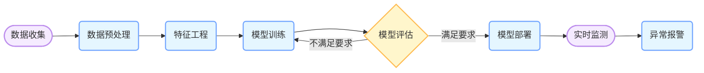

# AI在反洗钱和欺诈检测中的应用

> 关键词：AI、反洗钱、欺诈检测、机器学习、深度学习、数据挖掘、异常检测

> 摘要：本文深入探讨了AI在反洗钱和欺诈检测领域的应用。首先介绍了研究的背景、目的、预期读者、文档结构和相关术语。接着阐述了核心概念及其联系，包括AI在该领域涉及的关键原理和架构。详细讲解了核心算法原理及具体操作步骤，并辅以Python源代码。对涉及的数学模型和公式进行了详细说明并举例。通过项目实战，展示了代码的实际案例和详细解读。分析了AI在反洗钱和欺诈检测中的实际应用场景。推荐了相关的学习资源、开发工具框架和论文著作。最后总结了未来发展趋势与挑战，还提供了常见问题解答和扩展阅读参考资料，旨在为相关领域的研究和实践提供全面且深入的指导。

## 1. 背景介绍 
### 1.1 目的和范围
反洗钱和欺诈检测在金融行业以及其他众多领域都至关重要。随着科技的发展，犯罪分子的洗钱和欺诈手段日益复杂和隐蔽，传统的检测方法逐渐难以满足需求。本文章的目的在于深入探讨AI技术如何应用于反洗钱和欺诈检测，帮助相关从业者更好地理解和运用这些技术来提高检测的准确性和效率。范围涵盖了AI在该领域的核心概念、算法原理、实际应用场景以及相关的工具和资源等方面。

### 1.2 预期读者
本文预期读者包括金融机构的风险管理人员、合规人员、数据分析师，以及对AI技术在反洗钱和欺诈检测应用感兴趣的科研人员、学生等。对于希望了解如何利用先进技术提升反洗钱和欺诈检测能力的从业者，以及想要深入研究该领域的学术人员都具有参考价值。

### 1.3 文档结构概述
本文首先介绍背景信息，包括目的、预期读者等。接着阐述核心概念与联系，明确相关概念的原理和架构。然后详细讲解核心算法原理和具体操作步骤，同时给出对应的Python代码。之后介绍数学模型和公式，并举例说明。通过项目实战展示代码的实际应用和详细解读。分析实际应用场景，为读者提供实践参考。推荐相关的学习资源、开发工具框架和论文著作。最后总结未来发展趋势与挑战，提供常见问题解答和扩展阅读参考资料。

### 1.4 术语表
#### 1.4.1 核心术语定义
- **反洗钱（Anti-Money Laundering, AML）**：指为了预防通过各种方式掩饰、隐瞒毒品犯罪、黑社会性质的组织犯罪、恐怖活动犯罪、走私犯罪、贪污贿赂犯罪、破坏金融管理秩序犯罪、金融诈骗犯罪等犯罪所得及其收益的来源和性质的洗钱活动，依照法律规定采取相关措施的行为。
- **欺诈检测（Fraud Detection）**：识别和防止各种欺诈行为的过程，这些欺诈行为可能包括信用卡欺诈、保险欺诈、网络诈骗等。
- **人工智能（Artificial Intelligence, AI）**：研究、开发用于模拟、延伸和扩展人的智能的理论、方法、技术及应用系统的一门新的技术科学。在本文中主要指利用机器学习、深度学习等技术进行反洗钱和欺诈检测。
- **机器学习（Machine Learning, ML）**：一门多领域交叉学科，涉及概率论、统计学、逼近论、凸分析、算法复杂度理论等多门学科。它专门研究计算机怎样模拟或实现人类的学习行为，以获取新的知识或技能，重新组织已有的知识结构使之不断改善自身的性能。
- **深度学习（Deep Learning, DL）**：机器学习的一个分支领域，它是一种基于对数据进行表征学习的方法。深度学习通过构建具有很多层的神经网络模型，自动从大量数据中学习特征和模式。

#### 1.4.2 相关概念解释
- **异常检测（Anomaly Detection）**：在数据集中识别出与正常模式不同的异常数据点的过程。在反洗钱和欺诈检测中，异常交易可能暗示着洗钱或欺诈行为。
- **特征工程（Feature Engineering）**：从原始数据中提取和转换特征，以提高机器学习模型性能的过程。在反洗钱和欺诈检测中，合适的特征可以帮助模型更好地识别异常行为。
- **模型评估（Model Evaluation）**：使用各种指标来评估机器学习模型性能的过程，常见的指标包括准确率、召回率、F1值等。

#### 1.4.3 缩略词列表
- **AML**：Anti-Money Laundering（反洗钱）
- **AI**：Artificial Intelligence（人工智能）
- **ML**：Machine Learning（机器学习）
- **DL**：Deep Learning（深度学习）
- **ROC**：Receiver Operating Characteristic（受试者工作特征曲线）
- **AUC**：Area Under the Curve（曲线下面积）

## 2. 核心概念与联系 

### 核心概念原理
在反洗钱和欺诈检测中，AI技术主要基于机器学习和深度学习算法来分析大量的交易数据和相关信息，以识别潜在的洗钱和欺诈行为。其核心原理是通过对历史数据的学习，发现正常交易和异常交易的模式和特征，然后利用这些模式和特征对新的交易进行预测和判断。

机器学习算法，如决策树、随机森林、支持向量机等，可以通过对特征的分析和建模，构建分类器来区分正常交易和异常交易。深度学习算法，如神经网络，则可以自动从大量数据中学习复杂的特征和模式，具有更强的学习能力和表达能力。

### 架构示意图


这个架构图展示了AI在反洗钱和欺诈检测中的主要流程。首先进行数据收集，获取相关的交易数据和信息。然后对数据进行预处理，包括清洗、归一化等操作。接着进行特征工程，提取和转换有用的特征。使用这些特征进行模型训练，训练完成后进行模型评估。如果模型性能不满足要求，则返回重新训练；如果满足要求，则进行模型部署。部署后对实时交易数据进行监测，一旦发现异常则发出报警。

## 3. 核心算法原理 & 具体操作步骤 

### 决策树算法原理
决策树是一种基于树结构进行决策的机器学习算法。它通过对数据的特征进行递归划分，构建一棵决策树，每个内部节点表示一个特征上的测试，每个分支表示测试输出，每个叶节点表示一个类别或值。

决策树的构建过程主要包括以下几个步骤：
1. **特征选择**：选择一个最优的特征作为当前节点的划分特征。常用的特征选择指标有信息增益、信息增益比、基尼指数等。
2. **划分数据集**：根据选择的特征和特征值，将数据集划分为不同的子集。
3. **递归构建子树**：对每个子集重复步骤1和步骤2，直到满足终止条件，如子集中的数据属于同一类别或达到最大树深度等。

### Python代码实现决策树算法
```python
import numpy as np
from sklearn.datasets import load_iris
from sklearn.model_selection import train_test_split
from sklearn.tree import DecisionTreeClassifier
from sklearn.metrics import accuracy_score

# 加载数据集
iris = load_iris()
X = iris.data
y = iris.target

# 划分训练集和测试集
X_train, X_test, y_train, y_test = train_test_split(X, y, test_size=0.2, random_state=42)

# 创建决策树分类器
clf = DecisionTreeClassifier()

# 训练模型
clf.fit(X_train, y_train)

# 预测
y_pred = clf.predict(X_test)

# 计算准确率
accuracy = accuracy_score(y_test, y_pred)
print(f"Accuracy: {accuracy}")
```

### 代码解释
1. **数据加载**：使用`sklearn.datasets.load_iris`加载鸢尾花数据集。
2. **数据划分**：使用`sklearn.model_selection.train_test_split`将数据集划分为训练集和测试集，测试集占比为20%。
3. **模型创建**：使用`sklearn.tree.DecisionTreeClassifier`创建决策树分类器。
4. **模型训练**：使用`fit`方法对模型进行训练。
5. **模型预测**：使用`predict`方法对测试集进行预测。
6. **模型评估**：使用`sklearn.metrics.accuracy_score`计算模型的准确率。

### 具体操作步骤
1. **数据准备**：收集和整理相关的交易数据，包括客户信息、交易金额、交易时间、交易地点等。对数据进行清洗，去除缺失值、重复值等。
2. **特征工程**：从原始数据中提取和转换有用的特征，如交易频率、交易金额的均值和标准差、交易时间的分布等。
3. **模型选择**：根据数据的特点和问题的需求，选择合适的机器学习算法，如决策树、随机森林、支持向量机等。
4. **模型训练**：使用训练集对模型进行训练，调整模型的参数以提高性能。
5. **模型评估**：使用测试集对训练好的模型进行评估，计算各种评估指标，如准确率、召回率、F1值等。
6. **模型部署**：将评估通过的模型部署到实际系统中，对实时交易数据进行监测和预测。
7. **模型更新**：随着时间的推移和数据的变化，定期对模型进行更新和优化，以保持模型的性能。

## 4. 数学模型和公式 & 详细讲解 & 举例说明 

### 信息增益
信息增益是决策树算法中常用的特征选择指标之一。它衡量了使用某个特征进行划分后，数据集的信息熵减少的程度。信息熵是衡量数据集不确定性的指标，信息熵越大，数据集的不确定性越高。

信息熵的计算公式为：
$$H(D) = -\sum_{i=1}^{n}p_i\log_2p_i$$
其中，$D$ 表示数据集，$p_i$ 表示数据集 $D$ 中第 $i$ 类样本的比例，$n$ 表示类别数。

信息增益的计算公式为：
$$Gain(D, A) = H(D) - H(D|A)$$
其中，$Gain(D, A)$ 表示使用特征 $A$ 对数据集 $D$ 进行划分的信息增益，$H(D)$ 表示数据集 $D$ 的信息熵，$H(D|A)$ 表示在特征 $A$ 给定的条件下，数据集 $D$ 的条件熵。

条件熵的计算公式为：
$$H(D|A) = \sum_{v\in Values(A)}\frac{|D^v|}{|D|}H(D^v)$$
其中，$Values(A)$ 表示特征 $A$ 的所有可能取值，$D^v$ 表示特征 $A$ 取值为 $v$ 时的数据集，$|D^v|$ 表示数据集 $D^v$ 的样本数，$|D|$ 表示数据集 $D$ 的样本数。

### 举例说明
假设有一个数据集 $D$，包含 10 个样本，分为 2 类，其中正类样本有 6 个，负类样本有 4 个。则数据集 $D$ 的信息熵为：
$$H(D) = -\frac{6}{10}\log_2\frac{6}{10} - \frac{4}{10}\log_2\frac{4}{10} \approx 0.971$$

假设有一个特征 $A$，有 2 个取值 $A_1$ 和 $A_2$。特征 $A$ 取值为 $A_1$ 时，数据集 $D^{A_1}$ 包含 6 个样本，其中正类样本有 4 个，负类样本有 2 个；特征 $A$ 取值为 $A_2$ 时，数据集 $D^{A_2}$ 包含 4 个样本，其中正类样本有 2 个，负类样本有 2 个。

则数据集 $D^{A_1}$ 的信息熵为：
$$H(D^{A_1}) = -\frac{4}{6}\log_2\frac{4}{6} - \frac{2}{6}\log_2\frac{2}{6} \approx 0.918$$

数据集 $D^{A_2}$ 的信息熵为：
$$H(D^{A_2}) = -\frac{2}{4}\log_2\frac{2}{4} - \frac{2}{4}\log_2\frac{2}{4} = 1$$

条件熵 $H(D|A)$ 为：
$$H(D|A) = \frac{6}{10}H(D^{A_1}) + \frac{4}{10}H(D^{A_2}) = \frac{6}{10} \times 0.918 + \frac{4}{10} \times 1 \approx 0.951$$

信息增益 $Gain(D, A)$ 为：
$$Gain(D, A) = H(D) - H(D|A) = 0.971 - 0.951 = 0.02$$

### 基尼指数
基尼指数也是决策树算法中常用的特征选择指标之一。它衡量了数据集的不纯度，基尼指数越小，数据集的纯度越高。

基尼指数的计算公式为：
$$Gini(D) = 1 - \sum_{i=1}^{n}p_i^2$$
其中，$D$ 表示数据集，$p_i$ 表示数据集 $D$ 中第 $i$ 类样本的比例，$n$ 表示类别数。

使用特征 $A$ 对数据集 $D$ 进行划分后的基尼指数为：
$$Gini(D, A) = \sum_{v\in Values(A)}\frac{|D^v|}{|D|}Gini(D^v)$$
其中，$Values(A)$ 表示特征 $A$ 的所有可能取值，$D^v$ 表示特征 $A$ 取值为 $v$ 时的数据集，$|D^v|$ 表示数据集 $D^v$ 的样本数，$|D|$ 表示数据集 $D$ 的样本数。

### 举例说明
假设有一个数据集 $D$，包含 10 个样本，分为 2 类，其中正类样本有 6 个，负类样本有 4 个。则数据集 $D$ 的基尼指数为：
$$Gini(D) = 1 - (\frac{6}{10})^2 - (\frac{4}{10})^2 = 0.48$$

假设有一个特征 $A$，有 2 个取值 $A_1$ 和 $A_2$。特征 $A$ 取值为 $A_1$ 时，数据集 $D^{A_1}$ 包含 6 个样本，其中正类样本有 4 个，负类样本有 2 个；特征 $A$ 取值为 $A_2$ 时，数据集 $D^{A_2}$ 包含 4 个样本，其中正类样本有 2 个，负类样本有 2 个。

则数据集 $D^{A_1}$ 的基尼指数为：
$$Gini(D^{A_1}) = 1 - (\frac{4}{6})^2 - (\frac{2}{6})^2 \approx 0.444$$

数据集 $D^{A_2}$ 的基尼指数为：
$$Gini(D^{A_2}) = 1 - (\frac{2}{4})^2 - (\frac{2}{4})^2 = 0.5$$

使用特征 $A$ 对数据集 $D$ 进行划分后的基尼指数为：
$$Gini(D, A) = \frac{6}{10}Gini(D^{A_1}) + \frac{4}{10}Gini(D^{A_2}) = \frac{6}{10} \times 0.444 + \frac{4}{10} \times 0.5 \approx 0.466$$

## 5. 项目实战：代码实际案例和详细解释说明 

### 5.1  开发环境搭建
为了完成本项目实战，我们需要搭建以下开发环境：
1. **Python环境**：建议使用Python 3.7及以上版本。可以从Python官方网站（https://www.python.org/downloads/）下载并安装。
2. **开发工具**：可以使用Jupyter Notebook、PyCharm等开发工具。Jupyter Notebook适合进行交互式开发和数据分析，PyCharm是一个功能强大的Python集成开发环境。
3. **必要的库**：需要安装以下Python库：
    - `pandas`：用于数据处理和分析。
    - `numpy`：用于数值计算。
    - `scikit-learn`：用于机器学习算法的实现和模型评估。
    - `matplotlib`：用于数据可视化。

可以使用以下命令安装这些库：
```sh
pip install pandas numpy scikit-learn matplotlib
```

### 5.2  源代码详细实现和代码解读
我们将使用一个信用卡欺诈检测的数据集来演示AI在欺诈检测中的应用。该数据集包含了信用卡交易的相关信息，包括交易时间、交易金额、V1 - V28等特征，以及交易是否为欺诈交易的标签。

```python
import pandas as pd
import numpy as np
from sklearn.model_selection import train_test_split
from sklearn.ensemble import RandomForestClassifier
from sklearn.metrics import accuracy_score, confusion_matrix, classification_report
import matplotlib.pyplot as plt
import seaborn as sns

# 加载数据集
data = pd.read_csv('creditcard.csv')

# 查看数据集基本信息
print(data.info())

# 查看数据集行数和列数
rows, columns = data.shape

# 提取特征和标签
X = data.drop('Class', axis=1)
y = data['Class']

# 划分训练集和测试集
X_train, X_test, y_train, y_test = train_test_split(X, y, test_size=0.2, random_state=42)

# 创建随机森林分类器
clf = RandomForestClassifier(n_estimators=100, random_state=42)

# 训练模型
clf.fit(X_train, y_train)

# 预测
y_pred = clf.predict(X_test)

# 计算准确率
accuracy = accuracy_score(y_test, y_pred)
print(f"Accuracy: {accuracy}")

# 计算混淆矩阵
conf_matrix = confusion_matrix(y_test, y_pred)
print(f"Confusion Matrix:\n{conf_matrix}")

# 打印分类报告
print(f"Classification Report:\n{classification_report(y_test, y_pred)}")

# 可视化混淆矩阵
plt.figure(figsize=(8, 6))
sns.heatmap(conf_matrix, annot=True, fmt='d', cmap='Blues')
plt.xlabel('Predicted Labels')
plt.ylabel('True Labels')
plt.title('Confusion Matrix')
plt.show()
```

### 代码解读
1. **数据加载**：使用`pandas`库的`read_csv`函数加载信用卡欺诈检测数据集。
2. **数据查看**：使用`info`方法查看数据集的基本信息，包括列名、数据类型、缺失值等。
3. **特征和标签提取**：使用`drop`方法去除`Class`列，得到特征矩阵`X`；提取`Class`列作为标签向量`y`。
4. **数据划分**：使用`train_test_split`函数将数据集划分为训练集和测试集，测试集占比为20%。
5. **模型创建**：使用`RandomForestClassifier`创建随机森林分类器，设置树的数量为100。
6. **模型训练**：使用`fit`方法对模型进行训练。
7. **模型预测**：使用`predict`方法对测试集进行预测。
8. **模型评估**：
    - 使用`accuracy_score`计算模型的准确率。
    - 使用`confusion_matrix`计算混淆矩阵，用于评估模型在不同类别上的预测性能。
    - 使用`classification_report`打印分类报告，包括精确率、召回率、F1值等指标。
9. **可视化**：使用`seaborn`库的`heatmap`函数可视化混淆矩阵，帮助我们更直观地理解模型的预测结果。

### 5.3  代码解读与分析
从代码的运行结果可以看出，随机森林分类器在信用卡欺诈检测数据集上取得了较高的准确率。但是，仅仅依靠准确率来评估模型是不够的，因为在欺诈检测问题中，数据通常是不平衡的，即正常交易的数量远远多于欺诈交易的数量。因此，我们还需要关注混淆矩阵和分类报告中的其他指标，如精确率、召回率和F1值。

精确率表示模型预测为正类的样本中，实际为正类的比例；召回率表示实际为正类的样本中，被模型预测为正类的比例；F1值是精确率和召回率的调和平均数。在欺诈检测中，我们通常更关注召回率，因为我们希望尽可能多地检测出欺诈交易。

通过分析混淆矩阵和分类报告，我们可以发现模型在不同类别上的性能表现，从而对模型进行进一步的优化和调整。例如，如果模型的召回率较低，我们可以尝试调整模型的参数、使用更复杂的模型或者进行数据增强等方法来提高模型的性能。

## 6. 实际应用场景 
### 金融机构
金融机构是反洗钱和欺诈检测的主要应用场景之一。银行、证券、保险等金融机构每天都会处理大量的交易数据，其中可能存在洗钱和欺诈行为。AI技术可以帮助金融机构实时监测交易数据，识别异常交易模式，及时发现潜在的洗钱和欺诈风险。例如，银行可以使用AI算法分析客户的交易行为，如交易频率、交易金额、交易地点等，识别出与正常行为不符的异常交易，并及时进行调查和处理。

### 电商平台
电商平台也是欺诈检测的重要应用场景。在电商交易中，可能存在虚假交易、信用卡欺诈、退款欺诈等多种欺诈行为。AI技术可以通过分析用户的行为数据，如浏览历史、购买记录、支付信息等，识别出潜在的欺诈用户和交易。例如，电商平台可以使用机器学习算法对用户的购买行为进行建模，预测用户是否存在欺诈风险，并对高风险用户采取相应的措施，如限制交易、要求额外验证等。

### 保险行业
保险行业同样面临着欺诈风险，如保险理赔欺诈、保险销售欺诈等。AI技术可以帮助保险公司识别欺诈性的理赔申请和销售行为。例如，保险公司可以使用深度学习算法对理赔申请进行文本分析和图像识别，检测是否存在虚假信息和欺诈迹象。同时，AI还可以分析销售人员的销售行为和业绩数据，识别出可能存在的销售欺诈行为。

### 电信行业
电信行业也需要进行欺诈检测，如手机话费欺诈、网络服务欺诈等。AI技术可以通过分析用户的通话记录、短信内容、网络使用行为等数据，识别出异常的使用模式和欺诈行为。例如，电信运营商可以使用机器学习算法对用户的通话时长、通话频率、通话对象等进行分析，识别出可能存在的话费欺诈行为，并及时采取措施进行防范。

## 7. 工具和资源推荐
### 7.1 学习资源推荐
#### 7.1.1 书籍推荐
- 《机器学习》（周志华）：这本书全面介绍了机器学习的基本概念、算法和应用，是机器学习领域的经典教材之一。
- 《深度学习》（Ian Goodfellow、Yoshua Bengio和Aaron Courville）：这本书由深度学习领域的三位顶级专家撰写，系统地介绍了深度学习的理论和实践，是深度学习领域的权威著作。
- 《Python机器学习》（Sebastian Raschka）：这本书结合Python编程语言，详细介绍了机器学习的算法和应用，适合初学者入门。

#### 7.1.2 在线课程
- Coursera上的“机器学习”课程（Andrew Ng教授授课）：这是一门非常经典的机器学习课程，由斯坦福大学的Andrew Ng教授授课，内容涵盖了机器学习的基本概念、算法和应用。
- edX上的“深度学习基础”课程（DeepLearning.AI）：这门课程由深度学习领域的专家Geoffrey Hinton、Yoshua Bengio和Yann LeCun等参与设计，系统地介绍了深度学习的基础知识和实践。
- 中国大学MOOC上的“人工智能基础”课程：这门课程由国内多所高校的专家联合授课，内容涵盖了人工智能的基本概念、算法和应用，适合初学者入门。

#### 7.1.3 技术博客和网站
- Towards Data Science：这是一个专注于数据科学和机器学习的技术博客平台，上面有很多高质量的文章和教程。
- Medium：这是一个综合性的技术博客平台，上面有很多关于AI、机器学习、深度学习等领域的文章和分享。
- Kaggle：这是一个数据科学和机器学习竞赛平台，上面有很多公开的数据集和优秀的解决方案，可以帮助我们学习和实践。

### 7.2 开发工具框架推荐
#### 7.2.1 IDE和编辑器
- PyCharm：这是一个功能强大的Python集成开发环境，提供了代码编辑、调试、版本控制等功能，适合专业的Python开发者使用。
- Jupyter Notebook：这是一个交互式的开发环境，支持Python、R等多种编程语言，适合进行数据分析和机器学习实验。
- Visual Studio Code：这是一个轻量级的代码编辑器，支持多种编程语言和插件扩展，适合初学者和快速开发。

#### 7.2.2 调试和性能分析工具
- PDB：这是Python自带的调试工具，可以帮助我们调试Python代码，定位和解决问题。
- TensorBoard：这是TensorFlow提供的可视化工具，可以帮助我们可视化模型的训练过程和性能指标。
- Scikit-learn的`GridSearchCV`和`RandomizedSearchCV`：这两个工具可以帮助我们进行模型参数调优，提高模型的性能。

#### 7.2.3 相关框架和库
- Scikit-learn：这是一个常用的机器学习库，提供了丰富的机器学习算法和工具，如分类、回归、聚类等。
- TensorFlow：这是一个开源的深度学习框架，由Google开发，提供了强大的深度学习模型构建和训练功能。
- PyTorch：这是一个另一个流行的深度学习框架，由Facebook开发，具有动态图的特点，适合快速开发和实验。

### 7.3 相关论文著作推荐
#### 7.3.1 经典论文
- “A Decision-Theoretic Generalization of On-Line Learning and an Application to Boosting”（Yoav Freund和Robert E. Schapire）：这篇论文提出了AdaBoost算法，是机器学习领域的经典论文之一。
- “ImageNet Classification with Deep Convolutional Neural Networks”（Alex Krizhevsky、Ilya Sutskever和Geoffrey E. Hinton）：这篇论文提出了AlexNet模型，开创了深度学习在计算机视觉领域的应用先河。
- “Attention Is All You Need”（Ashish Vaswani等）：这篇论文提出了Transformer模型，是自然语言处理领域的重要突破。

#### 7.3.2 最新研究成果
- 关注顶级学术会议，如NeurIPS（神经信息处理系统大会）、ICML（国际机器学习会议）、CVPR（计算机视觉与模式识别会议）等，这些会议上会发表很多关于AI、机器学习、深度学习等领域的最新研究成果。
- 关注知名学术期刊，如Journal of Artificial Intelligence Research（JAIR）、Artificial Intelligence等，这些期刊上会发表很多高质量的学术论文。

#### 7.3.3 应用案例分析
- 可以关注一些知名企业和机构的技术博客和报告，如Google AI Blog、Microsoft Research等，这些博客和报告中会分享很多关于AI技术在实际应用中的案例和经验。
- 可以参考一些专业的书籍和报告，如《AI in Finance: The Future of Investment Management》等，这些书籍和报告中会介绍AI技术在金融等领域的应用案例和发展趋势。

## 8. 总结：未来发展趋势与挑战
### 未来发展趋势
#### 多模态数据融合
未来，AI在反洗钱和欺诈检测中将越来越多地融合多模态数据，如文本、图像、音频等。例如，在保险理赔欺诈检测中，可以结合理赔申请的文本描述、事故现场的图像和视频等多模态数据进行分析，提高检测的准确性和可靠性。

#### 强化学习的应用
强化学习是一种通过智能体与环境进行交互并获得奖励来学习最优策略的机器学习方法。在反洗钱和欺诈检测中，强化学习可以用于动态调整检测策略，根据不同的情况和反馈不断优化检测效果。例如，智能体可以根据实时的交易数据和检测结果，动态调整异常检测的阈值和规则，以适应不断变化的洗钱和欺诈手段。

#### 联邦学习
随着数据隐私和安全问题的日益突出，联邦学习将在反洗钱和欺诈检测中得到更广泛的应用。联邦学习允许在不共享原始数据的情况下进行模型训练，各个参与方可以在本地对数据进行处理和计算，然后将模型参数或梯度信息进行共享和聚合。这样可以在保护数据隐私的同时，利用多方的数据进行更准确的模型训练。

#### 可解释性AI
在反洗钱和欺诈检测中，模型的可解释性非常重要。监管机构和业务人员需要了解模型的决策过程和依据，以便对检测结果进行评估和决策。未来，可解释性AI将成为研究和应用的热点，通过开发可解释的模型和方法，提高模型的透明度和可信度。

### 挑战
#### 数据质量和隐私问题
数据质量是影响AI模型性能的关键因素之一。在反洗钱和欺诈检测中，数据可能存在缺失值、错误值、噪声等问题，需要进行有效的数据清洗和预处理。同时，数据隐私也是一个重要的问题，金融机构和企业需要在保护客户数据隐私的前提下，进行数据的收集、使用和分析。

#### 模型的复杂性和可解释性
随着AI技术的发展，模型的复杂性越来越高，如深度学习模型通常具有大量的参数和复杂的结构。这使得模型的训练和调优变得更加困难，同时也增加了模型的可解释性难度。在反洗钱和欺诈检测中，需要在模型的性能和可解释性之间找到一个平衡点。

#### 不断变化的洗钱和欺诈手段
洗钱和欺诈手段不断变化和创新，犯罪分子会利用新的技术和方法来逃避检测。这就要求AI模型能够及时适应这些变化，不断更新和优化检测策略。同时，需要加强对新的洗钱和欺诈手段的研究和监测，以便及时发现和应对。

#### 跨机构和跨行业合作
反洗钱和欺诈检测是一个系统性的问题，需要跨机构和跨行业的合作。不同的金融机构、企业和监管机构之间需要共享信息和数据，协同合作，共同打击洗钱和欺诈行为。然而，在实际操作中，由于数据隐私、利益冲突等问题，跨机构和跨行业合作面临着诸多挑战。

## 9. 附录：常见问题与解答
### 问题1：AI模型在反洗钱和欺诈检测中的准确率能达到多少？
AI模型的准确率受到多种因素的影响，如数据质量、特征选择、模型算法、参数调优等。在实际应用中，模型的准确率可能会有所不同。一般来说，通过合理的数据处理、特征工程和模型选择，AI模型可以在反洗钱和欺诈检测中取得较高的准确率。但是，仅仅依靠准确率来评估模型是不够的，还需要关注其他指标，如召回率、F1值等。

### 问题2：如何选择合适的AI算法进行反洗钱和欺诈检测？
选择合适的AI算法需要考虑多个因素，如数据的特点、问题的复杂度、模型的可解释性等。对于小规模数据集和简单问题，可以选择一些传统的机器学习算法，如决策树、随机森林、支持向量机等；对于大规模数据集和复杂问题，可以选择深度学习算法，如神经网络、卷积神经网络、循环神经网络等。同时，还需要根据具体的应用场景和需求，对不同的算法进行实验和比较，选择最优的算法。

### 问题3：AI模型在反洗钱和欺诈检测中会出现误判吗？
会的。AI模型在反洗钱和欺诈检测中可能会出现误判，即把正常交易误判为欺诈交易（假阳性）或把欺诈交易误判为正常交易（假阴性）。误判的原因可能包括数据噪声、模型过拟合、洗钱和欺诈手段的变化等。为了减少误判，可以采取以下措施：提高数据质量、进行有效的特征工程、选择合适的模型算法、进行模型评估和调优、结合人工审核等。

### 问题4：如何评估AI模型在反洗钱和欺诈检测中的性能？
评估AI模型在反洗钱和欺诈检测中的性能可以使用多种指标，常见的指标包括准确率、召回率、精确率、F1值、ROC曲线和AUC值等。准确率表示模型预测正确的样本占总样本的比例；召回率表示实际为正类的样本中，被模型预测为正类的比例；精确率表示模型预测为正类的样本中，实际为正类的比例；F1值是精确率和召回率的调和平均数；ROC曲线是描述真阳性率和假阳性率之间关系的曲线，AUC值是ROC曲线下的面积，AUC值越大，模型的性能越好。在实际应用中，需要根据具体的需求和场景，选择合适的评估指标。

### 问题5：AI技术在反洗钱和欺诈检测中的应用是否会取代人工审核？
AI技术在反洗钱和欺诈检测中的应用可以提高检测的效率和准确性，但不会完全取代人工审核。虽然AI模型可以快速处理大量的数据，识别出潜在的洗钱和欺诈行为，但对于一些复杂的情况和需要专业判断的问题，仍然需要人工审核来进行确认和决策。例如，对于一些涉及到法律、合规和道德等方面的问题，需要人工审核来进行综合评估和判断。因此，在实际应用中，通常会将AI技术和人工审核相结合，形成一个互补的检测体系。

## 10. 扩展阅读 & 参考资料
### 扩展阅读
- 《人工智能：现代方法》（Stuart Russell和Peter Norvig）：这本书是人工智能领域的经典教材，全面介绍了人工智能的基本概念、算法和应用。
- 《数据挖掘：概念与技术》（Jiawei Han、Jian Pei和Jianwen Yin）：这本书系统地介绍了数据挖掘的基本概念、算法和应用，适合深入学习数据挖掘技术。
- 《金融科技：发展趋势与监管》（黄益平）：这本书介绍了金融科技的发展趋势和监管政策，对于了解AI技术在金融领域的应用和发展具有重要的参考价值。

### 参考资料
- 《金融机构反洗钱和反恐怖主义融资监督管理办法》
- 《中华人民共和国反洗钱法》
- 《最高人民法院、最高人民检察院关于办理诈骗刑事案件具体应用法律若干问题的解释》

作者：AI天才研究院/AI Genius Institute & 禅与计算机程序设计艺术 /Zen And The Art of Computer Programming