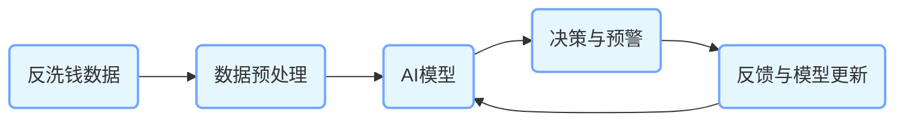

# AI在反洗钱模式进化检测与预警中的深度应用研究

> 关键词：人工智能、反洗钱、模式进化检测、预警、机器学习

> 摘要：本文深入探讨了AI在反洗钱模式进化检测与预警中的深度应用。随着金融犯罪手段的不断演变，传统反洗钱方法面临诸多挑战，而AI技术凭借其强大的数据分析和模式识别能力，为反洗钱工作带来了新的机遇。文章首先介绍了研究的背景和相关概念，接着阐述了核心算法原理和具体操作步骤，包括使用Python代码示例。然后详细讲解了数学模型和公式，并通过实际案例进行说明。之后介绍了项目实战的开发环境搭建、源代码实现和解读。还探讨了AI在反洗钱中的实际应用场景，推荐了相关的学习资源、开发工具框架和论文著作。最后总结了未来发展趋势与挑战，并对常见问题进行了解答，旨在为相关领域的研究和实践提供全面的参考和指导。

## 1. 背景介绍 
### 1.1 目的和范围
反洗钱是维护金融安全和社会稳定的重要工作。随着金融业务的不断创新和全球化发展，洗钱手段日益复杂多样且不断进化。传统的反洗钱方法主要基于规则和专家经验，难以适应洗钱模式的快速变化，导致漏报率和误报率较高。本研究的目的在于深入探讨如何利用人工智能（AI）技术提升反洗钱模式进化检测与预警的能力，降低漏报和误报率，提高反洗钱工作的效率和准确性。

研究范围涵盖了AI在反洗钱领域的多种应用，包括数据挖掘、机器学习、深度学习等技术在洗钱模式识别、异常交易检测和预警等方面的应用。同时，还涉及到与反洗钱相关的数据处理、特征工程、模型评估等关键环节。

### 1.2 预期读者
本文预期读者包括金融机构的反洗钱工作人员、监管机构的相关人员、从事AI和金融科技研究的科研人员以及对反洗钱和AI技术感兴趣的技术爱好者。对于金融机构工作人员，本文可以为其提供实际的技术方案和应用案例，帮助他们提升反洗钱工作的效果；对于监管机构人员，有助于其了解AI在反洗钱中的应用现状和发展趋势，为制定相关政策提供参考；对于科研人员，可作为研究的参考资料，启发新的研究思路；对于技术爱好者，则可以帮助他们了解AI在实际金融领域的应用场景和技术实现方法。

### 1.3 文档结构概述
本文将按照以下结构展开：首先介绍背景知识，包括目的、范围、预期读者和术语表等内容。接着阐述AI在反洗钱中的核心概念与联系，通过文本示意图和Mermaid流程图进行说明。然后详细讲解核心算法原理和具体操作步骤，结合Python源代码进行阐述。之后介绍数学模型和公式，并举例说明。再通过项目实战，介绍开发环境搭建、源代码实现和代码解读。随后探讨AI在反洗钱中的实际应用场景。推荐相关的工具和资源，包括学习资源、开发工具框架和论文著作。最后总结未来发展趋势与挑战，解答常见问题，并提供扩展阅读和参考资料。

### 1.4 术语表
#### 1.4.1 核心术语定义
- **反洗钱（Anti - Money Laundering, AML）**：是指为了预防通过各种方式掩饰、隐瞒毒品犯罪、黑社会性质的组织犯罪、恐怖活动犯罪、走私犯罪、贪污贿赂犯罪、破坏金融管理秩序犯罪、金融诈骗犯罪等犯罪所得及其收益的来源和性质的洗钱活动，依照法律规定采取相关措施的行为。
- **人工智能（Artificial Intelligence, AI）**：是研究、开发用于模拟、延伸和扩展人的智能的理论、方法、技术及应用系统的一门新的技术科学。在反洗钱领域，主要利用其数据分析、模式识别等能力来检测洗钱行为。
- **机器学习（Machine Learning, ML）**：是一门多领域交叉学科，涉及概率论、统计学、逼近论、凸分析、算法复杂度理论等多门学科。它专门研究计算机怎样模拟或实现人类的学习行为，以获取新的知识或技能，重新组织已有的知识结构使之不断改善自身的性能。在反洗钱中，用于发现数据中的潜在模式和规律。
- **深度学习（Deep Learning, DL）**：是机器学习的一个分支领域，它是一种基于对数据进行表征学习的方法。深度学习通过构建具有很多层的神经网络模型，自动从大量数据中学习复杂的特征和模式，在反洗钱中可用于处理高维、复杂的数据。
- **异常交易检测（Anomaly Transaction Detection）**：是指通过对交易数据的分析，识别出与正常交易模式存在显著差异的交易行为，这些异常交易可能是洗钱行为的表现。

#### 1.4.2 相关概念解释
- **洗钱模式进化**：随着时间的推移和监管环境的变化，洗钱者不断采用新的手段和方法来掩饰其非法资金的来源和去向，导致洗钱模式不断演变和发展。例如，从传统的现金交易洗钱逐渐转向利用电子支付、虚拟货币等新兴支付方式进行洗钱。
- **预警系统**：是一种能够实时监测交易数据，当发现异常交易或潜在洗钱行为时，及时发出警报的系统。预警系统通常基于一定的规则或模型，对交易数据进行分析和判断，并根据设定的阈值发出不同级别的警报。

#### 1.4.3 缩略词列表
- **AML**：Anti - Money Laundering（反洗钱）
- **AI**：Artificial Intelligence（人工智能）
- **ML**：Machine Learning（机器学习）
- **DL**：Deep Learning（深度学习）
- **KYC**：Know Your Customer（了解你的客户）
- **SAR**：Suspicious Activity Report（可疑交易报告）

## 2. 核心概念与联系 
在反洗钱模式进化检测与预警中，AI的核心概念主要包括数据、模型和决策。下面通过文本示意图和Mermaid流程图来详细说明它们之间的联系。

### 文本示意图
反洗钱数据是整个系统的基础，包括客户信息、交易记录等。这些数据经过预处理，如清洗、特征提取等，被输入到AI模型中。AI模型可以是机器学习模型（如决策树、支持向量机等）或深度学习模型（如神经网络），模型通过对历史数据的学习，发现洗钱行为的潜在模式和规律。根据模型的输出结果，结合一定的规则和阈值，做出是否为可疑交易的决策，并发出相应的预警。同时，随着新数据的不断产生，模型会不断进行更新和优化，以适应洗钱模式的进化。

### Mermaid流程图

这个流程图展示了AI在反洗钱模式进化检测与预警中的基本流程。首先，反洗钱数据经过预处理后输入到AI模型中进行分析。模型的输出结果用于做出决策并发出预警。同时，决策结果会反馈回来，用于更新和优化AI模型，以适应不断变化的洗钱模式。

## 3. 核心算法原理 & 具体操作步骤 
在反洗钱模式进化检测与预警中，常用的AI算法包括机器学习算法和深度学习算法。下面以决策树算法为例，详细阐述其原理和具体操作步骤，并给出Python源代码示例。

### 决策树算法原理
决策树是一种基于树结构进行决策的模型。它通过对数据的属性进行划分，将数据集逐步分割成不同的子集，直到每个子集都尽可能地“纯净”（即属于同一类别）。决策树的每个内部节点表示一个属性上的测试，每个分支表示一个测试输出，每个叶节点表示一个类别。

决策树的构建过程主要包括以下几个步骤：
1. **选择最优划分属性**：从所有属性中选择一个最优的属性作为当前节点的划分属性。常用的选择方法有信息增益、信息增益率、基尼指数等。
2. **划分数据集**：根据选择的划分属性，将数据集划分为不同的子集。
3. **递归构建子树**：对每个子集递归地重复步骤1和步骤2，直到满足终止条件（如子集为空或所有样本属于同一类别）。

### 具体操作步骤
1. **数据准备**：收集和整理反洗钱相关的数据，包括客户信息、交易记录等，并进行数据清洗和预处理。
2. **特征选择**：从数据中选择对洗钱行为有重要影响的特征，如交易金额、交易频率、交易时间等。
3. **模型训练**：使用训练数据集对决策树模型进行训练，确定模型的参数。
4. **模型评估**：使用测试数据集对训练好的模型进行评估，计算模型的准确率、召回率等指标。
5. **模型应用**：将训练好的模型应用到实际的反洗钱检测中，对新的交易数据进行预测和预警。

### Python源代码示例
```python
import pandas as pd
from sklearn.tree import DecisionTreeClassifier
from sklearn.model_selection import train_test_split
from sklearn.metrics import accuracy_score, recall_score

# 加载数据
data = pd.read_csv('anti_money_laundering_data.csv')

# 划分特征和标签
X = data.drop('label', axis=1)
y = data['label']

# 划分训练集和测试集
X_train, X_test, y_train, y_test = train_test_split(X, y, test_size=0.2, random_state=42)

# 创建决策树模型
model = DecisionTreeClassifier()

# 模型训练
model.fit(X_train, y_train)

# 模型预测
y_pred = model.predict(X_test)

# 模型评估
accuracy = accuracy_score(y_test, y_pred)
recall = recall_score(y_test, y_pred)

print(f"Accuracy: {accuracy}")
print(f"Recall: {recall}")
```
在这个示例中，我们首先使用`pandas`库加载反洗钱数据。然后将数据划分为特征和标签，并进一步划分为训练集和测试集。接着创建一个决策树模型，并使用训练集对模型进行训练。最后，使用测试集对模型进行预测和评估，计算模型的准确率和召回率。

## 4. 数学模型和公式 & 详细讲解 & 举例说明 
### 信息增益
信息增益是决策树算法中常用的选择划分属性的方法。它基于信息熵的概念，用于衡量一个属性对数据集分类的贡献程度。

#### 信息熵
信息熵是对数据集不确定性的度量。设数据集 $D$ 包含 $n$ 个类别，第 $i$ 个类别的样本数为 $|C_i|$，则数据集 $D$ 的信息熵定义为：
$$H(D)=-\sum_{i=1}^{n}\frac{|C_i|}{|D|}\log_2\frac{|C_i|}{|D|}$$
其中，$|D|$ 表示数据集 $D$ 的样本总数。

#### 条件熵
条件熵是在已知某个属性 $A$ 的取值情况下，数据集 $D$ 的信息熵。设属性 $A$ 有 $v$ 个不同的取值 $\{a_1,a_2,\cdots,a_v\}$，将数据集 $D$ 按照属性 $A$ 的取值划分为 $v$ 个子集 $\{D_1,D_2,\cdots,D_v\}$，则在属性 $A$ 条件下数据集 $D$ 的条件熵定义为：
$$H(D|A)=\sum_{i=1}^{v}\frac{|D_i|}{|D|}H(D_i)$$

#### 信息增益
信息增益是信息熵与条件熵的差值，即：
$$Gain(D,A)=H(D)-H(D|A)$$
信息增益越大，说明属性 $A$ 对数据集 $D$ 的分类贡献越大，越适合作为划分属性。

### 举例说明
假设有一个包含 10 个样本的数据集 $D$，其中正类样本有 6 个，负类样本有 4 个。现在考虑一个属性 $A$，它有两个取值 $a_1$ 和 $a_2$，根据属性 $A$ 的取值将数据集 $D$ 划分为两个子集 $D_1$ 和 $D_2$，其中 $D_1$ 包含 4 个样本，其中正类样本有 3 个，负类样本有 1 个；$D_2$ 包含 6 个样本，其中正类样本有 3 个，负类样本有 3 个。

首先计算数据集 $D$ 的信息熵：
$$H(D)=-\frac{6}{10}\log_2\frac{6}{10}-\frac{4}{10}\log_2\frac{4}{10}\approx0.971$$

然后计算子集 $D_1$ 和 $D_2$ 的信息熵：
$$H(D_1)=-\frac{3}{4}\log_2\frac{3}{4}-\frac{1}{4}\log_2\frac{1}{4}\approx0.811$$
$$H(D_2)=-\frac{3}{6}\log_2\frac{3}{6}-\frac{3}{6}\log_2\frac{3}{6}=1$$

接着计算在属性 $A$ 条件下数据集 $D$ 的条件熵：
$$H(D|A)=\frac{4}{10}H(D_1)+\frac{6}{10}H(D_2)=\frac{4}{10}\times0.811+\frac{6}{10}\times1\approx0.924$$

最后计算属性 $A$ 的信息增益：
$$Gain(D,A)=H(D)-H(D|A)=0.971 - 0.924 = 0.047$$

通过计算信息增益，我们可以判断属性 $A$ 对数据集 $D$ 的分类贡献程度。

## 5. 项目实战：代码实际案例和详细解释说明 
### 5.1  开发环境搭建
在进行反洗钱模式进化检测与预警的项目实战时，需要搭建相应的开发环境。以下是具体的步骤：

#### 安装Python
首先需要安装Python环境，建议使用Python 3.7及以上版本。可以从Python官方网站（https://www.python.org/downloads/）下载并安装。

#### 安装必要的库
使用`pip`工具安装项目所需的库，主要包括：
- `pandas`：用于数据处理和分析。
- `numpy`：用于数值计算。
- `scikit-learn`：用于机器学习算法的实现和模型评估。
- `matplotlib`：用于数据可视化。

可以使用以下命令进行安装：
```sh
pip install pandas numpy scikit-learn matplotlib
```

#### 准备数据
收集和整理反洗钱相关的数据，将其保存为CSV格式的文件。确保数据包含必要的特征和标签信息。

### 5.2  源代码详细实现和代码解读
以下是一个完整的反洗钱模式进化检测与预警的Python代码示例：

```python
import pandas as pd
import numpy as np
from sklearn.model_selection import train_test_split
from sklearn.preprocessing import StandardScaler
from sklearn.ensemble import RandomForestClassifier
from sklearn.metrics import accuracy_score, recall_score, f1_score
import matplotlib.pyplot as plt

# 加载数据
data = pd.read_csv('anti_money_laundering_data.csv')

# 数据预处理
# 处理缺失值
data = data.dropna()

# 划分特征和标签
X = data.drop('label', axis=1)
y = data['label']

# 特征标准化
scaler = StandardScaler()
X = scaler.fit_transform(X)

# 划分训练集和测试集
X_train, X_test, y_train, y_test = train_test_split(X, y, test_size=0.2, random_state=42)

# 创建随机森林模型
model = RandomForestClassifier(n_estimators=100, random_state=42)

# 模型训练
model.fit(X_train, y_train)

# 模型预测
y_pred = model.predict(X_test)

# 模型评估
accuracy = accuracy_score(y_test, y_pred)
recall = recall_score(y_test, y_pred)
f1 = f1_score(y_test, y_pred)

print(f"Accuracy: {accuracy}")
print(f"Recall: {recall}")
print(f"F1-score: {f1}")

# 特征重要性分析
feature_importances = model.feature_importances_
feature_names = data.drop('label', axis=1).columns

# 绘制特征重要性柱状图
plt.figure(figsize=(10, 6))
plt.bar(feature_names, feature_importances)
plt.xticks(rotation=90)
plt.xlabel('Features')
plt.ylabel('Importance')
plt.title('Feature Importance in Random Forest Model')
plt.show()
```

### 代码解读与分析
1. **数据加载**：使用`pandas`库的`read_csv`函数加载反洗钱数据。
2. **数据预处理**：
    - **处理缺失值**：使用`dropna`方法删除包含缺失值的样本。
    - **划分特征和标签**：将数据划分为特征矩阵 $X$ 和标签向量 $y$。
    - **特征标准化**：使用`StandardScaler`对特征进行标准化处理，使得每个特征的均值为 0，标准差为 1，有助于提高模型的训练效果。
3. **划分训练集和测试集**：使用`train_test_split`函数将数据集划分为训练集和测试集，其中测试集占比为 20%。
4. **模型创建和训练**：创建一个随机森林分类器模型，并使用训练集对模型进行训练。
5. **模型预测和评估**：使用训练好的模型对测试集进行预测，并计算模型的准确率、召回率和 F1 分数，以评估模型的性能。
6. **特征重要