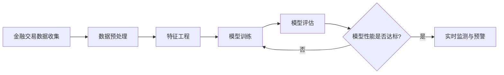

# AI在反金融欺诈中的深度应用研究

> 关键词：AI、反金融欺诈、机器学习、深度学习、数据挖掘

> 摘要：本文深入探讨了AI在反金融欺诈领域的深度应用。首先介绍了研究的背景、目的、预期读者和文档结构等内容。接着阐述了相关核心概念及其联系，详细讲解了核心算法原理和具体操作步骤，并给出相应的Python代码示例。还介绍了涉及的数学模型和公式，通过实际案例进行说明。然后展示了项目实战部分，包括开发环境搭建、源代码实现和解读。分析了AI在反金融欺诈中的实际应用场景，推荐了学习资源、开发工具框架和相关论文著作。最后总结了未来发展趋势与挑战，提供了常见问题解答和扩展阅读参考资料，旨在为金融行业有效利用AI技术防范欺诈提供全面的指导。

## 1. 背景介绍 
### 1.1 目的和范围
随着金融行业的快速发展和数字化转型，金融欺诈问题日益严重，给金融机构和客户带来了巨大的损失。传统的反欺诈方法在面对复杂多变的欺诈手段时逐渐显得力不从心。本研究的目的在于深入探索AI技术在反金融欺诈中的应用，分析其原理、优势和局限性，为金融机构提供有效的反欺诈解决方案。研究范围涵盖了常见的金融欺诈类型，如信用卡欺诈、贷款欺诈、保险欺诈等，以及多种AI技术，包括机器学习、深度学习、数据挖掘等在反欺诈中的应用。

### 1.2 预期读者
本文的预期读者包括金融行业从业者，如银行风控人员、保险理赔人员、金融分析师等，他们可以从中获取利用AI技术提升反欺诈能力的方法和思路；AI技术开发者，通过了解金融欺诈场景和需求，为开发更有效的反欺诈算法提供参考；以及对金融科技和反欺诈领域感兴趣的研究人员和学者，为他们的研究提供理论和实践依据。

### 1.3 文档结构概述
本文将按照以下结构展开：首先介绍相关的核心概念和它们之间的联系，包括金融欺诈的定义、AI技术的分类等；接着详细阐述核心算法原理和具体操作步骤，并给出Python代码示例；然后介绍涉及的数学模型和公式，并举例说明；之后通过项目实战展示AI在反金融欺诈中的具体应用，包括开发环境搭建、源代码实现和解读；分析AI在反金融欺诈中的实际应用场景；推荐相关的学习资源、开发工具框架和论文著作；最后总结未来发展趋势与挑战，提供常见问题解答和扩展阅读参考资料。

### 1.4 术语表
#### 1.4.1 核心术语定义
- **金融欺诈**：指以非法占有为目的，通过虚构事实、隐瞒真相或其他欺骗手段，骗取金融机构或客户资金、财产或信用的行为。
- **AI（人工智能）**：是一门研究如何使计算机能够模拟人类智能的学科和技术，包括机器学习、深度学习、自然语言处理等多个领域。
- **机器学习**：是AI的一个分支，它通过让计算机从数据中学习模式和规律，从而实现对未知数据的预测和分类。
- **深度学习**：是一种基于人工神经网络的机器学习技术，它能够自动从大量数据中学习复杂的特征表示。
- **数据挖掘**：是指从大量数据中发现有价值信息和知识的过程，包括数据预处理、特征选择、模型构建等步骤。

#### 1.4.2 相关概念解释
- **特征工程**：是指从原始数据中提取和选择有意义的特征，以提高机器学习模型的性能。特征工程包括特征提取、特征选择和特征变换等步骤。
- **模型评估**：是指使用一定的指标和方法来评估机器学习模型的性能，常见的评估指标包括准确率、召回率、F1值等。
- **过拟合**：是指机器学习模型在训练数据上表现良好，但在测试数据上表现不佳的现象，通常是由于模型过于复杂导致的。
- **欠拟合**：是指机器学习模型在训练数据和测试数据上的表现都不佳的现象，通常是由于模型过于简单导致的。

#### 1.4.3 缩略词列表
- **AI**：Artificial Intelligence（人工智能）
- **ML**：Machine Learning（机器学习）
- **DL**：Deep Learning（深度学习）
- **ROC**：Receiver Operating Characteristic（受试者工作特征曲线）
- **AUC**：Area Under the Curve（曲线下面积）

## 2. 核心概念与联系 

### 核心概念原理
#### 金融欺诈的类型和特点
金融欺诈的类型多种多样，常见的有信用卡欺诈、贷款欺诈、保险欺诈等。信用卡欺诈通常表现为盗刷、恶意透支等行为；贷款欺诈可能包括虚假身份申请贷款、虚报收入等；保险欺诈则可能涉及伪造事故、夸大损失等。这些欺诈行为的特点是具有隐蔽性、多样性和动态性，欺诈者会不断变换手段以逃避检测。

#### AI技术在反金融欺诈中的应用原理
AI技术在反金融欺诈中的应用主要基于数据驱动的方法。通过收集大量的金融交易数据，包括客户信息、交易时间、交易金额等，利用机器学习和深度学习算法对这些数据进行分析和建模。模型可以学习到正常交易和欺诈交易的特征模式，从而对新的交易进行实时监测和判断。

### 架构的文本示意图
```plaintext
金融交易数据收集 --> 数据预处理（清洗、归一化等） --> 特征工程（提取、选择特征） --> 模型训练（机器学习/深度学习模型） --> 模型评估（准确率、召回率等） --> 实时监测与预警
```

### Mermaid流程图


## 3. 核心算法原理 & 具体操作步骤 

### 核心算法原理
#### 逻辑回归算法
逻辑回归是一种常用的机器学习算法，用于二分类问题，如判断一笔交易是否为欺诈交易。它的基本原理是通过对输入特征进行线性组合，然后使用逻辑函数将线性组合的结果映射到[0, 1]区间，得到一个概率值。如果概率值大于某个阈值，则判断为正类（欺诈交易），否则判断为负类（正常交易）。

#### 决策树算法
决策树是一种基于树结构进行决策的算法。它通过对特征进行划分，构建一个树形结构，每个内部节点表示一个特征的划分条件，每个分支表示一个划分结果，每个叶节点表示一个类别。在进行预测时，从根节点开始，根据特征的值沿着分支向下遍历，直到到达叶节点，叶节点所代表的类别即为预测结果。

#### 神经网络算法
神经网络是一种模仿人类神经系统的计算模型，由多个神经元组成。深度学习中的神经网络通常具有多个隐藏层，可以自动学习数据中的复杂特征表示。在反金融欺诈中，神经网络可以对交易数据进行深层次的特征提取和分析，从而提高欺诈检测的准确性。

### 具体操作步骤及Python代码示例
#### 数据加载和预处理
```python
import pandas as pd
from sklearn.preprocessing import StandardScaler
from sklearn.model_selection import train_test_split

# 加载数据
data = pd.read_csv('financial_transactions.csv')

# 分离特征和标签
X = data.drop('is_fraud', axis=1)
y = data['is_fraud']

# 数据标准化
scaler = StandardScaler()
X_scaled = scaler.fit_transform(X)

# 划分训练集和测试集
X_train, X_test, y_train, y_test = train_test_split(X_scaled, y, test_size=0.2, random_state=42)
```

#### 逻辑回归模型训练和预测
```python
from sklearn.linear_model import LogisticRegression
from sklearn.metrics import accuracy_score

# 创建逻辑回归模型
lr_model = LogisticRegression()

# 训练模型
lr_model.fit(X_train, y_train)

# 预测
y_pred = lr_model.predict(X_test)

# 计算准确率
accuracy = accuracy_score(y_test, y_pred)
print(f"逻辑回归模型准确率: {accuracy}")
```

#### 决策树模型训练和预测
```python
from sklearn.tree import DecisionTreeClassifier

# 创建决策树模型
dt_model = DecisionTreeClassifier()

# 训练模型
dt_model.fit(X_train, y_train)

# 预测
y_pred = dt_model.predict(X_test)

# 计算准确率
accuracy = accuracy_score(y_test, y_pred)
print(f"决策树模型准确率: {accuracy}")
```

#### 神经网络模型训练和预测
```python
import tensorflow as tf
from tensorflow.keras.models import Sequential
from tensorflow.keras.layers import Dense

# 创建神经网络模型
nn_model = Sequential([
    Dense(64, activation='relu', input_shape=(X_train.shape[1],)),
    Dense(32, activation='relu'),
    Dense(1, activation='sigmoid')
])

# 编译模型
nn_model.compile(optimizer='adam', loss='binary_crossentropy', metrics=['accuracy'])

# 训练模型
nn_model.fit(X_train, y_train, epochs=10, batch_size=32, validation_data=(X_test, y_test))

# 评估模型
_, accuracy = nn_model.evaluate(X_test, y_test)
print(f"神经网络模型准确率: {accuracy}")
```

## 4. 数学模型和公式 & 详细讲解 & 举例说明 

### 逻辑回归数学模型和公式
逻辑回归的数学模型可以表示为：
$$
P(y = 1|x) = \frac{1}{1 + e^{-(w^T x + b)}}
$$
其中，$P(y = 1|x)$ 表示在输入特征 $x$ 下，样本属于正类（欺诈交易）的概率；$w$ 是权重向量，$b$ 是偏置项。

逻辑回归的目标是通过最大化似然函数来估计参数 $w$ 和 $b$。似然函数可以表示为：
$$
L(w, b) = \prod_{i=1}^{n} [P(y_i = 1|x_i)]^{y_i} [1 - P(y_i = 1|x_i)]^{1 - y_i}
$$
为了方便计算，通常对似然函数取对数，得到对数似然函数：
$$
\ell(w, b) = \sum_{i=1}^{n} [y_i \log P(y_i = 1|x_i) + (1 - y_i) \log (1 - P(y_i = 1|x_i))]
$$
然后使用梯度下降等优化算法来最大化对数似然函数，从而得到最优的参数 $w$ 和 $b$。

### 决策树数学模型和公式
决策树的构建过程通常基于信息增益、信息增益率或基尼指数等指标来选择最优的特征进行划分。以信息增益为例，信息增益的计算公式为：
$$
IG(D, A) = H(D) - H(D|A)
$$
其中，$IG(D, A)$ 表示在数据集 $D$ 上使用特征 $A$ 进行划分所获得的信息增益；$H(D)$ 表示数据集 $D$ 的熵，计算公式为：
$$
H(D) = - \sum_{k=1}^{K} p_k \log_2 p_k
$$
其中，$p_k$ 表示数据集 $D$ 中属于第 $k$ 类的样本比例；$H(D|A)$ 表示在特征 $A$ 给定的条件下，数据集 $D$ 的条件熵，计算公式为：
$$
H(D|A) = \sum_{v=1}^{V} \frac{|D^v|}{|D|} H(D^v)
$$
其中，$D^v$ 表示数据集 $D$ 中特征 $A$ 取值为 $v$ 的样本子集。

### 神经网络数学模型和公式
神经网络的基本单元是神经元，神经元的输出可以表示为：
$$
y = f(w^T x + b)
$$
其中，$x$ 是输入向量，$w$ 是权重向量，$b$ 是偏置项，$f$ 是激活函数，常见的激活函数有 sigmoid 函数、ReLU 函数等。

在神经网络的训练过程中，通常使用反向传播算法来更新权重和偏置。反向传播算法的核心是计算损失函数对权重和偏置的梯度，然后使用梯度下降等优化算法来更新参数。以均方误差损失函数为例，其计算公式为：
$$
L = \frac{1}{2} \sum_{i=1}^{n} (y_i - \hat{y}_i)^2
$$
其中，$y_i$ 是真实标签，$\hat{y}_i$ 是模型的预测值。

### 举例说明
假设我们有一个简单的逻辑回归问题，输入特征 $x = [x_1, x_2]$，权重向量 $w = [0.5, 0.3]$，偏置项 $b = 0.1$。则输入特征的线性组合为：
$$
z = w^T x + b = 0.5x_1 + 0.3x_2 + 0.1
$$
使用逻辑函数将 $z$ 映射到[0, 1]区间，得到概率值：
$$
P(y = 1|x) = \frac{1}{1 + e^{-z}}
$$
假设 $x_1 = 1$，$x_2 = 2$，则 $z = 0.5\times1 + 0.3\times2 + 0.1 = 1.2$，$P(y = 1|x) = \frac{1}{1 + e^{-1.2}} \approx 0.77$。如果设定阈值为 0.5，则判断该样本为正类（欺诈交易）。

## 5. 项目实战：代码实际案例和详细解释说明 

### 5.1  开发环境搭建
#### 安装Python和相关库
首先需要安装Python环境，建议使用Python 3.7及以上版本。可以从Python官方网站（https://www.python.org/downloads/）下载并安装。

安装完成后，使用以下命令安装所需的库：
```bash
pip install pandas numpy scikit-learn tensorflow
```

#### 数据准备
准备金融交易数据集，数据集应包含特征列和标签列，标签列表示该交易是否为欺诈交易。可以从公开数据集网站或金融机构获取相关数据。

### 5.2  源代码详细实现和代码解读
```python
import pandas as pd
from sklearn.preprocessing import StandardScaler
from sklearn.model_selection import train_test_split
from sklearn.linear_model import LogisticRegression
from sklearn.metrics import accuracy_score

# 加载数据
data = pd.read_csv('financial_transactions.csv')

# 代码解读：使用pandas库的read_csv函数读取CSV格式的金融交易数据。

# 分离特征和标签
X = data.drop('is_fraud', axis=1)
y = data['is_fraud']

# 代码解读：将数据集中的特征列（除了标签列）提取出来作为输入特征X，将标签列提取出来作为目标标签y。

# 数据标准化
scaler = StandardScaler()
X_scaled = scaler.fit_transform(X)

# 代码解读：使用StandardScaler类对输入特征进行标准化处理，将特征值缩放到均值为0，标准差为1的范围内，有助于提高模型的训练效果。

# 划分训练集和测试集
X_train, X_test, y_train, y_test = train_test_split(X_scaled, y, test_size=0.2, random_state=42)

# 代码解读：使用train_test_split函数将数据集划分为训练集和测试集，测试集占总数据集的20%，random_state参数用于保证每次划分的结果一致。

# 创建逻辑回归模型
lr_model = LogisticRegression()

# 代码解读：创建一个逻辑回归模型实例。

# 训练模型
lr_model.fit(X_train, y_train)

# 代码解读：使用训练集数据对逻辑回归模型进行训练，让模型学习正常交易和欺诈交易的特征模式。

# 预测
y_pred = lr_model.predict(X_test)

# 代码解读：使用训练好的模型对测试集数据进行预测，得到预测结果y_pred。

# 计算准确率
accuracy = accuracy_score(y_test, y_pred)
print(f"逻辑回归模型准确率: {accuracy}")

# 代码解读：使用accuracy_score函数计算模型的准确率，即预测正确的样本数占总样本数的比例，并将结果打印输出。
```

### 5.3  代码解读与分析
#### 数据加载和预处理
数据加载和预处理是整个项目的基础，通过读取CSV文件和对数据进行标准化处理，为后续的模型训练做好准备。标准化处理可以避免特征值的尺度差异对模型训练的影响，提高模型的收敛速度和性能。

#### 模型训练和预测
使用逻辑回归模型进行训练和预测，逻辑回归是一种简单而有效的分类算法，适用于二分类问题。通过对训练集数据的学习，模型可以得到最优的参数，从而对测试集数据进行准确的预测。

#### 模型评估
使用准确率作为模型的评估指标，准确率是一种常用的评估指标，但在处理不平衡数据集时可能存在局限性。在实际应用中，还可以使用召回率、F1值等指标来更全面地评估模型的性能。

## 6. 实际应用场景 
### 信用卡欺诈检测
在信用卡交易中，AI技术可以实时监测每一笔交易，通过分析交易的时间、地点、金额、商户类型等特征，判断该交易是否存在欺诈风险。如果检测到异常交易，系统可以及时发出预警，阻止交易或要求用户进行身份验证，从而有效减少信用卡盗刷和恶意透支等欺诈行为的发生。

### 贷款欺诈检测
在贷款申请过程中，AI技术可以对申请人的个人信息、信用记录、收入情况等进行全面分析，识别虚假身份、虚报收入等欺诈行为。通过建立风险评估模型，对申请人的还款能力和信用风险进行评估，帮助金融机构做出更准确的贷款决策，降低贷款违约风险。

### 保险欺诈检测
在保险理赔过程中，AI技术可以对理赔申请进行审核，通过分析事故现场照片、医疗记录、证人证言等信息，判断是否存在伪造事故、夸大损失等欺诈行为。利用图像识别、自然语言处理等技术，提高理赔审核的效率和准确性，减少保险欺诈带来的损失。

### 金融市场操纵检测
在金融市场中，AI技术可以对交易数据、新闻资讯、社交媒体等信息进行实时监测和分析，识别市场操纵行为，如内幕交易、股价操纵等。通过建立异常交易模式识别模型，及时发现市场中的异常波动和可疑交易行为，维护金融市场的公平和稳定。

## 7. 工具和资源推荐
### 7.1 学习资源推荐
#### 7.1.1 书籍推荐
- 《机器学习》（周志华）：全面介绍了机器学习的基本概念、算法和应用，是机器学习领域的经典教材。
- 《深度学习》（Ian Goodfellow、Yoshua Bengio和Aaron Courville）：系统阐述了深度学习的理论和实践，是深度学习领域的权威著作。
- 《Python数据分析实战》（Sebastian Raschka）：介绍了使用Python进行数据分析的方法和技巧，包括数据处理、可视化和机器学习等方面。

#### 7.1.2 在线课程
- Coursera上的“机器学习”课程（Andrew Ng教授主讲）：该课程是机器学习领域的经典在线课程，讲解深入浅出，适合初学者入门。
- edX上的“深度学习基础”课程：由微软提供，介绍了深度学习的基本概念和算法，通过实际案例进行讲解，具有很强的实践性。
- Kaggle上的机器学习和深度学习微课程：提供了丰富的数据集和实践项目，帮助学习者在实践中提高技能。

#### 7.1.3 技术博客和网站
- Towards Data Science：一个专注于数据科学和机器学习的技术博客，提供了大量的优质文章和教程。
- Medium上的AI和数据科学板块：汇聚了众多数据科学家和AI专家的分享，涵盖了各种前沿技术和应用案例。
- 阿里云开发者社区：提供了丰富的技术文档和案例分享，包括AI在金融领域的应用实践。

### 7.2 开发工具框架推荐
#### 7.2.1 IDE和编辑器
- PyCharm：一款专业的Python集成开发环境，提供了代码编辑、调试、版本控制等功能，适合Python开发。
- Jupyter Notebook：一个交互式的开发环境，支持Python、R等多种编程语言，方便进行数据分析和模型实验。
- Visual Studio Code：一款轻量级的代码编辑器，支持多种编程语言和插件扩展，具有良好的开发体验。

#### 7.2.2 调试和性能分析工具
- TensorBoard：TensorFlow提供的可视化工具，可以用于监控模型的训练过程、分析模型的性能和查看模型的结构。
- Py-Spy：一个用于Python代码性能分析的工具，可以实时查看代码的CPU使用率和函数调用情况。
- Scikit-learn中的模型评估工具：提供了各种模型评估指标和方法，方便对机器学习模型进行评估和比较。

#### 7.2.3 相关框架和库
- TensorFlow：一个开源的深度学习框架，提供了丰富的深度学习模型和工具，支持分布式训练和部署。
- PyTorch：另一个流行的深度学习框架，具有动态图机制，易于使用和调试，广泛应用于学术界和工业界。
- Scikit-learn：一个简单易用的机器学习库，提供了各种机器学习算法和工具，适合初学者和快速原型开发。

### 7.3 相关论文著作推荐
#### 7.3.1 经典论文
- “A Unified Approach to Interpreting Model Predictions”（Scott Lundberg和Su-In Lee）：提出了SHAP（SHapley Additive exPlanations）方法，用于解释机器学习模型的预测结果。
- “Deep Residual Learning for Image Recognition”（Kaiming He等）：介绍了残差网络（ResNet）的结构和原理，解决了深度神经网络训练中的梯度消失问题。
- “Generative Adversarial Nets”（Ian Goodfellow等）：提出了生成对抗网络（GAN）的概念，开创了生成式模型的新纪元。

#### 7.3.2 最新研究成果
- 在顶级学术会议如NeurIPS、ICML、CVPR等上发表的关于AI在反金融欺诈中的研究论文，这些论文代表了该领域的最新研究动态和技术趋势。
- 知名学术期刊如Journal of Financial Economics、Management Science等上发表的关于金融欺诈检测和风险管理的研究成果。

#### 7.3.3 应用案例分析
- 金融机构如银行、保险公司等发布的关于AI在反欺诈中的应用案例报告，这些报告详细介绍了实际应用中的技术方案、实施过程和效果评估。
- 咨询公司和研究机构发布的关于金融科技和反欺诈的行业研究报告，提供了行业的整体情况和发展趋势分析。

## 8. 总结：未来发展趋势与挑战
### 未来发展趋势
#### 多模态数据融合
未来，AI在反金融欺诈中将更多地融合多模态数据，如文本、图像、音频等。通过综合分析多种类型的数据，可以更全面地了解交易场景和客户行为，提高欺诈检测的准确性。

#### 强化学习应用
强化学习可以让模型在动态环境中不断学习和优化策略，适用于处理复杂多变的金融欺诈场景。未来，强化学习有望在反金融欺诈中得到更广泛的应用，实现实时决策和自适应防范。

#### 联邦学习与隐私保护
随着数据隐私保护意识的增强，联邦学习将成为未来反金融欺诈的重要发展方向。联邦学习可以在不共享原始数据的情况下，让多个参与方联合训练模型，既保护了数据隐私，又提高了模型的性能。

#### 与区块链技术结合
区块链技术具有去中心化、不可篡改等特点，可以为金融交易提供更安全的保障。未来，AI与区块链技术的结合将有助于构建更加可信的金融交易环境，有效防范欺诈行为。

### 挑战
#### 数据质量和可用性
金融数据通常具有高维度、不平衡、噪声大等特点，数据质量和可用性对模型的性能有很大影响。如何有效地清洗、预处理和标注数据，是提高反欺诈模型性能的关键挑战之一。

#### 模型可解释性
深度学习模型通常具有很高的复杂度，其决策过程难以理解和解释。在金融领域，模型的可解释性至关重要，因为监管机构和客户需要了解模型的决策依据。如何提高模型的可解释性，是AI在反金融欺诈中面临的重要挑战。

#### 欺诈手段的动态变化
欺诈者会不断变换欺诈手段，以逃避检测。反欺诈模型需要及时适应这些变化，保持较高的检测准确率。如何建立动态更新的模型和实时监测机制，是应对欺诈手段动态变化的挑战。

#### 技术成本和人才短缺
AI技术的应用需要大量的计算资源和专业人才，技术成本较高。同时，金融行业对既懂金融业务又懂AI技术的复合型人才需求旺盛，但目前这类人才相对短缺。如何降低技术成本和培养复合型人才，是推动AI在反金融欺诈中广泛应用的挑战。

## 9. 附录：常见问题与解答
### 问题1：如何选择合适的AI算法进行反金融欺诈？
解答：选择合适的AI算法需要考虑多个因素，如数据特点、问题复杂度、模型可解释性等。对于简单的二分类问题，可以选择逻辑回归、决策树等算法；对于复杂的非线性问题，可以考虑使用神经网络、支持向量机等算法。同时，还需要进行模型评估和比较，选择性能最优的算法。

### 问题2：如何处理金融数据中的不平衡问题？
解答：金融数据通常存在不平衡问题，即欺诈交易的样本数量远少于正常交易的样本数量。可以采用以下方法处理不平衡问题：
- 过采样：通过复制少数类样本或生成新的少数类样本，增加少数类样本的数量。
- 欠采样：通过删除多数类样本，减少多数类样本的数量。
- 调整模型权重：在模型训练时，给少数类样本赋予更高的权重，提高模型对少数类样本的关注度。

### 问题3：如何评估反欺诈模型的性能？
解答：评估反欺诈模型的性能可以使用多种指标，常见的指标包括准确率、召回率、F1值、ROC曲线和AUC值等。准确率反映了模型预测正确的样本数占总样本数的比例；召回率反映了模型正确预测出的欺诈样本数占实际欺诈样本数的比例；F1值是准确率和召回率的调和平均数，综合考虑了两者的性能；ROC曲线和AUC值可以直观地展示模型在不同阈值下的性能表现。

### 问题4：如何保证反欺诈模型的实时性？
解答：为了保证反欺诈模型的实时性，可以采取以下措施：
- 优化模型结构：选择计算复杂度较低的模型结构，减少模型的计算时间。
- 并行计算：利用多核CPU或GPU进行并行计算，提高模型的计算速度。
- 缓存机制：对一些常用的数据和计算结果进行缓存，避免重复计算。
- 实时数据流处理：使用实时数据流处理框架，如Apache Kafka、Flink等，对实时交易数据进行快速处理和分析。

## 10. 扩展阅读 & 参考资料
### 扩展阅读
- 《金融科技：应用与创新》：介绍了金融科技的各个领域，包括AI在金融领域的应用，提供了更广泛的金融科技知识。
- 《智能风控：信用评分建模与大数据应用》：深入探讨了智能风控的原理和方法，包括信用评分模型的构建和大数据在风控中的应用。

### 参考资料
- Kaggle上的金融欺诈检测数据集和相关竞赛项目，提供了实际的数据集和解决方案。
- 金融机构和监管机构发布的关于反金融欺诈的政策文件和研究报告，了解行业的最新动态和要求。
- 学术数据库如IEEE Xplore、ACM Digital Library等，获取关于AI和金融欺诈检测的学术论文和研究成果。

作者：AI天才研究院/AI Genius Institute & 禅与计算机程序设计艺术 /Zen And The Art of Computer Programming