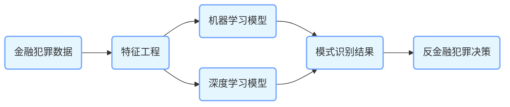

# AI在反金融犯罪模式识别中的深度应用研究

> 关键词：人工智能、反金融犯罪、模式识别、机器学习、深度学习

> 摘要：本文聚焦于AI在反金融犯罪模式识别中的深度应用。首先介绍了研究的背景、目的、预期读者等内容。详细阐述了相关核心概念及其联系，包括金融犯罪模式、AI技术原理等，并通过文本示意图和Mermaid流程图进行展示。深入分析了核心算法原理，用Python代码进行详细阐述，同时给出数学模型和公式并举例说明。通过项目实战案例，展示了开发环境搭建、源代码实现与解读。探讨了AI在反金融犯罪中的实际应用场景，推荐了学习资源、开发工具框架和相关论文著作。最后总结了未来发展趋势与挑战，并提供了常见问题解答和扩展阅读参考资料。

## 1. 背景介绍 
### 1.1 目的和范围
金融犯罪是一个全球性的问题，它不仅会给金融机构和投资者带来巨大的经济损失，还会破坏金融市场的稳定和秩序。随着金融业务的不断创新和数字化发展，金融犯罪的手段也日益复杂多样，传统的反金融犯罪方法已经难以满足实际需求。人工智能（AI）技术的快速发展为反金融犯罪提供了新的思路和方法。本研究的目的在于深入探讨AI在反金融犯罪模式识别中的应用，分析其原理、方法和实际效果，为金融机构和监管部门提供有效的技术支持和决策参考。研究范围涵盖了常见的金融犯罪类型，如信用卡诈骗、洗钱、非法集资等，以及主要的AI技术，如机器学习、深度学习等在这些犯罪模式识别中的应用。

### 1.2 预期读者
本文的预期读者包括金融机构的风险管理和安全部门人员、金融监管部门的工作人员、从事金融科技研究和开发的专业人员、对AI和金融犯罪问题感兴趣的研究人员和学者等。

### 1.3 文档结构概述
本文共分为十个部分。第一部分为背景介绍，阐述研究的目的、范围、预期读者和文档结构。第二部分介绍核心概念与联系，包括金融犯罪模式、AI技术等，并通过示意图和流程图展示。第三部分讲解核心算法原理，用Python代码详细说明。第四部分给出数学模型和公式，并举例解释。第五部分通过项目实战，介绍开发环境搭建、源代码实现与解读。第六部分探讨实际应用场景。第七部分推荐学习资源、开发工具框架和相关论文著作。第八部分总结未来发展趋势与挑战。第九部分为附录，提供常见问题解答。第十部分为扩展阅读和参考资料。

### 1.4 术语表
#### 1.4.1 核心术语定义
- **人工智能（AI）**：是一门研究如何使计算机能够模拟人类智能的学科，包括机器学习、深度学习、自然语言处理等技术。
- **金融犯罪**：指在金融领域中，违反金融法规，侵犯金融管理秩序、公私财产所有权等的犯罪行为，如信用卡诈骗、洗钱、非法集资等。
- **模式识别**：是指对表征事物或现象的各种形式的（数值的、文字的和逻辑关系的）信息进行处理和分析，以对事物或现象进行描述、辨认、分类和解释的过程。
- **机器学习**：是一门多领域交叉学科，涉及概率论、统计学、逼近论、凸分析、算法复杂度理论等多门学科。它专门研究计算机怎样模拟或实现人类的学习行为，以获取新的知识或技能，重新组织已有的知识结构使之不断改善自身的性能。
- **深度学习**：是机器学习的一个分支领域，它是一种基于对数据进行表征学习的方法。深度学习通过构建具有很多层的神经网络模型，自动从大量数据中学习特征和模式。

#### 1.4.2 相关概念解释
- **特征工程**：是指从原始数据中提取特征，并将其转换为适合机器学习算法处理的格式的过程。在反金融犯罪模式识别中，特征工程的质量直接影响模型的性能。
- **过拟合**：指模型在训练数据上表现良好，但在测试数据上表现不佳的现象。过拟合通常是由于模型过于复杂，学习了训练数据中的噪声和异常值导致的。
- **欠拟合**：指模型在训练数据和测试数据上的表现都不佳的现象。欠拟合通常是由于模型过于简单，无法学习到数据中的复杂模式导致的。

#### 1.4.3 缩略词列表
- **AI**：Artificial Intelligence（人工智能）
- **ML**：Machine Learning（机器学习）
- **DL**：Deep Learning（深度学习）
- **ANN**：Artificial Neural Network（人工神经网络）
- **CNN**：Convolutional Neural Network（卷积神经网络）
- **RNN**：Recurrent Neural Network（循环神经网络）

## 2. 核心概念与联系 

### 金融犯罪模式
金融犯罪模式是指金融犯罪分子在实施犯罪过程中所采用的特定行为方式和规律。常见的金融犯罪模式包括：
- **信用卡诈骗模式**：犯罪分子通过窃取他人信用卡信息、伪造信用卡等方式进行诈骗。例如，他们可能会在ATM机上安装摄像头和读卡器，获取用户的信用卡信息，然后在网上或实体店进行消费。
- **洗钱模式**：洗钱是指将犯罪所得及其收益通过各种手段合法化的过程。常见的洗钱模式包括利用金融机构进行资金转移、投资房地产、购买奢侈品等。
- **非法集资模式**：非法集资是指未经有关部门依法批准，向社会不特定对象筹集资金的行为。非法集资模式通常包括承诺高额回报、虚构项目等手段，吸引投资者投入资金。

### AI技术原理
在反金融犯罪模式识别中，常用的AI技术包括机器学习和深度学习。
- **机器学习**：机器学习通过对大量的历史数据进行学习，构建模型来预测新的数据。常见的机器学习算法包括决策树、支持向量机、朴素贝叶斯等。例如，决策树算法通过对数据进行划分，构建决策树模型，根据输入数据的特征进行分类。
- **深度学习**：深度学习是一种基于神经网络的机器学习方法，它通过构建多层神经网络来自动学习数据的特征和模式。常见的深度学习模型包括卷积神经网络（CNN）、循环神经网络（RNN）等。例如，CNN常用于图像识别和处理，RNN常用于处理序列数据，如时间序列数据和文本数据。

### 核心概念联系示意图


从上述流程图可以看出，金融犯罪数据首先经过特征工程处理，提取出有价值的特征。然后，这些特征被输入到机器学习模型或深度学习模型中进行训练和预测。最后，模型的输出结果用于反金融犯罪决策。

## 3. 核心算法原理 & 具体操作步骤 

### 决策树算法原理
决策树是一种基于树结构进行决策的机器学习算法。它通过对数据的特征进行划分，构建决策树模型，根据输入数据的特征进行分类。决策树的每个内部节点表示一个特征上的测试，每个分支表示一个测试输出，每个叶节点表示一个类别或值。

以下是使用Python的`scikit-learn`库实现决策树分类的示例代码：
```python
from sklearn.datasets import load_iris
from sklearn.model_selection import train_test_split
from sklearn.tree import DecisionTreeClassifier
from sklearn.metrics import accuracy_score

# 加载鸢尾花数据集
iris = load_iris()
X = iris.data
y = iris.target

# 划分训练集和测试集
X_train, X_test, y_train, y_test = train_test_split(X, y, test_size=0.3, random_state=42)

# 创建决策树分类器
clf = DecisionTreeClassifier()

# 训练模型
clf.fit(X_train, y_train)

# 预测测试集
y_pred = clf.predict(X_test)

# 计算准确率
accuracy = accuracy_score(y_test, y_pred)
print(f"Accuracy: {accuracy}")
```
### 具体操作步骤
1. **数据加载**：使用`load_iris`函数加载鸢尾花数据集。
2. **数据划分**：使用`train_test_split`函数将数据集划分为训练集和测试集。
3. **模型创建**：创建`DecisionTreeClassifier`对象。
4. **模型训练**：使用`fit`方法对模型进行训练。
5. **模型预测**：使用`predict`方法对测试集进行预测。
6. **性能评估**：使用`accuracy_score`函数计算模型的准确率。

### 深度学习中的卷积神经网络（CNN）原理
卷积神经网络（CNN）是一种专门用于处理具有网格结构数据的深度学习模型，如图像和音频。CNN通过卷积层、池化层和全连接层等组件来自动学习数据的特征和模式。

以下是使用Python的`Keras`库实现简单CNN分类的示例代码：
```python
from keras.datasets import mnist
from keras.models import Sequential
from keras.layers import Conv2D, MaxPooling2D, Flatten, Dense
from keras.utils import to_categorical

# 加载MNIST数据集
(train_images, train_labels), (test_images, test_labels) = mnist.load_data()

# 数据预处理
train_images = train_images.reshape((60000, 28, 28, 1))
train_images = train_images.astype('float32') / 255
test_images = test_images.reshape((10000, 28, 28, 1))
test_images = test_images.astype('float32') / 255

train_labels = to_categorical(train_labels)
test_labels = to_categorical(test_labels)

# 创建CNN模型
model = Sequential()
model.add(Conv2D(32, (3, 3), activation='relu', input_shape=(28, 28, 1)))
model.add(MaxPooling2D((2, 2)))
model.add(Conv2D(64, (3, 3), activation='relu'))
model.add(MaxPooling2D((2, 2)))
model.add(Flatten())
model.add(Dense(64, activation='relu'))
model.add(Dense(10, activation='softmax'))

# 编译模型
model.compile(optimizer='adam',
              loss='categorical_crossentropy',
              metrics=['accuracy'])

# 训练模型
model.fit(train_images, train_labels, epochs=5, batch_size=64)

# 评估模型
test_loss, test_acc = model.evaluate(test_images, test_labels)
print(f"Test accuracy: {test_acc}")
```
### 具体操作步骤
1. **数据加载**：使用`mnist.load_data`函数加载MNIST数据集。
2. **数据预处理**：将图像数据进行重塑和归一化处理，将标签进行one-hot编码。
3. **模型创建**：使用`Sequential`模型构建CNN模型，添加卷积层、池化层、全连接层等组件。
4. **模型编译**：使用`compile`方法编译模型，指定优化器、损失函数和评估指标。
5. **模型训练**：使用`fit`方法对模型进行训练。
6. **模型评估**：使用`evaluate`方法评估模型在测试集上的性能。

## 4. 数学模型和公式 & 详细讲解 & 举例说明 

### 决策树的信息增益公式
决策树的构建通常基于信息增益来选择最优的划分特征。信息增益是指在划分数据集前后信息熵的减少量。信息熵是衡量数据不确定性的指标，信息熵越大，数据的不确定性越高。

信息熵的计算公式为：
$$H(X) = -\sum_{i=1}^{n}p(x_i)\log_2p(x_i)$$
其中，$X$ 是数据集，$p(x_i)$ 是数据集中第 $i$ 个类别出现的概率。

信息增益的计算公式为：
$$IG(D, A) = H(D) - \sum_{v\in Values(A)}\frac{|D^v|}{|D|}H(D^v)$$
其中，$D$ 是数据集，$A$ 是划分特征，$Values(A)$ 是特征 $A$ 的所有可能取值，$D^v$ 是特征 $A$ 取值为 $v$ 时的子集。

举例说明：假设有一个数据集 $D$ 包含 10 个样本，其中正类样本有 6 个，负类样本有 4 个。则数据集 $D$ 的信息熵为：
$$H(D) = -\frac{6}{10}\log_2\frac{6}{10} - \frac{4}{10}\log_2\frac{4}{10} \approx 0.971$$

假设我们选择特征 $A$ 进行划分，特征 $A$ 有两个取值 $v_1$ 和 $v_2$，划分后 $D^{v_1}$ 包含 4 个样本，其中正类样本有 3 个，负类样本有 1 个；$D^{v_2}$ 包含 6 个样本，其中正类样本有 3 个，负类样本有 3 个。则划分后的信息熵为：
$$H(D^{v_1}) = -\frac{3}{4}\log_2\frac{3}{4} - \frac{1}{4}\log_2\frac{1}{4} \approx 0.811$$
$$H(D^{v_2}) = -\frac{3}{6}\log_2\frac{3}{6} - \frac{3}{6}\log_2\frac{3}{6} = 1$$
$$\sum_{v\in Values(A)}\frac{|D^v|}{|D|}H(D^v) = \frac{4}{10} \times 0.811 + \frac{6}{10} \times 1 \approx 0.924$$

信息增益为：
$$IG(D, A) = H(D) - \sum_{v\in Values(A)}\frac{|D^v|}{|D|}H(D^v) \approx 0.971 - 0.924 = 0.047$$

### 卷积神经网络的卷积操作公式
卷积神经网络中的卷积操作是通过卷积核（滤波器）在输入数据上滑动进行的。卷积操作的公式为：
$$(I * K)_{i,j} = \sum_{m=0}^{M-1}\sum_{n=0}^{N-1}I_{i+m,j+n}K_{m,n}$$
其中，$I$ 是输入数据，$K$ 是卷积核，$M$ 和 $N$ 是卷积核的大小，$(I * K)_{i,j}$ 是卷积结果在位置 $(i, j)$ 处的值。

举例说明：假设有一个 3x3 的输入数据 $I$ 和一个 2x2 的卷积核 $K$，如下所示：
$$I = \begin{bmatrix}
1 & 2 & 3 \\
4 & 5 & 6 \\
7 & 8 & 9
\end{bmatrix}$$
$$K = \begin{bmatrix}
1 & 0 \\
0 & 1
\end{bmatrix}$$

卷积操作的过程如下：
- 首先，将卷积核的左上角与输入数据的左上角对齐，进行元素相乘并求和：
$$(I * K)_{0,0} = 1\times1 + 2\times0 + 4\times0 + 5\times1 = 6$$
- 然后，将卷积核向右滑动一个位置，继续进行元素相乘并求和：
$$(I * K)_{0,1} = 2\times1 + 3\times0 + 5\times0 + 6\times1 = 8$$
- 以此类推，直到卷积核遍历完整个输入数据。

最终的卷积结果为：
$$(I * K) = \begin{bmatrix}
6 & 8 \\
12 & 14
\end{bmatrix}$$

## 5. 项目实战：代码实际案例和详细解释说明 

### 5.1  开发环境搭建
在进行反金融犯罪模式识别的项目实战之前，需要搭建相应的开发环境。以下是具体的搭建步骤：
1. **安装Python**：建议使用Python 3.7及以上版本。可以从Python官方网站（https://www.python.org/downloads/）下载并安装。
2. **安装Anaconda**：Anaconda是一个用于科学计算的Python发行版，包含了许多常用的科学计算库和工具。可以从Anaconda官方网站（https://www.anaconda.com/products/individual）下载并安装。
3. **创建虚拟环境**：为了避免不同项目之间的库冲突，建议使用虚拟环境。可以使用Anaconda的`conda`命令创建虚拟环境：
```bash
conda create -n anti_financial_crime python=3.8
conda activate anti_financial_crime
```
4. **安装必要的库**：在虚拟环境中安装必要的库，如`pandas`、`numpy`、`scikit-learn`、`tensorflow`、`keras`等：
```bash
pip install pandas numpy scikit-learn tensorflow keras
```

### 5.2  源代码详细实现和代码解读
以下是一个使用机器学习算法进行信用卡诈骗识别的示例代码：
```python
import pandas as pd
from sklearn.model_selection import train_test_split
from sklearn.ensemble import RandomForestClassifier
from sklearn.metrics import accuracy_score, confusion_matrix

# 加载数据集
data = pd.read_csv('creditcard.csv')

# 分离特征和标签
X = data.drop('Class', axis=1)
y = data['Class']

# 划分训练集和测试集
X_train, X_test, y_train, y_test = train_test_split(X, y, test_size=0.2, random_state=42)

# 创建随机森林分类器
clf = RandomForestClassifier()

# 训练模型
clf.fit(X_train, y_train)

# 预测测试集
y_pred = clf.predict(X_test)

# 计算准确率
accuracy = accuracy_score(y_test, y_pred)
print(f"Accuracy: {accuracy}")

# 计算混淆矩阵
conf_matrix = confusion_matrix(y_test, y_pred)
print(f"Confusion matrix:\n{conf_matrix}")
```
### 代码解读
1. **数据加载**：使用`pandas`库的`read_csv`函数加载信用卡诈骗数据集。
2. **特征和标签分离**：使用`drop`方法将标签列`Class`从数据集中分离出来，得到特征矩阵`X`和标签向量`y`。
3. **数据划分**：使用`train_test_split`函数将数据集划分为训练集和测试集，测试集占比为20%。
4. **模型创建**：创建`RandomForestClassifier`对象，使用随机森林算法进行分类。
5. **模型训练**：使用`fit`方法对模型进行训练。
6. **模型预测**：使用`predict`方法对测试集进行预测。
7. **性能评估**：使用`accuracy_score`函数计算模型的准确率，使用`confusion_matrix`函数计算混淆矩阵。

### 5.3  代码解读与分析
- **准确率**：准确率是指模型预测正确的样本数占总样本数的比例。在信用卡诈骗识别中，准确率可以反映模型的整体性能。
- **混淆矩阵**：混淆矩阵是一种用于评估分类模型性能的工具，它可以展示模型在不同类别上的预测结果。在信用卡诈骗识别中，混淆矩阵可以帮助我们分析模型在识别正常交易和诈骗交易方面的表现。

通过对混淆矩阵的分析，我们可以计算出模型的召回率、精确率和F1值等指标，进一步评估模型的性能。

## 6. 实际应用场景 
### 信用卡诈骗识别
信用卡诈骗是一种常见的金融犯罪形式，犯罪分子通过窃取他人信用卡信息、伪造信用卡等方式进行诈骗。AI技术可以通过对信用卡交易数据进行分析，识别出异常的交易模式，从而及时发现和防范信用卡诈骗。例如，通过分析交易的时间、地点、金额等特征，建立机器学习模型，对交易进行实时监测和预警。

### 洗钱识别
洗钱是指将犯罪所得及其收益通过各种手段合法化的过程。AI技术可以通过对金融交易数据进行分析，识别出可疑的资金流动模式，从而发现和防范洗钱行为。例如，通过分析资金的来源、去向、交易频率等特征，建立深度学习模型，对资金流动进行实时监测和分析。

### 非法集资识别
非法集资是指未经有关部门依法批准，向社会不特定对象筹集资金的行为。AI技术可以通过对互联网金融平台、社交媒体等渠道的数据进行分析，识别出可疑的非法集资项目，从而及时发现和防范非法集资行为。例如，通过分析项目的宣传内容、投资回报承诺、参与者信息等特征，建立自然语言处理模型，对非法集资项目进行识别和预警。

### 贷款欺诈识别
贷款欺诈是指借款人在申请贷款时提供虚假信息或故意隐瞒重要信息，以获取贷款的行为。AI技术可以通过对借款人的信用记录、收入情况、资产状况等数据进行分析，识别出可疑的贷款申请，从而及时发现和防范贷款欺诈行为。例如，通过分析借款人的信用评分、还款历史、负债情况等特征，建立机器学习模型，对贷款申请进行风险评估和预警。

## 7. 工具和资源推荐
### 7.1 学习资源推荐
#### 7.1.1 书籍推荐
- 《机器学习》（周志华）：这本书是机器学习领域的经典教材，系统地介绍了机器学习的基本概念、算法和应用。
- 《深度学习》（Ian Goodfellow、Yoshua Bengio和Aaron Courville）：这本书是深度学习领域的权威著作，全面介绍了深度学习的理论、算法和应用。
- 《Python机器学习》（Sebastian Raschka）：这本书结合Python语言，详细介绍了机器学习的基本算法和实践应用。

#### 7.1.2 在线课程
- Coursera上的“机器学习”课程（Andrew Ng教授授课）：这是一门非常经典的机器学习在线课程，涵盖了机器学习的基本概念、算法和应用。
- edX上的“深度学习”课程（由多个知名大学的教授授课）：这门课程深入介绍了深度学习的理论和实践，包括卷积神经网络、循环神经网络等。
- Kaggle上的“机器学习微课程”：这是一个免费的机器学习在线课程，适合初学者快速入门。

#### 7.1.3 技术博客和网站
- Medium：Medium上有许多关于AI和机器学习的技术博客，涵盖了最新的研究成果和实践经验。
- Towards Data Science：这是一个专注于数据科学和机器学习的技术博客，提供了许多高质量的文章和教程。
- arXiv：arXiv是一个预印本服务器，提供了大量的学术论文，包括AI和机器学习领域的最新研究成果。

### 7.2 开发工具框架推荐
#### 7.2.1 IDE和编辑器
- PyCharm：PyCharm是一款专门为Python开发设计的集成开发环境（IDE），提供了丰富的功能和插件，适合专业的Python开发者。
- Jupyter Notebook：Jupyter Notebook是一个交互式的开发环境，支持Python、R等多种编程语言，适合数据科学和机器学习的实验和开发。
- Visual Studio Code：Visual Studio Code是一款轻量级的代码编辑器，支持多种编程语言和插件，适合快速开发和调试。

#### 7.2.2 调试和性能分析工具
- TensorBoard：TensorBoard是TensorFlow的可视化工具，可以帮助开发者监控模型的训练过程、分析模型的性能和结构。
- Py-Spy：Py-Spy是一个用于Python代码性能分析的工具，可以帮助开发者找出代码中的性能瓶颈。
- cProfile：cProfile是Python标准库中的一个性能分析工具，可以帮助开发者分析代码的执行时间和调用关系。

#### 7.2.3 相关框架和库
- TensorFlow：TensorFlow是一个开源的深度学习框架，由Google开发和维护，支持多种深度学习模型和算法。
- PyTorch：PyTorch是一个开源的深度学习框架，由Facebook开发和维护，具有动态图和易于使用的特点。
- scikit-learn：scikit-learn是一个开源的机器学习库，提供了丰富的机器学习算法和工具，适合初学者和快速开发。

### 7.3 相关论文著作推荐
#### 7.3.1 经典论文
- “A Logical Calculus of the Ideas Immanent in Nervous Activity”（Warren S. McCulloch和Walter Pitts）：这篇论文提出了人工神经网络的基本概念，是神经网络领域的经典之作。
- “Learning Representations by Back-propagating Errors”（David E. Rumelhart、Geoffrey E. Hinton和Ronald J. Williams）：这篇论文提出了反向传播算法，是深度学习领域的重要突破。
- “ImageNet Classification with Deep Convolutional Neural Networks”（Alex Krizhevsky、Ilya Sutskever和Geoffrey E. Hinton）：这篇论文介绍了AlexNet卷积神经网络，开启了深度学习在图像识别领域的新纪元。

#### 7.3.2 最新研究成果
- 在顶级学术会议（如NeurIPS、ICML、CVPR等）和期刊（如Journal of Machine Learning Research、Artificial Intelligence等）上发表的关于AI和机器学习在反金融犯罪领域的最新研究成果。
- 金融科技领域的研究报告和白皮书，如毕马威、普华永道等机构发布的相关报告。

#### 7.3.3 应用案例分析
- 各大金融机构和科技公司发布的关于AI在反金融犯罪中的应用案例，如银行、证券、保险等行业的实际应用案例。
- 开源项目和竞赛平台（如Kaggle）上的反金融犯罪相关的数据集和解决方案。

## 8. 总结：未来发展趋势与挑战
### 未来发展趋势
- **多模态数据融合**：未来，AI在反金融犯罪模式识别中将越来越多地融合多模态数据，如文本、图像、音频等。通过综合分析多种类型的数据，可以更全面地了解金融犯罪的模式和特征，提高识别的准确性和效率。
- **联邦学习**：联邦学习是一种新兴的机器学习技术，它可以在不共享原始数据的情况下进行模型训练。在反金融犯罪领域，联邦学习可以解决数据隐私和安全问题，同时整合多个机构的数据，提高模型的性能。
- **可解释性AI**：随着AI技术在反金融犯罪中的广泛应用，模型的可解释性变得越来越重要。未来的研究将更加关注如何开发可解释的AI模型，以便金融机构和监管部门能够理解模型的决策过程，提高决策的可信度和透明度。
- **实时监测和预警**：随着金融交易的实时性和复杂性不断增加，对反金融犯罪系统的实时监测和预警能力提出了更高的要求。未来的AI系统将更加注重实时数据处理和分析，能够及时发现和预警潜在的金融犯罪行为。

### 挑战
- **数据质量和隐私问题**：高质量的数据是AI模型训练的基础，但在反金融犯罪领域，数据往往存在质量不高、标注不准确等问题。同时，金融数据涉及大量的个人隐私和敏感信息，如何在保护数据隐私的前提下进行有效的数据挖掘和分析是一个亟待解决的问题。
- **模型的可解释性和可靠性**：AI模型在反金融犯罪中的应用面临着可解释性和可靠性的挑战。一些复杂的深度学习模型往往是“黑盒”模型，难以理解其决策过程和依据。此外，模型的可靠性也受到数据偏差、过拟合等因素的影响。
- **技术更新换代快**：AI技术发展迅速，新的算法和模型不断涌现。金融机构和监管部门需要不断学习和更新技术，以适应不断变化的金融犯罪形势。
- **法律和监管问题**：AI在反金融犯罪中的应用涉及到一系列的法律和监管问题，如数据使用、模型责任、算法公平性等。如何制定相应的法律法规和监管政策，确保AI技术的合法、合规应用是一个重要的挑战。

## 9. 附录：常见问题与解答
### 问题1：AI在反金融犯罪中的应用效果如何？
解答：AI在反金融犯罪中的应用效果取决于多种因素，如数据质量、模型选择、特征工程等。在实际应用中，AI技术可以显著提高金融犯罪的识别准确率和效率，帮助金融机构和监管部门及时发现和防范潜在的金融犯罪行为。但需要注意的是，AI技术并不能完全替代人工判断，仍然需要结合专业的知识和经验进行综合分析。

### 问题2：如何选择适合的AI算法进行反金融犯罪模式识别？
解答：选择适合的AI算法需要考虑多个因素，如数据类型、数据规模、问题复杂度等。对于结构化数据，可以选择传统的机器学习算法，如决策树、随机森林、支持向量机等；对于非结构化数据，如文本、图像等，可以选择深度学习算法，如卷积神经网络、循环神经网络等。此外，还可以通过实验和比较不同算法的性能，选择最优的算法。

### 问题3：AI在反金融犯罪中的应用会带来哪些风险？
解答：AI在反金融犯罪中的应用可能会带来一些风险，如数据隐私泄露、模型过拟合、算法偏见等。数据隐私泄露可能会导致个人信息被滥用，给用户带来损失；模型过拟合可能会导致模型在实际应用中的性能下降；算法偏见可能会导致对某些群体的不公平对待。为了降低这些风险，需要采取相应的措施，如加强数据安全管理、进行模型评估和优化、确保算法公平性等。

### 问题4：如何评估AI模型在反金融犯罪中的性能？
解答：评估AI模型在反金融犯罪中的性能可以使用多种指标，如准确率、召回率、精确率、F1值、ROC曲线、AUC值等。准确率是指模型预测正确的样本数占总样本数的比例；召回率是指模型正确预测的正样本数占实际正样本数的比例；精确率是指模型正确预测的正样本数占预测为正样本数的比例；F1值是召回率和精确率的调和平均值；ROC曲线和AUC值可以反映模型在不同阈值下的性能。此外，还可以通过交叉验证、混淆矩阵等方法对模型进行评估。

## 10. 扩展阅读 & 参考资料
### 扩展阅读
- 《金融科技前沿：技术驱动的金融创新与监管》：这本书介绍了金融科技的前沿技术和应用，包括AI在金融领域的应用。
- 《人工智能时代的金融风险管理》：这本书探讨了AI在金融风险管理中的应用和挑战，对反金融犯罪有一定的参考价值。
- 《数据挖掘：概念与技术》：这本书系统地介绍了数据挖掘的基本概念、算法和应用，对于理解AI在反金融犯罪中的数据处理和分析有帮助。

### 参考资料
- 《Credit Card Fraud Detection Using Machine Learning Techniques》：这篇论文介绍了使用机器学习技术进行信用卡诈骗识别的方法和实验结果。
- 《Deep Learning for Anti-Money Laundering: A Survey》：这篇论文对深度学习在反洗钱领域的应用进行了综述和分析。
- 《AI in Financial Crime Detection: Current State and Future Directions》：这篇论文探讨了AI在金融犯罪检测中的现状和未来发展方向。

作者：AI天才研究院/AI Genius Institute & 禅与计算机程序设计艺术 /Zen And The Art of Computer Programming