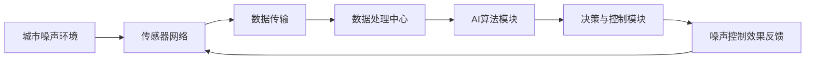

# AI在城市噪声污染控制与管理中的创新应用

> 关键词：AI、城市噪声污染、控制与管理、创新应用、智能监测

> 摘要：本文聚焦于AI在城市噪声污染控制与管理中的创新应用。首先介绍了相关背景，包括研究目的、预期读者、文档结构和术语表等。接着阐述了核心概念与联系，通过示意图和流程图呈现其架构。详细讲解了核心算法原理及具体操作步骤，并结合Python代码进行说明。给出了相关的数学模型和公式，并举例解释。通过项目实战展示了代码实际案例和详细解释。分析了AI在城市噪声污染中的实际应用场景，推荐了学习资源、开发工具框架和相关论文著作。最后总结了未来发展趋势与挑战，还提供了常见问题解答和扩展阅读参考资料，旨在为城市噪声污染的有效控制与管理提供全面的技术指导和创新思路。

## 1. 背景介绍 
### 1.1 目的和范围
城市噪声污染已成为影响居民生活质量、危害身体健康的重要环境问题之一。传统的噪声污染控制与管理方法往往效率低下、缺乏实时性和精准性。本文章的目的在于深入探讨AI技术在城市噪声污染控制与管理中的创新应用，通过介绍相关技术原理、算法、实际案例等内容，为城市环境管理部门、科研人员以及相关从业者提供全面的技术参考和创新思路。文章的范围涵盖了AI在城市噪声监测、分析、预测、控制等各个环节的应用，旨在揭示AI技术如何为城市噪声污染问题提供高效、智能的解决方案。

### 1.2 预期读者
本文预期读者包括城市环境管理部门的工作人员，他们可以从中了解如何利用AI技术提升噪声污染管理的效率和水平；科研人员能够获取AI在噪声污染领域的最新研究成果和技术应用，为进一步的研究提供参考；相关专业的学生可以通过本文系统地学习AI在城市噪声污染控制与管理中的应用知识；此外，对城市环境问题和AI技术感兴趣的普通读者也可以通过本文了解相关领域的前沿动态。

### 1.3 文档结构概述
本文共分为十个部分。第一部分为背景介绍，阐述了文章的目的、预期读者、文档结构和术语表；第二部分介绍核心概念与联系，通过文本示意图和Mermaid流程图展示AI与城市噪声污染控制管理的架构关系；第三部分讲解核心算法原理和具体操作步骤，并给出Python源代码示例；第四部分介绍相关的数学模型和公式，并详细讲解和举例说明；第五部分进行项目实战，包括开发环境搭建、源代码详细实现和代码解读；第六部分分析AI在城市噪声污染控制与管理中的实际应用场景；第七部分推荐学习资源、开发工具框架和相关论文著作；第八部分总结未来发展趋势与挑战；第九部分为附录，提供常见问题与解答；第十部分列出扩展阅读和参考资料。

### 1.4 术语表
#### 1.4.1 核心术语定义
- **AI（Artificial Intelligence）**：即人工智能，是一门研究如何使计算机能够模拟人类智能的学科，包括机器学习、深度学习、自然语言处理等技术。
- **城市噪声污染**：指在城市环境中，由交通运输、工业生产、建筑施工、社会生活等活动产生的干扰人们正常生活、工作和学习的声音。
- **噪声监测**：通过各种传感器和设备对城市环境中的噪声进行实时或定期的测量和记录。
- **噪声分析**：对监测到的噪声数据进行处理和分析，以了解噪声的特征、来源和分布情况。
- **噪声预测**：根据历史噪声数据和相关环境因素，利用数学模型和算法对未来噪声水平进行预测。
- **噪声控制**：采取各种措施降低城市环境中的噪声水平，减少噪声对居民的影响。

#### 1.4.2 相关概念解释
- **机器学习**：是AI的一个重要分支，它通过让计算机从数据中学习模式和规律，从而实现对未知数据的预测和分类。常见的机器学习算法包括决策树、支持向量机、神经网络等。
- **深度学习**：是一种基于人工神经网络的机器学习技术，它通过构建多层神经网络来学习数据的深层次特征，在图像识别、语音识别、自然语言处理等领域取得了显著的成果。
- **传感器网络**：由大量的传感器节点组成的网络，这些节点可以实时采集环境中的各种数据，并通过无线通信技术将数据传输到中心节点进行处理和分析。

#### 1.4.3 缩略词列表
- **AI**：Artificial Intelligence（人工智能）
- **ML**：Machine Learning（机器学习）
- **DL**：Deep Learning（深度学习）
- **IoT**：Internet of Things（物联网）

## 2. 核心概念与联系 

### 核心概念原理
AI在城市噪声污染控制与管理中的应用主要基于数据驱动的方法。首先，通过分布在城市各个区域的传感器网络实时采集噪声数据，这些数据包含了噪声的强度、频率、时间等信息。然后，将采集到的噪声数据传输到数据处理中心，利用机器学习和深度学习算法对数据进行分析和处理。

机器学习算法可以对噪声数据进行分类，识别出不同类型的噪声源，如交通噪声、工业噪声、建筑施工噪声等。同时，还可以通过建立回归模型，预测噪声的强度和变化趋势。深度学习算法则可以学习噪声数据的深层次特征，提高噪声源识别和预测的准确性。

在噪声控制方面，AI可以根据噪声分析和预测的结果，自动调整噪声控制措施。例如，当预测到某一区域的交通噪声将超过规定标准时，系统可以自动调整交通信号灯的时间间隔，引导车辆分流，从而降低该区域的噪声水平。

### 架构的文本示意图
```plaintext
+----------------------+
| 城市噪声环境         |
| （交通、工业、生活等）|
+----------------------+
           |
           v
+----------------------+
| 传感器网络           |
| （噪声传感器、气象传感器等）|
+----------------------+
           |
           v
+----------------------+
| 数据传输             |
| （有线、无线通信）    |
+----------------------+
           |
           v
+----------------------+
| 数据处理中心         |
| （数据存储、清洗、分析）|
+----------------------+
           |
           v
+----------------------+
| AI算法模块           |
| （机器学习、深度学习）|
+----------------------+
           |
           v
+----------------------+
| 决策与控制模块       |
| （调整交通、控制设备等）|
+----------------------+
           |
           v
+----------------------+
| 噪声控制效果反馈     |
| （再次监测、评估）    |
+----------------------+
```

### Mermaid流程图


## 3. 核心算法原理 & 具体操作步骤 

### 核心算法原理

#### 机器学习中的决策树算法
决策树是一种基于树结构进行决策的机器学习算法。在城市噪声污染控制与管理中，决策树可以用于噪声源的分类。决策树的每个内部节点代表一个属性上的测试，每个分支代表一个测试输出，每个叶节点代表一种类别。

决策树的构建过程主要包括特征选择、树的生成和树的剪枝。特征选择的目的是选择对分类最有帮助的属性，常用的特征选择指标有信息增益、信息增益比、基尼指数等。树的生成是根据选择的特征递归地划分数据集，直到满足停止条件。树的剪枝是为了防止过拟合，提高模型的泛化能力。

#### 深度学习中的卷积神经网络（CNN）
CNN是一种专门用于处理具有网格结构数据的深度学习模型，在图像识别、语音识别等领域取得了巨大的成功。在城市噪声污染控制与管理中，CNN可以用于噪声信号的特征提取和分类。

CNN的主要结构包括卷积层、池化层和全连接层。卷积层通过卷积核在输入数据上滑动进行卷积操作，提取数据的局部特征。池化层用于减少数据的维度，降低计算量。全连接层将卷积层和池化层提取的特征进行整合，输出分类结果。

### 具体操作步骤及Python源代码

#### 决策树算法示例
```python
import numpy as np
from sklearn.datasets import make_classification
from sklearn.model_selection import train_test_split
from sklearn.tree import DecisionTreeClassifier
from sklearn.metrics import accuracy_score

# 生成示例数据
X, y = make_classification(n_samples=1000, n_features=10, n_informative=5, n_redundant=0, random_state=42)

# 划分训练集和测试集
X_train, X_test, y_train, y_test = train_test_split(X, y, test_size=0.2, random_state=42)

# 创建决策树分类器
clf = DecisionTreeClassifier()

# 训练模型
clf.fit(X_train, y_train)

# 预测
y_pred = clf.predict(X_test)

# 计算准确率
accuracy = accuracy_score(y_test, y_pred)
print(f"决策树模型的准确率: {accuracy}")
```

#### 卷积神经网络示例
```python
import tensorflow as tf
from tensorflow.keras import layers, models
from sklearn.datasets import make_classification
from sklearn.model_selection import train_test_split

# 生成示例数据
X, y = make_classification(n_samples=1000, n_features=100, n_informative=50, n_redundant=0, random_state=42)
X = X.reshape(-1, 10, 10, 1)  # 调整数据形状以适应CNN输入

# 划分训练集和测试集
X_train, X_test, y_train, y_test = train_test_split(X, y, test_size=0.2, random_state=42)

# 构建CNN模型
model = models.Sequential([
    layers.Conv2D(32, (3, 3), activation='relu', input_shape=(10, 10, 1)),
    layers.MaxPooling2D((2, 2)),
    layers.Conv2D(64, (3, 3), activation='relu'),
    layers.MaxPooling2D((2, 2)),
    layers.Flatten(),
    layers.Dense(64, activation='relu'),
    layers.Dense(1, activation='sigmoid')
])

# 编译模型
model.compile(optimizer='adam',
              loss='binary_crossentropy',
              metrics=['accuracy'])

# 训练模型
model.fit(X_train, y_train, epochs=10, validation_data=(X_test, y_test))

# 评估模型
test_loss, test_acc = model.evaluate(X_test, y_test)
print(f"CNN模型的准确率: {test_acc}")
```

## 4. 数学模型和公式 & 详细讲解 & 举例说明 

### 信息增益
信息增益是决策树算法中常用的特征选择指标，用于衡量一个属性对分类的贡献程度。信息增益的计算公式如下：

$$
IG(D, A) = H(D) - H(D|A)
$$

其中，$IG(D, A)$ 表示属性 $A$ 对数据集 $D$ 的信息增益，$H(D)$ 表示数据集 $D$ 的信息熵，$H(D|A)$ 表示在已知属性 $A$ 的条件下，数据集 $D$ 的条件熵。

#### 信息熵的计算公式
$$
H(D) = -\sum_{i=1}^{k} p_i \log_2 p_i
$$

其中，$k$ 表示数据集 $D$ 中类别的数量，$p_i$ 表示第 $i$ 类样本在数据集 $D$ 中所占的比例。

#### 条件熵的计算公式
$$
H(D|A) = \sum_{v \in Values(A)} \frac{|D^v|}{|D|} H(D^v)
$$

其中，$Values(A)$ 表示属性 $A$ 的所有可能取值，$D^v$ 表示属性 $A$ 取值为 $v$ 的样本子集。

#### 举例说明
假设有一个数据集 $D$ 包含 10 个样本，分为两类，其中正类样本有 6 个，负类样本有 4 个。属性 $A$ 有两个取值 $a_1$ 和 $a_2$，其中 $A=a_1$ 的样本有 4 个，包含 3 个正类样本和 1 个负类样本；$A=a_2$ 的样本有 6 个，包含 3 个正类样本和 3 个负类样本。

首先计算数据集 $D$ 的信息熵：
$$
p_1 = \frac{6}{10} = 0.6, p_2 = \frac{4}{10} = 0.4
$$
$$
H(D) = - (0.6 \log_2 0.6 + 0.4 \log_2 0.4) \approx 0.971
$$

然后计算条件熵：
对于 $A=a_1$ 的子集 $D^{a_1}$：
$$
p_{11} = \frac{3}{4} = 0.75, p_{12} = \frac{1}{4} = 0.25
$$
$$
H(D^{a_1}) = - (0.75 \log_2 0.75 + 0.25 \log_2 0.25) \approx 0.811
$$

对于 $A=a_2$ 的子集 $D^{a_2}$：
$$
p_{21} = \frac{3}{6} = 0.5, p_{22} = \frac{3}{6} = 0.5
$$
$$
H(D^{a_2}) = - (0.5 \log_2 0.5 + 0.5 \log_2 0.5) = 1
$$

$$
H(D|A) = \frac{4}{10} H(D^{a_1}) + \frac{6}{10} H(D^{a_2}) = \frac{4}{10} \times 0.811 + \frac{6}{10} \times 1 \approx 0.924
$$

最后计算信息增益：
$$
IG(D, A) = H(D) - H(D|A) = 0.971 - 0.924 = 0.047
$$

### 卷积操作
卷积神经网络中的卷积操作是通过卷积核在输入数据上滑动进行的。假设输入数据为 $X$，卷积核为 $W$，卷积操作的输出为 $Y$，则卷积操作的计算公式如下：

$$
Y_{i,j} = \sum_{m=0}^{M-1} \sum_{n=0}^{N-1} X_{i+m,j+n} W_{m,n} + b
$$

其中，$M$ 和 $N$ 分别表示卷积核的高度和宽度，$b$ 表示偏置项。

#### 举例说明
假设输入数据 $X$ 是一个 $3 \times 3$ 的矩阵：
$$
X = \begin{bmatrix}
1 & 2 & 3 \\
4 & 5 & 6 \\
7 & 8 & 9
\end{bmatrix}
$$

卷积核 $W$ 是一个 $2 \times 2$ 的矩阵：
$$
W = \begin{bmatrix}
1 & 0 \\
0 & 1
\end{bmatrix}
$$

偏置项 $b = 1$。

首先，将卷积核 $W$ 与输入数据 $X$ 的左上角 $2 \times 2$ 子矩阵进行元素相乘并求和：
$$
Y_{0,0} = (1 \times 1 + 2 \times 0 + 4 \times 0 + 5 \times 1) + 1 = 7
$$

然后，将卷积核 $W$ 向右滑动一个位置，与输入数据 $X$ 的 $2 \times 2$ 子矩阵进行元素相乘并求和：
$$
Y_{0,1} = (2 \times 1 + 3 \times 0 + 5 \times 0 + 6 \times 1) + 1 = 9
$$

同理，可以计算出 $Y_{1,0}$ 和 $Y_{1,1}$ 的值。最终的输出 $Y$ 是一个 $2 \times 2$ 的矩阵：
$$
Y = \begin{bmatrix}
7 & 9 \\
11 & 13
\end{bmatrix}
$$

## 5. 项目实战：代码实际案例和详细解释说明 

### 5.1  开发环境搭建
#### 操作系统
建议使用 Linux 系统（如 Ubuntu 18.04 及以上版本）或 macOS，因为这些系统对 Python 和相关开发工具的支持较好。如果使用 Windows 系统，需要安装 Windows Subsystem for Linux (WSL) 来模拟 Linux 环境。

#### Python 环境
安装 Python 3.7 及以上版本，可以从 Python 官方网站（https://www.python.org/downloads/）下载安装包进行安装。安装完成后，建议使用虚拟环境来管理项目依赖，避免不同项目之间的依赖冲突。可以使用 `venv` 或 `conda` 来创建虚拟环境。

使用 `venv` 创建虚拟环境的命令如下：
```bash
python3 -m venv myenv
source myenv/bin/activate  # 在 Linux/macOS 上激活虚拟环境
.\myenv\Scripts\activate  # 在 Windows 上激活虚拟环境
```

#### 安装依赖库
在激活的虚拟环境中，使用 `pip` 安装项目所需的依赖库，主要包括 `numpy`、`pandas`、`scikit-learn`、`tensorflow` 等。安装命令如下：
```bash
pip install numpy pandas scikit-learn tensorflow
```

### 5.2  源代码详细实现和代码解读
#### 数据采集与预处理
```python
import numpy as np
import pandas as pd
from sklearn.preprocessing import StandardScaler

# 模拟采集噪声数据
data = pd.read_csv('noise_data.csv')  # 假设噪声数据存储在 CSV 文件中
X = data.drop('label', axis=1).values  # 特征数据
y = data['label'].values  # 标签数据

# 数据标准化
scaler = StandardScaler()
X = scaler.fit_transform(X)
```
代码解读：首先使用 `pandas` 库读取存储在 CSV 文件中的噪声数据。然后将特征数据和标签数据分离，分别存储在 `X` 和 `y` 中。最后使用 `StandardScaler` 对特征数据进行标准化处理，使得数据的均值为 0，标准差为 1，有助于提高模型的训练效果。

#### 模型训练与评估
```python
from sklearn.model_selection import train_test_split
from sklearn.tree import DecisionTreeClassifier
from sklearn.metrics import accuracy_score

# 划分训练集和测试集
X_train, X_test, y_train, y_test = train_test_split(X, y, test_size=0.2, random_state=42)

# 创建决策树分类器
clf = DecisionTreeClassifier()

# 训练模型
clf.fit(X_train, y_train)

# 预测
y_pred = clf.predict(X_test)

# 计算准确率
accuracy = accuracy_score(y_test, y_pred)
print(f"决策树模型的准确率: {accuracy}")
```
代码解读：使用 `train_test_split` 函数将数据集划分为训练集和测试集，其中测试集占总数据集的 20%。创建一个决策树分类器 `DecisionTreeClassifier`，并使用训练集数据对模型进行训练。训练完成后，使用测试集数据进行预测，并计算预测结果的准确率。

### 5.3  代码解读与分析
#### 数据预处理的重要性
数据预处理是机器学习项目中非常重要的一步。在本项目中，对噪声数据进行标准化处理可以消除不同特征之间的量纲差异，使得模型能够更好地学习数据的特征。如果不进行标准化处理，某些特征的数值范围可能会对模型的训练产生较大影响，导致模型的性能下降。

#### 模型选择与评估
选择合适的模型对于项目的成功至关重要。在本项目中，选择决策树分类器是因为它具有简单易懂、可解释性强等优点。使用准确率作为评估指标可以直观地反映模型的分类性能。然而，准确率并不是唯一的评估指标，在实际应用中，还可以考虑使用召回率、F1 值等指标来全面评估模型的性能。

## 6. 实际应用场景 
### 交通噪声管理
AI 可以应用于交通噪声的监测和控制。通过在城市道路、桥梁、隧道等关键位置部署噪声传感器，实时采集交通噪声数据。利用机器学习算法对噪声数据进行分析，识别出不同类型的交通工具（如汽车、火车、飞机等）及其行驶状态（如加速、减速、匀速等）。根据分析结果，交通管理部门可以采取相应的措施来降低交通噪声，如调整交通信号灯的时间间隔、优化交通路线、限制车辆行驶速度等。

### 工业噪声控制
在工业生产过程中，机器设备的运行会产生大量的噪声。AI 可以用于工业噪声的监测和预警。通过在工厂车间、机房等区域安装噪声传感器，实时监测工业噪声的强度和频率。利用深度学习算法对噪声数据进行分析，预测机器设备的故障和异常情况。当监测到噪声异常时，系统可以及时发出警报，提醒工作人员进行检查和维护，避免设备故障导致的噪声污染加剧。

### 建筑施工噪声管理
建筑施工是城市噪声污染的重要来源之一。AI 可以帮助建筑施工单位更好地管理施工噪声。通过在施工现场周围设置噪声监测设备，实时采集施工噪声数据。利用机器学习算法对噪声数据进行分析，评估施工噪声对周围居民的影响程度。根据评估结果，施工单位可以合理安排施工时间、调整施工工艺、采取降噪措施等，减少施工噪声对周围环境的影响。

### 社会生活噪声监测
社会生活噪声主要包括商业活动、娱乐场所、居民生活等产生的噪声。AI 可以用于社会生活噪声的监测和管理。通过在城市社区、商业区、娱乐场所等区域部署噪声传感器，实时采集社会生活噪声数据。利用深度学习算法对噪声数据进行分析，识别出不同类型的社会生活噪声源，并对噪声的强度和持续时间进行评估。根据评估结果，相关部门可以采取相应的措施来加强对社会生活噪声的管理，如加强对商业活动的监管、规范娱乐场所的营业时间、开展噪声污染宣传教育等。

## 7. 工具和资源推荐
### 7.1 学习资源推荐
#### 7.1.1 书籍推荐
- 《机器学习》（周志华著）：这本书全面介绍了机器学习的基本概念、算法和应用，是机器学习领域的经典教材之一。
- 《深度学习》（Ian Goodfellow、Yoshua Bengio、Aaron Courville 著）：该书系统地介绍了深度学习的理论和实践，涵盖了神经网络、卷积神经网络、循环神经网络等重要内容。
- 《Python 机器学习实战》（Sebastian Raschka 著）：通过实际案例详细介绍了如何使用 Python 实现机器学习算法，适合初学者入门。

#### 7.1.2 在线课程
- Coursera 上的“机器学习”课程（Andrew Ng 教授授课）：该课程是机器学习领域的经典在线课程，讲解深入浅出，适合零基础的学习者。
- edX 上的“深度学习微硕士项目”：提供了深度学习的系统学习路径，包括多个专业课程和实践项目。
- 中国大学 MOOC 上的“人工智能基础”课程：由国内知名高校的教授授课，内容丰富，涵盖了人工智能的基本概念、算法和应用。

#### 7.1.3 技术博客和网站
- Medium 上的 Towards Data Science：该博客汇集了众多数据科学和机器学习领域的优秀文章，涵盖了最新的技术动态和研究成果。
- Kaggle：是一个数据科学竞赛平台，上面有很多优秀的数据科学项目和开源代码，可以学习到其他开发者的经验和技巧。
- 机器之心：专注于人工智能领域的资讯和技术分享，提供了大量的行业动态、技术文章和研究报告。

### 7.2 开发工具框架推荐
#### 7.2.1 IDE和编辑器
- PyCharm：是一款专门为 Python 开发设计的集成开发环境（IDE），具有代码编辑、调试、版本控制等强大功能，适合专业开发者使用。
- Jupyter Notebook：是一个基于 Web 的交互式开发环境，支持多种编程语言，尤其适合数据科学和机器学习项目的开发和实验。
- Visual Studio Code：是一款轻量级的代码编辑器，具有丰富的插件生态系统，可以通过安装 Python 相关插件来实现 Python 开发的功能。

#### 7.2.2 调试和性能分析工具
- TensorBoard：是 TensorFlow 提供的一个可视化工具，可以用于可视化模型的训练过程、损失函数的变化、模型的结构等，帮助开发者调试和优化模型。
- Py-Spy：是一个用于分析 Python 程序性能的工具，可以实时监测 Python 程序的 CPU 使用率、函数调用次数等信息，帮助开发者找出性能瓶颈。
- cProfile：是 Python 内置的性能分析模块，可以对 Python 程序的运行时间进行详细的分析，找出程序中耗时较长的函数和代码段。

#### 7.2.3 相关框架和库
- TensorFlow：是 Google 开发的一个开源深度学习框架，具有强大的计算能力和丰富的工具库，广泛应用于图像识别、语音识别、自然语言处理等领域。
- PyTorch：是 Facebook 开发的一个开源深度学习框架，具有动态图的特点，易于使用和调试，受到了很多研究者和开发者的喜爱。
- Scikit-learn：是一个简单易用的机器学习库，提供了丰富的机器学习算法和工具，适合初学者快速上手。

### 7.3 相关论文著作推荐
#### 7.3.1 经典论文
- “A Logical Calculus of the Ideas Immanent in Nervous Activity”（Warren S. McCulloch 和 Walter Pitts 著）：该论文提出了人工神经网络的基本模型，是神经网络领域的开创性论文。
- “Gradient-Based Learning Applied to Document Recognition”（Yann LeCun、Léon Bottou、Yoshua Bengio 和 Patrick Haffner 著）：介绍了卷积神经网络（CNN）在手写数字识别中的应用，是 CNN 领域的经典论文。
- “Learning Representations by Back-propagating Errors”（David E. Rumelhart、Geoffrey E. Hinton 和 Ronald J. Williams 著）：提出了反向传播算法，为神经网络的训练提供了有效的方法。

#### 7.3.2 最新研究成果
- 在 IEEE Transactions on Intelligent Transportation Systems、ACM Transactions on Sensor Networks 等学术期刊上可以找到关于 AI 在城市噪声污染控制与管理方面的最新研究成果。
- 每年的国际人工智能会议（如 AAAI、IJCAI）和机器学习会议（如 NeurIPS、ICML）上也会有相关的研究论文发表。

#### 7.3.3 应用案例分析
- 一些城市环境管理部门和科研机构会发布关于 AI 在城市噪声污染控制与管理中的应用案例报告，可以通过相关政府部门网站、科研机构官网等渠道获取。
- 一些知名企业（如 IBM、Google 等）也会在其官方博客或技术论坛上分享相关的应用案例和实践经验。

## 8. 总结：未来发展趋势与挑战
### 未来发展趋势
#### 多传感器融合
未来，AI 在城市噪声污染控制与管理中将更多地与其他传感器（如气象传感器、图像传感器等）进行融合。通过综合分析多种传感器的数据，可以更全面地了解城市环境的状况，提高噪声源识别和预测的准确性。例如，结合气象数据可以考虑风速、风向等因素对噪声传播的影响，结合图像数据可以直观地识别噪声源的位置和类型。

#### 智能决策与自动化控制
随着 AI 技术的不断发展，城市噪声污染控制与管理系统将具备更强的智能决策能力。系统可以根据实时监测数据和分析结果，自动调整噪声控制措施，实现自动化控制。例如，当监测到某一区域的噪声超过标准时，系统可以自动控制交通信号灯、调整工业设备的运行参数、启动降噪设备等，无需人工干预。

#### 大数据与云计算
大数据和云计算技术将为 AI 在城市噪声污染控制与管理中的应用提供更强大的支持。通过收集和存储大量的噪声数据，可以利用大数据分析技术挖掘数据中的潜在信息，为噪声污染的预测和控制提供更准确的依据。云计算则可以提供强大的计算能力，支持复杂的 AI 算法和模型的训练和运行。

#### 公众参与与社会共治
未来，AI 技术将促进公众参与城市噪声污染控制与管理。通过开发手机应用程序、网站等平台，公众可以实时查询所在区域的噪声状况，并参与噪声污染的监测和举报。同时，管理部门可以根据公众反馈的信息及时采取措施，形成社会共治的良好局面。

### 挑战
#### 数据质量与安全
AI 技术的应用依赖于大量的高质量数据。然而，在城市噪声污染监测过程中，数据可能会受到传感器故障、环境干扰等因素的影响，导致数据质量下降。此外，噪声数据涉及到居民的隐私和城市的安全信息，如何保障数据的安全和隐私是一个亟待解决的问题。

#### 算法可解释性
深度学习等 AI 算法通常是黑盒模型，其决策过程难以解释。在城市噪声污染控制与管理中，决策者需要了解算法的决策依据，以便做出合理的决策。因此，如何提高 AI 算法的可解释性是一个重要的挑战。

#### 技术成本与普及
AI 技术的应用需要一定的技术成本，包括硬件设备的购置、软件系统的开发和维护等。对于一些经济欠发达地区或小型企业来说，可能难以承担这些成本。此外，如何将 AI 技术普及到城市噪声污染控制与管理的各个环节，也是一个需要解决的问题。

#### 法律法规与政策支持
目前，关于 AI 在城市噪声污染控制与管理中的应用还缺乏完善的法律法规和政策支持。例如，如何规范 AI 算法的使用、如何保障公众的合法权益等问题都需要相关法律法规和政策的明确规定。

## 9. 附录：常见问题与解答
### 问题 1：AI 在城市噪声污染控制与管理中的应用是否会取代人工管理？
解答：不会。AI 技术可以为城市噪声污染控制与管理提供更高效、准确的工具和方法，但不能完全取代人工管理。在实际应用中，需要人工对 AI 系统的运行结果进行审核和决策，同时也需要人工进行现场监测和执法等工作。AI 技术与人工管理相结合，可以实现更好的城市噪声污染控制与管理效果。

### 问题 2：如何确保 AI 算法在城市噪声污染控制与管理中的准确性？
解答：要确保 AI 算法的准确性，需要从多个方面入手。首先，要保证数据的质量，包括数据的准确性、完整性和一致性。可以通过定期校准传感器、清理异常数据等方式来提高数据质量。其次，要选择合适的算法和模型，并进行充分的训练和优化。可以使用交叉验证、网格搜索等方法来选择最优的模型参数。最后，要对算法的运行结果进行评估和验证，及时发现和纠正算法中的错误。

### 问题 3：AI 在城市噪声污染控制与管理中的应用需要哪些专业知识？
解答：需要具备多方面的专业知识，包括人工智能、机器学习、信号处理、环境科学等。在人工智能和机器学习方面，需要了解常见的算法和模型，如决策树、神经网络、卷积神经网络等。在信号处理方面，需要掌握噪声信号的特征提取和分析方法。在环境科学方面，需要了解城市噪声污染的来源、传播规律和控制方法等。

### 问题 4：如何推广 AI 在城市噪声污染控制与管理中的应用？
解答：可以从以下几个方面推广 AI 的应用。一是加强宣传和培训，提高相关部门和人员对 AI 技术的认识和了解。二是开展试点项目，通过实际案例展示 AI 技术的优势和效果，吸引更多的用户。三是政府出台相关的政策和扶持措施，鼓励企业和科研机构开展 AI 在城市噪声污染控制与管理中的研究和应用。四是建立行业标准和规范，确保 AI 技术的应用质量和安全性。

## 10. 扩展阅读 & 参考资料
### 扩展阅读
- 《环境噪声控制工程》（洪宗辉编著）：系统介绍了环境噪声的基本概念、传播规律和控制方法，为城市噪声污染控制与管理提供了理论基础。
- 《人工智能：现代方法》（Stuart Russell、Peter Norvig 著）：全面介绍了人工智能的基本概念、算法和应用，是人工智能领域的经典著作之一。
- 《物联网：技术、应用与标准》（刘海涛等编著）：介绍了物联网的基本概念、技术架构和应用场景，对于理解 AI 在城市噪声污染控制与管理中的应用具有重要的参考价值。

### 参考资料
- IEEE Xplore、ACM Digital Library 等学术数据库，可获取关于 AI 和城市噪声污染控制与管理的最新研究论文。
- 国家环境保护部门发布的相关标准和规范，如《声环境质量标准》《工业企业厂界环境噪声排放标准》等。
- 相关的政府报告和统计数据，如城市环境质量报告、噪声污染监测数据等。

作者：AI天才研究院/AI Genius Institute & 禅与计算机程序设计艺术 /Zen And The Art of Computer Programming