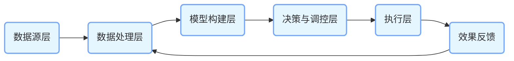

# AI在城市微气候调控与热岛效应缓解中的创新应用

> 关键词：人工智能、城市微气候调控、热岛效应缓解、创新应用、机器学习

> 摘要：本文聚焦于AI在城市微气候调控与热岛效应缓解方面的创新应用。详细阐述了相关核心概念、算法原理、数学模型，通过项目实战展示代码实现与解读。探讨了实际应用场景，推荐了学习资源、开发工具框架和相关论文著作。最后总结未来发展趋势与挑战，解答常见问题并提供扩展阅读与参考资料，旨在为相关领域的研究和实践提供全面而深入的指导。

## 1. 背景介绍 
### 1.1 目的和范围
随着城市化进程的加速，城市热岛效应日益严重，对城市生态环境、居民生活质量和能源消耗产生了诸多负面影响。城市微气候调控成为缓解热岛效应、改善城市环境的关键举措。本文章的目的在于深入探讨人工智能（AI）技术在城市微气候调控与热岛效应缓解中的创新应用，分析其原理、方法和实际效果。范围涵盖了AI技术在城市气象数据监测、模拟预测、智能调控系统等多个方面的应用，旨在为城市规划者、气象学家和相关科研人员提供全面的技术参考和创新思路。

### 1.2 预期读者
本文的预期读者包括城市规划师、气象学家、环境科学家、人工智能研究人员以及对城市可持续发展和气候变化感兴趣的专业人士和爱好者。这些读者可能具备不同程度的专业知识，因此文章在内容安排上尽量兼顾了专业性和通俗性，既深入讲解了AI技术的原理和应用，又通过实际案例和通俗易懂的语言进行说明，以便不同背景的读者能够理解和应用相关知识。

### 1.3 文档结构概述
本文将按照以下结构进行组织：首先介绍相关的核心概念，包括城市微气候、热岛效应和人工智能的基本原理和相互联系；接着详细阐述核心算法原理和具体操作步骤，并通过Python代码进行示例；然后介绍数学模型和公式，并结合实际例子进行说明；再通过项目实战展示AI在城市微气候调控中的具体应用，包括开发环境搭建、源代码实现和代码解读；之后探讨AI在城市微气候调控与热岛效应缓解中的实际应用场景；推荐相关的学习资源、开发工具框架和论文著作；最后总结未来发展趋势与挑战，解答常见问题并提供扩展阅读和参考资料。

### 1.4 术语表
#### 1.4.1 核心术语定义
- **城市微气候**：指城市中局部地区的气候状况，包括温度、湿度、风速、风向等气象要素的微小变化。城市微气候受到城市地形、建筑物布局、植被覆盖等多种因素的影响，与城市大气候存在明显差异。
- **热岛效应**：指城市中的气温明显高于外围郊区的现象。城市热岛效应主要是由于城市中大量的人工建筑物、交通活动和能源消耗等因素导致的热量排放增加，以及城市下垫面的改变（如水泥、沥青等硬质地面取代了自然植被），使得城市的热量吸收和储存能力增强，散热能力减弱。
- **人工智能（AI）**：是一门研究如何使计算机系统能够模拟人类智能的学科和技术领域。AI技术包括机器学习、深度学习、自然语言处理、计算机视觉等多个分支，旨在让计算机系统能够自动地学习、推理、决策和解决问题。
- **机器学习**：是人工智能的一个重要分支，它通过让计算机系统从数据中自动学习模式和规律，从而实现对未知数据的预测和决策。机器学习算法包括监督学习、无监督学习、强化学习等多种类型。
- **深度学习**：是机器学习的一个子领域，它基于人工神经网络模型，通过构建多层神经网络来学习数据的复杂特征和模式。深度学习在图像识别、语音识别、自然语言处理等领域取得了显著的成果。

#### 1.4.2 相关概念解释
- **气象数据监测**：指通过各种气象观测设备（如气象站、卫星、无人机等）对城市气象要素进行实时监测和数据采集的过程。气象数据监测是城市微气候研究和调控的基础，为后续的数据分析和模型建立提供了重要的数据支持。
- **气象模拟预测**：指利用计算机模型和算法对城市气象要素的未来变化进行预测的过程。气象模拟预测可以帮助城市规划者和决策者提前了解城市微气候的变化趋势，制定相应的调控措施。
- **智能调控系统**：指利用人工智能技术对城市微气候进行自动调控的系统。智能调控系统可以根据实时气象数据和预设的调控目标，自动调整城市中的各种设施（如空调、通风系统、遮阳设施等）的运行状态，以实现城市微气候的优化调控。

#### 1.4.3 缩略词列表
- **AI**：Artificial Intelligence（人工智能）
- **ML**：Machine Learning（机器学习）
- **DL**：Deep Learning（深度学习）
- **ANN**：Artificial Neural Network（人工神经网络）
- **CNN**：Convolutional Neural Network（卷积神经网络）
- **RNN**：Recurrent Neural Network（循环神经网络）

## 2. 核心概念与联系 

### 核心概念原理
#### 城市微气候原理
城市微气候是城市环境中局部区域的气候特征，它受到城市地形、建筑物布局、下垫面性质、植被覆盖等多种因素的影响。城市地形的高低起伏会影响气流的运动和热量的分布，例如山谷地形可能会导致气流的汇聚和热量的积聚。建筑物的布局会改变气流的方向和速度，形成局部的通风通道或涡流区。下垫面性质（如水泥、沥青、植被等）对太阳辐射的吸收和反射能力不同，会影响地表温度的变化。植被可以通过蒸腾作用降低周围环境的温度，增加空气湿度，改善城市微气候。

#### 热岛效应原理
热岛效应主要是由于城市中人类活动和自然环境的改变导致的。城市中的大量人工建筑物（如高楼大厦、道路等）大多由水泥、沥青等材料构成，这些材料的比热容较小，在白天吸收太阳辐射后温度升高较快，夜晚散热较慢，使得城市地表温度明显高于郊区。此外，城市中的交通活动、工业生产和居民生活等会释放大量的热量，进一步加剧了城市的热岛效应。城市的植被覆盖面积相对较少，蒸腾作用较弱，也不利于热量的散发。

#### 人工智能原理
人工智能是通过计算机系统模拟人类智能的技术。机器学习是人工智能的核心方法之一，它通过让计算机从数据中学习模式和规律，从而实现对未知数据的预测和决策。深度学习是机器学习的一个重要分支，它基于人工神经网络模型，通过构建多层神经网络来学习数据的复杂特征和模式。例如，在图像识别中，深度学习模型可以自动学习图像中的特征，从而实现对图像内容的分类和识别。

### 架构的文本示意图
```plaintext
城市微气候调控与热岛效应缓解系统架构

数据源层：
    - 气象监测设备（气象站、卫星、无人机等）
    - 城市地理信息系统（GIS）数据
    - 城市能源消耗数据

数据处理层：
    - 数据采集与传输
    - 数据清洗与预处理
    - 特征提取与选择

模型构建层：
    - 机器学习模型（线性回归、决策树、支持向量机等）
    - 深度学习模型（卷积神经网络、循环神经网络等）
    - 气象模拟模型

决策与调控层：
    - 智能决策算法
    - 调控策略生成
    - 设备控制指令发送

执行层：
    - 城市设施（空调、通风系统、遮阳设施等）
    - 城市绿化与水体调节
```

### Mermaid 流程图


## 3. 核心算法原理 & 具体操作步骤 

### 机器学习算法原理
#### 线性回归算法
线性回归是一种简单而常用的机器学习算法，用于建立自变量和因变量之间的线性关系。假设我们有一组自变量 $X = [x_1, x_2,..., x_n]$ 和对应的因变量 $y$，线性回归模型的目标是找到一组系数 $\theta = [\theta_0, \theta_1,..., \theta_n]$，使得预测值 $\hat{y} = \theta_0 + \theta_1x_1 + \theta_2x_2 +... + \theta_nx_n$ 与真实值 $y$ 之间的误差最小。通常使用最小二乘法来求解系数 $\theta$，即最小化误差平方和 $J(\theta) = \sum_{i=1}^{m}(y^{(i)} - \hat{y}^{(i)})^2$，其中 $m$ 是样本数量。

以下是使用Python实现线性回归的代码示例：
```python
import numpy as np
from sklearn.linear_model import LinearRegression

# 生成示例数据
X = np.array([[1], [2], [3], [4], [5]])
y = np.array([2, 4, 6, 8, 10])

# 创建线性回归模型
model = LinearRegression()

# 拟合模型
model.fit(X, y)

# 预测新数据
new_X = np.array([[6]])
prediction = model.predict(new_X)

print("预测值:", prediction)
```

#### 决策树算法
决策树是一种基于树结构进行决策的机器学习算法。决策树通过对数据的特征进行划分，构建一棵决策树，每个内部节点表示一个特征上的测试，每个分支表示一个测试输出，每个叶节点表示一个类别或值。决策树的构建过程通常采用递归的方式，选择最优的特征进行划分，直到满足停止条件。

以下是使用Python实现决策树分类的代码示例：
```python
from sklearn.datasets import load_iris
from sklearn.tree import DecisionTreeClassifier
from sklearn.model_selection import train_test_split
from sklearn.metrics import accuracy_score

# 加载鸢尾花数据集
iris = load_iris()
X = iris.data
y = iris.target

# 划分训练集和测试集
X_train, X_test, y_train, y_test = train_test_split(X, y, test_size=0.2, random_state=42)

# 创建决策树分类器
clf = DecisionTreeClassifier()

# 拟合模型
clf.fit(X_train, y_train)

# 预测测试集
y_pred = clf.predict(X_test)

# 计算准确率
accuracy = accuracy_score(y_test, y_pred)
print("准确率:", accuracy)
```

### 深度学习算法原理
#### 卷积神经网络（CNN）
卷积神经网络是一种专门用于处理具有网格结构数据（如图像、音频等）的深度学习模型。CNN主要由卷积层、池化层和全连接层组成。卷积层通过卷积核在输入数据上进行卷积操作，提取数据的局部特征。池化层用于降低数据的维度，减少计算量。全连接层将卷积层和池化层提取的特征进行整合，输出最终的预测结果。

以下是使用Python和Keras实现简单CNN模型进行图像分类的代码示例：
```python
from keras.datasets import mnist
from keras.models import Sequential
from keras.layers import Conv2D, MaxPooling2D, Flatten, Dense
from keras.utils import to_categorical

# 加载MNIST数据集
(train_images, train_labels), (test_images, test_labels) = mnist.load_data()

# 数据预处理
train_images = train_images.reshape((60000, 28, 28, 1)).astype('float32') / 255
test_images = test_images.reshape((10000, 28, 28, 1)).astype('float32') / 255
train_labels = to_categorical(train_labels)
test_labels = to_categorical(test_labels)

# 创建CNN模型
model = Sequential()
model.add(Conv2D(32, (3, 3), activation='relu', input_shape=(28, 28, 1)))
model.add(MaxPooling2D((2, 2)))
model.add(Conv2D(64, (3, 3), activation='relu'))
model.add(MaxPooling2D((2, 2)))
model.add(Flatten())
model.add(Dense(64, activation='relu'))
model.add(Dense(10, activation='softmax'))

# 编译模型
model.compile(optimizer='adam',
              loss='categorical_crossentropy',
              metrics=['accuracy'])

# 训练模型
model.fit(train_images, train_labels, epochs=5, batch_size=64)

# 评估模型
test_loss, test_acc = model.evaluate(test_images, test_labels)
print('测试准确率:', test_acc)
```

### 具体操作步骤
#### 数据收集与预处理
首先，需要收集城市气象数据、地理信息数据、能源消耗数据等相关数据。可以通过气象监测设备、城市地理信息系统（GIS）等途径获取数据。然后，对收集到的数据进行清洗和预处理，包括去除缺失值、异常值处理、数据归一化等操作，以提高数据的质量和可用性。

#### 模型选择与训练
根据具体的应用场景和问题，选择合适的机器学习或深度学习模型。例如，如果需要预测城市气温的变化，可以选择线性回归模型；如果需要对城市热岛区域进行分类，可以选择决策树或卷积神经网络模型。然后，使用预处理后的数据对模型进行训练，调整模型的参数，以提高模型的性能。

#### 模型评估与优化
使用测试数据对训练好的模型进行评估，计算模型的准确率、召回率、均方误差等评估指标。根据评估结果，对模型进行优化，例如调整模型的参数、增加训练数据、选择更合适的特征等，以提高模型的性能和泛化能力。

#### 决策与调控
将训练好的模型应用到实际的城市微气候调控中，根据模型的预测结果生成决策和调控策略。例如，如果模型预测某个区域的气温将升高，可以自动调整该区域的空调系统的运行参数，或者增加该区域的遮阳设施。同时，实时监测调控效果，根据反馈信息对模型和调控策略进行调整和优化。

## 4. 数学模型和公式 & 详细讲解 & 举例说明 

### 线性回归模型
线性回归模型的数学表达式为：
$$\hat{y} = \theta_0 + \theta_1x_1 + \theta_2x_2 +... + \theta_nx_n = \theta^T X$$
其中，$\hat{y}$ 是预测值，$\theta = [\theta_0, \theta_1,..., \theta_n]$ 是模型的系数向量，$X = [1, x_1, x_2,..., x_n]$ 是自变量向量。

为了求解系数 $\theta$，我们需要最小化误差平方和 $J(\theta)$：
$$J(\theta) = \frac{1}{2m} \sum_{i=1}^{m}(y^{(i)} - \hat{y}^{(i)})^2 = \frac{1}{2m} \sum_{i=1}^{m}(y^{(i)} - \theta^T X^{(i)})^2$$
其中，$m$ 是样本数量。

可以使用梯度下降法来求解 $\theta$，梯度下降法的更新公式为：
$$\theta_j := \theta_j - \alpha \frac{\partial J(\theta)}{\partial \theta_j}$$
其中，$\alpha$ 是学习率，$\frac{\partial J(\theta)}{\partial \theta_j}$ 是 $J(\theta)$ 关于 $\theta_j$ 的偏导数。

举例说明：假设我们有一组数据 $(x_1, y_1), (x_2, y_2),..., (x_m, y_m)$，其中 $x$ 表示城市的人口密度，$y$ 表示城市的平均气温。我们可以使用线性回归模型来建立人口密度和平均气温之间的关系。

### 逻辑回归模型
逻辑回归是一种用于分类问题的机器学习模型，它通过逻辑函数将线性回归的输出映射到 $[0, 1]$ 之间的概率值。逻辑回归模型的数学表达式为：
$$h_{\theta}(x) = \frac{1}{1 + e^{-\theta^T X}}$$
其中，$h_{\theta}(x)$ 是预测的概率值，$\theta$ 是模型的系数向量，$X$ 是自变量向量。

逻辑回归的损失函数为对数损失函数：
$$J(\theta) = -\frac{1}{m} \sum_{i=1}^{m}[y^{(i)} \log h_{\theta}(x^{(i)}) + (1 - y^{(i)}) \log (1 - h_{\theta}(x^{(i)}))]$$
其中，$m$ 是样本数量，$y^{(i)}$ 是真实的标签值。

同样可以使用梯度下降法来求解 $\theta$，梯度下降法的更新公式与线性回归类似。

举例说明：假设我们要对城市的热岛区域和非热岛区域进行分类，我们可以使用逻辑回归模型。将城市的气象数据、地理信息数据等作为自变量，热岛区域的标签（0 或 1）作为因变量，训练逻辑回归模型。

### 卷积神经网络模型
卷积神经网络中的卷积操作的数学表达式为：
$$y_{i,j}^l = \sum_{m=0}^{M-1} \sum_{n=0}^{N-1} x_{i+m,j+n}^{l-1} w_{m,n}^l + b^l$$
其中，$y_{i,j}^l$ 是第 $l$ 层卷积层的输出特征图中第 $(i, j)$ 位置的值，$x_{i+m,j+n}^{l-1}$ 是第 $l-1$ 层输入特征图中第 $(i+m, j+n)$ 位置的值，$w_{m,n}^l$ 是第 $l$ 层卷积核中第 $(m, n)$ 位置的值，$b^l$ 是第 $l$ 层的偏置项，$M$ 和 $N$ 是卷积核的大小。

池化操作通常采用最大池化或平均池化，以最大池化为例，其数学表达式为：
$$y_{i,j}^l = \max_{m=0}^{M-1} \max_{n=0}^{N-1} x_{iM+m,jN+n}^{l-1}$$
其中，$y_{i,j}^l$ 是第 $l$ 层池化层的输出特征图中第 $(i, j)$ 位置的值，$x_{iM+m,jN+n}^{l-1}$ 是第 $l-1$ 层输入特征图中第 $(iM+m, jN+n)$ 位置的值，$M$ 和 $N$ 是池化窗口的大小。

举例说明：在城市热岛效应的图像识别中，可以使用卷积神经网络对卫星图像进行处理，提取热岛区域的特征。将卫星图像作为输入，经过卷积层和池化层的处理，最后通过全连接层输出热岛区域的分类结果。

## 5. 项目实战：代码实际案例和详细解释说明 

### 5.1  开发环境搭建
#### 安装Python
首先，需要安装Python编程语言。可以从Python官方网站（https://www.python.org/downloads/）下载适合自己操作系统的Python版本，并按照安装向导进行安装。建议安装Python 3.x版本。

#### 安装必要的库
在项目中，需要使用一些Python库来实现数据处理、模型训练和可视化等功能。可以使用pip命令来安装这些库，以下是一些常用的库及其安装命令：
```bash
pip install numpy pandas scikit-learn tensorflow keras matplotlib
```
- **numpy**：用于数值计算和数组操作。
- **pandas**：用于数据处理和分析。
- **scikit-learn**：提供了丰富的机器学习算法和工具。
- **tensorflow** 和 **keras**：用于深度学习模型的构建和训练。
- **matplotlib**：用于数据可视化。

### 5.2  源代码详细实现和代码解读
#### 数据加载与预处理
```python
import pandas as pd
from sklearn.preprocessing import StandardScaler

# 加载数据
data = pd.read_csv('city_climate_data.csv')

# 分离特征和标签
X = data.drop('temperature', axis=1)
y = data['temperature']

# 数据标准化
scaler = StandardScaler()
X_scaled = scaler.fit_transform(X)
```
代码解读：首先使用 `pandas` 库的 `read_csv` 函数加载城市气象数据文件。然后将特征数据和标签数据分离，其中 `temperature` 列作为标签，其余列作为特征。最后使用 `StandardScaler` 对特征数据进行标准化处理，将数据的均值变为 0，标准差变为 1，以提高模型的训练效果。

#### 模型训练与评估
```python
from sklearn.model_selection import train_test_split
from sklearn.linear_model import LinearRegression
from sklearn.metrics import mean_squared_error

# 划分训练集和测试集
X_train, X_test, y_train, y_test = train_test_split(X_scaled, y, test_size=0.2, random_state=42)

# 创建线性回归模型
model = LinearRegression()

# 拟合模型
model.fit(X_train, y_train)

# 预测测试集
y_pred = model.predict(X_test)

# 计算均方误差
mse = mean_squared_error(y_test, y_pred)
print("均方误差:", mse)
```
代码解读：使用 `train_test_split` 函数将标准化后的特征数据和标签数据划分为训练集和测试集，其中测试集占总数据的 20%。然后创建线性回归模型，并使用训练集数据对模型进行拟合。最后使用训练好的模型对测试集数据进行预测，并计算预测结果与真实标签之间的均方误差，评估模型的性能。

### 5.3  代码解读与分析
#### 数据预处理的重要性
数据预处理是机器学习项目中非常重要的一步，它可以提高数据的质量和可用性，从而提高模型的性能。在本项目中，使用标准化处理可以消除不同特征之间的量纲差异，使得模型能够更好地学习特征之间的关系。

#### 模型选择与评估
选择合适的模型对于项目的成功至关重要。在本项目中，由于要预测城市气温，是一个回归问题，因此选择了线性回归模型。通过计算均方误差来评估模型的性能，均方误差越小，说明模型的预测结果越接近真实值。

#### 模型优化的思路
如果模型的性能不理想，可以考虑以下几种优化思路：
- **增加训练数据**：更多的训练数据可以让模型学习到更多的模式和规律，提高模型的泛化能力。
- **选择更合适的特征**：可以通过特征选择和特征工程的方法，选择对预测结果影响较大的特征，去除无关或冗余的特征。
- **尝试不同的模型**：可以尝试使用其他的机器学习或深度学习模型，如决策树、随机森林、神经网络等，比较不同模型的性能，选择最优的模型。

## 6. 实际应用场景 
### 城市规划与设计
在城市规划和设计阶段，AI可以用于模拟不同城市布局和建筑设计方案对城市微气候的影响。通过建立城市气象模型和机器学习模型，预测不同方案下城市的气温、风速、湿度等气象要素的分布情况，从而优化城市的布局和建筑设计，减少热岛效应的影响。例如，可以通过调整建筑物的高度、间距和朝向，增加城市的通风通道，降低城市的热岛强度。

### 智能城市管理
AI可以应用于智能城市管理系统中，实现对城市微气候的实时监测和智能调控。通过在城市中部署大量的气象监测设备，收集实时的气象数据，并将数据传输到智能城市管理平台。平台利用AI算法对数据进行分析和处理，预测城市微气候的变化趋势，自动调整城市中的各种设施（如空调、通风系统、遮阳设施等）的运行状态，以实现城市微气候的优化调控。例如，当预测到某个区域的气温将升高时，自动调整该区域的空调系统的温度设定值，降低能源消耗。

### 城市绿化与生态修复
AI可以帮助城市规划者和园林设计师优化城市绿化布局和植被选择。通过分析城市的气象数据、土壤条件和地形地貌等信息，利用机器学习模型预测不同植被在不同环境下的生长情况和生态效益。根据预测结果，选择适合城市微气候的植被种类，并合理布局城市绿地和公园，提高城市的植被覆盖面积，增强城市的生态调节能力，缓解热岛效应。例如，在城市的高温区域种植具有较强蒸腾作用的树木和植物，降低周围环境的温度。

### 能源管理与节能减排
AI可以用于城市能源管理系统中，优化能源的分配和使用，减少能源消耗和碳排放。通过分析城市的气象数据、能源消耗数据和建筑物的能耗特征，利用机器学习模型预测城市的能源需求和供应情况。根据预测结果，制定合理的能源调度策略，优化空调、照明等设备的运行时间和功率，提高能源利用效率。例如，在气温较低的时段，减少空调系统的运行时间和功率，降低能源消耗。

## 7. 工具和资源推荐
### 7.1 学习资源推荐
#### 7.1.1 书籍推荐
- 《Python机器学习》（Sebastian Raschka 著）：本书详细介绍了Python在机器学习中的应用，包括各种机器学习算法的原理、实现和应用案例，适合初学者入门。
- 《深度学习》（Ian Goodfellow、Yoshua Bengio 和 Aaron Courville 著）：深度学习领域的经典著作，系统地介绍了深度学习的基本概念、算法和应用，适合有一定机器学习基础的读者深入学习。
- 《城市气候学》（R. A. Pielke 著）：全面介绍了城市气候的形成机制、特征和影响因素，以及城市气候研究的方法和技术，对于理解城市微气候和热岛效应具有重要的参考价值。

#### 7.1.2 在线课程
- Coursera 上的“机器学习”课程（Andrew Ng 教授）：该课程是机器学习领域的经典在线课程，由斯坦福大学的 Andrew Ng 教授授课，内容涵盖了机器学习的基本概念、算法和应用，适合初学者学习。
- edX 上的“深度学习”课程（Geoffrey Hinton、Yoshua Bengio 和 Yann LeCun 等教授）：该课程由深度学习领域的三位先驱授课，深入介绍了深度学习的原理、算法和应用，适合有一定机器学习基础的读者深入学习。
- 中国大学MOOC上的“城市规划原理”课程：该课程系统地介绍了城市规划的基本原理、方法和技术，对于理解城市规划与城市微气候调控的关系具有重要的帮助。

#### 7.1.3 技术博客和网站
- Medium 上的 Towards Data Science：该博客是数据科学和机器学习领域的知名博客，提供了大量的技术文章和案例分析，涵盖了机器学习、深度学习、数据可视化等多个方面的内容。
- Kaggle：Kaggle 是一个数据科学竞赛平台，上面有许多关于机器学习和深度学习的竞赛和数据集，通过参与竞赛和学习他人的解决方案，可以提高自己的技术水平。
- 中国气象数据网：该网站提供了丰富的气象数据和气象信息，包括城市气象数据、气象预报、气象灾害预警等，对于城市微气候研究和调控具有重要的参考价值。

### 7.2 开发工具框架推荐
#### 7.2.1 IDE和编辑器
- PyCharm：PyCharm 是一款专门为Python开发设计的集成开发环境（IDE），提供了丰富的功能和工具，如代码编辑、调试、代码分析、版本控制等，适合Python开发人员使用。
- Jupyter Notebook：Jupyter Notebook 是一个交互式的开发环境，支持多种编程语言，如Python、R、Julia等。它以笔记本的形式展示代码和结果，方便用户进行数据探索、模型训练和可视化等操作，适合数据科学家和机器学习工程师使用。
- Visual Studio Code：Visual Studio Code 是一款轻量级的代码编辑器，支持多种编程语言和插件扩展。它具有丰富的代码编辑功能和调试功能，同时还可以与各种版本控制系统集成，适合不同类型的开发人员使用。

#### 7.2.2 调试和性能分析工具
- TensorBoard：TensorBoard 是 TensorFlow 提供的一个可视化工具，用于可视化深度学习模型的训练过程和性能指标。通过 TensorBoard，可以查看模型的损失函数、准确率、梯度等指标的变化情况，帮助用户调试和优化模型。
- Py-Spy：Py-Spy 是一个用于分析 Python 程序性能的工具，它可以实时监测 Python 程序的 CPU 使用率、函数调用时间等信息，帮助用户找出程序中的性能瓶颈。
- Memory Profiler：Memory Profiler 是一个用于分析 Python 程序内存使用情况的工具，它可以实时监测 Python 程序的内存分配和释放情况，帮助用户找出程序中的内存泄漏问题。

#### 7.2.3 相关框架和库
- TensorFlow：TensorFlow 是一个开源的深度学习框架，由 Google 开发和维护。它提供了丰富的深度学习模型和工具，支持多种编程语言和平台，适合开发各种深度学习应用。
- PyTorch：PyTorch 是一个开源的深度学习框架，由 Facebook 开发和维护。它具有简洁易用的 API 和动态计算图的特点，适合快速开发和实验深度学习模型。
- Scikit-learn：Scikit-learn 是一个开源的机器学习库，提供了丰富的机器学习算法和工具，如分类、回归、聚类、降维等。它具有简单易用的 API 和良好的文档，适合初学者和快速开发机器学习应用。

### 7.3 相关论文著作推荐
#### 7.3.1 经典论文
- "The Heat Island of the Urban Area"（R. G. Barry 著）：该论文是城市热岛效应研究领域的经典论文，首次提出了城市热岛效应的概念，并对城市热岛效应的形成机制和影响因素进行了系统的分析。
- "Convolutional Neural Networks for Visual Recognition"（Yann LeCun、Yoshua Bengio 和 Geoffrey Hinton 著）：该论文是卷积神经网络领域的经典论文，介绍了卷积神经网络的基本原理和应用，为深度学习在图像识别领域的发展奠定了基础。
- "Gradient-Based Learning Applied to Document Recognition"（Yann LeCun、Leon Bottou、Yoshua Bengio 和 Patrick Haffner 著）：该论文介绍了卷积神经网络在手写数字识别中的应用，是深度学习在实际应用中的经典案例。

#### 7.3.2 最新研究成果
- "AI-Enabled Urban Microclimate Regulation: A Review"（作者待查）：该论文对近年来 AI 在城市微气候调控方面的研究成果进行了综述，分析了 AI 技术在城市气象数据监测、模拟预测、智能调控等方面的应用现状和发展趋势。
- "Deep Learning for Urban Heat Island Prediction"（作者待查）：该论文提出了一种基于深度学习的城市热岛预测模型，通过对城市气象数据和地理信息数据的分析，实现了对城市热岛效应的准确预测。
- "Smart City Microclimate Management Using Machine Learning"（作者待查）：该论文介绍了一种基于机器学习的智能城市微气候管理系统，通过实时监测城市气象数据和自动调整城市设施的运行状态，实现了城市微气候的优化调控。

#### 7.3.3 应用案例分析
- "Application of AI in Urban Microclimate Regulation in Singapore"（作者待查）：该论文介绍了新加坡在城市微气候调控中应用 AI 技术的案例，分析了 AI 技术在新加坡城市规划、建筑设计、能源管理等方面的应用效果和经验教训。
- "AI-Based Urban Heat Island Mitigation in Tokyo"（作者待查）：该论文介绍了东京在缓解城市热岛效应中应用 AI 技术的案例，分析了 AI 技术在东京城市绿化、水体调节、交通管理等方面的应用策略和实际效果。
- "Smart City Microclimate Optimization in Barcelona"（作者待查）：该论文介绍了巴塞罗那在智能城市建设中应用 AI 技术优化城市微气候的案例，分析了 AI 技术在巴塞罗那城市监测、决策支持、设施控制等方面的应用模式和创新实践。

## 8. 总结：未来发展趋势与挑战
### 未来发展趋势
#### 多学科融合
未来，AI在城市微气候调控与热岛效应缓解中的应用将更加注重多学科融合。AI技术将与气象学、城市规划学、建筑学、生态学等多个学科进行深度融合，形成跨学科的研究和应用模式。例如，气象学家可以利用AI技术对城市气象数据进行更深入的分析和预测，城市规划师可以根据AI模型的预测结果优化城市布局和建筑设计，生态学家可以借助AI技术评估城市绿化和生态修复的效果。

#### 智能化与自动化
随着AI技术的不断发展，城市微气候调控系统将越来越智能化和自动化。智能传感器和物联网技术的应用将使得城市气象数据的实时监测更加全面和准确，AI算法可以根据实时数据自动调整城市设施的运行状态，实现城市微气候的自适应调控。例如，智能空调系统可以根据室内外温度、湿度和人员活动情况自动调节温度和风速，智能遮阳设施可以根据太阳辐射强度自动调整遮阳角度。

#### 大数据与云计算
大数据和云计算技术的发展将为AI在城市微气候调控中的应用提供更强大的支持。城市中大量的气象数据、地理信息数据、能源消耗数据等将被整合和分析，为AI模型的训练和优化提供丰富的数据资源。云计算平台可以提供强大的计算能力，支持大规模的AI模型训练和实时数据处理。例如，通过云计算平台可以对整个城市的气象数据进行实时分析和预测，为城市微气候调控提供决策支持。

#### 公众参与与共享
未来，公众参与和共享将成为城市微气候调控的重要趋势。通过移动互联网和社交媒体等平台，公众可以实时了解城市微气候的状况和调控措施，参与城市微气候调控的决策和管理。同时，公众也可以通过个人设备上传自己的气象数据和环境感受，为城市微气候研究和调控提供更多的数据来源。例如，公众可以通过手机应用程序报告自己所在区域的气温、湿度等气象信息，帮助城市管理者更好地了解城市微气候的分布情况。

### 挑战
#### 数据质量与安全
AI在城市微气候调控中的应用依赖于大量的高质量数据。然而，目前城市气象数据的质量和完整性还存在一定的问题，例如数据缺失、数据误差、数据不一致等。此外，数据安全也是一个重要的问题，城市气象数据涉及到城市的安全和隐私，需要采取有效的措施保障数据的安全和保密。

#### 模型准确性与可靠性
虽然AI模型在城市微气候调控中取得了一定的成果，但模型的准确性和可靠性仍然是一个挑战。城市微气候受到多种因素的影响，这些因素之间存在复杂的相互作用，使得城市微气候的变化具有很大的不确定性。因此，需要进一步改进AI模型的结构和算法，提高模型的准确性和可靠性。

#### 技术成本与普及
AI技术的应用需要一定的技术成本，包括硬件设备的采购、软件系统的开发和维护、人员培训等。对于一些经济欠发达地区或小型城市来说，可能难以承担这些成本。此外，AI技术的普及也面临一定的困难，需要提高公众对AI技术的认识和理解，培养相关的专业人才。

#### 政策与法规
AI在城市微气候调控中的应用涉及到多个领域的政策和法规问题，例如数据隐私保护、能源管理、城市规划等。目前，相关的政策和法规还不够完善，需要政府和相关部门加强政策制定和法规建设，为AI技术的应用提供良好的政策环境和法律保障。

## 9. 附录：常见问题与解答
### 1. AI在城市微气候调控中的应用是否会取代人类的决策？
不会。AI在城市微气候调控中的应用主要是提供数据支持和决策建议，帮助人类更好地理解城市微气候的变化规律和影响因素，制定更加科学合理的调控策略。人类的经验、智慧和判断力在城市微气候调控中仍然起着至关重要的作用，AI技术只是人类决策的辅助工具。

### 2. AI模型的训练需要大量的数据，这些数据从哪里获取？
AI模型的训练数据可以从多个渠道获取，包括气象监测设备、城市地理信息系统（GIS）、能源管理系统、卫星遥感数据等。此外，还可以通过与相关部门和企业合作，获取更多的城市运行数据。同时，也可以利用众包的方式，让公众参与数据采集，例如通过手机应用程序收集公众的气象数据和环境感受。

### 3. AI在城市微气候调控中的应用是否会对环境造成负面影响？
一般情况下，AI在城市微气候调控中的应用是为了改善城市环境，缓解热岛效应，减少能源消耗和碳排放，对环境具有积极的影响。然而，如果AI模型的设计和应用不当，可能会导致一些负面的环境影响。例如，如果智能空调系统的调控策略不合理，可能会导致能源浪费和温室气体排放增加。因此，在应用AI技术时，需要充分考虑环境因素，优化模型的设计和调控策略。

### 4. 如何评估AI在城市微气候调控中的应用效果？
可以从多个方面评估AI在城市微气候调控中的应用效果，包括气象指标的改善、能源消耗的降低、环境质量的提高等。具体来说，可以通过比较应用AI技术前后城市的气温、湿度、风速、空气质量等气象指标的变化，评估AI技术对城市微气候的改善效果。同时，也可以通过分析城市的能源消耗数据和碳排放数据，评估AI技术在节能减排方面的效果。此外，还可以通过公众的满意度调查，了解公众对城市环境改善的感受和评价。

## 10. 扩展阅读 & 参考资料
### 扩展阅读
- 《智能城市：技术、应用与未来发展》：本书介绍了智能城市的概念、技术和应用，包括智能交通、智能能源、智能环境等多个方面，对于了解AI在城市领域的应用具有重要的参考价值。
- 《气候变化与城市适应》：本书探讨了气候变化对城市的影响以及城市应对气候变化的策略和措施，包括城市规划、建筑设计、能源管理等方面，对于理解城市微气候调控与热岛效应缓解的重要性和紧迫性具有重要的启示作用。
- 《机器学习实战》：本书通过实际案例介绍了机器学习的基本概念、算法和应用，包括分类、回归、聚类、降维等多个方面，适合有一定编程基础的读者深入学习机器学习技术。

### 参考资料
- 中国气象局. 城市气象观测规范. 北京: 气象出版社, 2018.
- 住房和城乡建设部. 城市规划编制办法. 北京: 中国建筑工业出版社, 2016.
- Raschka, S., & Mirjalili, V. Python Machine Learning: Machine Learning and Deep Learning with Python, scikit-learn, and TensorFlow 2. Packt Publishing, 2020.
- Goodfellow, I., Bengio, Y., & Courville, A. Deep Learning. MIT Press, 2016.

作者：AI天才研究院/AI Genius Institute & 禅与计算机程序设计艺术 /Zen And The Art of Computer Programming