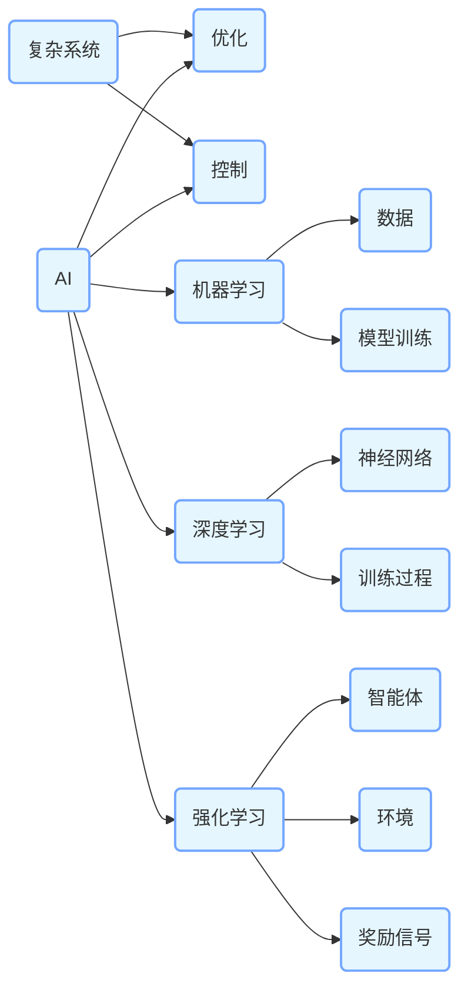

# AI在复杂系统优化和控制中的应用前景

> 关键词：人工智能、复杂系统优化、复杂系统控制、应用前景、机器学习算法

> 摘要：本文深入探讨了AI在复杂系统优化和控制中的应用前景。首先介绍了相关背景知识，包括目的范围、预期读者等。接着阐述了核心概念及联系，详细分析了核心算法原理与操作步骤，给出了数学模型和公式并举例说明。通过项目实战展示了代码实现和解读，探讨了实际应用场景。推荐了相关工具和资源，最后总结了未来发展趋势与挑战，还给出了常见问题解答和扩展阅读参考资料，旨在全面展现AI在复杂系统优化和控制领域的潜力与发展方向。

## 1. 背景介绍 
### 1.1 目的和范围
随着科技的飞速发展，复杂系统在各个领域如交通、能源、工业制造等中广泛存在。这些复杂系统往往具有高度的非线性、不确定性和多变量特性，传统的优化和控制方法在处理这些系统时面临着巨大的挑战。本文章的目的在于深入探讨人工智能（AI）技术在复杂系统优化和控制中的应用前景，分析其优势、面临的问题以及未来的发展趋势。范围涵盖了常见的复杂系统类型，如智能电网、交通网络、工业生产流程等，以及常用的AI技术，包括机器学习、深度学习、强化学习等。

### 1.2 预期读者
本文预期读者包括从事复杂系统研究和开发的科研人员、工程师，对AI技术在实际应用中感兴趣的技术爱好者，以及相关专业的高校师生。通过阅读本文，读者能够了解AI在复杂系统优化和控制领域的最新进展，掌握相关的技术原理和应用方法，为其在实际工作和学习中提供参考和指导。

### 1.3 文档结构概述
本文将按照以下结构进行组织：首先介绍核心概念与联系，明确复杂系统、优化和控制以及AI的相关概念和它们之间的关系；接着阐述核心算法原理和具体操作步骤，通过Python代码详细讲解常用的AI算法；然后给出数学模型和公式，并结合实例进行说明；之后通过项目实战展示代码的实际应用和详细解释；再探讨实际应用场景，分析AI在不同领域的具体应用；推荐相关的工具和资源，包括学习资源、开发工具框架和相关论文著作；最后总结未来发展趋势与挑战，给出常见问题解答和扩展阅读参考资料。

### 1.4 术语表
#### 1.4.1 核心术语定义
- **复杂系统**：由大量相互作用的组成部分构成的系统，这些组成部分之间的关系复杂，使得系统的行为具有高度的非线性、不确定性和涌现性。例如，生态系统、社会经济系统等。
- **优化**：在一定的约束条件下，寻找使得目标函数达到最优值（最大值或最小值）的决策变量取值的过程。例如，在生产计划中，优化生产方案以最小化成本。
- **控制**：通过对系统的输入进行调整，使得系统的输出达到期望的目标。例如，在机器人控制中，通过控制电机的输入来实现机器人的运动控制。
- **人工智能（AI）**：研究如何使计算机系统能够模拟人类智能的技术和方法，包括机器学习、深度学习、自然语言处理等。

#### 1.4.2 相关概念解释
- **机器学习**：AI的一个重要分支，它通过让计算机从数据中学习模式和规律，从而实现对未知数据的预测和决策。常见的机器学习算法包括决策树、支持向量机、神经网络等。
- **深度学习**：一种基于神经网络的机器学习方法，它通过构建多层神经网络来自动学习数据的特征表示。深度学习在图像识别、语音识别等领域取得了巨大的成功。
- **强化学习**：一种通过智能体与环境进行交互，根据环境反馈的奖励信号来学习最优行为策略的机器学习方法。强化学习在游戏、机器人控制等领域有广泛的应用。

#### 1.4.3 缩略词列表
- **AI**：Artificial Intelligence（人工智能）
- **ML**：Machine Learning（机器学习）
- **DL**：Deep Learning（深度学习）
- **RL**：Reinforcement Learning（强化学习）

## 2. 核心概念与联系 

### 核心概念原理
#### 复杂系统
复杂系统的原理在于其组成部分之间的相互作用和耦合。这些相互作用可以是线性的，也可以是非线性的。非线性相互作用使得系统的行为难以预测，因为一个小的输入变化可能会导致系统输出的巨大变化。例如，在生态系统中，一个物种数量的微小变化可能会通过食物链的相互作用影响到整个生态系统的平衡。

#### 优化
优化的原理是基于目标函数和约束条件。目标函数是衡量系统性能的指标，如成本、效率等。约束条件是对决策变量的限制，如资源限制、物理限制等。优化的过程就是在满足约束条件的前提下，寻找使得目标函数最优的决策变量取值。

#### 控制
控制的原理是基于反馈机制。通过对系统的输出进行测量，将测量结果与期望的目标进行比较，得到误差信号。然后根据误差信号调整系统的输入，使得误差信号逐渐减小，最终使系统的输出达到期望的目标。

#### AI
AI的原理是模拟人类的智能行为。机器学习通过数据驱动的方式让计算机学习模式和规律，深度学习通过构建多层神经网络自动学习数据的特征表示，强化学习通过智能体与环境的交互学习最优行为策略。

### 架构的文本示意图
```plaintext
复杂系统
|-- 组成部分1
|   |-- 与其他部分的相互作用
|-- 组成部分2
|   |-- 与其他部分的相互作用
|...

优化
|-- 目标函数
|-- 约束条件
|-- 优化算法

控制
|-- 系统输出测量
|-- 误差计算
|-- 输入调整

AI
|-- 机器学习
|   |-- 数据
|   |-- 模型训练
|-- 深度学习
|   |-- 神经网络
|   |-- 训练过程
|-- 强化学习
|   |-- 智能体
|   |-- 环境
|   |-- 奖励信号
```

### Mermaid流程图


从流程图可以看出，复杂系统需要进行优化和控制，而AI技术（包括机器学习、深度学习和强化学习）可以为复杂系统的优化和控制提供有效的方法和工具。

## 3. 核心算法原理 & 具体操作步骤 

### 机器学习算法 - 决策树算法原理及Python实现
#### 算法原理
决策树是一种基于树结构进行决策的机器学习算法。它通过对数据的特征进行划分，构建一个树形结构，每个内部节点表示一个特征上的测试，每个分支表示一个测试输出，每个叶节点表示一个类别或值。决策树的构建过程是一个递归的过程，通过选择最优的特征进行划分，使得划分后的子集的纯度最大。常用的纯度度量指标有信息增益、基尼指数等。

#### 具体操作步骤
1. **数据准备**：收集和整理数据集，将数据集划分为训练集和测试集。
2. **特征选择**：选择最优的特征进行划分。可以使用信息增益、基尼指数等指标来评估特征的重要性。
3. **树的构建**：递归地构建决策树，直到满足停止条件，如所有样本属于同一类别或没有更多的特征可供划分。
4. **模型评估**：使用测试集对构建好的决策树模型进行评估，计算模型的准确率、召回率等指标。

#### Python源代码实现
```python
import numpy as np
from sklearn.datasets import load_iris
from sklearn.model_selection import train_test_split
from sklearn.tree import DecisionTreeClassifier
from sklearn.metrics import accuracy_score

# 加载数据集
iris = load_iris()
X = iris.data
y = iris.target

# 划分训练集和测试集
X_train, X_test, y_train, y_test = train_test_split(X, y, test_size=0.2, random_state=42)

# 创建决策树分类器
clf = DecisionTreeClassifier()

# 训练模型
clf.fit(X_train, y_train)

# 预测
y_pred = clf.predict(X_test)

# 评估模型
accuracy = accuracy_score(y_test, y_pred)
print(f"Accuracy: {accuracy}")
```

### 深度学习算法 - 多层感知机（MLP）算法原理及Python实现
#### 算法原理
多层感知机是一种前馈神经网络，由输入层、隐藏层和输出层组成。每个神经元接收来自上一层神经元的输入，经过激活函数处理后输出到下一层。MLP通过反向传播算法来学习数据的特征表示和分类规则。反向传播算法通过计算误差的梯度，更新神经网络的权重和偏置，使得误差逐渐减小。

#### 具体操作步骤
1. **数据准备**：收集和整理数据集，将数据集划分为训练集和测试集。对数据进行预处理，如归一化、标准化等。
2. **模型构建**：定义MLP的结构，包括输入层、隐藏层和输出层的神经元数量，选择合适的激活函数。
3. **模型训练**：使用训练集对MLP进行训练，通过反向传播算法更新神经网络的权重和偏置。
4. **模型评估**：使用测试集对训练好的MLP进行评估，计算模型的准确率、损失值等指标。

#### Python源代码实现
```python
import numpy as np
from sklearn.datasets import make_classification
from sklearn.model_selection import train_test_split
from sklearn.neural_network import MLPClassifier
from sklearn.metrics import accuracy_score

# 生成数据集
X, y = make_classification(n_samples=1000, n_features=10, n_informative=5, n_redundant=0, random_state=42)

# 划分训练集和测试集
X_train, X_test, y_train, y_test = train_test_split(X, y, test_size=0.2, random_state=42)

# 创建MLP分类器
clf = MLPClassifier(hidden_layer_sizes=(10, 5), activation='relu', max_iter=1000, random_state=42)

# 训练模型
clf.fit(X_train, y_train)

# 预测
y_pred = clf.predict(X_test)

# 评估模型
accuracy = accuracy_score(y_test, y_pred)
print(f"Accuracy: {accuracy}")
```

### 强化学习算法 - Q学习算法原理及Python实现
#### 算法原理
Q学习是一种无模型的强化学习算法，它通过学习一个动作价值函数Q(s, a)来找到最优的行为策略。Q(s, a)表示在状态s下采取动作a的预期累积奖励。Q学习通过不断地与环境进行交互，根据环境反馈的奖励信号更新Q值，最终收敛到最优的Q值函数。

#### 具体操作步骤
1. **环境定义**：定义强化学习的环境，包括状态空间、动作空间和奖励函数。
2. **Q表初始化**：初始化Q表，将所有的Q值初始化为0。
3. **智能体与环境交互**：智能体在环境中选择动作，执行动作后得到新的状态和奖励信号。
4. **Q值更新**：根据Q学习的更新公式更新Q表中的Q值。
5. **策略选择**：根据更新后的Q表选择最优的动作。

#### Python源代码实现
```python
import numpy as np

# 定义环境
num_states = 5
num_actions = 2
reward_matrix = np.array([[0, 1], [1, 0], [0, 1], [1, 0], [0, 1]])

# 初始化Q表
Q = np.zeros((num_states, num_actions))

# 超参数
alpha = 0.1  # 学习率
gamma = 0.9  # 折扣因子
epsilon = 0.1  # 探索率
num_episodes = 100

# Q学习算法
for episode in range(num_episodes):
    state = 0
    done = False
    while not done:
        # 选择动作
        if np.random.uniform(0, 1) < epsilon:
            action = np.random.choice(num_actions)
        else:
            action = np.argmax(Q[state, :])
        
        # 执行动作
        next_state = state + 1 if action == 0 else state
        if next_state >= num_states:
            done = True
            reward = 0
        else:
            reward = reward_matrix[next_state, action]
        
        # 更新Q值
        Q[state, action] = Q[state, action] + alpha * (reward + gamma * np.max(Q[next_state, :]) - Q[state, action])
        
        state = next_state

print("Final Q table:")
print(Q)
```

## 4. 数学模型和公式 & 详细讲解 & 举例说明 

### 决策树的信息增益公式
#### 公式
信息增益（Information Gain）是衡量特征划分对数据集纯度提升的指标，其计算公式为：
$$IG(D, A) = H(D) - \sum_{v \in Values(A)} \frac{|D^v|}{|D|} H(D^v)$$
其中，$IG(D, A)$ 表示数据集 $D$ 在特征 $A$ 上的信息增益，$H(D)$ 表示数据集 $D$ 的信息熵，$Values(A)$ 表示特征 $A$ 的所有可能取值，$D^v$ 表示特征 $A$ 取值为 $v$ 时的子集，$|D|$ 和 $|D^v|$ 分别表示数据集 $D$ 和子集 $D^v$ 的样本数量。

#### 详细讲解
信息熵 $H(D)$ 用于衡量数据集 $D$ 的不确定性，其计算公式为：
$$H(D) = - \sum_{k = 1}^{|Y|} p_k \log_2 p_k$$
其中，$|Y|$ 表示数据集 $D$ 中类别的数量，$p_k$ 表示第 $k$ 个类别的样本在数据集 $D$ 中所占的比例。

信息增益的含义是，使用特征 $A$ 对数据集 $D$ 进行划分后，数据集的不确定性降低的程度。信息增益越大，说明特征 $A$ 对数据集的划分效果越好。

#### 举例说明
假设有一个数据集 $D$ 包含 10 个样本，分为两个类别：正类和负类，其中正类有 6 个样本，负类有 4 个样本。特征 $A$ 有两个取值：$v_1$ 和 $v_2$，取值为 $v_1$ 的样本有 4 个，其中正类有 3 个，负类有 1 个；取值为 $v_2$ 的样本有 6 个，其中正类有 3 个，负类有 3 个。

首先计算数据集 $D$ 的信息熵：
$$p_1 = \frac{6}{10} = 0.6, p_2 = \frac{4}{10} = 0.4$$
$$H(D) = - (0.6 \log_2 0.6 + 0.4 \log_2 0.4) \approx 0.971$$

然后计算子集 $D^{v_1}$ 和 $D^{v_2}$ 的信息熵：
对于 $D^{v_1}$：
$$p_{11} = \frac{3}{4} = 0.75, p_{12} = \frac{1}{4} = 0.25$$
$$H(D^{v_1}) = - (0.75 \log_2 0.75 + 0.25 \log_2 0.25) \approx 0.811$$

对于 $D^{v_2}$：
$$p_{21} = \frac{3}{6} = 0.5, p_{22} = \frac{3}{6} = 0.5$$
$$H(D^{v_2}) = - (0.5 \log_2 0.5 + 0.5 \log_2 0.5) = 1$$

最后计算信息增益：
$$IG(D, A) = H(D) - (\frac{4}{10} H(D^{v_1}) + \frac{6}{10} H(D^{v_2}))$$
$$= 0.971 - (\frac{4}{10} \times 0.811 + \frac{6}{10} \times 1) \approx 0.146$$

### 多层感知机的反向传播公式
#### 公式
假设多层感知机有 $L$ 层，第 $l$ 层的神经元数量为 $n_l$，输入层为第 0 层，输出层为第 $L$ 层。第 $l$ 层的输入为 $z^{(l)}$，输出为 $a^{(l)}$，权重矩阵为 $W^{(l)}$，偏置向量为 $b^{(l)}$，激活函数为 $f$。

前向传播公式：
$$z^{(l)} = W^{(l)} a^{(l - 1)} + b^{(l)}$$
$$a^{(l)} = f(z^{(l)})$$

反向传播公式：
对于输出层 $L$：
$$\delta^{(L)} = \nabla_{z^{(L)}} J(W, b; x, y) = (a^{(L)} - y) \odot f'(z^{(L)})$$
对于隐藏层 $l = L - 1, L - 2, \cdots, 1$：
$$\delta^{(l)} = ((W^{(l + 1)})^T \delta^{(l + 1)}) \odot f'(z^{(l)})$$
权重和偏置的更新公式：
$$\nabla_{W^{(l)}} J(W, b; x, y) = \delta^{(l)} (a^{(l - 1)})^T$$
$$\nabla_{b^{(l)}} J(W, b; x, y) = \delta^{(l)}$$
$$W^{(l)} := W^{(l)} - \alpha \nabla_{W^{(l)}} J(W, b; x, y)$$
$$b^{(l)} := b^{(l)} - \alpha \nabla_{b^{(l)}} J(W, b; x, y)$$
其中，$J(W, b; x, y)$ 是损失函数，$\alpha$ 是学习率，$\odot$ 表示逐元素相乘。

#### 详细讲解
前向传播的过程是将输入数据从输入层依次传递到输出层，计算每一层的输入和输出。反向传播的过程是从输出层开始，依次计算每一层的误差项 $\delta^{(l)}$，然后根据误差项计算权重和偏置的梯度，最后使用梯度下降法更新权重和偏置。

#### 举例说明
假设有一个简单的多层感知机，输入层有 2 个神经元，隐藏层有 3 个神经元，输出层有 1 个神经元。激活函数为 sigmoid 函数：
$$f(z) = \frac{1}{1 + e^{-z}}$$
其导数为：
$$f'(z) = f(z) (1 - f(z))$$

假设输入数据 $x = [0.5, 0.3]$，真实标签 $y = 1$，初始权重矩阵 $W^{(1)}$ 和 $W^{(2)}$ 以及偏置向量 $b^{(1)}$ 和 $b^{(2)}$ 如下：
$$W^{(1)} = \begin{bmatrix} 0.1 & 0.2 \\ 0.3 & 0.4 \\ 0.5 & 0.6 \end{bmatrix}, b^{(1)} = \begin{bmatrix} 0.1 \\ 0.2 \\ 0.3 \end{bmatrix}$$
$$W^{(2)} = \begin{bmatrix} 0.7 & 0.8 & 0.9 \end{bmatrix}, b^{(2)} = [0.4]$$

前向传播：
$$z^{(1)} = W^{(1)} x + b^{(1)} = \begin{bmatrix} 0.1 \times 0.5 + 0.2 \times 0.3 + 0.1 \\ 0.3 \times 0.5 + 0.4 \times 0.3 + 0.2 \\ 0.5 \times 0.5 + 0.6 \times 0.3 + 0.3 \end{bmatrix} = \begin{bmatrix} 0.21 \\ 0.47 \\ 0.73 \end{bmatrix}$$
$$a^{(1)} = f(z^{(1)}) = \begin{bmatrix} \frac{1}{1 + e^{-0.21}} \\ \frac{1}{1 + e^{-0.47}} \\ \frac{1}{1 + e^{-0.73}} \end{bmatrix} \approx \begin{bmatrix} 0.552 \\ 0.616 \\ 0.675 \end{bmatrix}$$
$$z^{(2)} = W^{(2)} a^{(1)} + b^{(2)} = 0.7 \times 0.552 + 0.8 \times 0.616 + 0.9 \times 0.675 + 0.4 \approx 1.72$$
$$a^{(2)} = f(z^{(2)}) = \frac{1}{1 + e^{-1.72}} \approx 0.848$$

反向传播：
损失函数使用均方误差：
$$J(W, b; x, y) = \frac{1}{2} (a^{(2)} - y)^2 = \frac{1}{2} (0.848 - 1)^2 \approx 0.011$$
对于输出层：
$$\delta^{(2)} = (a^{(2)} - y) \odot f'(z^{(2)}) = (0.848 - 1) \times 0.848 \times (1 - 0.848) \approx -0.019$$
对于隐藏层：
$$\delta^{(1)} = ((W^{(2)})^T \delta^{(2)}) \odot f'(z^{(1)})$$
$$= \begin{bmatrix} 0.7 \\ 0.8 \\ 0.9 \end{bmatrix} \times (-0.019) \odot \begin{bmatrix} 0.552 \times (1 - 0.552) \\ 0.616 \times (1 - 0.616) \\ 0.675 \times (1 - 0.675) \end{bmatrix} \approx \begin{bmatrix} -0.003 \\ -0.004 \\ -0.005 \end{bmatrix}$$
权重和偏置的更新：
$$\nabla_{W^{(2)}} J(W, b; x, y) = \delta^{(2)} (a^{(1)})^T \approx [-0.003, -0.004, -0.005]$$
$$\nabla_{b^{(2)}} J(W, b; x, y) = \delta^{(2)} \approx -0.019$$
$$\nabla_{W^{(1)}} J(W, b; x, y) = \delta^{(1)} x^T \approx \begin{bmatrix} -0.002 & -0.001 \\ -0.002 & -0.001 \\ -0.003 & -0.002 \end{bmatrix}$$
$$\nabla_{b^{(1)}} J(W, b; x, y) = \delta^{(1)} \approx \begin{bmatrix} -0.003 \\ -0.004 \\ -0.005 \end{bmatrix}$$
假设学习率 $\alpha = 0.1$，则更新后的权重和偏置为：
$$W^{(2)} := W^{(2)} - \alpha \nabla_{W^{(2)}} J(W, b; x, y) \approx \begin{bmatrix} 0.703 & 0.804 & 0.805 \end{bmatrix}$$
$$b^{(2)} := b^{(2)} - \alpha \nabla_{b^{(2)}} J(W, b; x, y) \approx [0.402]$$
$$W^{(1)} := W^{(1)} - \alpha \nabla_{W^{(1)}} J(W, b; x, y) \approx \begin{bmatrix} 0.102 & 0.201 \\ 0.302 & 0.401 \\ 0.503 & 0.602 \end{bmatrix}$$
$$b^{(1)} := b^{(1)} - \alpha \nabla_{b^{(1)}} J(W, b; x, y) \approx \begin{bmatrix} 0.103 \\ 0.204 \\ 0.305 \end{bmatrix}$$

### Q学习的更新公式
#### 公式
Q学习的更新公式为：
$$Q(s, a) := Q(s, a) + \alpha [r + \gamma \max_{a'} Q(s', a') - Q(s, a)]$$
其中，$Q(s, a)$ 表示在状态 $s$ 下采取动作 $a$ 的Q值，$\alpha$ 是学习率，$r$ 是执行动作 $a$ 后得到的奖励，$\gamma$ 是折扣因子，$s'$ 是执行动作 $a$ 后转移到的新状态。

#### 详细讲解
Q学习的更新公式的含义是，根据当前状态 $s$、动作 $a$、奖励 $r$ 和下一个状态 $s'$ 来更新Q值。$r + \gamma \max_{a'} Q(s', a')$ 表示在状态 $s$ 下采取动作 $a$ 后，预期的累积奖励。$Q(s, a)$ 表示当前估计的累积奖励。两者的差值乘以学习率 $\alpha$ 后加到当前的Q值上，使得Q值逐渐收敛到最优值。

#### 举例说明
假设在一个简单的网格世界中，智能体可以在 4 个方向上移动，状态空间是网格的位置，动作空间是 4 个方向。当前状态 $s = (1, 1)$，选择动作 $a =$ 向右移动，执行动作后得到奖励 $r = 1$，转移到新状态 $s' = (1, 2)$。假设当前的Q值 $Q((1, 1), 向右) = 0.5$，学习率 $\alpha = 0.1$，折扣因子 $\gamma = 0.9$，且 $\max_{a'} Q((1, 2), a') = 0.8$。

则更新后的Q值为：
$$Q((1, 1), 向右) = Q((1, 1), 向右) + \alpha [r + \gamma \max_{a'} Q((1, 2), a') - Q((1, 1), 向右)]$$
$$= 0.5 + 0.1 \times [1 + 0.9 \times 0.8 - 0.5]$$
$$= 0.5 + 0.1 \times [1 + 0.72 - 0.5]$$
$$= 0.5 + 0.1 \times 1.22$$
$$= 0.622$$

## 5. 项目实战：代码实际案例和详细解释说明 

### 5.1  开发环境搭建
#### 操作系统
本项目可以在多种操作系统上进行开发，如Windows、Linux（Ubuntu、CentOS等）和macOS。建议使用最新版本的操作系统以确保兼容性和稳定性。

#### Python环境
安装Python 3.6及以上版本。可以从Python官方网站（https://www.python.org/downloads/）下载安装包进行安装。安装完成后，使用以下命令验证Python版本：
```sh
python --version
```

#### 虚拟环境创建
为了避免不同项目之间的依赖冲突，建议使用虚拟环境。可以使用`venv`模块创建虚拟环境：
```sh
python -m venv myenv
```
激活虚拟环境：
- 在Windows上：
```sh
myenv\Scripts\activate
```
- 在Linux和macOS上：
```sh
source myenv/bin/activate
```

#### 依赖库安装
在虚拟环境中安装项目所需的依赖库，包括`numpy`、`pandas`、`scikit-learn`、`tensorflow`、`keras`等。可以使用`pip`命令进行安装：
```sh
pip install numpy pandas scikit-learn tensorflow keras
```

### 5.2  源代码详细实现和代码解读
#### 项目背景
本项目以智能电网的负荷预测为例，展示AI在复杂系统优化和控制中的应用。智能电网是一个典型的复杂系统，其负荷受到多种因素的影响，如天气、时间、用户行为等。准确的负荷预测可以帮助电网运营商合理安排发电计划，提高电网的稳定性和经济性。

#### 数据准备
首先，我们需要收集和整理智能电网的负荷数据和相关的影响因素数据。假设我们已经收集到了一段时间内的负荷数据和天气数据，包括温度、湿度、风速等。以下是数据准备的代码：
```python
import pandas as pd
from sklearn.preprocessing import StandardScaler

# 读取数据
data = pd.read_csv('smart_grid_data.csv')

# 提取特征和目标变量
X = data.drop('load', axis=1)
y = data['load']

# 数据标准化
scaler = StandardScaler()
X_scaled = scaler.fit_transform(X)
```
代码解读：
- 使用`pandas`库读取CSV格式的数据文件。
- 提取特征数据`X`和目标变量`y`，其中`load`是负荷数据。
- 使用`StandardScaler`对特征数据进行标准化处理，使得数据具有零均值和单位方差。

#### 模型构建
我们使用多层感知机（MLP）作为负荷预测模型。以下是模型构建的代码：
```python
from tensorflow.keras.models import Sequential
from tensorflow.keras.layers import Dense

# 构建MLP模型
model = Sequential()
model.add(Dense(64, activation='relu', input_shape=(X_scaled.shape[1],)))
model.add(Dense(32, activation='relu'))
model.add(Dense(1))

# 编译模型
model.compile(optimizer='adam', loss='mse')
```
代码解读：
- 使用`Sequential`模型构建一个简单的MLP模型。
- 添加输入层、隐藏层和输出层，其中隐藏层使用ReLU激活函数，输出层不使用激活函数。
- 使用`adam`优化器和均方误差（MSE）损失函数编译模型。

#### 模型训练
将数据集划分为训练集和测试集，然后对模型进行训练。以下是模型训练的代码：
```python
from sklearn.model_selection import train_test_split

# 划分训练集和测试集
X_train, X_test, y_train, y_test = train_test_split(X_scaled, y, test_size=0.2, random_state=42)

# 训练模型
model.fit(X_train, y_train, epochs=100, batch_size=32, validation_split=0.1)
```
代码解读：
- 使用`train_test_split`函数将数据集划分为训练集和测试集，其中测试集占比为20%。
- 使用`fit`方法对模型进行训练，设置训练轮数为100，批次大小为32，并使用10%的训练数据作为验证集。

#### 模型评估
使用测试集对训练好的模型进行评估，计算模型的均方误差（MSE）和均方根误差（RMSE）。以下是模型评估的代码：
```python
import numpy as np
from sklearn.metrics import mean_squared_error

# 预测
y_pred = model.predict(X_test)

# 计算MSE和RMSE
mse = mean_squared_error(y_test, y_pred)
rmse = np.sqrt(mse)

print(f"MSE: {mse}")
print(f"RMSE: {rmse}")
```
代码解读：
- 使用`predict`方法对测试集进行预测。
- 使用`mean_squared_error`函数计算均方误差，并使用`np.sqrt`函数计算均方根误差。

### 5.3  代码解读与分析
#### 数据处理
数据标准化是非常重要的一步，因为不同特征的取值范围可能差异很大，标准化可以使得模型更容易收敛。在本项目中，使用`StandardScaler`对特征数据进行标准化处理。

#### 模型构建
MLP模型具有较强的非线性拟合能力，适合处理复杂的负荷预测问题。通过添加隐藏层和激活函数，可以提高模型的表达能力。

#### 模型训练
训练轮数和批次大小是影响模型训练效果的重要参数。训练轮数过多可能会导致过拟合，训练轮数过少可能会导致欠拟合。批次大小过大可能会导致模型收敛速度变慢，批次大小过小可能会导致模型不稳定。

#### 模型评估
均方误差（MSE）和均方根误差（RMSE）是常用的回归模型评估指标。MSE衡量了预测值与真实值之间的平均误差的平方，RMSE是MSE的平方根，更直观地反映了预测值与真实值之间的平均误差。

## 6. 实际应用场景 
### 智能交通系统
在智能交通系统中，AI可以用于交通流量预测、交通信号控制和路径规划等方面。通过收集和分析交通数据，如车辆速度、流量、拥堵情况等，使用机器学习和深度学习算法可以预测未来的交通流量，从而合理调整交通信号的时间间隔，减少交通拥堵。例如，百度地图使用AI技术进行实时路况预测和路径规划，为用户提供最优的出行方案。

### 智能电网
智能电网是一个复杂的电力系统，AI可以用于负荷预测、发电调度和故障诊断等方面。通过分析历史负荷数据、天气数据和用户行为数据，使用AI算法可以准确预测未来的电力负荷，从而合理安排发电计划，提高电网的稳定性和经济性。例如，国家电网使用AI技术进行负荷预测和发电调度，实现了电力资源的优化配置。

### 工业生产流程优化
在工业生产中，AI可以用于生产过程监控、质量控制和设备维护等方面。通过安装传感器收集生产过程中的数据，如温度、压力、振动等，使用机器学习和深度学习算法可以实时监测生产过程的状态，预测产品质量，及时发现设备故障并进行维护。例如，西门子公司使用AI技术对工业生产过程进行优化，提高了生产效率和产品质量。

### 医疗保健系统
在医疗保健系统中，AI可以用于疾病诊断、治疗方案推荐和健康管理等方面。通过分析患者的病历、影像数据和基因数据，使用AI算法可以辅助医生进行疾病诊断，提供个性化的治疗方案，提高医疗服务的质量和效率。例如，IBM Watson for Oncology使用AI技术为癌症患者提供治疗方案推荐，帮助医生做出更准确的决策。

### 金融风险管理
在金融领域，AI可以用于信用评估、风险预测和投资决策等方面。通过分析客户的信用记录、财务数据和市场数据，使用机器学习和深度学习算法可以评估客户的信用风险，预测市场趋势，为投资者提供投资建议。例如，蚂蚁金服使用AI技术进行信用评估和风险预测，为用户提供更便捷的金融服务。

## 7. 工具和资源推荐
### 7.1 学习资源推荐
#### 7.1.1 书籍推荐
- 《机器学习》（周志华著）：这是一本经典的机器学习教材，系统地介绍了机器学习的基本概念、算法和应用。
- 《深度学习》（Ian Goodfellow、Yoshua Bengio和Aaron Courville著）：这是深度学习领域的权威书籍，详细介绍了深度学习的原理、算法和应用。
- 《强化学习：原理与Python实现》（肖智清著）：这本书全面介绍了强化学习的基本概念、算法和应用，并提供了Python代码实现。

#### 7.1.2 在线课程
- Coursera上的“机器学习”课程（Andrew Ng教授主讲）：这是一门非常受欢迎的机器学习课程，涵盖了机器学习的基本概念、算法和应用。
- edX上的“深度学习”课程（由多个知名高校的教授联合授课）：该课程深入介绍了深度学习的原理、算法和应用。
- 哔哩哔哩上的“强化学习入门教程”：这是一个免费的强化学习入门教程，适合初学者学习。

#### 7.1.3 技术博客和网站
- Medium：这是一个技术博客平台，有很多关于AI、机器学习和深度学习的优质文章。
- arXiv：这是一个预印本平台，提供了大量的AI研究论文。
- Kaggle：这是一个数据科学竞赛平台，有很多关于AI和机器学习的数据集和竞赛项目。

### 7.2 开发工具框架推荐
#### 7.2.1 IDE和编辑器
- PyCharm：这是一个专业的Python集成开发环境，提供了丰富的代码编辑、调试和项目管理功能。
- Jupyter Notebook：这是一个交互式的开发环境，适合进行数据探索、模型训练和可视化。
- Visual Studio Code：这是一个轻量级的代码编辑器，支持多种编程语言和插件扩展。

#### 7.2.2 调试和性能分析工具
- TensorBoard：这是TensorFlow提供的一个可视化工具，可以用于监控模型的训练过程、可视化模型结构和分析性能指标。
- Py-Spy：这是一个Python性能分析工具，可以用于分析Python程序的性能瓶颈。
- PDB：这是Python自带的调试器，可以用于调试Python程序。

#### 7.2.3 相关框架和库
- TensorFlow：这是一个开源的深度学习框架，由Google开发，提供了丰富的深度学习模型和工具。
- PyTorch：这是一个开源的深度学习框架，由Facebook开发，具有动态图的特点，适合快速开发和研究。
- Scikit-learn：这是一个开源的机器学习库，提供了丰富的机器学习算法和工具，适合初学者和快速开发。

### 7.3 相关论文著作推荐
#### 7.3.1 经典论文
- “Gradient-based learning applied to document recognition”（Yann LeCun、Léon Bottou、Yoshua Bengio和Patrick Haffner著）：这篇论文介绍了卷积神经网络（CNN）的基本原理和应用，是深度学习领域的经典论文之一。
- “Playing Atari with Deep Reinforcement Learning”（Volodymyr Mnih等人著）：这篇论文介绍了深度强化学习在Atari游戏中的应用，开启了深度强化学习的研究热潮。
- “Attention Is All You Need”（Ashish Vaswani等人著）：这篇论文介绍了Transformer模型的基本原理和应用，是自然语言处理领域的重要突破。

#### 7.3.2 最新研究成果
- 关注顶级学术会议如NeurIPS、ICML、CVPR等的最新论文，这些会议汇集了AI领域的最新研究成果。
- 关注知名研究机构如OpenAI、DeepMind等的研究报告和论文，这些机构在AI领域处于领先地位。

#### 7.3.3 应用案例分析
- 《AI in Practice: How 50 Successful Companies Used Artificial Intelligence to Solve Problems》（Thomas H. Davenport和Rajeev Ronanki著）：这本书介绍了50个成功的AI应用案例，涵盖了多个领域，如医疗、金融、零售等。
- Kaggle上的优秀解决方案：Kaggle上有很多优秀的AI应用案例，通过学习这些案例可以了解AI在实际应用中的方法和技巧。

## 8. 总结：未来发展趋势与挑战
### 未来发展趋势
#### 融合多种AI技术
未来，AI在复杂系统优化和控制中的应用将不再局限于单一的技术，而是会融合多种AI技术，如机器学习、深度学习、强化学习等，以实现更强大的功能和更高的性能。例如，在智能交通系统中，可以结合深度学习进行交通流量预测，使用强化学习进行交通信号控制。

#### 与物联网和大数据的深度融合
随着物联网和大数据技术的发展，复杂系统将产生大量的数据。AI将与物联网和大数据深度融合，通过对海量数据的分析和挖掘，实现对复杂系统的更精准的优化和控制。例如，在智能电网中，可以通过物联网设备收集电力数据，使用AI算法进行实时分析和决策。

#### 向自主智能系统发展
未来的AI系统将向自主智能系统发展，能够自动感知环境、自主决策和执行任务。在复杂系统优化和控制中，自主智能系统可以根据系统的实时状态和环境变化，自动调整优化和控制策略，提高系统的适应性和灵活性。例如，在工业生产中，自主智能机器人可以根据生产任务和环境变化，自动调整生产流程和操作方式。

#### 跨领域应用拓展
AI在复杂系统优化和控制中的应用将不断拓展到更多的领域，如农业、环保、教育等。通过将AI技术应用于这些领域，可以解决传统方法难以解决的问题，提高生产效率和社会效益。例如，在农业中，可以使用AI技术进行作物生长监测和病虫害预测，实现精准农业。

### 挑战
#### 数据质量和隐私问题
AI算法的性能很大程度上依赖于数据的质量。在复杂系统中，数据可能存在噪声、缺失值和不一致性等问题，需要进行数据清洗和预处理。此外，随着数据的大量收集和使用，数据隐私问题也日益突出。如何在保证数据质量的同时，保护数据的隐私和安全，是一个亟待解决的问题。

#### 算法可解释性问题
深度学习和强化学习等AI算法通常被认为是“黑盒”模型，其决策过程难以解释。在复杂系统优化和控制中，尤其是在一些关键领域，如医疗、金融等，算法的可解释性至关重要。如何提高AI算法的可解释性，让用户能够理解和信任算法的决策结果，是一个挑战。

#### 计算资源和能耗问题
AI算法的训练和推理通常需要大量的计算资源和能耗。在复杂系统中，尤其是在一些资源受限的环境中，如物联网设备和移动终端，如何在有限的计算资源和能耗下实现高效的AI算法，是一个挑战。

#### 伦理和法律问题
随着AI技术的广泛应用，伦理和法律问题也日益凸显。例如，AI算法可能存在偏见和歧视，导致不公平的决策结果。此外，AI系统的责任归属和法律责任也需要明确。如何制定合理的伦理和法律规范，引导AI技术的健康发展，是一个挑战。

## 9. 附录：常见问题与解答
### 问题1：AI在复杂系统优化和控制中的应用有哪些优势？
解答：AI在复杂系统优化和控制中的应用具有以下优势：
- 能够处理复杂的非线性关系：复杂系统通常具有高度的非线性特性，传统的优化和控制方法难以处理。AI算法如深度学习可以自动学习数据中的非线性模式，从而更好地处理复杂系统。
- 能够适应不确定性：复杂系统中存在很多不确定性因素，如环境变化、随机干扰等。AI算法如强化学习可以通过与环境的交互学习最优策略，适应不确定性。
- 能够实现自动化决策：AI算法可以根据系统的实时状态自动做出决策，减少人工干预，提高决策的效率和准确性。

### 问题2：如何选择合适的AI算法用于复杂系统优化和控制？
解答：选择合适的AI算法需要考虑以下因素：
- 问题的类型：如果是分类问题，可以选择决策树、支持向量机、神经网络等算法；如果是回归问题，可以选择线性回归、岭回归、神经网络等算法；如果是优化问题，可以选择遗传算法、粒子群算法、强化学习等算法。
- 数据的特点：如果数据量较小，可以选择简单的算法；如果数据量较大，可以选择