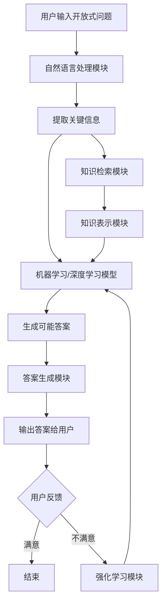

# AI在开放式问题解决中的应用挑战

> 关键词：AI、开放式问题解决、应用挑战、自然语言处理、知识表示、泛化能力

> 摘要：本文聚焦于AI在开放式问题解决中的应用挑战。首先介绍了相关背景，包括研究目的、预期读者等内容。接着阐述了核心概念，构建了相关原理和架构的文本示意图与Mermaid流程图。详细讲解了核心算法原理，并通过Python代码进行示例。分析了涉及的数学模型和公式，结合实例进行说明。通过项目实战展示代码实现及解读。探讨了AI在开放式问题解决中的实际应用场景，推荐了相关的学习资源、开发工具框架和论文著作。最后总结了未来发展趋势与挑战，提供了常见问题解答及扩展阅读参考资料，旨在全面剖析AI在开放式问题解决过程中面临的各种挑战及其应对思路。

## 1. 背景介绍 
### 1.1 目的和范围
在当今数字化时代，人工智能（AI）技术取得了显著的进展，并在众多领域得到了广泛的应用。开放式问题解决是指处理那些没有固定答案、需要综合多方面知识和信息进行分析和推理的问题。本文章的目的在于深入探讨AI在开放式问题解决过程中所面临的各种挑战，范围涵盖从核心概念、算法原理到实际应用场景等多个层面，旨在为研究人员、开发者以及相关从业者提供全面的参考和思考方向。

### 1.2 预期读者
本文预期读者包括人工智能领域的研究人员、软件开发工程师、数据科学家、对AI技术应用感兴趣的学生以及关注科技发展的企业管理人员等。这些读者群体希望深入了解AI在开放式问题解决方面的现状、挑战以及未来发展趋势，以便在各自的工作和学习中更好地应用和发展相关技术。

### 1.3 文档结构概述
本文将按照以下结构进行组织：首先介绍核心概念与联系，包括相关原理和架构的文本示意图与Mermaid流程图；接着阐述核心算法原理并给出具体操作步骤，通过Python源代码详细说明；然后分析涉及的数学模型和公式，结合实例进行讲解；通过项目实战展示代码实际案例并进行详细解释；探讨AI在开放式问题解决中的实际应用场景；推荐相关的学习资源、开发工具框架和论文著作；最后总结未来发展趋势与挑战，提供常见问题解答及扩展阅读参考资料。

### 1.4 术语表
#### 1.4.1 核心术语定义
- **人工智能（AI）**：是一门研究如何使计算机系统能够模拟人类智能行为的学科，包括学习、推理、问题解决等能力。
- **开放式问题**：指没有唯一确定答案，需要综合多方面知识、经验和信息进行分析和推理的问题，通常具有较高的开放性和不确定性。
- **自然语言处理（NLP）**：是AI的一个重要分支，主要研究如何让计算机理解、处理和生成人类语言。
- **知识表示**：是将知识以计算机能够理解和处理的方式进行表示和存储的方法。
- **泛化能力**：指模型在面对未见过的数据时，能够准确地进行预测和处理的能力。

#### 1.4.2 相关概念解释
- **深度学习**：是一种基于人工神经网络的机器学习方法，通过构建多层神经网络来自动学习数据中的特征和模式。
- **强化学习**：是一种通过智能体与环境进行交互，根据环境反馈的奖励信号来学习最优行为策略的机器学习方法。
- **知识图谱**：是一种用于表示实体之间关系的图结构数据，能够将大量的知识进行整合和关联，为问题解决提供丰富的背景知识。

#### 1.4.3 缩略词列表
- **AI**：Artificial Intelligence（人工智能）
- **NLP**：Natural Language Processing（自然语言处理）
- **ML**：Machine Learning（机器学习）
- **DL**：Deep Learning（深度学习）
- **RL**：Reinforcement Learning（强化学习）

## 2. 核心概念与联系 

### 核心概念原理
在AI解决开放式问题的过程中，涉及到多个核心概念。首先是自然语言处理，它是理解和处理开放式问题的基础。当用户提出一个开放式问题时，AI系统需要通过自然语言处理技术将问题进行解析，包括分词、词性标注、句法分析等，以便准确理解问题的语义。

知识表示也是关键概念之一。为了能够有效地解决开放式问题，AI系统需要具备丰富的知识。知识表示的方式有很多种，如符号表示法、语义网络、知识图谱等。通过合适的知识表示方法，AI系统可以将知识进行结构化存储，便于在问题解决过程中进行检索和推理。

机器学习和深度学习则为AI系统提供了学习和优化的能力。通过大量的数据训练，模型可以学习到问题和答案之间的模式和规律，从而提高问题解决的准确性和效率。强化学习可以使AI系统在与环境的交互中不断调整自己的行为策略，以获得最优的解决方案。

### 架构的文本示意图
AI在开放式问题解决中的架构可以描述如下：首先是输入层，接收用户提出的开放式问题，该问题以自然语言的形式呈现。然后进入自然语言处理模块，对问题进行解析和预处理，提取关键信息。接下来，知识检索模块根据关键信息从知识表示模块中检索相关的知识。这些知识与问题一起输入到机器学习或深度学习模型中，模型进行推理和计算，生成可能的答案。最后，答案生成模块将模型的输出进行整理和优化，以自然语言的形式反馈给用户。在整个过程中，强化学习模块可以根据用户的反馈对模型进行调整和优化。

### Mermaid流程图


## 3. 核心算法原理 & 具体操作步骤 

### 自然语言处理算法原理
在自然语言处理中，分词是一个重要的步骤。常见的分词算法有基于规则的分词算法和基于统计的分词算法。基于规则的分词算法主要根据预先定义的规则进行分词，例如正向最大匹配法、逆向最大匹配法等。下面是正向最大匹配法的Python实现：

```python
def forward_max_match(sentence, word_dict):
    max_len = max([len(word) for word in word_dict])
    result = []
    index = 0
    while index < len(sentence):
        for i in range(min(index + max_len, len(sentence)), index, -1):
            word = sentence[index:i]
            if word in word_dict:
                result.append(word)
                index = i
                break
        else:
            result.append(sentence[index])
            index += 1
    return result

# 示例
word_dict = ["我们", "是", "中国人"]
sentence = "我们是中国人"
print(forward_max_match(sentence, word_dict))
```

词性标注也是自然语言处理中的重要任务。一种常用的词性标注算法是隐马尔可夫模型（HMM）。HMM是一种统计模型，它假设词性序列是一个隐藏的马尔可夫链，而观察到的词序列是由这个隐藏链生成的。下面是一个简单的HMM词性标注的Python示例：

```python
import numpy as np

# 状态集合（词性）
states = ('名词', '动词')
# 观察集合（词）
observations = ('苹果', '吃')
# 初始状态概率
start_probability = {'名词': 0.6, '动词': 0.4}
# 状态转移概率
transition_probability = {
    '名词': {'名词': 0.7, '动词': 0.3},
    '动词': {'名词': 0.4, '动词': 0.6}
}
# 发射概率
emission_probability = {
    '名词': {'苹果': 0.8, '吃': 0.2},
    '动词': {'苹果': 0.1, '吃': 0.9}
}


def viterbi(obs, states, start_p, trans_p, emit_p):
    V = [{}]
    path = {}
    for y in states:
        V[0][y] = start_p[y] * emit_p[y][obs[0]]
        path[y] = [y]
    for t in range(1, len(obs)):
        V.append({})
        newpath = {}
        for y in states:
            (prob, state) = max((V[t - 1][y0] * trans_p[y0][y] * emit_p[y][obs[t]], y0) for y0 in states)
            V[t][y] = prob
            newpath[y] = path[state] + [y]
        path = newpath
    (prob, state) = max((V[len(obs) - 1][y], y) for y in states)
    return path[state]


print(viterbi(observations, states, start_probability, transition_probability, emission_probability))
```

### 机器学习和深度学习算法原理
在机器学习中，决策树是一种常用的分类和回归算法。决策树通过对数据进行递归划分，构建一个树形结构的模型。下面是一个简单的决策树分类的Python示例：

```python
from sklearn.datasets import load_iris
from sklearn.model_selection import train_test_split
from sklearn.tree import DecisionTreeClassifier

# 加载数据集
iris = load_iris()
X = iris.data
y = iris.target

# 划分训练集和测试集
X_train, X_test, y_train, y_test = train_test_split(X, y, test_size=0.3, random_state=42)

# 创建决策树分类器
clf = DecisionTreeClassifier()

# 训练模型
clf.fit(X_train, y_train)

# 预测
y_pred = clf.predict(X_test)

# 评估模型
from sklearn.metrics import accuracy_score
print(accuracy_score(y_test, y_pred))
```

在深度学习中，循环神经网络（RNN）常用于处理序列数据，如自然语言。长短期记忆网络（LSTM）是一种特殊的RNN，它能够解决传统RNN中的梯度消失问题。下面是一个使用Keras实现的简单LSTM文本分类示例：

```python
from keras.datasets import imdb
from keras.preprocessing import sequence
from keras.models import Sequential
from keras.layers import Embedding, LSTM, Dense

# 加载IMDB电影评论数据集
max_features = 10000
maxlen = 200
(x_train, y_train), (x_test, y_test) = imdb.load_data(num_words=max_features)

# 填充序列
x_train = sequence.pad_sequences(x_train, maxlen=maxlen)
x_test = sequence.pad_sequences(x_test, maxlen=maxlen)

# 构建模型
model = Sequential()
model.add(Embedding(max_features, 128))
model.add(LSTM(128))
model.add(Dense(1, activation='sigmoid'))

# 编译模型
model.compile(optimizer='rmsprop', loss='binary_crossentropy', metrics=['acc'])

# 训练模型
model.fit(x_train, y_train, epochs=10, batch_size=128, validation_split=0.2)

# 评估模型
test_loss, test_acc = model.evaluate(x_test, y_test)
print('Test accuracy:', test_acc)
```

### 具体操作步骤
1. **数据收集与预处理**：收集与开放式问题相关的数据，对数据进行清洗、标注等预处理操作，以便后续的模型训练。
2. **模型选择与训练**：根据问题的特点选择合适的模型，如自然语言处理模型、机器学习模型或深度学习模型。使用预处理后的数据对模型进行训练。
3. **模型评估与优化**：使用测试数据对训练好的模型进行评估，根据评估结果对模型进行优化，如调整模型参数、增加训练数据等。
4. **系统集成与部署**：将训练好的模型集成到AI系统中，并进行部署，使其能够接收用户的开放式问题并提供解决方案。

## 4. 数学模型和公式 & 详细讲解 & 举例说明 

### 隐马尔可夫模型（HMM）
隐马尔可夫模型由三个要素组成：初始状态概率分布 $\pi$、状态转移概率矩阵 $A$ 和发射概率矩阵 $B$。

设状态集合为 $S = \{s_1, s_2, \cdots, s_N\}$，观察集合为 $V = \{v_1, v_2, \cdots, v_M\}$。初始状态概率分布 $\pi$ 是一个 $N$ 维向量，其中 $\pi_i$ 表示初始时刻处于状态 $s_i$ 的概率，即 $\pi_i = P(q_1 = s_i)$，$i = 1, 2, \cdots, N$。

状态转移概率矩阵 $A$ 是一个 $N \times N$ 的矩阵，其中 $a_{ij}$ 表示在时刻 $t$ 处于状态 $s_i$ 的条件下，在时刻 $t + 1$ 转移到状态 $s_j$ 的概率，即 $a_{ij} = P(q_{t+1} = s_j | q_t = s_i)$，$i, j = 1, 2, \cdots, N$。

发射概率矩阵 $B$ 是一个 $N \times M$ 的矩阵，其中 $b_{j}(k)$ 表示在时刻 $t$ 处于状态 $s_j$ 的条件下，观察到符号 $v_k$ 的概率，即 $b_{j}(k) = P(o_t = v_k | q_t = s_j)$，$j = 1, 2, \cdots, N$，$k = 1, 2, \cdots, M$。

HMM的核心问题之一是给定观察序列 $O = (o_1, o_2, \cdots, o_T)$，求最可能的状态序列 $Q = (q_1, q_2, \cdots, q_T)$。维特比算法是解决这个问题的一种有效方法，其基本思想是通过动态规划的方法，在每一步选择概率最大的状态，从而得到全局最优的状态序列。

### 决策树
决策树的构建过程基于信息增益、信息增益比或基尼指数等指标。以信息增益为例，信息增益是指在划分数据集前后信息熵的变化。

设数据集 $D$ 有 $|D|$ 个样本，其中第 $k$ 类样本有 $|D_k|$ 个，$k = 1, 2, \cdots, K$。则数据集 $D$ 的信息熵为：

$$
H(D) = - \sum_{k = 1}^{K} \frac{|D_k|}{|D|} \log_2 \frac{|D_k|}{|D|}
$$

设特征 $A$ 有 $n$ 个不同的取值 $\{a_1, a_2, \cdots, a_n\}$，根据特征 $A$ 的取值将数据集 $D$ 划分为 $n$ 个子集 $\{D_1, D_2, \cdots, D_n\}$，其中 $D_i$ 表示特征 $A$ 取值为 $a_i$ 的样本子集。则特征 $A$ 对数据集 $D$ 的信息增益为：

$$
g(D, A) = H(D) - \sum_{i = 1}^{n} \frac{|D_i|}{|D|} H(D_i)
$$

在构建决策树时，选择信息增益最大的特征作为当前节点的划分特征，递归地构建决策树。

### 长短期记忆网络（LSTM）
LSTM单元由输入门 $i_t$、遗忘门 $f_t$、输出门 $o_t$ 和细胞状态 $C_t$ 组成。其计算公式如下：

遗忘门：
$$
f_t = \sigma(W_f [h_{t-1}, x_t] + b_f)
$$

输入门：
$$
i_t = \sigma(W_i [h_{t-1}, x_t] + b_i)
$$

候选细胞状态：
$$
\tilde{C}_t = \tanh(W_C [h_{t-1}, x_t] + b_C)
$$

细胞状态更新：
$$
C_t = f_t \odot C_{t-1} + i_t \odot \tilde{C}_t
$$

输出门：
$$
o_t = \sigma(W_o [h_{t-1}, x_t] + b_o)
$$

隐藏状态更新：
$$
h_t = o_t \odot \tanh(C_t)
$$

其中，$\sigma$ 是 sigmoid 函数，$\tanh$ 是双曲正切函数，$W$ 是权重矩阵，$b$ 是偏置向量，$\odot$ 表示逐元素相乘。

### 举例说明
#### HMM举例
假设我们有一个简单的天气预测问题，状态集合为 $S = \{$晴天，雨天$\}$，观察集合为 $V = \{$有伞，无伞$\}$。初始状态概率分布 $\pi = (0.6, 0.4)$，状态转移概率矩阵 $A = \begin{bmatrix} 0.7 & 0.3 \\ 0.4 & 0.6 \end{bmatrix}$，发射概率矩阵 $B = \begin{bmatrix} 0.1 & 0.9 \\ 0.8 & 0.2 \end{bmatrix}$。如果观察序列为 $O = ($有伞，无伞$)$，我们可以使用维特比算法计算最可能的状态序列。

#### 决策树举例
考虑一个简单的水果分类问题，数据集包含水果的颜色、大小和是否有籽等特征，目标是将水果分为苹果、香蕉和橙子三类。我们可以根据信息增益选择合适的特征来构建决策树。例如，如果颜色特征的信息增益最大，我们可以首先根据颜色将数据集进行划分，然后在每个子集中继续选择信息增益最大的特征进行划分，直到所有样本都被正确分类。

#### LSTM举例
假设我们要对电影评论进行情感分类，输入是评论的文本序列，输出是评论的情感类别（积极或消极）。我们可以使用LSTM模型来处理这个问题。将评论中的每个单词转换为词向量，作为LSTM的输入。LSTM通过不断更新细胞状态和隐藏状态，学习到评论中的语义信息。最后，将LSTM的输出输入到一个全连接层，进行情感分类。

## 5. 项目实战：代码实际案例和详细解释说明 

### 5.1  开发环境搭建
#### 安装Python
首先，需要安装Python编程语言。建议使用Python 3.6及以上版本，可以从Python官方网站（https://www.python.org/downloads/）下载并安装。

#### 安装必要的库
在项目中，我们需要使用一些Python库，如NumPy、Pandas、Scikit-learn、Keras等。可以使用以下命令进行安装：

```bash
pip install numpy pandas scikit-learn keras
```

#### 安装开发工具
推荐使用Jupyter Notebook或PyCharm作为开发工具。Jupyter Notebook可以方便地进行代码编写、调试和可视化，PyCharm是一个功能强大的Python集成开发环境。

### 5.2  源代码详细实现和代码解读
#### 问题描述
我们要构建一个简单的AI系统，用于回答关于电影的开放式问题，例如“某部电影的导演是谁？”“某部电影的评分是多少？”等。

#### 数据准备
首先，我们需要准备一个电影数据集，包含电影的名称、导演、评分等信息。可以使用Pandas库来读取和处理数据集。

```python
import pandas as pd

# 读取数据集
data = pd.read_csv('movies.csv')

# 查看数据集基本信息
print(data.info())

# 查看数据集行数和列数
rows, columns = data.shape

# 构建电影名称到索引的映射
movie_index = {data['title'][i]: i for i in range(rows)}
```

#### 自然语言处理
使用自然语言处理技术对用户输入的问题进行解析，提取关键信息。

```python
import jieba

def parse_question(question):
    # 分词
    words = jieba.lcut(question)
    # 提取电影名称
    movie_name = None
    for word in words:
        if word in movie_index:
            movie_name = word
            break
    # 提取问题类型
    if '导演' in words:
        question_type = 'director'
    elif '评分' in words:
        question_type = 'rating'
    else:
        question_type = None
    return movie_name, question_type
```

#### 问题回答
根据提取的关键信息，从数据集中查找相应的答案。

```python
def answer_question(movie_name, question_type):
    if movie_name is None or question_type is None:
        return "抱歉，我无法理解您的问题。"
    index = movie_index[movie_name]
    if question_type == 'director':
        return data['director'][index]
    elif question_type == 'rating':
        return str(data['rating'][index])
```

#### 主程序
将上述功能组合起来，实现一个简单的交互界面。

```python
while True:
    question = input("请输入您的问题（输入 '退出' 结束对话）：")
    if question == '退出':
        break
    movie_name, question_type = parse_question(question)
    answer = answer_question(movie_name, question_type)
    print("回答：", answer)
```

### 5.3  代码解读与分析
#### 数据准备部分
使用Pandas库读取电影数据集，并构建电影名称到索引的映射。这样可以方便地根据电影名称查找对应的记录。

#### 自然语言处理部分
使用Jieba库对用户输入的问题进行分词，然后提取电影名称和问题类型。通过简单的规则匹配，判断问题是关于电影的导演还是评分。

#### 问题回答部分
根据提取的电影名称和问题类型，从数据集中查找相应的答案。如果无法提取到关键信息，则返回提示信息。

#### 主程序部分
通过一个循环，不断接收用户输入的问题，直到用户输入“退出”为止。对每个问题进行解析和回答，并将答案输出给用户。

这个项目只是一个简单的示例，实际的AI系统在开放式问题解决中需要处理更复杂的问题和数据，需要使用更先进的自然语言处理技术和机器学习模型。

## 6. 实际应用场景 
### 智能客服
在智能客服领域，AI可以用于解决用户提出的开放式问题。例如，电商平台的智能客服可以回答用户关于商品的特点、使用方法、售后政策等问题；银行的智能客服可以解答用户关于理财产品、贷款流程、账户管理等方面的疑问。通过自然语言处理技术，AI能够理解用户的问题，并从知识库中检索相关的信息，为用户提供准确的答案。

### 教育领域
在教育领域，AI可以帮助学生解决开放式问题。例如，在线学习平台的智能辅导系统可以解答学生在学习过程中遇到的难题，如数学证明题、语文阅读理解题等。通过分析学生的问题，AI系统可以提供解题思路和方法，帮助学生提高学习效率和成绩。

### 医疗领域
在医疗领域，AI可以辅助医生解决开放式问题。例如，医学影像诊断系统可以帮助医生分析X光、CT等影像数据，提供可能的诊断结果和建议；智能问诊系统可以根据患者的症状和病史，提供初步的诊断和治疗建议。通过整合医学知识和临床经验，AI系统可以为医生提供更全面、准确的信息，提高医疗诊断的准确性和效率。

### 科研领域
在科研领域，AI可以帮助科学家解决开放式问题。例如，在天文学中，AI可以分析大量的天文观测数据，发现新的天体和现象；在生物学中，AI可以对基因序列进行分析，揭示生命的奥秘。通过机器学习和深度学习算法，AI系统可以从海量的数据中挖掘出有价值的信息，为科研工作提供有力的支持。

## 7. 工具和资源推荐
### 7.1 学习资源推荐
#### 7.1.1 书籍推荐
- 《人工智能：一种现代的方法》：这本书是人工智能领域的经典教材，全面介绍了人工智能的各个方面，包括搜索算法、知识表示、机器学习、自然语言处理等。
- 《深度学习》：由Ian Goodfellow、Yoshua Bengio和Aaron Courville合著，是深度学习领域的权威著作，详细介绍了深度学习的原理、算法和应用。
- 《Python自然语言处理》：这本书介绍了如何使用Python进行自然语言处理，包括分词、词性标注、句法分析、文本分类等技术。

#### 7.1.2 在线课程
- Coursera上的“机器学习”课程：由Andrew Ng教授授课，是机器学习领域的经典课程，涵盖了机器学习的基本概念、算法和应用。
- edX上的“深度学习微硕士项目”：提供了深度学习的深入学习课程，包括卷积神经网络、循环神经网络、强化学习等内容。
- 中国大学MOOC上的“人工智能基础”课程：由国内知名高校的教授授课，介绍了人工智能的基本概念、方法和应用。

#### 7.1.3 技术博客和网站
- Medium：是一个技术博客平台，上面有很多关于人工智能、机器学习、深度学习等领域的优质文章。
- Towards Data Science：专注于数据科学和机器学习领域，提供了大量的技术文章和案例分析。
- AI科技评论：是国内专注于人工智能领域的科技媒体，提供了最新的技术动态、研究成果和应用案例。

### 7.2 开发工具框架推荐
#### 7.2.1 IDE和编辑器
- PyCharm：是一个功能强大的Python集成开发环境，提供了代码编辑、调试、版本控制等功能，适合专业的Python开发者。
- Jupyter Notebook：是一个交互式的开发环境，支持Python、R等多种编程语言，方便进行代码编写、调试和可视化。
- Visual Studio Code：是一个轻量级的代码编辑器，支持多种编程语言和插件，具有丰富的扩展功能。

#### 7.2.2 调试和性能分析工具
- TensorBoard：是TensorFlow的可视化工具，可以用于监控模型的训练过程、查看模型的结构和参数等。
- Py-Spy：是一个Python性能分析工具，可以用于分析Python程序的性能瓶颈，找出耗时的函数和代码段。
- Memory Profiler：是一个Python内存分析工具，可以用于监控Python程序的内存使用情况，找出内存泄漏的问题。

#### 7.2.3 相关框架和库
- TensorFlow：是一个开源的深度学习框架，由Google开发，提供了丰富的深度学习模型和工具，支持CPU、GPU和TPU等多种计算设备。
- PyTorch：是一个开源的深度学习框架，由Facebook开发，具有动态图的特点，易于使用和调试，广泛应用于学术界和工业界。
- Scikit-learn：是一个开源的机器学习库，提供了丰富的机器学习算法和工具，包括分类、回归、聚类、降维等。

### 7.3 相关论文著作推荐
#### 7.3.1 经典论文
- “Attention Is All You Need”：提出了Transformer模型，是自然语言处理领域的重要突破，为后续的BERT、GPT等模型奠定了基础。
- “ImageNet Classification with Deep Convolutional Neural Networks”：介绍了AlexNet模型，开创了深度学习在计算机视觉领域的应用先河。
- “Learning Representations by Back-propagating Errors”：提出了反向传播算法，是神经网络训练的核心算法之一。

#### 7.3.2 最新研究成果
- OpenAI的GPT系列论文：如“Language Models are Unsupervised Multitask Learners”等，展示了大规模预训练语言模型在自然语言处理任务中的强大能力。
- DeepMind的AlphaFold系列论文：如“Highly accurate protein structure prediction with AlphaFold”，在蛋白质结构预测领域取得了重大突破。

#### 7.3.3 应用案例分析
- “Medical AI: Transforming Healthcare Through Artificial Intelligence”：介绍了AI在医疗领域的应用案例，包括医学影像诊断、智能问诊、药物研发等方面。
- “AI in Finance: Transforming the Financial Services Industry”：探讨了AI在金融领域的应用，如风险评估、投资决策、客户服务等方面。

## 8. 总结：未来发展趋势与挑战
### 未来发展趋势
#### 多模态融合
未来的AI系统将不仅仅局限于处理文本信息，还将融合图像、语音、视频等多种模态的信息。通过多模态融合，AI系统可以更全面、准确地理解用户的问题，提供更丰富、生动的解决方案。例如，在智能客服中，用户可以通过语音和图像的方式提出问题，AI系统可以结合多种模态的信息进行分析和回答。

#### 知识增强
为了提高AI在开放式问题解决中的能力，未来的研究将更加注重知识的引入和利用。知识图谱、语义网络等技术将被广泛应用于AI系统中，为模型提供更丰富的背景知识。通过知识增强，AI系统可以更好地理解问题的语义，进行更准确的推理和决策。

#### 自主学习与进化
未来的AI系统将具备更强的自主学习和进化能力。它们可以在不断与环境交互的过程中，自动学习新的知识和技能，适应新的问题和场景。强化学习、元学习等技术将为AI系统的自主学习和进化提供支持。例如，智能机器人可以在实际操作中不断学习和改进自己的行为策略，提高工作效率和质量。

### 挑战
#### 数据质量与标注
在开放式问题解决中，数据的质量和标注的准确性至关重要。然而，获取高质量的数据和进行准确的标注是一项具有挑战性的任务。数据可能存在噪声、缺失值等问题，标注过程也需要耗费大量的人力和时间。如何有效地处理这些问题，提高数据的质量和标注的准确性，是未来需要解决的重要问题。

#### 模型可解释性
深度学习模型在开放式问题解决中取得了显著的成果，但这些模型往往是黑盒模型，难以解释其决策过程和结果。在一些关键领域，如医疗、金融等，模型的可解释性至关重要。如何提高模型的可解释性，让用户能够理解模型的决策依据，是未来需要解决的一个重要挑战。

#### 泛化能力
开放式问题具有多样性和不确定性，要求AI系统具备较强的泛化能力。然而，目前的模型在面对未见过的数据和问题时，往往表现不佳。如何提高模型的泛化能力，让模型能够在不同的场景和问题中都能准确地进行预测和处理，是未来需要研究的重要方向。

## 9. 附录：常见问题与解答
### 问题1：AI在开放式问题解决中能否完全替代人类？
解答：目前AI在开放式问题解决中还不能完全替代人类。虽然AI在某些方面表现出了强大的能力，但人类具有丰富的知识、经验和创造力，能够处理复杂的情感和社会问题。AI在开放式问题解决中更多地是作为人类的辅助工具，帮助人类提高问题解决的效率和准确性。

### 问题2：如何提高AI在开放式问题解决中的准确性？
解答：可以从以下几个方面提高AI在开放式问题解决中的准确性：一是提高数据的质量和数量，为模型提供更丰富的训练数据；二是选择合适的模型和算法，根据问题的特点选择最适合的模型；三是引入知识和先验信息，如知识图谱、语义网络等，增强模型的推理能力；四是进行模型评估和优化，不断调整模型的参数，提高模型的性能。

### 问题3：AI在开放式问题解决中面临的最大挑战是什么？
解答：AI在开放式问题解决中面临的最大挑战之一是对问题的理解和语义分析。开放式问题往往具有较高的开放性和不确定性，需要AI系统能够准确理解问题的语义，提取关键信息。此外，数据质量、模型可解释性和泛化能力等也是AI面临的重要挑战。

### 问题4：如何选择适合的AI模型解决开放式问题？
解答：选择适合的AI模型需要考虑多个因素。首先要分析问题的特点，如问题的类型（分类、回归、生成等）、数据的类型（文本、图像、语音等）、数据的规模等。然后根据问题的特点选择合适的模型，如对于文本处理问题，可以选择自然语言处理模型，如BERT、GPT等；对于图像识别问题，可以选择卷积神经网络，如AlexNet、ResNet等。同时，还可以参考相关的研究和实践经验，选择在类似问题中表现较好的模型。

## 10. 扩展阅读 & 参考资料
### 扩展阅读
- 《智能时代》：吴军著，介绍了人工智能在各个领域的应用和对社会的影响。
- 《未来简史：从智人到神人》：尤瓦尔·赫拉利著，探讨了人工智能和生物技术对人类未来的影响。
- 《AI未来进行式》：李开复、王咏刚著，介绍了人工智能的发展趋势和应用场景。

### 参考资料
- 相关学术论文和研究报告，如IEEE Transactions on Pattern Analysis and Machine Intelligence、Journal of Artificial Intelligence Research等期刊上的文章。
- 开源项目和代码库，如GitHub上的TensorFlow、PyTorch等项目。
- 行业会议和论坛，如NeurIPS、ICML、ACL等会议上的报告和讨论。

作者：AI天才研究院/AI Genius Institute & 禅与计算机程序设计艺术 /Zen And The Art of Computer Programming